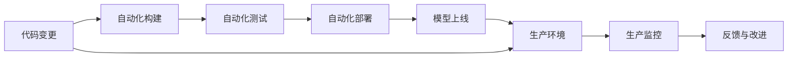

                 

# AI模型的持续集成与部署：Lepton AI的CI/CD实践

> 关键词：持续集成(CI), 持续部署(CD), Lepton AI, DevOps, GitLab CI/CD, 模型版本管理, 模型质量控制

## 1. 背景介绍

在当今的数字化时代，人工智能(AI)模型的集成与部署成为了企业能否快速响应市场变化的关键。随着AI技术的不断进步，模型更新速度和模型复杂度也在不断提升，这对模型的集成与部署提出了更高的要求。Lepton AI作为一家领先的人工智能技术服务提供商，通过在持续集成与持续部署(CI/CD)领域的深度实践，打造了一套高效、稳定的模型集成与部署体系，帮助企业实现模型的快速迭代和高效运维。本文将详细介绍Lepton AI在CI/CD实践中的核心概念、关键技术以及应用案例，希望对广大AI开发者和实践者提供有价值的参考和启示。

## 2. 核心概念与联系

### 2.1 核心概念概述

持续集成(CI)和持续部署(CD)是DevOps文化的重要组成部分，它们旨在提高软件开发的效率和质量，通过自动化工具和流程，实现代码的持续集成、测试和部署。在AI模型集成与部署的上下文中，CI/CD同样扮演着至关重要的角色，其目标是通过自动化和标准化流程，加速模型的开发、测试和上线，确保模型能够快速响应市场需求，并保持高质量和可靠性。

### 2.2 核心概念原理和架构的 Mermaid 流程图



以上流程图展示了Lepton AI在CI/CD实践中采用的主要流程。首先，代码变更被触发，进入自动化构建阶段，构建后的模型被自动部署到生产环境中。同时，生产环境中的模型表现也会被持续监控，并根据监控结果进行反馈与改进，以确保模型的稳定性和性能。

## 3. 核心算法原理 & 具体操作步骤

### 3.1 算法原理概述

Lepton AI的CI/CD实践是基于GitLab CI/CD平台的集成与部署方案，其主要原理和操作步骤如下：

1. **代码变更检测**：当代码库中的代码发生变更时，触发CI/CD流程的第一步。
2. **自动化构建**：代码变更后，自动构建模型，生成可部署的包。
3. **自动化测试**：对构建后的模型进行一系列测试，包括单元测试、集成测试和性能测试。
4. **自动化部署**：将通过测试的模型部署到生产环境。
5. **生产环境监控**：对部署到生产环境中的模型进行持续监控，收集运行数据。
6. **反馈与改进**：根据监控结果，对模型进行优化和改进，进入下一轮迭代。

### 3.2 算法步骤详解

Lepton AI的CI/CD实践主要包括以下步骤：

1. **环境配置**：在GitLab中配置CI/CD管道，包括代码库、构建工具、测试工具和部署工具等。
2. **管道定义**：定义CI/CD管道的工作流程，包括触发条件、构建步骤、测试步骤和部署步骤等。
3. **管道运行**：当代码库中的代码发生变更时，GitLab自动运行预定义的CI/CD管道。
4. **结果分析**：分析构建和测试结果，确保模型质量，并及时发现和解决潜在问题。
5. **持续监控**：部署到生产环境中的模型持续监控，收集运行数据，评估模型性能。
6. **反馈与改进**：根据监控数据和用户反馈，对模型进行持续优化和改进。

### 3.3 算法优缺点

Lepton AI的CI/CD实践具有以下优点：

- **自动化与标准化**：通过自动化和标准化的流程，提高了模型的开发、测试和部署效率，减少了人为错误。
- **持续优化与改进**：通过持续监控和反馈机制，能够快速发现并解决模型问题，确保模型的高质量和稳定性。
- **适应性强**：适用于各种规模和类型的AI模型，包括深度学习模型、强化学习模型、自然语言处理模型等。

同时，该实践也存在以下缺点：

- **初期配置复杂**：需要投入一定的时间和精力来配置CI/CD管道和测试环境。
- **资源消耗高**：特别是对于大规模和复杂的模型，构建、测试和部署的资源消耗较大。
- **模型版本管理**：模型版本的管理和回滚可能带来一定的复杂度，需要良好的版本控制策略。

### 3.4 算法应用领域

Lepton AI的CI/CD实践可以应用于各种AI模型开发和部署场景，包括但不限于：

- **自然语言处理(NLP)**：包括文本分类、情感分析、问答系统等。
- **计算机视觉(CV)**：如图像分类、目标检测、人脸识别等。
- **语音识别(SR)**：如语音转文字、语音识别等。
- **强化学习(RL)**：如自动驾驶、游戏智能等。
- **推荐系统**：如电商推荐、内容推荐等。

## 4. 数学模型和公式 & 详细讲解 & 举例说明

### 4.1 数学模型构建

Lepton AI在模型开发过程中，通常会使用Python和深度学习框架，如TensorFlow或PyTorch，进行模型的构建和训练。模型训练的基本数学模型为：

$$ \theta = \arg\min_{\theta} \frac{1}{N}\sum_{i=1}^N \ell(\hat{y}_i, y_i) $$

其中，$\theta$ 为模型的参数，$\ell$ 为损失函数，$y_i$ 为样本的真实标签，$\hat{y}_i$ 为模型预测的标签。

### 4.2 公式推导过程

以一个简单的线性回归模型为例，公式推导过程如下：

$$ \hat{y} = \theta^T x $$
$$ \ell(\hat{y}, y) = \frac{1}{2N} \sum_{i=1}^N (\hat{y}_i - y_i)^2 $$

模型的梯度更新公式为：

$$ \frac{\partial \ell}{\partial \theta} = \frac{1}{N} \sum_{i=1}^N (x_i - \hat{y}_i)x_i $$

### 4.3 案例分析与讲解

以一个多层的神经网络模型为例，如图1所示，我们通过反向传播算法来计算损失函数对模型参数的梯度，并使用梯度下降算法更新模型参数。

```mermaid
graph LR
    A[x] --> B[隐藏层1] --> C[隐藏层2] --> D[输出层]
    C --> E[损失函数]
    A -- dashed A -- E
```

其中，$x$ 为输入样本，$C$ 为输出层的预测结果，$E$ 为损失函数，$\frac{\partial \ell}{\partial \theta}$ 为损失函数对模型参数的梯度。

## 5. 项目实践：代码实例和详细解释说明

### 5.1 开发环境搭建

Lepton AI的CI/CD实践需要以下开发环境：

- **GitLab**：配置CI/CD管道和版本控制。
- **Docker**：构建和部署模型容器。
- **Kubernetes**：管理和扩展模型容器。
- **Prometheus**：监控和收集模型运行数据。

### 5.2 源代码详细实现

以下是一个基于TensorFlow的简单模型训练示例，展示了模型构建、训练和评估的完整过程。

```python
import tensorflow as tf

# 定义模型
model = tf.keras.Sequential([
    tf.keras.layers.Dense(64, activation='relu', input_shape=(784,)),
    tf.keras.layers.Dense(10, activation='softmax')
])

# 定义损失函数
loss_fn = tf.keras.losses.SparseCategoricalCrossentropy(from_logits=True)

# 编译模型
model.compile(optimizer='adam', loss=loss_fn, metrics=['accuracy'])

# 加载数据集
(x_train, y_train), (x_test, y_test) = tf.keras.datasets.mnist.load_data()

# 数据预处理
x_train = x_train / 255.0
x_test = x_test / 255.0

# 模型训练
model.fit(x_train, y_train, epochs=5, batch_size=32, validation_data=(x_test, y_test))

# 模型评估
test_loss, test_acc = model.evaluate(x_test, y_test, verbose=2)
print('Test accuracy:', test_acc)
```

### 5.3 代码解读与分析

代码中，我们首先定义了一个简单的全连接神经网络模型，并使用交叉熵损失函数进行编译。接着，加载MNIST数据集，并对数据进行预处理。最后，使用模型进行训练，并在测试集上进行评估。

## 6. 实际应用场景

### 6.1 智能客服系统

在智能客服系统中，基于Lepton AI的CI/CD实践，可以快速构建和部署多轮对话模型，并实现实时问答和推荐。例如，当一个用户输入问题时，系统可以即时构建和部署对话模型，快速生成响应，并提供相关推荐服务。

### 6.2 金融舆情监测

在金融舆情监测系统中，基于Lepton AI的CI/CD实践，可以实时监测金融市场动态，并快速生成情感分析结果。例如，当一个财经新闻发布时，系统可以即时构建和部署情感分析模型，对新闻进行情感分类，并生成相关的分析报告。

### 6.3 个性化推荐系统

在个性化推荐系统中，基于Lepton AI的CI/CD实践，可以快速构建和部署推荐模型，并实现实时推荐。例如，当一个用户浏览商品时，系统可以即时构建和部署推荐模型，根据用户行为和商品特征生成个性化的推荐列表。

### 6.4 未来应用展望

未来，随着Lepton AI的CI/CD实践的进一步发展和完善，AI模型的集成与部署将更加高效、稳定和可靠。预计Lepton AI将会在以下几个方面实现新的突破：

1. **自动化与智能化**：引入更先进的自动化工具和算法，进一步提升模型构建、测试和部署的效率和质量。
2. **多模态集成**：支持多模态数据的集成和融合，实现更加全面和准确的模型构建和评估。
3. **自适应与个性化**：根据用户需求和场景特点，实现模型的自适应和个性化配置，提升用户体验和满意度。
4. **边缘计算与移动部署**：支持模型在边缘计算设备和移动设备上的部署和运行，实现更加灵活和高效的模型服务。

## 7. 工具和资源推荐

### 7.1 学习资源推荐

为了帮助开发者系统掌握Lepton AI的CI/CD实践，以下是一些优质的学习资源：

1. **Lepton AI官方文档**：提供详细的CI/CD实践指南和代码示例，适合入门学习和实践。
2. **GitLab CI/CD官方文档**：GitLab提供的CI/CD文档，适合深入了解和配置CI/CD管道。
3. **TensorFlow官方文档**：TensorFlow提供的深度学习框架文档，适合学习模型构建和训练。
4. **Kubernetes官方文档**：Kubernetes提供的容器编排文档，适合学习容器化部署和管理。
5. **Prometheus官方文档**：Prometheus提供的监控和报警系统文档，适合学习模型监控和评估。

### 7.2 开发工具推荐

Lepton AI的CI/CD实践需要以下工具支持：

1. **GitLab**：提供CI/CD管道和版本控制，适合模型集成与部署。
2. **Docker**：提供容器化部署，适合模型构建和测试。
3. **Kubernetes**：提供容器编排和管理，适合模型部署和扩展。
4. **Prometheus**：提供监控和报警，适合模型监控和评估。

### 7.3 相关论文推荐

Lepton AI的CI/CD实践源于学界的持续研究。以下是几篇奠基性的相关论文，推荐阅读：

1. **《持续集成：构建高质量的CI/CD管道》**：探讨了CI/CD管道的构建和优化方法，适合了解基础概念和最佳实践。
2. **《TensorFlow模型优化与部署》**：介绍了TensorFlow模型的构建、训练和部署过程，适合学习模型开发与部署。
3. **《Kubernetes容器编排实践》**：介绍了Kubernetes容器的编排和管理方法，适合学习容器化部署。
4. **《基于Prometheus的模型监控与评估》**：介绍了Prometheus的监控和报警方法，适合学习模型监控与评估。

## 8. 总结：未来发展趋势与挑战

### 8.1 研究成果总结

Lepton AI的CI/CD实践通过自动化和标准化的流程，显著提升了AI模型的集成与部署效率和质量。通过持续监控和反馈机制，确保模型的高质量和稳定性，帮助企业实现快速响应市场需求的目标。

### 8.2 未来发展趋势

未来，Lepton AI的CI/CD实践将向以下几个方向发展：

1. **自动化与智能化**：引入更先进的自动化工具和算法，进一步提升模型构建、测试和部署的效率和质量。
2. **多模态集成**：支持多模态数据的集成和融合，实现更加全面和准确的模型构建和评估。
3. **自适应与个性化**：根据用户需求和场景特点，实现模型的自适应和个性化配置，提升用户体验和满意度。
4. **边缘计算与移动部署**：支持模型在边缘计算设备和移动设备上的部署和运行，实现更加灵活和高效的模型服务。

### 8.3 面临的挑战

尽管Lepton AI的CI/CD实践已经取得了显著成效，但在实现全面自动化和智能化过程中，仍面临以下挑战：

1. **自动化程度不够高**：虽然实现了大部分流程的自动化，但仍需手动配置和调整。
2. **模型版本管理复杂**：模型版本管理需要更加高效和可靠的方法，以避免版本混乱和回滚困难。
3. **资源消耗高**：特别是对于大规模和复杂的模型，构建、测试和部署的资源消耗较大。
4. **模型质量控制难度大**：模型质量的控制需要更加精细化的策略，以确保模型的稳定性和可靠性。

### 8.4 研究展望

面向未来，Lepton AI的CI/CD实践需要在以下几个方面进行深入研究：

1. **自动化与智能化**：引入更先进的自动化工具和算法，进一步提升模型构建、测试和部署的效率和质量。
2. **模型版本管理**：研究更加高效和可靠的版本管理策略，避免版本混乱和回滚困难。
3. **资源优化**：通过优化构建、测试和部署流程，减少资源消耗，提高模型运行效率。
4. **模型质量控制**：引入更精细化的质量控制策略，确保模型的稳定性和可靠性。

这些研究方向的探索，必将引领Lepton AI的CI/CD实践迈向更高的台阶，为AI模型的集成与部署带来新的突破。

## 9. 附录：常见问题与解答

**Q1: 什么是CI/CD？**

A: CI/CD是DevOps文化的重要组成部分，指的是持续集成(Continuous Integration)和持续部署(Continuous Deployment)。持续集成是指通过自动化工具，对代码变更进行频繁的构建和测试，确保代码质量。持续部署是指通过自动化工具，对通过测试的代码进行频繁的部署和发布，确保软件功能的及时上线。

**Q2: 如何配置GitLab CI/CD管道？**

A: 在GitLab中，可以通过以下步骤配置CI/CD管道：

1. 创建一个新的项目，并在项目页面中进入CI/CD配置。
2. 定义构建和测试步骤，选择构建工具和测试工具。
3. 定义部署步骤，选择部署工具和部署目标。
4. 定义监控和反馈机制，选择监控工具和反馈策略。
5. 保存并启动CI/CD管道。

**Q3: 如何优化模型构建和测试的资源消耗？**

A: 可以通过以下方法优化模型构建和测试的资源消耗：

1. 使用多GPU或多CPU加速模型训练和测试。
2. 使用模型裁剪技术，去除不必要的层和参数。
3. 使用混合精度训练，减少内存和计算资源消耗。
4. 使用模型并行技术，提高模型构建和测试的并行度。

**Q4: 如何确保模型的稳定性和可靠性？**

A: 可以通过以下方法确保模型的稳定性和可靠性：

1. 引入测试策略，对模型进行全面的单元测试、集成测试和性能测试。
2. 引入监控策略，对模型进行持续的监控和评估，及时发现和解决潜在问题。
3. 引入回滚机制，确保在出现问题时能够快速回滚到稳定的模型版本。
4. 引入版本管理策略，确保模型版本的清晰和可追溯性。

---

作者：禅与计算机程序设计艺术 / Zen and the Art of Computer Programming

