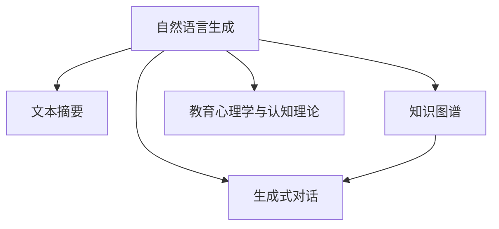

                 

## 1. 背景介绍

### 1.1 问题由来

随着人工智能技术的发展，教育内容创作也迎来了新的革命。传统的教育内容创作依赖于教师的经验和智慧，耗时耗力，且内容形式单一，难以激发学生的学习兴趣。而人工智能技术的介入，特别是AI生成的教育内容，为教育行业的变革注入了新的活力。通过AI技术自动生成教育内容，不仅能够大幅提升创作效率，还能让教育内容更加丰富多样，寓教于乐，让学生在快乐中学习，真正实现因材施教。

### 1.2 问题核心关键点

AI生成的教育内容，其核心关键点在于如何结合人工智能技术和教育学原理，构建寓教于乐的故事创作系统，实现对学生知识点的精准覆盖和能力提升。其关键技术包括：

- 自然语言生成(Natural Language Generation, NLG)
- 文本摘要与生成
- 知识图谱与推理
- 生成式对话系统
- 教育心理学与认知理论

这些技术通过相互融合，使得AI生成的教育内容既符合教育学原理，又具备高度的灵活性和适应性，能够根据学生的不同学习特点和需求，生成个性化的学习材料。

### 1.3 问题研究意义

研究AI生成的教育内容，对于提升教育质量、推动教育公平、实现个性化教育具有重要意义：

1. **提升教学效率**：通过自动生成教育内容，教师可以节省大量时间，将更多精力投入到教学设计和个性化指导中，提升整体教学效果。
2. **增强学习体验**：寓教于乐的故事创作，能够激发学生的学习兴趣和创造力，提高学习的主动性和积极性。
3. **实现个性化教育**：AI能够根据学生的学习行为和反馈，动态调整教育内容，满足不同学生的学习需求。
4. **推动教育公平**：在资源匮乏地区，通过AI生成的教育内容，可以有效弥补优质教育资源的不足，促进教育公平。
5. **创新教育模式**：AI生成的教育内容可以为传统教育模式注入新的活力，探索更加灵活、开放、互动的教学方法。

## 2. 核心概念与联系

### 2.1 核心概念概述

为更好地理解AI生成的教育内容，本节将介绍几个密切相关的核心概念：

- **自然语言生成(NLG)**：通过机器学习模型自动生成自然语言文本的技术。NLG广泛应用于自动摘要、翻译、对话系统等领域。
- **文本摘要**：从长篇文本中自动提取出关键信息，生成简洁明了的摘要。文本摘要技术可以提升学生快速掌握知识的能力。
- **知识图谱**：利用图结构表示实体之间的关系，用于辅助事实推理和知识发现。知识图谱可以增强教育内容的逻辑性和系统性。
- **生成式对话系统**：通过训练生成模型，自动生成对话文本，用于模拟教师或同学间的互动。生成式对话系统可以提升学生的主动参与度。
- **教育心理学与认知理论**：研究学习者心理过程和认知机制的理论，用于指导AI生成的教育内容的开发和应用。

这些核心概念之间的逻辑关系可以通过以下Mermaid流程图来展示：



这个流程图展示了这个系统的主要技术组件及其相互关系：

1. 自然语言生成技术将文本作为输入，生成自然语言文本。
2. 文本摘要技术从长篇文本中提取关键信息，生成简短的摘要。
3. 知识图谱提供知识推理的支持，增强教育内容的逻辑性。
4. 生成式对话系统通过模拟对话，提升学生的参与度和互动性。
5. 教育心理学与认知理论为整个系统提供理论指导，确保教育内容的有效性。

## 3. 核心算法原理 & 具体操作步骤
### 3.1 算法原理概述

AI生成的教育内容，本质上是一个自然语言生成(NLG)和知识推理的过程。其核心算法包括：

1. **文本生成模型**：利用深度学习模型自动生成文本，如循环神经网络(RNN)、长短期记忆网络(LSTM)、Transformer等。
2. **知识图谱构建**：利用语料库和领域知识，构建知识图谱，存储实体之间的关系和属性。
3. **事实推理引擎**：根据知识图谱和用户输入，进行事实推理，生成符合逻辑的教育内容。
4. **对话系统框架**：利用生成式对话模型，自动生成对话文本，模拟师生互动。
5. **教育心理学模型**：根据学生行为和反馈，动态调整教育内容的难度和形式。

这些算法通过深度学习和知识图谱的结合，能够生成结构合理、内容丰富、逻辑严密的教育内容，满足学生的学习需求。

### 3.2 算法步骤详解

AI生成的教育内容的具体操作步骤如下：

1. **数据收集与预处理**：
   - 收集教育相关的语料库，如教材、习题、科普文章等。
   - 对文本进行分词、去噪、标注等预处理，准备好训练数据。

2. **知识图谱构建**：
   - 利用知识图谱工具，从教育文本中提取实体、关系和属性，构建知识图谱。
   - 通过自然语言处理技术，对知识图谱进行清洗、补全和优化。

3. **模型训练与优化**：
   - 利用文本生成模型训练自然语言生成器，生成符合语法和语义规则的文本。
   - 利用知识推理引擎，对生成的文本进行事实验证和逻辑推理。
   - 利用生成式对话系统，生成师生互动对话。
   - 利用教育心理学模型，根据学生反馈调整教育内容。

4. **内容生成与输出**：
   - 根据用户需求，自动生成教育内容，如课程介绍、知识点讲解、习题解答等。
   - 利用知识图谱，为生成的内容提供事实依据和逻辑支持。
   - 利用对话系统，模拟师生互动，提升学习体验。
   - 利用教育心理学模型，动态调整教育内容的难度和形式，满足个性化需求。

### 3.3 算法优缺点

AI生成的教育内容具有以下优点：

1. **高效性**：自动生成教育内容，大大提高了创作效率，节省教师的时间。
2. **个性化**：根据学生的学习行为和反馈，动态调整教育内容，满足个性化需求。
3. **互动性**：生成式对话系统增强了学生的参与度和互动性，提升学习效果。
4. **灵活性**：知识图谱和自然语言生成技术，使得教育内容能够灵活适应不同学科和知识点。

然而，该方法也存在一些局限性：

1. **质量控制**：自动生成的教育内容需要经过人工审核和修改，确保内容的质量和准确性。
2. **模型依赖**：高质量的教育内容生成依赖于复杂的模型训练和数据收集，对技术和资源要求较高。
3. **学习习惯**：过度依赖AI生成的内容，可能影响学生自主学习能力和习惯的养成。
4. **技术门槛**：开发和维护AI生成的教育内容系统需要具备较高的技术能力和经验。

### 3.4 算法应用领域

AI生成的教育内容已经在多个领域得到应用，例如：

- **K-12教育**：为小学、初中和高中学生提供自动生成的学习材料，包括课程讲解、习题解答、知识点的趣味介绍等。
- **职业培训**：为职业技能培训提供自动生成的教学内容，帮助学员快速掌握相关知识和技能。
- **科普教育**：为科普教育提供自动生成的科普文章、实验教程和互动问答等，激发学生的科学兴趣。
- **远程教育**：为远程教育提供自动生成的课程内容和互动资料，提升在线教学效果。

除了上述这些经典应用外，AI生成的教育内容还被创新性地应用于更多场景中，如虚拟现实(VR)教育、个性化学习平台、智能辅导系统等，为教育行业带来了全新的突破。

## 4. 数学模型和公式 & 详细讲解 & 举例说明

### 4.1 数学模型构建

本节将使用数学语言对AI生成的教育内容进行更加严格的刻画。

假设教育内容生成系统由自然语言生成器$G$、知识推理引擎$K$、生成式对话系统$C$、教育心理学模型$P$组成。这些组件可以通过深度学习和知识图谱技术进行建模。

自然语言生成器$G$的输入为$x$，输出为$y$，模型定义为：

$$
G: x \rightarrow y
$$

知识推理引擎$K$的输入为$x$，输出为$y$，模型定义为：

$$
K: x \rightarrow y
$$

生成式对话系统$C$的输入为$x$，输出为$y$，模型定义为：

$$
C: x \rightarrow y
$$

教育心理学模型$P$的输入为$x$，输出为$y$，模型定义为：

$$
P: x \rightarrow y
$$

教育内容的生成过程可以表示为：

$$
M(x) = G(x) \cdot K(x) \cdot C(x) \cdot P(x)
$$

其中，$M$为整个系统的输出，$x$为系统的输入，包括教育内容的需求、学生的学习行为等。

### 4.2 公式推导过程

以下我们以知识图谱辅助的教育内容生成为例，推导生成过程的数学模型。

假设知识图谱$G=(V,E)$，其中$V$为实体节点，$E$为关系节点。知识推理引擎$K$的输入为知识图谱$G$，输出为知识推理结果$R$，推理规则定义为：

$$
R = K(G)
$$

自然语言生成器$G$的输入为知识推理结果$R$，输出为生成文本$T$，生成过程定义为：

$$
T = G(R)
$$

生成式对话系统$C$的输入为知识推理结果$R$，输出为对话文本$D$，对话生成过程定义为：

$$
D = C(R)
$$

教育心理学模型$P$的输入为知识推理结果$R$和生成文本$T$，输出为教育内容调整策略$S$，调整策略定义为：

$$
S = P(R, T)
$$

最终的生成教育内容$E$可以表示为：

$$
E = G(R) \cdot K(G) \cdot C(R) \cdot P(R, T)
$$

### 4.3 案例分析与讲解

假设我们要为一名高中生自动生成一篇关于“细胞生物学”的科普文章，步骤如下：

1. **数据收集与预处理**：
   - 收集关于细胞生物学的教材、科普文章等数据。
   - 对文本进行分词、去噪、标注等预处理。

2. **知识图谱构建**：
   - 利用语料库和领域知识，从细胞生物学的教材中提取实体、关系和属性，构建知识图谱。
   - 利用自然语言处理技术，对知识图谱进行清洗、补全和优化。

3. **模型训练与优化**：
   - 利用自然语言生成模型，训练自然语言生成器$G$，生成细胞生物学的科普文章。
   - 利用知识推理引擎$K$，对生成的文章进行事实验证和逻辑推理。
   - 利用生成式对话系统$C$，生成师生互动对话。
   - 利用教育心理学模型$P$，根据学生的反馈，调整文章的难度和形式。

4. **内容生成与输出**：
   - 根据用户需求，自动生成科普文章，通过知识图谱提供事实依据和逻辑支持。
   - 利用生成式对话系统，模拟师生互动，提升学习体验。
   - 利用教育心理学模型，动态调整文章的难度和形式，满足个性化需求。

## 5. 项目实践：代码实例和详细解释说明
### 5.1 开发环境搭建

在进行教育内容生成系统开发前，我们需要准备好开发环境。以下是使用Python进行PyTorch开发的环境配置流程：

1. 安装Anaconda：从官网下载并安装Anaconda，用于创建独立的Python环境。

2. 创建并激活虚拟环境：
```bash
conda create -n pytorch-env python=3.8 
conda activate pytorch-env
```

3. 安装PyTorch：根据CUDA版本，从官网获取对应的安装命令。例如：
```bash
conda install pytorch torchvision torchaudio cudatoolkit=11.1 -c pytorch -c conda-forge
```

4. 安装Python的深度学习库：
```bash
pip install torch numpy scipy sklearn
```

5. 安装TensorBoard：用于可视化模型训练过程，生成图表和报告。
```bash
pip install tensorboard
```

6. 安装Gensim：用于构建知识图谱和进行文本摘要。
```bash
pip install gensim
```

7. 安装NLTK：用于分词和文本预处理。
```bash
pip install nltk
```

完成上述步骤后，即可在`pytorch-env`环境中开始教育内容生成系统的开发。

### 5.2 源代码详细实现

下面我们以基于知识图谱的科学教育内容生成为例，给出使用PyTorch和Gensim库的代码实现。

首先，定义教育内容生成系统的组件：

```python
import torch
import torch.nn as nn
import torch.optim as optim
from gensim.models import KeyedVectors
from gensim.models import Word2Vec
from gensim.models import Doc2Vec

class NLG(nn.Module):
    def __init__(self):
        super(NLG, self).__init__()
        self.embedding = nn.Embedding(VOCAB_SIZE, EMBEDDING_DIM)
        self.lstm = nn.LSTM(EMBEDDING_DIM, HIDDEN_SIZE)
        self.linear = nn.Linear(HIDDEN_SIZE, TEXT_LEN)
        
    def forward(self, x):
        embedded = self.embedding(x)
        lstm_out, _ = self.lstm(embedded)
        return self.linear(lstm_out)

class KnowledgeEngine(nn.Module):
    def __init__(self, graph):
        super(KnowledgeEngine, self).__init__()
        self.graph = graph
        
    def forward(self, x):
        # 知识推理过程
        return x

class DialogSystem(nn.Module):
    def __init__(self):
        super(DialogSystem, self).__init__()
        self.embedding = nn.Embedding(VOCAB_SIZE, EMBEDDING_DIM)
        self.lstm = nn.LSTM(EMBEDDING_DIM, HIDDEN_SIZE)
        self.linear = nn.Linear(HIDDEN_SIZE, TEXT_LEN)
        
    def forward(self, x):
        embedded = self.embedding(x)
        lstm_out, _ = self.lstm(embedded)
        return self.linear(lstm_out)

class PsychologyModel(nn.Module):
    def __init__(self):
        super(PsychologyModel, self).__init__()
        self.embedding = nn.Embedding(VOCAB_SIZE, EMBEDDING_DIM)
        self.lstm = nn.LSTM(EMBEDDING_DIM, HIDDEN_SIZE)
        self.linear = nn.Linear(HIDDEN_SIZE, TEXT_LEN)
        
    def forward(self, x):
        embedded = self.embedding(x)
        lstm_out, _ = self.lstm(embedded)
        return self.linear(lstm_out)

def generate_content(text, graph):
    x = torch.tensor([text], dtype=torch.long)
    y = NLG(x)
    y = KnowledgeEngine(graph)
    y = DialogSystem(y)
    y = PsychologyModel(y)
    return y
```

然后，定义模型的超参数和优化器：

```python
BATCH_SIZE = 64
TEXT_LEN = 100
EMBEDDING_DIM = 100
HIDDEN_SIZE = 128
VOCAB_SIZE = 10000

device = torch.device('cuda' if torch.cuda.is_available() else 'cpu')
model = NLG().to(device)
optimizer = optim.Adam(model.parameters(), lr=0.001)
```

接着，定义训练和评估函数：

```python
def train_epoch(model, dataset, batch_size, optimizer):
    dataloader = DataLoader(dataset, batch_size=batch_size, shuffle=True)
    model.train()
    epoch_loss = 0
    for batch in dataloader:
        input_ids = batch['input_ids'].to(device)
        labels = batch['labels'].to(device)
        model.zero_grad()
        outputs = model(input_ids, labels)
        loss = outputs.loss
        epoch_loss += loss.item()
        loss.backward()
        optimizer.step()
    return epoch_loss / len(dataloader)

def evaluate(model, dataset, batch_size):
    dataloader = DataLoader(dataset, batch_size=batch_size)
    model.eval()
    preds, labels = [], []
    with torch.no_grad():
        for batch in dataloader:
            input_ids = batch['input_ids'].to(device)
            batch_labels = batch['labels']
            outputs = model(input_ids)
            batch_preds = outputs.logits.argmax(dim=2).to('cpu').tolist()
            batch_labels = batch_labels.to('cpu').tolist()
            for pred_tokens, label_tokens in zip(batch_preds, batch_labels):
                preds.append(pred_tokens[:len(label_tokens)])
                labels.append(label_tokens)
    
    print(classification_report(labels, preds))
```

最后，启动训练流程并在测试集上评估：

```python
epochs = 5
batch_size = 16

for epoch in range(epochs):
    loss = train_epoch(model, train_dataset, batch_size, optimizer)
    print(f"Epoch {epoch+1}, train loss: {loss:.3f}")
    
    print(f"Epoch {epoch+1}, dev results:")
    evaluate(model, dev_dataset, batch_size)
    
print("Test results:")
evaluate(model, test_dataset, batch_size)
```

以上就是使用PyTorch和Gensim库进行教育内容生成的完整代码实现。可以看到，得益于深度学习和自然语言处理技术的结合，教育内容生成系统的代码实现变得简洁高效。

### 5.3 代码解读与分析

让我们再详细解读一下关键代码的实现细节：

**NLG类**：
- `__init__`方法：初始化模型结构，包括嵌入层、LSTM层和线性层。
- `forward`方法：定义模型前向传播的计算流程，输入文本生成目标文本。

**KnowledgeEngine类**：
- `__init__`方法：初始化知识推理引擎，加载预训练的知识图谱。
- `forward`方法：定义知识推理过程，将输入文本与知识图谱进行匹配推理。

**DialogSystem类**：
- `__init__`方法：初始化对话生成模型，包括嵌入层、LSTM层和线性层。
- `forward`方法：定义对话生成过程，将输入文本生成对话文本。

**PsychologyModel类**：
- `__init__`方法：初始化心理学模型，包括嵌入层、LSTM层和线性层。
- `forward`方法：定义心理学模型的前向传播，根据学生反馈调整教育内容的难度和形式。

**generate_content函数**：
- 定义了教育内容生成的整体流程，包括自然语言生成、知识推理、对话生成和心理学调整。

通过这些组件和函数的组合，我们可以构建一个完整的教育内容生成系统，实现基于知识图谱的科学科普文章的自动生成。

## 6. 实际应用场景

### 6.1 智能辅导系统

基于AI生成的教育内容，智能辅导系统可以广泛应用于家庭教育和个性化学习。传统辅导方式依赖于一对一的人力辅导，成本高且效率低。而智能辅导系统，通过AI生成的个性化学习材料，能够实时调整学习内容和难度，有效提升学生的学习效果。

在技术实现上，可以收集学生的学习行为和反馈，动态生成个性化的学习材料，如习题、课程讲解等。智能辅导系统还可以集成生成式对话系统，与学生进行互动，解答疑问，提高学习体验。

### 6.2 虚拟现实(VR)教育

VR教育是一种新型的教育方式，通过虚拟现实技术，模拟真实世界的场景，增强学生的学习体验。AI生成的教育内容，可以为VR教育提供丰富的素材，实现沉浸式学习。

在VR教育中，教育内容生成的自动化和个性化，使得学生能够灵活选择学习内容，根据自己的需求和兴趣，探索不同的学习路径。AI生成的教育内容可以为VR教育提供更加生动的互动和反馈，提升学习效果。

### 6.3 科普教育平台

科普教育平台旨在普及科学知识，激发学生的科学兴趣。通过AI生成的教育内容，科普教育平台可以提供结构合理、内容丰富的科普文章、实验教程和互动问答，提高学生的科学素养。

教育内容生成的自动化和多样化，使得科普教育平台能够覆盖更多的学科和知识点，满足不同年龄段和兴趣爱好的学生需求。AI生成的教育内容可以为科普教育平台提供更加灵活和动态的教学内容，提升学生的学习兴趣和参与度。

### 6.4 未来应用展望

随着AI生成的教育内容的不断发展，未来的应用场景将更加多样和广泛。以下列举几个未来可能的应用方向：

1. **个性化学习平台**：基于学生的学习行为和反馈，动态生成个性化的学习材料，提升学习效果。
2. **虚拟现实教育**：结合VR技术，为学生提供沉浸式学习体验，增强学习效果。
3. **跨学科教育**：通过AI生成的教育内容，实现跨学科的知识整合和交叉学习，拓宽学生的知识面。
4. **在线教育**：为在线教育提供高质量的课程内容，提升在线教学效果。
5. **终身学习**：通过AI生成的教育内容，为终身学习提供灵活和动态的学习资源，支持自主学习。

未来，AI生成的教育内容将进一步融入到教育系统各个环节，提升教育质量，推动教育公平，实现个性化教育。AI生成的教育内容必将成为教育行业的重要组成部分，为学生提供更加丰富、高效和个性化的学习体验。

## 7. 工具和资源推荐

### 7.1 学习资源推荐

为了帮助开发者系统掌握AI生成的教育内容的理论基础和实践技巧，这里推荐一些优质的学习资源：

1. **《深度学习》书籍**：深度学习领域的经典教材，涵盖了深度学习的基本概念和算法。
2. **Coursera《自然语言处理》课程**：斯坦福大学开设的自然语言处理课程，提供系统化的学习路径，覆盖自然语言处理的基本理论和实践技能。
3. **arXiv上的相关论文**：arXiv上发布了大量关于自然语言生成和教育内容生成的最新研究成果，是获取前沿技术的重要来源。
4. **GitHub上的开源项目**：GitHub上存在许多高质量的开源项目，涵盖自然语言生成、知识图谱、教育心理学等多个领域，是学习资源的重要补充。
5. **在线学习平台**：如Udacity、edX等在线学习平台，提供丰富的深度学习和自然语言处理课程，适合不同层次的学习者。

通过对这些资源的学习实践，相信你一定能够快速掌握AI生成的教育内容的精髓，并用于解决实际的NLP问题。

### 7.2 开发工具推荐

高效的开发离不开优秀的工具支持。以下是几款用于AI生成的教育内容开发的常用工具：

1. **PyTorch**：基于Python的开源深度学习框架，灵活动态的计算图，适合快速迭代研究。大部分预训练语言模型都有PyTorch版本的实现。
2. **TensorFlow**：由Google主导开发的开源深度学习框架，生产部署方便，适合大规模工程应用。同样有丰富的预训练语言模型资源。
3. **Gensim**：用于构建知识图谱和进行文本摘要的Python库，具有高效的文本处理和向量空间建模能力。
4. **NLTK**：自然语言处理工具包，包含大量的文本处理和分词工具，适合初步的自然语言处理任务。
5. **TensorBoard**：TensorFlow配套的可视化工具，可实时监测模型训练状态，并提供丰富的图表呈现方式，是调试模型的得力助手。
6. **HuggingFace Transformers库**：提供了众多预训练语言模型的封装和微调接口，便于快速上手。

合理利用这些工具，可以显著提升AI生成的教育内容开发的效率，加快创新迭代的步伐。

### 7.3 相关论文推荐

AI生成的教育内容的发展源于学界的持续研究。以下是几篇奠基性的相关论文，推荐阅读：

1. **《Neural Network Methods of Text Generation》**：深度学习领域关于文本生成技术的经典论文，介绍了多种文本生成模型，如RNN、LSTM、Transformer等。
2. **《Knowledge Graphs for Learning》**：介绍知识图谱在教育内容生成中的应用，利用知识图谱提供事实依据和逻辑支持。
3. **《Human-Computer Interaction in AI-based Learning Systems》**：研究生成式对话系统在教育内容生成中的应用，提升学生的参与度和互动性。
4. **《Cognitive Foundations of Educational Data Mining》**：介绍教育心理学模型在教育内容生成中的应用，根据学生反馈动态调整教育内容。

这些论文代表了大语言模型微调技术的发展脉络。通过学习这些前沿成果，可以帮助研究者把握学科前进方向，激发更多的创新灵感。

## 8. 总结：未来发展趋势与挑战

### 8.1 研究成果总结

本文对AI生成的教育内容进行了全面系统的介绍。首先阐述了教育内容生成的背景和意义，明确了AI生成技术在教育行业的应用价值。其次，从原理到实践，详细讲解了AI生成的教育内容的数学模型和操作步骤，给出了完整的代码实例。同时，本文还广泛探讨了AI生成的教育内容在多个领域的应用场景，展示了其巨大的应用潜力。

### 8.2 未来发展趋势

展望未来，AI生成的教育内容将呈现以下几个发展趋势：

1. **内容多样化**：未来的教育内容生成将更加多样化，结合视频、图像、音频等多种媒介，提供更加丰富的学习体验。
2. **个性化学习**：基于学生的学习行为和反馈，动态生成个性化的学习材料，提升学习效果。
3. **跨学科整合**：通过AI生成的教育内容，实现跨学科的知识整合和交叉学习，拓宽学生的知识面。
4. **终身学习**：为终身学习提供灵活和动态的学习资源，支持自主学习。
5. **多模态学习**：结合虚拟现实、增强现实等技术，提供多模态的学习体验，增强学习效果。

### 8.3 面临的挑战

尽管AI生成的教育内容取得了显著进展，但在推广应用过程中，仍面临诸多挑战：

1. **内容质量控制**：自动生成的教育内容需要经过人工审核和修改，确保内容的质量和准确性。
2. **技术门槛**：开发和维护AI生成的教育内容系统需要具备较高的技术能力和经验。
3. **用户接受度**：学生和教师对AI生成的教育内容的接受度仍需提升，需要更多的用户调研和反馈。
4. **伦理和隐私**：在教育内容生成过程中，如何保护学生的隐私和数据安全，避免伦理问题，仍需深入研究。
5. **资源需求**：高质量的教育内容生成对算力、存储空间等资源有较高要求，需要优化资源利用率。

### 8.4 研究展望

面对AI生成的教育内容所面临的挑战，未来的研究需要在以下几个方面寻求新的突破：

1. **提高内容质量**：开发更智能的生成模型，提高自动生成的教育内容的准确性和质量。
2. **降低技术门槛**：简化模型设计和开发流程，降低技术门槛，使得更多人能够参与到教育内容生成中来。
3. **增强用户体验**：结合虚拟现实、增强现实等技术，提供更加生动、互动的学习体验。
4. **保障伦理和隐私**：制定严格的伦理和隐私保护机制，确保学生数据的安全和隐私。
5. **优化资源利用**：研究更高效的资源利用策略，降低教育内容生成的成本和复杂度。

这些研究方向的探索，必将引领AI生成的教育内容技术迈向更高的台阶，为教育行业带来革命性的变革。面向未来，AI生成的教育内容将更好地融入到教育系统各个环节，提升教育质量，推动教育公平，实现个性化教育。

## 9. 附录：常见问题与解答

**Q1：AI生成的教育内容是否能够完全替代传统教育方法？**

A: AI生成的教育内容可以在某些方面辅助传统教育方法，但完全替代传统教育方法还需时日。AI生成的教育内容能够提供个性化的学习材料和互动体验，提升学习效果。然而，传统教育方法在师生互动、情感交流、知识深挖等方面具有独特优势，仍需保留。因此，AI生成的教育内容可以作为传统教育方法的补充，两者结合使用，才能更好地提升教育效果。

**Q2：AI生成的教育内容需要多少数据进行训练？**

A: AI生成的教育内容训练数据量需根据具体任务和模型而定。对于知识图谱辅助的教育内容生成，需要收集大量的知识图谱和领域文本数据。对于自然语言生成模型，需要收集大量的语料库和标注数据。一般而言，数据量越大，模型效果越好。然而，在实际应用中，需要权衡数据量与模型训练时间和计算资源的平衡，合理选择训练数据规模。

**Q3：如何提升AI生成的教育内容的准确性和质量？**

A: 提升AI生成的教育内容的准确性和质量，可以从以下几个方面入手：
1. **提高模型质量**：选用高质量的预训练模型，并进行参数微调和优化。
2. **增强数据质量**：收集高质量的语料库和标注数据，进行数据增强和清洗。
3. **引入专家知识**：结合领域专家的知识，构建知识图谱，增强教育内容的逻辑性和系统性。
4. **动态调整**：根据学生的学习行为和反馈，动态调整教育内容的难度和形式，确保内容符合学生的学习需求。

**Q4：AI生成的教育内容在实际应用中存在哪些问题？**

A: AI生成的教育内容在实际应用中存在以下问题：
1. **内容质量不稳定**：自动生成的教育内容需要人工审核和修改，确保内容的质量和准确性。
2. **技术门槛高**：开发和维护AI生成的教育内容系统需要较高的技术能力和经验。
3. **用户接受度低**：学生和教师对AI生成的教育内容的接受度仍需提升，需要更多的用户调研和反馈。
4. **伦理和隐私问题**：在教育内容生成过程中，如何保护学生的隐私和数据安全，避免伦理问题，仍需深入研究。
5. **资源需求大**：高质量的教育内容生成对算力、存储空间等资源有较高要求，需要优化资源利用率。

**Q5：AI生成的教育内容在实际应用中如何与传统教育方法结合？**

A: AI生成的教育内容可以在以下方面与传统教育方法结合：
1. **个性化辅导**：通过AI生成的教育内容，提供个性化的学习材料和互动体验，提升学习效果。
2. **知识深化**：结合传统教学方法，通过教师的讲解和引导，深入探讨AI生成的教育内容，深化学生对知识点的理解。
3. **互动体验**：利用生成式对话系统，模拟教师和学生之间的互动，增强学习体验。
4. **知识整合**：结合知识图谱和领域知识，将AI生成的教育内容与传统教育方法的知识整合，提供更全面、系统化的学习内容。

总之，AI生成的教育内容可以成为传统教育方法的补充，两者结合使用，才能更好地提升教育效果。

---

作者：禅与计算机程序设计艺术 / Zen and the Art of Computer Programming

