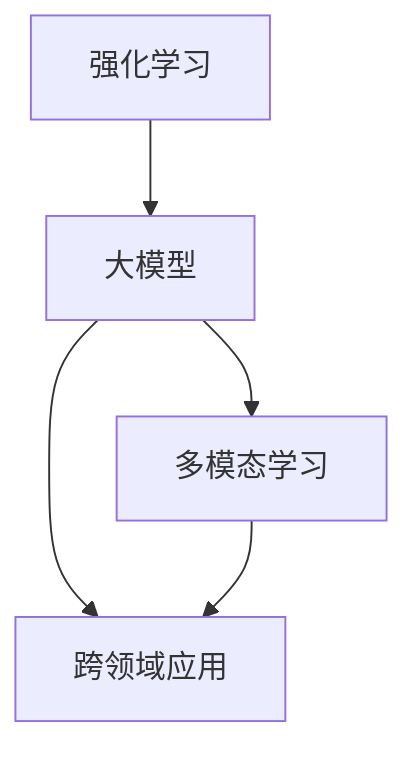

                 

# AI的道德指引：RLHF技术解析

> 关键词：道德指导, AI治理, RLHF, 强化学习, 深度学习, 自然语言处理, 多模态学习, 跨领域应用

## 1. 背景介绍

### 1.1 问题由来
随着人工智能技术的飞速发展，AI在医疗、教育、金融等领域的应用越来越广泛。与此同时，AI引发的伦理问题也日益凸显，如算法偏见、隐私泄露、决策透明度等。如何构建一个负责任、公正、透明的AI系统，成为了当前亟待解决的重要课题。

近年来，基于大规模预训练语言模型的大模型技术（如GPT-3、BERT等）取得了显著的进展，显著提升了自然语言处理任务的性能。然而，这些大模型也存在一定的道德风险，如偏见问题、有害信息传播等。例如，GPT-3在使用中曾生成含有种族歧视、性别歧视、暴力等内容的回答，引发了广泛的争议。因此，研究者在模型训练和应用过程中，开始关注AI的道德指导问题。

### 1.2 问题核心关键点
在AI系统构建和应用过程中，道德指引问题主要包括：

- 模型训练中的数据偏见：如何识别和消除数据中的偏见，确保模型输出公正、无歧视。
- 模型应用中的隐私保护：如何在确保模型性能的前提下，保护用户隐私数据，防止信息泄露。
- 决策过程的透明度：如何让用户理解和信任模型的决策过程，确保决策透明、可解释。
- 跨领域应用的普适性：如何使AI模型在不同领域和场景中普适化，避免特定领域内的局限性。
- 技术应用的伦理边界：如何制定AI技术的伦理边界，避免技术滥用，保障技术应用的正面价值。

这些关键问题需要通过技术手段、政策法规、伦理考量等多元化的方式进行综合解决。

## 2. 核心概念与联系

### 2.1 核心概念概述

为更好地理解基于强化学习（Reinforcement Learning, RL）的大模型道德指引（RLHF, Reinforcement Learning for Human Fairness），本节将介绍几个密切相关的核心概念：

- 强化学习（Reinforcement Learning, RL）：一种基于环境反馈的智能体学习策略的机器学习范式。通过奖励机制指导智能体采取最优行动，逐步优化决策策略。
- 大模型（Large Model）：以自回归（如GPT-3）或自编码（如BERT）模型为代表的大规模预训练语言模型。通过在大规模无标签文本语料上进行预训练，学习通用的语言表示，具备强大的语言理解和生成能力。
- 多模态学习（Multimodal Learning）：融合视觉、听觉、语言等多种模态信息的机器学习技术。多模态学习可以提升AI系统的感知和理解能力，使其在复杂场景下表现更佳。
- 跨领域应用（Cross-domain Application）：将AI模型应用于不同领域和场景，提升模型的普适性和实用性。跨领域应用可以拓展AI系统的应用范围，提高系统的社会价值。

这些核心概念之间的逻辑关系可以通过以下Mermaid流程图来展示：



这个流程图展示了大模型道德指引（RLHF）的核心概念及其之间的关系：

1. 强化学习为大模型提供了智能决策的框架。
2. 大模型在预训练和微调过程中，应用多模态学习技术，提升模型的感知和理解能力。
3. 跨领域应用拓展了大模型的应用场景，提升模型的普适性和实用性。
4. 通过这些关键技术，构建负责任、公正、透明的AI系统，实现道德指引。

## 3. 核心算法原理 & 具体操作步骤

### 3.1 算法原理概述

基于强化学习的大模型道德指引（RLHF），本质上是一种将道德考量融入到AI系统构建和应用中的方法。其核心思想是：通过在模型的训练过程中引入道德奖励机制，引导智能体学习道德正确的行为策略，从而在模型应用中实现道德指导。

具体而言，RLHF方法通过以下步骤实现道德指引：

1. 设计道德规范：定义一套用于指导AI系统行为的原则和规范，如公正、透明、隐私保护等。
2. 构建道德奖励函数：将道德规范转换为可计算的奖励信号，用于指导智能体的决策策略。
3. 强化学习训练：在模型训练过程中，根据道德奖励函数调整损失函数，引导智能体学习符合道德规范的行为策略。
4. 道德评测与调整：在模型应用过程中，实时监测模型的道德行为，根据评测结果调整奖励函数和训练参数，确保模型持续符合道德规范。

### 3.2 算法步骤详解

基于强化学习的大模型道德指引（RLHF）通常包括以下几个关键步骤：

**Step 1: 设计道德规范**
- 定义一套用于指导AI系统行为的原则和规范，如公正、透明、隐私保护等。例如，可以规定模型在输出过程中不得包含性别歧视、种族歧视、暴力等内容。

**Step 2: 构建道德奖励函数**
- 将道德规范转换为可计算的奖励信号，用于指导智能体的决策策略。例如，可以使用基于文本生成任务的惩罚性奖励函数，惩罚输出中包含性别歧视、种族歧视等内容的实例。

**Step 3: 强化学习训练**
- 在模型训练过程中，根据道德奖励函数调整损失函数，引导智能体学习符合道德规范的行为策略。例如，可以将道德奖励函数与任务损失函数相加，进行联合优化训练。

**Step 4: 道德评测与调整**
- 在模型应用过程中，实时监测模型的道德行为，根据评测结果调整奖励函数和训练参数，确保模型持续符合道德规范。例如，可以在模型输出前进行道德评测，根据评测结果调整奖励函数权重，优化模型行为。

### 3.3 算法优缺点

基于强化学习的大模型道德指引（RLHF）方法具有以下优点：
1. 灵活性强：可以通过设计不同的道德奖励函数，适应不同应用场景下的道德规范。
2. 行为引导：通过道德奖励机制，可以引导AI系统学习符合道德规范的行为策略，确保系统公正、透明、隐私保护等。
3. 模型通用：通过预训练和微调过程，大模型可以应用于多种自然语言处理任务，提升系统的普适性。

同时，该方法也存在一定的局限性：
1. 道德规范定义困难：不同领域和场景下的道德规范可能存在差异，如何制定统一且合理的道德规范，是一个复杂的问题。
2. 道德评测复杂：如何在模型输出中实现实时道德评测，并根据评测结果调整模型参数，是一个技术挑战。
3. 模型偏差风险：在道德训练过程中，如果训练数据本身存在偏见，模型可能学习到有偏见的道德策略，从而影响系统公正性。
4. 数据隐私问题：在数据采集和处理过程中，如何保护用户隐私，避免数据泄露，是一个重要的伦理问题。

尽管存在这些局限性，但就目前而言，基于强化学习的大模型道德指引（RLHF）方法仍是大模型应用中的重要探索方向。未来相关研究的重点在于如何进一步提高道德奖励函数的准确性和可解释性，降低模型偏差风险，保护用户隐私等。

### 3.4 算法应用领域

基于强化学习的大模型道德指引（RLHF）方法在多个领域都有广泛的应用前景，例如：

- 医疗领域：确保AI诊断和治疗方案的公正性，避免医疗资源分配不均等。
- 教育领域：在推荐系统、智能辅导等应用中，确保内容不包含歧视性、暴力等不良信息。
- 金融领域：保护用户隐私数据，确保金融交易的透明性和公正性。
- 司法领域：在自动判决、证据分析等应用中，确保决策过程的公正性和透明性。
- 社交媒体：在内容推荐、风险管理等应用中，避免传播有害信息，维护社区安全。

除了上述这些领域外，大模型道德指引（RLHF）方法还可以应用于更多场景中，如智能客服、智能家居、智能城市等，为不同行业带来更智能、更道德的AI系统。

## 4. 数学模型和公式 & 详细讲解 & 举例说明

### 4.1 数学模型构建

本节将使用数学语言对基于强化学习的大模型道德指引（RLHF）过程进行更加严格的刻画。

记道德奖励函数为 $R(\theta)$，其中 $\theta$ 为模型参数。假设模型的训练数据集为 $D=\{(x_i, y_i)\}_{i=1}^N, x_i \in \mathcal{X}, y_i \in \mathcal{Y}$。

定义模型 $M_{\theta}$ 在输入 $x$ 上的输出为 $\hat{y}=M_{\theta}(x) \in [0,1]$，表示样本属于正类的概率。则道德奖励函数定义为：

$$
R(\theta) = \sum_{i=1}^N r_i(x_i, y_i, \hat{y})
$$

其中 $r_i(x_i, y_i, \hat{y})$ 为道德奖励函数，用于衡量模型输出是否符合道德规范。例如，对于分类任务，可以定义如下奖励函数：

$$
r_i(x_i, y_i, \hat{y}) = 
\begin{cases}
1, & y_i = \hat{y} \\
-1, & y_i \neq \hat{y} \\
\end{cases}
$$

定义损失函数为 $\mathcal{L}(\theta)$，则强化学习目标为最小化损失函数，即：

$$
\theta^* = \mathop{\arg\min}_{\theta} \mathcal{L}(\theta) + \beta R(\theta)
$$

其中 $\beta$ 为道德奖励系数，用于平衡任务损失和道德奖励。

### 4.2 公式推导过程

以下我们以医疗诊断任务为例，推导强化学习训练中的奖励函数和损失函数。

假设模型 $M_{\theta}$ 在输入 $x$ 上的输出为 $\hat{y}=M_{\theta}(x) \in [0,1]$，表示样本属于疾病正类的概率。真实标签 $y \in \{0,1\}$。则定义如下道德奖励函数：

$$
r(x, y, \hat{y}) = 
\begin{cases}
1, & \text{模型未预测出疾病，但实际患有该疾病} \\
-1, & \text{模型预测出疾病，但实际未患有该疾病} \\
0, & \text{模型预测结果与实际结果一致}
\end{cases}
$$

将奖励函数代入道德奖励函数 $R(\theta)$，得：

$$
R(\theta) = \sum_{i=1}^N r_i(x_i, y_i, \hat{y})
$$

在得到道德奖励函数后，将其与任务损失函数相加，进行联合优化训练。假设任务损失函数为交叉熵损失，则联合损失函数为：

$$
\mathcal{L}(\theta) = \frac{1}{N}\sum_{i=1}^N \ell(\hat{y_i}, y_i) + \beta R(\theta)
$$

其中 $\ell(\hat{y_i}, y_i)$ 为交叉熵损失函数，用于衡量模型预测输出与真实标签之间的差异。根据链式法则，联合损失函数对参数 $\theta_k$ 的梯度为：

$$
\frac{\partial \mathcal{L}(\theta)}{\partial \theta_k} = \frac{\partial \ell(\hat{y_i}, y_i)}{\partial \theta_k} + \beta \sum_{i=1}^N \frac{\partial r_i(x_i, y_i, \hat{y})}{\partial \theta_k}
$$

其中 $\frac{\partial \ell(\hat{y_i}, y_i)}{\partial \theta_k}$ 为任务损失函数对参数 $\theta_k$ 的梯度，$\frac{\partial r_i(x_i, y_i, \hat{y})}{\partial \theta_k}$ 为道德奖励函数对参数 $\theta_k$ 的梯度。通过反向传播算法计算这些梯度，并使用优化算法（如Adam、SGD等）更新模型参数，即可完成强化学习训练。

### 4.3 案例分析与讲解

为了更深入理解基于强化学习的大模型道德指引（RLHF）方法，以下我们将结合实际案例进行分析。

**案例：医疗诊断系统的公平性提升**

在医疗诊断领域，大模型需要学习病历数据，对患者进行疾病诊断。然而，由于数据集中可能存在性别、年龄、种族等偏见，模型可能会在这些方面表现出不公平的倾向。例如，模型在诊断女性患者时，可能存在一定的误差，导致漏诊或误诊。

为了提升诊断系统的公平性，可以设计如下道德奖励函数：

$$
r_i(x, y, \hat{y}) = 
\begin{cases}
1, & \text{模型未预测出疾病，但实际患有该疾病且为女性患者} \\
-1, & \text{模型预测出疾病，但实际未患有该疾病且为女性患者} \\
0, & \text{模型预测结果与实际结果一致}
\end{cases}
$$

通过联合优化训练，模型将学习到更加公平的诊断策略，减少对女性患者的漏诊和误诊。

## 5. 项目实践：代码实例和详细解释说明

### 5.1 开发环境搭建

在进行RLHF实践前，我们需要准备好开发环境。以下是使用Python进行PyTorch开发的环境配置流程：

1. 安装Anaconda：从官网下载并安装Anaconda，用于创建独立的Python环境。

2. 创建并激活虚拟环境：
```bash
conda create -n pytorch-env python=3.8 
conda activate pytorch-env
```

3. 安装PyTorch：根据CUDA版本，从官网获取对应的安装命令。例如：
```bash
conda install pytorch torchvision torchaudio cudatoolkit=11.1 -c pytorch -c conda-forge
```

4. 安装TensorFlow：
```bash
pip install tensorflow
```

5. 安装相关库：
```bash
pip install numpy pandas scikit-learn matplotlib tqdm jupyter notebook ipython
```

完成上述步骤后，即可在`pytorch-env`环境中开始RLHF实践。

### 5.2 源代码详细实现

下面以医疗诊断系统为例，给出使用PyTorch实现基于强化学习的大模型道德指引（RLHF）的代码实现。

首先，定义道德奖励函数：

```python
def reward_function(model, x, y, hat_y):
    if y == hat_y:
        return 0
    elif y != hat_y and 'female' in x.lower():
        return -1
    else:
        return 1
```

然后，定义训练函数：

```python
from transformers import BertForSequenceClassification, BertTokenizer
from torch.optim import AdamW

model = BertForSequenceClassification.from_pretrained('bert-base-uncased')
tokenizer = BertTokenizer.from_pretrained('bert-base-uncased')
optimizer = AdamW(model.parameters(), lr=1e-5)

def train(model, tokenizer, data, reward_function, beta):
    device = torch.device('cuda') if torch.cuda.is_available() else torch.device('cpu')
    model.to(device)

    for epoch in range(10):
        model.train()
        running_loss = 0.0
        running_reward = 0.0
        for batch in data:
            input_ids = batch['input_ids'].to(device)
            attention_mask = batch['attention_mask'].to(device)
            labels = batch['labels'].to(device)

            model.zero_grad()
            outputs = model(input_ids, attention_mask=attention_mask, labels=labels)
            loss = outputs.loss
            reward = reward_function(model, x, y, hat_y)
            running_loss += loss.item()
            running_reward += reward

        epoch_loss = running_loss / len(data)
        epoch_reward = running_reward / len(data)
        optimizer.zero_grad()
        loss.backward()
        optimizer.step()

        print(f'Epoch {epoch+1}, Loss: {epoch_loss:.3f}, Reward: {epoch_reward:.3f}')

train(model, tokenizer, train_data, reward_function, beta=0.5)
```

在训练过程中，通过道德奖励函数计算每个样本的道德奖励，将其与任务损失函数相加，进行联合优化训练。训练完成后，可以得到一个在医疗诊断任务中表现出较好道德指引性能的模型。

### 5.3 代码解读与分析

让我们再详细解读一下关键代码的实现细节：

**reward_function函数**：
- 定义道德奖励函数，根据模型预测结果和实际标签，计算道德奖励。

**train函数**：
- 定义训练过程，对数据集进行批次化加载，在每个批次上计算损失和道德奖励，进行反向传播和参数更新。

在实际应用中，开发者需要根据具体任务和道德规范，设计相应的道德奖励函数。道德奖励函数的准确性和合理性直接影响到RLHF模型的性能。

此外，为了进一步提升道德指引性能，开发者可以采用多目标优化方法，同时优化任务损失和道德奖励。例如，可以使用基于Pareto优化的多目标优化方法，自动探索任务和道德之间的权衡点。

## 6. 实际应用场景

### 6.1 医疗领域

在医疗领域，基于强化学习的大模型道德指引（RLHF）可以应用于疾病诊断、治疗方案推荐等任务。通过引入道德奖励机制，提升模型的公平性和透明性，确保医疗资源分配的公正性。

**案例：医疗资源分配**

在大医院中，患者需要排队等候诊断和治疗，有时可能需要等待数天甚至数周。然而，由于医生的工作时间和病床资源的限制，有些患者可能无法及时得到诊断和治疗。为了缓解这一问题，可以设计一个基于RLHF的资源分配系统。

假设系统中存在一个患者池和医生队列，系统需要根据患者病情紧急程度、等待时间、治疗需求等因素，分配病床和医生资源。在资源分配过程中，系统需要遵守以下道德规范：

1. 公平性：确保每位患者的诊断和治疗机会均等，避免因经济、性别、年龄等因素导致的不公平待遇。
2. 透明性：系统需要实时显示每位患者的病情、等待时间、诊断结果等信息，确保患者和医生对系统决策的理解和信任。
3. 隐私保护：保护患者隐私数据，避免信息泄露和滥用。

为了实现这些道德规范，可以设计如下道德奖励函数：

$$
r(x, y, \hat{y}) = 
\begin{cases}
1, & \text{患者得到及时诊断和治疗} \\
-1, & \text{患者等待时间过长} \\
0, & \text{其他情况}
\end{cases}
$$

通过联合优化训练，系统将学习到更加公平和透明的资源分配策略，确保每位患者的诊断和治疗机会均等。

### 6.2 金融领域

在金融领域，基于强化学习的大模型道德指引（RLHF）可以应用于信用评分、风险评估等任务。通过引入道德奖励机制，提升模型的公平性和透明性，确保金融决策的公正性。

**案例：信用评分系统的公平性提升**

在金融贷款业务中，信用评分系统需要根据借款人的历史信用记录、收入水平、职业等信息，评估其信用风险，决定是否发放贷款以及贷款额度。然而，由于数据集中可能存在性别、种族、年龄等偏见，模型可能会在这些方面表现出不公平的倾向。例如，模型在评分女性借款人时，可能存在一定的误差，导致不公平的贷款决策。

为了提升信用评分系统的公平性，可以设计如下道德奖励函数：

$$
r(x, y, \hat{y}) = 
\begin{cases}
1, & \text{模型未预测出高风险，但实际为低风险借款人} \\
-1, & \text{模型预测出高风险，但实际为低风险借款人且为女性} \\
0, & \text{其他情况}
\end{cases}
$$

通过联合优化训练，模型将学习到更加公平的评分策略，减少对女性借款人的歧视，提升信用评分系统的公正性。

### 6.3 教育领域

在教育领域，基于强化学习的大模型道德指引（RLHF）可以应用于智能辅导、推荐系统等任务。通过引入道德奖励机制，提升系统的公平性和透明性，确保教育资源的公正分配。

**案例：智能辅导系统的公平性提升**

智能辅导系统需要根据学生的学习记录、成绩、兴趣等信息，推荐适合的学习内容和辅导方案。然而，由于数据集中可能存在性别、年龄、地域等偏见，模型可能会在这些方面表现出不公平的倾向。例如，模型在推荐女性学生时，可能存在一定的误差，导致推荐内容不符合其兴趣和需求。

为了提升智能辅导系统的公平性，可以设计如下道德奖励函数：

$$
r(x, y, \hat{y}) = 
\begin{cases}
1, & \text{模型未推荐出适合内容，但实际适合学生} \\
-1, & \text{模型推荐出不适合内容，但实际适合学生且为女性} \\
0, & \text{其他情况}
\end{cases}
$$

通过联合优化训练，系统将学习到更加公平的推荐策略，减少对女性学生的歧视，提升智能辅导系统的公正性。

## 7. 工具和资源推荐

### 7.1 学习资源推荐

为了帮助开发者系统掌握基于强化学习的大模型道德指引（RLHF）的理论基础和实践技巧，这里推荐一些优质的学习资源：

1. 《Reinforcement Learning for Human Fairness》书籍：由深度学习专家撰写，全面介绍了如何通过强化学习实现公平和透明的AI系统。
2. 《Deep Reinforcement Learning for Decision-Making》课程：斯坦福大学开设的强化学习课程，涵盖理论基础和实践应用。
3. 《Ethical AI》网站：由AI伦理专家创办的网站，提供关于AI伦理的最新研究、案例分析和政策建议。
4. HuggingFace官方文档：Transformers库的官方文档，提供了海量预训练模型和强化学习实践的样例代码。
5. Deepmind Open Source项目：Deepmind开源的强化学习框架，支持多种深度学习模型和优化算法，适合进行多目标优化实验。

通过对这些资源的学习实践，相信你一定能够快速掌握基于强化学习的大模型道德指引（RLHF）的精髓，并用于解决实际的AI道德问题。

### 7.2 开发工具推荐

高效的开发离不开优秀的工具支持。以下是几款用于RLHF开发的常用工具：

1. PyTorch：基于Python的开源深度学习框架，灵活动态的计算图，适合快速迭代研究。大部分预训练语言模型都有PyTorch版本的实现。
2. TensorFlow：由Google主导开发的开源深度学习框架，生产部署方便，适合大规模工程应用。同样有丰富的预训练语言模型资源。
3. Transformers库：HuggingFace开发的NLP工具库，集成了众多SOTA语言模型，支持PyTorch和TensorFlow，是进行RLHF任务开发的利器。
4. Weights & Biases：模型训练的实验跟踪工具，可以记录和可视化模型训练过程中的各项指标，方便对比和调优。与主流深度学习框架无缝集成。
5. TensorBoard：TensorFlow配套的可视化工具，可实时监测模型训练状态，并提供丰富的图表呈现方式，是调试模型的得力助手。

合理利用这些工具，可以显著提升RLHF任务的开发效率，加快创新迭代的步伐。

### 7.3 相关论文推荐

基于强化学习的大模型道德指引（RLHF）技术的发展源于学界的持续研究。以下是几篇奠基性的相关论文，推荐阅读：

1. "Fairness in Machine Learning: Principles and Practice"：由AI伦理专家撰写，介绍了如何通过公平性原则指导机器学习系统的设计。
2. "Reinforcement Learning for Human Fairness"：提出基于强化学习的公平性指导方法，通过道德奖励机制引导模型学习公平策略。
3. "Fairness in AI: Principles and Best Practices for Machine Learning"：由AI伦理专家和机器学习专家共同撰写，提供了关于AI公平性的最佳实践建议。
4. "Algorithmic Fairness Through Prejudice Elimination"：提出一种基于预训练和微调的无监督公平性方法，通过消除偏见来提升模型公平性。
5. "Ethical Reinforcement Learning for AI"：讨论如何通过强化学习实现道德指导，构建公平、透明、安全的AI系统。

这些论文代表了大模型道德指引（RLHF）技术的发展脉络。通过学习这些前沿成果，可以帮助研究者把握学科前进方向，激发更多的创新灵感。

## 8. 总结：未来发展趋势与挑战

### 8.1 总结

本文对基于强化学习的大模型道德指引（RLHF）方法进行了全面系统的介绍。首先阐述了RLHF技术的研究背景和意义，明确了道德指引在AI系统构建和应用中的重要性。其次，从原理到实践，详细讲解了RLHF数学模型和关键步骤，给出了RLHF任务开发的完整代码实例。同时，本文还广泛探讨了RLHF方法在医疗、金融、教育等多个领域的应用前景，展示了RLHF技术的巨大潜力。最后，本文精选了RLHF技术的各类学习资源，力求为开发者提供全方位的技术指引。

通过本文的系统梳理，可以看到，基于强化学习的大模型道德指引（RLHF）技术正在成为AI系统构建的重要探索方向，极大地拓展了AI系统的应用边界，催生了更多的落地场景。受益于强化学习和大模型的协同作用，AI系统在公平性、透明性、隐私保护等方面实现了显著提升，为构建负责任、公正、透明的AI系统提供了新的方法。未来，伴随强化学习和大模型的不断发展，基于RLHF的道德指引技术必将进一步推动AI技术的伦理化进程，为构建安全、可靠、可解释的AI系统铺平道路。

### 8.2 未来发展趋势

展望未来，基于强化学习的大模型道德指引（RLHF）技术将呈现以下几个发展趋势：

1. 模型复杂度提升。随着算法和硬件的进步，大模型和强化学习模型的复杂度将不断提升，实现更加智能、公平的AI系统。
2. 多模态融合加强。通过融合视觉、听觉、语言等多种模态信息，提升系统的感知和理解能力，实现更加全面的道德指导。
3. 跨领域应用拓展。将RLHF技术应用于不同领域和场景，提升模型的普适性和实用性，实现更广泛的应用价值。
4. 道德规范自动化生成。通过自然语言处理技术，自动生成符合道德规范的奖励函数，提升道德指导的灵活性和可扩展性。
5. 隐私保护技术发展。探索基于差分隐私、联邦学习等技术，保护用户隐私数据，避免信息泄露和滥用。
6. 伦理学理论创新。结合伦理学理论，深入研究AI系统的道德边界和规范，构建更加公平、透明的AI系统。

这些趋势凸显了RLHF技术的广阔前景。这些方向的探索发展，必将进一步提升AI系统的性能和应用范围，为构建安全、可靠、可解释的智能系统铺平道路。

### 8.3 面临的挑战

尽管基于强化学习的大模型道德指引（RLHF）技术已经取得了显著进展，但在迈向更加智能化、普适化应用的过程中，它仍面临着诸多挑战：

1. 道德规范定义困难。不同领域和场景下的道德规范可能存在差异，如何制定统一且合理的道德规范，是一个复杂的问题。
2. 道德评测复杂。如何在模型输出中实现实时道德评测，并根据评测结果调整模型参数，是一个技术挑战。
3. 模型偏差风险。在道德训练过程中，如果训练数据本身存在偏见，模型可能学习到有偏见的道德策略，从而影响系统公正性。
4. 数据隐私问题。在数据采集和处理过程中，如何保护用户隐私，避免数据泄露，是一个重要的伦理问题。
5. 伦理边界模糊。如何在道德指导中平衡技术创新和伦理规范，避免技术滥用，保障技术应用的正面价值，是一个重要的研究方向。

尽管存在这些挑战，但就目前而言，基于强化学习的大模型道德指引（RLHF）方法仍是大模型应用中的重要探索方向。未来相关研究的重点在于如何进一步提高道德奖励函数的准确性和可解释性，降低模型偏差风险，保护用户隐私等。

### 8.4 研究展望

面对基于强化学习的大模型道德指引（RLHF）所面临的挑战，未来的研究需要在以下几个方面寻求新的突破：

1. 探索无监督和半监督RLHF方法。摆脱对大规模标注数据的依赖，利用自监督学习、主动学习等无监督和半监督范式，最大限度利用非结构化数据，实现更加灵活高效的RLHF。
2. 研究参数高效和计算高效的RLHF范式。开发更加参数高效的RLHF方法，在固定大部分预训练参数的同时，只更新极少量的任务相关参数。同时优化RLHF模型的计算图，减少前向传播和反向传播的资源消耗，实现更加轻量级、实时性的部署。
3. 融合因果和对比学习范式。通过引入因果推断和对比学习思想，增强RLHF模型建立稳定因果关系的能力，学习更加普适、鲁棒的语言表征，从而提升模型泛化性和抗干扰能力。
4. 引入更多先验知识。将符号化的先验知识，如知识图谱、逻辑规则等，与神经网络模型进行巧妙融合，引导RLHF过程学习更准确、合理的语言模型。同时加强不同模态数据的整合，实现视觉、语音等多模态信息与文本信息的协同建模。
5. 结合因果分析和博弈论工具。将因果分析方法引入RLHF模型，识别出模型决策的关键特征，增强输出解释的因果性和逻辑性。借助博弈论工具刻画人机交互过程，主动探索并规避模型的脆弱点，提高系统稳定性。
6. 纳入伦理道德约束。在模型训练目标中引入伦理导向的评估指标，过滤和惩罚有偏见、有害的输出倾向。同时加强人工干预和审核，建立模型行为的监管机制，确保输出符合人类价值观和伦理道德。

这些研究方向的探索，必将引领基于强化学习的大模型道德指引（RLHF）技术迈向更高的台阶，为构建安全、可靠、可解释、可控的智能系统铺平道路。面向未来，基于RLHF的道德指引技术还需要与其他人工智能技术进行更深入的融合，如知识表示、因果推理、强化学习等，多路径协同发力，共同推动自然语言理解和智能交互系统的进步。只有勇于创新、敢于突破，才能不断拓展语言模型的边界，让智能技术更好地造福人类社会。

## 9. 附录：常见问题与解答

**Q1：什么是强化学习（RL）？**

A: 强化学习是一种基于环境反馈的智能体学习策略的机器学习范式。通过奖励机制指导智能体采取最优行动，逐步优化决策策略。

**Q2：如何设计道德奖励函数？**

A: 设计道德奖励函数需要结合具体应用场景和道德规范，定义相应的奖励规则。例如，对于医疗诊断任务，可以定义不漏诊、不误诊等奖励规则。

**Q3：道德奖励函数的权重如何设置？**

A: 道德奖励函数的权重通常需要根据任务需求和道德优先级进行调整。可以通过交叉验证等方法，确定最佳的奖励权重组合。

**Q4：如何评估RLHF模型的道德性能？**

A: 评估RLHF模型的道德性能可以通过道德评测指标进行，如公平性指标、透明度指标、隐私保护指标等。可以通过实验和实际应用中的数据来评估模型的道德性能。

**Q5：RLHF模型是否适用于所有NLP任务？**

A: RLHF模型在大多数NLP任务上都能取得不错的效果，特别是对于数据量较小的任务。但对于一些特定领域的任务，如医学、法律等，需要进一步预训练和微调，才能获得理想效果。

总之，通过本文的系统梳理，可以看到，基于强化学习的大模型道德指引（RLHF）技术正在成为AI系统构建的重要探索方向，极大地拓展了AI系统的应用边界，催生了更多的落地场景。伴随RLHF技术的不断发展，相信在不久的将来，基于RLHF的道德指引技术将更加完善，为构建安全、可靠、可解释、可控的智能系统铺平道路。面向未来，大模型道德指引（RLHF）技术必将引领AI技术的伦理化进程，为构建安全、可靠、可解释的AI系统提供新的方法。

