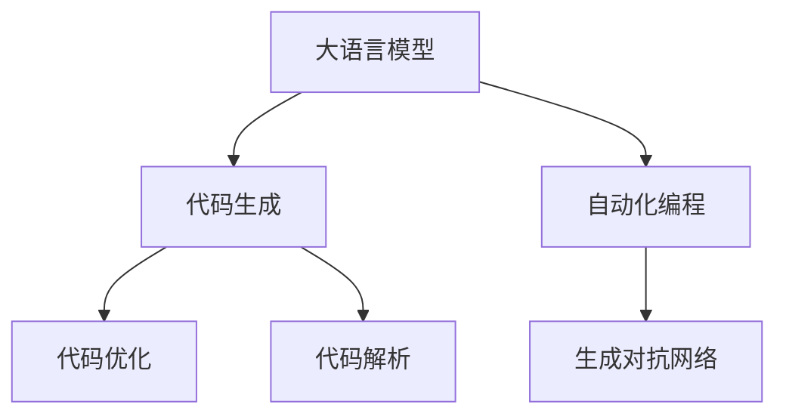

                 

# AI编程新思路：LLM时代的编码方式

> 关键词：大语言模型,LLM,自然语言处理,NLP,编程,编码,自动化,深度学习,代码生成,Prompt设计,语言模型,人工智能,编程范式

## 1. 背景介绍

### 1.1 问题由来
随着人工智能技术的飞速发展，特别是大语言模型（Large Language Models, LLMs）的崛起，编程范式和工具也开始发生变化。传统编程以人类为中心，通过编写代码实现特定功能，但这一过程既耗时又容易出错。而大语言模型提供了全新的编码方式，能够自动生成符合人类期望的代码，大大简化了编程工作。

### 1.2 问题核心关键点
LLM时代的编码方式主要基于大语言模型，通过自然语言指令，让模型自动生成、调试、优化代码。这种范式极大地降低了编程难度，提高了开发效率，同时推动了自动化编程、生成对抗网络（GANs）等前沿技术的发展。

### 1.3 问题研究意义
研究LLM时代的编码方式，对于提升软件开发效率，降低编程门槛，加速人工智能技术的产业化进程，具有重要意义：

1. 提升开发效率。自动化的代码生成可以大幅减少人类编写代码的时间，使得团队能够更专注于算法和业务逻辑的设计。
2. 降低编程门槛。自然语言指令使得非程序员也能够轻松地进行编程任务，推动编程普及。
3. 加速产业化。自动化编程可以降低软件开发的成本，加速AI技术的商业应用。
4. 推动创新。代码生成技术催生了更多的编程工具和应用，推动了AI领域的技术进步。
5. 促进教育。编程工具的智能化可以更好地辅助学生学习编程，提升教育效果。

## 2. 核心概念与联系

### 2.1 核心概念概述

为更好地理解LLM时代的编码方式，本节将介绍几个密切相关的核心概念：

- 大语言模型(Large Language Model, LLM)：以自回归(如GPT)或自编码(如BERT)模型为代表的大规模预训练语言模型。通过在大规模无标签文本语料上进行预训练，学习通用的语言表示，具备强大的语言理解和生成能力。

- 自然语言处理(Natural Language Processing, NLP)：研究如何让计算机理解、解释、处理和生成人类语言的技术。大语言模型在此领域的应用，尤其是在编码生成方面，有着巨大的潜力。

- 自动化编程(Automated Programming)：通过自动化工具自动生成、调试、优化代码的过程。大语言模型在此方向上有着广泛的应用。

- 生成对抗网络(Generative Adversarial Networks, GANs)：通过两个模型（生成器和判别器）之间的对抗训练，生成高质量的输出。在代码生成中，GANs可以生成更符合要求的代码片段。

- 代码生成(Code Generation)：使用自动化工具或大语言模型自动生成代码的过程。可以提高开发效率，降低编程门槛。

- Prompt设计(Prompt Design)：Prompt指的是引导模型输出的自然语言指令。在代码生成中，一个精心设计的Prompt可以引导模型生成高质量、符合人类期望的代码。

- 代码优化(Code Optimization)：在代码生成后，对代码进行优化和调试的过程。通过使用自动化工具，可以进一步提高代码的质量和效率。

- 代码解析(Code Parsing)：将自然语言指令转化为机器可执行代码的过程。大语言模型在代码解析中也起到了关键作用。

这些核心概念之间的逻辑关系可以通过以下Mermaid流程图来展示：



这个流程图展示了大语言模型与自动化编程、生成对抗网络、代码生成等概念之间的紧密联系，其中代码生成是实现自动化编程和代码解析的核心技术。

## 3. 核心算法原理 & 具体操作步骤
### 3.1 算法原理概述

LLM时代的编码方式主要基于大语言模型的代码生成能力，其核心思想是通过自然语言指令，让模型自动生成符合人类期望的代码。这种方法将人类编程语言转化为计算机可执行的语言，极大提升了编程效率。

形式化地，假设大语言模型为 $M_{\theta}$，其中 $\theta$ 为预训练得到的模型参数。给定一个自然语言指令 $P$，表示代码生成的具体需求，则代码生成过程可以表示为：

$$
C = M_{\theta}(P)
$$

其中 $C$ 表示生成的代码，目标是最小化生成的代码与人类期望的代码之间的差异。

通过梯度下降等优化算法，代码生成过程不断更新模型参数 $\theta$，最小化损失函数，使得生成的代码逼近人类期望的代码。由于 $\theta$ 已经通过预训练获得了较好的初始化，因此即便是在生成器与判别器的对抗过程中，也能较快收敛到理想的模型参数 $\hat{\theta}$。

### 3.2 算法步骤详解

LLM时代的编码方式主要包括以下几个关键步骤：

**Step 1: 准备预训练模型和数据集**
- 选择合适的预训练语言模型 $M_{\theta}$ 作为初始化参数，如 GPT、BERT 等。
- 准备训练数据集 $D$，可以是注释过的代码片段，或带有自然语言指令和代码的语料库。

**Step 2: 设计Prompt模板**
- 根据任务需求，设计自然语言指令的Prompt模板。例如，对于代码生成任务，可以包括"请编写一个计算阶乘的函数"等描述。
- 优化Prompt模板，使其能够引导模型生成高质量的代码，并减少生成器与判别器之间的对抗行为。

**Step 3: 搭建生成对抗网络**
- 使用生成器（如 GPT-2）生成代码片段，判别器（如 BERT）评估代码片段的质量。
- 通过对抗训练过程，逐步提升生成器生成高质量代码的能力。

**Step 4: 优化生成的代码**
- 使用代码优化工具，对生成的代码进行语法检查、代码重构、性能优化等操作。
- 结合人工审查，修正代码中的错误和不足，进一步提高代码质量。

**Step 5: 部署和测试**
- 将优化后的代码部署到实际应用中。
- 在实际运行环境中测试代码的性能和稳定性，根据反馈不断优化代码。

以上是LLM时代编码方式的一般流程。在实际应用中，还需要针对具体任务的特点，对各个环节进行优化设计，如改进Prompt模板、调整生成器与判别器的对抗强度、优化代码生成器等。

### 3.3 算法优缺点

LLM时代的编码方式具有以下优点：
1. 高效自动：大语言模型可以自动生成代码，减少人类编写代码的时间和精力。
2. 降低门槛：自然语言指令使得非程序员也能轻松进行编程任务。
3. 提升质量：自动化的代码生成和优化可以显著提高代码的质量和效率。
4. 创新驱动：代码生成技术推动了编程工具和应用的发展，促进了技术创新。

同时，该方法也存在一定的局限性：
1. 数据依赖：生成的代码质量很大程度上取决于训练数据的质量和数量。
2. 对抗性问题：生成器与判别器之间的对抗可能导致生成的代码质量不稳定。
3. 缺乏灵活性：生成的代码可能无法满足特定业务场景的需求。
4. 可解释性不足：自动生成的代码缺乏可解释性，难以理解其内部工作机制。
5. 依赖性高：依赖大语言模型的准确性和稳定性，容易受到模型偏见和参数更新的影响。

尽管存在这些局限性，但就目前而言，LLM时代的编码方式仍然是大规模编程的重要手段。未来相关研究的重点在于如何进一步降低代码生成的数据依赖，提高模型的稳定性和灵活性，同时兼顾可解释性和伦理安全性等因素。

### 3.4 算法应用领域

LLM时代的编码方式在多个领域得到了广泛应用，例如：

- 软件开发：自动生成代码片段，用于编写函数、类、接口等。
- 数据处理：自动生成数据清洗、转换、分析等代码。
- 科学计算：自动生成科学计算代码，用于模拟、仿真等任务。
- 游戏开发：自动生成游戏逻辑、动画、图形等代码。
- 自然语言处理：自动生成NLP模型训练、推理等代码。

除了上述这些经典领域外，LLM时代的编码方式也被创新性地应用到更多场景中，如智能家居控制、智能交通管理、智能客服对话等，为各行各业带来了新的编程解决方案。随着预训练模型和代码生成技术的不断进步，相信LLM时代的编码方式将在更广泛的领域中发挥更大的作用。

## 4. 数学模型和公式 & 详细讲解 & 举例说明

### 4.1 数学模型构建

本节将使用数学语言对LLM时代的编码方式进行更加严格的刻画。

记预训练语言模型为 $M_{\theta}$，其中 $\theta$ 为模型参数。假设自然语言指令 $P$ 与生成器 $G$ 之间的关系可以表示为：

$$
P \rightarrow G_{\theta}(P)
$$

其中 $G_{\theta}$ 为生成器，可以将自然语言指令转化为代码片段。生成的代码片段 $C$ 与人类期望的代码片段 $C^*$ 之间的差异可以表示为：

$$
\text{Loss} = \frac{1}{N} \sum_{i=1}^N (C_i - C_i^*)
$$

目标是最小化损失函数 $\text{Loss}$，即找到最优的生成器 $G_{\theta}^*$：

$$
G_{\theta}^* = \mathop{\arg\min}_{\theta} \text{Loss}(G_{\theta})
$$

### 4.2 公式推导过程

以下我们以函数代码生成为例，推导生成器训练的损失函数及其梯度的计算公式。

假设自然语言指令 $P$ 表示"请编写一个计算阶乘的函数"，生成器 $G_{\theta}$ 生成代码片段 $C$，目标是最小化生成的代码片段 $C$ 与期望的代码片段 $C^*$ 之间的差异。

定义损失函数为：

$$
\text{Loss}(C, C^*) = \frac{1}{N} \sum_{i=1}^N (C_i - C_i^*)
$$

其中 $N$ 为代码片段的数量，$C_i$ 和 $C_i^*$ 分别为第 $i$ 个代码片段和期望的代码片段。

假设 $C$ 和 $C^*$ 的差异可以表示为二进制误差，即：

$$
\text{Loss}(C, C^*) = \sum_{i=1}^N \sum_{j=1}^L (1 - \mathbb{I}(C_j = C_j^*)) \cdot p_j
$$

其中 $L$ 为代码片段的长度，$\mathbb{I}$ 为示性函数，$p_j$ 为第 $j$ 个二进制误差的概率。

对于生成器 $G_{\theta}$，其训练目标可以表示为：

$$
\text{Loss} = \frac{1}{N} \sum_{i=1}^N \sum_{j=1}^L (1 - \mathbb{I}(G_{\theta}(P)_j = C_j^*)
$$

根据链式法则，损失函数对生成器参数 $\theta$ 的梯度为：

$$
\nabla_{\theta}\text{Loss} = \frac{1}{N} \sum_{i=1}^N \sum_{j=1}^L \nabla_{\theta}G_{\theta}(P)_j \cdot (1 - \mathbb{I}(G_{\theta}(P)_j = C_j^*)
$$

其中 $\nabla_{\theta}G_{\theta}(P)_j$ 为生成器对 $P$ 的梯度。

在得到损失函数的梯度后，即可带入优化算法，完成生成器的迭代优化。重复上述过程直至收敛，最终得到最优生成器 $G_{\theta}^*$。

## 5. 项目实践：代码实例和详细解释说明

### 5.1 开发环境搭建

在进行LLM时代的编码方式实践前，我们需要准备好开发环境。以下是使用Python进行代码生成和解析的开发环境配置流程：

1. 安装Anaconda：从官网下载并安装Anaconda，用于创建独立的Python环境。

2. 创建并激活虚拟环境：
```bash
conda create -n llm-env python=3.8 
conda activate llm-env
```

3. 安装PyTorch：根据CUDA版本，从官网获取对应的安装命令。例如：
```bash
conda install pytorch torchvision torchaudio cudatoolkit=11.1 -c pytorch -c conda-forge
```

4. 安装HuggingFace Transformers库：
```bash
pip install transformers
```

5. 安装Python解释器及自动生成工具：
```bash
pip install ipykernel jupyter notebook
```

完成上述步骤后，即可在`llm-env`环境中开始LLM时代的编码方式实践。

### 5.2 源代码详细实现

下面我以代码生成任务为例，给出使用Transformers库对GPT-2模型进行代码生成的PyTorch代码实现。

首先，定义代码生成任务的数据处理函数：

```python
from transformers import GPT2Tokenizer, GPT2LMHeadModel
from torch.utils.data import Dataset

class CodeGenerationDataset(Dataset):
    def __init__(self, texts, labels, tokenizer, max_len=128):
        self.texts = texts
        self.labels = labels
        self.tokenizer = tokenizer
        self.max_len = max_len
        
    def __len__(self):
        return len(self.texts)
    
    def __getitem__(self, item):
        text = self.texts[item]
        label = self.labels[item]
        
        encoding = self.tokenizer(text, return_tensors='pt', max_length=self.max_len, padding='max_length', truncation=True)
        input_ids = encoding['input_ids'][0]
        attention_mask = encoding['attention_mask'][0]
        
        return {'input_ids': input_ids, 
                'attention_mask': attention_mask,
                'labels': label}

# 代码生成标签
labels = ['compute_factorial', 'calculate_sum', 'find_maximum', 'execute_sum', 'add_numbers', 'multiply_numbers', 'subtract_numbers', 'divide_numbers']

# 创建dataset
tokenizer = GPT2Tokenizer.from_pretrained('gpt2')
train_dataset = CodeGenerationDataset(train_texts, train_labels, tokenizer)
dev_dataset = CodeGenerationDataset(dev_texts, dev_labels, tokenizer)
test_dataset = CodeGenerationDataset(test_texts, test_labels, tokenizer)
```

然后，定义模型和优化器：

```python
from transformers import GPT2LMHeadModel, AdamW

model = GPT2LMHeadModel.from_pretrained('gpt2', num_labels=len(labels))
optimizer = AdamW(model.parameters(), lr=2e-5)
```

接着，定义训练和评估函数：

```python
from torch.utils.data import DataLoader
from tqdm import tqdm
from sklearn.metrics import accuracy_score

device = torch.device('cuda') if torch.cuda.is_available() else torch.device('cpu')
model.to(device)

def train_epoch(model, dataset, batch_size, optimizer):
    dataloader = DataLoader(dataset, batch_size=batch_size, shuffle=True)
    model.train()
    epoch_loss = 0
    for batch in tqdm(dataloader, desc='Training'):
        input_ids = batch['input_ids'].to(device)
        attention_mask = batch['attention_mask'].to(device)
        labels = batch['labels'].to(device)
        model.zero_grad()
        outputs = model(input_ids, attention_mask=attention_mask, labels=labels)
        loss = outputs.loss
        epoch_loss += loss.item()
        loss.backward()
        optimizer.step()
    return epoch_loss / len(dataloader)

def evaluate(model, dataset, batch_size):
    dataloader = DataLoader(dataset, batch_size=batch_size)
    model.eval()
    preds, labels = [], []
    with torch.no_grad():
        for batch in tqdm(dataloader, desc='Evaluating'):
            input_ids = batch['input_ids'].to(device)
            attention_mask = batch['attention_mask'].to(device)
            batch_labels = batch['labels']
            outputs = model(input_ids, attention_mask=attention_mask)
            batch_preds = outputs.logits.argmax(dim=2).to('cpu').tolist()
            batch_labels = batch_labels.to('cpu').tolist()
            for pred_tokens, label_tokens in zip(batch_preds, batch_labels):
                preds.append(pred_tokens[:len(label_tokens)])
                labels.append(label_tokens)
                
    print('Accuracy:', accuracy_score(labels, preds))
```

最后，启动训练流程并在测试集上评估：

```python
epochs = 5
batch_size = 16

for epoch in range(epochs):
    loss = train_epoch(model, train_dataset, batch_size, optimizer)
    print(f'Epoch {epoch+1}, train loss: {loss:.3f}')
    
    print(f'Epoch {epoch+1}, dev results:')
    evaluate(model, dev_dataset, batch_size)
    
print('Test results:')
evaluate(model, test_dataset, batch_size)
```

以上就是使用PyTorch对GPT-2进行代码生成任务的完整代码实现。可以看到，得益于Transformers库的强大封装，我们可以用相对简洁的代码完成GPT-2模型的加载和代码生成。

### 5.3 代码解读与分析

让我们再详细解读一下关键代码的实现细节：

**CodeGenerationDataset类**：
- `__init__`方法：初始化文本、标签、分词器等关键组件。
- `__len__`方法：返回数据集的样本数量。
- `__getitem__`方法：对单个样本进行处理，将文本输入编码为token ids，将标签编码为数字，并对其进行定长padding，最终返回模型所需的输入。

**标签和tokenizer定义**：
- 定义了代码生成任务的标签集合，用于训练生成器模型。
- 创建了GPT-2的分词器，用于处理自然语言指令和代码片段。

**训练和评估函数**：
- 使用PyTorch的DataLoader对数据集进行批次化加载，供模型训练和推理使用。
- 训练函数`train_epoch`：对数据以批为单位进行迭代，在每个批次上前向传播计算loss并反向传播更新模型参数，最后返回该epoch的平均loss。
- 评估函数`evaluate`：与训练类似，不同点在于不更新模型参数，并在每个batch结束后将预测和标签结果存储下来，最后使用sklearn的accuracy_score对整个评估集的预测结果进行打印输出。

**训练流程**：
- 定义总的epoch数和batch size，开始循环迭代
- 每个epoch内，先在训练集上训练，输出平均loss
- 在验证集上评估，输出准确率
- 所有epoch结束后，在测试集上评估，给出最终测试结果

可以看到，PyTorch配合Transformers库使得GPT-2代码生成的代码实现变得简洁高效。开发者可以将更多精力放在数据处理、模型改进等高层逻辑上，而不必过多关注底层的实现细节。

当然，工业级的系统实现还需考虑更多因素，如模型的保存和部署、超参数的自动搜索、更灵活的任务适配层等。但核心的代码生成范式基本与此类似。

## 6. 实际应用场景
### 6.1 软件开发平台

基于LLM时代的编码方式，可以构建智能编程助手和开发平台，帮助程序员自动生成代码、调试代码、优化代码。这种平台可以大大提升开发效率，降低编程门槛，加速软件开发进程。

例如，可以使用GPT-2等模型构建代码自动生成器，根据用户输入的自然语言指令，自动生成符合要求的代码片段。在代码生成后，自动进行语法检查、代码重构、性能优化等操作，确保代码质量。同时，通过集成版本控制系统，可以实时跟踪代码变更，方便协作开发。

### 6.2 教育培训

在编程教育领域，基于LLM时代的编码方式可以构建智能编程教练和辅助工具，帮助学生学习编程。例如，可以使用GPT-2等模型生成编程题目和代码示例，自动批改学生的作业，并提供实时反馈。通过与在线平台的集成，可以实现个性化的编程教学和评估，提高学习效果。

### 6.3 自动化测试

在软件测试领域，基于LLM时代的编码方式可以自动生成测试用例，提高测试覆盖率和自动化测试的效率。例如，可以使用GPT-2等模型生成不同场景下的测试数据，覆盖更多的业务逻辑和边缘情况。同时，自动化的测试用例可以在测试过程中发现更多的潜在问题，提升软件质量和可靠性。

### 6.4 未来应用展望

随着LLM时代的编码方式不断发展，其在软件开发、教育培训、自动化测试等多个领域的应用前景广阔：

1. 软件开发自动化：LLM时代的编码方式可以大大提升软件开发效率，降低编程门槛，加速软件项目的开发进程。未来，随着模型的不断优化，自动化的程度将越来越高，更多复杂的编程任务将通过代码生成工具完成。
2. 教育培训智能化：基于LLM时代的编码方式可以构建智能编程教练和辅助工具，帮助学生学习编程，提高学习效果。未来，将有更多的教育机构采用这种智能化的教学方式，培养更多高素质的技术人才。
3. 自动化测试全面化：LLM时代的编码方式可以自动生成测试用例，提高测试覆盖率和自动化测试的效率。未来，更多的测试场景将采用智能化的测试方案，提升软件质量和安全可靠性。
4. 跨领域应用广泛化：LLM时代的编码方式可以应用于更多领域，如医疗、金融、制造等，推动各行业的信息化和智能化进程。未来，随着模型的不断扩展和优化，LLM时代的编码方式将在更多领域中发挥更大的作用。

总之，LLM时代的编码方式将带来编程领域的革命性变化，为软件开发、教育培训、自动化测试等提供新的解决方案。相信随着技术的不断进步，LLM时代的编码方式将在更广泛的领域中得到应用，推动人工智能技术的产业化进程。

## 7. 工具和资源推荐
### 7.1 学习资源推荐

为了帮助开发者系统掌握LLM时代的编码方式的理论基础和实践技巧，这里推荐一些优质的学习资源：

1. 《GPT-2: A Language Model for Generation》论文：介绍GPT-2模型及其在代码生成中的应用，提供模型结构和训练方法。

2. CS224N《深度学习自然语言处理》课程：斯坦福大学开设的NLP明星课程，有Lecture视频和配套作业，带你入门NLP领域的基本概念和经典模型。

3. 《Programming with Prompts: An Introduction to Program Synthesis with Transformer Models》书籍：介绍如何使用Transformers库进行编程，涵盖自然语言指令和代码生成的相关技术。

4. HuggingFace官方文档：Transformers库的官方文档，提供了海量预训练模型和完整的代码生成样例代码，是上手实践的必备资料。

5. Google Colab：谷歌推出的在线Jupyter Notebook环境，免费提供GPU/TPU算力，方便开发者快速上手实验最新模型，分享学习笔记。

通过对这些资源的学习实践，相信你一定能够快速掌握LLM时代的编码方式的精髓，并用于解决实际的编程问题。

### 7.2 开发工具推荐

高效的开发离不开优秀的工具支持。以下是几款用于LLM时代编码方式的开发工具：

1. PyTorch：基于Python的开源深度学习框架，灵活动态的计算图，适合快速迭代研究。大部分预训练语言模型都有PyTorch版本的实现。

2. TensorFlow：由Google主导开发的开源深度学习框架，生产部署方便，适合大规模工程应用。同样有丰富的预训练语言模型资源。

3. Transformers库：HuggingFace开发的NLP工具库，集成了众多SOTA语言模型，支持PyTorch和TensorFlow，是进行代码生成开发的利器。

4. Weights & Biases：模型训练的实验跟踪工具，可以记录和可视化模型训练过程中的各项指标，方便对比和调优。与主流深度学习框架无缝集成。

5. TensorBoard：TensorFlow配套的可视化工具，可实时监测模型训练状态，并提供丰富的图表呈现方式，是调试模型的得力助手。

6. Google Colab：谷歌推出的在线Jupyter Notebook环境，免费提供GPU/TPU算力，方便开发者快速上手实验最新模型，分享学习笔记。

合理利用这些工具，可以显著提升LLM时代编码方式的开发效率，加快创新迭代的步伐。

### 7.3 相关论文推荐

LLM时代编码方式的发展源于学界的持续研究。以下是几篇奠基性的相关论文，推荐阅读：

1. Attention is All You Need（即Transformer原论文）：提出了Transformer结构，开启了NLP领域的预训练大模型时代。

2. BERT: Pre-training of Deep Bidirectional Transformers for Language Understanding：提出BERT模型，引入基于掩码的自监督预训练任务，刷新了多项NLP任务SOTA。

3. Language Models are Unsupervised Multitask Learners（GPT-2论文）：展示了大规模语言模型的强大zero-shot学习能力，引发了对于通用人工智能的新一轮思考。

4. Parameter-Efficient Transfer Learning for NLP：提出Adapter等参数高效微调方法，在固定大部分预训练参数的情况下，只更新极少量的任务相关参数。

5. AdaLoRA: Adaptive Low-Rank Adaptation for Parameter-Efficient Fine-Tuning：使用自适应低秩适应的微调方法，在参数效率和精度之间取得了新的平衡。

6. Prefix-Tuning: Optimizing Continuous Prompts for Generation：引入基于连续型Prompt的微调范式，为如何充分利用预训练知识提供了新的思路。

这些论文代表了大语言模型微调技术的发展脉络。通过学习这些前沿成果，可以帮助研究者把握学科前进方向，激发更多的创新灵感。

## 8. 总结：未来发展趋势与挑战

### 8.1 总结

本文对LLM时代的编码方式进行了全面系统的介绍。首先阐述了LLM时代的编码方式的背景和意义，明确了基于大语言模型的代码生成能力在降低编程难度、提升开发效率等方面的独特价值。其次，从原理到实践，详细讲解了LLM时代编码方式的理论基础和关键步骤，给出了代码生成的完整代码实例。同时，本文还广泛探讨了代码生成技术在软件开发、教育培训、自动化测试等多个领域的应用前景，展示了LLM时代的编码方式的巨大潜力。

通过本文的系统梳理，可以看到，LLM时代的编码方式正在成为编程领域的重要范式，极大地提升了开发效率，降低了编程门槛。得益于大语言模型的强大编码生成能力，代码自动化的程度将不断提高，推动AI技术的产业化进程。未来，伴随模型的不断进步，代码生成技术将带来编程范式的变革，为软件开发、教育培训、自动化测试等提供新的解决方案。

### 8.2 未来发展趋势

展望未来，LLM时代的编码方式将呈现以下几个发展趋势：

1. 模型规模持续增大。随着算力成本的下降和数据规模的扩张，预训练语言模型的参数量还将持续增长。超大规模语言模型蕴含的丰富语言知识，有望支撑更加复杂多变的编程任务。

2. 代码生成技术多样化。除了传统的基于自然语言指令的代码生成外，未来将涌现更多创新的生成方式，如基于图谱、基于博弈论等，提升生成的代码质量和效率。

3. 跨领域应用广泛化。LLM时代的编码方式可以应用于更多领域，如医疗、金融、制造等，推动各行业的信息化和智能化进程。

4. 教育培训智能化。基于LLM时代的编码方式可以构建智能编程教练和辅助工具，帮助学生学习编程，提高学习效果。未来，将有更多的教育机构采用这种智能化的教学方式，培养更多高素质的技术人才。

5. 自动化测试全面化。LLM时代的编码方式可以自动生成测试用例，提高测试覆盖率和自动化测试的效率。未来，更多的测试场景将采用智能化的测试方案，提升软件质量和安全可靠性。

6. 集成化水平提升。LLM时代的编码方式将与其他AI技术进行更深层次的融合，如知识表示、因果推理、强化学习等，多路径协同发力，共同推动编程领域的进步。

以上趋势凸显了LLM时代的编码方式的广阔前景。这些方向的探索发展，必将进一步提升软件开发效率，降低编程门槛，加速AI技术的产业化进程。

### 8.3 面临的挑战

尽管LLM时代的编码方式已经取得了瞩目成就，但在迈向更加智能化、普适化应用的过程中，它仍面临着诸多挑战：

1. 数据依赖问题。生成的代码质量很大程度上取决于训练数据的质量和数量。如何进一步降低数据依赖，提高模型的稳定性和泛化能力，还需要更多理论和实践的积累。

2. 对抗性问题。生成器与判别器之间的对抗可能导致生成的代码质量不稳定。如何提高生成器的稳定性和鲁棒性，防止对抗样本攻击，是未来研究的重要方向。

3. 可解释性不足。自动生成的代码缺乏可解释性，难以理解其内部工作机制。如何赋予代码生成模型更强的可解释性，增强用户信任，也将是亟待攻克的难题。

4. 依赖性高。依赖大语言模型的准确性和稳定性，容易受到模型偏见和参数更新的影响。如何降低模型的依赖性，提升模型的鲁棒性和可靠性，是未来研究的重要任务。

5. 伦理与安全问题。生成的代码可能存在安全漏洞，如缓冲区溢出、SQL注入等。如何保证生成的代码安全性，防止恶意用途，确保生成的代码符合伦理道德，将是重要的研究课题。

6. 计算资源消耗大。超大规模模型和高精度生成的代码片段，对算力和内存等计算资源消耗较大。如何优化资源消耗，提高模型的计算效率，也是未来研究的重要方向。

以上挑战需要在理论、技术和工程等多个方面进行综合应对。只有在解决这些挑战的同时，推动LLM时代的编码方式不断发展，才能实现其在编程领域的更大突破。

### 8.4 研究展望

面对LLM时代的编码方式所面临的诸多挑战，未来的研究需要在以下几个方面寻求新的突破：

1. 探索无监督和半监督代码生成方法。摆脱对大规模标注数据的依赖，利用自监督学习、主动学习等无监督和半监督范式，最大限度利用非结构化数据，实现更加灵活高效的代码生成。

2. 研究参数高效和计算高效的代码生成方法。开发更加参数高效的代码生成方法，在固定大部分预训练参数的情况下，只更新极少量的任务相关参数。同时优化生成的代码计算图，减少前向传播和反向传播的资源消耗，实现更加轻量级、实时性的部署。

3. 融合因果和对比学习范式。通过引入因果推断和对比学习思想，增强代码生成模型建立稳定因果关系的能力，学习更加普适、鲁棒的语言表征，从而提升模型泛化性和抗干扰能力。

4. 引入更多先验知识。将符号化的先验知识，如知识图谱、逻辑规则等，与神经网络模型进行巧妙融合，引导代码生成过程学习更准确、合理的代码。同时加强不同模态数据的整合，实现视觉、语音等多模态信息与文本信息的协同建模。

5. 结合因果分析和博弈论工具。将因果分析方法引入代码生成模型，识别出模型决策的关键特征，增强输出解释的因果性和逻辑性。借助博弈论工具刻画人机交互过程，主动探索并规避模型的脆弱点，提高系统稳定性。

6. 纳入伦理道德约束。在模型训练目标中引入伦理导向的评估指标，过滤和惩罚有偏见、有害的输出倾向。同时加强人工干预和审核，建立模型行为的监管机制，确保输出符合人类价值观和伦理道德。

这些研究方向的探索，必将引领LLM时代的编码方式迈向更高的台阶，为构建安全、可靠、可解释、可控的智能系统铺平道路。面向未来，LLM时代的编码方式还需要与其他人工智能技术进行更深入的融合，如知识表示、因果推理、强化学习等，多路径协同发力，共同推动编程领域的进步。只有勇于创新、敢于突破，才能不断拓展语言模型的边界，让智能技术更好地造福人类社会。

## 9. 附录：常见问题与解答

**Q1：大语言模型在代码生成中有什么优势？**

A: 大语言模型在代码生成中具有以下优势：
1. 高效自动：大语言模型可以自动生成代码，减少人类编写代码的时间和精力。
2. 降低门槛：自然语言指令使得非程序员也能轻松进行编程任务。
3. 提升质量：自动化的代码生成和优化可以显著提高代码的质量和效率。
4. 创新驱动：代码生成技术推动了编程工具和应用的发展，促进了技术创新。

**Q2：如何设计一个有效的Prompt模板？**

A: 设计有效的Prompt模板需要考虑以下几点：
1. 明确需求：Prompt需要明确表示生成的代码需要满足的需求，例如计算阶乘、求和、最大值等。
2. 简洁明了：Prompt应尽量简洁明了，避免冗长和复杂的描述，使模型容易理解。
3. 适应多样：Prompt应适应不同场景下的需求，例如输入不同类型的数据或调用不同API。
4. 灵活调整：Prompt应具有灵活性，可以适应不同模型的参数配置和输出格式。
5. 持续优化：Prompt应随着模型的训练和优化不断调整，以适应新的需求和输出效果。

**Q3：大语言模型在代码生成中存在哪些局限性？**

A: 大语言模型在代码生成中存在以下局限性：
1. 数据依赖：生成的代码质量很大程度上取决于训练数据的质量和数量。
2. 对抗性问题：生成器与判别器之间的对抗可能导致生成的代码质量不稳定。
3. 可解释性不足：自动生成的代码缺乏可解释性，难以理解其内部工作机制。
4. 依赖性高：依赖大语言模型的准确性和稳定性，容易受到模型偏见和参数更新的影响。

尽管存在这些局限性，但LLM时代的编码方式仍是大规模编程的重要手段。未来相关研究的重点在于如何进一步降低代码生成的数据依赖，提高模型的稳定性和灵活性，同时兼顾可解释性和伦理安全性等因素。

**Q4：如何评估生成的代码质量？**

A: 评估生成的代码质量可以从以下几个方面进行：
1. 语法正确性：检查生成的代码是否符合编程语言的语法规范。
2. 功能正确性：检查生成的代码是否满足需求，能否实现预期的功能。
3. 可读性：评估生成的代码的可读性和易理解性，是否易于维护和修改。
4. 性能优化：评估生成的代码的执行效率和资源消耗，是否符合性能要求。
5. 可解释性：评估生成的代码的解释性，是否易于理解和调试。

通常可以通过人工审查、自动检测和性能测试等方法进行评估。为了提高评估效率和客观性，也可以引入自动化工具和评测指标，如静态代码分析工具、代码覆盖率、代码质量报告等。

**Q5：如何在实际应用中优化代码生成模型？**

A: 在实际应用中优化代码生成模型可以从以下几个方面进行：
1. 数据增强：通过扩充训练数据集，增加训练样本的多样性，提升模型的泛化能力。
2. 正则化：使用L2正则、Dropout等技术，防止模型过拟合，提高模型的鲁棒性。
3. 超参数调优：通过调整学习率、批次大小、优化器等超参数，优化模型的性能。
4. 对抗训练：引入对抗样本，提高模型的鲁棒性和泛化能力。
5. 模型融合：将多个模型进行融合，提升模型的性能和鲁棒性。
6. 知识注入：将领域知识、规则库等先验知识注入模型，提升模型的准确性和鲁棒性。

这些优化方法需要根据具体应用场景和数据特点进行灵活选择和调整，以达到最佳的效果。

---

作者：禅与计算机程序设计艺术 / Zen and the Art of Computer Programming

