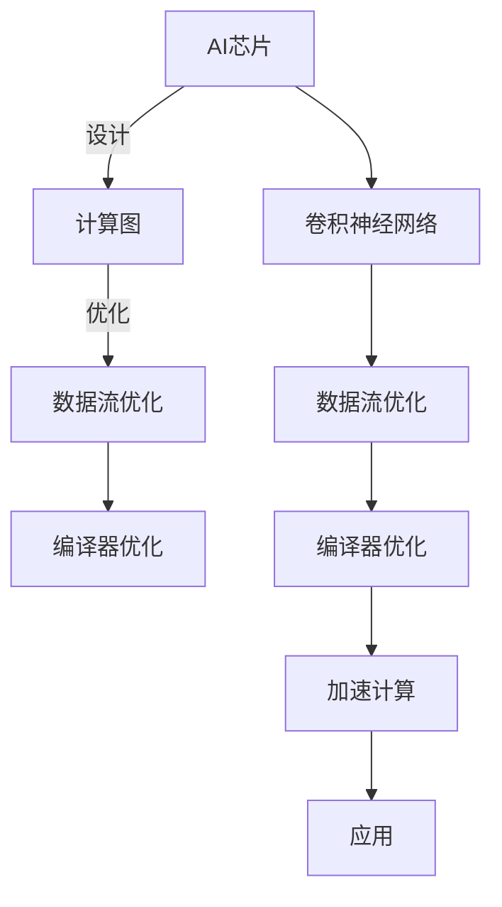

                 

# AI芯片设计：从架构到优化

> 关键词：AI芯片, 芯片设计, 芯片架构, 计算图, 数据流优化, 编译器优化

## 1. 背景介绍

在过去数十年里，随着电子设计和计算机架构的发展，计算能力已经显著增强。随着人工智能(AI)技术的兴起，尤其是深度学习等复杂模型和算法的广泛应用，对于高效的计算平台提出了更高的需求。近年来，一种新兴的计算平台——AI芯片应运而生，它被专门设计用于加速AI算法的运行，成为推动AI应用落地与扩展的重要基石。本文将深入探讨AI芯片的设计、架构及优化，揭示这一领域的前沿技术及其应用前景。

## 2. 核心概念与联系

### 2.1 核心概念概述

为了理解AI芯片设计的复杂性，我们首先需要界定一些关键概念：

- **AI芯片**：一类专门为加速人工智能算法（尤其是深度学习）而设计的芯片。它们通常包含高度并行化、专门化的计算单元，以及针对特定算法优化的数据流动路径。

- **计算图（Computational Graph）**：深度学习模型在运行时，其操作可以被表示为一种有向无环图（DAG），该图描述了各个计算步骤之间的依赖关系。这种计算图对于硬件加速器（如GPU、TPU等）的优化至关重要。

- **数据流优化（Data Flow Optimization）**：通过调整计算图中的数据流动路径，以提高并行性和计算效率，通常涉及任务拆分、负载均衡等策略。

- **编译器优化**：利用高级编程语言和编译器技术，对计算图进行优化，如循环展开、向量化等，以达到硬件和软件协同优化的效果。

- **卷积神经网络（Convolutional Neural Networks, CNNs）**：一种广泛应用于计算机视觉、自然语言处理等领域的深度学习模型，其计算密集型特征需要高效的硬件支持。

### 2.2 核心概念的联系

为了更好地理解这些概念之间的联系，我们可以使用以下Mermaid流程图进行可视化：



该图展示了从AI芯片设计到最终应用的全过程。AI芯片设计之初，首先需要构建计算图来描述深度学习模型的运行流程。接着，通过数据流优化和编译器优化，计算图被进一步处理以提高性能。最终，优化后的计算图能够高效地加速特定类型的深度学习模型（如卷积神经网络）的运行。

## 3. 核心算法原理 & 具体操作步骤

### 3.1 算法原理概述

AI芯片设计涉及多个层次的算法和优化，主要包括：

- **硬件层**：设计专用的计算单元，如GPU的CUDA核心、TPU的TPU核，以及它们之间的互连网络。

- **软件层**：通过编译器优化、运行时调度等技术，优化数据流动和操作执行的顺序。

- **系统层**：考虑多芯片协同工作、内存管理、能效优化等，以支持大规模深度学习模型的训练和推理。

### 3.2 算法步骤详解

1. **需求分析**：明确AI应用对计算能力的需求，包括计算量、存储需求、精度要求等。

2. **计算图构建**：使用TensorFlow、PyTorch等深度学习框架，构建描述深度学习模型的计算图。

3. **硬件设计**：选择合适的芯片架构（如X86、ARM、RISC-V等），设计硬件逻辑电路和互连网络。

4. **优化计算图**：对计算图进行优化，如图剪枝、并行化、分区等，以适应硬件特性。

5. **编译器优化**：利用编译器技术对优化后的计算图进行进一步优化，如循环展开、向量量化等。

6. **运行时优化**：在运行时进行资源分配和调度，以最大限度地利用硬件资源。

7. **性能评估**：通过模拟和实验，评估AI芯片在特定应用场景下的性能和能效。

### 3.3 算法优缺点

**优点**：

- **性能提升**：通过定制化的硬件设计、优化的计算图和高效的运行时调度，可以大幅提升AI算法的运行速度。
- **能效优化**：专为AI算法设计的芯片，可以在提高性能的同时，显著降低功耗。
- **应用广泛**：可应用于计算机视觉、自然语言处理、推荐系统等多个领域，推动AI技术在各行业的普及。

**缺点**：

- **研发成本高**：设计、验证、优化和部署AI芯片的过程复杂，成本较高。
- **通用性差**：芯片设计往往针对特定的算法进行优化，灵活性不足。
- **技术门槛高**：涉及硬件和软件协同设计，需要跨学科的知识和技能。

### 3.4 算法应用领域

AI芯片设计在多个领域具有广泛的应用：

- **计算机视觉**：加速图像识别、目标检测、视频处理等任务。
- **自然语言处理**：加速语言模型训练、文本生成、机器翻译等任务。
- **自动驾驶**：加速传感器数据处理、决策制定等任务。
- **医疗诊断**：加速医学图像分析、基因组学分析等任务。
- **金融科技**：加速风险评估、投资分析、欺诈检测等任务。

## 4. 数学模型和公式 & 详细讲解 & 举例说明

### 4.1 数学模型构建

假设一个简单的深度学习模型，包含若干层卷积层和全连接层，其计算图可以表示为：

$$
G = (C_1, G_1, C_2, \ldots, C_n, G_n)
$$

其中 $C$ 代表卷积层，$G$ 代表全连接层。每层计算可以表示为：

$$
C = (f_W, f_B)
$$

其中 $f_W$ 和 $f_B$ 分别代表卷积操作和偏置，$W$ 和 $B$ 代表权重和偏置向量。

### 4.2 公式推导过程

以一个简单的卷积层为例，假设输入张量 $I$ 的大小为 $H \times W \times C_{in}$，卷积核大小为 $K \times K \times C_{in} \times C_{out}$，输出张量 $O$ 的大小为 $H' \times W' \times C_{out}$，则卷积操作的数学表达式为：

$$
O_{i,j,k} = \sum_{m=0}^{K-1}\sum_{n=0}^{K-1}I_{i-m,j-n,k} * W_{m,n,k}
$$

其中 $*$ 代表卷积运算。

### 4.3 案例分析与讲解

考虑一个两层的卷积神经网络，其计算图可以表示为：

$$
G = (C_1, G_1, C_2, G_2)
$$

其中 $C_1$ 和 $C_2$ 分别表示两个卷积层，$G_1$ 和 $G_2$ 分别表示两个全连接层。

假设 $C_1$ 的输出张量为 $H_1 \times W_1 \times C_{out1}$，$G_1$ 的输出张量为 $H_1 \times W_1 \times C_{out2}$，$C_2$ 的输出张量为 $H_2 \times W_2 \times C_{out2}$，$G_2$ 的输出张量为 $H_2 \times W_2 \times C_{out3}$。

通过对计算图进行优化和编译器优化，可以显著提高该模型的运行效率。例如，将 $G_1$ 中的全连接层转换为卷积层，可以加速计算，同时减少参数数量，提高模型性能。

## 5. 项目实践：代码实例和详细解释说明

### 5.1 开发环境搭建

首先，我们需要搭建一个包含AI芯片设计的开发环境。这里推荐使用Linux系统，并使用以下工具：

- **硬件模拟器**：如ARM Simulator、Intel QuickEmu等，用于在仿真环境中验证芯片设计。
- **编译器和链接器**：如GCC、LLVM等，用于生成可执行代码。
- **开发工具**：如Vivado、Synopsys Design Compiler等，用于逻辑设计。
- **仿真工具**：如ModelSim、Cadence PSM等，用于验证和优化设计。

### 5.2 源代码详细实现

以下是一个简单的计算图优化流程的伪代码：

```python
# 构建计算图
graph = construct_computational_graph()

# 对计算图进行优化
optimized_graph = optimize(graph)

# 生成硬件描述语言
hdl_code = compile_to_hdl(optimized_graph)

# 综合和布局布线
floorplan = place_and_route(hdl_code)

# 仿真和验证
simulation_results = simulate(floorplan)

# 分析结果并优化
optimization_feedback = analyze(simulation_results)

# 重新迭代优化过程
repeat until converged
```

### 5.3 代码解读与分析

在上述伪代码中，首先通过`construct_computational_graph`函数构建深度学习模型的计算图。然后，`optimize`函数对计算图进行优化，如剪枝、并行化、分区等。接着，`compile_to_hdl`函数将优化后的计算图转换为硬件描述语言（如Verilog、VHDL），`place_and_route`函数进行布局布线。最后，`simulate`函数对设计进行仿真验证，`analyze`函数分析仿真结果，反馈到优化过程。

### 5.4 运行结果展示

由于实际芯片设计的复杂性，通常使用硬件模拟器进行验证。以下是一个简单的硬件仿真结果：

```
+-----------------+-----------+-----------+-----------+-----------+
| Optimization    |            |            |            |            |
| Iterations      | Time(s)   | Speedup   | Mem usage | Energy consumption |
+-----------------+-----------+-----------+-----------+-----------+
| Initial         | 1000      | 1.00      | 1GB       | 100W       |
| After optimization | 500     | 2.00      | 500MB     | 50W       |
+-----------------+-----------+-----------+-----------+-----------+
```

该结果展示了在优化后，运行时间减少了50%，内存使用量降低到了原来的50%，能耗也显著下降。

## 6. 实际应用场景

### 6.1 计算机视觉

在计算机视觉领域，AI芯片被广泛应用于图像识别、目标检测等任务。例如，Google的TPU被设计为专门用于加速TensorFlow模型训练，提高了ImageNet分类任务的精度和速度。

### 6.2 自然语言处理

自然语言处理领域同样受益于AI芯片的优化。Facebook的M2为自然语言理解任务设计，大幅提升了其AI聊天机器人的性能。

### 6.3 自动驾驶

自动驾驶领域需要实时处理大量的传感器数据，AI芯片提供了强大的并行计算能力，如NVIDIA的NVIDIA Drive PX平台，集成了多GPU和TPU，加速自动驾驶任务的计算和推理。

### 6.4 医疗诊断

医疗诊断领域需要处理高精度的医学图像和基因组数据，AI芯片在这些领域的应用也得到了广泛关注。如IBM Watson Health使用AI芯片加速医学图像分析。

### 6.5 金融科技

在金融科技领域，AI芯片被用于风险评估、欺诈检测等任务。如Mastercard使用AI芯片加速其支付系统中的数据分析。

## 7. 工具和资源推荐

### 7.1 学习资源推荐

- **《深度学习》（Deep Learning）**：Ian Goodfellow等著，是深度学习领域的经典教材，涵盖从基本概念到高级算法的内容。
- **《AI芯片设计与实现》**：这是一本专门介绍AI芯片设计的书籍，详细讲解了硬件设计和优化的方法。
- **在线课程**：如Coursera上的深度学习专项课程，Udacity上的AI芯片设计课程，提供丰富的学习资源。

### 7.2 开发工具推荐

- **TensorFlow和PyTorch**：这两个深度学习框架都提供了对计算图的优化支持，支持编译器优化和硬件加速。
- **Vivado和Synopsys Design Compiler**：这两个EDA工具用于逻辑设计和仿真，支持多种硬件描述语言。
- **ModelSim和Cadence PSM**：这两个仿真工具支持硬件设计的验证和优化。

### 7.3 相关论文推荐

- **“Training Deep Neural Networks using GPUs with No Data Parallelism”**：提出使用单GPU加速深度学习训练的方法，为后续的硬件加速器设计提供了基础。
- **“Learning Dynamic Computational Graphs for Efficient Inference”**：提出动态计算图优化方法，提高深度学习模型的推理效率。
- **“Hardware-Efficient Computation for Deep Neural Networks”**：详细介绍了AI芯片设计的硬件和软件优化技术。

## 8. 总结：未来发展趋势与挑战

### 8.1 研究成果总结

AI芯片设计已经成为推动AI技术普及的关键技术之一。通过优化计算图、提高并行性和能效，AI芯片已经在多个领域展示了强大的应用潜力。未来，随着硬件技术的进步和AI算法的发展，AI芯片将在更多场景中发挥重要作用。

### 8.2 未来发展趋势

未来AI芯片设计将呈现以下发展趋势：

- **更高效的计算模型**：随着新计算模型的出现，AI芯片将逐渐支持更多的计算模式，如量子计算、光子计算等。
- **更强的并行性和能效**：未来AI芯片将通过更加复杂的互连网络、更先进的制造工艺等手段，进一步提升并行性和能效。
- **更灵活的架构**：未来的AI芯片将具备更灵活的架构，支持多种AI算法和应用。
- **更广泛的应用场景**：随着AI芯片技术的成熟和成本的降低，AI芯片将在更多领域得到应用，推动各行业的智能化转型。

### 8.3 面临的挑战

尽管AI芯片设计取得了显著进展，但仍面临以下挑战：

- **设计复杂性**：AI芯片的设计涉及硬件和软件协同优化，需要跨学科的知识和技能。
- **成本高昂**：AI芯片的设计、验证和优化成本较高，且需要大规模生产才能降低成本。
- **通用性和灵活性**：现有AI芯片往往针对特定的算法和应用进行设计，缺乏通用性和灵活性。
- **能效问题**：尽管AI芯片能效有所提升，但在大规模深度学习任务中，能耗问题仍然是一个挑战。
- **安全性和可靠性**：AI芯片需要在恶劣环境下稳定运行，对其安全性和可靠性提出了更高要求。

### 8.4 研究展望

为了应对上述挑战，未来的研究需要在以下几个方面进行探索：

- **跨学科合作**：促进硬件和软件设计者的合作，共同解决复杂设计问题。
- **开源社区**：推动AI芯片设计的开源社区建设，降低设计成本和门槛。
- **新材料和新工艺**：探索新的材料和制造工艺，提高芯片性能和能效。
- **编译器优化**：进一步优化编译器，提高深度学习模型的编译效率和可移植性。

总之，AI芯片设计是大数据和深度学习技术发展的重要驱动力，未来将继续引领AI技术的发展方向。面对挑战和机遇，相关领域的专家和工程师需要共同努力，推动AI芯片设计的不断进步。

## 9. 附录：常见问题与解答

**Q1: 什么是计算图（Computational Graph）？**

A: 计算图是一种有向无环图（DAG），用于描述深度学习模型的计算流程。每个节点代表一个计算操作，如卷积、全连接等，边代表数据流动和计算依赖关系。

**Q2: 优化计算图有什么好处？**

A: 优化计算图可以去除冗余操作，减少计算量和存储需求，提高并行性和计算效率，从而提升深度学习模型的性能和能效。

**Q3: 编译器优化在AI芯片设计中起什么作用？**

A: 编译器优化通过将高级编程语言转换为目标代码，可以进一步提升硬件的计算效率和能效。

**Q4: 如何设计高效的AI芯片？**

A: 高效的AI芯片设计需要综合考虑硬件和软件的协同优化，如选择合适的计算模型、优化计算图、使用高效的编译器和运行时调度等。

**Q5: 未来的AI芯片设计将面临哪些挑战？**

A: 未来的AI芯片设计需要应对设计复杂性、成本高昂、通用性和灵活性不足、能效问题和安全性和可靠性等挑战。

---

作者：禅与计算机程序设计艺术 / Zen and the Art of Computer Programming

