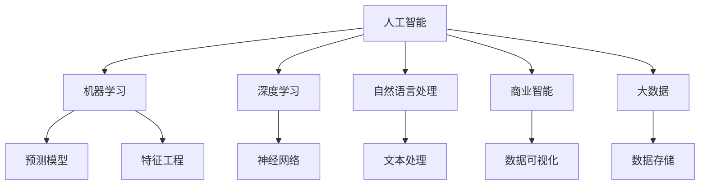

                 

# AI行业的未来：回到商业成功，如何让AI真正创造商业价值

在当今信息爆炸和数字化的时代，人工智能（AI）正逐渐成为各行各业竞争力的核心驱动力。然而，尽管AI技术不断突破，但真正将AI转化为商业价值的案例却不多见。本文将深入探讨AI如何在商业成功中扮演关键角色，并提出几种策略以实现AI技术在实际业务中的有效应用。

## 1. 背景介绍

### 1.1 问题由来

随着AI技术的快速发展，企业面临着越来越多的应用场景和挑战。在传统业务中，AI技术能够提供自动化、智能化、效率提升等优势。但在实际应用中，AI往往面临数据稀缺、模型复杂、集成成本高等问题。这些问题使得AI技术的商业化落地变得困难。

### 1.2 问题核心关键点

- **数据稀缺性**：AI模型需要大量标注数据进行训练，但数据获取和标注成本高昂。
- **模型复杂性**：AI模型通常需要复杂的网络结构和海量参数，难以在有限的资源下进行高效训练。
- **业务集成**：AI模型往往需要与现有业务系统进行集成，而现有系统不一定支持AI技术。
- **商业价值**：如何确保AI技术的商业应用能够带来预期的收益和效率提升。

这些问题共同构成了AI技术商业化的主要障碍。但如果我们能够找到有效的方法来克服这些挑战，AI技术将真正能够帮助企业创造更大的商业价值。

## 2. 核心概念与联系

### 2.1 核心概念概述

要实现AI技术的商业成功，需要理解以下几个关键概念及其相互联系：

- **人工智能（AI）**：通过算法和数据驱动，使计算机系统具备类似人类的智能能力，从而解决复杂问题。
- **机器学习（ML）**：AI的一个重要分支，通过数据训练模型，使其具备学习能力和预测能力。
- **深度学习（DL）**：ML的一个高级形式，使用神经网络等复杂模型处理复杂任务。
- **自然语言处理（NLP）**：使用AI技术处理和理解人类语言。
- **商业智能（BI）**：使用AI技术分析数据，辅助企业决策。
- **大数据（Big Data）**：处理和分析海量数据，挖掘业务洞见。

这些概念之间的逻辑关系可以通过以下Mermaid流程图来展示：



## 3. 核心算法原理 & 具体操作步骤
### 3.1 算法原理概述

AI技术在商业成功的实现，离不开以下核心算法原理和操作步骤：

1. **数据预处理**：清洗、归一化、标注数据，为模型训练提供高质量输入。
2. **模型训练**：选择合适的算法和模型，使用历史数据训练模型。
3. **模型评估**：使用测试集评估模型性能，调整模型参数。
4. **模型部署**：将训练好的模型部署到实际业务系统中，进行实时预测和决策。
5. **业务集成**：将AI模型与现有业务系统集成，实现无缝应用。
6. **持续优化**：定期收集新数据，重新训练模型，确保模型性能持续提升。

### 3.2 算法步骤详解

以NLP领域的文本分类任务为例，详细讲解AI技术的商业应用步骤：

1. **数据收集和预处理**：
   - 收集相关文本数据，如新闻、评论等。
   - 对数据进行清洗，去除无关信息。
   - 对文本进行分词、去停用词等预处理操作。
   - 标注数据，提供类别标签。

2. **模型选择和训练**：
   - 选择适当的算法，如卷积神经网络（CNN）、循环神经网络（RNN）或Transformer。
   - 使用训练集对模型进行训练。
   - 调整模型参数，确保模型泛化能力。

3. **模型评估**：
   - 使用测试集评估模型性能，如准确率、召回率、F1分数等。
   - 对比不同算法和模型，选择最优方案。

4. **模型部署**：
   - 将训练好的模型集成到实际业务系统中。
   - 提供API接口，进行实时预测。
   - 集成可视化工具，实时展示模型效果。

5. **业务集成**：
   - 将AI模型与现有业务系统集成，如CRM系统、网站等。
   - 设计良好的数据接口，确保数据传输顺畅。
   - 提供友好的用户界面，方便业务人员使用。

6. **持续优化**：
   - 定期收集新数据，重新训练模型。
   - 根据业务需求，调整模型结构和参数。
   - 实时监控模型性能，及时优化。

### 3.3 算法优缺点

- **优点**：
  - **自动化和智能化**：AI模型能够自动完成数据处理和决策过程，提升效率和准确性。
  - **跨领域应用**：AI技术可以应用于多个领域，如金融、医疗、零售等。
  - **可扩展性**：AI模型可以随着数据和业务的增长而不断扩展。

- **缺点**：
  - **数据依赖**：AI模型需要大量高质量数据，数据稀缺性是主要障碍。
  - **复杂性高**：AI模型复杂，需要专业知识进行维护和优化。
  - **高成本**：AI技术的开发和部署需要高昂的成本。

## 4. 数学模型和公式 & 详细讲解 & 举例说明

### 4.1 数学模型构建

以文本分类任务为例，构建数学模型：

设训练样本集为 $D=\{(x_i, y_i)\}_{i=1}^N$，其中 $x_i$ 为文本，$y_i$ 为分类标签。使用softmax函数将模型输出转化为概率分布：

$$
p(y_i|x_i) = \frac{e^{z_i}}{\sum_{k=1}^K e^{z_k}}
$$

其中 $z_i = \sum_{j=1}^n w_j h_j(x_i)$，$h_j(x_i)$ 为特征向量 $x_i$ 通过神经网络模型的第 $j$ 层输出，$w_j$ 为第 $j$ 层的权重参数。

### 4.2 公式推导过程

将上述模型用于文本分类任务，并使用交叉熵损失函数训练模型：

$$
\mathcal{L}(\theta) = -\frac{1}{N} \sum_{i=1}^N \sum_{k=1}^K y_{ik} \log p(y_k|x_i)
$$

其中 $y_{ik}$ 表示样本 $x_i$ 属于类别 $k$ 的标签，$y_{ik}=1$ 表示属于该类别，$y_{ik}=0$ 表示不属于该类别。

### 4.3 案例分析与讲解

以情感分析为例，分析AI模型在实际业务中的应用：

- **数据收集**：从社交媒体、评论网站等收集用户评论数据，标注情感标签。
- **预处理**：对文本进行分词、去除停用词等预处理操作。
- **模型选择**：选择适当的算法，如LSTM或BERT等。
- **训练**：使用标注数据训练模型，调整模型参数。
- **评估**：在测试集上评估模型性能，选择最优模型。
- **部署**：将模型部署到实际业务系统，实时分析用户情感。
- **优化**：根据业务需求，不断优化模型。

## 5. 项目实践：代码实例和详细解释说明
### 5.1 开发环境搭建

为了快速实现AI模型的商业应用，需要以下开发环境：

1. **Python**：主流的AI编程语言，提供了丰富的第三方库支持。
2. **PyTorch/TensorFlow**：常用的深度学习框架，提供了高效的计算图和模型训练功能。
3. **Jupyter Notebook**：用于编写和调试AI代码。
4. **Pandas/Numpy**：用于数据处理和分析。
5. **Scikit-learn**：用于机器学习和模型评估。

### 5.2 源代码详细实现

以文本分类任务为例，使用PyTorch实现模型训练和评估：

```python
import torch
import torch.nn as nn
import torch.optim as optim
from torch.utils.data import DataLoader
from torchtext.datasets import TextClassification
from torchtext.data import Field, LabelField, TabularDataset, BucketIterator

# 定义数据集
TEXT = Field(tokenize='spacy', lower=True)
LABEL = LabelField(dtype=torch.int64)
train_data, test_data = TextClassification.splits(TEXT, LABEL, path='./data/20news-bydate-30000.pt')

# 构建数据加载器
BATCH_SIZE = 32
train_iterator, test_iterator = BucketIterator.splits((train_data, test_data), batch_size=BATCH_SIZE)

# 定义模型
class TextClassifier(nn.Module):
    def __init__(self, input_size, embedding_size, hidden_size, output_size):
        super(TextClassifier, self).__init__()
        self.embedding = nn.Embedding(input_size, embedding_size)
        self.fc1 = nn.Linear(embedding_size, hidden_size)
        self.fc2 = nn.Linear(hidden_size, output_size)
        self.dropout = nn.Dropout(p=0.5)

    def forward(self, text):
        embedding = self.embedding(text)
        embedding = self.dropout(embedding)
        hidden = self.fc1(embedding)
        output = self.fc2(hidden)
        return output

# 定义超参数
INPUT_SIZE = len(TEXT.vocab)
EMBEDDING_SIZE = 100
HIDDEN_SIZE = 256
OUTPUT_SIZE = len(LABEL.vocab)
LEARNING_RATE = 0.01

# 定义模型、优化器和损失函数
model = TextClassifier(INPUT_SIZE, EMBEDDING_SIZE, HIDDEN_SIZE, OUTPUT_SIZE)
optimizer = optim.Adam(model.parameters(), lr=LEARNING_RATE)
criterion = nn.CrossEntropyLoss()

# 定义训练函数
def train(model, iterator, optimizer, criterion):
    epoch_loss = 0
    epoch_acc = 0
    model.train()
    for batch in iterator:
        optimizer.zero_grad()
        text, labels = batch.text, batch.label
        predictions = model(text).squeeze(1)
        loss = criterion(predictions, labels)
        acc = binary_accuracy(predictions, labels)
        loss.backward()
        optimizer.step()
        epoch_loss += loss.item()
        epoch_acc += acc.item()
    return epoch_loss / len(iterator), epoch_acc / len(iterator)

# 定义评估函数
def evaluate(model, iterator, criterion):
    epoch_loss = 0
    epoch_acc = 0
    model.eval()
    with torch.no_grad():
        for batch in iterator:
            text, labels = batch.text, batch.label
            predictions = model(text).squeeze(1)
            loss = criterion(predictions, labels)
            acc = binary_accuracy(predictions, labels)
            epoch_loss += loss.item()
            epoch_acc += acc.item()
    return epoch_loss / len(iterator), epoch_acc / len(iterator)

# 定义训练流程
N_EPOCHS = 5
best_loss, best_acc = float('inf'), float('inf')

for epoch in range(N_EPOCHS):
    train_loss, train_acc = train(model, train_iterator, optimizer, criterion)
    test_loss, test_acc = evaluate(model, test_iterator, criterion)
    
    if test_acc > best_acc:
        best_acc = test_acc
        best_loss = test_loss
    
    print(f'Epoch: {epoch+1}, Train Loss: {train_loss:.3f}, Train Acc: {train_acc:.3f}, Test Loss: {test_loss:.3f}, Test Acc: {test_acc:.3f}')

# 输出最佳模型性能
print(f'Best Loss: {best_loss:.3f}, Best Acc: {best_acc:.3f}')
```

### 5.3 代码解读与分析

上述代码实现了文本分类模型的训练和评估过程，主要步骤如下：

1. **数据预处理**：使用`torchtext`库定义数据集，进行分词和标签处理。
2. **模型定义**：定义神经网络模型，包括嵌入层、全连接层和Dropout层。
3. **超参数设置**：设置模型参数和优化器参数。
4. **训练和评估函数**：定义训练和评估函数，计算损失和准确率。
5. **训练流程**：使用`for`循环进行模型训练，输出每个epoch的损失和准确率。
6. **模型评估**：在测试集上评估模型性能，输出最佳模型性能。

## 6. 实际应用场景
### 6.4 未来应用展望

AI技术在未来的商业应用中，将呈现以下几个趋势：

1. **智能客服**：使用NLP和机器学习技术，构建智能客服系统，提高客户满意度。
2. **个性化推荐**：使用深度学习和大数据技术，为用户提供个性化推荐服务，提升用户粘性。
3. **金融风险控制**：使用AI技术进行风险评估、欺诈检测等，保护企业利益。
4. **医疗诊断**：使用深度学习和大数据技术，辅助医生进行疾病诊断，提高诊疗效率。
5. **零售推荐**：使用机器学习和大数据技术，为零售商提供精准的商品推荐，提升销售额。
6. **供应链优化**：使用AI技术进行供应链管理，提高效率和降低成本。

这些应用场景展示了AI技术在商业中的巨大潜力，未来随着技术的不断进步，AI技术将进一步深入各行各业，帮助企业创造更大的商业价值。

## 7. 工具和资源推荐
### 7.1 学习资源推荐

为了帮助开发者深入学习AI技术的商业应用，以下是一些推荐的资源：

1. **《深度学习》课程**：由吴恩达教授主讲，系统介绍深度学习的基础知识和应用。
2. **《机器学习实战》书籍**：详细介绍机器学习算法和实际应用案例。
3. **Kaggle竞赛平台**：提供大量数据集和竞赛，帮助开发者提升实战能力。
4. **Google AI博客**：分享最新的AI技术和应用案例，涵盖自然语言处理、计算机视觉等领域。
5. **Coursera AI课程**：提供多种AI相关课程，涵盖从入门到高级的内容。

### 7.2 开发工具推荐

以下是一些常用的AI开发工具，可以帮助开发者高效地实现商业应用：

1. **PyTorch**：提供了高效的计算图和模型训练功能。
2. **TensorFlow**：提供了丰富的深度学习框架和模型库。
3. **Jupyter Notebook**：用于编写和调试AI代码。
4. **Pandas/Numpy**：用于数据处理和分析。
5. **Scikit-learn**：用于机器学习和模型评估。
6. **Keras**：提供了简单易用的API接口，快速构建深度学习模型。
7. **TensorBoard**：用于模型训练和可视化。

### 7.3 相关论文推荐

以下是一些经典的相关论文，推荐阅读：

1. **《深度学习》**：由Ian Goodfellow等作者编写，全面介绍深度学习的基础知识和应用。
2. **《神经网络与深度学习》**：由Michael Nielsen编写，详细介绍神经网络的基本原理和应用。
3. **《TensorFlow实战Google深度学习》**：由Google官方编写，介绍TensorFlow的实际应用。
4. **《深度学习实战》**：由Francois Chollet编写，介绍Keras的使用和深度学习模型构建。
5. **《自然语言处理综论》**：由Daniel Jurafsky和James H. Martin编写，介绍自然语言处理的基本概念和技术。

## 8. 总结：未来发展趋势与挑战
### 8.1 研究成果总结

本文探讨了AI技术在商业中的应用，详细讲解了数据预处理、模型训练、模型评估、模型部署等核心操作步骤。通过文本分类任务的具体案例，展示了AI技术在实际业务中的具体应用，并提供了代码实现。

### 8.2 未来发展趋势

未来AI技术在商业应用中，将呈现以下几个发展趋势：

1. **自动化和智能化**：AI技术将更广泛地应用于自动驾驶、智能制造等领域，提升生产效率和产品质量。
2. **跨领域融合**：AI技术将与其他技术（如物联网、大数据、区块链等）进行深度融合，拓展应用场景。
3. **个性化服务**：AI技术将为消费者提供更个性化、定制化的服务，提升用户体验。
4. **安全性和隐私保护**：AI技术将更注重数据安全和隐私保护，防止数据滥用。
5. **伦理和社会影响**：AI技术的应用将更注重伦理和社会影响，避免技术滥用。

### 8.3 面临的挑战

尽管AI技术在商业应用中取得了一定的成功，但仍面临一些挑战：

1. **数据质量和隐私**：数据质量和隐私问题是AI应用的重要障碍，需要建立完善的数据治理机制。
2. **模型复杂性和计算资源**：AI模型复杂度高，需要大量的计算资源进行训练和部署。
3. **业务集成和数据接口**：AI模型需要与现有业务系统集成，设计和实现数据接口是关键。
4. **模型解释和可解释性**：AI模型的黑盒性质导致模型解释和可解释性不足，影响模型的可信度。
5. **伦理和法律问题**：AI技术的应用可能引发伦理和法律问题，需要建立相应的监管机制。

### 8.4 研究展望

未来AI技术的研究将重点关注以下几个方向：

1. **可解释性和透明性**：开发可解释的AI模型，增强模型的透明性和可信度。
2. **跨领域应用**：拓展AI技术在多个领域的应用，提升应用场景的覆盖率。
3. **自动化和自适应**：开发自动化和自适应AI系统，提高模型的灵活性和适应性。
4. **安全和隐私保护**：提升AI系统的安全性和隐私保护能力，防止数据滥用。
5. **跨学科融合**：与其他学科（如心理学、社会学、伦理学等）进行深度融合，拓展AI技术的社会应用。

## 9. 附录：常见问题与解答

### Q1: AI技术如何帮助企业创造商业价值？

**A**: AI技术通过自动化、智能化和高效数据分析，帮助企业提升生产效率、降低成本、提升用户体验和决策质量，从而创造更大的商业价值。

### Q2: 数据稀缺性如何影响AI模型的训练？

**A**: 数据稀缺性是AI模型训练的主要障碍，可以通过数据增强、迁移学习、主动学习等方法缓解。

### Q3: AI技术在实际业务中需要考虑哪些因素？

**A**: AI技术在实际业务中需要考虑数据质量、业务集成、模型复杂性、计算资源、模型解释性和伦理问题等因素。

### Q4: AI技术的未来发展方向是什么？

**A**: AI技术的未来发展方向包括自动化和智能化、跨领域融合、个性化服务、安全性和隐私保护、伦理和社会影响等。

### Q5: 如何评估AI模型的性能？

**A**: 评估AI模型性能的常用指标包括准确率、召回率、F1分数、ROC曲线、AUC等，根据具体应用场景选择合适的指标。

---

作者：禅与计算机程序设计艺术 / Zen and the Art of Computer Programming

