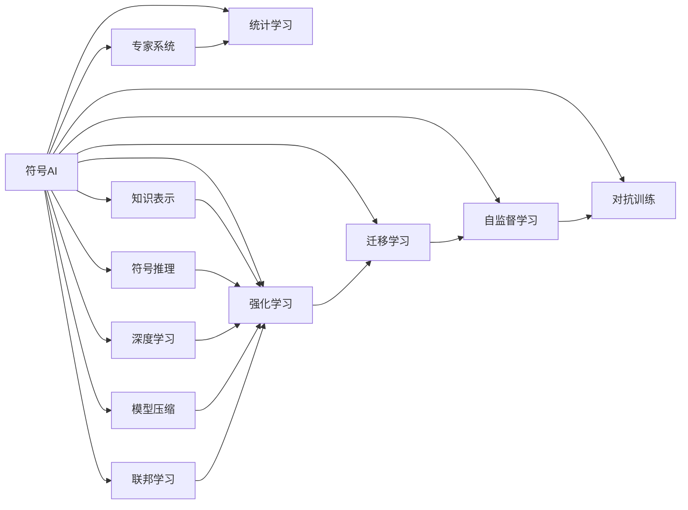

                 

# AI角色演化：长期互动中的人物发展

> 关键词：AI角色,演化,长期互动,发展历程,技术应用

## 1. 背景介绍

在过去几十年间，人工智能（AI）已经经历了从理论研究到实际应用的巨大转变。早期的AI研究集中在符号推理和专家系统上，试图模仿人类的逻辑思维能力。然而，这些方法在处理复杂、不确定性的现实问题时，存在诸多局限。随着深度学习技术的突破，基于神经网络的AI模型在图像、语音、自然语言处理等领域取得了卓越成绩。本文将回顾AI角色的发展历程，探讨其在长期互动中的人物发展。

## 2. 核心概念与联系

### 2.1 核心概念概述

AI角色演化涉及多个核心概念：

- **符号AI**：基于逻辑符号和规则的系统，模仿人类推理过程，用于专家系统和知识表示。
- **统计学习**：利用数据和统计方法训练模型，预测未知数据。
- **深度学习**：通过多层神经网络学习数据的内在结构，广泛用于图像、语音、自然语言处理等任务。
- **强化学习**：通过智能体与环境的交互，学习最优策略。
- **迁移学习**：在已有模型的基础上，通过新任务的微调，提高模型性能。
- **自监督学习**：使用未标注的数据，训练模型以获得更好的泛化能力。
- **对抗训练**：通过加入对抗样本，提高模型的鲁棒性。
- **模型压缩和优化**：减少模型大小和计算量，提高计算效率。
- **联邦学习**：多设备协作训练模型，保护数据隐私。

### 2.2 核心概念原理和架构的 Mermaid 流程图



这个流程图展示了AI角色演化的核心概念及其关系：

1. **符号AI**是早期AI研究的基础，包含知识表示和专家系统。
2. **统计学习**通过数据驱动的方法，提升了AI的预测能力。
3. **深度学习**使AI具备了强大的特征提取和模式识别能力。
4. **强化学习**通过智能体与环境的交互，学习最优策略。
5. **迁移学习**利用已有模型，加速新任务的训练。
6. **自监督学习**通过未标注数据，提高模型的泛化能力。
7. **对抗训练**增强模型的鲁棒性。
8. **模型压缩和优化**减少计算量，提高效率。
9. **联邦学习**保护数据隐私的同时进行协作学习。

## 3. 核心算法原理 & 具体操作步骤

### 3.1 算法原理概述

AI角色演化的核心算法原理可以分为三大类：

- **数据驱动的算法**：如统计学习、深度学习，利用数据和模型参数，通过迭代优化，提高模型性能。
- **决策驱动的算法**：如强化学习、迁移学习，通过策略或任务导向，优化模型行为。
- **机制驱动的算法**：如对抗训练、模型压缩，通过改进模型机制，提升计算效率和性能。

### 3.2 算法步骤详解

以**深度学习**为例，深度学习模型的训练一般包括以下步骤：

1. **数据准备**：收集并预处理数据，包括数据清洗、标准化、归一化等。
2. **模型选择**：选择合适的神经网络架构，如卷积神经网络（CNN）、循环神经网络（RNN）、变分自编码器（VAE）等。
3. **模型初始化**：随机初始化模型参数。
4. **前向传播**：将输入数据输入模型，通过多个非线性层，得到模型输出。
5. **损失计算**：计算模型输出与真实标签之间的差异，通常使用交叉熵、均方误差等损失函数。
6. **反向传播**：通过链式法则，计算模型参数对损失函数的梯度。
7. **参数更新**：使用梯度下降等优化算法，更新模型参数。
8. **迭代训练**：重复上述步骤，直至模型收敛或达到预设的训练轮数。

### 3.3 算法优缺点

**深度学习**的优点包括：

- **强大的特征提取能力**：能够自动学习数据的高级特征表示。
- **广泛的适用性**：可用于图像、语音、自然语言处理等多个领域。
- **强大的泛化能力**：能够适应大规模、高维度数据。

然而，深度学习也存在以下缺点：

- **资源消耗大**：需要大量计算资源，对硬件要求较高。
- **模型复杂性高**：难以解释和调试，存在"黑盒"问题。
- **数据依赖性强**：需要大量标注数据，获取数据成本高。
- **训练时间长**：模型训练耗时长，容易过拟合。

## 4. 数学模型和公式 & 详细讲解 & 举例说明

### 4.1 数学模型构建

以**卷积神经网络（CNN）**为例，CNN通常由卷积层、池化层、全连接层组成。假设输入数据为二维矩阵$X$，输出为二维矩阵$Y$，卷积核为$W$，则卷积层的操作可以表示为：

$$
Y = (X * W)
$$

其中，卷积操作可以表示为：

$$
Y_{i,j} = \sum_{k=0}^{n-1} \sum_{l=0}^{m-1} X_{i+k,j+l} \cdot W_{k,l}
$$

### 4.2 公式推导过程

以**反向传播算法**为例，反向传播算法通过链式法则，计算模型参数对损失函数的梯度。假设模型输出为$y$，真实标签为$t$，模型参数为$\theta$，则损失函数为$L$。对于单个神经元的损失函数梯度，可以表示为：

$$
\frac{\partial L}{\partial z} = \frac{\partial L}{\partial y} \cdot \frac{\partial y}{\partial z}
$$

其中，$\frac{\partial L}{\partial y}$为损失函数对输出的梯度，$\frac{\partial y}{\partial z}$为输出对参数的梯度。通过逐层计算，可以求得所有参数的梯度，进而使用梯度下降等优化算法，更新模型参数。

### 4.3 案例分析与讲解

以**ImageNet数据集**为例，该数据集包含1000类图像，用于训练和测试卷积神经网络。通过深度学习模型在ImageNet数据集上的训练，可以获得通用的图像特征表示，用于各种图像识别任务。

## 5. 项目实践：代码实例和详细解释说明

### 5.1 开发环境搭建

首先，需要安装Python和必要的深度学习库，如TensorFlow、Keras等。可以使用Anaconda来创建和管理Python环境，安装所需的库和依赖。

### 5.2 源代码详细实现

以**手写数字识别**为例，使用Keras框架实现一个简单的卷积神经网络。代码如下：

```python
import tensorflow as tf
from tensorflow.keras import layers

# 定义模型
model = tf.keras.Sequential([
    layers.Conv2D(32, (3, 3), activation='relu', input_shape=(28, 28, 1)),
    layers.MaxPooling2D((2, 2)),
    layers.Flatten(),
    layers.Dense(64, activation='relu'),
    layers.Dense(10, activation='softmax')
])

# 编译模型
model.compile(optimizer='adam',
              loss='sparse_categorical_crossentropy',
              metrics=['accuracy'])

# 训练模型
model.fit(train_images, train_labels, epochs=5, batch_size=64)

# 评估模型
test_loss, test_acc = model.evaluate(test_images, test_labels)
print('Test accuracy:', test_acc)
```

### 5.3 代码解读与分析

上述代码中，`Sequential`表示线性堆叠的神经网络层。`Conv2D`表示卷积层，`MaxPooling2D`表示池化层，`Flatten`表示将多维张量展平，`Dense`表示全连接层。`compile`方法用于配置模型参数和损失函数，`fit`方法用于训练模型，`evaluate`方法用于评估模型性能。

### 5.4 运行结果展示

在训练过程中，可以通过`Model.fit`方法中的`callbacks`参数，添加`TensorBoard`回调，实时可视化训练过程中的损失函数和准确率：

```python
from tensorflow.keras.callbacks import TensorBoard

tensorboard_callback = TensorBoard(log_dir='logs', histogram_freq=1)
model.fit(train_images, train_labels, epochs=5, batch_size=64, callbacks=[tensorboard_callback])
```

在训练完成后，`TensorBoard`会自动生成一个TensorBoard网页界面，展示模型训练过程中的各项指标，方便调试和优化模型。

## 6. 实际应用场景

### 6.1 医疗影像诊断

医疗影像诊断是AI角色演化的重要应用领域。通过深度学习模型，可以对医疗影像进行自动标注和分类，辅助医生进行诊断和治疗决策。例如，使用卷积神经网络对医学影像进行特征提取，结合语义分割技术，对病变区域进行标注。

### 6.2 自动驾驶

自动驾驶是AI角色演化的另一个重要应用领域。通过深度学习模型，可以实现对道路环境的感知、交通规则的遵守和驾驶决策的制定。例如，使用卷积神经网络对道路图像进行识别，结合强化学习，优化驾驶策略。

### 6.3 金融风险管理

金融风险管理也是AI角色演化的重要应用领域。通过深度学习模型，可以对金融市场进行预测和风险评估，辅助金融决策。例如，使用循环神经网络对历史数据进行时间序列预测，结合对抗训练，提高模型鲁棒性。

## 7. 工具和资源推荐

### 7.1 学习资源推荐

- **《深度学习》（Ian Goodfellow等）**：经典的深度学习教材，系统介绍了深度学习的理论和应用。
- **《Python深度学习》（Francois Chollet）**：Keras库的作者所著，介绍了使用Keras进行深度学习的实践方法。
- **Coursera的深度学习课程**：由Andrew Ng等教授讲授，涵盖深度学习的基础理论和实践技巧。
- **GitHub深度学习项目**：包含大量深度学习模型的代码和数据集，方便学习和实践。

### 7.2 开发工具推荐

- **Anaconda**：Python环境管理工具，方便安装和管理深度学习库。
- **TensorFlow**：由Google开发的深度学习框架，支持GPU加速。
- **Keras**：高层次的深度学习库，易于使用和调试。
- **TensorBoard**：深度学习模型可视化工具，支持实时监控和分析。

### 7.3 相关论文推荐

- **ImageNet大规模视觉识别挑战赛**：AlexNet在ImageNet数据集上取得了优异成绩，标志着深度学习在图像识别领域的突破。
- **AlphaGo对弈李世石**：AlphaGo使用深度学习技术和强化学习，实现了围棋领域的人类级对弈水平。
- **Transformer论文**：提出Transformer结构，显著提高了NLP任务的性能。

## 8. 总结：未来发展趋势与挑战

### 8.1 研究成果总结

AI角色的演化经历了符号AI、统计学习、深度学习等阶段，逐渐从理论研究走向实际应用。当前，AI在图像、语音、自然语言处理等领域取得了显著进展，广泛应用于医疗、自动驾驶、金融等领域。

### 8.2 未来发展趋势

未来，AI角色的发展趋势包括：

- **多模态学习**：融合视觉、语音、文本等多模态数据，提升模型的综合能力。
- **自监督学习**：利用未标注数据，提高模型的泛化能力。
- **联邦学习**：多设备协作训练模型，保护数据隐私。
- **模型压缩和优化**：减少计算量，提高效率。
- **伦理和可解释性**：提升模型的伦理导向和可解释性。

### 8.3 面临的挑战

AI角色演化面临的挑战包括：

- **数据隐私和安全**：AI模型需要处理大量敏感数据，如何保护数据隐私和安全是重要问题。
- **伦理和偏见**：AI模型可能存在偏见和歧视，如何建立公平、透明的AI模型是重要问题。
- **资源消耗**：AI模型需要大量计算资源，如何优化模型，提高计算效率是重要问题。

### 8.4 研究展望

未来，AI角色演化的研究展望包括：

- **可解释AI**：提升模型的可解释性和透明度，帮助理解和信任AI模型。
- **公平AI**：建立公平、无偏见的AI模型，消除偏见和歧视。
- **联邦学习**：在保护数据隐私的前提下，实现多设备协作学习。
- **伦理和社会影响**：研究和制定AI伦理和社会影响指南，指导AI技术的应用。

## 9. 附录：常见问题与解答

### Q1：深度学习与传统机器学习有什么区别？

**A**：深度学习与传统机器学习的区别主要在于模型结构和训练方法。深度学习使用多层神经网络，自动学习数据的高级特征表示；传统机器学习使用浅层模型，需要手工设计特征。深度学习通常需要大量标注数据，训练时间长，但具有强大的泛化能力；传统机器学习通常需要较少的标注数据，训练时间短，但特征工程复杂，泛化能力较弱。

### Q2：什么是卷积神经网络？

**A**：卷积神经网络是一种常用的深度学习模型，用于处理具有网格结构的数据，如图像、声音等。卷积神经网络由卷积层、池化层、全连接层等组成，通过卷积和池化操作，提取数据的空间特征。卷积神经网络在图像识别、目标检测、语音识别等领域具有广泛应用。

### Q3：什么是联邦学习？

**A**：联邦学习是一种分布式机器学习技术，多个设备协作训练模型，但不共享数据。每个设备本地保存数据，通过模型参数更新共享知识，从而提升模型性能。联邦学习可以保护数据隐私，适用于数据分布不均、数据敏感的应用场景。

### Q4：什么是对抗训练？

**A**：对抗训练是一种增强模型鲁棒性的技术，通过在训练中加入对抗样本，训练模型对扰动具有鲁棒性。对抗训练可以通过生成对抗样本，或者微调模型参数，增强模型的泛化能力。

### Q5：什么是自监督学习？

**A**：自监督学习是一种利用未标注数据进行模型训练的技术，通过在数据中发现模式和规律，学习模型的表示能力。自监督学习通常用于预训练模型，可以提升模型的泛化能力和迁移学习能力。

---

作者：禅与计算机程序设计艺术 / Zen and the Art of Computer Programming

