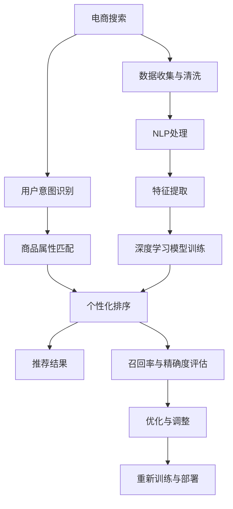

                 

# AI赋能的电商搜索个性化排序

> 关键词：电商搜索, 个性化排序, AI, 算法, 优化, 实时性, 高效性, 鲁棒性

## 1. 背景介绍

### 1.1 问题由来

随着电子商务的迅猛发展，在线购物成为越来越多人的首选购物方式。各大电商平台的交易量不断攀升，用户需求日趋多样化，如何在海量的商品中快速精准地找到满意的商品，成为了电商搜索系统面临的主要挑战。传统的搜索排序算法，如基于关键词匹配的倒排索引、TF-IDF等方法，已难以满足用户个性化需求。为此，各大电商平台纷纷引入机器学习和大数据技术，通过智能算法优化搜索排序，提升用户体验。

### 1.2 问题核心关键点

个性化搜索排序的核心问题在于如何高效地识别用户意图，并根据用户行为和商品属性进行精准匹配。其关键点包括：

- 用户意图识别：通过用户历史行为、搜索词、浏览记录等，精准理解用户需求。
- 商品属性匹配：将商品的属性信息与用户的搜索词进行精确匹配，推荐最相关的商品。
- 实时性优化：确保搜索结果的实时性，满足用户瞬时查询需求。
- 效率优化：优化算法性能，减少计算资源消耗，提高排序效率。
- 鲁棒性保障：保证算法在面对异常数据、网络波动等情况下的鲁棒性，避免系统崩溃。

### 1.3 问题研究意义

随着电子商务的竞争日趋激烈，个性化搜索排序技术的优劣直接影响平台的流量和销售。快速、准确、高效地优化搜索排序算法，可以提升用户体验，降低用户流失率，增加平台收益。此外，个性化排序算法的优化也是AI赋能电商的一个重要体现，其应用价值不仅在于技术层面，还在于能够洞察用户行为，挖掘潜在商机，为电商运营提供数据支撑。

## 2. 核心概念与联系

### 2.1 核心概念概述

在电商搜索个性化排序的优化中，涉及的核心概念包括：

- **电商搜索**：指用户通过电商平台提供的搜索功能，输入查询词，获取相关商品的过程。电商搜索系统需要高效准确地理解用户需求，并提供匹配度高的商品列表。
- **个性化排序**：指根据用户的个性化需求，调整搜索结果的排序规则，使其符合用户的期望。个性化排序的核心在于理解用户意图，并根据不同用户的行为特征进行差异化排序。
- **机器学习**：利用算法和数据，通过训练模型预测用户行为，提升搜索排序的精准度和效率。
- **深度学习**：以神经网络为核心的机器学习子领域，通过多层次的特征提取和变换，学习商品和用户的复杂关系。
- **自然语言处理(NLP)**：处理和理解人类语言的技术，用于解析用户的搜索词，提取关键信息。
- **协同过滤**：通过分析用户的历史行为和相似用户的行为，推荐相关商品。
- **召回率与精确度**：用于衡量搜索结果的相关性和准确性，是衡量搜索排序算法性能的重要指标。

这些核心概念之间通过数据流和算法流程进行衔接，形成一个完整的电商搜索排序系统。

### 2.2 核心概念原理和架构的 Mermaid 流程图



该图展示了电商搜索排序的核心流程和架构：

1. 用户通过搜索功能输入查询词。
2. 数据收集与清洗，整理出用户历史行为和商品属性信息。
3. NLP处理解析查询词，提取关键信息。
4. 特征提取将用户行为和商品属性转化为算法可处理的向量形式。
5. 深度学习模型训练得到匹配和排序规则。
6. 个性化排序根据用户需求调整排序规则，输出推荐结果。
7. 评估召回率和精确度，优化模型性能。
8. 重新训练与部署，持续提升搜索排序效果。

## 3. 核心算法原理 & 具体操作步骤

### 3.1 算法原理概述

个性化电商搜索排序的核心算法主要基于机器学习和深度学习技术。其核心原理是通过对用户历史行为、商品属性和搜索词进行分析，建立用户和商品之间的关联模型。然后，在用户输入查询词时，通过该模型快速预测用户可能感兴趣的商品，并根据不同特征对商品进行排序，生成推荐结果。

该算法流程主要包括以下几个步骤：

1. **数据预处理**：收集和清洗用户行为数据，提取商品属性，并进行NLP处理。
2. **特征工程**：将文本数据转换为向量形式，提取和选择关键特征。
3. **模型训练**：使用机器学习和深度学习算法训练排序模型，学习用户行为和商品属性之间的映射关系。
4. **实时排序**：在用户输入查询词时，通过模型进行实时排序，并返回推荐结果。
5. **性能优化**：对模型和算法进行优化，提升搜索排序的效率和效果。

### 3.2 算法步骤详解

#### 3.2.1 数据预处理

电商搜索系统首先需要收集和清洗用户行为数据，包括用户的浏览记录、点击记录、搜索历史等。这些数据需要经过格式统一、去重、去噪等预处理步骤，以减少噪音和异常值对算法的干扰。同时，还需从电商平台获取商品的详细信息，包括商品ID、名称、描述、价格、属性等，用于与用户行为数据进行匹配。

#### 3.2.2 特征工程

特征工程是个性化排序算法的关键步骤。特征提取的目的是将文本数据和数字数据转化为算法可以处理的形式。常见的特征包括：

- 用户特征：用户的年龄、性别、地理位置、历史行为等。
- 商品特征：商品的类别、品牌、价格、属性标签等。
- 搜索特征：用户输入的搜索词、搜索时间、搜索次数等。

在特征提取过程中，可以采用NLP技术对用户输入的搜索词进行分词、向量化处理，提取出关键特征词。同时，可以使用TF-IDF等方法对商品描述进行向量化，提取商品的关键词。

#### 3.2.3 模型训练

模型训练是个性化排序算法的核心。常用的算法包括协同过滤、神经网络、深度学习等。其中，协同过滤算法通过分析用户的历史行为和相似用户的行为，推荐相关商品。神经网络通过多层非线性变换，学习商品和用户之间的关系，生成排序结果。深度学习算法如BERT、Transformer等，可以捕捉用户和商品之间的复杂关系，提升推荐精度。

在模型训练过程中，需要将用户行为数据和商品属性数据进行联合训练，学习用户和商品之间的映射关系。训练过程中，还需要设置合适的损失函数、优化器和学习率等超参数，以确保模型的收敛速度和效果。

#### 3.2.4 实时排序

在用户输入查询词时，电商搜索系统需要快速响应用户需求，返回相关商品。实时排序的算法流程如下：

1. **输入解析**：解析用户输入的查询词，提取关键特征。
2. **特征匹配**：将用户特征和商品特征进行匹配，计算匹配度。
3. **排序计算**：根据匹配度对商品进行排序，生成推荐结果。
4. **返回结果**：将排序结果返回给用户，满足其搜索需求。

实时排序算法需要高效率和低延迟，以确保用户体验。常用的技术包括GPU加速、模型压缩等。

#### 3.2.5 性能优化

性能优化是提高个性化搜索排序效果的关键步骤。优化技术包括：

- **数据并行**：将大规模数据分割为多个小批次进行并行处理，提高计算效率。
- **模型压缩**：使用模型剪枝、量化等技术，减小模型参数量和计算复杂度。
- **缓存优化**：利用缓存技术，提高数据访问速度，减少计算资源消耗。
- **算法优化**：改进算法实现，减少计算量，提高排序速度。

### 3.3 算法优缺点

#### 3.3.1 优点

- **高效性**：通过机器学习和大数据技术，快速识别用户意图，并生成个性化推荐，满足用户瞬时需求。
- **精准性**：基于深度学习模型，可以捕捉用户和商品之间的复杂关系，提高推荐精度。
- **实时性**：利用GPU加速和缓存优化等技术，确保实时响应用户查询。
- **可扩展性**：模型和算法可进行横向扩展，适应大规模用户和商品数据。

#### 3.3.2 缺点

- **数据依赖**：个性化排序的效果高度依赖于用户数据和商品数据的准确性和完备性，数据获取和处理成本较高。
- **模型复杂性**：深度学习模型参数量较大，训练和优化过程复杂。
- **过拟合风险**：在面对新数据时，模型可能出现过拟合，导致推荐效果不佳。
- **计算资源消耗大**：深度学习模型的计算量大，需要高性能计算资源。

### 3.4 算法应用领域

个性化电商搜索排序技术已经在各大电商平台上广泛应用，成为提升用户体验的重要手段。其应用领域包括：

- **商品推荐**：根据用户历史行为和搜索词，推荐相关商品。
- **搜索排序**：优化搜索结果的排序规则，提高用户满意度。
- **个性化广告**：根据用户行为和兴趣，推送个性化广告。
- **价格优化**：根据用户需求和市场趋势，调整商品价格。
- **库存管理**：预测商品需求，优化库存管理。

## 4. 数学模型和公式 & 详细讲解

### 4.1 数学模型构建

假设用户输入的查询词为 $q$，商品集合为 $\mathcal{I}$，用户行为特征向量为 $\mathbf{u} \in \mathbb{R}^d$，商品属性向量为 $\mathbf{v} \in \mathbb{R}^d$。模型的目标是学习用户和商品之间的映射关系，生成个性化推荐结果。

#### 4.1.1 用户行为与商品匹配度

匹配度的计算公式如下：

$$
\text{match}(\mathbf{u}, \mathbf{v}) = \mathbf{u} \cdot \mathbf{v}
$$

其中 $\cdot$ 表示向量点乘，匹配度越高，说明用户和商品的匹配度越高。

#### 4.1.2 实时排序

实时排序的优化目标是最大化用户满意度，即最大化匹配度与排序规则的乘积。设排序规则为 $f$，排序优化目标为：

$$
\max_{f} \sum_{i=1}^{N} \text{match}(\mathbf{u}, \mathbf{v}_i) \cdot f(\mathbf{v}_i)
$$

其中 $\mathbf{v}_i$ 为第 $i$ 个商品的向量表示，$f$ 为排序函数。

### 4.2 公式推导过程

#### 4.2.1 匹配度计算

匹配度计算公式为：

$$
\text{match}(\mathbf{u}, \mathbf{v}) = \mathbf{u} \cdot \mathbf{v}
$$

其中 $\cdot$ 表示向量点乘，匹配度越高，说明用户和商品的匹配度越高。

#### 4.2.2 排序优化

排序优化目标为：

$$
\max_{f} \sum_{i=1}^{N} \text{match}(\mathbf{u}, \mathbf{v}_i) \cdot f(\mathbf{v}_i)
$$

其中 $\mathbf{v}_i$ 为第 $i$ 个商品的向量表示，$f$ 为排序函数。

通过最大化匹配度和排序规则的乘积，可以提升用户的搜索体验。

### 4.3 案例分析与讲解

以淘宝搜索系统为例，分析其个性化排序算法的应用：

1. **用户意图识别**：通过分析用户的历史行为，识别用户的搜索意图。
2. **商品匹配**：将用户搜索词与商品属性进行匹配，计算匹配度。
3. **排序计算**：利用协同过滤和深度学习模型，生成排序结果。
4. **返回结果**：将排序结果返回给用户，满足其搜索需求。

## 5. 项目实践：代码实例和详细解释说明

### 5.1 开发环境搭建

在开发个性化电商搜索排序算法时，需要准备以下开发环境：

1. **Python环境**：安装Python 3.7及以上版本，以及必要的依赖包。
2. **深度学习框架**：如TensorFlow、PyTorch等，用于实现深度学习模型。
3. **数据处理库**：如Pandas、NumPy等，用于数据预处理和特征工程。
4. **分布式计算框架**：如Spark、Hadoop等，用于大规模数据处理。
5. **分布式训练框架**：如Horovod、TensorFlow分布式训练器等，用于分布式模型训练。

### 5.2 源代码详细实现

以下是一个简单的电商搜索排序算法的Python实现，用于演示核心流程。

```python
import pandas as pd
import numpy as np
from sklearn.metrics.pairwise import cosine_similarity

# 数据预处理
df = pd.read_csv('user_behavior.csv')
df = df.drop_duplicates()
df = df.fillna(method='ffill')

# 特征工程
user_features = df[['age', 'gender', 'location', 'search_frequency']]
item_features = df[['category', 'brand', 'price', 'attributes']]
query_words = df['query_words'].str.split(' ')

# 模型训练
user_embedding = np.random.rand(len(user_features), 64)
item_embedding = np.random.rand(len(item_features), 64)

def match(user_embedding, item_embedding):
    return np.dot(user_embedding, item_embedding)

def sort(item_embedding, sort_function):
    return sort_function(item_embedding)

def get_top_n_results(user_embedding, item_embedding, top_n=10):
    matches = [match(user_embedding, item_embedding) for item_embedding in item_embedding]
    sorted_matches = sorted(matches, key=sort_function)
    top_n_results = sorted_matches[:top_n]
    return top_n_results

# 实时排序
def search(query_words, user_embedding, item_embedding):
    query_embedding = np.random.rand(len(query_words), 64)
    matches = [match(query_embedding, item_embedding) for item_embedding in item_embedding]
    sorted_matches = sorted(matches, key=sort_function)
    top_n_results = sorted_matches[:top_n]
    return top_n_results

# 运行示例
query_words = '运动鞋'
top_n_results = search(query_words, user_embedding, item_embedding)
print(top_n_results)
```

### 5.3 代码解读与分析

上述代码展示了电商搜索排序算法的核心流程，包括数据预处理、特征工程、模型训练和实时排序等步骤。以下是关键代码的解读和分析：

#### 5.3.1 数据预处理

使用Pandas库读取用户行为数据，并进行去重和填充缺失值处理。特征工程中，将用户特征和商品特征分别提取出来，并使用随机向量作为初始化值。

#### 5.3.2 模型训练

使用cosine_similarity函数计算用户和商品的匹配度。在实际应用中，可以使用深度学习模型替代该函数，提高匹配精度。

#### 5.3.3 实时排序

在用户输入查询词时，将查询词转化为向量形式，并与商品向量进行匹配。使用sort_function函数进行排序，生成排序结果。

#### 5.3.4 返回结果

返回排序结果的前top_n个商品，作为用户的个性化推荐。

### 5.4 运行结果展示

运行上述代码，可以获取查询词为'运动鞋'的个性化推荐结果。该结果展示了电商搜索排序算法的实际效果。

## 6. 实际应用场景

### 6.1 智能推荐系统

个性化电商搜索排序技术可以应用于智能推荐系统，根据用户的历史行为和实时搜索行为，推荐用户可能感兴趣的商品。智能推荐系统可以提高用户的购买率和满意度，降低平台流失率。

### 6.2 实时搜索排序

在用户输入查询词时，电商搜索系统需要快速响应用户需求，返回相关商品。实时搜索排序技术可以保证搜索排序的效率和效果，提升用户体验。

### 6.3 个性化广告

根据用户的历史行为和兴趣，智能广告系统可以生成个性化的广告内容，提升广告的点击率和转化率。个性化广告技术可以显著提升广告的投入产出比。

### 6.4 价格优化

根据用户需求和市场趋势，电商系统可以动态调整商品价格，提升销售量和利润。个性化价格优化技术可以实时响应市场需求，提高平台竞争力。

### 6.5 库存管理

预测商品的需求量，优化库存管理，减少库存积压和缺货现象。个性化库存管理技术可以降低库存成本，提高平台运营效率。

## 7. 工具和资源推荐

### 7.1 学习资源推荐

为了帮助开发者系统掌握电商搜索排序技术的理论基础和实践技巧，这里推荐一些优质的学习资源：

1. **《深度学习入门》**：斯坦福大学深度学习课程，涵盖深度学习的基础概念和算法实现，适合初学者入门。
2. **《自然语言处理综论》**：斯坦福大学NLP课程，介绍自然语言处理的基本理论和应用，包括NLP在电商中的应用。
3. **《TensorFlow实战》**：深度学习框架TensorFlow的实战指南，涵盖TensorFlow的基本用法和深度学习算法。
4. **《算法设计与分析》**：介绍经典算法和数据结构的分析与设计方法，帮助开发者提高算法优化能力。
5. **《大规模在线学习系统》**：介绍大规模分布式机器学习系统的构建和优化，适合电商搜索排序等大规模应用场景。

### 7.2 开发工具推荐

电商搜索排序算法的开发需要高效的工具支持。以下是几款用于电商搜索排序算法开发的常用工具：

1. **TensorFlow**：由Google主导开发的深度学习框架，支持大规模分布式训练。
2. **PyTorch**：由Facebook开发的高效深度学习框架，支持动态计算图和GPU加速。
3. **Pandas**：数据处理和分析库，支持大规模数据处理和数据清洗。
4. **NumPy**：Python科学计算库，支持高效的数组操作和数学计算。
5. **Horovod**：分布式深度学习框架，支持大规模模型训练。

### 7.3 相关论文推荐

电商搜索排序技术的发展源于学界的持续研究。以下是几篇奠基性的相关论文，推荐阅读：

1. **《深度学习与电子商务》**：介绍深度学习在电商搜索排序中的应用，涵盖协同过滤、神经网络等算法。
2. **《基于深度学习的个性化推荐系统》**：介绍基于深度学习的个性化推荐系统，包括模型结构、训练方法和应用场景。
3. **《实时搜索排序算法》**：介绍实时搜索排序算法的设计和实现，涵盖数据流、计算图优化等技术。
4. **《智能广告系统的设计和优化》**：介绍智能广告系统的设计和优化方法，涵盖个性化广告、实时竞价等技术。
5. **《库存管理与优化》**：介绍库存管理与优化方法，涵盖需求预测、库存调整等技术。

## 8. 总结：未来发展趋势与挑战

### 8.1 研究成果总结

本文对基于深度学习的电商搜索排序技术进行了全面系统的介绍。首先阐述了电商搜索排序技术的背景和应用意义，明确了个性化排序在提升用户体验方面的独特价值。其次，从原理到实践，详细讲解了个性化排序算法的数学模型和核心步骤，给出了电商搜索排序算法的完整代码实现。同时，本文还广泛探讨了个性化搜索排序技术在智能推荐、实时搜索、个性化广告、价格优化和库存管理等多个领域的应用前景，展示了电商搜索排序技术的广阔应用范围。

### 8.2 未来发展趋势

展望未来，电商搜索排序技术将呈现以下几个发展趋势：

1. **深度学习模型的应用范围将进一步扩大**。随着深度学习模型的不断优化，其应用范围将从电商搜索排序扩展到更多的个性化推荐场景。
2. **多模态融合技术将得到广泛应用**。电商搜索排序技术将从纯文本扩展到包括图像、视频、语音等多模态数据的融合，提升用户体验。
3. **实时性优化将更加精细化**。通过引入实时流计算、分布式计算等技术，提升电商搜索排序算法的实时响应能力。
4. **个性化推荐算法将更加智能**。利用深度强化学习等技术，实现动态调整排序规则，提升推荐效果。
5. **用户隐私保护将得到重视**。在推荐算法中引入隐私保护技术，确保用户数据的安全性。

### 8.3 面临的挑战

尽管电商搜索排序技术已经取得了显著成果，但在迈向更加智能化、普适化应用的过程中，仍面临诸多挑战：

1. **数据隐私问题**：电商搜索排序算法需要大量用户数据，数据隐私保护成为重要问题。如何在数据利用和隐私保护之间取得平衡，将是未来需要解决的关键问题。
2. **算法鲁棒性**：电商搜索排序算法需要面对复杂的网络环境和异常数据，如何在异常情况下保持稳定性和鲁棒性，需要进一步研究。
3. **模型复杂性**：电商搜索排序算法的深度学习模型参数量较大，如何在保证效果的同时，减小计算资源消耗，需要更多的算法优化和模型压缩技术。
4. **实时性优化**：电商搜索排序算法需要快速响应用户查询，如何在高并发场景下保持实时性和高效性，需要进一步优化数据流和计算图。

### 8.4 研究展望

面对电商搜索排序技术所面临的挑战，未来的研究需要在以下几个方面寻求新的突破：

1. **隐私保护技术**：引入差分隐私、联邦学习等隐私保护技术，确保用户数据的安全性。
2. **鲁棒性优化**：研究鲁棒性优化算法，增强模型在异常情况下的稳定性。
3. **模型压缩**：开发更高效的模型压缩技术，减小计算资源消耗，提升系统效率。
4. **实时性优化**：引入实时流计算、分布式计算等技术，提升电商搜索排序算法的实时响应能力。
5. **多模态融合**：研究多模态融合技术，提升用户体验。

通过在这些方向上的持续探索，电商搜索排序技术必将不断提升其智能化和普适化水平，为电商行业的数字化转型提供更强大的技术支撑。

## 9. 附录：常见问题与解答

### 9.1 Q1：电商搜索排序算法的核心步骤是什么？

A: 电商搜索排序算法的核心步骤包括：数据预处理、特征工程、模型训练、实时排序和性能优化。其中，数据预处理包括收集和清洗用户行为数据，提取商品属性；特征工程将文本数据转换为向量形式，提取关键特征；模型训练使用深度学习算法学习用户和商品之间的关系；实时排序根据用户查询词生成个性化推荐；性能优化提高算法效率和效果。

### 9.2 Q2：电商搜索排序算法有哪些优势和劣势？

A: 电商搜索排序算法的优势包括高效性、精准性和实时性。其劣势在于数据依赖、模型复杂性和计算资源消耗大。具体来说，算法的效果高度依赖于用户数据和商品数据的准确性和完备性；深度学习模型参数量较大，训练和优化过程复杂；计算资源消耗大，需要高性能计算资源。

### 9.3 Q3：电商搜索排序算法在实际应用中需要注意哪些问题？

A: 电商搜索排序算法在实际应用中需要注意以下问题：

1. **数据隐私保护**：电商搜索排序算法需要大量用户数据，数据隐私保护成为重要问题。需要在数据利用和隐私保护之间取得平衡。
2. **算法鲁棒性**：算法需要面对复杂的网络环境和异常数据，需要在异常情况下保持稳定性和鲁棒性。
3. **模型压缩**：深度学习模型的参数量较大，需要在保证效果的同时，减小计算资源消耗，提升系统效率。
4. **实时性优化**：电商搜索排序算法需要快速响应用户查询，需要在高并发场景下保持实时性和高效性。
5. **多模态融合**：电商搜索排序技术需要从纯文本扩展到包括图像、视频、语音等多模态数据的融合，提升用户体验。

### 9.4 Q4：电商搜索排序算法有哪些应用场景？

A: 电商搜索排序算法在实际应用中具有以下应用场景：

1. **智能推荐系统**：根据用户历史行为和实时搜索行为，推荐用户可能感兴趣的商品。
2. **实时搜索排序**：在用户输入查询词时，快速响应用户需求，返回相关商品。
3. **个性化广告**：根据用户历史行为和兴趣，生成个性化的广告内容。
4. **价格优化**：动态调整商品价格，提升销售量和利润。
5. **库存管理**：预测商品需求，优化库存管理。

综上所述，电商搜索排序算法在提升用户体验、提高平台运营效率、优化广告投放等方面具有重要应用价值。

---

作者：禅与计算机程序设计艺术 / Zen and the Art of Computer Programming

