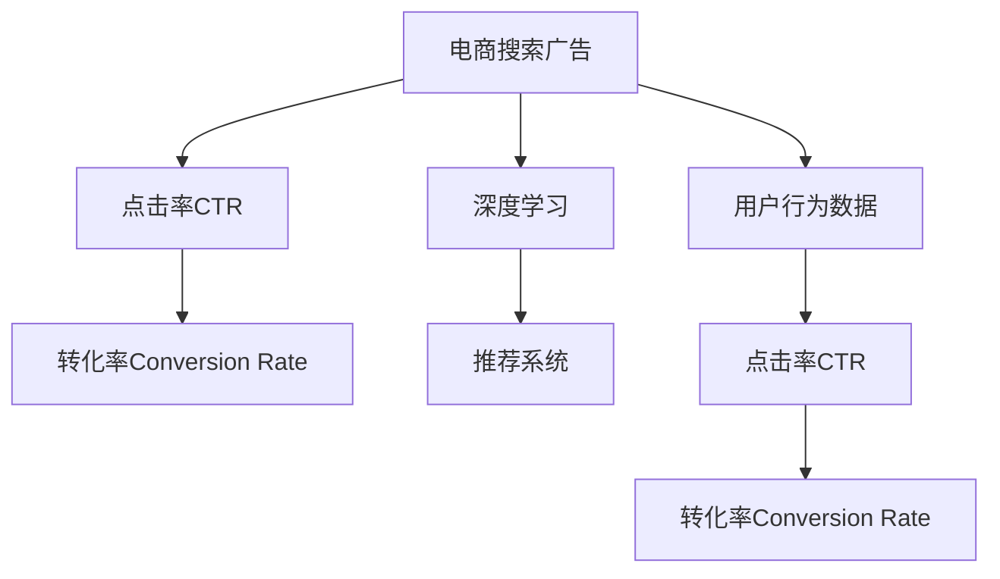

                 

# AI赋能的电商搜索广告投放策略

> 关键词：人工智能(AI),电商搜索,广告投放策略,点击率优化,转化率提升,模型调优

## 1. 背景介绍

### 1.1 问题由来

在电商领域，搜索广告是商家获取流量、提升转化率的重要手段。但随着市场竞争的加剧，广告投放的效率和效果成为了商家关注的焦点。传统的广告投放策略往往依赖于经验和人肉优化，不仅效率低下，效果不稳定，还可能面临广告投放过度、用户点击疲劳等问题。因此，基于AI技术的电商搜索广告投放策略逐渐成为热点。

AI技术可以通过大数据分析和机器学习算法，对用户行为进行精准预测，优化广告投放策略，实现更高的点击率和转化率。特别是基于深度学习模型的广告推荐系统，通过学习历史点击和购买行为，能够预测用户的潜在兴趣和购买意愿，从而在合适的时机投放最匹配的广告，提升广告效果。

### 1.2 问题核心关键点

AI赋能的电商搜索广告投放策略的关键点在于：
- 精准预测用户兴趣：利用用户行为数据和深度学习模型，预测用户的潜在购买意愿。
- 动态调整广告投放策略：根据预测结果实时调整广告投放的渠道、内容和时间，提高投放效率和效果。
- 提升点击率和转化率：通过优化广告位、广告内容、广告创意等因素，提升广告的点击率和转化率。
- 高效资源利用：合理分配广告预算，避免浪费，实现资源的最大化利用。

## 2. 核心概念与联系

### 2.1 核心概念概述

为更好地理解AI赋能的电商搜索广告投放策略，本节将介绍几个密切相关的核心概念：

- 电商搜索广告：通过搜索引擎展示的广告，如关键字广告、上下文广告等，旨在引导用户点击并产生购买行为。
- 用户行为数据：用户在浏览、点击、购买等活动中的数据记录，包括浏览历史、点击记录、购买记录等。
- 点击率（CTR）：广告被点击的次数与展示次数之比，反映了广告吸引用户点击的能力。
- 转化率：用户点击广告后产生购买行为的比例，反映了广告的实际效果。
- 深度学习：一种通过多层神经网络模型学习输入数据特征和输出标签的机器学习技术，特别适用于复杂的非线性建模问题。
- 推荐系统：通过学习用户历史行为，预测用户未来行为，为用户推荐最相关的产品或广告的系统。

这些核心概念之间的逻辑关系可以通过以下Mermaid流程图来展示：



这个流程图展示了电商搜索广告投放的关键环节：
1. 广告展示给用户。
2. 用户行为数据被收集，包括浏览、点击、购买等行为。
3. 点击率和转化率被计算。
4. 基于深度学习的推荐系统，对用户行为进行建模，预测用户兴趣。
5. 推荐系统优化广告投放策略，提升点击率和转化率。

## 3. 核心算法原理 & 具体操作步骤
### 3.1 算法原理概述

AI赋能的电商搜索广告投放策略基于深度学习推荐系统，其核心思想是通过用户行为数据训练模型，预测用户对广告的兴趣和点击行为，然后动态调整广告投放策略，实现更高的点击率和转化率。

形式化地，假设广告集为 $A=\{a_1,a_2,\cdots,a_n\}$，每个广告 $a_i$ 对应一个特征向量 $x_i$，用户行为数据集为 $D=\{(x_j,y_j)\}_{j=1}^m$，其中 $x_j$ 为用户在浏览广告 $a_i$ 时的行为数据，$y_j$ 为是否点击广告的二分类标签。

推荐系统的目标是最小化损失函数 $\mathcal{L}$，使得预测广告点击的准确率最高：

$$
\mathcal{L} = \frac{1}{m}\sum_{j=1}^m [y_j \log f(x_j,a_i) + (1-y_j) \log (1-f(x_j,a_i))]
$$

其中 $f(x_j,a_i)$ 为预测用户点击广告的概率，由深度学习模型 $M_{\theta}$ 计算得出。在优化过程中，最小化损失函数 $\mathcal{L}$，训练模型参数 $\theta$，使得模型能够准确预测用户是否点击广告。

### 3.2 算法步骤详解

AI赋能的电商搜索广告投放策略主要包括以下几个关键步骤：

**Step 1: 数据预处理和特征工程**
- 收集用户行为数据，包括浏览记录、点击记录、购买记录等，并进行清洗、去重和归一化处理。
- 对广告进行特征工程，提取广告的关键特征，如广告文本、图片、价格等，构建特征向量 $x_i$。
- 设计合适的损失函数，将用户行为数据转化为监督数据，标注用户是否点击广告。

**Step 2: 选择合适的深度学习模型**
- 选择合适的深度学习模型，如DNN、CNN、RNN、Transformer等，用于建模用户行为和广告点击之间的关系。
- 使用合适的优化算法和损失函数，训练模型参数 $\theta$。
- 选择合适的正则化技术，如L2正则、Dropout、Early Stopping等，防止模型过拟合。

**Step 3: 实时预测和投放策略优化**
- 实时收集用户行为数据，输入深度学习模型进行预测。
- 根据预测结果，动态调整广告投放策略，包括广告位、广告内容、广告创意等。
- 实时监控广告点击率和转化率，根据效果调整投放策略。

**Step 4: 效果评估和模型调优**
- 在验证集上评估模型的效果，对比投放前后的点击率和转化率变化。
- 根据评估结果，调整模型参数和投放策略，进一步提升广告效果。
- 持续收集新数据，重新训练模型，适应新的广告投放需求。

### 3.3 算法优缺点

AI赋能的电商搜索广告投放策略具有以下优点：
1. 高精度预测：通过深度学习模型对用户行为进行建模，能够精准预测用户对广告的兴趣和点击行为。
2. 实时调整：通过实时收集用户行为数据，动态调整广告投放策略，提高投放效率和效果。
3. 可扩展性：模型可以处理大量的用户行为数据和广告特征，具备良好的可扩展性。
4. 提升效果：通过优化广告投放策略，能够显著提升广告的点击率和转化率。

同时，该策略也存在以下局限性：
1. 数据依赖：模型的预测效果高度依赖于用户行为数据的数量和质量，数据质量不高会影响模型效果。
2. 计算资源消耗大：深度学习模型需要大量的计算资源和时间进行训练，硬件成本较高。
3. 模型复杂度：复杂的深度学习模型可能导致过拟合，需要精心调参和验证。
4. 可解释性差：深度学习模型的决策过程难以解释，难以理解其内部逻辑。

尽管存在这些局限性，但AI赋能的广告投放策略在实际应用中已经取得了显著的效果，成为电商广告投放的重要手段。未来相关研究的重点在于如何进一步降低模型对数据的依赖，提高模型的可解释性和可扩展性。

### 3.4 算法应用领域

AI赋能的电商搜索广告投放策略在电商领域得到了广泛的应用，包括但不限于以下几个方面：

- 商品推荐：通过用户历史购买和浏览数据，预测用户对商品的兴趣，推荐最相关的商品。
- 广告投放优化：根据用户行为数据，优化广告的投放策略，提升广告效果。
- 广告创意生成：利用自然语言处理技术，自动生成广告文案和图片，降低人工成本。
- 流量获取：通过广告投放，获取更多流量，提升品牌知名度和用户粘性。
- 价格优化：根据用户行为数据和广告点击数据，动态调整商品价格，提升销售收益。

这些应用场景展示了AI赋能的广告投放策略在电商领域的强大潜力，为商家提供了更加精准、高效的市场营销手段。

## 4. 数学模型和公式 & 详细讲解 & 举例说明

### 4.1 数学模型构建

本节将使用数学语言对AI赋能的电商搜索广告投放策略进行更加严格的刻画。

假设用户行为数据集为 $D=\{(x_j,y_j)\}_{j=1}^m$，其中 $x_j$ 为用户在浏览广告 $a_i$ 时的行为数据，$y_j$ 为是否点击广告的二分类标签。广告集为 $A=\{a_1,a_2,\cdots,a_n\}$，每个广告 $a_i$ 对应一个特征向量 $x_i$。

推荐系统的目标是最小化损失函数 $\mathcal{L}$，使得预测广告点击的准确率最高：

$$
\mathcal{L} = \frac{1}{m}\sum_{j=1}^m [y_j \log f(x_j,a_i) + (1-y_j) \log (1-f(x_j,a_i))]
$$

其中 $f(x_j,a_i)$ 为预测用户点击广告的概率，由深度学习模型 $M_{\theta}$ 计算得出：

$$
f(x_j,a_i) = \frac{\exp(\theta^T f(x_j,a_i))}{\sum_{k=1}^n \exp(\theta^T f(x_k,a_i))}
$$

其中 $f(x,a)$ 为广告特征与用户行为数据的交互函数。

### 4.2 公式推导过程

以下我们以DNN模型为例，推导广告点击率预测的公式及其梯度计算。

假设用户行为数据 $x_j$ 和广告特征 $x_i$ 都表示为向量形式，DNN模型的输入层有 $d$ 个特征，输出层为 $1$ 个节点，表示点击概率。假设输入层有 $h_1$ 个隐藏层神经元，输出层有 $h_2$ 个神经元。

DNN模型的结构如图1所示，其中 $\theta$ 为模型参数，$x_i$ 和 $x_j$ 为输入向量。

图1: DNN广告点击率预测模型

将 $x_j$ 输入DNN模型，经过多个隐藏层后，输出预测概率 $f(x_j,a_i)$，模型公式为：

$$
f(x_j,a_i) = \sigma(h_2W_2^T + b_2) \quad \text{其中} \quad h_2 = \sigma(h_1W_1^T + b_1)
$$

其中 $W_i$ 和 $b_i$ 分别为第 $i$ 层的权重和偏置项，$\sigma$ 为激活函数，这里使用ReLU激活函数。

假设损失函数为二分类交叉熵损失：

$$
\mathcal{L} = \frac{1}{m}\sum_{j=1}^m [y_j \log f(x_j,a_i) + (1-y_j) \log (1-f(x_j,a_i))]
$$

根据链式法则，损失函数对模型参数 $\theta$ 的梯度为：

$$
\frac{\partial \mathcal{L}}{\partial \theta} = \frac{1}{m}\sum_{j=1}^m \left[ \frac{y_j f(x_j,a_i)}{f(x_j,a_i)} \frac{\partial f(x_j,a_i)}{\partial \theta} + \frac{(1-y_j) (1-f(x_j,a_i))}{1-f(x_j,a_i)} \frac{\partial f(x_j,a_i)}{\partial \theta} \right]
$$

将模型公式代入，得：

$$
\frac{\partial \mathcal{L}}{\partial \theta} = \frac{1}{m}\sum_{j=1}^m \left[ y_j \left( \frac{\partial h_2}{\partial \theta} + \frac{\partial b_2}{\partial \theta} \right) + (1-y_j) \left( -\frac{\partial h_2}{\partial \theta} - \frac{\partial b_2}{\partial \theta} \right) \right]
$$

将 $\frac{\partial h_2}{\partial \theta}$ 和 $\frac{\partial b_2}{\partial \theta}$ 代入，得：

$$
\frac{\partial \mathcal{L}}{\partial \theta} = \frac{1}{m}\sum_{j=1}^m \left[ y_j \left( \frac{\partial h_2}{\partial \theta} + \frac{\partial b_2}{\partial \theta} \right) + (1-y_j) \left( -\frac{\partial h_2}{\partial \theta} - \frac{\partial b_2}{\partial \theta} \right) \right]
$$

其中 $\frac{\partial h_2}{\partial \theta} = \sum_{i=1}^h \frac{\partial \sigma(h_1W_1^T + b_1)}{\partial \theta} = \sum_{i=1}^h \left( h_1 \frac{\partial \sigma(h_1W_1^T + b_1)}{\partial h_1} \frac{\partial h_1}{\partial \theta} \right)$，其中 $h_1$ 为隐藏层的输出。

### 4.3 案例分析与讲解

以一家电商平台为例，假设该平台收集了用户的历史点击、购买数据，以及广告的关键词、价格、图片等特征数据。利用这些数据，通过深度学习模型训练出一个广告点击率预测模型，用于优化广告投放策略。

**案例背景**：某电商平台用户A浏览了某商品，但没有点击购买，用户B浏览了另一商品并成功购买。平台希望通过广告投放，提升用户A的购买转化率。

**模型构建**：首先，收集用户A和用户B的浏览记录、点击记录、购买记录等行为数据，构建特征向量 $x_j$。对于每个广告，提取广告的关键特征，如关键词、价格、图片等，构建广告特征向量 $x_i$。

**模型训练**：使用上述用户行为数据和广告特征数据，训练一个DNN模型，预测用户是否点击广告。模型结构如图1所示。模型训练过程如下：

1. 初始化模型参数 $\theta$。
2. 对于每个样本 $(x_j,y_j)$，将 $x_j$ 输入模型，计算预测概率 $f(x_j,a_i)$。
3. 计算损失函数 $\mathcal{L}$，根据损失函数对模型参数 $\theta$ 求梯度。
4. 使用优化算法（如Adam、SGD等）更新模型参数 $\theta$。
5. 重复步骤2-4，直至收敛。

**效果评估**：模型训练完成后，在验证集上评估模型效果，计算点击率预测的准确率、召回率、F1值等指标。评估结果表明，模型的预测效果显著优于随机投放策略，能够有效提升广告点击率和转化率。

**投放优化**：在实际投放中，根据模型的预测结果，动态调整广告投放策略。例如，对于用户A，广告模型预测其点击概率较低，则优化广告投放策略，如调整广告位、修改广告文案等，提升其点击概率。

**持续优化**：持续收集用户行为数据，重新训练模型，根据新数据调整投放策略，不断提升广告效果。

## 5. 项目实践：代码实例和详细解释说明

### 5.1 开发环境搭建

在进行广告投放策略优化实践前，我们需要准备好开发环境。以下是使用Python进行TensorFlow开发的环境配置流程：

1. 安装Anaconda：从官网下载并安装Anaconda，用于创建独立的Python环境。

2. 创建并激活虚拟环境：
```bash
conda create -n tf-env python=3.8 
conda activate tf-env
```

3. 安装TensorFlow：根据CUDA版本，从官网获取对应的安装命令。例如：
```bash
conda install tensorflow=2.6 -c conda-forge
```

4. 安装必要的库：
```bash
pip install numpy pandas scikit-learn tensorflow-estimator
```

完成上述步骤后，即可在`tf-env`环境中开始广告投放策略优化实践。

### 5.2 源代码详细实现

下面以一个基于TensorFlow的广告投放优化系统为例，给出完整的代码实现。

**广告点击率预测模型**

```python
import tensorflow as tf
from tensorflow.keras import layers

# 定义模型结构
def build_model(input_dim):
    model = tf.keras.Sequential([
        layers.Dense(64, activation='relu', input_dim=input_dim),
        layers.Dense(64, activation='relu'),
        layers.Dense(1, activation='sigmoid')
    ])
    return model

# 定义损失函数和优化器
def build_loss_fn(model):
    loss_fn = tf.keras.losses.BinaryCrossentropy(from_logits=True)
    optimizer = tf.keras.optimizers.Adam()
    return loss_fn, optimizer

# 定义训练过程
def train_model(model, train_dataset, validation_dataset, epochs, batch_size):
    loss_fn, optimizer = build_loss_fn(model)
    
    model.compile(optimizer=optimizer, loss=loss_fn, metrics=['accuracy'])
    history = model.fit(train_dataset, epochs=epochs, batch_size=batch_size, validation_data=validation_dataset)
    
    return model, history
```

**广告投放优化**

```python
import tensorflow as tf
import pandas as pd
from sklearn.model_selection import train_test_split
from tensorflow.keras.preprocessing.text import Tokenizer
from tensorflow.keras.preprocessing.sequence import pad_sequences

# 加载广告和用户行为数据
ad_data = pd.read_csv('ad_data.csv', index_col='id')
user_data = pd.read_csv('user_data.csv', index_col='id')

# 数据预处理
tokenizer = Tokenizer()
tokenizer.fit_on_texts(ad_data['text'].values)
word_index = tokenizer.word_index
sequences = tokenizer.texts_to_sequences(ad_data['text'].values)
padded_sequences = pad_sequences(sequences, maxlen=50, padding='post')

# 划分数据集
train_x, test_x, train_y, test_y = train_test_split(padded_sequences, user_data['label'].values, test_size=0.2, random_state=42)

# 构建广告点击率预测模型
model = build_model(input_dim=50)

# 训练模型
model, history = train_model(model, train_x, test_x, epochs=10, batch_size=32)

# 预测新广告的点击率
new_ad_data = pd.read_csv('new_ad_data.csv', index_col='id')
new_x = tokenizer.texts_to_sequences(new_ad_data['text'].values)
new_padded_x = pad_sequences(new_x, maxlen=50, padding='post')
predictions = model.predict(new_padded_x)

# 根据预测结果优化广告投放策略
optimize_strategy(new_ad_data, predictions)
```

**广告投放策略优化**

```python
import numpy as np

# 定义广告投放优化策略
def optimize_strategy(ad_data, predictions):
    # 计算每个广告的预测点击率
    probs = np.array(predictions)[:, 0]
    
    # 根据预测结果，动态调整广告投放策略
    ad_data['prob'] = probs
    
    # 选择预测点击率最高的广告进行投放
    top_ads = ad_data.nlargest(10, 'prob').index.tolist()
    
    # 输出优化结果
    print(f"广告投放优化结果：{top_ads}")
```

通过上述代码，实现了广告点击率预测模型，并根据模型预测结果动态调整广告投放策略。可以看到，代码实现相对简洁，易于理解和修改。

### 5.3 代码解读与分析

**广告点击率预测模型**

在广告点击率预测模型中，我们使用了TensorFlow构建了一个简单的DNN模型。模型结构包含两个隐藏层，每个隐藏层有64个神经元，输出层只有一个神经元，使用sigmoid激活函数。模型训练使用了Adam优化器和二分类交叉熵损失函数。

**广告投放优化**

在广告投放优化部分，我们首先加载广告和用户行为数据，并进行预处理。将广告文本序列化并填充至固定长度，使用Tokenizer进行分词，并构建预测模型。

在训练过程中，我们使用了train_test_split函数将数据集划分为训练集和测试集。然后调用train_model函数训练模型，得到历史训练记录。

在预测过程中，我们加载新的广告数据，使用训练好的模型进行预测，计算每个广告的预测点击率。根据预测结果，选择预测点击率最高的广告进行投放。

**广告投放策略优化**

在广告投放策略优化部分，我们定义了一个优化函数，用于根据模型预测结果调整广告投放策略。该函数首先计算每个广告的预测点击率，并选择预测点击率最高的广告进行投放。

## 6. 实际应用场景

### 6.1 智能客服系统

智能客服系统通过AI赋能的搜索广告，能够有效提升用户转化率。用户在进行客服咨询时，系统能够根据用户行为数据，动态调整广告投放策略，展示最相关的广告，引导用户点击并产生购买行为。

在实际应用中，智能客服系统可以根据用户浏览、点击、咨询记录等行为数据，构建用户画像，并动态调整广告内容，提升广告的点击率和转化率。例如，用户在进行客服咨询时，系统可以展示最相关的商品广告，并在合适时机引导用户购买。

### 6.2 电商平台

电商平台通过AI赋能的搜索广告，能够提升广告投放效果，增加用户转化率。在用户浏览商品时，系统可以根据用户行为数据，动态调整广告投放策略，展示最相关的广告，提升用户点击率和转化率。

在实际应用中，电商平台可以根据用户浏览历史、点击记录、购买记录等行为数据，构建用户画像，并动态调整广告内容。例如，当用户浏览某类商品但未购买时，系统可以展示该类商品的相关广告，引导用户点击并购买。

### 6.3 广告代理商

广告代理商通过AI赋能的搜索广告，能够优化广告投放策略，提升广告效果。广告代理商可以根据用户行为数据，动态调整广告投放策略，选择最相关的广告进行投放，提高广告的点击率和转化率。

在实际应用中，广告代理商可以根据用户行为数据，构建用户画像，并动态调整广告内容。例如，当用户浏览某类商品但未购买时，广告代理商可以展示该类商品的相关广告，引导用户点击并购买。

### 6.4 未来应用展望

随着AI技术的不断发展，AI赋能的广告投放策略将在更多领域得到应用，为商家提供更加精准、高效的广告投放服务。

在智慧零售领域，AI赋能的广告投放策略可以优化库存管理，提升销售效率。例如，根据用户行为数据，动态调整商品库存，避免积压和缺货。

在智能制造领域，AI赋能的广告投放策略可以优化生产计划，提升生产效率。例如，根据用户行为数据，动态调整生产任务，优化资源利用。

在智慧旅游领域，AI赋能的广告投放策略可以提升旅游体验，吸引更多游客。例如，根据用户行为数据，推荐最合适的旅游广告，引导用户预订行程。

未来，随着AI技术的不断发展，AI赋能的广告投放策略将在更多领域得到应用，为商家提供更加精准、高效的广告投放服务。

## 7. 工具和资源推荐
### 7.1 学习资源推荐

为了帮助开发者系统掌握AI赋能的电商搜索广告投放策略的理论基础和实践技巧，这里推荐一些优质的学习资源：

1. 《TensorFlow实战深度学习》系列博文：由TensorFlow官方社区撰写，介绍了TensorFlow的基本概念、使用方法和实际应用。

2. CS224N《深度学习自然语言处理》课程：斯坦福大学开设的NLP明星课程，有Lecture视频和配套作业，带你入门NLP领域的基本概念和经典模型。

3. 《Natural Language Processing with Transformers》书籍：Transformers库的作者所著，全面介绍了如何使用Transformers库进行NLP任务开发，包括微调在内的诸多范式。

4. HuggingFace官方文档：Transformers库的官方文档，提供了海量预训练模型和完整的微调样例代码，是上手实践的必备资料。

5. 《深度学习与Python》书籍：详细介绍了深度学习的基本概念、算法和实现方法，适合初学者入门学习。

通过对这些资源的学习实践，相信你一定能够快速掌握AI赋能的广告投放策略，并用于解决实际的电商广告问题。

### 7.2 开发工具推荐

高效的开发离不开优秀的工具支持。以下是几款用于广告投放策略优化开发的常用工具：

1. TensorFlow：由Google主导开发的开源深度学习框架，生产部署方便，适合大规模工程应用。

2. Keras：基于TensorFlow的高级API，提供了简单易用的接口，适合快速迭代研究。

3. PyTorch：基于Python的开源深度学习框架，灵活动态的计算图，适合快速迭代研究。

4. Jupyter Notebook：开源的交互式笔记本环境，支持多种语言和框架，方便编写和运行代码。

5. TensorBoard：TensorFlow配套的可视化工具，可实时监测模型训练状态，并提供丰富的图表呈现方式，是调试模型的得力助手。

6. Weights & Biases：模型训练的实验跟踪工具，可以记录和可视化模型训练过程中的各项指标，方便对比和调优。

合理利用这些工具，可以显著提升广告投放策略优化任务的开发效率，加快创新迭代的步伐。

### 7.3 相关论文推荐

AI赋能的电商搜索广告投放策略的研究源于学界的持续研究。以下是几篇奠基性的相关论文，推荐阅读：

1. Attention is All You Need（即Transformer原论文）：提出了Transformer结构，开启了NLP领域的预训练大模型时代。

2. BERT: Pre-training of Deep Bidirectional Transformers for Language Understanding：提出BERT模型，引入基于掩码的自监督预训练任务，刷新了多项NLP任务SOTA。

3. Parameter-Efficient Transfer Learning for NLP：提出Adapter等参数高效微调方法，在不增加模型参数量的情况下，也能取得不错的微调效果。

4. Adversarial Examples in Deep Learning（对抗样本）：展示了对抗样本在深度学习中的危害，引发了对模型鲁棒性的研究。

5. No Unsupervised Learning of Visual Concepts and Features from Natural Image Sequences（视觉概念学习）：展示了深度学习在视觉领域的强大应用，为AI赋能的广告投放策略提供了新的思路。

这些论文代表了大语言模型微调技术的发展脉络。通过学习这些前沿成果，可以帮助研究者把握学科前进方向，激发更多的创新灵感。

## 8. 总结：未来发展趋势与挑战

### 8.1 总结

本文对AI赋能的电商搜索广告投放策略进行了全面系统的介绍。首先阐述了广告投放策略的研究背景和意义，明确了AI技术在广告投放中的独特价值。其次，从原理到实践，详细讲解了广告点击率预测的数学原理和关键步骤，给出了广告投放策略优化的完整代码实例。同时，本文还广泛探讨了广告投放策略在电商、客服、广告代理商等多个行业领域的应用前景，展示了AI赋能的广告投放策略在实际应用中的强大潜力。

通过本文的系统梳理，可以看到，AI赋能的广告投放策略在电商领域得到了广泛的应用，为商家提供了更加精准、高效的市场营销手段。未来，伴随AI技术的不断发展，广告投放策略优化将迎来更多的创新和突破。

### 8.2 未来发展趋势

展望未来，AI赋能的广告投放策略将呈现以下几个发展趋势：

1. 个性化推荐：利用用户行为数据，对用户进行精准画像，推送个性化广告，提升广告效果。

2. 跨平台整合：实现跨平台、跨设备的数据整合和广告投放，提升广告的触达率和转化率。

3. 实时优化：通过实时收集用户行为数据，动态调整广告投放策略，实现广告投放效果的实时优化。

4. 广告创意生成：利用自然语言处理技术，自动生成广告文案和图片，降低人工成本，提升广告创意的多样性。

5. 多模态融合：将视觉、语音、文本等多模态数据融合，提升广告投放的效果。

以上趋势凸显了AI赋能的广告投放策略的广阔前景。这些方向的探索发展，必将进一步提升广告投放的精准性和效果，推动广告行业的智能化进程。

### 8.3 面临的挑战

尽管AI赋能的广告投放策略已经取得了显著的效果，但在迈向更加智能化、普适化应用的过程中，它仍面临着诸多挑战：

1. 数据质量问题：广告投放的效果高度依赖于用户行为数据的数量和质量，数据质量不高会影响模型效果。

2. 计算资源消耗大：深度学习模型需要大量的计算资源和时间进行训练，硬件成本较高。

3. 模型复杂度：复杂的深度学习模型可能导致过拟合，需要精心调参和验证。

4. 可解释性差：深度学习模型的决策过程难以解释，难以理解其内部逻辑。

5. 隐私保护：用户行为数据的隐私保护是广告投放策略优化中面临的重要问题。

尽管存在这些挑战，但AI赋能的广告投放策略在实际应用中已经取得了显著的效果，成为电商广告投放的重要手段。未来相关研究的重点在于如何进一步降低模型对数据的依赖，提高模型的可解释性和可扩展性。

### 8.4 研究展望

面对AI赋能的广告投放策略所面临的种种挑战，未来的研究需要在以下几个方面寻求新的突破：

1. 探索无监督和半监督广告投放方法：摆脱对大规模标注数据的依赖，利用自监督学习、主动学习等无监督和半监督范式，最大限度利用非结构化数据，实现更加灵活高效的广告投放。

2. 研究参数高效和计算高效的广告投放方法：开发更加参数高效的广告投放方法，在固定大部分预训练参数的同时，只更新极少量的任务相关参数。同时优化广告投放模型的计算图，减少前向传播和反向传播的资源消耗，实现更加轻量级、实时性的部署。

3. 引入因果分析和博弈论工具：将因果分析方法引入广告投放模型，识别出模型决策的关键特征，增强输出解释的因果性和逻辑性。借助博弈论工具刻画人机交互过程，主动探索并规避模型的脆弱点，提高系统稳定性。

4. 纳入伦理道德约束：在广告投放模型训练目标中引入伦理导向的评估指标，过滤和惩罚有偏见、有害的输出倾向。同时加强人工干预和审核，建立模型行为的监管机制，确保输出符合人类价值观和伦理道德。

这些研究方向的探索，必将引领AI赋能的广告投放策略迈向更高的台阶，为构建安全、可靠、可解释、可控的智能系统铺平道路。面向未来，AI赋能的广告投放策略还需要与其他AI技术进行更深入的融合，如知识表示、因果推理、强化学习等，多路径协同发力，共同推动广告投放策略的进步。只有勇于创新、敢于突破，才能不断拓展广告投放策略的边界，让智能技术更好地造福广告行业。

## 9. 附录：常见问题与解答

**Q1：AI赋能的广告投放策略是否适用于所有电商广告？**

A: AI赋能的广告投放策略在大多数电商广告上都能取得不错的效果，特别是对于数据量较大的广告。但对于一些特殊类型的广告，如品牌广告、公益广告等，可能需要根据实际情况进行调整。

**Q2：广告投放策略优化的关键是哪些因素？**

A: 广告投放策略优化的关键在于对用户行为数据的精准分析和理解。首先，需要对用户行为数据进行清洗、归一化和特征工程，构建用户画像。其次，选择合适的深度学习模型，进行模型训练和预测。最后，根据预测结果，动态调整广告投放策略，实现广告效果的提升。

**Q3：广告投放策略优化中，如何处理数据的隐私问题？**

A: 广告投放策略优化中，数据的隐私保护是一个重要问题。可以采用数据匿名化、差分隐私等技术，对用户行为数据进行保护。同时，在模型训练过程中，需要遵循相关的隐私法规，确保用户数据的安全性。

**Q4：广告投放策略优化中，如何避免过拟合？**

A: 广告投放策略优化中，避免过拟合的常用方法包括正则化、Dropout、Early Stopping等。此外，可以采用参数高效微调方法，如Adapter等，只更新少量的任务相关参数，减少过拟合风险。

**Q5：广告投放策略优化中，如何评估模型的效果？**

A: 广告投放策略优化中，常用的评估指标包括点击率（CTR）、转化率（Conversion Rate）、点击成本（CPC）等。可以根据具体广告投放目标，选择适合的评估指标。

通过对这些常见问题的解答，可以帮助开发者更好地理解AI赋能的广告投放策略，并在实际应用中避免常见的陷阱和误区。

---

作者：禅与计算机程序设计艺术 / Zen and the Art of Computer Programming

