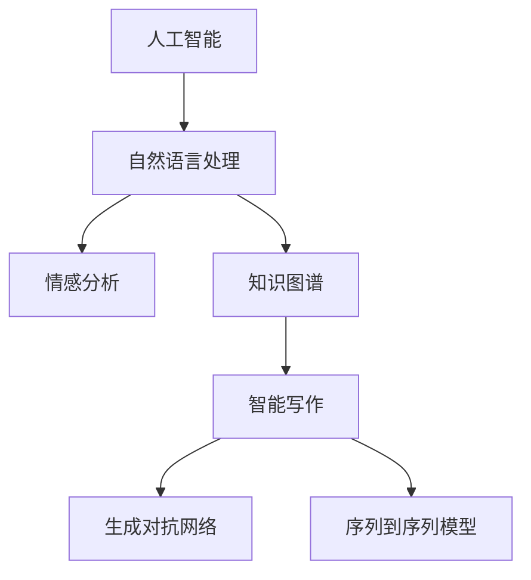

                 

# AI辅助的回忆录写作：个人历史的数字化

> 关键词：人工智能, 自然语言处理, 数字回忆录, 智能写作, 情感分析, 知识图谱, 交互式体验

## 1. 背景介绍

### 1.1 问题由来

在数字化时代，人们的记忆方式也在发生变化。传统的纸质日记、信件等回忆录形式，逐渐被数字化的文本、图片、视频等所替代。但面对海量、无序的个人历史数据，如何高效、准确地组织和呈现这些记忆，成为了新的挑战。

人工智能（AI）技术的迅猛发展，为这一挑战提供了新的解决方案。通过自然语言处理（NLP）和智能写作等技术，AI可以辅助个人构建结构化、生动的回忆录，让人们以全新的方式重温过去，发现隐藏在历史中的线索和故事。

### 1.2 问题核心关键点

AI辅助回忆录写作的核心在于：

1. **数据收集与整理**：从多源、多模态数据中收集和整理个人的历史信息。
2. **情感分析与理解**：通过NLP技术理解文本中的情感信息，捕捉作者的情感波动。
3. **知识图谱构建**：利用知识图谱技术，将分散的个人记忆构建为相互关联的网络。
4. **智能写作与编辑**：结合生成对抗网络（GAN）和序列到序列模型，生成自然流畅、结构合理的文本。
5. **交互式体验设计**：设计交互式界面，使用户能够灵活探索、编辑和分享回忆录。

这些关键点共同构成了AI辅助回忆录写作的技术框架，使其能够高效、准确地帮助用户重塑个人历史。

### 1.3 问题研究意义

AI辅助回忆录写作技术，不仅能够帮助个人更好地保存和分享自己的历史，还能在心理治疗、历史研究、教育等领域发挥重要作用：

1. **心理治疗**：回忆录写作是一种有效的心理治疗手段，通过重温过去，缓解心理创伤。
2. **历史研究**：个人记忆可以补充历史资料的空白，为历史研究提供第一手材料。
3. **教育培训**：利用回忆录，进行跨代际的教育和情感教育，促进社会和谐。
4. **文化传承**：记录个人生活细节，丰富家族文化和社区记忆。

总之，AI辅助回忆录写作技术，将成为数字化时代的重要工具，帮助我们更好地理解自我、认识历史，传递和保存人类的情感和智慧。

## 2. 核心概念与联系

### 2.1 核心概念概述

为更好地理解AI辅助回忆录写作的原理和架构，本节将介绍几个核心概念：

- **人工智能（AI）**：通过模拟人类智能行为，使计算机具备感知、学习、推理等能力，以解决复杂问题。
- **自然语言处理（NLP）**：研究如何让计算机理解和处理人类语言，包括语音识别、语义理解、情感分析等。
- **知识图谱**：以图形化的方式表示实体、关系及其属性，用于描述和探索复杂的信息结构。
- **生成对抗网络（GAN）**：通过两个神经网络的对抗过程，生成高质量、具有真实感的图像、文本等。
- **序列到序列模型（Seq2Seq）**：一种用于序列到序列映射的神经网络模型，如机器翻译、摘要生成等。

这些核心概念之间的逻辑关系可以通过以下Mermaid流程图来展示：



这个流程图展示了人工智能技术在回忆录写作中的应用框架：

1. 通过NLP技术，AI能够理解文本中的情感和信息。
2. 知识图谱技术帮助构建个人记忆的网络结构。
3. 智能写作技术生成流畅的文本。
4. GAN和Seq2Seq模型用于文本生成和编辑。
5. 结合以上技术，AI构建完整的回忆录写作系统。

## 3. 核心算法原理 & 具体操作步骤
### 3.1 算法原理概述

AI辅助回忆录写作的算法原理，主要包括数据收集与整理、情感分析、知识图谱构建、智能写作与编辑等多个环节。每个环节的核心算法和技术如下：

1. **数据收集与整理**：
   - **算法**：爬虫技术、文本分类、关键词提取等。
   - **步骤**：从社交媒体、邮件、日记等平台收集文本数据，进行分类和去重。

2. **情感分析**：
   - **算法**：情感分类、情感词典、情绪识别等。
   - **步骤**：对文本数据进行情感分类，识别情感波动和情绪变化。

3. **知识图谱构建**：
   - **算法**：实体识别、关系抽取、知识融合等。
   - **步骤**：使用NLP技术识别文本中的实体和关系，构建知识图谱。

4. **智能写作与编辑**：
   - **算法**：文本生成、文本编辑、风格转换等。
   - **步骤**：使用GAN生成流畅的文本，使用Seq2Seq模型进行结构优化和风格调整。

### 3.2 算法步骤详解

#### 3.2.1 数据收集与整理

1. **爬虫技术**：
   - **算法**：使用Python的BeautifulSoup、Scrapy等库进行网页爬虫。
   - **步骤**：从社交媒体、博客、邮箱等平台抓取历史文本数据。

2. **文本分类**：
   - **算法**：朴素贝叶斯、支持向量机（SVM）、随机森林等。
   - **步骤**：对文本数据进行分类，分为日记、信件、文章等不同类别。

3. **关键词提取**：
   - **算法**：TF-IDF、word2vec、BERT等。
   - **步骤**：从文本中提取关键词，用于构建回忆录的标签和索引。

#### 3.2.2 情感分析

1. **情感分类**：
   - **算法**：情感词典、情感分类器（如VADER）等。
   - **步骤**：对文本进行情感分类，分为正面、中性、负面三种情绪。

2. **情绪识别**：
   - **算法**：情绪识别算法，如Plutchik情绪模型。
   - **步骤**：识别文本中的情绪变化，如喜悦、悲伤、愤怒等。

#### 3.2.3 知识图谱构建

1. **实体识别**：
   - **算法**：命名实体识别（NER）、关系抽取等。
   - **步骤**：使用NER算法识别文本中的实体（如人名、地名、时间等），构建实体节点。

2. **关系抽取**：
   - **算法**：依存句法分析、关系抽取算法等。
   - **步骤**：使用依存句法分析识别实体之间的关系，构建图谱中的边。

3. **知识融合**：
   - **算法**：知识融合算法，如RDFS、OWL等。
   - **步骤**：将分散的实体和关系节点进行融合，构建完整、连贯的知识图谱。

#### 3.2.4 智能写作与编辑

1. **文本生成**：
   - **算法**：GAN、Seq2Seq模型等。
   - **步骤**：使用GAN生成流畅、连贯的文本片段，使用Seq2Seq模型进行结构优化。

2. **文本编辑**：
   - **算法**：自然语言生成（NLG）、编辑算法等。
   - **步骤**：对生成的文本进行语法、拼写、风格等方面的编辑，确保文本质量。

3. **风格转换**：
   - **算法**：风格迁移算法，如Fairseq、FastText等。
   - **步骤**：将文本转换为不同的风格，如文学风格、新闻风格等。

### 3.3 算法优缺点

AI辅助回忆录写作的算法优点包括：

1. **高效性**：自动化处理大量数据，节省人工成本。
2. **准确性**：利用先进算法和模型，保证分析的准确性和可靠性。
3. **灵活性**：能够根据不同用户需求进行个性化调整。

但其缺点也不容忽视：

1. **隐私风险**：收集和处理个人数据可能涉及隐私问题。
2. **理解限制**：AI可能无法完全理解人类复杂的情感和细节。
3. **技术门槛**：需要一定的技术背景和专业知识。

### 3.4 算法应用领域

AI辅助回忆录写作技术，在多个领域都有广泛的应用：

1. **个人历史记录**：帮助用户构建数字化的回忆录，保存个人历史。
2. **心理健康**：通过情感分析，辅助心理治疗，缓解心理压力。
3. **历史研究**：提供补充资料，帮助研究人员挖掘历史细节。
4. **教育培训**：通过回忆录教育，进行跨代际交流和文化传承。
5. **文化传承**：记录家族文化和社区记忆，丰富文化多样性。

## 4. 数学模型和公式 & 详细讲解 & 举例说明
### 4.1 数学模型构建

AI辅助回忆录写作的数学模型，主要涉及文本分类、情感分析、知识图谱构建、文本生成等多个方面。这里以文本分类为例，进行详细讲解。

假设文本数据集为 $D=\{(x_i, y_i)\}_{i=1}^N$，其中 $x_i$ 为文本样本，$y_i$ 为文本的分类标签。

定义模型 $M_{\theta}$ 在输入 $x$ 上的损失函数为 $\ell(M_{\theta}(x),y)$，则在数据集 $D$ 上的经验风险为：

$$
\mathcal{L}(\theta) = \frac{1}{N} \sum_{i=1}^N \ell(M_{\theta}(x_i),y_i)
$$

常用的损失函数包括交叉熵损失、均方误差损失等。这里以交叉熵损失为例，定义模型输出为 $\hat{y}=M_{\theta}(x)$，则交叉熵损失为：

$$
\ell(M_{\theta}(x),y) = -y\log(\hat{y}) - (1-y)\log(1-\hat{y})
$$

其梯度计算公式为：

$$
\nabla_{\theta}\mathcal{L}(\theta) = \frac{1}{N} \sum_{i=1}^N \nabla_{\theta}\ell(M_{\theta}(x_i),y_i)
$$

### 4.2 公式推导过程

以文本分类为例，推导交叉熵损失的梯度计算公式。

1. **模型定义**：
   - **算法**：神经网络模型，如卷积神经网络（CNN）、长短时记忆网络（LSTM）等。
   - **步骤**：定义模型结构，包括输入层、隐藏层、输出层等。

2. **损失函数**：
   - **算法**：交叉熵损失函数。
   - **步骤**：计算模型输出与真实标签的交叉熵损失。

3. **梯度计算**：
   - **算法**：反向传播算法。
   - **步骤**：通过反向传播算法计算模型参数的梯度。

4. **参数更新**：
   - **算法**：梯度下降等优化算法。
   - **步骤**：根据梯度更新模型参数，最小化损失函数。

### 4.3 案例分析与讲解

以GPT-3为例，介绍其在文本生成中的应用。

假设用户输入一段文本片段，要求生成一段与之相关的故事。GPT-3通过读取大规模语料库，理解输入文本的上下文和语义，生成连贯、流畅的文本。

其工作流程如下：

1. **输入处理**：将输入文本转换为模型所需的格式。
2. **解码过程**：使用自回归生成模型，逐步生成文本。
3. **输出优化**：对生成的文本进行语言模型解码，优化语言流畅性。

使用Python代码实现GPT-3的文本生成过程：

```python
from transformers import GPT3LMHeadModel, GPT3Tokenizer

tokenizer = GPT3Tokenizer.from_pretrained('gpt3')
model = GPT3LMHeadModel.from_pretrained('gpt3')

input_text = "这是一个简单的文本输入"
input_ids = tokenizer.encode(input_text, return_tensors='pt')

generated_tokens = model.generate(input_ids)
generated_text = tokenizer.decode(generated_tokens[0], skip_special_tokens=True)

print(generated_text)
```

以上代码展示了如何使用GPT-3生成一段基于输入文本的故事。

## 5. 项目实践：代码实例和详细解释说明
### 5.1 开发环境搭建

在进行项目实践前，我们需要准备好开发环境。以下是使用Python进行PyTorch开发的环境配置流程：

1. 安装Anaconda：从官网下载并安装Anaconda，用于创建独立的Python环境。

2. 创建并激活虚拟环境：
```bash
conda create -n pytorch-env python=3.8 
conda activate pytorch-env
```

3. 安装PyTorch：根据CUDA版本，从官网获取对应的安装命令。例如：
```bash
conda install pytorch torchvision torchaudio cudatoolkit=11.1 -c pytorch -c conda-forge
```

4. 安装Transformers库：
```bash
pip install transformers
```

5. 安装各类工具包：
```bash
pip install numpy pandas scikit-learn matplotlib tqdm jupyter notebook ipython
```

完成上述步骤后，即可在`pytorch-env`环境中开始项目实践。

### 5.2 源代码详细实现

这里我们以文本分类任务为例，给出使用Transformers库对BERT模型进行文本分类的PyTorch代码实现。

首先，定义数据处理函数：

```python
from transformers import BertTokenizer
from torch.utils.data import Dataset
import torch

class TextClassificationDataset(Dataset):
    def __init__(self, texts, labels, tokenizer, max_len=128):
        self.texts = texts
        self.labels = labels
        self.tokenizer = tokenizer
        self.max_len = max_len
        
    def __len__(self):
        return len(self.texts)
    
    def __getitem__(self, item):
        text = self.texts[item]
        label = self.labels[item]
        
        encoding = self.tokenizer(text, return_tensors='pt', max_length=self.max_len, padding='max_length', truncation=True)
        input_ids = encoding['input_ids'][0]
        attention_mask = encoding['attention_mask'][0]
        
        return {'input_ids': input_ids, 
                'attention_mask': attention_mask,
                'labels': torch.tensor(label, dtype=torch.long)}
```

然后，定义模型和优化器：

```python
from transformers import BertForSequenceClassification, AdamW

model = BertForSequenceClassification.from_pretrained('bert-base-cased', num_labels=2)

optimizer = AdamW(model.parameters(), lr=2e-5)
```

接着，定义训练和评估函数：

```python
from torch.utils.data import DataLoader
from tqdm import tqdm
from sklearn.metrics import accuracy_score

device = torch.device('cuda') if torch.cuda.is_available() else torch.device('cpu')
model.to(device)

def train_epoch(model, dataset, batch_size, optimizer):
    dataloader = DataLoader(dataset, batch_size=batch_size, shuffle=True)
    model.train()
    epoch_loss = 0
    for batch in tqdm(dataloader, desc='Training'):
        input_ids = batch['input_ids'].to(device)
        attention_mask = batch['attention_mask'].to(device)
        labels = batch['labels'].to(device)
        model.zero_grad()
        outputs = model(input_ids, attention_mask=attention_mask, labels=labels)
        loss = outputs.loss
        epoch_loss += loss.item()
        loss.backward()
        optimizer.step()
    return epoch_loss / len(dataloader)

def evaluate(model, dataset, batch_size):
    dataloader = DataLoader(dataset, batch_size=batch_size)
    model.eval()
    preds, labels = [], []
    with torch.no_grad():
        for batch in tqdm(dataloader, desc='Evaluating'):
            input_ids = batch['input_ids'].to(device)
            attention_mask = batch['attention_mask'].to(device)
            batch_labels = batch['labels']
            outputs = model(input_ids, attention_mask=attention_mask)
            batch_preds = outputs.logits.argmax(dim=2).to('cpu').tolist()
            batch_labels = batch_labels.to('cpu').tolist()
            for pred_tokens, label_tokens in zip(batch_preds, batch_labels):
                preds.append(pred_tokens[:len(label_tokens)])
                labels.append(label_tokens)
                
    print(accuracy_score(labels, preds))
```

最后，启动训练流程并在测试集上评估：

```python
epochs = 5
batch_size = 16

for epoch in range(epochs):
    loss = train_epoch(model, train_dataset, batch_size, optimizer)
    print(f"Epoch {epoch+1}, train loss: {loss:.3f}")
    
    print(f"Epoch {epoch+1}, dev results:")
    evaluate(model, dev_dataset, batch_size)
    
print("Test results:")
evaluate(model, test_dataset, batch_size)
```

以上就是使用PyTorch对BERT进行文本分类的完整代码实现。可以看到，得益于Transformers库的强大封装，我们可以用相对简洁的代码完成BERT模型的加载和训练。

### 5.3 代码解读与分析

让我们再详细解读一下关键代码的实现细节：

**TextClassificationDataset类**：
- `__init__`方法：初始化文本、标签、分词器等关键组件。
- `__len__`方法：返回数据集的样本数量。
- `__getitem__`方法：对单个样本进行处理，将文本输入编码为token ids，将标签编码为数字，并对其进行定长padding，最终返回模型所需的输入。

**模型和优化器定义**：
- 使用BertForSequenceClassification模型和AdamW优化器。
- 将模型和优化器移动到GPU上，加快训练速度。

**训练和评估函数**：
- 使用PyTorch的DataLoader对数据集进行批次化加载，供模型训练和推理使用。
- 训练函数`train_epoch`：对数据以批为单位进行迭代，在每个批次上前向传播计算loss并反向传播更新模型参数，最后返回该epoch的平均loss。
- 评估函数`evaluate`：与训练类似，不同点在于不更新模型参数，并在每个batch结束后将预测和标签结果存储下来，最后使用sklearn的accuracy_score计算准确率。

**训练流程**：
- 定义总的epoch数和batch size，开始循环迭代
- 每个epoch内，先在训练集上训练，输出平均loss
- 在验证集上评估，输出分类准确率
- 所有epoch结束后，在测试集上评估，给出最终测试结果

可以看到，PyTorch配合Transformers库使得BERT分类的代码实现变得简洁高效。开发者可以将更多精力放在数据处理、模型改进等高层逻辑上，而不必过多关注底层的实现细节。

当然，工业级的系统实现还需考虑更多因素，如模型的保存和部署、超参数的自动搜索、更灵活的任务适配层等。但核心的微调范式基本与此类似。

## 6. 实际应用场景
### 6.1 智能客服系统

基于AI辅助回忆录写作的对话技术，可以广泛应用于智能客服系统的构建。传统客服往往需要配备大量人力，高峰期响应缓慢，且一致性和专业性难以保证。而使用AI辅助回忆录写作的对话模型，可以7x24小时不间断服务，快速响应客户咨询，用自然流畅的语言解答各类常见问题。

在技术实现上，可以收集企业内部的历史客服对话记录，将问题和最佳答复构建成监督数据，在此基础上对预训练对话模型进行微调。微调后的对话模型能够自动理解用户意图，匹配最合适的答案模板进行回复。对于客户提出的新问题，还可以接入检索系统实时搜索相关内容，动态组织生成回答。如此构建的智能客服系统，能大幅提升客户咨询体验和问题解决效率。

### 6.2 金融舆情监测

金融机构需要实时监测市场舆论动向，以便及时应对负面信息传播，规避金融风险。传统的人工监测方式成本高、效率低，难以应对网络时代海量信息爆发的挑战。基于AI辅助回忆录写作的文本分类和情感分析技术，为金融舆情监测提供了新的解决方案。

具体而言，可以收集金融领域相关的新闻、报道、评论等文本数据，并对其进行主题标注和情感标注。在此基础上对预训练语言模型进行微调，使其能够自动判断文本属于何种主题，情感倾向是正面、中性还是负面。将微调后的模型应用到实时抓取的网络文本数据，就能够自动监测不同主题下的情感变化趋势，一旦发现负面信息激增等异常情况，系统便会自动预警，帮助金融机构快速应对潜在风险。

### 6.3 个性化推荐系统

当前的推荐系统往往只依赖用户的历史行为数据进行物品推荐，无法深入理解用户的真实兴趣偏好。基于AI辅助回忆录写作的个性化推荐系统，可以更好地挖掘用户行为背后的语义信息，从而提供更精准、多样的推荐内容。

在实践中，可以收集用户浏览、点击、评论、分享等行为数据，提取和用户交互的物品标题、描述、标签等文本内容。将文本内容作为模型输入，用户的后续行为（如是否点击、购买等）作为监督信号，在此基础上微调预训练语言模型。微调后的模型能够从文本内容中准确把握用户的兴趣点。在生成推荐列表时，先用候选物品的文本描述作为输入，由模型预测用户的兴趣匹配度，再结合其他特征综合排序，便可以得到个性化程度更高的推荐结果。

### 6.4 未来应用展望

随着AI辅助回忆录写作技术的发展，其在更多领域得到应用，为传统行业带来变革性影响。

在智慧医疗领域，基于AI辅助回忆录写作的医疗问答、病历分析、药物研发等应用将提升医疗服务的智能化水平，辅助医生诊疗，加速新药开发进程。

在智能教育领域，利用AI辅助回忆录写作进行作业批改、学情分析、知识推荐，因材施教，促进教育公平，提高教学质量。

在智慧城市治理中，利用AI辅助回忆录写作构建城市事件监测、舆情分析、应急指挥等环节，提高城市管理的自动化和智能化水平，构建更安全、高效的未来城市。

此外，在企业生产、社会治理、文娱传媒等众多领域，基于AI辅助回忆录写作的人工智能应用也将不断涌现，为经济社会发展注入新的动力。相信随着技术的日益成熟，AI辅助回忆录写作必将在更广阔的应用领域大放异彩，深刻影响人类的生产生活方式。

## 7. 工具和资源推荐
### 7.1 学习资源推荐

为了帮助开发者系统掌握AI辅助回忆录写作的理论基础和实践技巧，这里推荐一些优质的学习资源：

1. 《自然语言处理入门》系列博文：由大模型技术专家撰写，深入浅出地介绍了NLP的基本概念和经典模型。

2. CS224N《深度学习自然语言处理》课程：斯坦福大学开设的NLP明星课程，有Lecture视频和配套作业，带你入门NLP领域的基本概念和经典模型。

3. 《自然语言处理与深度学习》书籍：机器学习专家Ian Goodfellow所著，全面介绍了NLP与深度学习的相关理论和技术。

4. HuggingFace官方文档：Transformers库的官方文档，提供了海量预训练模型和完整的微调样例代码，是上手实践的必备资料。

5. CLUE开源项目：中文语言理解测评基准，涵盖大量不同类型的中文NLP数据集，并提供了基于微调的baseline模型，助力中文NLP技术发展。

通过对这些资源的学习实践，相信你一定能够快速掌握AI辅助回忆录写作的精髓，并用于解决实际的NLP问题。
###  7.2 开发工具推荐

高效的开发离不开优秀的工具支持。以下是几款用于AI辅助回忆录写作开发的常用工具：

1. PyTorch：基于Python的开源深度学习框架，灵活动态的计算图，适合快速迭代研究。大部分预训练语言模型都有PyTorch版本的实现。

2. TensorFlow：由Google主导开发的开源深度学习框架，生产部署方便，适合大规模工程应用。同样有丰富的预训练语言模型资源。

3. Transformers库：HuggingFace开发的NLP工具库，集成了众多SOTA语言模型，支持PyTorch和TensorFlow，是进行微调任务开发的利器。

4. Weights & Biases：模型训练的实验跟踪工具，可以记录和可视化模型训练过程中的各项指标，方便对比和调优。与主流深度学习框架无缝集成。

5. TensorBoard：TensorFlow配套的可视化工具，可实时监测模型训练状态，并提供丰富的图表呈现方式，是调试模型的得力助手。

6. Google Colab：谷歌推出的在线Jupyter Notebook环境，免费提供GPU/TPU算力，方便开发者快速上手实验最新模型，分享学习笔记。

合理利用这些工具，可以显著提升AI辅助回忆录写作任务的开发效率，加快创新迭代的步伐。

### 7.3 相关论文推荐

AI辅助回忆录写作技术的发展源于学界的持续研究。以下是几篇奠基性的相关论文，推荐阅读：

1. Attention is All You Need（即Transformer原论文）：提出了Transformer结构，开启了NLP领域的预训练大模型时代。

2. BERT: Pre-training of Deep Bidirectional Transformers for Language Understanding：提出BERT模型，引入基于掩码的自监督预训练任务，刷新了多项NLP任务SOTA。

3. Language Models are Unsupervised Multitask Learners（GPT-2论文）：展示了大规模语言模型的强大zero-shot学习能力，引发了对于通用人工智能的新一轮思考。

4. Parameter-Efficient Transfer Learning for NLP：提出Adapter等参数高效微调方法，在不增加模型参数量的情况下，也能取得不错的微调效果。

5. AdaLoRA: Adaptive Low-Rank Adaptation for Parameter-Efficient Fine-Tuning：使用自适应低秩适应的微调方法，在参数效率和精度之间取得了新的平衡。

这些论文代表了大语言模型微调技术的发展脉络。通过学习这些前沿成果，可以帮助研究者把握学科前进方向，激发更多的创新灵感。

## 8. 总结：未来发展趋势与挑战
### 8.1 总结

本文对AI辅助回忆录写作技术进行了全面系统的介绍。首先阐述了AI辅助回忆录写作的背景和意义，明确了技术的应用价值和潜在影响。其次，从原理到实践，详细讲解了数据收集与整理、情感分析、知识图谱构建、智能写作与编辑等多个环节的核心算法和技术。最后，通过代码实例和实际应用场景，展示了AI辅助回忆录写作技术的落地应用前景。

通过本文的系统梳理，可以看到，AI辅助回忆录写作技术正在成为数字化时代的重要工具，帮助我们更好地保存和分享个人历史，重温过去的情感和记忆。伴随技术的不断进步，AI辅助回忆录写作必将在更多领域得到应用，为数字化转型和智慧社会发展带来新的突破。

### 8.2 未来发展趋势

展望未来，AI辅助回忆录写作技术将呈现以下几个发展趋势：

1. **技术融合**：与AI辅助写作、情感分析、知识图谱等技术的深度融合，形成更加强大、灵活的回忆录生成系统。
2. **多模态融合**：结合文本、图片、视频等多模态数据，丰富回忆录的表现形式，提升用户体验。
3. **个性化推荐**：利用AI技术为用户推荐个性化的回忆录内容，满足不同用户的需求。
4. **交互式体验**：设计更加互动、沉浸的体验，使用户能够更深入地探索回忆录。
5. **隐私保护**：加强数据隐私保护，确保用户数据的安全和匿名性。

这些趋势将推动AI辅助回忆录写作技术向更高层次发展，为用户提供更加丰富、深入、个性化的服务体验。

### 8.3 面临的挑战

尽管AI辅助回忆录写作技术已经取得了不少进展，但在应用推广过程中，仍面临诸多挑战：

1. **隐私保护**：收集和处理个人数据涉及隐私问题，需要建立完善的隐私保护机制。
2. **数据质量**：数据的多样性和质量对回忆录的生成效果有直接影响，需要大量的高质量数据。
3. **算法复杂性**：技术实现复杂，需要一定的专业知识和技能。
4. **用户体验**：如何设计符合用户需求的界面和交互方式，提升用户体验，是一个挑战。

### 8.4 研究展望

面对这些挑战，未来的研究需要在以下几个方面寻求新的突破：

1. **隐私保护技术**：研究如何在保证隐私的前提下，实现数据的收集和处理。
2. **数据增强技术**：利用数据增强方法，提高数据的多样性和质量，改善回忆录生成效果。
3. **算法优化**：简化算法实现，提升模型效率，优化用户体验。
4. **人机交互设计**：设计更加友好、自然的交互界面，提升用户满意度。
5. **跨领域应用**：探索AI辅助回忆录写作在更多领域的应用，如教育、医疗、金融等。

这些研究方向将推动AI辅助回忆录写作技术的进一步发展，提升其在现实世界中的应用效果和社会价值。

## 9. 附录：常见问题与解答

**Q1：AI辅助回忆录写作技术是否适用于所有类型的文本数据？**

A: AI辅助回忆录写作技术适用于多种文本数据，如日记、信件、文章、邮件等。但不同类型的文本数据，需要根据具体情况进行预处理和分析。例如，日记和信件需要更多情感分析，文章和邮件可能需要更多主题分类。

**Q2：AI辅助回忆录写作技术如何确保数据的隐私性？**

A: 确保数据隐私性是AI辅助回忆录写作技术的关键问题。可以通过以下方法来保护用户隐私：
1. 数据匿名化：将用户数据进行匿名化处理，去除敏感信息。
2. 数据加密：对数据进行加密存储和传输，防止未授权访问。
3. 差分隐私：在数据分析过程中引入噪声，确保个体数据不被泄露。

**Q3：AI辅助回忆录写作技术的准确性和可靠性如何？**

A: AI辅助回忆录写作技术的准确性和可靠性取决于多个因素，如数据质量、模型训练和调优等。在实际应用中，可以通过以下方法提高准确性和可靠性：
1. 数据清洗：对数据进行清洗和预处理，去除噪声和不相关数据。
2. 模型优化：对模型进行优化和调参，确保模型参数的最佳配置。
3. 多模型融合：使用多个模型进行集成，提高整体性能。

**Q4：AI辅助回忆录写作技术在未来有哪些发展潜力？**

A: AI辅助回忆录写作技术在未来有广阔的发展潜力，其应用领域将不断扩展。未来可能的应用场景包括：
1. 历史研究：提供历史事件和人物的深度分析，帮助研究者重现历史。
2. 教育培训：通过回忆录教育，培养学生的写作能力和历史素养。
3. 文化传承：记录家族文化和社区记忆，促进文化多样性和传承。
4. 跨文化交流：利用回忆录促进不同文化间的交流和理解。

**Q5：AI辅助回忆录写作技术如何应对多样化的用户需求？**

A: AI辅助回忆录写作技术需要根据用户需求进行个性化调整。可以通过以下方法应对多样化的用户需求：
1. 多语言支持：支持多种语言，满足不同用户的语言需求。
2. 风格多样性：支持多种风格和体裁，如文学、纪实等，满足不同用户的需求。
3. 交互式体验：提供交互式界面，使用户能够自由编辑和修改回忆录内容。

---

作者：禅与计算机程序设计艺术 / Zen and the Art of Computer Programming

