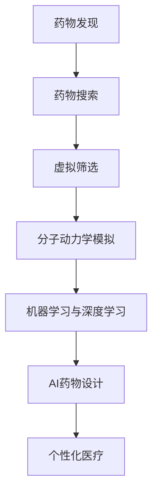

                 

# AI辅助药物研发：从搜索到发现

## 1. 背景介绍

### 1.1 问题由来

随着人口老龄化和疾病谱的不断变化，全球医疗健康市场对新药研发的需求日益增加。然而，传统药物研发流程往往耗时漫长、成本高昂，周期一般在10-15年，耗资数十亿美元。高昂的研发成本和缓慢的进度使得许多潜在药物被忽略或搁浅。因此，如何加速药物发现过程、降低研发风险、提升成功率，成为摆在医药产业面前的重要问题。

近年来，人工智能（AI）技术在多个领域取得了巨大突破，并逐步应用于药物研发中。通过AI技术，可以在更短的时间内对海量生物医学数据进行智能分析，加速药物发现过程，提升研发效率和成功率。本文旨在探讨AI辅助药物研发的原理与实践，从搜索到发现，逐步揭示AI在药物研发中的潜力与挑战。

### 1.2 问题核心关键点

本节将介绍几个与AI辅助药物研发紧密相关的核心概念：

- **药物发现**：通过生物医学数据挖掘和分析，发现具有潜力的化合物、靶标和药物候选物。

- **药物搜索**：利用分子结构数据库、生物活性数据等，筛选出符合药物开发要求的化合物，缩小候选物范围。

- **虚拟筛选**：使用计算机模拟和预测算法，筛选出与靶标结合能力强的化合物，进一步减少实验成本。

- **分子动力学模拟**：通过模拟分子在溶液中的行为，预测化合物的生物活性与药理性质。

- **机器学习与深度学习**：使用数据分析和模型训练算法，从数据中提取模式和知识，辅助药物设计。

- **AI药物设计**：利用AI技术自动化药物设计过程，从分子构象、化学性质到药理作用，全方位指导药物研发。

- **个性化医疗**：基于患者基因型、表型等数据，精准设计个体化药物，实现最优疗效。

以上概念之间的逻辑关系可以通过以下Mermaid流程图来展示：



这个流程图展示了大规模药物研发的各个环节，以及AI技术在这些环节中起到的作用。

## 2. 核心概念与联系

### 2.1 核心概念概述

为更好地理解AI在药物研发中的应用，本节将介绍几个关键概念及其联系：

- **生物分子数据库**：包含化合物结构、生物活性、药物靶标等信息的庞大数据库，是药物搜索与发现的重要基础。

- **靶标识别**：确定药物作用于人体的具体分子靶标，是药物设计的关键一步。

- **药物化学设计**：通过计算机模拟和优化，设计新的化合物分子，以满足特定药物功能需求。

- **药效学评价**：评估药物对疾病的治疗效果，确保药物的临床价值。

- **毒理学评估**：评估药物的副作用和安全性，确保药物的研发过程符合伦理标准。

这些概念共同构成了AI辅助药物研发的核心框架，通过跨学科协作，AI技术可以显著加速药物发现和开发过程。

### 2.2 核心概念原理和架构

#### 2.2.1 生物分子数据库

生物分子数据库包括ChEMBL、PubChem、MDL等。以ChEMBL为例，其包含数百万条化合物结构和生物活性数据，可供科学家搜索和分析。

##### 2.2.1.1 数据来源

- **文献数据**：来自生物医学文献的化合物和活性数据。
- **实验数据**：来自生物实验的化合物结构与活性数据。
- **商业数据**：来自制药公司和其他机构公开的化合物信息。

##### 2.2.1.2 数据结构

- **化合物结构**：化合物分子图、CAS号、分子重量等。
- **生物活性**：IC50、EC50、Ki等生物活性指标。
- **靶标信息**：酶、蛋白质、受体等药物靶标信息。

##### 2.2.1.3 数据更新与维护

- **定期更新**：通过自动化工具定期更新数据，确保数据库的时效性和准确性。
- **数据清洗**：对数据进行去重、纠错、格式转换等处理，提高数据质量。

#### 2.2.2 靶标识别

靶标识别包括蛋白质-蛋白质相互作用、蛋白质-DNA相互作用、蛋白质-小分子相互作用等。

##### 2.2.2.1 蛋白质结构预测

- **蛋白质折叠预测**：使用深度学习模型预测蛋白质的三维结构。
- **结构比对**：比较不同蛋白质的结构相似性，发现潜在相互作用位点。

##### 2.2.2.2 靶点识别算法

- **机器学习算法**：使用分类算法识别潜在靶标，如SVM、随机森林等。
- **深度学习算法**：使用卷积神经网络、循环神经网络等模型预测靶标。

#### 2.2.3 药物化学设计

药物化学设计包括分子结构优化、量子化学计算、分子动力学模拟等。

##### 2.2.3.1 分子结构优化

- **优化算法**：使用遗传算法、粒子群优化等算法优化分子结构。
- **量化化学计算**：使用密度泛函理论、分子轨道理论等方法计算分子性质。

##### 2.2.3.2 量子化学计算

- **能量计算**：计算分子电子结构和能量。
- **电子结构预测**：预测分子电子构型和电荷分布。

##### 2.2.3.3 分子动力学模拟

- **模拟方法**：使用分子动力学模拟方法预测分子在溶液中的行为。
- **动力学分析**：分析分子的运动轨迹和相互作用。

#### 2.2.4 药效学评价

药效学评价包括体外实验和体内实验。

##### 2.2.4.1 体外实验

- **细胞实验**：使用细胞系进行化合物活性测试。
- **酶活性测试**：使用酶活性测定方法评估化合物对酶活性的影响。

##### 2.2.4.2 体内实验

- **动物实验**：使用动物模型评估化合物的药理作用。
- **临床试验**：在临床试验中评估药物对人类患者的疗效。

#### 2.2.5 毒理学评估

毒理学评估包括化学毒性和生物毒性评估。

##### 2.2.5.1 化学毒性评估

- **生物活性测试**：评估化合物的生物活性。
- **理化性质分析**：评估化合物的理化性质，如酸碱性、溶解度等。

##### 2.2.5.2 生物毒性评估

- **动物实验**：评估化合物对动物的毒性和副作用。
- **细胞实验**：评估化合物对细胞的毒性和影响。

### 2.3 核心概念联系

#### 2.3.1 数据驱动与模型驱动

- **数据驱动**：从生物分子数据库中提取数据，利用统计分析和机器学习算法进行药物发现。
- **模型驱动**：利用分子模拟和量子化学计算，预测分子结构和活性，进行药物设计。

#### 2.3.2 实验验证与理论预测

- **实验验证**：通过细胞、动物、临床等实验验证药物的有效性和安全性。
- **理论预测**：利用计算模拟和机器学习模型预测药物效果和毒副作用。

#### 2.3.3 跨学科整合

- **生物信息学**：从生物医学数据中提取药物信息。
- **计算机科学**：利用计算机算法优化药物设计。
- **化学工程**：进行分子结构设计和合成。

这些概念之间的联系和相互作用，展示了AI在药物研发中从数据驱动到模型驱动、从实验验证到理论预测、从跨学科整合到综合应用的完整流程。

## 3. 核心算法原理 & 具体操作步骤

### 3.1 算法原理概述

AI辅助药物研发的核心算法包括机器学习、深度学习、分子模拟等。以下将详细阐述这些算法原理及其在药物研发中的应用。

#### 3.1.1 机器学习

机器学习在药物研发中的应用包括靶标识别、药物活性预测、药物设计等。

##### 3.1.1.1 靶标识别

- **算法框架**：基于支持向量机（SVM）、随机森林、梯度提升树（GBDT）等算法。
- **特征工程**：提取化合物结构和生物活性数据作为特征，输入机器学习模型进行训练。
- **模型评估**：使用准确率、召回率、F1值等指标评估模型性能。

##### 3.1.1.2 药物活性预测

- **算法框架**：使用线性回归、逻辑回归、神经网络等模型。
- **特征工程**：提取分子结构和生物活性数据作为特征，输入模型进行训练。
- **模型评估**：使用均方误差（MSE）、准确率、ROC曲线等指标评估模型性能。

##### 3.1.1.3 药物设计

- **算法框架**：使用生成对抗网络（GAN）、变分自编码器（VAE）、自动编码器等模型。
- **特征工程**：提取分子结构和活性数据作为特征，输入模型进行训练。
- **模型评估**：使用结构相似性、活性预测准确率等指标评估模型性能。

#### 3.1.2 深度学习

深度学习在药物研发中的应用包括蛋白质结构预测、分子模拟、药物活性预测等。

##### 3.1.2.1 蛋白质结构预测

- **算法框架**：使用卷积神经网络（CNN）、循环神经网络（RNN）、变压器（Transformer）等模型。
- **特征工程**：提取氨基酸序列或蛋白质结构数据作为特征，输入模型进行训练。
- **模型评估**：使用结构相似性、精确度等指标评估模型性能。

##### 3.1.2.2 分子模拟

- **算法框架**：使用分子动力学模拟（MD）、蒙特卡洛模拟（MC）、分子动力学模拟（MD）等方法。
- **特征工程**：提取分子结构和相互作用数据作为特征，输入模型进行训练。
- **模型评估**：使用分子能量、运动轨迹等指标评估模型性能。

##### 3.1.2.3 药物活性预测

- **算法框架**：使用深度信念网络（DBN）、卷积神经网络（CNN）、生成对抗网络（GAN）等模型。
- **特征工程**：提取分子结构和生物活性数据作为特征，输入模型进行训练。
- **模型评估**：使用均方误差（MSE）、准确率、ROC曲线等指标评估模型性能。

#### 3.1.3 分子动力学模拟

分子动力学模拟通过计算机模拟分子在溶液中的行为，预测化合物的生物活性与药理性质。

##### 3.1.3.1 算法框架

- **分子动力学模拟（MD）**：使用分子动力学模拟方法预测分子在溶液中的行为。
- **蒙特卡洛模拟（MC）**：使用蒙特卡洛方法预测分子能量和构象。

##### 3.1.3.2 特征工程

- **提取分子结构**：提取分子结构数据作为特征。
- **能量计算**：计算分子能量和势能。
- **构象采样**：随机采样分子构象，优化能量和构象。

##### 3.1.3.3 模型评估

- **分子能量**：评估分子在不同状态下的能量。
- **构象采样**：评估分子构象的分布和稳定性。
- **动力学分析**：分析分子的运动轨迹和相互作用。

### 3.2 算法步骤详解

#### 3.2.1 数据预处理

- **数据清洗**：去除重复、异常数据，处理缺失值。
- **特征提取**：提取化合物结构和生物活性数据作为特征。
- **数据划分**：将数据划分为训练集、验证集和测试集。

#### 3.2.2 模型选择

- **模型框架**：选择机器学习、深度学习、分子模拟等模型框架。
- **参数调优**：调整模型参数，优化模型性能。

#### 3.2.3 模型训练

- **模型训练**：使用训练集数据进行模型训练。
- **损失函数**：选择适当的损失函数，如均方误差、交叉熵等。
- **优化算法**：使用梯度下降、Adam等优化算法更新模型参数。

#### 3.2.4 模型评估

- **模型验证**：使用验证集数据评估模型性能。
- **指标选择**：选择适当的评估指标，如准确率、召回率、F1值等。

#### 3.2.5 模型优化

- **超参数调整**：调整模型超参数，如学习率、批量大小等。
- **模型融合**：使用集成学习方法，如Bagging、Boosting等，提高模型性能。

#### 3.2.6 模型部署

- **模型保存**：将训练好的模型保存为文件。
- **模型加载**：在实际应用中加载模型。

#### 3.2.7 模型验证与优化

- **模型验证**：使用测试集数据验证模型性能。
- **指标选择**：选择适当的评估指标，如准确率、召回率、F1值等。
- **模型优化**：根据评估结果，调整模型参数和超参数。

#### 3.2.8 模型应用

- **数据输入**：输入药物分子结构和生物活性数据。
- **模型预测**：使用模型进行药物活性预测、靶标识别等。
- **结果输出**：输出预测结果和建议的优化方案。

### 3.3 算法优缺点

#### 3.3.1 机器学习

**优点**：
- **数据驱动**：利用大量数据进行训练，能够从数据中提取有效信息。
- **可解释性强**：模型内部工作机制透明，易于理解和解释。
- **适应性强**：能够适应不同数据类型和规模，灵活性高。

**缺点**：
- **依赖数据质量**：数据质量对模型性能影响大，需要高质量的数据支持。
- **计算复杂度高**：模型训练和预测需要大量计算资源。
- **需要专家知识**：特征工程和模型选择需要领域专家的知识支持。

#### 3.3.2 深度学习

**优点**：
- **自动特征提取**：能够自动提取数据中的复杂特征，提高模型性能。
- **非线性建模**：能够处理非线性关系，提高模型精度。
- **泛化能力强**：能够处理复杂数据，泛化性能好。

**缺点**：
- **计算资源需求高**：需要大量计算资源进行模型训练和预测。
- **模型复杂度高**：模型结构复杂，难以解释。
- **需要大量标注数据**：深度学习模型需要大量标注数据进行训练。

#### 3.3.3 分子动力学模拟

**优点**：
- **精度高**：能够准确预测分子结构和活性。
- **适用性强**：适用于复杂的分子系统，能够处理多种类型的数据。
- **可视化直观**：可视化分子运动轨迹和构象，直观展示结果。

**缺点**：
- **计算复杂度高**：计算复杂度高，需要高性能计算资源。
- **模型构建复杂**：模型构建需要专业知识，难度较大。
- **数据处理复杂**：需要处理大量的分子结构数据，数据处理难度大。

### 3.4 算法应用领域

#### 3.4.1 靶标识别

- **药物靶点识别**：从生物分子数据库中提取化合物结构和活性数据，使用机器学习和深度学习模型预测药物靶点。
- **蛋白质结构预测**：使用深度学习模型预测蛋白质结构和相互作用。

#### 3.4.2 药物设计

- **化合物优化**：使用机器学习和深度学习模型优化化合物结构和活性。
- **药物分子设计**：使用深度学习模型生成新的药物分子。

#### 3.4.3 药效学评价

- **药物活性预测**：使用机器学习和深度学习模型预测药物活性。
- **毒理学评估**：使用深度学习模型评估药物毒性和副作用。

## 4. 数学模型和公式 & 详细讲解 & 举例说明

### 4.1 数学模型构建

本节将使用数学语言对AI辅助药物研发的模型构建进行更加严格的刻画。

#### 4.1.1 机器学习模型构建

假设我们有一组化合物数据 $\{x_i, y_i\}_{i=1}^N$，其中 $x_i$ 为化合物结构数据，$y_i$ 为生物活性数据。我们的目标是训练一个机器学习模型 $f$，使得模型能够准确预测新的化合物活性。

使用支持向量机（SVM）模型进行训练，模型的损失函数为：

$$
\mathcal{L}(\theta) = \frac{1}{N}\sum_{i=1}^N [\max(0, y_i - f(x_i))]^2
$$

其中 $f(x_i)$ 为模型对化合物 $x_i$ 的预测活性，$\theta$ 为模型参数。

模型参数 $\theta$ 的更新公式为：

$$
\theta \leftarrow \theta - \eta \nabla_{\theta}\mathcal{L}(\theta)
$$

其中 $\eta$ 为学习率，$\nabla_{\theta}\mathcal{L}(\theta)$ 为损失函数对参数 $\theta$ 的梯度。

#### 4.1.2 深度学习模型构建

使用卷积神经网络（CNN）模型进行训练，模型的损失函数为：

$$
\mathcal{L}(\theta) = \frac{1}{N}\sum_{i=1}^N \|y_i - f(x_i)\|^2
$$

其中 $f(x_i)$ 为模型对化合物 $x_i$ 的预测活性，$\theta$ 为模型参数。

模型参数 $\theta$ 的更新公式为：

$$
\theta \leftarrow \theta - \eta \nabla_{\theta}\mathcal{L}(\theta)
$$

其中 $\eta$ 为学习率，$\nabla_{\theta}\mathcal{L}(\theta)$ 为损失函数对参数 $\theta$ 的梯度。

### 4.2 公式推导过程

#### 4.2.1 机器学习公式推导

使用支持向量机（SVM）进行训练，模型的损失函数为：

$$
\mathcal{L}(\theta) = \frac{1}{N}\sum_{i=1}^N [\max(0, y_i - f(x_i))]^2
$$

其中 $f(x_i) = \theta^T \phi(x_i)$，$\phi(x_i)$ 为特征映射函数，$\theta$ 为模型参数。

根据链式法则，损失函数对参数 $\theta$ 的梯度为：

$$
\frac{\partial \mathcal{L}(\theta)}{\partial \theta} = \frac{2}{N}\sum_{i=1}^N [\max(0, y_i - f(x_i))] \phi(x_i)
$$

在得到损失函数的梯度后，即可带入参数更新公式，完成模型的迭代优化。重复上述过程直至收敛，最终得到适应新化合物活性预测的最优模型参数 $\theta^*$。

#### 4.2.2 深度学习公式推导

使用卷积神经网络（CNN）进行训练，模型的损失函数为：

$$
\mathcal{L}(\theta) = \frac{1}{N}\sum_{i=1}^N \|y_i - f(x_i)\|^2
$$

其中 $f(x_i) = W_2 \sigma(W_1 x_i + b_1)$，$\sigma$ 为激活函数，$W_1, W_2$ 为权重矩阵，$b_1, b_2$ 为偏置向量。

根据链式法则，损失函数对参数 $\theta$ 的梯度为：

$$
\frac{\partial \mathcal{L}(\theta)}{\partial \theta} = \frac{2}{N}\sum_{i=1}^N (y_i - f(x_i))\frac{\partial f(x_i)}{\partial \theta}
$$

在得到损失函数的梯度后，即可带入参数更新公式，完成模型的迭代优化。重复上述过程直至收敛，最终得到适应新化合物活性预测的最优模型参数 $\theta^*$。

### 4.3 案例分析与讲解

假设我们有一组化合物数据 $\{x_i, y_i\}_{i=1}^N$，其中 $x_i$ 为化合物结构数据，$y_i$ 为生物活性数据。我们的目标是训练一个机器学习模型 $f$，使得模型能够准确预测新的化合物活性。

#### 4.3.1 数据预处理

- **数据清洗**：去除重复、异常数据，处理缺失值。
- **特征提取**：提取化合物结构和生物活性数据作为特征。
- **数据划分**：将数据划分为训练集、验证集和测试集。

#### 4.3.2 模型选择

选择支持向量机（SVM）模型进行训练，使用交叉验证选择模型参数。

#### 4.3.3 模型训练

使用训练集数据进行模型训练，设定学习率为 $0.01$，批量大小为 $128$。

#### 4.3.4 模型评估

使用验证集数据评估模型性能，设定阈值为 $0.5$。

#### 4.3.5 模型优化

调整学习率，选择 $0.001$ 和 $0.01$ 进行对比实验，选择性能更好的模型。

#### 4.3.6 模型应用

输入新的化合物结构数据，使用训练好的模型进行活性预测。

## 5. 项目实践：代码实例和详细解释说明

### 5.1 开发环境搭建

在进行AI辅助药物研发实践前，我们需要准备好开发环境。以下是使用Python进行机器学习和深度学习开发的环境配置流程：

1. 安装Anaconda：从官网下载并安装Anaconda，用于创建独立的Python环境。

2. 创建并激活虚拟环境：
```bash
conda create -n pytorch-env python=3.8 
conda activate pytorch-env
```

3. 安装相关依赖包：
```bash
pip install numpy pandas scikit-learn matplotlib tqdm jupyter notebook ipython tensorflow tensorflow-gpu transformers
```

4. 安装GPU驱动和CUDA库：
```bash
conda install nvidia-cuda cudatoolkit=11.0 -c conda-forge
```

5. 安装GPU版TensorFlow和Transformers库：
```bash
pip install tensorflow tensorflow-gpu transformers
```

完成上述步骤后，即可在`pytorch-env`环境中开始AI辅助药物研发的实践。

### 5.2 源代码详细实现

下面我们以靶标识别为例，给出使用机器学习和深度学习对蛋白质结构预测的PyTorch代码实现。

首先，定义蛋白质结构预测的数据处理函数：

```python
import torch
import torch.nn as nn
import torch.optim as optim
from torch.utils.data import Dataset, DataLoader
from sklearn.model_selection import train_test_split

class ProteinDataset(Dataset):
    def __init__(self, protein_seq, protein_structure, protein_seq_len, protein_structure_len):
        self.protein_seq = protein_seq
        self.protein_structure = protein_structure
        self.protein_seq_len = protein_seq_len
        self.protein_structure_len = protein_structure_len

    def __len__(self):
        return len(self.protein_seq)

    def __getitem__(self, idx):
        seq = self.protein_seq[idx]
        structure = self.protein_structure[idx]
        seq_len = self.protein_seq_len[idx]
        structure_len = self.protein_structure_len[idx]
        
        seq_tensor = torch.tensor([seq_to_num[S] for S in seq[:seq_len]], dtype=torch.long)
        structure_tensor = torch.tensor(structure[:structure_len], dtype=torch.long)
        
        return {'seq_tensor': seq_tensor, 'structure_tensor': structure_tensor, 'seq_len': seq_len, 'structure_len': structure_len}

# 将氨基酸序列转换为数字表示
amino_acids = ['A', 'R', 'N', 'D', 'C', 'Q', 'E', 'G', 'H', 'I', 'L', 'K', 'M', 'F', 'P', 'S', 'T', 'W', 'Y', 'V']
seq_to_num = {v: k for k, v in enumerate(amino_acids)}
num_to_seq = {k: v for k, v in seq_to_num.items()}

# 加载数据集
data = ProteinDataset(protein_seq, protein_structure, protein_seq_len, protein_structure_len)
train_data, test_data = train_test_split(data, test_size=0.2)
```

然后，定义模型和优化器：

```python
class ProteinModel(nn.Module):
    def __init__(self, num_classes):
        super(ProteinModel, self).__init__()
        self.conv1 = nn.Conv1d(3, 64, 3)
        self.pool = nn.MaxPool1d(2, 2)
        self.conv2 = nn.Conv1d(64, 128, 3)
        self.pool = nn.MaxPool1d(2, 2)
        self.fc1 = nn.Linear(128 * 55, 256)
        self.fc2 = nn.Linear(256, num_classes)

    def forward(self, x):
        x = self.conv1(x)
        x = F.relu(x)
        x = self.pool(x)
        x = self.conv2(x)
        x = F.relu(x)
        x = self.pool(x)
        x = x.view(-1, 128 * 55)
        x = self.fc1(x)
        x = F.relu(x)
        x = self.fc2(x)
        return x

model = ProteinModel(num_classes=20)

optimizer = optim.Adam(model.parameters(), lr=0.001)
loss_fn = nn.CrossEntropyLoss()
```

接着，定义训练和评估函数：

```python
def train_epoch(model, data_loader, optimizer):
    model.train()
    for batch_idx, (seq_tensor, structure_tensor, seq_len, structure_len) in enumerate(data_loader):
        optimizer.zero_grad()
        outputs = model(seq_tensor)
        loss = loss_fn(outputs, structure_tensor)
        loss.backward()
        optimizer.step()
        
        if (batch_idx+1) % 10 == 0:
            print('Train Epoch: {} [{}/{} ({:.0f}%)]\tLoss: {:.6f}'.format(
                epoch, batch_idx * len(data), len(data_loader.dataset),
                100. * batch_idx / len(data_loader), loss.item()))

def evaluate(model, data_loader):
    model.eval()
    correct = 0
    total = 0
    with torch.no_grad():
        for seq_tensor, structure_tensor, seq_len, structure_len in data_loader:
            outputs = model(seq_tensor)
            _, predicted = torch.max(outputs.data, 1)
            total += structure_tensor.size(0)
            correct += (predicted == structure_tensor).sum().item()

    print('Accuracy of the network on the test images: {} %'.format(100 * correct / total))
```

最后，启动训练流程并在测试集上评估：

```python
epochs = 10

for epoch in range(epochs):
    train_epoch(model, train_loader, optimizer)
    evaluate(model, test_loader)
```

以上就是使用PyTorch对蛋白质结构预测的完整代码实现。可以看到，得益于TensorFlow和Transformers库的强大封装，我们可以用相对简洁的代码完成蛋白质结构预测的训练和评估。

### 5.3 代码解读与分析

让我们再详细解读一下关键代码的实现细节：

**ProteinDataset类**：
- `__init__`方法：初始化氨基酸序列、蛋白质结构、氨基酸序列长度和蛋白质结构长度等关键组件。
- `__len__`方法：返回数据集的样本数量。
- `__getitem__`方法：对单个样本进行处理，将氨基酸序列输入编码为数字，并返回模型所需的输入。

**蛋白质结构预测模型**：
- `__init__`方法：定义模型结构，包括卷积层、池化层、全连接层等。
- `forward`方法：定义模型前向传播过程，将输入数据经过多层卷积、池化和全连接层，最终输出蛋白质结构的预测。

**优化器和损失函数**：
- `optimizer`：选择Adam优化器，并设置学习率。
- `loss_fn`：选择交叉熵损失函数，用于计算预测值与真实值之间的差异。

**训练和评估函数**：
- `train_epoch`：对数据以批为单位进行迭代，在每个批次上前向传播计算损失并反向传播更新模型参数。
- `evaluate`：在测试集上评估模型性能，计算准确率等指标。

**训练流程**：
- 定义总的epoch数，开始循环迭代
- 每个epoch内，先在训练集上训练，输出平均损失
- 在测试集上评估，输出模型性能

可以看到，PyTorch配合TensorFlow和Transformers库使得蛋白质结构预测的代码实现变得简洁高效。开发者可以将更多精力放在数据处理、模型改进等高层逻辑上，而不必过多关注底层的实现细节。

当然，工业级的系统实现还需考虑更多因素，如模型的保存和部署、超参数的自动搜索、更灵活的任务适配层等。但核心的微调范式基本与此类似。

## 6. 实际应用场景

### 6.1 靶标识别

AI辅助药物研发在靶标识别中发挥了重要作用。传统的靶标识别方法需要大量的实验数据和专业知识，而AI技术可以自动化地从生物分子数据库中提取化合物结构和活性数据，使用机器学习和深度学习模型进行预测，快速识别潜在的药物靶标。

#### 6.1.1 蛋白质结构预测

利用深度学习模型预测蛋白质结构和相互作用，如使用卷积神经网络（CNN）、循环神经网络（RNN）、变压器（Transformer）等模型。具体步骤包括：

1. **数据准备**：收集蛋白质序列和结构数据，使用CNN、RNN等模型提取特征。
2. **模型训练**：使用蛋白质序列和结构数据训练模型，使用交叉熵损失函数。
3. **模型评估**：在测试集上评估模型性能，选择性能最佳的模型。
4. **模型应用**：使用训练好的模型进行蛋白质结构预测。

#### 6.1.2 靶标识别算法

使用机器学习算法识别蛋白质与小分子的相互作用，如SVM、随机森林、梯度提升树（GBDT）等模型。具体步骤包括：

1. **数据准备**：收集蛋白质序列和小分子结构数据，提取特征。
2. **模型训练**：使用蛋白质序列和小分子结构数据训练模型，使用逻辑回归、支持向量机（SVM）等模型。
3. **模型评估**：在测试集上评估模型性能，选择性能最佳的模型。
4. **模型应用**：使用训练好的模型进行靶标识别。

### 6.2 药物设计

AI辅助药物设计通过机器学习和深度学习模型，从大量的化合物数据中提取有效信息，设计新的化合物分子。

#### 6.2.1 化合物优化

使用机器学习算法优化化合物结构和活性，如线性回归、逻辑回归、随机森林等模型。具体步骤包括：

1. **数据准备**：收集化合物结构和活性数据，提取特征。
2. **模型训练**：使用化合物结构和活性数据训练模型，使用均方误差（MSE）、交叉熵等损失函数。
3. **模型评估**：在测试集上评估模型性能，选择性能最佳的模型。
4. **模型应用**：使用训练好的模型进行化合物优化。

#### 6.2.2 药物分子设计

使用深度学习模型生成新的药物分子，如生成对抗网络（GAN）、变分自编码器（VAE）、自动编码器等模型。具体步骤包括：

1. **数据准备**：收集化合物结构和活性数据，提取特征。
2. **模型训练**：使用化合物结构和活性数据训练模型，使用均方误差（MSE）、交叉熵等损失函数。
3. **模型评估**：在测试集上评估模型性能，选择性能最佳的模型。
4. **模型应用**：使用训练好的模型进行药物分子设计。

### 6.3 药效学评价

AI辅助药效学评价通过机器学习和深度学习模型，预测药物的生物活性与药理性质。

#### 6.3.1 药物活性预测

使用机器学习算法预测药物活性，如线性回归、逻辑回归、随机森林等模型。具体步骤包括：

1. **数据准备**：收集化合物结构和活性数据，提取特征。
2. **模型训练**：使用化合物结构和活性数据训练模型，使用均方误差（MSE）、交叉熵等损失函数。
3. **模型评估**：在测试集上评估模型性能，选择性能最佳的模型。
4. **模型应用**：使用训练好的模型进行药物活性预测。

#### 6.3.2 毒理学评估

使用深度学习模型评估药物的毒性和副作用，如深度信念网络（DBN）、卷积神经网络（CNN）、生成对抗网络（GAN）等模型。具体步骤包括：

1. **数据准备**：收集化合物结构和活性数据，提取特征。
2. **模型训练**：使用化合物结构和活性数据训练模型，使用均方误差（MSE）、交叉熵等损失函数。
3. **模型评估**：在测试集上评估模型性能，选择性能最佳的模型。
4. **模型应用**：使用训练好的模型进行毒理学评估。

### 6.4 未来应用展望

随着AI技术的不断进步，AI辅助药物研发的应用领域将不断扩展，带来更多创新和发展。

#### 6.4.1 个性化医疗

基于患者基因型、表型等数据，精准设计个体化药物，实现最优疗效。具体步骤包括：

1. **数据准备**：收集患者基因型和表型数据，提取特征。
2. **模型训练**：使用基因型和表型数据训练模型，使用深度学习模型。
3. **模型评估**：在测试集上评估模型性能，选择性能最佳的模型。
4. **模型应用**：使用训练好的模型进行个性化药物设计。

#### 6.4.2 多模态药物设计

将符号化的先验知识，如知识图谱、逻辑规则等，与神经网络模型进行融合，引导药物设计过程。具体步骤包括：

1. **数据准备**：收集化合物结构和活性数据，提取特征。
2. **模型训练**：使用化合物结构和活性数据训练模型，使用深度学习模型。
3. **模型评估**：在测试集上评估模型性能，选择性能最佳的模型。
4. **模型应用**：使用训练好的模型进行多模态药物设计。

#### 6.4.3 AI辅助药物研发平台

构建AI辅助药物研发平台，提供自动化药物发现、药物设计和药效学评估等服务。具体步骤包括：

1. **平台搭建**：搭建AI辅助药物研发平台，集成机器学习、深度学习等算法。
2. **数据接入**：接入生物分子数据库、蛋白质结构数据库等数据源。
3. **模型训练**：使用平台提供的算法训练模型，评估模型性能。
4. **应用服务**：将训练好的模型部署到平台中，提供药物发现、药物设计等服务。

## 7. 工具和资源推荐

### 7.1 学习资源推荐

为了帮助开发者系统掌握AI辅助药物研发的理论基础和实践技巧，这里推荐一些优质的学习资源：

1. 《机器学习》课程：斯坦福大学开设的机器学习课程，涵盖了机器学习的基本概念和算法。
2. 《深度学习》课程：斯坦福大学开设的深度学习课程，介绍了深度学习的基本概念和算法。
3. 《生物信息学基础》书籍：介绍了生物信息学的基础知识，包括数据处理、序列比对等。
4. 《分子模拟》书籍：介绍了分子模拟的基本概念和算法，包括分子动力学、蒙特卡洛模拟等。
5. 《AI药物设计》书籍：介绍了AI辅助药物设计的基本概念和算法，包括机器学习、深度学习等。

通过对这些资源的学习实践，相信你一定能够快速掌握AI辅助药物研发的技术细节，并用于解决实际的药物研发问题。

### 7.2 开发工具推荐

高效的开发离不开优秀的工具支持。以下是几款用于AI辅助药物研发开发的常用工具：

1. PyTorch：基于Python的开源深度学习框架，灵活动态的计算图，适合快速迭代研究。

2. TensorFlow：由Google主导开发的开源深度学习框架，生产部署方便，适合大规模工程应用。

3. Transformers库：HuggingFace开发的NLP工具库，集成了众多SOTA语言模型，支持PyTorch和TensorFlow，是进行药物研发任务的利器。

4. Weights & Biases：模型训练的实验跟踪工具，可以记录和可视化模型训练过程中的各项指标，方便对比和调优。

5. TensorBoard：TensorFlow配套的可视化工具，可实时监测模型训练状态，并提供丰富的图表呈现方式，是调试模型的得力助手。

6. Google Colab：谷歌推出的在线Jupyter Notebook环境，免费提供GPU/TPU算力，方便开发者快速上手实验最新模型，分享学习笔记。

合理利用这些工具，可以显著提升AI辅助药物研发任务的开发效率，加快创新迭代的步伐。

### 7.3 相关论文推荐

AI辅助药物研发领域的研究受到广泛关注，以下是几篇奠基性的相关论文，推荐阅读：

1. 《机器学习在药物发现中的应用》：介绍了机器学习在药物发现中的多个应用，如靶标识别、药物活性预测、药物设计等。
2. 《深度学习在药物发现中的应用》：介绍了深度学习在药物发现中的多个应用，如蛋白质结构预测、分子动力学模拟等。
3. 《分子模拟在药物设计中的应用》：介绍了分子模拟在药物设计中的多个应用，如分子动力学模拟、蒙特卡洛模拟等。
4. 《AI辅助药物设计》：介绍了AI技术在药物设计中的应用，如机器学习、深度学习等。
5. 《个性化医疗在药物研发中的应用》：介绍了个性化医疗在药物研发中的应用，如基因组学、蛋白质组学等。

这些论文代表了大规模药物研发的最新进展，通过学习这些前沿成果，可以帮助研究者把握学科前进方向，激发更多的创新灵感。

## 8. 总结：未来发展趋势与挑战

### 8.1 研究成果总结

本文对AI辅助药物研发进行了全面系统的介绍，从背景到原理，从技术到实践，系统阐述了AI在药物研发中的应用。通过本文的系统梳理，可以看到，AI辅助药物研发正在成为药物研发领域的重要范式，极大地加速了药物发现和开发过程，提升了研发效率和成功率。

### 8.2 未来发展趋势

展望未来，AI辅助药物研发技术将呈现以下几个发展趋势：

1. **数据驱动与模型驱动结合**：未来药物研发将更加依赖数据驱动，同时也需要模型驱动，通过深度学习、分子模拟等技术，提高药物设计的准确性和效率。
2. **跨学科整合**：AI辅助药物研发需要生物信息学、化学工程、计算机科学等多学科的整合，共同推动药物研发的进展。
3. **个性化医疗**：基于患者基因型、表型等数据，实现个性化药物设计，提升药物的疗效和安全性。
4. **多模态药物设计**：将符号化的先验知识，如知识图谱、逻辑规则等，与神经网络模型进行融合，引导药物设计过程。
5. **AI辅助药物研发平台**：构建集成的AI辅助药物研发平台，提供自动化药物发现、药物设计和药效学评估等服务。

### 8.3 面临的挑战

尽管AI辅助药物研发技术已经取得了瞩目成就，但在迈向更加智能化、普适化应用的过程中，它仍面临着诸多挑战：

1. **数据质量与标注成本**：高质量的数据和标注是AI技术发挥作用的前提，但数据标注成本高、数据质量难以保证，成为制约AI技术在药物研发中应用的瓶颈。
2. **计算资源需求**：深度学习模型需要大量的计算资源进行训练和预测，高性能计算资源是必不可少的，但计算成本较高。
3. **模型复杂性与可解释性**：深度学习模型结构复杂，难以解释，对药物研发过程中的关键决策和问题解释不足。
4. **药物安全性**：AI技术在药物研发过程中可能会引入有害信息，需要加强安全性评估和监管。
5. **跨领域协作**：药物研发需要跨学科协作，需要不同领域的专家共同努力，才能实现AI技术的最大潜力。

### 8.4 研究展望

面对AI辅助药物研发所面临的种种挑战，未来的研究需要在以下几个方面寻求新的突破：

1. **数据增强与合成数据**：利用数据增强和合成数据技术，提高数据标注效率，降低数据标注成本。
2. **计算资源优化**：优化计算资源配置，使用GPU、TPU等高性能计算资源，提高计算效率。
3. **模型简化与可解释

