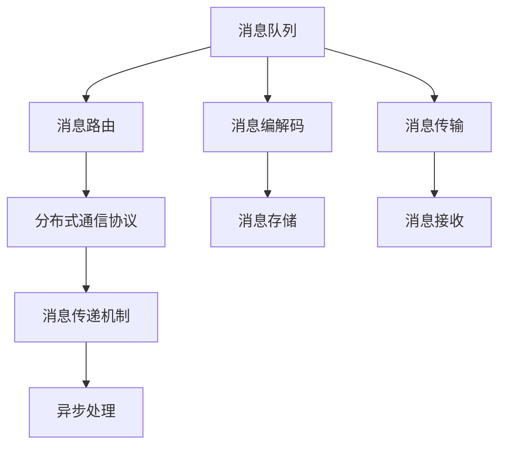

                 

## 1. 背景介绍

### 1.1 问题由来

在大规模语言模型（LLM）系统的开发过程中，消息机制的设计和优化是一项至关重要的任务。LLM系统需要处理来自用户的自然语言输入，并能够基于预训练的知识和语料库，对输入进行理解和回应。这种交互过程涉及到大量的消息传递和处理，消息机制的设计直接影响了系统的响应速度、稳定性以及用户满意度。

### 1.2 问题核心关键点

消息机制的核心在于如何高效、准确地传递和处理用户输入和系统响应。以下是LLM系统中消息机制设计需考虑的几个关键点：

1. **实时性**：确保系统响应快速、及时，以提升用户体验。
2. **准确性**：保证系统理解用户意图准确，减少误解和错误回应。
3. **可扩展性**：系统应能处理大量并发请求，具备良好的水平和垂直扩展能力。
4. **可靠性**：消息传递过程中应具备容错和重传机制，确保消息不丢失。
5. **安全性**：保护用户隐私，防止信息泄露和滥用。

### 1.3 问题研究意义

优化LLM系统的消息机制，对于提升系统的整体性能、降低开发成本、提高用户体验具有重要意义：

1. 提升系统效率：通过优化消息机制，减少消息传递和处理的延迟，提升系统响应速度。
2. 降低系统复杂度：合理设计消息机制，简化系统架构，降低开发和维护成本。
3. 增强用户体验：确保消息准确、及时传递，提升用户满意度和信任度。
4. 应对高并发场景：消息机制的设计应能应对大量并发请求，提高系统稳定性。
5. 提高系统安全性：保护用户隐私和数据安全，防止恶意攻击和信息滥用。

## 2. 核心概念与联系

### 2.1 核心概念概述

在本节中，我们将介绍几个与LLM系统消息机制设计密切相关的核心概念：

- **消息队列（Message Queue）**：用于异步传递和处理消息的中间件技术，支持高并发和容错。
- **分布式通信协议（Distributed Communication Protocol）**：定义消息在分布式系统中的传输规则和协议，包括消息格式、路由、传输策略等。
- **消息路由（Message Routing）**：根据消息的特定属性或规则，将其路由到不同的处理节点或模块。
- **消息传递机制（Message Transmission Mechanism）**：实现消息在LLM系统内部的传递和处理，包括消息编解码、传输协议、负载均衡等。
- **异步处理（Asynchronous Processing）**：采用异步消息传递机制，提升系统并发处理能力，优化响应时间。

这些概念共同构成了LLM系统消息机制的设计基础，其核心目的是确保消息的高效、准确传递和处理，以满足系统对实时性、准确性、可扩展性和安全性的要求。

### 2.2 核心概念原理和架构的 Mermaid 流程图



此图展示了LLM系统消息机制的设计架构，从消息编解码到异步处理，每个环节都至关重要。

## 3. 核心算法原理 & 具体操作步骤

### 3.1 算法原理概述

LLM系统的消息机制设计遵循一种基于异步消息传递和分布式通信协议的框架。其核心原理是通过消息队列异步传递消息，确保消息传递的可靠性和实时性。分布式通信协议定义了消息在分布式系统中的传输规则，确保消息的准确性。消息路由和传递机制实现消息在系统内部的高效处理和传输。异步处理则提升了系统并发处理能力，优化了响应时间。

### 3.2 算法步骤详解

以下是LLM系统消息机制设计的详细步骤：

**Step 1: 定义消息格式和协议**

1. **消息格式定义**：
   - 消息头部：包括消息类型、消息ID、发送者和接收者信息等。
   - 消息体：包含用户输入的自然语言文本。

   ```python
   class Message:
       def __init__(self, msg_type, msg_id, sender, receiver, body):
           self.msg_type = msg_type
           self.msg_id = msg_id
           self.sender = sender
           self.receiver = receiver
           self.body = body
   ```

2. **通信协议定义**：
   - 使用TCP/IP协议进行底层通信，确保数据传输的稳定性和可靠性。
   - 定义消息编解码标准，确保消息在传输过程中的可读性。

**Step 2: 配置消息队列和路由**

1. **消息队列配置**：
   - 选择高性能、可扩展的消息队列系统，如RabbitMQ、Kafka等。
   - 配置消息队列的参数，包括生产者、消费者数量、消息大小限制等。

   ```python
   from kafka import KafkaProducer, KafkaConsumer
   producer = KafkaProducer(bootstrap_servers='localhost:9092',
                           key_serializer=str.encode,
                           value_serializer=str.encode,
                           acks=1)
   consumer = KafkaConsumer('topic',
                           bootstrap_servers='localhost:9092',
                           key_deserializer=str.decode,
                           value_deserializer=str.decode)
   ```

2. **消息路由配置**：
   - 定义消息路由规则，根据用户输入的意图和预训练模型的分析结果，选择相应的处理节点或模块。
   - 使用RESTful API或WebSocket协议实现路由。

**Step 3: 实现消息传递和处理**

1. **消息传递**：
   - 消息生产者将用户输入的消息编码成标准格式，并发送到消息队列。
   - 消息消费者从消息队列中读取消息，解码后进行处理。

   ```python
   def send_message(msg):
       producer.send('topic', msg.encode())
   def receive_message():
       for msg in consumer:
           print(msg.decode())
           # 对消息进行处理
   ```

2. **消息处理**：
   - 根据消息类型，调用相应的处理函数。
   - 处理函数通常包括预训练模型的输入分析、模型推理、响应生成等步骤。

   ```python
   def process_message(msg):
       # 解析消息体
       body = msg.body
       # 调用预训练模型进行推理
       result = model.infer(body)
       # 生成响应
       response = generate_response(result)
       return response
   ```

**Step 4: 实现异步处理**

1. **异步消息传递**：
   - 使用异步I/O模型，提升系统并发处理能力。
   - 通过回调函数处理消息接收和处理结果。

   ```python
   import asyncio

   async def async_receive_message():
       while True:
           msg = await consumer.receive()
           print(msg.decode())
           response = process_message(msg)
           # 处理响应
           await consumer.commit()

   asyncio.run(async_receive_message())
   ```

### 3.3 算法优缺点

#### 优点

1. **高效性**：通过消息队列和异步处理，系统能够高效处理大量并发请求，提升响应速度。
2. **稳定性**：分布式通信协议和消息队列具备容错和重传机制，确保消息传递的可靠性。
3. **可扩展性**：系统架构可根据需求进行水平和垂直扩展，支持高并发和高吞吐量。
4. **灵活性**：消息路由和处理函数的设计可以根据任务需求进行调整，具备灵活性。

#### 缺点

1. **复杂度**：消息队列和异步处理增加了系统设计的复杂度，需要更多的时间和精力进行优化。
2. **性能开销**：异步处理和消息队列的系统开销可能会影响系统的实时性。
3. **安全风险**：需要防范消息队列和通信协议的安全风险，防止数据泄露和恶意攻击。

### 3.4 算法应用领域

LLM系统的消息机制设计广泛应用于各种NLP任务和应用场景，包括但不限于：

- 智能客服：处理用户输入的咨询请求，生成智能回应。
- 对话系统：实现人机对话，生成自然流畅的回答。
- 翻译系统：处理用户输入的翻译请求，生成目标语言的回答。
- 问答系统：处理用户输入的问答请求，生成准确的回答。
- 推荐系统：处理用户输入的兴趣查询，生成个性化的推荐结果。

## 4. 数学模型和公式 & 详细讲解 & 举例说明

### 4.1 数学模型构建

在LLM系统的消息机制设计中，涉及到的数学模型和公式主要包括消息编码、解码、路由和处理等步骤。

#### 消息编码与解码

- 消息编码：将用户输入的消息转换为标准格式，进行编解码。
- 消息解码：将接收到的消息从标准格式解码为原始文本。

假设用户输入的消息为 $M$，消息编码后的格式为 $M'$，解码后的原始文本为 $M''$，则消息编码和解码过程可以表示为：

$$
M' = encode(M) \\
M'' = decode(M')
$$

#### 消息路由

- 消息路由：根据用户输入的意图和预训练模型的分析结果，选择相应的处理节点或模块。
- 路由规则：定义路由规则，确保消息传递到正确的处理节点。

假设预训练模型输出为 $O$，消息路由规则为 $R$，选择处理节点的函数为 $P$，则消息路由过程可以表示为：

$$
P = R(O)
$$

#### 消息处理

- 消息处理：根据消息类型，调用相应的处理函数。
- 处理函数：对消息进行分析和处理，生成响应结果。

假设处理函数为 $F$，预训练模型的推理结果为 $R$，响应结果为 $R'$，则消息处理过程可以表示为：

$$
R' = F(R)
$$

### 4.2 公式推导过程

以下是消息机制设计的公式推导过程：

1. **消息编码和解码**：
   - 假设用户输入的消息 $M$ 为长度为 $L$ 的文本，消息编码为 $M'$，解码后的原始文本为 $M''$。

   $$
   M' = (M, \text{type}, \text{ID}, \text{sender}, \text{receiver})
   $$

   $$
   M'' = decode(M')
   $$

2. **消息路由**：
   - 假设预训练模型输出的特征向量为 $O$，路由规则为 $R$，选择处理节点的函数为 $P$。

   $$
   P = R(O)
   $$

3. **消息处理**：
   - 假设处理函数为 $F$，预训练模型的推理结果为 $R$，响应结果为 $R'$。

   $$
   R' = F(R)
   $$

### 4.3 案例分析与讲解

假设有一个智能客服系统，用户输入的消息为 "我想查询产品规格"。系统的消息机制设计如下：

1. **消息编码**：将用户输入的消息编码成标准格式，发送到消息队列。

   ```python
   msg = '我想查询产品规格'
   msg_id = generate_msg_id()
   send_message((msg, msg_id, 'user', 'server'))
   ```

2. **消息路由**：预训练模型分析用户意图，选择相应的处理节点。

   ```python
   result = model.infer(msg)
   if result == '产品规格':
       node = 'product_info'
   elif result == '退货':
       node = 'return_policy'
   else:
       node = 'help_info'
   ```

3. **消息处理**：处理节点根据消息类型，生成响应结果。

   ```python
   if node == 'product_info':
       response = get_product_info()
   elif node == 'return_policy':
       response = get_return_policy()
   else:
       response = get_help_info()
   ```

4. **消息解码**：将响应结果解码成原始文本，发送给用户。

   ```python
   response = decode(response)
   send_response(response, 'user')
   ```

## 5. 项目实践：代码实例和详细解释说明

### 5.1 开发环境搭建

在开始实践前，我们需要搭建一个开发环境，包括消息队列、分布式通信协议和异步处理机制。以下是具体的搭建步骤：

1. **安装Python**：
   - 安装Python 3.x版本，建议使用Anaconda或Miniconda进行环境管理。

   ```bash
   conda create -n llm-env python=3.8
   conda activate llm-env
   ```

2. **安装消息队列**：
   - 选择高性能的消息队列系统，如RabbitMQ、Kafka等。
   - 安装对应的Python库，如pika、confluent-kafka等。

   ```bash
   pip install pika
   pip install confluent-kafka
   ```

3. **配置分布式通信协议**：
   - 使用TCP/IP协议进行底层通信，确保数据传输的稳定性和可靠性。
   - 定义消息编解码标准，确保消息在传输过程中的可读性。

4. **配置异步处理机制**：
   - 使用异步I/O模型，提升系统并发处理能力。
   - 使用asyncio库实现异步处理。

### 5.2 源代码详细实现

以下是LLM系统消息机制设计的Python代码实现：

#### 消息编码与解码

```python
import base64
import hashlib

class Message:
    def __init__(self, msg_type, msg_id, sender, receiver, body):
        self.msg_type = msg_type
        self.msg_id = msg_id
        self.sender = sender
        self.receiver = receiver
        self.body = body

    def encode(self):
        msg = f'{self.msg_type}:{self.msg_id}:{self.sender}:{self.receiver}:{self.body}'
        return base64.b64encode(hashlib.sha256(msg.encode()).digest())

    def decode(self, encoded_msg):
        msg = encoded_msg.decode()
        parts = msg.split(':')
        self.msg_type = parts[0]
        self.msg_id = parts[1]
        self.sender = parts[2]
        self.receiver = parts[3]
        self.body = parts[4]
```

#### 消息路由

```python
class Router:
    def __init__(self, model):
        self.model = model

    def route(self, msg):
        result = self.model.infer(msg.body)
        if result == 'product_info':
            return 'product_info'
        elif result == 'return_policy':
            return 'return_policy'
        else:
            return 'help_info'
```

#### 消息处理

```python
class Processor:
    def __init__(self, router):
        self.router = router

    def process(self, msg):
        node = self.router.route(msg)
        if node == 'product_info':
            return get_product_info()
        elif node == 'return_policy':
            return get_return_policy()
        else:
            return get_help_info()
```

#### 消息传递与接收

```python
from kafka import KafkaProducer, KafkaConsumer
import asyncio

class MessageProducer:
    def __init__(self, topic):
        self.producer = KafkaProducer(bootstrap_servers='localhost:9092',
                                    key_serializer=str.encode,
                                    value_serializer=str.encode,
                                    acks=1)

    def send_message(self, msg):
        self.producer.send(topic, msg.encode())

class MessageConsumer:
    def __init__(self, topic):
        self.consumer = KafkaConsumer(topic,
                                     bootstrap_servers='localhost:9092',
                                     key_deserializer=str.decode,
                                     value_deserializer=str.decode)

    def receive_message(self):
        for msg in self.consumer:
            print(msg.decode())
            response = process_message(msg)
            # 处理响应
            self.consumer.commit()

async def async_receive_message():
    while True:
        msg = await consumer.receive()
        print(msg.decode())
        response = process_message(msg)
        # 处理响应
        await consumer.commit()

asyncio.run(async_receive_message())
```

### 5.3 代码解读与分析

#### 消息编码与解码

- 使用base64和SHA256对消息进行编码和解码，确保消息在传输过程中的唯一性和完整性。
- 定义消息类，包含消息类型、ID、发送者和接收者等关键信息，便于后续处理。

#### 消息路由

- 定义路由器类，使用预训练模型分析用户意图，根据结果选择相应的处理节点。
- 路由规则可以根据实际需求进行调整，确保消息传递到正确的处理节点。

#### 消息处理

- 定义处理器类，根据消息类型调用相应的处理函数。
- 处理函数根据消息类型，调用对应的获取函数，生成响应结果。

#### 消息传递与接收

- 使用Kafka作为消息队列，确保消息传递的可靠性和高并发能力。
- 使用异步I/O模型，提升系统并发处理能力，优化响应时间。

## 6. 实际应用场景

### 6.1 智能客服系统

智能客服系统通过消息机制设计，可以高效处理大量并发请求，提升响应速度和用户体验。用户输入的咨询请求经过消息编码和路由后，发送到相应的处理节点，生成智能回应。系统的消息机制设计应具备高并发、高稳定性和高安全性，确保系统的可靠性。

### 6.2 对话系统

对话系统通过消息机制设计，实现人机对话，生成自然流畅的回答。用户输入的查询请求经过消息编码和路由后，发送到相应的处理节点，生成响应结果。系统的消息机制设计应具备灵活性，根据对话场景选择不同的处理节点。

### 6.3 翻译系统

翻译系统通过消息机制设计，处理用户输入的翻译请求，生成目标语言的回答。用户输入的翻译请求经过消息编码和路由后，发送到相应的处理节点，生成翻译结果。系统的消息机制设计应具备高准确性和高稳定性，确保翻译结果的准确性。

### 6.4 问答系统

问答系统通过消息机制设计，处理用户输入的问答请求，生成准确的回答。用户输入的问答请求经过消息编码和路由后，发送到相应的处理节点，生成回答结果。系统的消息机制设计应具备高精度和低延迟，确保回答结果的准确性。

### 6.5 推荐系统

推荐系统通过消息机制设计，处理用户输入的兴趣查询，生成个性化的推荐结果。用户输入的查询请求经过消息编码和路由后，发送到相应的处理节点，生成推荐结果。系统的消息机制设计应具备高效率和低延迟，确保推荐结果的及时性。

## 7. 工具和资源推荐

### 7.1 学习资源推荐

为了帮助开发者系统掌握LLM系统消息机制设计的理论基础和实践技巧，这里推荐一些优质的学习资源：

1. **《分布式系统原理与设计》**：深入浅出地介绍了分布式系统设计和原理，包括消息队列、分布式通信协议和异步处理等关键技术。
2. **《Python网络编程》**：详细讲解了Python网络编程的基础知识和实际应用，包括TCP/IP协议、HTTP协议等。
3. **《消息队列技术实战》**：介绍了几种常用的消息队列系统（如RabbitMQ、Kafka等）的设计原理和实践技巧。
4. **《Python异步编程》**：讲解了Python异步编程的基础知识和实际应用，包括异步I/O模型和asyncio库的使用。

### 7.2 开发工具推荐

1. **Anaconda**：用于创建和管理Python环境，支持虚拟化和跨平台部署。
2. **Kafka**：高性能的消息队列系统，支持高并发和容错。
3. **Pika**：Python Kafka客户端，支持发布和订阅消息。
4. **Asyncio**：Python异步I/O库，支持高并发和异步处理。
5. **PyTorch**：深度学习框架，支持模型的训练和推理。

### 7.3 相关论文推荐

1. **《分布式系统：原理与设计》**：介绍分布式系统的基本原理和设计方法，包括消息队列、分布式通信协议和异步处理等。
2. **《高效消息队列系统设计》**：介绍几种常用的消息队列系统（如RabbitMQ、Kafka等）的设计原理和实际应用。
3. **《异步编程模式与实践》**：介绍Python异步编程的基础知识和实际应用，包括异步I/O模型和asyncio库的使用。

## 8. 总结：未来发展趋势与挑战

### 8.1 研究成果总结

本文对LLM系统消息机制设计的理论和实践进行了全面系统的介绍。通过优化消息队列、分布式通信协议和异步处理等关键环节，可以显著提升LLM系统的响应速度、稳定性和可扩展性。本文还通过实际应用场景的展示，展示了消息机制设计的广泛应用前景。

### 8.2 未来发展趋势

LLM系统消息机制设计在未来将呈现以下几个发展趋势：

1. **自动化与智能优化**：通过引入AI算法，实现消息路由和处理的自动化优化，提升系统效率。
2. **多模态融合**：将消息机制设计与其他多模态技术（如语音识别、图像处理等）结合，提升系统的智能交互能力。
3. **边缘计算与本地化处理**：通过边缘计算技术，将消息处理任务下沉到本地设备，提升系统的实时性和隐私保护。
4. **区块链与去中心化**：将消息机制设计引入区块链技术，实现去中心化的消息传递和处理，提升系统的安全性。
5. **微服务架构**：通过微服务架构设计，实现消息机制的高可靠性和高可用性，提升系统的稳定性和扩展性。

### 8.3 面临的挑战

尽管LLM系统消息机制设计已经取得了显著进展，但在实际应用中仍面临诸多挑战：

1. **消息队列复杂度**：高性能、高可靠性的消息队列系统设计复杂，需要更多的时间和精力进行优化。
2. **异步处理性能开销**：异步I/O模型和消息队列的系统开销可能会影响系统的实时性。
3. **消息路由效率**：消息路由规则的设计和调整需要更多的时间和精力，影响系统的灵活性和可扩展性。
4. **安全性和隐私保护**：需要防范消息队列和通信协议的安全风险，确保数据的安全和隐私。

### 8.4 研究展望

未来的研究应在以下几个方面寻求新的突破：

1. **自动化与智能优化**：引入AI算法，实现消息路由和处理的自动化优化，提升系统效率。
2. **多模态融合**：将消息机制设计与其他多模态技术（如语音识别、图像处理等）结合，提升系统的智能交互能力。
3. **边缘计算与本地化处理**：通过边缘计算技术，将消息处理任务下沉到本地设备，提升系统的实时性和隐私保护。
4. **区块链与去中心化**：将消息机制设计引入区块链技术，实现去中心化的消息传递和处理，提升系统的安全性。
5. **微服务架构**：通过微服务架构设计，实现消息机制的高可靠性和高可用性，提升系统的稳定性和扩展性。

## 9. 附录：常见问题与解答

**Q1: 什么是消息队列？**

A: 消息队列是一种中间件技术，用于异步传递和处理消息，支持高并发和容错。常见的消息队列系统包括RabbitMQ、Kafka等。

**Q2: 如何设计高效的消息路由规则？**

A: 设计高效的消息路由规则需要考虑以下几个方面：
1. 分析用户输入的意图，提取关键特征。
2. 根据预训练模型的分析结果，选择相应的处理节点。
3. 引入AI算法，实现消息路由的自动化优化。

**Q3: 如何实现消息的高并发处理？**

A: 实现消息的高并发处理需要考虑以下几个方面：
1. 使用高性能的消息队列系统，如RabbitMQ、Kafka等。
2. 使用异步I/O模型，提升系统并发处理能力。
3. 引入负载均衡和分布式架构，实现高并发处理。

**Q4: 如何保障消息传递的安全性？**

A: 保障消息传递的安全性需要考虑以下几个方面：
1. 使用SSL/TLS加密协议，确保消息传输的加密性。
2. 实现消息队列的访问鉴权，防止未经授权的访问。
3. 定期监控和审计消息队列系统，发现并修复潜在的安全漏洞。

**Q5: 如何优化消息队列的系统开销？**

A: 优化消息队列的系统开销需要考虑以下几个方面：
1. 使用轻量级消息格式，减少消息大小。
2. 使用压缩算法，优化消息传输效率。
3. 引入消息队列的负载均衡和分布式架构，提升系统的扩展性。

以上是LLM系统消息机制设计的理论基础和实践技巧的全面总结。通过优化消息队列、分布式通信协议和异步处理等关键环节，可以显著提升LLM系统的响应速度、稳定性和可扩展性。未来，随着技术的不断进步，消息机制设计将更加智能化、自动化，为LLM系统带来更多的创新和突破。

---

作者：禅与计算机程序设计艺术 / Zen and the Art of Computer Programming

