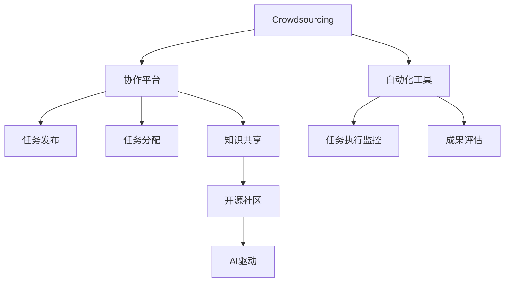

                 

# AI驱动的众包：全球协作和创新

> 关键词：众包、协作、人工智能、创新、自动化、效率、弹性、协作平台、开源社区

## 1. 背景介绍

### 1.1 问题由来
随着全球化和互联网技术的发展，各个领域的企业、科研机构、开发者之间的协作变得更加便捷。如何高效地协调和组织人力、资源，推动创新与进步，成为了全球协作中的一大难题。而众包（Crowdsourcing）作为一种新型的生产方式，通过利用全球范围内的分散资源，实现了资源的灵活配置和高效利用，成为现代社会的重要创新动力。

### 1.2 问题核心关键点
众包模式的核心在于将复杂、耗时的任务拆解为小的、可外包的任务单元，并广泛发布到互联网平台上。任务发布者通过设置悬赏机制，吸引和激励全球范围内的有能力、有动力的个人或团队参与任务。而参与者则通过在线平台获取任务，并按需提交工作成果。这种分布式的、多层次的协作方式，显著提高了任务的执行效率，降低了成本，同时为创新提供了源源不断的动力。

### 1.3 问题研究意义
研究AI驱动的众包模式，对于推动全球协作和创新具有重要意义：

1. **降低协作成本**：AI技术可以显著降低协作的组织和管理成本，通过自动化工具和算法，简化任务分配和执行流程。
2. **提高协作效率**：AI可以提升任务执行的准确性和速度，减少人为错误，提高整体协作效率。
3. **增强协作弹性**：AI驱动的协作平台可以支持更灵活的任务分配和资源调配，提高应对突发情况的弹性。
4. **推动创新发展**：AI可以为众包平台提供更强大的数据分析和决策支持，发现新的市场需求和解决方案，加速创新。
5. **支持多样化的创新模式**：AI驱动的协作平台可以支持多种创新模式，如开放式创新、敏捷开发、设计思维等，增强创新效果。

## 2. 核心概念与联系

### 2.1 核心概念概述

为了更好地理解AI驱动的众包模式，本节将介绍几个密切相关的核心概念：

- **众包（Crowdsourcing）**：一种利用互联网平台，将任务外包给全球范围内的个人或团队的生产方式。通过悬赏机制吸引参与者，实现资源的灵活配置和高效利用。

- **协作平台（Collaborative Platform）**：一个集中管理任务发布、任务分配、任务执行、成果审核等功能的在线系统。支持任务悬赏、进度跟踪、反馈机制等功能。

- **自动化工具（Automation Tools）**：利用AI算法和工具，自动处理任务分配、执行监控、成果评估等环节，降低人工干预和错误。

- **开源社区（Open Source Community）**：一个基于互联网的开发者社区，通过开放的代码和资源，促进知识共享和协作创新。

- **机器学习（Machine Learning）**：一种通过训练算法模型，让机器具备从数据中学习、推理和预测能力的AI技术。

- **自然语言处理（NLP）**：一种AI技术，让机器能够理解、处理和生成人类语言，广泛应用于智能问答、文本分类、情感分析等领域。

- **优化算法（Optimization Algorithm）**：一种通过数学模型求解最优解的算法，如遗传算法、蚁群算法等，广泛应用于任务分配和资源优化。

这些核心概念之间的逻辑关系可以通过以下Mermaid流程图来展示：



这个流程图展示了大语言模型微调的各个核心概念及其之间的关系：

1. 众包模式通过协作平台发布任务，吸引了全球范围内的参与者。
2. 协作平台利用自动化工具，提高了任务执行的效率和准确性。
3. AI技术在协作平台中发挥了重要作用，包括任务分配、进度监控、成果评估等。
4. 开源社区通过开放的知识和资源，促进了协作平台的创新发展。
5. AI技术的引入，使得众包模式更加智能化、高效化，提高了全球协作的创新能力。

## 3. 核心算法原理 & 具体操作步骤
### 3.1 算法原理概述

AI驱动的众包模式，本质上是一种基于人工智能的协同生产方式。其核心思想是通过AI算法和大数据分析，自动化处理任务分配、执行监控、成果评估等环节，提高协作的效率和效果。

形式化地，假设任务发布者为 $M$，全球协作平台为 $P$，参与者为 $C$。任务发布者将任务 $T$ 发布到平台 $P$，任务 $T$ 分解为若干子任务 $T_i$，每个子任务由平台 $P$ 分配给 $C_i$ 执行。平台 $P$ 利用AI算法优化任务分配，实时监控任务进度，评估成果质量，最终生成任务报告。任务发布者通过悬赏机制，激励参与者提交高质量的成果。

### 3.2 算法步骤详解

AI驱动的众包模式一般包括以下几个关键步骤：

**Step 1: 任务发布与监控**
- 任务发布者将任务 $T$ 分解为若干子任务 $T_i$。
- 在协作平台上发布任务 $T_i$，设置悬赏机制，指定截止时间。

**Step 2: 任务分配与执行**
- 平台 $P$ 利用AI算法（如遗传算法、蚁群算法等），优化任务分配方案，将子任务 $T_i$ 分配给能力匹配的参与者 $C_i$。
- 平台 $P$ 监控任务执行进度，生成实时报告，对异常情况进行预警。

**Step 3: 成果评估与反馈**
- 参与者 $C_i$ 完成子任务 $T_i$，提交工作成果。
- 平台 $P$ 利用NLP技术进行成果审核，评估成果质量。
- 平台 $P$ 将审核结果反馈给任务发布者和参与者，更新悬赏状态。

**Step 4: 任务报告与优化**
- 平台 $P$ 根据审核结果，生成任务报告，并反馈给任务发布者。
- 平台 $P$ 利用优化算法，分析任务执行过程中存在的问题，优化未来任务分配和执行策略。

### 3.3 算法优缺点

AI驱动的众包模式具有以下优点：
1. **高效性**：AI算法可以自动处理任务分配和执行监控，显著提高任务执行的效率和准确性。
2. **灵活性**：AI驱动的协作平台可以根据任务特点，灵活调整任务分配策略，增强适应性。
3. **透明度**：AI算法可以提供实时监控和进度报告，增加任务执行的透明度和可追溯性。
4. **创新性**：AI技术可以为协作平台提供强大的数据分析和决策支持，发现新的市场需求和解决方案。

同时，该方法也存在一定的局限性：
1. **算法依赖性**：AI算法的效果很大程度上依赖于数据质量和算法优化程度，可能会存在误判或过拟合的风险。
2. **参与者激励问题**：参与者可能存在合作策略不清晰、动机不足等问题，影响任务执行质量。
3. **数据隐私问题**：协作平台需要处理大量用户数据，可能存在数据隐私和安全问题。
4. **技术门槛**：AI驱动的协作平台需要一定技术背景和资源支持，可能不适合小型团队或个体参与者。
5. **复杂性增加**：引入AI技术后，协作平台可能会变得更加复杂，操作和管理难度增加。

尽管存在这些局限性，但就目前而言，AI驱动的众包模式仍是一种高效、灵活、创新的协作方式，得到了广泛的应用。未来相关研究的重点在于如何进一步降低算法依赖，提高平台易用性，保障数据隐私安全，同时兼顾可解释性和伦理安全性等因素。

### 3.4 算法应用领域

AI驱动的众包模式在多个领域得到了广泛的应用，例如：

- **软件开发**：如Github的代码贡献、GitLab的任务管理等，通过平台发布任务，吸引全球开发者贡献代码，加速软件迭代。
- **数据标注**：如CrowdFlower的数据标注任务、Labelbox的图像标注项目，利用众包平台大规模收集标注数据，提高数据质量。
- **市场调研**：如SurveyMonkey的市场调研问卷、Mechanical Turk的在线调查任务，通过众包平台收集用户反馈，分析市场需求。
- **产品设计**：如InnovationGround的设计创意征集、Kickstarter的产品众筹，通过平台激发创新思维，快速迭代产品原型。
- **社交媒体内容生成**：如Upwork的自由职业平台、Fiverr的微任务系统，利用众包平台生成高质量的社交媒体内容，提高品牌曝光度。

除了上述这些经典应用外，AI驱动的众包模式还被创新性地应用到更多场景中，如可控文本生成、在线教育、智能制造等，为各行业的数字化转型提供了新的路径。随着AI技术的发展和普及，相信协作平台的功能和应用场景将不断扩展，为全球协作和创新注入新的活力。

## 4. 数学模型和公式 & 详细讲解
### 4.1 数学模型构建

本节将使用数学语言对AI驱动的众包模式进行更加严格的刻画。

假设协作平台 $P$ 发布 $N$ 个任务，任务 $T_i$ 被分配给 $M_i$ 个参与者 $C_i$ 执行。每个任务 $T_i$ 的完成时间 $t_i$ 和质量 $q_i$ 通过独立随机变量生成，设 $t_i \sim f_{t_i}$，$q_i \sim f_{q_i}$。平台 $P$ 根据任务进度生成实时报告，报告中包含任务 $T_i$ 的进度 $p_i$ 和质量评估结果 $r_i$。任务发布者根据进度报告和悬赏机制，支付参与者 $C_i$ 的奖励 $c_i$。设 $p_i \in [0,1]$ 表示任务进度，$r_i \in [0,1]$ 表示任务质量评估结果，$c_i > 0$ 表示参与者奖励。

### 4.2 公式推导过程

以下我们以软件开发众包为例，推导参与者激励模型的最优解。

设平台 $P$ 发布的 $N$ 个任务中，任务 $T_i$ 被分配给 $M_i$ 个参与者 $C_i$ 执行。参与者 $C_i$ 的完成时间 $t_i$ 和任务质量 $q_i$ 满足独立同分布，设 $t_i \sim f_{t_i}(t)$，$q_i \sim f_{q_i}(q)$。平台 $P$ 根据任务进度生成实时报告，报告中包含任务 $T_i$ 的进度 $p_i$ 和质量评估结果 $r_i$，满足：

$$
p_i = \frac{t_i}{T_i}
$$

其中 $T_i$ 为任务 $T_i$ 的预期完成时间。平台 $P$ 支付参与者 $C_i$ 的奖励 $c_i$，满足：

$$
c_i = k_i \cdot r_i \cdot \exp(\beta p_i)
$$

其中 $k_i$ 为任务 $T_i$ 的悬赏系数，$\beta$ 为激励参数，表征进度对参与者奖励的影响。

参与者 $C_i$ 的目标是最大化自己的期望奖励，即：

$$
\max_{t_i, q_i} \mathbb{E}[c_i]
$$

利用期望公式，参与者 $C_i$ 的期望奖励为：

$$
\mathbb{E}[c_i] = \int_0^1 \int_0^1 k_i \cdot r_i \cdot \exp(\beta p_i) \cdot f_{t_i}(t) \cdot f_{q_i}(q) \, dt \, dq
$$

设平台 $P$ 的悬赏系数 $k_i$ 和激励参数 $\beta$ 已确定，通过积分求解最大化期望奖励，可以得到参与者 $C_i$ 的最优策略为：

$$
t_i = \min\left(\frac{T_i}{1+\beta}, \frac{T_i}{1-\beta}\right)
$$

$$
q_i = \max\left(0, \frac{q_i}{1+\beta}\right)
$$

平台 $P$ 需要根据最优策略，设计合适的悬赏系数 $k_i$ 和激励参数 $\beta$，以激励参与者提交高质量的成果。

### 4.3 案例分析与讲解

以Github代码贡献为例，说明AI驱动的众包模式的具体实现。

Github的代码贡献任务发布机制如下：

1. **任务发布**：任务发布者将代码问题发布到Github的Issues系统，描述问题和期望解决方式。
2. **任务分配**：Github根据问题难度和贡献者的历史贡献度，推荐合适的贡献者。
3. **任务执行**：贡献者通过PR（Pull Request）提交代码变更，并进行测试和评论。
4. **成果评估**：代码变更通过审核后，合并到主分支，任务自动关闭。

Github的代码贡献任务具有以下几个关键特点：

1. **任务明晰**：每个任务具有明确的问题描述和期望解决方式，有助于贡献者理解任务需求。
2. **任务透明**：任务发布和执行过程公开透明，贡献者可以随时查看任务进度和评估结果。
3. **任务分配**：平台利用AI算法（如推荐算法、动态任务分配算法等），匹配合适的贡献者，提高任务执行效率。
4. **成果评估**：平台利用自动化测试和代码审查工具，评估代码质量，确保代码变更的正确性和完备性。

Github的代码贡献任务发布机制，结合AI驱动的任务分配和成果评估，显著提高了代码贡献的效率和质量，加速了开源社区的发展。

## 5. 项目实践：代码实例和详细解释说明
### 5.1 开发环境搭建

在进行AI驱动的众包模式开发前，我们需要准备好开发环境。以下是使用Python进行Django开发的环境配置流程：

1. 安装Anaconda：从官网下载并安装Anaconda，用于创建独立的Python环境。

2. 创建并激活虚拟环境：
```bash
conda create -n django-env python=3.8 
conda activate django-env
```

3. 安装Django：
```bash
pip install django
```

4. 安装各类工具包：
```bash
pip install numpy pandas scikit-learn matplotlib tqdm jupyter notebook ipython
```

完成上述步骤后，即可在`django-env`环境中开始开发实践。

### 5.2 源代码详细实现

下面我们以Github代码贡献任务发布机制为例，给出使用Django框架对协作平台进行开发的Python代码实现。

首先，定义任务发布模型：

```python
from django.db import models

class Issue(models.Model):
    title = models.CharField(max_length=200)
    description = models.TextField()
    status = models.CharField(max_length=50, default='Open')
```

然后，定义任务发布视图：

```python
from django.shortcuts import render
from .models import Issue

def issue_list(request):
    issues = Issue.objects.all()
    return render(request, 'issue_list.html', {'issues': issues})
```

接着，定义任务发布表单：

```python
from django import forms
from .models import Issue

class IssueForm(forms.ModelForm):
    class Meta:
        model = Issue
        fields = ['title', 'description', 'status']
```

最后，启动任务发布页面：

```python
from django.shortcuts import render, redirect
from .forms import IssueForm
from .models import Issue

def issue_create(request):
    if request.method == 'POST':
        form = IssueForm(request.POST)
        if form.is_valid():
            issue = form.save()
            return redirect('issue_list')
    else:
        form = IssueForm()
    return render(request, 'issue_create.html', {'form': form})
```

以上就是使用Django框架对协作平台进行代码贡献任务发布的完整代码实现。可以看到，通过Django的强大封装，我们可以用相对简洁的代码实现协作平台的关键功能。

### 5.3 代码解读与分析

让我们再详细解读一下关键代码的实现细节：

**Issue模型**：
- `__init__`方法：初始化任务标题、描述、状态等关键组件。

**任务发布视图**：
- `issue_list`方法：从数据库中获取所有任务，渲染任务列表页面。

**任务发布表单**：
- `IssueForm`类：定义了任务发布表单，包含任务标题、描述、状态等字段。
- `Meta`类：指定了模型和字段信息，用于生成HTML表单。

**任务发布页面**：
- `issue_create`方法：处理任务发布表单提交请求，保存任务到数据库。

可以看到，Django框架为协作平台提供了便捷的开发支持，可以快速实现各种业务逻辑和页面渲染。开发者可以将更多精力放在功能实现和页面设计上，而不必过多关注底层的Web开发细节。

当然，工业级的系统实现还需考虑更多因素，如任务调度、权限控制、搜索优化等，但核心的任务发布和执行流程与上述示例类似。

## 6. 实际应用场景
### 6.1 软件开发

AI驱动的众包模式在软件开发领域得到了广泛应用。传统的软件开发通常需要多轮迭代和测试，周期较长，成本较高。而基于众包模式的协作平台，可以高效地组织全球开发者进行代码贡献，加速项目开发进程。

在实际应用中，开发团队可以将项目需求分解为多个小的、可外包的任务，通过协作平台发布任务，吸引全球范围内的开发者进行贡献。平台利用AI算法，自动分配任务，监控进度，评估成果，确保代码质量。在代码贡献过程中，平台还支持代码评审、版本控制、代码审查等辅助工具，进一步提高代码贡献的效率和质量。

### 6.2 数据标注

数据标注是机器学习项目中的重要环节，需要大量标注数据。传统的标注方法通常需要人工进行，成本高、效率低。而利用众包平台进行数据标注，可以显著降低标注成本，提高标注速度。

在实际应用中，数据标注任务通常分为两类：1）结构化数据标注，如分类、实体识别等；2）非结构化数据标注，如文本翻译、图像标注等。标注平台可以提供便捷的任务发布和提交界面，支持多种标注格式和工具。标注结果通过平台自动审核，确保标注质量。标注数据最终被应用到机器学习模型训练中，提升模型性能。

### 6.3 市场调研

市场调研是企业决策的重要依据，需要收集大量用户反馈和市场数据。传统的市场调研方法通常需要大量人力进行问卷设计和数据分析，成本高、周期长。而利用众包平台进行市场调研，可以高效地收集用户反馈，分析市场需求。

在实际应用中，市场调研任务通常分为两类：1）定性调研，如问卷调查、深度访谈等；2）定量调研，如在线调查、数据分析等。调研平台可以提供便捷的任务发布和结果分析工具，支持多种调研方法和数据分析。调研结果通过平台自动汇总和分析，生成详细的市场报告，支持企业决策。

### 6.4 未来应用展望

随着AI技术的发展和普及，基于AI驱动的众包模式将呈现以下几个发展趋势：

1. **多模态协作**：未来的协作平台将支持多种数据类型和任务类型，如图像、视频、音频等。通过多模态数据的整合和协同，增强平台的功能和应用场景。

2. **实时协作**：未来的协作平台将支持实时协作和动态任务分配，提高任务执行的灵活性和响应速度。

3. **智能推荐**：未来的协作平台将利用AI算法进行任务推荐，匹配合适的贡献者，优化任务执行效率。

4. **自动化工具**：未来的协作平台将提供更多的自动化工具和辅助工具，如代码审查、测试工具、数据分析工具等，进一步提升协作效率。

5. **开源社区**：未来的协作平台将更多地与开源社区结合，共享知识和资源，促进创新和合作。

6. **全球化协作**：未来的协作平台将支持全球范围内的协作，打破地域限制，利用全球分散资源，实现资源的灵活配置和高效利用。

## 7. 工具和资源推荐
### 7.1 学习资源推荐

为了帮助开发者系统掌握AI驱动的众包模式的理论基础和实践技巧，这里推荐一些优质的学习资源：

1. **《深入理解Python Web开发》**：一本深入介绍Django框架的书籍，包含Django基础、高级功能、最佳实践等内容，适合Web开发初学者和进阶者。

2. **《机器学习实战》**：一本实践导向的机器学习书籍，包含多种机器学习算法的实现和应用案例，适合初学者和实战开发者。

3. **Coursera《机器学习》课程**：由斯坦福大学开设的机器学习课程，包括理论基础、算法实现、应用案例等，适合机器学习领域的初学者和中级开发者。

4. **Kaggle机器学习竞赛**：一个全球范围内的数据科学竞赛平台，提供多种数据集和任务，通过实际竞赛提高机器学习技能。

5. **GitHub官方文档**：GitHub的官方文档，包含多种API和开发工具的详细介绍，适合GitHub开发者和开源贡献者。

通过对这些资源的学习实践，相信你一定能够快速掌握AI驱动的众包模式的精髓，并用于解决实际的协作问题。

### 7.2 开发工具推荐

高效的开发离不开优秀的工具支持。以下是几款用于AI驱动的众包模式开发的常用工具：

1. **Django**：一个强大的Python Web开发框架，支持高效的Web开发和协作功能，适合协作平台的开发。

2. **Flask**：一个轻量级的Python Web开发框架，适合小型协作平台的开发。

3. **TensorFlow**：一个开源的深度学习框架，支持多种机器学习算法的实现和优化。

4. **PyTorch**：一个开源的深度学习框架，支持动态计算图和高效的GPU计算。

5. **Jupyter Notebook**：一个交互式的Python开发环境，支持代码编写、数据可视化、实时交互等功能。

6. **PostgreSQL**：一个开源的SQL数据库，支持高扩展性和高性能的数据存储和管理。

合理利用这些工具，可以显著提升AI驱动的众包模式的开发效率，加快创新迭代的步伐。

### 7.3 相关论文推荐

AI驱动的众包模式的研究源于学界的持续研究。以下是几篇奠基性的相关论文，推荐阅读：

1. **《众包：将人类计算任务外包给普通人的经济问题》**：Grossman和Shapiro在2003年发表的论文，奠定了众包研究的理论基础，讨论了众包的经济问题和技术挑战。

2. **《平台统治：21世纪的经济权力与政治危机》**：Freeman在2014年出版的书籍，探讨了平台经济对社会和政治的影响，分析了众包的本质和潜力。

3. **《大规模数据下众包生产的经济分析》**：Aizerman和Freeman在2016年发表的论文，讨论了数据驱动的众包生产方式，分析了数据对众包效率和公平性的影响。

4. **《众包市场中的价格机制》**：Cole和Holtermann在2017年发表的论文，探讨了众包市场中的价格机制，分析了悬赏策略和市场行为的影响。

5. **《AI与人类协作：面向未来的智能制造》**：Kawamura和Miyake在2018年发表的论文，探讨了AI与人类协作的未来趋势，分析了AI在智能制造中的应用。

这些论文代表了大语言模型微调技术的发展脉络。通过学习这些前沿成果，可以帮助研究者把握学科前进方向，激发更多的创新灵感。

## 8. 总结：未来发展趋势与挑战
### 8.1 总结

本文对AI驱动的众包模式进行了全面系统的介绍。首先阐述了AI驱动的众包模式的来由和意义，明确了其在推动全球协作和创新中的独特价值。其次，从原理到实践，详细讲解了AI驱动的众包模式的数学模型和关键步骤，给出了协作平台开发的完整代码实例。同时，本文还广泛探讨了AI驱动的众包模式在软件开发、数据标注、市场调研等多个领域的应用前景，展示了其巨大的潜力和应用空间。最后，本文精选了协作平台的各类学习资源、开发工具和相关论文，力求为读者提供全方位的技术指引。

通过本文的系统梳理，可以看到，AI驱动的众包模式正在成为协作和创新的重要手段，极大地提高了资源配置的灵活性和高效性，推动了全球协作的深度发展。未来，随着AI技术的进一步发展和普及，协作平台的功能和应用场景将不断扩展，为全球协作和创新注入新的活力。

### 8.2 未来发展趋势

展望未来，AI驱动的众包模式将呈现以下几个发展趋势：

1. **全球化协作**：未来的协作平台将支持全球范围内的协作，打破地域限制，利用全球分散资源，实现资源的灵活配置和高效利用。

2. **多模态协作**：未来的协作平台将支持多种数据类型和任务类型，如图像、视频、音频等。通过多模态数据的整合和协同，增强平台的功能和应用场景。

3. **实时协作**：未来的协作平台将支持实时协作和动态任务分配，提高任务执行的灵活性和响应速度。

4. **智能推荐**：未来的协作平台将利用AI算法进行任务推荐，匹配合适的贡献者，优化任务执行效率。

5. **自动化工具**：未来的协作平台将提供更多的自动化工具和辅助工具，如代码审查、测试工具、数据分析工具等，进一步提升协作效率。

6. **开源社区**：未来的协作平台将更多地与开源社区结合，共享知识和资源，促进创新和合作。

### 8.3 面临的挑战

尽管AI驱动的众包模式已经取得了显著的进展，但在迈向更加智能化、普适化应用的过程中，仍面临着诸多挑战：

1. **算法依赖性**：AI算法的效果很大程度上依赖于数据质量和算法优化程度，可能会存在误判或过拟合的风险。

2. **参与者激励问题**：参与者可能存在合作策略不清晰、动机不足等问题，影响任务执行质量。

3. **数据隐私问题**：协作平台需要处理大量用户数据，可能存在数据隐私和安全问题。

4. **技术门槛**：AI驱动的协作平台需要一定技术背景和资源支持，可能不适合小型团队或个体参与者。

5. **复杂性增加**：引入AI技术后，协作平台可能会变得更加复杂，操作和管理难度增加。

尽管存在这些挑战，但AI驱动的众包模式作为一种高效、灵活、创新的协作方式，仍具有广阔的应用前景。未来相关研究的重点在于如何进一步降低算法依赖，提高平台易用性，保障数据隐私安全，同时兼顾可解释性和伦理安全性等因素。

### 8.4 研究展望

面对AI驱动的众包模式所面临的挑战，未来的研究需要在以下几个方面寻求新的突破：

1. **无监督和半监督微调方法**：摆脱对大规模标注数据的依赖，利用自监督学习、主动学习等无监督和半监督范式，最大限度利用非结构化数据，实现更加灵活高效的协作。

2. **参数高效和计算高效的微调范式**：开发更加参数高效的微调方法，在固定大部分预训练参数的同时，只更新极少量的任务相关参数。同时优化微调模型的计算图，减少前向传播和反向传播的资源消耗，实现更加轻量级、实时性的部署。

3. **因果分析和博弈论工具**：将因果分析方法引入微调模型，识别出模型决策的关键特征，增强输出解释的因果性和逻辑性。借助博弈论工具刻画人机交互过程，主动探索并规避模型的脆弱点，提高系统稳定性。

4. **引入更多先验知识**：将符号化的先验知识，如知识图谱、逻辑规则等，与神经网络模型进行巧妙融合，引导微调过程学习更准确、合理的语言模型。同时加强不同模态数据的整合，实现视觉、语音等多模态信息与文本信息的协同建模。

5. **结合因果分析和博弈论工具**：将因果分析方法引入微调模型，识别出模型决策的关键特征，增强输出解释的因果性和逻辑性。借助博弈论工具刻画人机交互过程，主动探索并规避模型的脆弱点，提高系统稳定性。

这些研究方向的探索，必将引领AI驱动的众包模式技术迈向更高的台阶，为构建安全、可靠、可解释、可控的智能系统铺平道路。面向未来，AI驱动的众包模式还需要与其他人工智能技术进行更深入的融合，如知识表示、因果推理、强化学习等，多路径协同发力，共同推动自然语言理解和智能交互系统的进步。只有勇于创新、敢于突破，才能不断拓展协作模式的边界，让智能技术更好地造福人类社会。

## 9. 附录：常见问题与解答

**Q1：AI驱动的众包模式是否适用于所有协作任务？**

A: AI驱动的众包模式在大多数协作任务上都能取得不错的效果，特别是对于数据量较小的任务。但对于一些特定领域的任务，如医学、法律等，仅仅依靠通用语料预训练的模型可能难以很好地适应。此时需要在特定领域语料上进一步预训练，再进行微调，才能获得理想效果。此外，对于一些需要时效性、个性化很强的任务，如设计创意征集、产品开发等，AI驱动的众包模式也需要针对性的改进优化。

**Q2：协作平台如何降低参与者的激励问题？**

A: 协作平台可以通过以下方式降低参与者的激励问题：
1. **明确任务奖励**：在任务发布时，明确任务奖励机制和期望成果，确保参与者理解任务需求。
2. **任务评价体系**：在任务执行过程中，提供客观的任务评价体系，如质量评分、任务进度等，激励参与者提交高质量的成果。
3. **多层次奖励机制**：在任务完成时，根据任务难度、成果质量等因素，设置多层次的奖励机制，确保参与者的激励性。

**Q3：协作平台如何保障数据隐私问题？**

A: 协作平台可以采用以下方式保障数据隐私问题：
1. **数据加密**：对敏感数据进行加密存储，防止数据泄露。
2. **权限控制**：设置严格的权限控制机制，限制数据访问权限，防止数据滥用。
3. **数据匿名化**：对数据进行匿名化处理，去除敏感信息，防止数据被追踪和关联。

**Q4：协作平台如何提高任务执行的灵活性和响应速度？**

A: 协作平台可以通过以下方式提高任务执行的灵活性和响应速度：
1. **实时协作**：支持实时协作和动态任务分配，提高任务执行的灵活性和响应速度。
2. **多模态协作**：支持多种数据类型和任务类型，如图像、视频、音频等，通过多模态数据的整合和协同，增强平台的功能和应用场景。
3. **智能推荐**：利用AI算法进行任务推荐，匹配合适的贡献者，优化任务执行效率。

**Q5：协作平台如何支持全球化协作？**

A: 协作平台可以通过以下方式支持全球化协作：
1. **多语言支持**：支持多语言协作，增强平台对全球用户的覆盖能力。
2. **国际化设计**：设计易于国际化扩展的系统架构，支持不同语言和文化环境的协作。
3. **全球化布局**：在多个国家和地区部署协作平台，形成全球化的协作网络，提高协作平台的覆盖范围和影响力。

这些措施可以显著提升协作平台的全球化协作能力，促进全球资源的共享和合作。

---

作者：禅与计算机程序设计艺术 / Zen and the Art of Computer Programming

