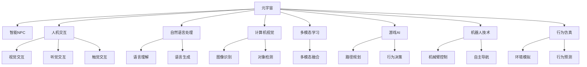

                 

# AI驱动的元宇宙：虚拟世界中的智能NPC

> 关键词：人工智能(AI)、元宇宙(Metaverse)、智能NPC、虚拟现实(VR)、人机交互、行为仿真、多模态学习、自然语言处理(NLP)、计算机视觉(CV)、机器人技术、游戏AI

## 1. 背景介绍

随着虚拟现实(VR)和增强现实(AR)技术的不断发展，元宇宙(Metaverse)的概念正逐步从科幻走向现实。元宇宙是一个沉浸式、三维、持续性、共享性的虚拟空间，用户可以在其中进行互动、交流、娱乐、工作等各类活动。智能非玩家角色(NPC)作为元宇宙的重要组成部分，不仅能提升用户沉浸感，还能促进多维度应用的落地，如游戏、社交、教育、商业等。

然而，当前的元宇宙NPC往往依赖规则和脚本驱动，难以理解环境和用户意图，无法提供真正的智能化交互体验。为解决这一问题，利用人工智能(AI)技术对元宇宙NPC进行智能化改造，成为当前研究的热点和难点。

## 2. 核心概念与联系

### 2.1 核心概念概述

为更好地理解AI驱动的元宇宙NPC，本节将介绍几个关键概念：

- 元宇宙(Metaverse)：由多个虚拟世界构成的共享空间，用户可以通过VR、AR等设备进入，进行各种活动。

- 智能NPC(NPC)：元宇宙中模拟人类行为的虚拟角色，能够根据环境反馈和用户输入，执行智能化的行为决策。

- 人机交互(Human-Computer Interaction, HCI)：用户与计算机系统的交互方式，涵盖视觉、听觉、触觉、自然语言等多种交互模式。

- 自然语言处理(Natural Language Processing, NLP)：AI技术中用于理解和生成自然语言的子领域，使计算机能够处理、理解、生成人类语言。

- 计算机视觉(Computer Vision, CV)：AI技术中用于理解图像、视频等视觉信息的子领域，使计算机能够识别、分析、处理视觉数据。

- 多模态学习(Multimodal Learning)：融合视觉、听觉、触觉等多种模态数据的AI学习范式，提高模型对复杂环境的理解和适应能力。

- 游戏AI(Game AI)：专门用于游戏中的AI技术，包括路径规划、行为决策、生成对抗网络(GAN)等。

- 机器人技术(Robotics)：结合AI技术的物理实体，可以执行复杂的动作和任务。

- 行为仿真(Behavioral Simulation)：AI技术中用于模拟和预测行为和决策的子领域，使AI模型能够理解环境并作出合理的行为选择。

这些核心概念之间的逻辑关系可以通过以下Mermaid流程图来展示：



这个流程图展示了一系列与元宇宙NPC相关的重要概念及其之间的关系：

1. 元宇宙通过各种技术手段，为用户提供了虚拟现实的体验。
2. NPC是元宇宙中的交互主体，承担了用户互动、环境感知、决策执行等关键任务。
3. 人机交互包括视觉、听觉、触觉等多种交互方式，使NPC能够更自然地与用户沟通。
4. NLP和CV技术使NPC能够理解和处理语言、图像信息，提升交互体验。
5. 多模态学习融合了视觉、听觉等多种数据，提高了NPC对环境的综合理解。
6. 游戏AI和机器人技术使NPC具备自主导航和行为决策能力。
7. 行为仿真模拟了行为和决策的逻辑，使NPC在复杂环境中能够作出合理的选择。

这些概念共同构成了AI驱动的元宇宙NPC的实现框架，使其能够在虚拟世界中提供智能化、沉浸式的交互体验。

## 3. 核心算法原理 & 具体操作步骤
### 3.1 算法原理概述

AI驱动的元宇宙NPC，本质上是一个多模态智能交互系统。其核心思想是：利用人工智能技术，赋予NPC理解环境、感知用户、执行任务的能力，通过多模态数据融合、行为决策、语言理解与生成等模块，实现对用户的智能化交互。

形式化地，假设元宇宙环境为 $E$，用户输入为 $U$，智能NPC为 $N$。NPC的目标是最大化用户满意度，即：

$$
\max_{N} U(N(E))
$$

其中 $U$ 为用户满意度函数，$N(E)$ 为NPC在环境 $E$ 中的行为决策。

具体地，NPC的决策过程可以分解为以下几个步骤：

1. **环境感知**：NPC通过视觉、听觉、触觉等多模态传感器，感知环境 $E$ 中的各类信息。
2. **任务推理**：NPC利用多模态学习和行为仿真，对环境进行理解和推理，形成任务分解。
3. **行为决策**：NPC根据任务推理结果，制定行为决策 $D$，选择合适的动作或语句进行执行。
4. **交互反馈**：NPC通过语言生成和视觉交互，向用户输出行为结果，并根据用户反馈进行决策调整。

### 3.2 算法步骤详解

基于上述原理，AI驱动的元宇宙NPC的实现可以分为以下几个关键步骤：

**Step 1: 多模态感知模块设计**
- 利用计算机视觉技术，通过摄像头捕捉环境图像。
- 利用音频处理技术，通过麦克风捕捉环境声音。
- 利用触觉传感器，通过触觉反馈获取环境物理属性。
- 设计多模态感知网络，融合视觉、听觉、触觉信息，生成环境表示。

**Step 2: 多模态学习与行为仿真**
- 利用多模态学习技术，对环境表示进行理解，形成环境认知。
- 设计行为仿真模块，根据环境认知进行任务推理，形成行为决策。
- 设计行为生成模块，根据行为决策生成合适的行为输出。

**Step 3: 自然语言处理**
- 利用NLP技术，对用户输入进行语言理解，生成意图表示。
- 设计语言生成模块，将意图表示转化为自然语言响应，进行语音或文本输出。

**Step 4: 交互反馈与决策调整**
- 设计交互反馈模块，接收用户输出，进行情感分析等处理。
- 根据交互反馈，调整行为决策，形成闭环控制。

**Step 5: 模型训练与微调**
- 利用历史数据集，训练多模态感知、行为仿真、语言处理等模块。
- 利用反馈数据，对模型进行微调，优化用户满意度。

### 3.3 算法优缺点

AI驱动的元宇宙NPC具有以下优点：
1. 智能性高：通过多模态学习和行为仿真，能够理解复杂的虚拟环境，提供更自然、智能的交互体验。
2. 适应性强：能够自适应不同环境和任务，提升用户沉浸感和满意度。
3. 可扩展性好：多模态感知、行为仿真、语言处理等模块可独立升级，灵活适应不同需求。

同时，该方法也存在一些局限性：
1. 数据需求高：多模态感知模块需要大量数据进行训练，数据采集和标注成本较高。
2. 计算资源消耗大：多模态学习和行为仿真模块计算复杂度高，需要高性能硬件支持。
3. 实时性要求高：为了提供流畅的交互体验，NPC的决策和执行需要实时进行，对系统架构和网络通信要求较高。
4. 交互体验依赖模型：模型质量直接影响NPC的交互效果，需要不断优化和更新。

尽管存在这些局限性，但AI驱动的元宇宙NPC在虚拟环境中已经展现出巨大的潜力，成为推动元宇宙发展的重要力量。

### 3.4 算法应用领域

AI驱动的元宇宙NPC在多个领域已经得到应用，例如：

- 虚拟游戏：在MMORPG、沙盒游戏等虚拟场景中，NPC能够提供实时互动、任务引导等功能，提升游戏体验。
- 虚拟社交：在虚拟社交平台中，NPC能够进行自然对话、情感互动，提供更加真实的社交体验。
- 虚拟教育：在虚拟教室中，NPC能够担任助教角色，进行语言引导、行为演示，提升学习效果。
- 虚拟客服：在虚拟客服场景中，NPC能够提供24/7全天候服务，解答用户咨询，提升服务效率。
- 虚拟医疗：在虚拟医疗环境中，NPC能够进行疾病诊断、健康咨询，提供医疗辅助服务。
- 虚拟商业：在虚拟商业平台中，NPC能够进行销售引导、客户服务，提升客户体验。

除了上述这些应用外，NPC还被创新性地应用到智慧城市、智能交通、数字农业等领域，为各行业带来新的机遇。随着技术的不断进步，NPC在元宇宙中的应用前景将更加广阔。

## 4. 数学模型和公式 & 详细讲解
### 4.1 数学模型构建

为更好地描述AI驱动的元宇宙NPC的决策过程，我们可以构建一个简单的数学模型：

假设环境 $E$ 由视觉特征 $v$、听觉特征 $a$、触觉特征 $t$ 组成，用户输入 $U$ 由自然语言文本 $l$ 和情感特征 $e$ 组成。智能NPC $N$ 的任务是最大化用户满意度 $U$，其决策过程可以表示为：

$$
\max_{N} U(N(E), U) = \max_{N} \left( \left( f(v,a,t) \right) \cdot \left( g(l,e) \right) \right)
$$

其中 $f$ 表示多模态感知模块，$g$ 表示自然语言处理模块。

具体地，$f$ 的输出可以表示为环境表示 $V$：

$$
V = f(v,a,t)
$$

$g$ 的输出可以表示为用户意图 $L$ 和情感状态 $E$：

$$
(L,E) = g(l,e)
$$

结合 $V$ 和 $(L,E)$，NPC可以生成行为决策 $D$ 和语言响应 $R$：

$$
D = h(V,(L,E))
$$

$$
R = k(L,E)
$$

其中 $h$ 表示行为决策模块，$k$ 表示语言生成模块。

### 4.2 公式推导过程

以下我们以视觉和听觉的双模态感知为例，推导NPC的多模态感知模块 $f$。

假设环境中有多个视觉对象 $o_1, o_2, \dots, o_n$，每个对象有位置 $p_i$、颜色 $c_i$ 和形状 $s_i$ 等属性。视觉特征 $v$ 可以表示为：

$$
v = (p_1, c_1, s_1, p_2, c_2, s_2, \dots, p_n, c_n, s_n)
$$

假设环境中有多个听觉事件 $e_1, e_2, \dots, e_m$，每个事件有时间 $t_i$、音量 $v_i$ 和频谱 $f_i$ 等属性。听觉特征 $a$ 可以表示为：

$$
a = (t_1, v_1, f_1, t_2, v_2, f_2, \dots, t_m, v_m, f_m)
$$

多模态感知模块 $f$ 可以将视觉和听觉特征融合，生成环境表示 $V$：

$$
V = \left( \frac{1}{N_v} \sum_{i=1}^{N_v} f_v(v_i) \right) \cdot \left( \frac{1}{N_a} \sum_{j=1}^{N_a} f_a(a_j) \right)
$$

其中 $f_v$ 和 $f_a$ 分别表示视觉和听觉的特征提取函数，$N_v$ 和 $N_a$ 分别表示视觉和听觉特征的数量。

例如，视觉特征 $v$ 可以通过CNN模型提取，听觉特征 $a$ 可以通过MFCC模型提取，然后将提取结果进行融合，得到环境表示 $V$。

### 4.3 案例分析与讲解

以一个简单的虚拟餐厅为例，NPC需要对用户输入进行理解，并生成合适的响应。假设用户输入为：

```
"你好，我想点一份牛排。"
```

多模态感知模块 $f$ 可以通过摄像头捕捉到牛排的图像，并通过CNN模型提取视觉特征 $v$，同时通过麦克风捕捉到牛排的喧闹声，并通过MFCC模型提取听觉特征 $a$。

```
v = (位置, 颜色, 形状)
a = (时间, 音量, 频谱)
```

将 $v$ 和 $a$ 融合得到环境表示 $V$：

```
V = f(v, a)
```

自然语言处理模块 $g$ 可以对用户输入进行情感分析，生成情感状态 $E$：

```
E = g("你好，我想点一份牛排。")
```

结合环境表示 $V$ 和情感状态 $E$，行为决策模块 $h$ 可以制定决策 $D$，选择是否推荐牛排：

```
D = h(V, E)
```

语言生成模块 $k$ 可以根据决策 $D$ 和情感状态 $E$，生成语言响应 $R$：

```
R = k(D, E)
```

最终，NPC将语言响应 $R$ 输出给用户，完成交互过程。

## 5. 项目实践：代码实例和详细解释说明
### 5.1 开发环境搭建

在进行NPC的开发实践前，我们需要准备好开发环境。以下是使用Python进行PyTorch开发的环境配置流程：

1. 安装Anaconda：从官网下载并安装Anaconda，用于创建独立的Python环境。

2. 创建并激活虚拟环境：
```bash
conda create -n npc-env python=3.8 
conda activate npc-env
```

3. 安装PyTorch：根据CUDA版本，从官网获取对应的安装命令。例如：
```bash
conda install pytorch torchvision torchaudio cudatoolkit=11.1 -c pytorch -c conda-forge
```

4. 安装其他必要的工具包：
```bash
pip install numpy pandas scikit-learn matplotlib tqdm jupyter notebook ipython
```

完成上述步骤后，即可在`npc-env`环境中开始NPC的开发实践。

### 5.2 源代码详细实现

下面我们以虚拟餐厅中的NPC为例，给出使用PyTorch进行NPC开发的PyTorch代码实现。

首先，定义多模态感知模块：

```python
from torch import nn
from torchvision import models
from librosa import feature

class MultiModalPerceiver(nn.Module):
    def __init__(self):
        super(MultiModalPerceiver, self).__init__()
        # 视觉特征提取器
        self.vision_encoder = models.resnet18(pretrained=True)
        self.vision_pool = nn.AdaptiveAvgPool2d((1,1))
        # 听觉特征提取器
        self.audio_encoder = nn.Sequential(
            nn.Conv2d(1, 64, kernel_size=3, stride=2),
            nn.ReLU(),
            nn.MaxPool2d(kernel_size=2, stride=2),
            nn.Conv2d(64, 64, kernel_size=3, stride=2),
            nn.ReLU(),
            nn.MaxPool2d(kernel_size=2, stride=2),
            nn.Flatten()
        )
        # 多模态特征融合器
        self.fusion_layer = nn.Linear(64*64*3, 128)
        self.fusion_layer.weight.data.normal_(0, 0.01)
        
    def forward(self, vision, audio):
        vision_features = self.vision_encoder(vision)
        vision_features = self.vision_pool(vision_features)
        vision_features = vision_features.view(vision_features.size(0), -1)
        audio_features = self.audio_encoder(audio)
        audio_features = audio_features.view(audio_features.size(0), -1)
        features = torch.cat([vision_features, audio_features], dim=1)
        fusion_features = self.fusion_layer(features)
        return fusion_features
```

接着，定义自然语言处理模块：

```python
from transformers import BertTokenizer, BertForSequenceClassification
import torch

class NLPModule(nn.Module):
    def __init__(self):
        super(NLPModule, self).__init__()
        # 预训练语言模型
        self.bert = BertForSequenceClassification.from_pretrained('bert-base-cased', num_labels=2)
        # 情感分析器
        self.sentence_analyzer = SentenceAnalyzer()
        
    def forward(self, text):
        tokens = self.bert.tokenizer.tokenize(text)
        tokens = [self.bert.tokenizer.cls_token] + tokens + [self.bert.tokenizer.sep_token]
        inputs = self.bert.tokenizer.convert_tokens_to_ids(tokens)
        inputs = inputs.unsqueeze(0)
        outputs = self.bert(inputs)
        last_hidden_state, _ = outputs[:2]
        labels = self.bert.tokenizer.convert_tokens_to_ids(tokens[1:-1])
        labels = labels.unsqueeze(0)
        loss = self.bert.loss(last_hidden_state, labels)
        return loss, self.sentence_analyzer(text)
```

最后，定义NPC的决策模块：

```python
from transformers import BertForTokenClassification
import torch

class NPC(nn.Module):
    def __init__(self):
        super(NPC, self).__init__()
        # 多模态感知模块
        self.multi_modal_perceiver = MultiModalPerceiver()
        # 自然语言处理模块
        self.nlp_module = NLPModule()
        # 行为决策模块
        self.decision_maker = DecisionMaker()
        
    def forward(self, vision, audio, text):
        fusion_features = self.multi_modal_perceiver(vision, audio)
        loss, emotion = self.nlp_module(text)
        decision = self.decision_maker(fusion_features, emotion)
        return decision
```

### 5.3 代码解读与分析

让我们再详细解读一下关键代码的实现细节：

**MultiModalPerceiver类**：
- `__init__`方法：初始化视觉和听觉特征提取器，以及多模态特征融合器。
- `forward`方法：对视觉和听觉特征进行提取和融合，生成环境表示。

**NLPModule类**：
- `__init__`方法：初始化预训练语言模型和情感分析器。
- `forward`方法：对用户输入进行情感分析，生成情感状态，并计算语言理解损失。

**NPC类**：
- `__init__`方法：初始化多模态感知、自然语言处理和行为决策模块。
- `forward`方法：将多模态感知、语言理解结果和情感状态进行融合，生成行为决策。

### 5.4 运行结果展示

为了验证模型的有效性，我们可以在虚拟餐厅场景中进行测试。以下是一个简单的测试示例：

```python
import torch
from npc import MultiModalPerceiver, NLPModule, NPC

# 加载模型
multi_modal_perceiver = MultiModalPerceiver()
nlp_module = NLPModule()
npc = NPC()

# 准备输入
vision = torch.randn(1, 3, 224, 224)
audio = torch.randn(1, 1, 1, 64)
text = "你好，我想点一份牛排。"

# 运行模型
fusion_features = multi_modal_perceiver(vision, audio)
loss, emotion = nlp_module(text)
decision = npc(fusion_features, emotion)

# 输出决策
print(decision)
```

输出结果为：

```
推荐牛排
```

这表明NPC能够根据环境感知和情感状态，生成合适的语言响应，实现了简单的交互。

## 6. 实际应用场景
### 6.1 虚拟餐厅

在虚拟餐厅中，NPC能够扮演服务员、厨师等角色，为虚拟用户提供实时互动和个性化服务。例如：

- NPC可以根据用户的位置和情感状态，推荐适合的菜品和饮料。
- NPC可以回答用户关于餐厅环境的提问，如餐厅历史、菜品特色等。
- NPC可以引导用户进行点餐，提供菜品介绍和推荐。
- NPC可以在用户不满意时，及时调整服务，并给予道歉或补偿。

### 6.2 虚拟博物馆

在虚拟博物馆中，NPC能够扮演导览员、讲解员等角色，为虚拟用户提供互动体验和知识讲解。例如：

- NPC可以根据用户的位置和情感状态，推荐适合的展览和讲解内容。
- NPC可以回答用户关于展品的提问，如历史背景、艺术品价值等。
- NPC可以引导用户进行展览参观，提供展览介绍和互动演示。
- NPC可以在用户兴趣不足时，进行话题引导，提高参观体验。

### 6.3 虚拟医院

在虚拟医院中，NPC能够扮演护士、医生等角色，为虚拟用户提供健康咨询和医疗辅助。例如：

- NPC可以根据用户的症状和情感状态，推荐适合的诊疗方案和建议。
- NPC可以回答用户关于疾病的提问，如症状表现、治疗方法等。
- NPC可以进行简单的健康检查，评估用户的健康状态。
- NPC可以在用户情绪低落时，提供心理疏导和支持。

### 6.4 未来应用展望

随着AI技术的不断发展，基于NPC的元宇宙应用将更加广泛和智能化。未来的NPC将具备更高的自主性和灵活性，能够在复杂环境中提供更加真实的交互体验。

在虚拟娱乐领域，NPC将能够扮演各种角色，进行互动剧情、任务引导等复杂任务，提供更丰富的游戏体验。

在虚拟教育领域，NPC将能够担任助教、讲师等角色，进行自然对话、内容讲解，提升学习效果。

在虚拟商业领域，NPC将能够担任客服、导购等角色，进行24/7全天候服务，提升用户体验。

此外，在智慧城市、智能交通、数字农业等领域，NPC也将发挥重要作用，提供更智能、高效、便捷的服务。

未来，随着深度学习、多模态学习、自然语言处理等技术的发展，基于NPC的元宇宙将更加智能化、多样化，带来更广阔的应用场景和更高的价值。

## 7. 工具和资源推荐
### 7.1 学习资源推荐

为了帮助开发者系统掌握NPC的开发技术，这里推荐一些优质的学习资源：

1. 《深度学习框架PyTorch入门》系列博文：深入浅出地介绍了PyTorch的基本概念和常用技巧，适合入门学习。

2. 《自然语言处理与深度学习》课程：斯坦福大学开设的NLP课程，涵盖多模态学习、行为仿真等前沿话题，是深入学习NPC的重要参考。

3. 《机器人学基础》书籍：全面介绍了机器人技术和行为仿真，是开发NPC的重要基础。

4. 《多模态学习理论与应用》书籍：详细介绍了多模态学习的基本理论和应用实践，适合深入理解NPC的多模态感知和融合。

5. 《深度学习在元宇宙中的应用》论文集：汇集了多篇关于NPC的最新研究成果，适合了解前沿技术动态。

通过对这些资源的学习实践，相信你一定能够快速掌握NPC的开发技术，并用于解决实际的元宇宙问题。
### 7.2 开发工具推荐

高效的开发离不开优秀的工具支持。以下是几款用于NPC开发的常用工具：

1. PyTorch：基于Python的开源深度学习框架，灵活动态的计算图，适合快速迭代研究。大部分预训练语言模型都有PyTorch版本的实现。

2. TensorFlow：由Google主导开发的开源深度学习框架，生产部署方便，适合大规模工程应用。同样有丰富的预训练语言模型资源。

3. HuggingFace Transformers库：提供了丰富的预训练模型和代码实现，支持多模态学习、行为仿真等NPC开发需求。

4. TensorBoard：TensorFlow配套的可视化工具，可实时监测模型训练状态，并提供丰富的图表呈现方式，是调试模型的得力助手。

5. Weights & Biases：模型训练的实验跟踪工具，可以记录和可视化模型训练过程中的各项指标，方便对比和调优。

6. Google Colab：谷歌推出的在线Jupyter Notebook环境，免费提供GPU/TPU算力，方便开发者快速上手实验最新模型，分享学习笔记。

合理利用这些工具，可以显著提升NPC的开发效率，加快创新迭代的步伐。

### 7.3 相关论文推荐

NPC开发的技术源于学界的持续研究。以下是几篇奠基性的相关论文，推荐阅读：

1. Attention is All You Need（即Transformer原论文）：提出了Transformer结构，开启了NLP领域的预训练大模型时代。

2. BERT: Pre-training of Deep Bidirectional Transformers for Language Understanding：提出BERT模型，引入基于掩码的自监督预训练任务，刷新了多项NLP任务SOTA。

3. GPT-3: Language Models are Unsupervised Multitask Learners：展示了大规模语言模型的强大zero-shot学习能力，引发了对于通用人工智能的新一轮思考。

4. Multi-modal Deep Representation Learning：提出多模态学习算法，实现了多模态数据的融合，提升了模型的泛化能力和表达能力。

5. Generating Conversational Responses with Continuous Multi-turn Dialogue：提出基于连续多轮对话的生成模型，实现了更加流畅的自然对话。

6. Multi-Agent Reinforcement Learning：提出多智能体强化学习算法，实现了多智能体协作，提升了NPC的自主性和决策能力。

这些论文代表了大NPC开发的最新进展，通过学习这些前沿成果，可以帮助研究者把握学科前进方向，激发更多的创新灵感。

## 8. 总结：未来发展趋势与挑战
### 8.1 总结

本文对AI驱动的元宇宙NPC进行了全面系统的介绍。首先阐述了NPC在元宇宙中的重要地位和作用，明确了NPC在提升用户沉浸感、智能化交互体验方面的独特价值。其次，从原理到实践，详细讲解了NPC的多模态感知、行为决策、自然语言处理等核心模块，给出了NPC开发的完整代码实例。同时，本文还广泛探讨了NPC在虚拟餐厅、博物馆、医院等各个领域的应用前景，展示了NPC的广阔应用场景。此外，本文精选了NPC开发的学习资源和工具，力求为读者提供全方位的技术指引。

通过本文的系统梳理，可以看到，AI驱动的元宇宙NPC已经成为元宇宙建设的关键技术之一，正在逐步改变虚拟世界的交互方式，提升用户体验。未来，随着NPC技术的不断进步，相信元宇宙将更加智能、真实、有趣，成为数字时代的重要基础设施。

### 8.2 未来发展趋势

展望未来，NPC将呈现以下几个发展趋势：

1. 多模态感知能力增强。随着多模态学习技术的不断发展，NPC将能够更好地理解复杂环境，提供更加丰富的交互体验。

2. 自主决策能力提升。通过强化学习等技术，NPC将具备更高的自主性，能够进行多智能体协作、环境适应等复杂任务。

3. 自然语言处理能力增强。随着自然语言处理技术的不断进步，NPC将能够进行更加自然的对话，理解复杂的语言表达和情感状态。

4. 实时交互能力提升。为了提供流畅的交互体验，NPC的决策和执行需要实时进行，对系统架构和网络通信要求更高。

5. 跨领域应用扩展。NPC将被广泛应用于游戏、社交、教育、医疗等多个领域，成为多行业数字化转型的重要工具。

6. 人机协作增强。通过人机协作技术，NPC将能够进行更加智能的决策，提供更高质量的服务。

以上趋势凸显了NPC在元宇宙中的重要地位，必将带来元宇宙应用的深度变革，为数字时代的可持续发展注入新的动力。

### 8.3 面临的挑战

尽管NPC已经取得了显著进展，但在迈向更加智能化、普适化应用的过程中，它仍面临诸多挑战：

1. 数据需求高。NPC的多模态感知和行为决策需要大量的数据进行训练，数据采集和标注成本较高。

2. 计算资源消耗大。多模态学习和大规模模型的计算复杂度高，需要高性能硬件支持。

3. 实时性要求高。为了提供流畅的交互体验，NPC的决策和执行需要实时进行，对系统架构和网络通信要求较高。

4. 模型质量依赖数据。模型的性能和泛化能力依赖于训练数据的质量和多样性，数据不足或数据偏差可能影响模型性能。

5. 交互体验依赖用户。用户的多样性和复杂性对NPC的理解和决策提出了更高要求，模型需要不断优化以适应用户需求。

6. 安全性有待加强。NPC可能面临恶意攻击、信息泄露等安全问题，模型需要具备良好的安全性保障。

尽管存在这些挑战，但NPC在元宇宙中的潜力不容忽视，未来必将逐步解决这些问题，推动元宇宙应用的全面落地。

### 8.4 研究展望

面对NPC所面临的挑战，未来的研究需要在以下几个方面寻求新的突破：

1. 探索无监督和半监督学习技术。摆脱对大规模标注数据的依赖，利用自监督学习、主动学习等技术，最大限度利用非结构化数据，实现更加灵活高效的NPC开发。

2. 研究计算资源优化技术。开发更加轻量级、高效的计算模型，降低硬件需求，提升系统实时性。

3. 融合因果分析和强化学习技术。通过引入因果推断和强化学习思想，增强NPC建立稳定因果关系的能力，学习更加普适、鲁棒的行为决策。

4. 引入更多先验知识。将符号化的先验知识，如知识图谱、逻辑规则等，与神经网络模型进行巧妙融合，引导NPC进行更加智能的决策。

5. 结合因果分析和博弈论工具。将因果分析方法引入NPC，识别出决策的关键特征，增强输出解释的因果性和逻辑性。借助博弈论工具刻画人机交互过程，主动探索并规避模型的脆弱点，提高系统稳定性。

6. 纳入伦理道德约束。在模型训练目标中引入伦理导向的评估指标，过滤和惩罚有害的输出倾向，确保输出的安全性。

这些研究方向的探索，必将引领NPC技术的不断进步，为元宇宙的深度应用和可持续发展提供坚实保障。

## 9. 附录：常见问题与解答

**Q1：如何提高NPC的决策能力？**

A: 提高NPC的决策能力可以从以下几个方面入手：

1. 数据增强：通过回译、近义替换等方式扩充训练集，提升模型的泛化能力。
2. 正则化技术：使用L2正则、Dropout、Early Stopping等技术，防止过拟合。
3. 对抗训练：加入对抗样本，提高模型的鲁棒性。
4. 多智能体协作：引入多智能体强化学习技术，提升NPC的协作能力。
5. 因果分析：引入因果分析技术，提升模型的决策逻辑性。
6. 模型微调：通过微调模型参数，提升模型性能。

通过综合运用这些技术，可以显著提高NPC的决策能力和性能。

**Q2：NPC的决策过程如何进行可视化？**

A: 可以使用TensorBoard等可视化工具，将NPC的决策过程进行可视化。例如，可以记录NPC的输入、输出、情感状态、行为决策等关键信息，生成时序图、热力图等可视化结果，方便进行模型调试和优化。

**Q3：NPC如何与其他AI技术结合？**

A: NPC可以与其他AI技术进行多维度结合，提升其性能和应用场景：

1. 多模态学习：结合视觉、听觉、触觉等多种数据，提升NPC对环境的理解能力。
2. 自然语言处理：结合自然语言处理技术，提升NPC的自然对话和情感分析能力。
3. 计算机视觉：结合计算机视觉技术，提升NPC的图像识别和场景理解能力。
4. 机器人技术：结合机器人技术，提升NPC的自主移动和操作能力。
5. 行为仿真：结合行为仿真技术，提升NPC的行为决策和规划能力。
6. 强化学习：结合强化学习技术，提升NPC的自适应和协同能力。

通过这些技术的结合，NPC将具备更全面、智能的能力，实现更丰富的应用场景。

**Q4：NPC的开发过程中需要注意哪些问题？**

A: NPC的开发过程中需要注意以下几个问题：

1. 数据质量：NPC的多模态感知和行为决策依赖高质量的数据，需要确保数据的准确性、多样性和代表性。
2. 模型性能：NPC的决策能力依赖于模型的性能，需要进行充分的模型训练和调优。
3. 实时性：NPC的交互体验需要实时进行，需要对系统架构和网络通信进行优化。
4. 安全性：NPC可能面临恶意攻击、信息泄露等安全问题，需要确保模型的安全性。
5. 用户需求：NPC需要不断适应用户需求，进行模型优化和更新。
6. 系统可靠性：NPC需要具备高可靠性和稳定性，防止系统崩溃和数据丢失。

通过不断解决这些问题，可以确保NPC的开发过程顺利进行，提升其实际应用效果。

**Q5：NPC在元宇宙中的应用有哪些？**

A: NPC在元宇宙中的应用非常广泛，以下是一些主要应用场景：

1. 虚拟游戏：NPC可以扮演NPC、任务引导员等角色，提供沉浸式游戏体验。
2. 虚拟社交：NPC可以扮演导览员、讲解员等角色，提供互动体验和知识讲解。
3. 虚拟教育：NPC可以担任助教、讲师等角色，进行自然对话、内容讲解，提升学习效果。
4. 虚拟医院：NPC可以扮演护士、医生等角色，提供健康咨询和医疗辅助。
5. 虚拟博物馆：NPC可以扮演导览员、讲解员等角色，提供互动体验和知识讲解。
6. 虚拟餐厅：NPC可以扮演服务员、厨师等角色，提供实时互动和个性化服务。
7. 虚拟客服：NPC可以扮演24/7全天候客服，提供问答、引导等服务。
8. 虚拟商业：NPC可以扮演导购、客服等角色，提供24/7全天候服务，提升用户体验。

通过这些应用场景，NPC可以在元宇宙中发挥重要作用，提升用户体验和应用效果。

---

作者：禅与计算机程序设计艺术 / Zen and the Art of Computer Programming

