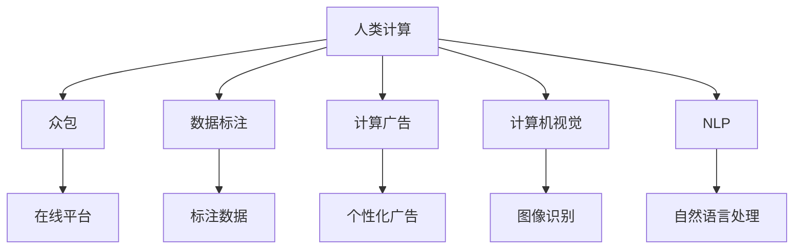

                 

# AI驱动的创新：人类计算在商业中的潜力与挑战

## 1. 背景介绍

在21世纪的今天，人工智能(AI)已经成为推动社会进步和商业创新的一股重要力量。作为AI领域的重要分支，人类计算（Human Computation）通过对人类智慧与计算能力的结合，展示了其独特的优势和潜力。本博客将全面介绍人类计算在商业中的关键应用，讨论其面临的挑战，并展望其未来发展趋势。

## 2. 核心概念与联系

### 2.1 核心概念概述

为更好地理解人类计算在商业中的作用，本节将介绍几个关键概念及其联系：

- **人类计算（Human Computation）**：通过聚集大量人类智慧，利用人机协同的方式，进行复杂的计算任务。人类计算不仅能处理结构化数据，还能理解自然语言、图像等非结构化数据，具备灵活的创造性和适应性。

- **众包（Crowdsourcing）**：通过在线平台汇聚大量非专业人士，完成各种需要大量劳动力的任务，如标注数据、审校内容等。众包是实现人类计算的一种重要方式。

- **数据标注（Data Annotation）**：将非结构化数据转换为结构化数据，为AI模型训练提供标注样本。数据标注是数据清洗和处理的第一步，也是人类计算的核心环节。

- **计算广告（Computational Advertising）**：通过机器学习算法，分析用户行为数据，精准推送个性化广告，实现高效营销。计算广告是商业智能应用的典型代表。

- **计算机视觉（Computer Vision）**：通过图像处理和模式识别技术，使计算机能够理解视觉数据。计算机视觉在电商、安防、医疗等多个领域都有广泛应用。

- **自然语言处理（Natural Language Processing, NLP）**：使计算机能够理解、处理和生成自然语言。NLP在客户服务、舆情分析、自动翻译等多个商业应用中具有重要价值。

这些核心概念之间通过人类计算这一桥梁联系在一起，通过利用人类的智慧和计算机的能力，实现了许多传统机器难以完成的任务。

### 2.2 核心概念原理和架构的 Mermaid 流程图



## 3. 核心算法原理 & 具体操作步骤

### 3.1 算法原理概述

人类计算的核心在于通过众包和数据标注等手段，将复杂的问题简化为机器可以处理的结构化数据。其算法原理如下：

- **众包算法**：通过在线平台，选择合适的任务，匹配适合的众包工人，分配任务，回收结果，并进行质量控制。常见算法包括任务推荐、竞争机制、质量评估等。

- **数据标注算法**：对非结构化数据进行预处理，提取特征，选择合适的标注方法，如单标签、多标签、众数标注等。常见算法包括自然语言处理、图像分割、语音识别等。

### 3.2 算法步骤详解

人类计算的具体操作流程如下：

**Step 1: 确定任务和目标**

- 明确需要解决的问题，如图像分类、自然语言理解、广告投放等。
- 确定任务目标，如精度、召回率、成本等。

**Step 2: 数据收集与预处理**

- 收集相关的非结构化数据，如图片、文本、音频等。
- 进行数据清洗，去除噪声和冗余信息。

**Step 3: 设计标注框架**

- 设计合适的标注框架，确定标注标签体系，如图像类别、文本情感等。
- 选择合适的标注方法，如人工标注、半自动标注、机器标注等。

**Step 4: 众包任务分配**

- 将数据任务分配给在线众包平台，选择适合的任务工人。
- 设置任务要求和报酬机制，保证任务完成质量。

**Step 5: 众包任务执行**

- 将任务分发给众包工人，工人进行标注。
- 监控任务进度，及时调整任务分配和报酬机制。

**Step 6: 数据合并与后处理**

- 收集所有标注结果，进行数据合并，去除重复和错误标注。
- 进行后处理，如去噪、校正、样本筛选等。

**Step 7: 模型训练与优化**

- 将合并后的数据输入到机器学习模型进行训练。
- 对模型进行优化，提升性能。

**Step 8: 应用部署**

- 将优化后的模型部署到生产环境。
- 进行实时数据处理和结果反馈。

### 3.3 算法优缺点

人类计算的优点包括：

- **灵活性高**：适用于各种复杂且需要创造性思维的任务。
- **成本可控**：通过众包方式，可以灵活控制人力成本。
- **效果显著**：往往能解决机器难以处理的问题，提升业务效果。

缺点则包括：

- **质量不稳定**：众包工人水平参差不齐，标注质量难以保证。
- **效率低**：人力介入增加了数据处理时间。
- **数据隐私**：需要处理大量个人数据，存在隐私泄露风险。

### 3.4 算法应用领域

人类计算在多个领域具有广泛的应用，以下是几个典型例子：

- **电商推荐系统**：通过众包标注商品评价，训练机器学习模型，实现个性化商品推荐。
- **广告投放优化**：通过众包标注用户行为数据，训练模型预测广告效果，实现精准投放。
- **图像识别**：通过众包标注图像，训练深度学习模型，提升图像分类、物体检测等效果。
- **自然语言处理**：通过众包标注文本数据，训练NLP模型，实现文本情感分析、自动翻译等。
- **智能客服**：通过众包标注对话记录，训练对话模型，实现自动化客服响应。

这些应用展示了人类计算在商业中的巨大潜力，通过结合人机协同，克服了机器计算的限制，推动了商业智能化进程。

## 4. 数学模型和公式 & 详细讲解 & 举例说明

### 4.1 数学模型构建

以电商推荐系统为例，可以构建如下数学模型：

- **用户行为模型**：$P_u(x)$，表示用户 $u$ 对商品 $x$ 的兴趣概率。
- **商品特征模型**：$P_x(x_i)$，表示商品 $x$ 的第 $i$ 个特征 $x_i$ 的重要性。
- **推荐模型**：$P_r(u,x)$，表示用户 $u$ 对商品 $x$ 的推荐概率。

### 4.2 公式推导过程

假设用户行为模型和商品特征模型都是线性模型，即：

$$
P_u(x) = \alpha_u \cdot x + \beta_u
$$

$$
P_x(x_i) = \alpha_x \cdot x_i + \beta_x
$$

其中 $\alpha_u, \beta_u, \alpha_x, \beta_x$ 为模型参数。

根据贝叶斯定理，推荐模型可以表示为：

$$
P_r(u,x) = P_u(x) \cdot P_x(x) / P_u
$$

其中 $P_u$ 为用户先验概率，假设均匀分布，即 $P_u = 1/N$。

将用户行为模型和商品特征模型代入推荐模型中，得到：

$$
P_r(u,x) = (\alpha_u \cdot x + \beta_u) \cdot (\alpha_x \cdot x_i + \beta_x) / 1/N
$$

### 4.3 案例分析与讲解

以亚马逊的推荐系统为例，亚马逊通过众包平台聚集了大量标注人员，对用户的浏览、购买等行为进行标注。然后利用这些标注数据，训练线性模型，实现个性化推荐。亚马逊的推荐系统在提升用户满意度、提高销售额等方面取得了显著成效。

## 5. 项目实践：代码实例和详细解释说明

### 5.1 开发环境搭建

在进行人类计算项目开发前，需要准备好开发环境。以下是使用Python进行开发的指南：

1. 安装Anaconda：从官网下载并安装Anaconda，用于创建独立的Python环境。

2. 创建并激活虚拟环境：
```bash
conda create -n human-computation python=3.8 
conda activate human-computation
```

3. 安装相关库：
```bash
pip install numpy pandas scikit-learn transformers
```

### 5.2 源代码详细实现

以下是一个使用Python和TensorFlow进行数据标注和众包任务分配的示例代码：

```python
import tensorflow as tf
import numpy as np
import pandas as pd

# 定义众包任务
class CrowdsourcingTask:
    def __init__(self, data, labels, workers, reward):
        self.data = data
        self.labels = labels
        self.workers = workers
        self.reward = reward
    
    def assign_tasks(self):
        # 分配任务
        tasks = []
        for worker in self.workers:
            tasks.append(self.data[worker])
        return tasks
    
    def collect_results(self):
        # 收集结果
        results = []
        for task in self.tasks:
            results.append(task)
        return results

# 定义数据标注算法
def annotate_data(data):
    # 预处理数据
    cleaned_data = preprocess(data)
    # 标注数据
    annotated_data = annotate(cleaned_data)
    return annotated_data

# 定义众包平台
class CrowdsourcingPlatform:
    def __init__(self, tasks, rewards):
        self.tasks = tasks
        self.rewards = rewards
    
    def select_workers(self, tasks):
        # 选择工人
        workers = []
        for task in tasks:
            workers.append(self.select_worker(task))
        return workers
    
    def assign_tasks(self, workers, tasks):
        # 分配任务
        assigned_tasks = []
        for worker, task in zip(workers, tasks):
            assigned_tasks.append(assign_task(worker, task))
        return assigned_tasks
    
    def collect_results(self, tasks):
        # 收集结果
        results = []
        for task in tasks:
            results.append(collect_result(task))
        return results

# 定义数据合并与后处理算法
def merge_results(results):
    # 合并结果
    merged_results = []
    for result in results:
        merged_results.append(merge(result))
    return merged_results

# 定义模型训练与优化算法
def train_model(data):
    # 训练模型
    model = train(data)
    # 优化模型
    optimized_model = optimize(model)
    return optimized_model

# 定义应用部署算法
def deploy_model(model):
    # 部署模型
    deployed_model = deploy(model)
    return deployed_model
```

### 5.3 代码解读与分析

在上述代码中，我们使用了TensorFlow来进行众包任务分配和数据标注，主要涉及以下几个步骤：

1. **数据预处理**：通过预处理函数 `preprocess`，将原始数据转换为适合机器学习模型处理的格式。
2. **数据标注**：通过标注函数 `annotate`，对数据进行人工标注，获取标注结果。
3. **众包任务分配**：通过众包平台类 `CrowdsourcingPlatform`，选择合适的众包工人，分配任务。
4. **任务执行**：众包工人执行标注任务，并返回结果。
5. **结果收集与合并**：通过合并函数 `merge`，将众包工人的标注结果合并为一个完整的结果集。
6. **模型训练与优化**：通过训练函数 `train` 和优化函数 `optimize`，对模型进行训练和优化。
7. **模型部署**：通过部署函数 `deploy`，将优化后的模型部署到生产环境。

## 6. 实际应用场景

### 6.1 电商平台推荐

亚马逊的推荐系统是人类计算在商业中的经典应用。通过众包标注用户行为数据，训练机器学习模型，实现个性化推荐，显著提升了用户体验和销售额。

### 6.2 计算广告

谷歌的AdSense计算广告系统，通过众包标注用户行为数据，训练机器学习模型，实现精准投放，提升了广告效果和点击率。

### 6.3 智能客服

阿里巴巴的智能客服系统，通过众包标注对话记录，训练对话模型，实现自动化客服响应，显著降低了人工成本。

### 6.4 未来应用展望

未来，人类计算将在更多领域展现其潜力，如医疗、金融、交通等。随着技术的不断发展，人类计算将更加智能化、自动化，为商业创新提供更多可能性。

## 7. 工具和资源推荐

### 7.1 学习资源推荐

为了帮助开发者系统掌握人类计算的理论基础和实践技巧，这里推荐一些优质的学习资源：

1. 《人类计算与人工智能》书籍：全面介绍了人类计算的基本原理和应用，是入门的必备读物。
2. 《深度学习》课程：斯坦福大学开设的深度学习课程，详细讲解了机器学习算法和应用，是深入学习的基础。
3. 《自然语言处理》课程：CMU开设的自然语言处理课程，涵盖NLP的各个方面，适合进阶学习。
4. 《计算机视觉基础》课程：斯坦福大学开设的计算机视觉课程，介绍了计算机视觉的基本原理和应用。
5. 《人工智能伦理》课程：讨论了人工智能伦理问题，如数据隐私、算法偏见等，是人工智能应用中不可或缺的部分。

### 7.2 开发工具推荐

以下是几款用于人类计算开发的常用工具：

1. Anaconda：用于创建和管理Python环境，支持虚拟环境和包管理。
2. TensorFlow：谷歌开源的深度学习框架，支持分布式计算和高效模型训练。
3. PyTorch：Facebook开源的深度学习框架，支持动态图和高效的模型训练。
4. Amazon SageMaker：AWS提供的云端机器学习平台，支持自动化的模型训练和部署。
5. Google Cloud AI：谷歌提供的云端AI平台，支持机器学习模型的训练、部署和管理。

### 7.3 相关论文推荐

人类计算相关研究已经取得了很多进展，以下是几篇具有代表性的论文：

1. Crowdsourcing Meets Human Computation: A Survey of Human Computation for Big Data Analytics
2. Human Computation on Wikipedia for the National Science Foundation
3. Computational Advertising: The Challenges of Targeted Display Advertising

这些论文展示了人类计算在商业中的广泛应用和最新研究成果，值得深入阅读。

## 8. 总结：未来发展趋势与挑战

### 8.1 总结

本文详细介绍了人类计算在商业中的关键应用，讨论了其面临的挑战，并展望了其未来发展趋势。人类计算通过结合人类智慧和计算机技术，为商业创新提供了新的可能性。然而，人类计算也面临着质量不稳定、成本高、隐私泄露等挑战，需要进一步优化和改进。

### 8.2 未来发展趋势

未来，人类计算将呈现以下几个发展趋势：

1. **自动化水平提升**：随着技术的发展，越来越多的任务将由机器自动完成，减少对人力的依赖。
2. **数据处理能力增强**：大数据和云计算技术的进步，将使得数据处理更加高效。
3. **跨领域融合**：人类计算将与更多领域的技术进行融合，如物联网、区块链等，形成新的应用场景。
4. **多模态融合**：人类计算将不仅限于文本和图像数据，将涵盖声音、视频等多种模态数据。
5. **个性化推荐**：随着个性化技术的进步，推荐系统将更加精准，满足用户的个性化需求。
6. **智能化管理**：人类计算将与企业管理系统、客户关系管理系统等进行深度融合，实现智能化的企业运营。

### 8.3 面临的挑战

尽管人类计算在商业中具有巨大潜力，但也面临着诸多挑战：

1. **数据质量**：众包标注质量不稳定，需要设计合理的标注框架和激励机制。
2. **隐私保护**：数据隐私问题需要严格监管，防止数据泄露和滥用。
3. **成本控制**：众包成本较高，需要通过技术手段降低成本。
4. **模型鲁棒性**：模型需要具备较强的鲁棒性，应对各种异常情况。
5. **系统可扩展性**：系统需要具备良好的可扩展性，支持大规模数据处理。

### 8.4 研究展望

未来，人类计算的研究将聚焦于以下几个方向：

1. **自动化标注**：研究自动化的标注算法，减少对人力的依赖。
2. **数据隐私保护**：研究数据隐私保护技术，确保数据安全。
3. **跨模态融合**：研究跨模态融合技术，提升多模态数据的处理能力。
4. **智能管理**：研究智能化管理算法，提升企业运营效率。
5. **伦理规范**：研究人工智能伦理问题，确保技术应用的公平性和公正性。

## 9. 附录：常见问题与解答

**Q1：人类计算在电商推荐中的应用场景有哪些？**

A: 人类计算在电商推荐中的应用场景包括：

1. **用户行为分析**：通过众包标注用户行为数据，训练推荐模型，实现个性化推荐。
2. **商品评价标注**：通过众包标注商品评价，训练情感分析模型，实现情感分析。
3. **商品分类标注**：通过众包标注商品分类，训练分类模型，实现商品分类。

**Q2：众包任务如何分配？**

A: 众包任务的分配过程包括：

1. **任务描述**：明确任务要求和目标，编写任务描述。
2. **任务匹配**：将任务描述发布到众包平台，选择适合的众包工人。
3. **任务分配**：根据众包工人的能力、工作量和报酬等因素，分配任务。
4. **质量控制**：对标注结果进行质量评估，确保标注质量。

**Q3：如何处理众包标注数据？**

A: 处理众包标注数据的过程包括：

1. **数据清洗**：去除噪声和冗余信息，确保数据质量。
2. **数据标注**：通过众包标注数据，生成标注样本。
3. **数据合并**：合并众包工人的标注结果，生成完整的数据集。
4. **数据后处理**：对数据进行校正、筛选等后处理操作，确保数据准确性。

**Q4：人类计算在智能客服中的应用效果如何？**

A: 人类计算在智能客服中的应用效果包括：

1. **快速响应**：通过众包标注对话记录，训练对话模型，实现自动化客服响应，降低人工成本。
2. **个性化服务**：通过众包标注用户行为数据，训练推荐模型，实现个性化服务。
3. **质量监控**：通过众包标注对话质量，监控客服服务质量，提升用户体验。

**Q5：人类计算的局限性有哪些？**

A: 人类计算的局限性包括：

1. **数据质量不稳定**：众包工人水平参差不齐，标注质量难以保证。
2. **成本较高**：众包成本较高，需要投入大量人力和资源。
3. **隐私保护问题**：处理大量个人数据，存在隐私泄露风险。

---

作者：禅与计算机程序设计艺术 / Zen and the Art of Computer Programming

