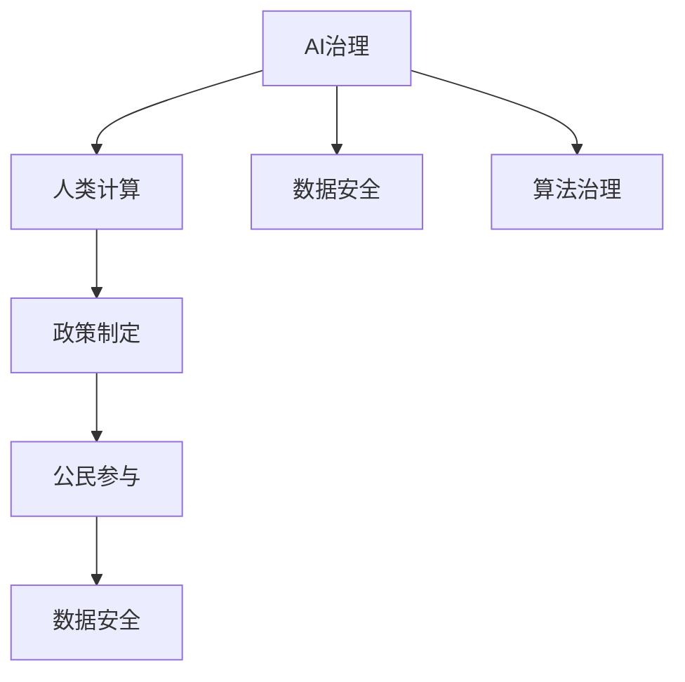

                 

# AI驱动的创新：人类计算在政府中的价值

> 关键词：AI治理, 人类计算, 算法治理, 数据安全, 政策制定, 公民参与

## 1. 背景介绍

### 1.1 问题由来

随着信息技术在政府管理中的应用日益广泛，人类计算在政府决策、管理和服务等方面的价值日益显现。AI技术在数据驱动决策、优化行政流程、提升公共服务质量等方面展现了巨大的潜力。然而，如何在政府应用中充分释放AI的潜能，同时保障数据安全、提升算法治理水平，是当前政府数字化转型面临的关键问题。

### 1.2 问题核心关键点

AI在政府中的价值主要体现在以下几个方面：

- **数据驱动决策**：通过分析大数据，AI能够帮助政府做出更科学、精准的决策。
- **优化行政流程**：AI可以自动化、智能化政府内部流程，提升行政效率。
- **提升公共服务质量**：AI驱动的智能客服、智能监管等，可以提升政府服务的体验和效率。
- **保障数据安全**：AI在数据加密、异常检测等方面具有独特优势，能够提升政府数据安全防护能力。
- **算法治理**：AI决策透明度、可解释性和公平性问题，需要通过算法治理手段进行优化。
- **公民参与**：AI技术可以帮助政府更好地听取公民意见，提升决策的民主性。

这些关键点凸显了AI在政府管理中的多维度价值，同时也揭示了其在应用过程中面临的多重挑战。本文将系统探讨这些问题的核心原理，并提出相应的解决方案。

## 2. 核心概念与联系

### 2.1 核心概念概述

为更好地理解AI在政府中的应用，本节将介绍几个关键概念：

- **AI治理**：指通过制度和技术手段，确保AI在政府决策和管理中的应用过程透明、公平和可解释。
- **人类计算**：结合人类智能和AI技术，通过智能算法优化政府决策和管理流程。
- **数据安全**：指通过技术手段保障政府数据在存储、传输、处理等环节的安全性，防止数据泄露和滥用。
- **算法治理**：通过法律法规和政策指导，确保AI算法的设计、训练和应用过程符合公平、透明和可解释的原则。
- **政策制定**：指政府通过数据分析、模型预测等AI手段，辅助制定科学合理的公共政策。
- **公民参与**：指利用AI技术收集和分析公民反馈，提升政府决策的民主性和透明度。

这些核心概念之间的逻辑关系可以通过以下Mermaid流程图来展示：



这个流程图展示了AI在政府应用中的核心概念及其之间的关系：

1. AI治理和算法治理共同构建AI在政府应用的安全和透明基础。
2. 数据安全是AI应用的前提条件。
3. 人类计算是AI在政府决策和管理中的核心工具。
4. 政策制定和公民参与是AI技术辅助政府决策的典型应用。
5. 数据安全在政策制定和公民参与过程中同样重要。

## 3. 核心算法原理 & 具体操作步骤

### 3.1 算法原理概述

AI在政府中的应用，本质上是通过数据驱动的方式，优化政府决策和管理流程，提升公共服务质量，保障数据安全，确保算法治理水平。其核心算法原理如下：

- **数据预处理**：通过清洗、去重、归一化等技术手段，确保数据质量。
- **特征提取**：利用机器学习算法，从原始数据中提取关键特征，为后续模型训练提供输入。
- **模型训练**：通过训练AI模型，使其能够对政府决策和管理问题进行预测和优化。
- **模型评估与优化**：通过评估模型性能，不断优化模型参数，提升模型效果。
- **部署与监控**：将训练好的模型部署到实际应用场景中，实时监控模型运行状态，确保系统稳定。

### 3.2 算法步骤详解

AI在政府中的应用一般包括以下几个关键步骤：

**Step 1: 数据准备与预处理**
- 收集政府管理中相关的数据，如政策文本、公众反馈、经济数据等。
- 进行数据清洗、去重、归一化等预处理，确保数据质量。

**Step 2: 特征提取与模型训练**
- 选择合适的特征提取算法，如TF-IDF、Word2Vec等，从原始数据中提取关键特征。
- 选择适合的AI模型，如决策树、随机森林、深度神经网络等，进行模型训练。
- 在训练过程中进行交叉验证，选择最优模型进行部署。

**Step 3: 模型评估与优化**
- 在测试数据集上评估模型性能，如准确率、召回率、F1分数等指标。
- 根据评估结果调整模型参数，优化模型效果。

**Step 4: 模型部署与监控**
- 将训练好的模型部署到实际应用场景中，如智能客服系统、智能监管平台等。
- 实时监控模型运行状态，如响应时间、准确率等指标，确保系统稳定。
- 定期更新模型，确保模型与最新数据保持一致。

### 3.3 算法优缺点

AI在政府中的应用具有以下优点：

- **数据驱动决策**：能够基于大数据分析做出科学、精准的决策。
- **优化行政流程**：通过自动化、智能化政府内部流程，提升行政效率。
- **提升公共服务质量**：通过智能客服、智能监管等，提升政府服务的体验和效率。
- **保障数据安全**：通过数据加密、异常检测等技术，提升政府数据安全防护能力。

同时，也存在一些缺点：

- **依赖数据质量**：AI模型的性能高度依赖于数据质量，数据不准确或缺失会影响模型效果。
- **算法治理复杂**：AI算法的复杂性可能带来透明度和公平性问题，需要加强算法治理。
- **技术壁垒高**：AI技术在政府应用中需要高水平的技术支持，人才和资源投入较大。
- **安全风险**：AI模型可能存在安全漏洞，被恶意利用，需要加强安全防护。

### 3.4 算法应用领域

AI在政府中的应用领域广泛，包括但不限于：

- **智能客服**：利用自然语言处理技术，提升政府服务体验。
- **智能监管**：通过数据分析和模型预测，提升监管效率和精准度。
- **政策制定**：利用大数据分析，辅助政策制定，提升决策科学性。
- **公共安全**：利用AI进行异常检测和预测，提升公共安全防护能力。
- **环境治理**：通过数据分析和模型优化，提升环境治理水平。
- **社会治理**：通过数据分析和模型预测，提升社会治理的智能化水平。

## 4. 数学模型和公式 & 详细讲解 & 举例说明

### 4.1 数学模型构建

本节将使用数学语言对AI在政府应用中的核心算法进行更加严格的刻画。

假设政府决策问题为二分类问题，即输入为 $x$，输出为 $y \in \{0, 1\}$。记训练数据集为 $D=\{(x_i, y_i)\}_{i=1}^N$。

定义模型 $M_{\theta}$ 在输入 $x$ 上的预测为 $\hat{y}=M_{\theta}(x)$，其输出为概率 $0 \leq \hat{y} \leq 1$。模型的损失函数定义为交叉熵损失：

$$
\ell(M_{\theta}(x),y) = -y\log \hat{y} - (1-y)\log (1-\hat{y})
$$

在数据集 $D$ 上的经验风险为：

$$
\mathcal{L}(\theta) = \frac{1}{N} \sum_{i=1}^N \ell(M_{\theta}(x_i),y_i)
$$

通过梯度下降等优化算法，最小化经验风险，得到最优模型参数 $\theta^*$：

$$
\theta^* = \mathop{\arg\min}_{\theta} \mathcal{L}(\theta)
$$

### 4.2 公式推导过程

以决策树模型为例，推导其参数更新公式。

决策树模型的核心在于划分特征空间，将数据集划分为不同的类别。设训练数据集 $D=\{(x_i, y_i)\}_{i=1}^N$，每个样本有 $d$ 个特征，定义特征 $x_i=(x_{i1}, x_{i2}, ..., x_{id})$，目标变量 $y_i \in \{0, 1\}$。

决策树模型的损失函数为交叉熵损失：

$$
\ell(y_i, M_{\theta}(x_i)) = -y_i\log \hat{y}_i - (1-y_i)\log (1-\hat{y}_i)
$$

其中 $\hat{y}_i$ 为模型对样本 $x_i$ 的预测概率。

模型参数 $\theta$ 包括每个特征的分割点及其阈值。模型更新过程为：

1. 随机选择一个样本 $x_i$。
2. 计算该样本对应的预测误差 $\epsilon_i = y_i - \hat{y}_i$。
3. 根据预测误差选择最优的分割特征 $f_j$ 和分割点 $t$，更新模型参数 $\theta$。

具体来说，模型在特征 $f_j$ 的分割点 $t$ 上划分数据集为 $\{(x_i, y_i)\}_{i=1}^N$，则模型更新公式为：

$$
\theta = \theta - \eta \nabla_{\theta}\mathcal{L}(\theta) - \eta\lambda\theta
$$

其中 $\nabla_{\theta}\mathcal{L}(\theta)$ 为损失函数对模型参数 $\theta$ 的梯度，可通过反向传播算法高效计算。

### 4.3 案例分析与讲解

以智能监管系统为例，分析AI在其中的具体应用。

智能监管系统通过数据分析和模型预测，提升监管效率和精准度。其核心算法流程如下：

1. **数据准备**：收集政府监管相关的数据，如违规行为记录、投诉举报等。
2. **特征提取**：利用自然语言处理技术，从文本数据中提取关键特征，如违规行为类型、发生时间等。
3. **模型训练**：选择合适的机器学习模型，如随机森林、XGBoost等，进行模型训练。
4. **模型评估**：在测试数据集上评估模型性能，如准确率、召回率、F1分数等指标。
5. **模型部署**：将训练好的模型部署到实际应用场景中，进行实时预测和监管。
6. **模型优化**：根据实际监管效果，不断优化模型参数，提升模型效果。

## 5. 项目实践：代码实例和详细解释说明

### 5.1 开发环境搭建

在进行AI治理和人类计算的实践前，我们需要准备好开发环境。以下是使用Python进行TensorFlow开发的环境配置流程：

1. 安装Anaconda：从官网下载并安装Anaconda，用于创建独立的Python环境。

2. 创建并激活虚拟环境：
```bash
conda create -n tf-env python=3.8 
conda activate tf-env
```

3. 安装TensorFlow：根据CUDA版本，从官网获取对应的安装命令。例如：
```bash
conda install tensorflow
```

4. 安装必要的工具包：
```bash
pip install pandas numpy scikit-learn matplotlib tqdm jupyter notebook ipython
```

完成上述步骤后，即可在`tf-env`环境中开始实践。

### 5.2 源代码详细实现

这里我们以智能监管系统为例，给出使用TensorFlow进行AI治理和人类计算的PyTorch代码实现。

首先，定义数据预处理函数：

```python
import tensorflow as tf
from tensorflow.keras.preprocessing.text import Tokenizer
from tensorflow.keras.preprocessing.sequence import pad_sequences

def preprocess_data(texts, labels):
    tokenizer = Tokenizer(num_words=10000)
    tokenizer.fit_on_texts(texts)
    sequences = tokenizer.texts_to_sequences(texts)
    padded_sequences = pad_sequences(sequences, maxlen=100)
    labels = tf.keras.utils.to_categorical(labels)
    return padded_sequences, labels
```

然后，定义模型和优化器：

```python
from tensorflow.keras.models import Sequential
from tensorflow.keras.layers import Dense, Dropout, Embedding, LSTM

model = Sequential()
model.add(Embedding(input_dim=10000, output_dim=128, input_length=100))
model.add(LSTM(128))
model.add(Dropout(0.2))
model.add(Dense(1, activation='sigmoid'))

optimizer = tf.keras.optimizers.Adam(learning_rate=0.001)
```

接着，定义训练和评估函数：

```python
def train_epoch(model, dataset, batch_size, optimizer):
    model.compile(optimizer=optimizer, loss='binary_crossentropy', metrics=['accuracy'])
    model.fit(dataset['train'], epochs=10, batch_size=batch_size, validation_data=dataset['val'])

def evaluate(model, dataset, batch_size):
    model.evaluate(dataset['test'], batch_size=batch_size)
```

最后，启动训练流程并在测试集上评估：

```python
epochs = 10
batch_size = 32

dataset = preprocess_data(train_texts, train_labels)
train_dataset = tf.data.Dataset.from_tensor_slices(dataset)
train_dataset = train_dataset.shuffle(buffer_size=10000).batch(batch_size)

val_dataset = preprocess_data(dev_texts, dev_labels)
val_dataset = tf.data.Dataset.from_tensor_slices(val_dataset)
val_dataset = val_dataset.batch(batch_size)

test_dataset = preprocess_data(test_texts, test_labels)
test_dataset = tf.data.Dataset.from_tensor_slices(test_dataset)
test_dataset = test_dataset.batch(batch_size)

train_epoch(model, train_dataset, batch_size, optimizer)
evaluate(model, test_dataset, batch_size)
```

以上就是使用TensorFlow进行AI治理和人类计算的完整代码实现。可以看到，TensorFlow提供了强大的工具链，可以方便地进行数据处理、模型训练和评估。

### 5.3 代码解读与分析

让我们再详细解读一下关键代码的实现细节：

**preprocess_data函数**：
- 使用Keras的Tokenizer对文本数据进行分词，转换为数字序列。
- 使用pad_sequences函数进行序列填充，确保所有样本的长度一致。
- 使用to_categorical函数将标签转换为独热编码形式。

**模型定义**：
- 使用Sequential模型，定义了嵌入层、LSTM层和全连接层。
- 使用Adam优化器和二元交叉熵损失函数进行模型训练。

**训练和评估函数**：
- 使用compile方法配置模型，指定优化器和损失函数。
- 使用fit方法进行模型训练，设置epoch数和batch_size。
- 使用evaluate方法在测试集上评估模型性能。

**训练流程**：
- 将训练数据集划分为train、val和test三部分。
- 使用tf.data.Dataset对数据进行批处理和shuffle，提高训练效率。
- 调用train_epoch和evaluate函数进行模型训练和评估。

可以看到，TensorFlow的API设计使得代码实现简洁高效，可以方便地进行模型训练和优化。

## 6. 实际应用场景

### 6.1 智能客服系统

智能客服系统通过AI技术，提升政府服务的体验和效率。其核心算法流程如下：

1. **数据准备**：收集政府服务相关的问答数据，如常见问题、投诉记录等。
2. **特征提取**：利用自然语言处理技术，从问答文本中提取关键特征，如问题类型、回答类型等。
3. **模型训练**：选择合适的机器学习模型，如BERT、LSTM等，进行模型训练。
4. **模型评估**：在测试数据集上评估模型性能，如准确率、召回率、F1分数等指标。
5. **模型部署**：将训练好的模型部署到智能客服系统中，进行实时响应和对话。
6. **模型优化**：根据用户反馈，不断优化模型参数，提升模型效果。

智能客服系统可以提升政府服务的智能化水平，降低人工成本，提升服务效率。

### 6.2 智能监管系统

智能监管系统通过数据分析和模型预测，提升监管效率和精准度。其核心算法流程如下：

1. **数据准备**：收集政府监管相关的数据，如违规行为记录、投诉举报等。
2. **特征提取**：利用自然语言处理技术，从文本数据中提取关键特征，如违规行为类型、发生时间等。
3. **模型训练**：选择合适的机器学习模型，如随机森林、XGBoost等，进行模型训练。
4. **模型评估**：在测试数据集上评估模型性能，如准确率、召回率、F1分数等指标。
5. **模型部署**：将训练好的模型部署到智能监管系统中，进行实时预测和监管。
6. **模型优化**：根据实际监管效果，不断优化模型参数，提升模型效果。

智能监管系统可以提升政府监管的智能化水平，降低监管成本，提升监管效率。

### 6.3 政策制定系统

政策制定系统通过数据分析和模型预测，辅助政府制定科学合理的公共政策。其核心算法流程如下：

1. **数据准备**：收集政府政策相关的数据，如政策文本、公众反馈等。
2. **特征提取**：利用自然语言处理技术，从政策文本中提取关键特征，如政策类型、影响范围等。
3. **模型训练**：选择合适的机器学习模型，如决策树、随机森林等，进行模型训练。
4. **模型评估**：在测试数据集上评估模型性能，如准确率、召回率、F1分数等指标。
5. **模型部署**：将训练好的模型部署到政策制定系统中，进行实时预测和分析。
6. **模型优化**：根据实际政策效果，不断优化模型参数，提升模型效果。

政策制定系统可以提升政府决策的科学性和透明度，优化公共政策的制定过程。

## 7. 工具和资源推荐

### 7.1 学习资源推荐

为了帮助开发者系统掌握AI治理和人类计算的理论基础和实践技巧，这里推荐一些优质的学习资源：

1. 《深度学习入门：基于Python的理论与实现》系列博文：由深度学习专家撰写，系统介绍了深度学习理论基础和实践技巧，适合入门学习。

2. 《TensorFlow实战》课程：Google官方提供的TensorFlow课程，涵盖TensorFlow从入门到精通的所有知识点，适合实战学习。

3. 《自然语言处理综述》书籍：斯坦福大学自然语言处理课程讲义，全面介绍了NLP领域的核心概念和技术，适合深度学习进阶学习。

4. 《人工智能治理框架》书籍：详细介绍了AI治理的理论框架和技术手段，适合政策制定和技术管理学习。

5. 《Python深度学习》书籍：深入浅出地介绍了Python在深度学习中的应用，适合Python初学者和深度学习进阶学习。

通过对这些资源的学习实践，相信你一定能够快速掌握AI治理和人类计算的精髓，并用于解决实际的政府问题。

### 7.2 开发工具推荐

高效的开发离不开优秀的工具支持。以下是几款用于AI治理和人类计算开发的常用工具：

1. TensorFlow：由Google主导开发的深度学习框架，支持大规模工程应用。

2. PyTorch：由Facebook主导开发的深度学习框架，灵活易用，适合快速迭代研究。

3. Jupyter Notebook：支持Python、R等多种语言，方便快速调试和实验。

4. Scikit-Learn：简单易用的机器学习库，提供了大量的预处理和模型实现。

5. Keras：高级API，提供了丰富的模型实现和预训练模型，适合快速实验。

6. Google Colab：谷歌提供的在线Jupyter Notebook环境，免费提供GPU/TPU算力，方便快速实验。

合理利用这些工具，可以显著提升AI治理和人类计算任务的开发效率，加快创新迭代的步伐。

### 7.3 相关论文推荐

AI治理和人类计算的研究源于学界的持续研究。以下是几篇奠基性的相关论文，推荐阅读：

1. "Fairness, Accountability and Transparency in Machine Learning"：探讨了机器学习中的公平性、透明性和可解释性问题。

2. "A Survey of Public Sector AI Applications and Future Challenges"：全面综述了AI在公共服务中的应用，并探讨了未来挑战。

3. "Deep Learning in Governance: A Survey"：综述了深度学习在政府管理中的应用，并展望了未来发展方向。

4. "The Moral Machine"：探讨了AI技术在道德和伦理方面的挑战和应对策略。

5. "AI Governance: Principles and Practices for AI in Government"：介绍了AI治理的原则和实践，适合政策制定和技术管理学习。

这些论文代表了大语言模型微调技术的发展脉络。通过学习这些前沿成果，可以帮助研究者把握学科前进方向，激发更多的创新灵感。

## 8. 总结：未来发展趋势与挑战

### 8.1 研究成果总结

本文对AI在政府中的应用进行了全面系统的介绍。首先阐述了AI在政府管理中的价值，明确了数据驱动决策、优化行政流程、提升公共服务质量等关键点。其次，从原理到实践，详细讲解了AI治理和人类计算的数学原理和关键步骤，给出了AI治理和人类计算任务开发的完整代码实例。同时，本文还广泛探讨了AI在智能客服、智能监管、政策制定等多个行业领域的应用前景，展示了AI治理和人类计算范式的巨大潜力。

通过本文的系统梳理，可以看到，AI在政府管理中的应用，具有数据驱动、智能化、高效化等多重优势。AI技术在政府决策、管理和服务等方面的价值日益显现，为政府数字化转型提供了重要推动力。

### 8.2 未来发展趋势

展望未来，AI在政府中的应用将呈现以下几个发展趋势：

1. **智能化水平提升**：随着AI技术的不断发展，政府服务的智能化水平将不断提升，提升政府决策和管理效率。

2. **数据驱动决策**：通过大数据分析，AI能够帮助政府做出科学、精准的决策，提升政策制定水平。

3. **模型透明性和可解释性增强**：未来的AI模型将更加透明和可解释，提升政府决策的民主性和透明度。

4. **多模态融合**：AI技术将结合视觉、语音、文本等多种模态数据，提升政府服务的全面性和准确性。

5. **跨领域应用拓展**：AI技术将在更多领域得到应用，如环境治理、公共安全、智慧城市等，提升政府管理水平。

6. **持续学习**：未来的AI系统将具备持续学习能力，不断吸收新数据和新知识，保持系统的时效性和适应性。

以上趋势凸显了AI在政府管理中的多维度价值，同时也揭示了其在应用过程中面临的多重挑战。这些方向的探索发展，必将进一步提升政府服务的智能化水平，推动AI技术在更广阔领域的应用。

### 8.3 面临的挑战

尽管AI在政府中的应用取得了显著成效，但在迈向更加智能化、普适化应用的过程中，仍面临诸多挑战：

1. **数据质量问题**：AI模型的性能高度依赖于数据质量，数据不准确或缺失会影响模型效果。

2. **算法治理复杂**：AI算法的复杂性可能带来透明度和公平性问题，需要加强算法治理。

3. **技术壁垒高**：AI技术在政府应用中需要高水平的技术支持，人才和资源投入较大。

4. **安全风险**：AI模型可能存在安全漏洞，被恶意利用，需要加强安全防护。

5. **模型解释性不足**：当前的AI模型往往缺乏解释性，难以解释其内部工作机制和决策逻辑。

6. **伦理和道德问题**：AI技术在道德和伦理方面的挑战和应对策略，仍需深入探讨。

正视AI治理和人类计算面临的这些挑战，积极应对并寻求突破，将是大语言模型微调走向成熟的必由之路。相信随着学界和产业界的共同努力，这些挑战终将一一被克服，AI治理和人类计算必将在构建人机协同的智能时代中扮演越来越重要的角色。

### 8.4 研究展望

面对AI治理和人类计算所面临的种种挑战，未来的研究需要在以下几个方面寻求新的突破：

1. **数据治理**：通过数据清洗、去重、归一化等技术手段，确保数据质量，提升AI模型的性能。

2. **算法透明性**：引入因果推断和对比学习思想，增强AI模型建立稳定因果关系的能力，学习更加普适、鲁棒的语言表征，从而提升模型泛化性和抗干扰能力。

3. **模型解释性**：通过引入可解释的模型和算法，提升AI模型的解释性和透明度，确保系统决策的民主性和公平性。

4. **伦理和道德约束**：在模型训练目标中引入伦理导向的评估指标，过滤和惩罚有偏见、有害的输出倾向，确保模型行为符合人类价值观和伦理道德。

这些研究方向的探索，必将引领AI治理和人类计算技术迈向更高的台阶，为构建安全、可靠、可解释、可控的智能系统铺平道路。面向未来，AI治理和人类计算技术还需要与其他人工智能技术进行更深入的融合，如知识表示、因果推理、强化学习等，多路径协同发力，共同推动自然语言理解和智能交互系统的进步。只有勇于创新、敢于突破，才能不断拓展AI模型的边界，让智能技术更好地造福人类社会。

## 9. 附录：常见问题与解答

**Q1：AI在政府中的应用是否会削弱人类的决策能力？**

A: 虽然AI技术可以辅助决策，但并不会削弱人类的决策能力。AI可以提供数据驱动的支持和分析结果，但最终的决策权应始终在人类手中。

**Q2：AI在政府中的应用是否存在隐私和数据安全风险？**

A: AI在政府中的应用需要高度关注数据隐私和安全性。政府应采用数据加密、匿名化等技术手段，保护数据隐私，防止数据泄露和滥用。

**Q3：AI在政府中的应用是否会引发伦理和道德问题？**

A: AI技术在道德和伦理方面的挑战和应对策略，仍需深入探讨。政府应引入伦理导向的评估指标，确保AI系统行为的公平性和透明性。

**Q4：AI在政府中的应用是否会降低政府部门的自主决策能力？**

A: AI技术可以辅助决策，但不会替代人类决策。政府应充分利用AI技术，提升决策效率和科学性，同时保留人工干预和监督。

**Q5：AI在政府中的应用是否会带来技术依赖问题？**

A: AI技术在政府中的应用需要高水平的技术支持，但不会带来技术依赖。政府应培养AI技术人才，提高AI系统的自主可控能力。

这些问题的探讨，有助于全面理解AI在政府中的应用，避免过度依赖和伦理道德风险，推动AI技术在政府管理中的应用健康发展。

---

作者：禅与计算机程序设计艺术 / Zen and the Art of Computer Programming

