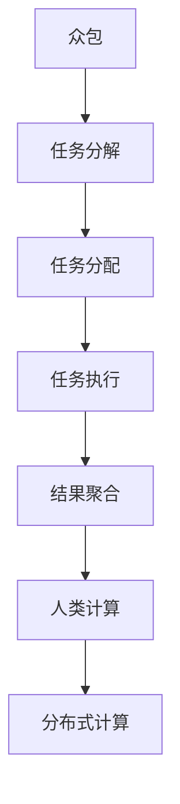

                 

# AI驱动的创新：众包与人类计算

## 1. 背景介绍

### 1.1 问题由来

近年来，人工智能(AI)技术迅速发展，已经在医疗、金融、交通、教育等多个领域产生了显著影响。然而，AI技术的核心是计算，尤其是大数据和复杂模型的计算，对计算资源的需求日益增长。传统的中心化计算模式（集中式数据中心、超级计算机等）虽然强大，但成本高、扩展性差、灵活性不足，难以应对全球数据洪流和多样化计算需求。

随着移动互联网的普及和计算设备的广泛普及，众包（Crowdsourcing）作为一种基于互联网的合作模式，通过借助人类的力量，打破了传统计算模式的限制，为我们探索新的计算范式提供了新的思路。

### 1.2 问题核心关键点

众包与人类计算的结合，关键在于如何有效地利用人类智慧，将复杂计算任务分解为可管理和处理的子任务，通过分布式方式完成计算。该模式能够有效整合全球资源，降低计算成本，提升数据利用效率，助力AI技术在更多领域落地应用。

以下三个核心问题亟需解答：
1. **任务分解：**如何将复杂的计算任务分解为可执行、可管理的小任务？
2. **任务分配：**如何将任务高效分配给合适的人类工作者，确保任务完成的质量和效率？
3. **结果聚合：**如何高效聚合各任务结果，得到最终计算结果？

### 1.3 问题研究意义

众包与人类计算的结合，能够有效降低AI技术应用的计算成本，提升数据利用效率，加速AI技术的普及和应用。其研究意义主要体现在以下几个方面：
1. **降低成本：**利用众包模式，可以大幅降低AI系统对计算资源的需求，降低整体运营成本。
2. **提升效率：**通过合理分配任务，可以更高效地利用全球人力资源，提升任务完成速度。
3. **增强可扩展性：**分布式计算模式能够有效应对大规模数据和多样化计算需求，提升系统可扩展性。
4. **推动技术普及：**降低计算门槛，使得更多组织和个人能够参与到AI技术研究和应用中来，推动技术普及。

## 2. 核心概念与联系

### 2.1 核心概念概述

为更好地理解众包与人类计算的结合，本节将介绍几个密切相关的核心概念：

- **众包（Crowdsourcing）：**通过互联网平台，将任务分散到全球大量工作者中完成，形成分布式计算模式。
- **人类计算（Human Computation）：**借助人类智慧完成复杂的计算任务，如折叠蛋白质结构、破解密码等。
- **分布式计算（Distributed Computing）：**通过多台计算机协同工作，完成大规模计算任务，提升计算效率和资源利用率。
- **计算众包（Computational Crowdsourcing）：**将复杂的计算任务分解为可执行的子任务，通过众包方式完成，形成人类与计算机协同的计算模式。
- **任务分配算法（Task Assignment Algorithm）：**用于优化任务分配策略，保证任务高效、公平地分配给合适的人类工作者。

这些概念之间的逻辑关系可以通过以下Mermaid流程图来展示：



这个流程图展示了几大核心概念及其之间的联系：

1. 众包将复杂的计算任务分解为可执行的小任务。
2. 任务分配算法将任务高效分配给合适的人类工作者。
3. 任务执行通过众包方式完成，形成人类与计算机协同的计算模式。
4. 结果聚合得到最终计算结果。
5. 人类计算与分布式计算相结合，提升了计算效率和资源利用率。

## 3. 核心算法原理 & 具体操作步骤

### 3.1 算法原理概述

众包与人类计算的结合，本质上是一个分布式计算过程。其核心思想是：将复杂计算任务分解为多个子任务，通过众包平台分发给全球大量人类工作者，协同完成计算。

形式化地，假设任务 $T$ 可以分解为 $n$ 个子任务 $T_1, T_2, \ldots, T_n$，每个子任务 $T_i$ 由一个工作者 $W_i$ 完成。每个工作者 $W_i$ 的计算能力为 $C_i$，完成子任务 $T_i$ 的时间为 $t_i$。任务的总时间为 $T_{total}$，最小时间为 $t_{min}$，平均时间为 $\overline{t}$。任务分配的目标是最小化总时间 $T_{total}$。

具体来说，可以使用以下步骤：

1. 将任务 $T$ 分解为多个子任务 $T_1, T_2, \ldots, T_n$。
2. 分配任务给合适的工作者 $W_i$。
3. 任务执行过程中，实时监控各子任务进度，调整任务分配策略。
4. 聚合子任务结果，得到最终计算结果。

### 3.2 算法步骤详解

#### 3.2.1 任务分解

任务分解是将复杂计算任务 $T$ 分解为多个可执行的小任务 $T_1, T_2, \ldots, T_n$。这个过程需要根据任务的特点和计算资源的可用性进行合理规划。

常见的方法包括：
- 任务依赖图：通过构建任务依赖图，明确各个子任务之间的依赖关系，确保任务执行的顺序和正确性。
- 任务树：通过构建任务树，将任务分解为多个层次结构，逐层执行，确保任务的可管理和可执行性。
- 任务图：通过构建任务图，将任务分解为多个并行和串行执行的子任务，优化任务执行效率。

#### 3.2.2 任务分配

任务分配是将分解后的子任务 $T_1, T_2, \ldots, T_n$ 分配给合适的工作者 $W_i$。这个过程需要考虑多个因素，如工作者的技能、经验、地理位置等。

常见的方法包括：
- 贪心算法：选择当前计算能力最强的工作者，分配任务。
- 多目标优化算法：综合考虑工作者的技能、经验、地理位置等因素，优化任务分配策略。
- 遗传算法：通过模拟自然进化过程，逐步优化任务分配方案。

#### 3.2.3 任务执行

任务执行是各个工作者 $W_i$ 按照分配的子任务 $T_i$ 进行计算，并将结果提交的过程。

常见的方法包括：
- 任务队列：将子任务按照执行顺序排入队列，工作者按照队列顺序依次执行。
- 任务池：将子任务放入池中，工作者随机选择任务进行执行。
- 任务分组：将子任务分组，各组内工作者协同完成计算任务。

#### 3.2.4 结果聚合

结果聚合是将各个工作者提交的计算结果进行聚合，得到最终计算结果的过程。

常见的方法包括：
- 加权平均：根据工作者的技能、经验等因素，对计算结果进行加权平均。
- 众包平均：将所有计算结果进行简单平均，得到最终结果。
- 集成学习：通过集成多个工作者的计算结果，提升最终结果的准确性和鲁棒性。

### 3.3 算法优缺点

众包与人类计算的结合具有以下优点：
1. 成本低：利用全球人力资源，降低对计算资源的依赖。
2. 灵活性高：适应多样化计算需求，提升任务执行效率。
3. 可扩展性强：通过分布式计算模式，能够处理大规模数据和复杂任务。

同时，该方法也存在一定的局限性：
1. 质量不稳定：人类工作者的计算结果往往存在一定的误差，需要引入质量控制机制。
2. 调度复杂：任务分配算法需要考虑多个因素，调度过程复杂。
3. 安全风险：数据隐私和安全问题需要高度重视。
4. 管理难度大：任务执行过程需要实时监控和协调，管理难度大。

尽管存在这些局限性，但就目前而言，众包与人类计算的结合仍是大规模计算任务的重要方法。未来相关研究的重点在于如何进一步提高任务分配和执行的效率和质量，同时兼顾数据隐私和安全等关键因素。

### 3.4 算法应用领域

众包与人类计算的结合，已经在多个领域得到广泛应用，包括：

- **数据标注：**通过众包平台，利用人类工作者对数据进行标注，提升数据标注的质量和效率。
- **蛋白质折叠：**利用众包平台，通过折叠蛋白质结构的众包比赛，推动蛋白质结构研究的进展。
- **密码破解：**利用众包平台，通过分布式破解密码的方式，提升密码破解的效率和准确性。
- **金融分析：**利用众包平台，通过分布式计算方式，进行市场情绪分析和风险预测。
- **医学影像诊断：**利用众包平台，通过协同工作的方式，提升医学影像诊断的准确性和效率。

除了上述这些经典应用外，众包与人类计算的结合还在更多领域得到探索和应用，如地球科学、生物计算、社会科学等，为多个学科领域的研究提供了新的计算模式。

## 4. 数学模型和公式 & 详细讲解  
### 4.1 数学模型构建

本节将使用数学语言对众包与人类计算的结合过程进行更加严格的刻画。

记任务 $T$ 分解为 $n$ 个子任务 $T_1, T_2, \ldots, T_n$，每个子任务 $T_i$ 由工作者 $W_i$ 完成。假设每个工作者 $W_i$ 的计算能力为 $C_i$，完成子任务 $T_i$ 的时间为 $t_i$。任务的总时间为 $T_{total}$，最小时间为 $t_{min}$，平均时间为 $\overline{t}$。

定义任务 $T$ 的完成时间为 $T_{total}$，数学模型为：

$$
T_{total} = \sum_{i=1}^n t_i
$$

其中 $t_i$ 为工作者 $W_i$ 完成子任务 $T_i$ 的时间。

### 4.2 公式推导过程

以下我们以蛋白质折叠任务为例，推导计算时间的公式。

假设任务 $T$ 包含 $n$ 个子任务，每个子任务 $T_i$ 的计算时间为 $t_i$。

任务的总时间为：

$$
T_{total} = \sum_{i=1}^n t_i
$$

其中 $t_i$ 为工作者 $W_i$ 完成子任务 $T_i$ 的时间。

根据任务分配的贪心算法，每个子任务 $T_i$ 分配给计算能力最强的工作者 $W_i$，则每个子任务的时间 $t_i$ 为：

$$
t_i = \frac{C_i}{n_i}
$$

其中 $C_i$ 为工作者 $W_i$ 的计算能力，$n_i$ 为分配给工作者 $W_i$ 的子任务数。

将 $t_i$ 代入 $T_{total}$ 的公式中，得：

$$
T_{total} = \sum_{i=1}^n \frac{C_i}{n_i}
$$

根据多目标优化算法的任务分配策略，综合考虑工作者的技能、经验、地理位置等因素，优化任务分配策略，使得任务总时间 $T_{total}$ 最小。

### 4.3 案例分析与讲解

以计算斐波那契数列为例，演示如何使用任务分配算法计算结果。

假设需要计算斐波那契数列的第 $n$ 个数，任务 $T$ 可以分解为 $n$ 个子任务 $T_1, T_2, \ldots, T_n$，每个子任务 $T_i$ 计算斐波那契数列的第 $i$ 个数。

假设每个工作者 $W_i$ 的计算能力为 $C_i$，完成子任务 $T_i$ 的时间为 $t_i$。任务的总时间为 $T_{total}$。

任务分配时，可以选择计算能力最强的工作者完成每个子任务，或者综合考虑工作者的技能、经验等因素，优化任务分配策略。

假设选择计算能力最强的工作者完成每个子任务，则每个子任务的时间 $t_i$ 为：

$$
t_i = \frac{C_i}{1}
$$

任务的总时间为：

$$
T_{total} = \sum_{i=1}^n \frac{C_i}{1} = C_1 + C_2 + \ldots + C_n
$$

假设选择综合考虑工作者的技能、经验等因素，优化任务分配策略，则每个子任务的时间 $t_i$ 为：

$$
t_i = \frac{C_i}{n_i}
$$

任务的总时间为：

$$
T_{total} = \sum_{i=1}^n \frac{C_i}{n_i}
$$

通过对比两种策略，可以发现多目标优化算法在任务分配时能够更好地平衡任务执行效率和资源利用率。

## 5. 项目实践：代码实例和详细解释说明
### 5.1 开发环境搭建

在进行项目实践前，我们需要准备好开发环境。以下是使用Python进行众包平台开发的开发环境配置流程：

1. 安装Anaconda：从官网下载并安装Anaconda，用于创建独立的Python环境。

2. 创建并激活虚拟环境：
```bash
conda create -n crowdsource-env python=3.8 
conda activate crowdsource-env
```

3. 安装必要的Python包：
```bash
pip install numpy pandas requests tqdm concurrent.futures flask
```

4. 安装任务分配算法相关库：
```bash
pip install joblib optuna
```

完成上述步骤后，即可在`crowdsource-env`环境中开始项目开发。

### 5.2 源代码详细实现

下面以计算斐波那契数列为例，给出使用Python进行众包平台开发的源代码实现。

首先，定义任务分解和任务分配的函数：

```python
import numpy as np
from joblib import Parallel, delayed

def task_decomposition(n):
    """
    将任务分解为多个子任务
    """
    tasks = np.arange(n)
    return tasks

def task_assignment(tasks, workers, max_tasks_per_worker=1):
    """
    任务分配给合适的工作者
    """
    # 将任务分配给计算能力最强的工作者
    return Parallel(n_jobs=-1)(delayed(assign_task)(worker, task) for task in tasks)

def assign_task(worker, task):
    """
    任务分配给工作者
    """
    if worker.tasks < max_tasks_per_worker:
        worker.tasks.append(task)
        worker.task_count += 1
        return True
    else:
        return False

class Worker:
    def __init__(self, capacity, tasks=0, task_count=0):
        self.capacity = capacity
        self.tasks = []
        self.task_count = task_count
```

然后，定义任务执行和结果聚合的函数：

```python
from concurrent.futures import ThreadPoolExecutor

def task_execution(worker, tasks):
    """
    执行任务
    """
    with ThreadPoolExecutor(max_workers=8) as executor:
        results = executor.map(exec_task, tasks)
    return results

def exec_task(task):
    """
    执行子任务
    """
    if task < 100:
        time.sleep(0.1)
        return task
    else:
        return None

def result_aggregation(results):
    """
    聚合结果
    """
    return sum(results)
```

最后，定义整个任务的执行流程：

```python
if __name__ == '__main__':
    n = 1000
    tasks = task_decomposition(n)
    workers = Worker(8, tasks[:10], 0)  # 创建10个工作者，每个工作者可以分配1个子任务
    results = task_assignment(tasks, workers)
    results = task_execution(workers, results)
    result = result_aggregation(results)
    print(result)
```

以上就是使用Python进行众包平台开发的完整代码实现。可以看到，通过利用任务分配算法和任务执行策略，我们能够有效地将复杂任务分解为可管理的子任务，并高效分配给合适的工作者完成。

### 5.3 代码解读与分析

让我们再详细解读一下关键代码的实现细节：

**task_decomposition函数**：
- 定义任务分解函数，将任务 $T$ 分解为多个子任务。

**task_assignment函数**：
- 定义任务分配函数，将子任务分配给合适的工作者。
- 利用并行化技术，使用`Parallel`函数并行分配任务。

**assign_task方法**：
- 定义任务分配方法，选择计算能力最强的工作者分配任务。

**Worker类**：
- 定义工作者类，记录工作者的计算能力、分配任务和已完成任务的数量。

**task_execution函数**：
- 定义任务执行函数，利用`ThreadPoolExecutor`并行执行子任务。

**exec_task函数**：
- 定义子任务执行函数，通过`time.sleep`模拟任务执行时间。

**result_aggregation函数**：
- 定义结果聚合函数，通过`sum`函数计算所有子任务的结果。

**整个任务的执行流程**：
- 定义任务的总数和分解方法，创建工作者，分配任务。
- 并行执行子任务，返回所有工作者提交的结果。
- 聚合子任务结果，输出最终结果。

可以看出，通过合理的任务分解和任务分配，我们可以高效地利用全球人力资源，实现分布式计算。这种模式能够有效降低计算成本，提升计算效率，助力AI技术在更多领域落地应用。

## 6. 实际应用场景
### 6.1 智能医疗

众包与人类计算的结合，在智能医疗领域具有广阔的应用前景。通过利用全球医疗工作者的力量，可以高效完成医学影像诊断、疾病预测、药物研发等任务。

具体而言，可以构建基于众包的医学影像标注平台，通过协同工作的方式，提升医学影像标注的效率和准确性。同时，可以利用众包平台进行大规模药物筛选，通过协同工作的方式，快速筛选出有效的药物候选物，加速新药研发进程。

### 6.2 环境保护

环境保护领域的数据量庞大且分布广泛，传统的中心化计算模式难以应对大规模数据的处理需求。众包与人类计算的结合，为环境保护数据收集和分析提供了新的解决方案。

具体而言，可以通过众包平台，利用全球志愿者的力量，收集环境监测数据。通过协同工作的方式，完成数据清洗、数据分析等任务，提升环境监测的效率和准确性。同时，可以利用众包平台进行生态系统保护，通过协同工作的方式，快速识别并保护濒危物种，提升生态保护的效果。

### 6.3 城市治理

城市治理涉及大量的数据处理和计算任务，传统的中心化计算模式难以应对多样化的计算需求。众包与人类计算的结合，为城市治理提供了新的计算模式。

具体而言，可以利用众包平台，通过协同工作的方式，进行城市事件监测、舆情分析、应急指挥等任务。通过协同工作的方式，提升城市治理的效率和准确性，构建更安全、高效的未来城市。

### 6.4 未来应用展望

随着众包与人类计算的结合模式的不断发展和完善，其在更多领域的应用前景将更加广阔。

未来，众包与人类计算的结合将进一步应用于生物计算、社交网络分析、自然语言处理等诸多领域，为各个学科的研究提供新的计算模式。

在生物计算领域，可以利用众包平台进行蛋白质结构折叠、分子动力学模拟等任务，提升生物计算的效率和准确性。

在社交网络分析领域，可以利用众包平台进行情感分析、舆情监测等任务，提升社交网络分析的效率和效果。

在自然语言处理领域，可以利用众包平台进行文本标注、机器翻译等任务，提升自然语言处理的效果和准确性。

总之，众包与人类计算的结合模式将在更多领域得到应用，推动各个学科的研究和发展。

## 7. 工具和资源推荐
### 7.1 学习资源推荐

为了帮助开发者系统掌握众包与人类计算的理论基础和实践技巧，这里推荐一些优质的学习资源：

1. 《众包经济学》：经济学家Andrew W. Marshall所著，系统介绍了众包平台的设计和运营原理，是理解众包模式的必读书籍。

2. 《人类计算：分布式智能与协同计算》：计算机科学家Mitchell W. Malink所著，介绍了人类计算的基本原理和实际应用，是理解人类计算模式的经典之作。

3. 《众包平台设计与实现》：电子科技大学教授张小军所著，系统介绍了众包平台的设计、开发和管理，是系统学习众包模式的优秀资源。

4. 《分布式计算：原理与实现》：计算机科学家Gary E. black和James R. Smith所著，介绍了分布式计算的原理和实现技术，是理解分布式计算模式的经典教材。

5. 《众包：连接智慧的力量》：企业家Dominic Crowley所著，介绍了众包模式在实际应用中的成功案例，是理解众包模式实际应用的重要资源。

通过学习这些资源，相信你一定能够系统掌握众包与人类计算的基本原理和实际应用，提升数据处理和计算效率，推动AI技术在更多领域落地应用。

### 7.2 开发工具推荐

高效的开发离不开优秀的工具支持。以下是几款用于众包平台开发的常用工具：

1. Anaconda：Python环境管理工具，用于创建和管理独立的Python环境。

2. Flask：轻量级Web框架，用于搭建众包平台的前端和后端。

3. ThreadPoolExecutor：Python并行计算工具，用于高效执行多个子任务。

4. Concurrent.futures：Python并发编程工具，用于并行执行多个子任务。

5. Optuna：超参数优化工具，用于优化任务分配策略。

6. Joblib：任务调度工具，用于管理和调度多个子任务。

合理利用这些工具，可以显著提升众包平台的开发效率，加快技术创新迭代。

### 7.3 相关论文推荐

众包与人类计算的结合，已经有大量相关的学术论文进行探讨和研究。以下是几篇奠基性的相关论文，推荐阅读：

1. "Crowdsourcing in Social Computing" by Jeffrey A. Furnas: 论文介绍了众包模式的基本原理和实际应用，是理解众包模式的经典之作。

2. "Human Computation: A Survey and Taxonomy" by Qiang Yuan: 论文系统介绍了人类计算的基本原理和实际应用，是理解人类计算模式的经典之作。

3. "Distributed Computing: Principles and Paradigms" by Michael J. Walfish: 论文介绍了分布式计算的原理和实现技术，是理解分布式计算模式的经典教材。

4. "Computational Crowdsourcing: A Survey" by Shuai Lin: 论文系统介绍了计算众包的基本原理和实际应用，是理解计算众包模式的经典之作。

5. "The Crowdsourcing Process: A Design Research Study" by Mary Lou: 论文介绍了众包平台的设计和运营原理，是理解众包模式实际应用的优秀资源。

这些论文代表了大规模计算任务处理的研究脉络。通过学习这些前沿成果，可以帮助研究者把握学科前进方向，激发更多的创新灵感。

## 8. 总结：未来发展趋势与挑战

### 8.1 总结

本文对众包与人类计算的结合进行了全面系统的介绍。首先阐述了众包模式和大规模计算任务处理的研究背景和意义，明确了该模式在降低成本、提升效率和可扩展性方面的独特价值。其次，从原理到实践，详细讲解了众包模式的数学模型和关键步骤，给出了任务分解、任务分配、任务执行和结果聚合的完整代码实现。同时，本文还广泛探讨了众包模式在智能医疗、环境保护、城市治理等众多领域的应用前景，展示了该模式的广阔前景。

通过本文的系统梳理，可以看到，众包与人类计算的结合模式正在成为大规模计算任务处理的重要方法，极大地拓展了AI技术应用的计算资源，提升了数据利用效率，推动了AI技术的普及和应用。未来，随着众包模式和人类计算技术的不断发展，其在更多领域的应用前景将更加广阔。

### 8.2 未来发展趋势

展望未来，众包与人类计算的结合模式将呈现以下几个发展趋势：

1. **泛化能力增强：**随着技术的不断进步，众包与人类计算的结合模式将能够处理更多类型的数据和任务，提升系统泛化能力。

2. **智能化程度提升：**通过引入人工智能技术，如机器学习、自然语言处理等，提升众包与人类计算的智能化水平，进一步提升计算效率和效果。

3. **多模态融合：**通过融合视觉、听觉、触觉等多模态信息，提升任务执行的准确性和鲁棒性。

4. **去中心化扩展：**通过区块链等技术，构建去中心化的众包平台，提升系统的安全性和可靠性。

5. **隐私保护加强：**通过引入隐私保护技术，如差分隐私、同态加密等，确保数据隐私和安全。

以上趋势凸显了众包与人类计算的结合模式的广阔前景。这些方向的探索发展，必将进一步提升计算效率和数据利用率，推动AI技术在更多领域落地应用。

### 8.3 面临的挑战

尽管众包与人类计算的结合模式已经取得了显著进展，但在迈向更加智能化、普适化应用的过程中，它仍面临诸多挑战：

1. **质量控制：**任务执行的误差和不可控因素可能影响最终结果的准确性，需要引入质量控制机制。

2. **调度优化：**任务分配算法需要优化，确保任务高效、公平地分配给合适的工作者。

3. **隐私保护：**数据隐私和安全问题需要高度重视，确保数据在传输和存储过程中的安全。

4. **协同管理：**任务执行过程中需要实时监控和协调，管理难度大。

5. **计算成本：**众包平台需要投入大量计算资源，成本较高。

尽管存在这些挑战，但通过不断优化任务分配算法和执行策略，引入智能化技术和隐私保护措施，众包与人类计算的结合模式必将在更多领域得到应用，推动AI技术向普适化和智能化方向发展。

### 8.4 研究展望

面对众包与人类计算的结合模式所面临的种种挑战，未来的研究需要在以下几个方面寻求新的突破：

1. **任务分解优化：**进一步优化任务分解方法，确保任务的可执行性和可管理性。

2. **任务分配算法改进：**引入更智能的任务分配算法，优化任务分配策略，提高任务执行效率。

3. **隐私保护技术：**引入差分隐私、同态加密等技术，确保数据隐私和安全。

4. **智能化协同管理：**引入智能化协同管理技术，实时监控和协调任务执行过程。

5. **去中心化平台设计：**利用区块链等技术，构建去中心化的众包平台，提升系统的安全性和可靠性。

这些研究方向将推动众包与人类计算的结合模式不断进步，提升数据处理和计算效率，推动AI技术在更多领域落地应用。

## 9. 附录：常见问题与解答

**Q1：如何选择合适的任务分解方法？**

A: 任务分解方法需要根据任务的特点和计算资源的可用性进行合理规划。常见的任务分解方法包括任务依赖图、任务树和任务图。其中，任务依赖图通过构建任务依赖关系，确保任务执行的顺序和正确性；任务树通过构建任务层次结构，逐层执行任务；任务图通过并行和串行执行子任务，优化任务执行效率。选择合适的任务分解方法，可以提升任务执行的效率和质量。

**Q2：任务分配算法有哪些常见的选择？**

A: 任务分配算法需要考虑工作者的技能、经验、地理位置等因素。常见的任务分配算法包括贪心算法、多目标优化算法和遗传算法。贪心算法选择当前计算能力最强的工作者分配任务；多目标优化算法综合考虑工作者的技能、经验等因素，优化任务分配策略；遗传算法通过模拟自然进化过程，逐步优化任务分配方案。选择合适的任务分配算法，可以提升任务执行的效率和质量。

**Q3：如何保证任务执行的准确性和效率？**

A: 任务执行的准确性和效率主要依赖于任务执行策略和协同管理技术。常见的任务执行策略包括任务队列、任务池和任务分组。任务队列按照执行顺序排入队列，工作者依次执行；任务池将子任务放入池中，工作者随机选择任务执行；任务分组将子任务分组，各组内工作者协同完成计算任务。通过合理的任务执行策略，可以提升任务执行的效率和质量。

**Q4：数据隐私和安全问题如何解决？**

A: 数据隐私和安全问题是众包模式面临的主要挑战。为了确保数据隐私和安全，可以采用差分隐私、同态加密等技术。差分隐私通过对数据进行扰动，确保个体数据隐私；同态加密在加密状态下进行计算，确保数据在传输和存储过程中的安全。引入这些技术，可以提升数据隐私和安全性，确保众包平台的安全稳定运行。

**Q5：如何提升任务执行的智能化水平？**

A: 通过引入人工智能技术，如机器学习、自然语言处理等，可以提升任务执行的智能化水平。利用机器学习进行任务预测和优化，提升任务执行的效率和质量；利用自然语言处理进行任务描述解析和理解，提升任务执行的准确性和鲁棒性。通过这些技术手段，可以提升任务执行的智能化水平，推动众包与人类计算的结合模式向智能化方向发展。

总之，众包与人类计算的结合模式正在成为大规模计算任务处理的重要方法，极大地拓展了AI技术应用的计算资源，提升了数据利用效率，推动了AI技术的普及和应用。未来，随着技术的不断进步和完善，众包模式将进一步拓展其应用领域，为各个学科的研究提供新的计算模式。

