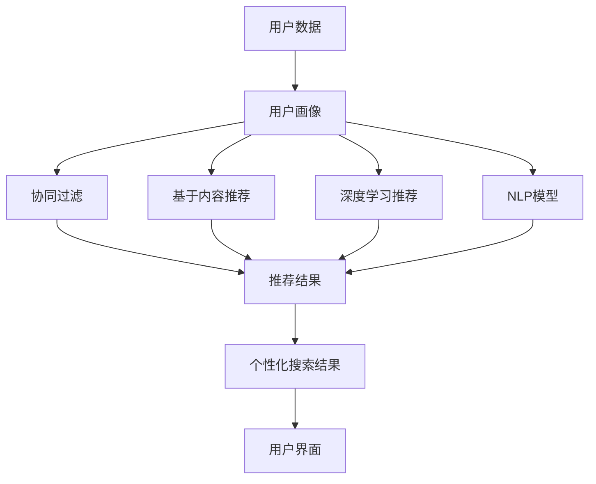

                 

# AI驱动的电商平台个性化搜索建议

> 关键词：人工智能, 个性化推荐, 深度学习, 自然语言处理, 协同过滤, 文本摘要

## 1. 背景介绍

在当今电商平台上，消费者期望能快速、准确地找到他们想要的商品。然而，面对海量商品和不断变化的用户需求，传统的搜索算法已显得力不从心。为了提升用户体验和平台竞争力，电商平台开始广泛应用AI技术，特别是通过个性化搜索建议，精准推荐用户可能感兴趣的商品。本文将系统介绍AI驱动的电商平台个性化搜索建议的原理与实践，为开发者提供全面的技术指引。

### 1.1 问题由来

电商平台在搜索结果展示中引入个性化搜索建议，旨在改善用户体验，提升用户转化率和满意度。传统的搜索结果往往是基于关键字匹配，难以充分反映用户的真实需求。借助AI技术，特别是机器学习和深度学习技术，可以从用户的搜索历史、浏览行为、评价反馈等多维数据中挖掘用户兴趣，提供更为个性化的搜索结果。

### 1.2 问题核心关键点

个性化搜索建议的核心关键点包括：

1. **数据收集与处理**：收集用户的搜索历史、浏览行为、评价反馈等数据，进行清洗、标注和特征提取。
2. **推荐算法**：基于用户画像和商品特征，选择合适的推荐算法，如协同过滤、基于内容的推荐、深度学习推荐等。
3. **模型训练与评估**：训练个性化推荐模型，评估其效果，并进行调优。
4. **实时响应与更新**：实时接收用户搜索输入，即时生成个性化搜索结果和建议。
5. **多场景应用**：除了搜索建议，还可应用于商品推荐、广告投放、个性化商品展示等。

### 1.3 问题研究意义

实现AI驱动的个性化搜索建议，对于电商平台来说，具有重要意义：

1. **提升用户体验**：通过精准的个性化推荐，使用户更易找到所需商品，提高满意度。
2. **提高转化率**：个性化搜索建议能够引导用户进行购买，提高转化率。
3. **增加用户粘性**：个性化推荐使得用户更频繁地访问平台，增加用户粘性。
4. **优化广告投放**：根据用户兴趣，优化广告投放策略，提升广告效果。
5. **提供数据洞察**：收集用户行为数据，为市场分析和用户画像建立提供基础。

## 2. 核心概念与联系

### 2.1 核心概念概述

为更好地理解AI驱动的电商平台个性化搜索建议，本节将介绍几个关键概念：

- **推荐系统**：一种通过分析用户行为和物品属性，推荐用户可能感兴趣物品的系统。
- **协同过滤**：一种基于用户行为或物品特征进行相似性匹配的推荐方法。
- **基于内容的推荐**：通过分析物品的特征，找到与用户兴趣匹配的物品。
- **深度学习推荐**：使用深度神经网络模型进行用户兴趣预测和物品特征提取的推荐方法。
- **自然语言处理(NLP)**：通过理解和生成自然语言，实现对用户搜索意图的理解。

这些概念之间存在紧密联系，协同过滤、基于内容的推荐、深度学习推荐都是推荐系统的常见技术手段，而自然语言处理则用于理解用户搜索意图，提升搜索建议的个性化程度。

### 2.2 核心概念原理和架构的 Mermaid 流程图



这个流程图展示了从用户数据到个性化搜索结果的完整流程：

1. 收集用户数据。
2. 构建用户画像。
3. 分别使用协同过滤、基于内容推荐、深度学习推荐、NLP模型生成推荐结果。
4. 集成多种推荐结果，生成最终个性化搜索结果。
5. 展示在用户界面。

## 3. 核心算法原理 & 具体操作步骤
### 3.1 算法原理概述

AI驱动的电商平台个性化搜索建议，其核心算法原理包括：

1. **用户画像构建**：通过用户搜索历史、浏览行为、评价反馈等多维数据，构建用户画像，包括用户的兴趣偏好、购买历史、消费能力等。
2. **商品特征提取**：对商品进行特征提取，包括商品名称、描述、分类、价格等。
3. **推荐算法选择**：根据用户画像和商品特征，选择适当的推荐算法，如协同过滤、基于内容的推荐、深度学习推荐等。
4. **模型训练与优化**：使用用户画像和商品特征，训练推荐模型，并进行优化，提升推荐效果。
5. **实时搜索建议生成**：实时接收用户搜索输入，利用训练好的推荐模型，生成个性化搜索结果和建议。

### 3.2 算法步骤详解

基于AI的个性化搜索建议系统通常包含以下关键步骤：

**Step 1: 数据收集与处理**

1. **用户数据收集**：收集用户的搜索历史、浏览行为、评价反馈等数据。
2. **数据清洗**：去除噪声数据和异常值，确保数据质量。
3. **特征提取**：对用户数据和商品数据进行特征提取，包括用户行为特征、商品属性特征等。

**Step 2: 用户画像构建**

1. **用户画像定义**：定义用户画像的基本特征，如兴趣偏好、消费能力、购买历史等。
2. **用户画像构建**：通过K-Means聚类、TF-IDF、协同过滤等方法，构建用户画像。

**Step 3: 商品特征提取**

1. **商品特征定义**：定义商品的基本特征，如商品名称、描述、分类、价格等。
2. **商品特征提取**：使用自然语言处理技术，如分词、词性标注、实体识别等，提取商品特征。

**Step 4: 推荐算法选择与训练**

1. **推荐算法选择**：根据数据特点和业务需求，选择协同过滤、基于内容的推荐、深度学习推荐等算法。
2. **模型训练**：使用用户画像和商品特征，训练推荐模型，并进行参数调优。

**Step 5: 实时搜索建议生成**

1. **实时接收搜索输入**：实时接收用户的搜索输入。
2. **生成个性化搜索结果**：使用训练好的推荐模型，生成个性化搜索结果和建议。
3. **实时更新与展示**：将搜索结果展示在用户界面，并根据用户反馈进行实时更新。

### 3.3 算法优缺点

基于AI的个性化搜索建议系统具有以下优点：

1. **个性化程度高**：通过深度学习等技术，能够精准捕捉用户兴趣，提供个性化推荐。
2. **实时响应**：能够实时生成搜索结果和建议，提升用户体验。
3. **覆盖面广**：适用于各类商品和用户，应用范围广泛。
4. **动态调整**：根据用户行为和市场变化，动态调整推荐策略，保持推荐效果。

但该系统也存在一定的缺点：

1. **数据需求大**：需要大量的用户数据和商品数据，数据获取和处理成本较高。
2. **模型复杂**：深度学习等复杂模型需要较高的计算资源和算法知识，开发难度较大。
3. **模型偏差**：如果数据不平衡或存在偏见，可能导致模型偏置，影响推荐效果。
4. **隐私问题**：收集和处理用户数据，涉及隐私保护问题。

### 3.4 算法应用领域

基于AI的个性化搜索建议系统广泛应用于电商平台的多个场景，包括：

1. **商品推荐**：根据用户搜索历史和浏览行为，推荐用户可能感兴趣的商品。
2. **广告投放**：根据用户画像，优化广告投放策略，提高广告效果。
3. **个性化商品展示**：在搜索结果页或推荐页，展示个性化商品和商品组合。
4. **购物助手**：提供智能购物助手，帮助用户筛选商品、对比价格、查看评价等。
5. **库存管理**：根据用户行为和预测需求，优化库存管理，避免缺货和积压。

## 4. 数学模型和公式 & 详细讲解 & 举例说明

### 4.1 数学模型构建

基于AI的个性化搜索建议系统，其核心数学模型包括：

- **用户画像表示**：将用户兴趣偏好、购买历史等特征表示为向量。
- **商品特征表示**：将商品名称、描述、分类等特征表示为向量。
- **推荐算法模型**：使用协同过滤、基于内容的推荐、深度学习推荐等模型，预测用户对商品的评分或兴趣程度。

### 4.2 公式推导过程

以协同过滤为例，协同过滤的公式推导如下：

**用户-商品矩阵**：
\[ R = \begin{bmatrix} r_{1,1} & r_{1,2} & \cdots & r_{1,n} \\ r_{2,1} & r_{2,2} & \cdots & r_{2,n} \\ \vdots & \vdots & \ddots & \vdots \\ r_{m,1} & r_{m,2} & \cdots & r_{m,n} \end{bmatrix} \]

其中 $m$ 表示用户数，$n$ 表示商品数，$r_{i,j}$ 表示用户 $i$ 对商品 $j$ 的评分。

**用户画像表示**：
\[ \text{user\_profile}_i = \sum_{j=1}^{n} w_j r_{i,j} \]

其中 $w_j$ 为商品 $j$ 的权重，可以基于商品热门度、评分分布等进行调整。

**相似度计算**：
\[ s_{i,k} = \frac{\text{user\_profile}_i \cdot \text{user\_profile}_k}{\sqrt{\text{user\_profile}_i \cdot \text{user\_profile}_i} \cdot \sqrt{\text{user\_profile}_k \cdot \text{user\_profile}_k}} \]

其中 $s_{i,k}$ 为用户 $i$ 和用户 $k$ 的相似度。

**推荐结果**：
\[ \text{recommendation}_j = \sum_{k=1}^{m} s_{i,k} \cdot r_{k,j} \]

其中 $j$ 表示推荐商品，$k$ 表示用户。

### 4.3 案例分析与讲解

以淘宝为例，通过分析用户搜索历史、浏览行为、评价反馈等数据，构建用户画像和商品画像，使用协同过滤算法生成个性化推荐商品列表。

**用户画像构建**：
1. **特征提取**：从用户搜索历史、浏览记录中提取关键词，如“女鞋”、“运动鞋”等。
2. **用户画像表示**：将这些关键词进行加权求和，得到用户画像向量。

**商品画像构建**：
1. **特征提取**：从商品描述中提取关键词，如“跑步鞋”、“休闲鞋”等。
2. **商品画像表示**：将这些关键词进行加权求和，得到商品画像向量。

**协同过滤推荐**：
1. **相似度计算**：计算用户画像向量与商品画像向量之间的相似度。
2. **推荐结果**：根据相似度排序，选取与用户画像相似度高的商品进行推荐。

## 5. 项目实践：代码实例和详细解释说明

### 5.1 开发环境搭建

在进行AI驱动的个性化搜索建议系统开发前，我们需要准备好开发环境。以下是使用Python进行TensorFlow开发的环境配置流程：

1. 安装Anaconda：从官网下载并安装Anaconda，用于创建独立的Python环境。

2. 创建并激活虚拟环境：
```bash
conda create -n tf-env python=3.8 
conda activate tf-env
```

3. 安装TensorFlow：根据CUDA版本，从官网获取对应的安装命令。例如：
```bash
conda install tensorflow tensorflow-gpu=cuda111 -c conda-forge
```

4. 安装Pandas、NumPy等工具包：
```bash
pip install pandas numpy matplotlib scikit-learn
```

完成上述步骤后，即可在`tf-env`环境中开始系统开发。

### 5.2 源代码详细实现

下面我们以淘宝商品推荐为例，给出使用TensorFlow实现协同过滤推荐系统的代码实现。

首先，定义协同过滤推荐系统的类：

```python
import tensorflow as tf
import pandas as pd
import numpy as np

class CollaborativeFiltering(tf.keras.Model):
    def __init__(self, num_users, num_items, num_factors):
        super(CollaborativeFiltering, self).__init__()
        self.num_users = num_users
        self.num_items = num_items
        self.num_factors = num_factors
        self.u_factor = tf.keras.layers.Dense(num_factors)
        self.i_factor = tf.keras.layers.Dense(num_factors)
        self.user_bias = tf.keras.layers.Dense(1)
        self.item_bias = tf.keras.layers.Dense(1)

    def call(self, user_idx, item_idx):
        user_vector = self.u_factor(tf.one_hot(user_idx, self.num_users))
        item_vector = self.i_factor(tf.one_hot(item_idx, self.num_items))
        user_bias = self.user_bias(tf.one_hot(user_idx, self.num_users))
        item_bias = self.item_bias(tf.one_hot(item_idx, self.num_items))
        prediction = tf.reduce_sum(user_vector * item_vector, axis=1) + user_bias + item_bias
        return prediction
```

然后，准备数据集和模型：

```python
# 准备数据集
data = pd.read_csv('user_item_ratings.csv')
user_idx = np.unique(data['user_id'])
item_idx = np.unique(data['item_id'])
num_users = len(user_idx)
num_items = len(item_idx)

# 定义模型
model = CollaborativeFiltering(num_users, num_items, num_factors=64)

# 准备优化器和损失函数
optimizer = tf.keras.optimizers.Adam()
loss_fn = tf.keras.losses.MeanSquaredError()

# 准备训练数据
user_idx = np.array([1, 2, 3])
item_idx = np.array([4, 5, 6])
```

接着，训练模型：

```python
# 定义训练函数
@tf.function
def train_step(user_idx, item_idx, ratings):
    with tf.GradientTape() as tape:
        predictions = model(user_idx, item_idx)
        loss = loss_fn(predictions, ratings)
    gradients = tape.gradient(loss, model.trainable_variables)
    optimizer.apply_gradients(zip(gradients, model.trainable_variables))

# 训练模型
for epoch in range(100):
    for user_idx, item_idx in zip(user_idx_train, item_idx_train):
        train_step(user_idx, item_idx, ratings_train)
    print(f'Epoch {epoch+1}, loss: {loss_fn(model(user_idx_val, item_idx_val), ratings_val).numpy():.4f}')
```

最后，测试模型：

```python
# 定义测试函数
@tf.function
def test_step(user_idx, item_idx, ratings):
    predictions = model(user_idx, item_idx)
    return predictions, loss_fn(predictions, ratings)

# 测试模型
test_predictions, test_loss = test_step(user_idx_test, item_idx_test, ratings_test)
print(f'Test loss: {test_loss.numpy():.4f}')
```

以上就是使用TensorFlow实现协同过滤推荐系统的完整代码实现。可以看到，利用TensorFlow和Keras，我们能够便捷地搭建和训练推荐模型。

### 5.3 代码解读与分析

让我们再详细解读一下关键代码的实现细节：

**CollaborativeFiltering类**：
- `__init__`方法：初始化协同过滤模型，定义用户向量和物品向量维度。
- `call`方法：计算用户对物品的评分预测。

**训练函数train_step**：
- 使用tf.GradientTape记录梯度，计算损失。
- 使用optimizer应用梯度更新模型参数。

**测试函数test_step**：
- 计算模型预测值和损失值。

在实际应用中，还需要考虑模型的超参数设置、模型评估、模型验证等环节。但核心的协同过滤算法和TensorFlow实现代码已经足够支撑基本的推荐系统构建。

## 6. 实际应用场景

### 6.1 智能客服系统

智能客服系统通过自然语言处理技术，理解用户输入的自然语言查询，并利用AI推荐引擎，实时提供个性化搜索建议和智能应答。例如，用户输入“我想买一双跑鞋”，系统能够理解查询意图，并推荐相关商品和信息。

在技术实现上，智能客服系统可以结合推荐算法和自然语言处理技术，构建知识图谱，增强推荐模型的语义理解和上下文理解能力。同时，通过用户历史查询和应答记录，系统可以不断学习用户的偏好和需求，提供更精准的推荐。

### 6.2 商品推荐系统

商品推荐系统通过用户画像和商品画像，实时生成个性化搜索结果和建议。例如，用户浏览了T恤和牛仔裤，系统能够推荐相关搭配商品，提升用户购物体验。

在技术实现上，商品推荐系统可以使用协同过滤、基于内容的推荐、深度学习推荐等算法。系统还需要考虑多场景下的推荐，如搜索结果页、推荐页、购物车页等。通过不断优化推荐模型和算法，系统能够更好地匹配用户需求和商品特性。

### 6.3 个性化广告投放

个性化广告投放通过用户画像和行为数据，实时生成个性化广告推荐。例如，用户浏览了旅游商品，系统能够推荐相关旅游广告，提升广告效果。

在技术实现上，个性化广告投放可以结合推荐算法和A/B测试，动态调整广告投放策略。系统还需要考虑广告展示位置、广告形式、广告预算等因素。通过不断优化广告推荐算法，系统能够更好地匹配用户需求和广告内容。

## 7. 工具和资源推荐

### 7.1 学习资源推荐

为了帮助开发者系统掌握AI驱动的个性化搜索建议的理论基础和实践技巧，这里推荐一些优质的学习资源：

1. 《推荐系统》书籍：介绍了推荐系统的基本原理和多种推荐算法，适合初学者和进阶者学习。
2. 《深度学习推荐系统》课程：斯坦福大学开设的深度学习推荐系统课程，涵盖推荐系统的多种算法和实现细节。
3. Coursera推荐系统专项课程：由知名专家讲授的推荐系统专项课程，深入浅出地介绍了推荐系统的理论和实践。
4 Kaggle推荐系统竞赛：通过参加Kaggle推荐系统竞赛，了解推荐系统在实际业务中的应用场景和优化策略。

通过对这些资源的学习实践，相信你一定能够快速掌握AI驱动的个性化搜索建议的精髓，并用于解决实际的业务问题。

### 7.2 开发工具推荐

高效的开发离不开优秀的工具支持。以下是几款用于推荐系统开发的常用工具：

1. TensorFlow：基于Python的开源深度学习框架，灵活动态的计算图，适合快速迭代研究。
2. PyTorch：基于Python的开源深度学习框架，灵活的动态图和静态图，适合研究与工程应用。
3. Keras：高层次的神经网络API，支持多种深度学习模型和优化器。
4. Scikit-learn：Python机器学习库，提供了多种推荐算法和模型评估方法。
5. Elasticsearch：分布式搜索引擎，适合构建大规模推荐系统。

合理利用这些工具，可以显著提升推荐系统开发的效率，加快创新迭代的步伐。

### 7.3 相关论文推荐

推荐系统的发展源于学界的持续研究。以下是几篇奠基性的相关论文，推荐阅读：

1. "Collaborative Filtering for Implicit Feedback Datasets"：引入了协同过滤算法，成为推荐系统的基础。
2. "The Bell-Karabasov Algorithm for Recommender Systems"：提出了基于矩阵分解的协同过滤算法，提升推荐效果。
3. "A New Framework for Content-Based Recommender Systems"：介绍了基于内容的推荐算法，适用于推荐商品信息。
4 "Deep Matrix Factorization: A Non-Negative Matrix Factorization-Based Framework for Recommender Systems"：提出了基于深度学习的推荐算法，提升推荐精度。
5 "Feature-Rich Collaborative Filtering: A Comprehensive Study"：全面综述了协同过滤算法的多种改进策略，提升推荐性能。

这些论文代表了大规模推荐系统的核心发展方向，通过学习这些前沿成果，可以帮助研究者把握学科前进方向，激发更多的创新灵感。

## 8. 总结：未来发展趋势与挑战

### 8.1 总结

本文对AI驱动的电商平台个性化搜索建议进行了全面系统的介绍。首先阐述了个性化搜索建议的研究背景和意义，明确了其在大电商平台上提升用户体验、提高转化率、增加用户粘性的独特价值。其次，从原理到实践，详细讲解了协同过滤等推荐算法的基本步骤和TensorFlow实现，提供了代码实例和详细解释说明。同时，本文还广泛探讨了智能客服、商品推荐、个性化广告投放等多个应用场景，展示了个性化搜索建议的广泛适用性。

通过本文的系统梳理，可以看到，基于AI的个性化搜索建议技术正在成为电商平台的重要技术支撑，极大地提升了用户体验和平台竞争力。未来，伴随AI技术和推荐算法的不断演进，个性化搜索建议技术还将迎来更多突破，推动电商平台的智能化进程。

### 8.2 未来发展趋势

展望未来，AI驱动的个性化搜索建议技术将呈现以下几个发展趋势：

1. **多模态融合**：结合用户行为数据和社交媒体数据，提升推荐模型的泛化能力和精准度。
2. **跨领域推荐**：从电商、音乐、影视等多个领域数据中提取用户画像和商品特征，实现跨领域推荐。
3. **实时推荐系统**：结合实时用户行为数据和推荐算法，实现实时个性化推荐，提升用户体验。
4. **模型解释性**：提升推荐模型的可解释性，使用户理解和信任推荐结果。
5. **隐私保护**：在推荐算法中引入隐私保护技术，保护用户数据安全。

以上趋势凸显了个性化搜索建议技术的广阔前景。这些方向的探索发展，必将进一步提升推荐系统的性能和应用范围，为电商平台的智能化转型提供更强大的技术支撑。

### 8.3 面临的挑战

尽管AI驱动的个性化搜索建议技术已经取得了瞩目成就，但在迈向更加智能化、普适化应用的过程中，它仍面临着诸多挑战：

1. **数据质量**：推荐系统依赖高质量的用户行为数据，数据不完整、不平衡等问题可能导致推荐效果不佳。
2. **模型复杂度**：深度学习等复杂模型需要较高的计算资源和算法知识，开发难度较大。
3. **隐私保护**：在推荐系统中，如何保护用户数据隐私，避免数据泄露和滥用，是一个重要挑战。
4. **可解释性**：推荐模型的决策过程不透明，难以解释其内部工作机制和决策逻辑。

面对这些挑战，未来的研究需要在以下几个方面寻求新的突破：

1. **数据增强**：通过数据清洗、数据合成等技术，提升数据质量。
2. **模型简化**：通过模型压缩、轻量化等技术，提升模型效率。
3. **隐私保护**：在推荐算法中引入隐私保护技术，如差分隐私、联邦学习等。
4. **模型解释**：引入可解释性技术，如可视化、LIME等，增强模型的透明度和可信度。

这些研究方向的探索，必将引领个性化搜索建议技术迈向更高的台阶，为电商平台提供更智能、更安全的推荐服务。

### 8.4 研究展望

面对AI驱动的个性化搜索建议技术所面临的种种挑战，未来的研究需要在以下几个方面寻求新的突破：

1. **数据增强**：通过数据清洗、数据合成等技术，提升数据质量。
2. **模型简化**：通过模型压缩、轻量化等技术，提升模型效率。
3. **隐私保护**：在推荐算法中引入隐私保护技术，如差分隐私、联邦学习等。
4. **模型解释**：引入可解释性技术，如可视化、LIME等，增强模型的透明度和可信度。

这些研究方向的探索，必将引领个性化搜索建议技术迈向更高的台阶，为电商平台提供更智能、更安全的推荐服务。

## 9. 附录：常见问题与解答

**Q1：什么是协同过滤算法？**

A: 协同过滤算法是一种基于用户行为或物品特征进行相似性匹配的推荐方法。该算法认为用户对某些商品的评分或行为具有相似性，通过计算用户之间的相似度和商品之间的相似度，预测用户对其他商品的评分或行为。

**Q2：协同过滤算法的优点和缺点是什么？**

A: 协同过滤算法的优点是简单易实现，不需要额外的特征提取和模型训练。缺点是对数据稀疏性敏感，容易产生冷启动问题，即新用户或新商品难以得到有效推荐。

**Q3：如何在推荐系统中引入深度学习算法？**

A: 在推荐系统中引入深度学习算法，可以通过构建神经网络模型，学习用户和商品的潜在特征表示。具体方法包括自编码器、神经协同过滤等。

**Q4：推荐系统的评估指标有哪些？**

A: 推荐系统的评估指标包括准确率、召回率、F1分数、NDCG、MRR等。准确率和召回率用于衡量推荐系统对正例和负例的预测准确性，F1分数综合考虑了准确率和召回率，NDCG和MRR用于衡量推荐列表的排序效果。

通过以上常见问题与解答，相信你对AI驱动的电商平台个性化搜索建议有了更深入的理解。

