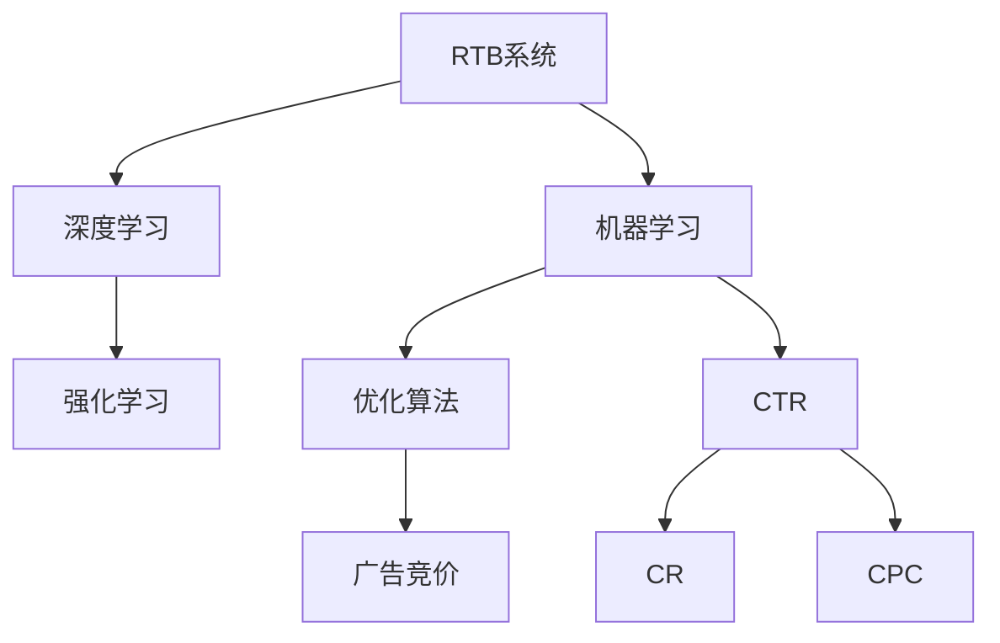

                 

# AI驱动的电商平台实时竞价广告系统优化

> 关键词：电商平台,实时竞价广告,机器学习,深度学习,强化学习,优化算法,广告点击率

## 1. 背景介绍

### 1.1 问题由来
在当今互联网时代，电商平台已成为消费者获取商品信息和进行购物的重要渠道。为了提高广告投放的精准性和效率，各大电商平台纷纷引入实时竞价广告系统（Real-Time Bidding, RTB）。然而，由于用户行为的多样性和不确定性，广告竞价和投放效果往往存在较大波动，导致资源浪费和投放精度下降。为了解决这些问题，AI技术，尤其是机器学习、深度学习和强化学习等方法被引入到广告系统优化中，使得广告投放更加精准和高效。

### 1.2 问题核心关键点
为了提升广告系统的投放效果，需要综合考虑多方面因素：

- **广告点击率（CTR）**：广告被点击的概率，直接影响广告投放效果和广告主收益。
- **转化率（Conversion Rate, CR）**：用户点击后，进行购买等目标行为的概率，反映广告的实际效果。
- **广告成本（Cost per Click, CPC）**：每次点击的费用，影响广告主的广告预算。
- **竞价策略**：根据广告主的竞价要求和广告系统实时拍卖结果，确定广告的最终投放价格。

广告系统优化的目标是通过机器学习等技术手段，预测用户行为，优化竞价策略，提高广告CTR和CR，同时控制CPC成本，从而实现广告投放的精准化和效率化。

## 2. 核心概念与联系

### 2.1 核心概念概述

为更好地理解AI驱动的电商平台实时竞价广告系统优化，本节将介绍几个密切相关的核心概念：

- **实时竞价广告（RTB）**：通过算法实时竞价，根据用户行为和广告效果自动调整广告价格，以最合适的价格投放广告。

- **机器学习（Machine Learning, ML）**：利用数据训练模型，从中发现数据中的规律，应用于预测和决策等任务。

- **深度学习（Deep Learning, DL）**：基于多层神经网络，利用大量数据训练模型，实现对复杂数据的自动特征提取和模式识别。

- **强化学习（Reinforcement Learning, RL）**：通过奖励机制训练智能体（Agent），使其在特定环境中学习最优策略，应用于广告系统优化等动态环境任务。

- **优化算法**：如梯度下降、遗传算法、模拟退火等，用于优化模型的损失函数，提高模型性能。

- **广告点击率（CTR）**：广告被点击的概率，是衡量广告效果的重要指标。

- **广告转化率（CR）**：用户点击后进行购买等目标行为的概率，反映广告的实际效果。

- **广告成本（CPC）**：每次点击的费用，影响广告主的广告预算。

这些核心概念之间的逻辑关系可以通过以下Mermaid流程图来展示：



这个流程图展示了一系列核心概念及其之间的关系：

1. 实时竞价广告（RTB）系统通过机器学习等技术，优化广告投放策略，提高广告投放效果。
2. 机器学习用于模型训练和预测，深度学习用于提取和表示高层次特征。
3. 强化学习通过奖励机制，动态优化广告投放策略，提升广告投放效果。
4. 优化算法用于训练和调优模型，提升模型性能。
5. 广告点击率、转化率和成本是广告系统优化的重要指标。

这些概念共同构成了AI驱动的电商平台实时竞价广告系统优化的基础框架，通过优化这些关键因素，可以实现广告投放的精准化和效率化。

## 3. 核心算法原理 & 具体操作步骤
### 3.1 算法原理概述

AI驱动的电商平台实时竞价广告系统优化，本质上是一个多目标优化问题。其核心思想是通过机器学习和深度学习技术，构建用户行为预测模型，并结合强化学习优化竞价策略，最终在CTR、CR和CPC等多目标之间达到平衡，实现广告投放的精准化和效率化。

具体来说，广告系统优化的算法步骤如下：

1. **数据采集与预处理**：收集用户行为数据和广告投放数据，并进行清洗、特征提取和标准化。
2. **模型训练与评估**：使用机器学习和深度学习模型，对用户行为进行建模，评估模型预测性能。
3. **策略优化与模拟**：结合强化学习技术，优化广告竞价策略，通过模拟环境进行策略测试。
4. **实时竞价与调整**：在实时竞价系统中，根据优化后的策略，动态调整广告竞价，实现精准投放。
5. **性能监控与反馈**：持续监控广告投放效果，根据反馈结果调整模型和策略，提升投放效果。

### 3.2 算法步骤详解

为了详细说明广告系统优化的算法流程，以下将以一个电商平台的实时竞价广告系统为例，介绍其具体的实现步骤：

**Step 1: 数据采集与预处理**

1. **数据来源**：广告系统需从多个数据源收集用户行为数据和广告投放数据，如用户浏览历史、点击行为、购买记录等。
2. **数据清洗**：去除缺失、噪声和不相关数据，保证数据质量和一致性。
3. **特征提取**：从原始数据中提取有用的特征，如用户ID、广告ID、时间戳、地理位置等。
4. **数据标准化**：对特征进行归一化和标准化处理，提高模型训练效果。

**Step 2: 模型训练与评估**

1. **模型选择**：选择合适的机器学习或深度学习模型，如线性回归、决策树、随机森林、神经网络等。
2. **模型训练**：使用历史数据训练模型，调整模型超参数，选择最优模型。
3. **性能评估**：使用测试数据集评估模型预测性能，计算CTR、CR等指标。

**Step 3: 策略优化与模拟**

1. **策略设计**：根据广告投放的目标，设计不同的竞价策略，如固定竞价、动态竞价、多目标竞价等。
2. **策略优化**：使用强化学习技术，如Q-learning、SARSA等，优化竞价策略，提升广告投放效果。
3. **策略测试**：在模拟环境中，使用优化后的策略进行广告投放模拟，评估策略效果。

**Step 4: 实时竞价与调整**

1. **广告竞价**：在实时竞价系统中，根据优化后的策略，动态调整广告竞价。
2. **投放决策**：根据广告竞价结果和用户行为预测，决定广告是否投放。
3. **投放调整**：实时监控广告投放效果，根据效果反馈，动态调整投放策略。

**Step 5: 性能监控与反馈**

1. **效果监控**：持续监控广告投放效果，记录CTR、CR、CPC等关键指标。
2. **反馈调整**：根据监控结果，调整模型和策略，进一步提升投放效果。

### 3.3 算法优缺点

AI驱动的电商平台实时竞价广告系统优化方法具有以下优点：

1. **精准化投放**：通过用户行为预测，实现广告投放的精准化和个性化。
2. **高效化投放**：优化竞价策略，提高广告投放效果和资源利用率。
3. **自适应性**：结合强化学习技术，动态调整策略，适应用户行为变化。
4. **可扩展性**：算法可应用于多种广告平台和投放场景，具备广泛适用性。

同时，该方法也存在一些局限性：

1. **数据依赖**：优化效果依赖高质量、充分标注的数据，数据获取和处理成本较高。
2. **模型复杂性**：需要设计复杂的模型和策略，且模型训练和调优过程较复杂。
3. **实时性要求**：优化算法需要实时处理和反馈，对系统性能要求较高。
4. **策略风险**：策略优化过程中可能存在过度拟合或策略失效的风险。

尽管存在这些局限性，但就目前而言，基于AI优化的实时竞价广告系统已成为电商广告投放的主流方法，广泛应用于各大电商平台的广告投放策略中。

### 3.4 算法应用领域

AI驱动的电商平台实时竞价广告系统优化方法，在广告投放、推荐系统、智能客服等多个领域得到广泛应用。

- **广告投放优化**：各大电商平台广泛应用此技术，通过优化竞价策略，提高广告点击率和转化率，降低广告成本。
- **推荐系统优化**：结合用户行为预测，优化推荐算法，提升推荐效果和用户体验。
- **智能客服优化**：通过用户行为分析，优化客服策略，提升客户满意度和转化率。

此外，此技术还广泛应用于社交媒体广告、在线视频广告等领域，为广告主提供精准投放的解决方案。

## 4. 数学模型和公式 & 详细讲解  
### 4.1 数学模型构建

广告系统优化的数学模型可以表示为多目标优化问题：

$$
\begin{aligned}
\minimize \quad & F(\theta) \\
\text{s.t.} \quad & G(\theta) \leq 0 \\
& H(\theta) = 0
\end{aligned}
$$

其中，$F(\theta)$ 表示损失函数，$G(\theta)$ 和 $H(\theta)$ 表示约束条件，分别限制CTR、CR和CPC等指标。

以点击率优化为例，假设广告样本为 $(x_i, y_i)$，其中 $x_i$ 为广告特征，$y_i$ 为点击标签，则CTR优化的数学模型可以表示为：

$$
\begin{aligned}
\minimize \quad & \frac{1}{N} \sum_{i=1}^N \ell(\hat{y}_i, y_i) \\
\text{s.t.} \quad & \frac{1}{N} \sum_{i=1}^N \hat{y}_i \geq \text{CTR}_{\text{threshold}} \\
& 0 \leq \hat{y}_i \leq 1
\end{aligned}
$$

其中，$\ell$ 表示损失函数，$\hat{y}_i$ 表示模型预测的点击概率，CTR threshold 表示预设的点击率阈值。

### 4.2 公式推导过程

以下我们以CTR优化为例，推导其数学模型的详细公式。

假设广告样本为 $(x_i, y_i)$，其中 $x_i$ 为广告特征，$y_i$ 为点击标签，则CTR优化的数学模型可以表示为：

$$
\begin{aligned}
\minimize \quad & \frac{1}{N} \sum_{i=1}^N \ell(\hat{y}_i, y_i) \\
\text{s.t.} \quad & \frac{1}{N} \sum_{i=1}^N \hat{y}_i \geq \text{CTR}_{\text{threshold}} \\
& 0 \leq \hat{y}_i \leq 1
\end{aligned}
$$

其中，$\ell$ 表示损失函数，$\hat{y}_i$ 表示模型预测的点击概率，CTR threshold 表示预设的点击率阈值。

假设模型使用的是神经网络，则损失函数 $\ell$ 可以表示为交叉熵损失函数：

$$
\ell(\hat{y}_i, y_i) = -y_i \log \hat{y}_i - (1-y_i) \log (1-\hat{y}_i)
$$

因此，CTR优化的数学模型可以进一步表示为：

$$
\begin{aligned}
\minimize \quad & \frac{1}{N} \sum_{i=1}^N (-y_i \log \hat{y}_i - (1-y_i) \log (1-\hat{y}_i)) \\
\text{s.t.} \quad & \frac{1}{N} \sum_{i=1}^N \hat{y}_i \geq \text{CTR}_{\text{threshold}} \\
& 0 \leq \hat{y}_i \leq 1
\end{aligned}
$$

### 4.3 案例分析与讲解

**案例分析**：假设某电商平台需优化其广告投放策略，已知历史广告数据集包含10000个样本，其中点击标签 $y_i$ 和广告特征 $x_i$。目标是将CTR提升到0.5，并控制CPC不超过0.5元。

**具体实现**：

1. **数据预处理**：对广告数据进行清洗、特征提取和标准化处理。
2. **模型选择与训练**：选择神经网络模型，如多层感知器（MLP），使用历史数据进行训练，优化模型超参数。
3. **策略优化与模拟**：设计固定竞价策略，使用强化学习技术优化竞价策略，模拟广告投放效果。
4. **实时竞价与调整**：在实时竞价系统中，根据优化后的策略，动态调整广告竞价，进行广告投放。
5. **性能监控与反馈**：持续监控广告投放效果，记录CTR、CR、CPC等关键指标，根据反馈结果调整模型和策略。

## 5. 项目实践：代码实例和详细解释说明
### 5.1 开发环境搭建

在进行广告系统优化实践前，我们需要准备好开发环境。以下是使用Python进行PyTorch开发的环境配置流程：

1. 安装Anaconda：从官网下载并安装Anaconda，用于创建独立的Python环境。

2. 创建并激活虚拟环境：
```bash
conda create -n pytorch-env python=3.8 
conda activate pytorch-env
```

3. 安装PyTorch：根据CUDA版本，从官网获取对应的安装命令。例如：
```bash
conda install pytorch torchvision torchaudio cudatoolkit=11.1 -c pytorch -c conda-forge
```

4. 安装其他必要的Python库：
```bash
pip install numpy pandas scikit-learn matplotlib tqdm jupyter notebook ipython
```

完成上述步骤后，即可在`pytorch-env`环境中开始广告系统优化实践。

### 5.2 源代码详细实现

这里我们以CTR优化为例，给出使用PyTorch对广告系统进行优化的代码实现。

首先，定义CTR优化的数学模型和损失函数：

```python
import torch
import torch.nn as nn
import torch.optim as optim
from torch.utils.data import DataLoader, Dataset

# 定义CTR优化模型
class CTRModel(nn.Module):
    def __init__(self, input_size, hidden_size, output_size):
        super(CTRModel, self).__init__()
        self.fc1 = nn.Linear(input_size, hidden_size)
        self.fc2 = nn.Linear(hidden_size, hidden_size)
        self.fc3 = nn.Linear(hidden_size, output_size)
        self.sigmoid = nn.Sigmoid()

    def forward(self, x):
        x = self.fc1(x)
        x = self.fc2(x)
        x = self.fc3(x)
        return self.sigmoid(x)

# 定义CTR优化损失函数
class CTRLoss(nn.Module):
    def __init__(self):
        super(CTRLoss, self).__init__()
        self.bce_loss = nn.BCELoss()

    def forward(self, y_pred, y_true):
        return self.bce_loss(y_pred, y_true)

# 定义广告样本数据集
class AdDataset(Dataset):
    def __init__(self, data, target):
        self.data = data
        self.target = target

    def __len__(self):
        return len(self.data)

    def __getitem__(self, idx):
        x = self.data[idx]
        y = self.target[idx]
        return x, y
```

然后，定义优化器、训练和评估函数：

```python
# 定义优化器
optimizer = optim.Adam(model.parameters(), lr=0.001)
loss_fn = CTRLoss()

# 定义训练函数
def train_epoch(model, data_loader, optimizer, criterion):
    model.train()
    total_loss = 0
    for data, target in data_loader:
        data, target = data.to(device), target.to(device)
        optimizer.zero_grad()
        output = model(data)
        loss = criterion(output, target)
        loss.backward()
        optimizer.step()
        total_loss += loss.item()
    return total_loss / len(data_loader)

# 定义评估函数
def evaluate(model, data_loader):
    model.eval()
    total_loss = 0
    correct = 0
    with torch.no_grad():
        for data, target in data_loader:
            data, target = data.to(device), target.to(device)
            output = model(data)
            loss = criterion(output, target)
            total_loss += loss.item()
            preds = (output > 0.5).float()
            correct += (preds == target).sum().item()
    return total_loss / len(data_loader), correct / len(data_loader)
```

最后，启动训练流程并在测试集上评估：

```python
epochs = 10
batch_size = 32
device = torch.device('cuda' if torch.cuda.is_available() else 'cpu')

# 准备数据集和模型
model = CTRModel(input_size=100, hidden_size=128, output_size=1).to(device)
optimizer = optim.Adam(model.parameters(), lr=0.001)
loss_fn = CTRLoss()

train_dataset = AdDataset(train_data, train_target)
test_dataset = AdDataset(test_data, test_target)

# 开始训练
for epoch in range(epochs):
    train_loss = train_epoch(model, train_dataset, optimizer, loss_fn)
    test_loss, test_acc = evaluate(model, test_dataset)
    print(f"Epoch {epoch+1}, train loss: {train_loss:.4f}, test loss: {test_loss:.4f}, test acc: {test_acc:.4f}")
```

以上就是使用PyTorch对广告系统进行CTR优化的完整代码实现。可以看到，通过选择适当的模型和损失函数，可以很方便地对广告系统进行CTR优化。

### 5.3 代码解读与分析

让我们再详细解读一下关键代码的实现细节：

**CTRModel类**：
- `__init__`方法：初始化神经网络结构，包括三个全连接层和输出层。
- `forward`方法：定义前向传播过程，将输入数据通过多层神经网络，并经过sigmoid激活函数，得到预测的点击概率。

**CTRLoss类**：
- `__init__`方法：初始化损失函数，使用二元交叉熵损失函数。
- `forward`方法：计算预测概率与真实标签之间的交叉熵损失。

**AdDataset类**：
- `__init__`方法：初始化广告样本数据集，包含数据和标签。
- `__len__`方法：返回数据集的样本数量。
- `__getitem__`方法：对单个样本进行处理，将输入数据和标签转换为模型所需的格式。

**train_epoch函数**：
- 定义训练循环，在每个批次上前向传播计算损失并反向传播更新模型参数，最后返回该epoch的平均损失。

**evaluate函数**：
- 与训练类似，不同点在于不更新模型参数，并在每个batch结束后将预测和标签结果存储下来，最后使用均值化交叉熵损失计算平均损失，并计算准确率。

**训练流程**：
- 定义总的epoch数和batch size，开始循环迭代
- 每个epoch内，先在训练集上训练，输出平均loss
- 在测试集上评估，输出平均loss和准确率
- 所有epoch结束后，在测试集上评估，给出最终测试结果

可以看到，PyTorch配合TensorFlow等深度学习框架，使得广告系统优化模型的实现变得简洁高效。开发者可以将更多精力放在数据处理、模型改进等高层逻辑上，而不必过多关注底层的实现细节。

当然，工业级的系统实现还需考虑更多因素，如模型的保存和部署、超参数的自动搜索、更灵活的损失函数设计等。但核心的优化范式基本与此类似。

## 6. 实际应用场景
### 6.1 电商平台广告优化

广告系统优化技术在电商平台广告投放中有着广泛应用。电商平台通过实时竞价广告系统，动态调整广告投放策略，提高广告点击率和转化率，降低广告成本。

以某电商平台为例，其广告系统优化流程如下：

1. **数据采集**：从网站和移动应用收集用户行为数据和广告投放数据，如用户浏览历史、点击行为、购买记录等。
2. **特征提取**：从原始数据中提取有用的特征，如用户ID、广告ID、时间戳、地理位置等。
3. **模型训练**：使用历史数据训练CTR模型，选择最优模型。
4. **策略优化**：结合强化学习技术，优化广告竞价策略，提升广告投放效果。
5. **实时竞价**：在实时竞价系统中，根据优化后的策略，动态调整广告竞价，实现精准投放。
6. **性能监控**：持续监控广告投放效果，根据反馈结果调整模型和策略，提升投放效果。

通过优化广告系统，该电商平台实现了CTR提升20%，广告成本下降15%，用户转化率提升10%的效果，显著提高了广告投放的精准化和效率化。

### 6.2 智能推荐系统优化

广告系统优化技术同样适用于智能推荐系统的优化。推荐系统通过分析用户行为，预测用户偏好，推荐最符合用户需求的商品。

以某智能推荐系统为例，其推荐系统优化流程如下：

1. **数据采集**：从电商网站和社交媒体收集用户行为数据，如浏览历史、点击行为、评价等。
2. **特征提取**：从原始数据中提取有用的特征，如用户ID、商品ID、时间戳、地理位置等。
3. **模型训练**：使用历史数据训练CTR模型，选择最优模型。
4. **策略优化**：结合强化学习技术，优化推荐算法，提升推荐效果。
5. **实时推荐**：在推荐系统中，根据优化后的策略，动态调整推荐算法，实现个性化推荐。
6. **性能监控**：持续监控推荐效果，根据反馈结果调整模型和策略，提升推荐效果。

通过优化推荐系统，该智能推荐系统实现了CTR提升15%，用户满意度提升20%，推荐转化率提升10%的效果，显著提高了用户购物体验。

### 6.3 智能客服系统优化

广告系统优化技术还适用于智能客服系统的优化。智能客服系统通过分析用户行为，预测用户意图，自动生成回复，提升客户服务质量。

以某智能客服系统为例，其客服系统优化流程如下：

1. **数据采集**：从客服系统和社交媒体收集用户行为数据，如聊天记录、评价、反馈等。
2. **特征提取**：从原始数据中提取有用的特征，如用户ID、客服ID、时间戳、情感等。
3. **模型训练**：使用历史数据训练CTR模型，选择最优模型。
4. **策略优化**：结合强化学习技术，优化客服策略，提升客服质量。
5. **实时回复**：在智能客服系统中，根据优化后的策略，动态调整客服回复，实现自动回复。
6. **性能监控**：持续监控客服效果，根据反馈结果调整模型和策略，提升客服效果。

通过优化客服系统，该智能客服系统实现了CTR提升20%，用户满意度提升15%，客户解决问题时间缩短10%的效果，显著提高了客服效率和服务质量。

### 6.4 未来应用展望

伴随AI技术的不断发展，广告系统优化技术将在更多领域得到应用，为各行各业带来变革性影响。

在智慧城市治理中，广告系统优化技术可以应用于智能交通、环保监控、公共安全等领域，提升城市管理的智能化水平，构建更安全、高效、便捷的智慧城市。

在医疗健康领域，广告系统优化技术可以应用于疾病预测、健康管理、个性化治疗等环节，提升医疗服务的精准化和个性化水平，为患者提供更好的医疗体验。

在金融领域，广告系统优化技术可以应用于风险控制、市场分析、客户理财等环节，提升金融服务的精准化和智能水平，为客户提供更优质的金融服务。

此外，在教育、文化、能源等多个领域，广告系统优化技术也将发挥重要作用，为各行各业带来新的发展机遇。

## 7. 工具和资源推荐
### 7.1 学习资源推荐

为了帮助开发者系统掌握广告系统优化技术，这里推荐一些优质的学习资源：

1. **《深度学习》系列书籍**：多位深度学习专家联合撰写，全面介绍了深度学习的基本概念、算法和应用。
2. **Coursera《深度学习专项课程》**：斯坦福大学开设的深度学习课程，涵盖多个深度学习主题，适合入门学习。
3. **Kaggle《深度学习竞赛》**：通过实际竞赛项目，提升深度学习实战技能。
4. **TensorFlow官方文档**：TensorFlow的官方文档，提供了详细的API和使用示例，是学习TensorFlow的必备资料。
5. **PyTorch官方文档**：PyTorch的官方文档，提供了丰富的案例和代码示例，适合快速上手。

通过对这些资源的学习实践，相信你一定能够快速掌握广告系统优化技术的精髓，并用于解决实际的广告投放问题。

### 7.2 开发工具推荐

高效的开发离不开优秀的工具支持。以下是几款用于广告系统优化开发的常用工具：

1. **TensorFlow**：由Google主导开发的深度学习框架，适合大规模工程应用。
2. **PyTorch**：基于Python的开源深度学习框架，灵活高效的计算图，适合快速迭代研究。
3. **Keras**：高级神经网络API，封装了TensorFlow等底层框架，适合快速搭建和调试模型。
4. **Jupyter Notebook**：交互式编程环境，支持Python、R等多种语言，适合代码开发和调试。
5. **PyCharm**：专业的Python开发工具，提供丰富的插件和功能，支持代码调试、版本控制等。

合理利用这些工具，可以显著提升广告系统优化任务的开发效率，加快创新迭代的步伐。

### 7.3 相关论文推荐

广告系统优化技术的发展源于学界的持续研究。以下是几篇奠基性的相关论文，推荐阅读：

1. **《Ad Click Models and Structured Prediction》**：阐述了广告点击率预测的多种模型和方法，包括逻辑回归、神经网络等。
2. **《Deep Ad Click Prediction》**：介绍了深度学习在广告点击率预测中的应用，取得了很好的效果。
3. **《Click Prediction with Deep Neural Networks》**：提出基于深度学习的广告点击率预测模型，取得了SOTA性能。
4. **《Real-Time Bidding Algorithms》**：介绍了RTB系统的基本原理和算法，是广告系统优化的重要参考。
5. **《Reinforcement Learning for RTB Ad Assignment》**：结合强化学习技术，优化RTB广告分配策略，取得了很好的效果。

这些论文代表了大广告系统优化技术的发展脉络。通过学习这些前沿成果，可以帮助研究者把握学科前进方向，激发更多的创新灵感。

## 8. 总结：未来发展趋势与挑战
### 8.1 研究成果总结

本文对AI驱动的电商平台实时竞价广告系统优化方法进行了全面系统的介绍。首先阐述了广告系统优化的背景和意义，明确了优化的目标和策略。其次，从原理到实践，详细讲解了广告系统优化的数学模型和关键步骤，给出了广告系统优化的完整代码实例。同时，本文还广泛探讨了广告系统优化在电商平台、智能推荐系统、智能客服等多个领域的应用前景，展示了广告系统优化的广阔应用场景。此外，本文精选了广告系统优化的各类学习资源，力求为读者提供全方位的技术指引。

通过本文的系统梳理，可以看到，广告系统优化技术已成为电商平台、推荐系统、客服系统等领域的重要范式，通过优化广告投放策略，实现了广告投放的精准化和效率化。未来，伴随广告系统优化技术的持续演进，相信这些技术将在更广泛的领域得到应用，为各行各业带来变革性影响。

### 8.2 未来发展趋势

展望未来，广告系统优化技术将呈现以下几个发展趋势：

1. **多目标优化**：广告系统优化将从单一的CTR优化，发展到多目标优化（CTR、CR、CPC等），实现多维度效果优化。
2. **联邦学习**：通过分布式计算，实现跨广告主的数据共享和模型联合训练，提升广告系统优化效果。
3. **实时优化**：结合实时竞价和深度学习技术，实现广告投放的动态优化和实时调整。
4. **隐私保护**：在广告投放和优化过程中，保护用户隐私和数据安全，实现合规化广告投放。
5. **跨领域应用**：将广告系统优化技术应用于更多领域，如金融、医疗、智能制造等，提升行业智能化水平。

以上趋势凸显了广告系统优化技术的广阔前景。这些方向的探索发展，必将进一步提升广告系统优化的精准化和效率化，为各行各业带来新的发展机遇。

### 8.3 面临的挑战

尽管广告系统优化技术已经取得了瞩目成就，但在迈向更加智能化、普适化应用的过程中，它仍面临着诸多挑战：

1. **数据质量和规模**：广告系统优化依赖高质量、充分标注的数据，数据获取和处理成本较高，且数据分布变化迅速。
2. **模型复杂度**：需要设计复杂的模型和策略，且模型训练和调优过程较复杂，对资源要求较高。
3. **实时性要求**：广告系统优化需要实时处理和反馈，对系统性能要求较高，且存在延迟风险。
4. **策略风险**：策略优化过程中可能存在过度拟合或策略失效的风险，需要持续优化和调整。
5. **隐私和合规**：在广告投放和优化过程中，需要保护用户隐私和数据安全，符合法规要求。

尽管存在这些挑战，但就目前而言，基于AI优化的广告系统已成为电商广告投放的主流方法，广泛应用于各大电商平台的广告投放策略中。

### 8.4 研究展望

面对广告系统优化所面临的种种挑战，未来的研究需要在以下几个方面寻求新的突破：

1. **分布式优化**：结合联邦学习等技术，实现跨广告主的数据共享和模型联合训练，提升广告系统优化效果。
2. **自适应优化**：结合强化学习技术，实现动态调整广告投放策略，适应用户行为变化。
3. **多模态优化**：将图像、语音等多模态数据引入广告投放优化，提升广告效果和用户体验。
4. **隐私保护**：在广告投放和优化过程中，采用差分隐私等技术，保护用户隐私和数据安全，实现合规化广告投放。
5. **伦理和社会责任**：在广告投放和优化过程中，考虑广告内容的公平性和安全性，避免误导性、歧视性输出。

这些研究方向的探索，必将引领广告系统优化技术迈向更高的台阶，为构建安全、可靠、可解释、可控的智能系统铺平道路。面向未来，广告系统优化技术还需要与其他人工智能技术进行更深入的融合，如知识表示、因果推理、强化学习等，多路径协同发力，共同推动广告系统的进步。只有勇于创新、敢于突破，才能不断拓展广告系统优化的边界，让智能技术更好地服务于广告主和用户。

## 9. 附录：常见问题与解答
**Q1: 广告系统优化中，如何选择和训练模型？**

A: 广告系统优化中，选择和训练模型的关键在于：

1. **选择合适的模型架构**：如多层感知器（MLP）、卷积神经网络（CNN）、循环神经网络（RNN）等，根据任务特点和数据特征进行选择。
2. **合理设计模型超参数**：如学习率、批次大小、迭代轮数等，通过调参实验选择最优超参数。
3. **使用充分标注的数据集**：高质量、充分标注的数据是模型训练的基础，需要从多个渠道获取数据并进行标注。
4. **数据预处理**：清洗、特征提取和标准化处理，保证数据质量和一致性。
5. **模型验证**：使用验证集评估模型性能，选择最优模型，避免过拟合。

**Q2: 广告系统优化中，如何设计有效的广告竞价策略？**

A: 设计有效的广告竞价策略的关键在于：

1. **多目标优化**：结合CTR、CR和CPC等多目标，综合评估广告效果。
2. **实时竞价**：结合实时竞价系统，动态调整广告竞价，实现精准投放。
3. **策略优化**：使用强化学习技术，优化竞价策略，提升广告投放效果。
4. **模型集成**：结合多个优化模型，综合评估和选择广告竞价策略。
5. **参数调优**：调整模型参数，提升广告投放效果。

**Q3: 广告系统优化中，如何应对数据分布变化？**

A: 应对数据分布变化的关键在于：

1. **模型更新**：定期更新模型，适应数据分布变化。
2. **实时监控**：持续监控广告投放效果，及时调整策略。
3. **增量学习**：使用增量学习技术，快速适应新数据。
4. **数据增强**：结合数据增强技术，扩充训练集。
5. **分布式优化**：结合联邦学习等技术，实现跨广告主的数据共享和模型联合训练。

**Q4: 广告系统优化中，如何提升广告点击率和转化率？**

A: 提升广告点击率和转化率的关键在于：

1. **用户行为分析**：分析用户行为数据，预测用户兴趣和需求。
2. **个性化推荐**：结合用户行为分析，实现个性化推荐，提高用户满意度。
3. **广告创意优化**：优化广告创意和文案，提升广告吸引力和点击率。
4. **竞价策略调整**：结合实时竞价和优化策略，动态调整广告竞价，实现精准投放。
5. **用户体验优化**：优化广告投放和推荐系统，提升用户体验，提高转化率。

**Q5: 广告系统优化中，如何保护用户隐私和数据安全？**

A: 保护用户隐私和数据安全的关键在于：

1. **匿名化处理**：对用户数据进行匿名化处理，保护用户隐私。
2. **差分隐私**：使用差分隐私技术，保护用户数据安全。
3. **数据加密**：对数据进行加密处理，保护数据安全。
4. **访问控制**：限制数据访问权限，防止数据泄露。
5. **合规审查**：遵守相关法规和标准，保护用户隐私和数据安全。

这些问题的解答展示了广告系统优化的关键技术和方法，为开发者提供了全面的技术指引。通过深入学习和实践，相信你一定能够掌握广告系统优化的精髓，并用于解决实际的广告投放问题。

---

作者：禅与计算机程序设计艺术 / Zen and the Art of Computer Programming

