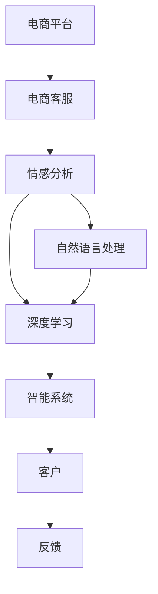

                 

# AI驱动的电商平台智能客服情感识别系统

> 关键词：情感分析,自然语言处理,深度学习,电商,客服,智能系统

## 1. 背景介绍

### 1.1 问题由来
近年来，随着电商平台的高速发展，在线客服成为提升用户体验、推动电商业务增长的关键环节。传统的文本客服系统虽然能够处理大量客户咨询，但普遍存在响应慢、体验差、效率低等问题。而智能客服系统的引入，可以大幅提升客服的自动化程度和响应速度，改善客户服务体验，促进电商业务增长。

情感分析作为智能客服系统中不可或缺的一环，能够帮助系统更好地理解客户情绪，提供精准的服务建议和策略。因此，如何通过情感分析技术提升电商平台客服系统的智能化水平，成为了当前电商行业关注的热点问题。

### 1.2 问题核心关键点
电商平台智能客服情感识别系统旨在通过情感分析技术，自动识别客户在客服对话中的情绪状态，根据情绪状态提供相应的服务策略和反馈，从而提升客户满意度。

具体而言，该系统的核心关键点包括：
- 自动情感识别：使用深度学习技术自动识别客户在文本中的情感状态。
- 情绪驱动策略：根据客户情绪状态，调整客服策略，提供更针对性的服务。
- 智能客户引导：通过情感分析结果，指导客服人员更好地与客户沟通。
- 多渠道融合：支持语音、文字、图片等多种渠道的情感识别。
- 持续学习与优化：系统通过不断积累客服数据，优化情感识别模型，提升系统性能。

### 1.3 问题研究意义
研究电商平台智能客服情感识别系统，对于提升客户服务体验、提高电商转化率、降低客服成本具有重要意义：

1. **提升客户服务体验**：通过情感分析技术，系统能够及时捕捉客户情绪变化，提供及时、个性化、精准的反馈，从而提升客户满意度。
2. **提高电商转化率**：针对不同情绪状态的客户，提供相应的营销策略，促进客户转化，增加电商业务收入。
3. **降低客服成本**：自动化处理大量客户咨询，减少人工客服的重复性工作，提升客服效率，降低运营成本。
4. **加速电商业务发展**：通过情感分析结果，指导客服策略，提升服务质量，吸引更多客户，推动电商业务增长。
5. **推动行业进步**：情感分析技术在电商领域的应用，将带动更多行业和企业采用类似技术，推动整个行业的智能化升级。

## 2. 核心概念与联系

### 2.1 核心概念概述

为更好地理解电商平台智能客服情感识别系统的原理，本节将介绍几个密切相关的核心概念：

- 情感分析(Affective Analysis)：通过文本挖掘、自然语言处理技术，自动识别文本中的情感倾向，如正面、负面、中性等。
- 自然语言处理(NLP)：涉及文本的预处理、分词、向量化、序列建模、语义分析等技术，为情感分析提供基础。
- 深度学习(Deep Learning)：包括神经网络、卷积神经网络(CNN)、循环神经网络(RNN)、长短时记忆网络(LSTM)、Transformer等模型，是情感分析的主要技术手段。
- 电商客服(Customer Service)：指电商平台提供的在线客服服务，包括自动回答、人工引导、订单处理等环节。
- 智能系统(Intelligent System)：指利用AI技术构建的系统，能够自主学习和执行任务，提升用户体验和业务效率。

这些核心概念之间的逻辑关系可以通过以下Mermaid流程图来展示：



这个流程图展示了大语言模型的核心概念及其之间的关系：

1. 电商平台通过电商客服提供客户服务。
2. 客服通过与客户的交流，收集客户反馈。
3. 客户反馈经过自然语言处理和情感分析，转换为情感状态。
4. 情感状态经深度学习模型分析，得到客户情绪倾向。
5. 系统根据客户情绪，调整服务策略，提升客户满意度。

## 3. 核心算法原理 & 具体操作步骤
### 3.1 算法原理概述

电商平台智能客服情感识别系统通过深度学习模型自动识别客户在文本中的情感状态。其核心思想是：利用预训练的Transformer模型，通过大量标注的客户反馈数据进行微调，学习文本与情感之间的映射关系。

具体而言，系统首先对客户反馈进行预处理，包括去除停用词、分词、向量化等步骤。然后，使用预训练的Transformer模型对文本进行编码，得到文本的语义表示。最后，通过多分类神经网络对语义表示进行分类，得到情感状态。

### 3.2 算法步骤详解

电商平台智能客服情感识别系统的核心算法步骤如下：

**Step 1: 准备数据集**
- 收集电商平台的客户反馈数据，标注为正面、负面、中性等情感类别。
- 对数据进行预处理，包括去停用词、分词、构建词向量等。
- 将数据划分为训练集、验证集和测试集，以便后续模型训练和评估。

**Step 2: 构建情感识别模型**
- 选择合适的预训练Transformer模型，如BERT、GPT等，作为情感识别模型。
- 添加情感分类器，通常是多分类神经网络，输出情感类别概率。
- 设定损失函数，如交叉熵损失，用于衡量模型预测与真实标签的差异。

**Step 3: 设置微调超参数**
- 选择合适的优化算法及其参数，如AdamW、SGD等，设置学习率、批大小、迭代轮数等。
- 设置正则化技术及强度，包括权重衰减、Dropout、Early Stopping等。
- 确定冻结预训练参数的策略，如仅微调顶层，或全部参数都参与微调。

**Step 4: 执行梯度训练**
- 将训练集数据分批次输入模型，前向传播计算损失函数。
- 反向传播计算参数梯度，根据设定的优化算法和学习率更新模型参数。
- 周期性在验证集上评估模型性能，根据性能指标决定是否触发 Early Stopping。
- 重复上述步骤直到满足预设的迭代轮数或 Early Stopping 条件。

**Step 5: 测试和部署**
- 在测试集上评估情感识别模型，对比微调前后的精度提升。
- 使用微调后的模型对新客户反馈进行推理预测，集成到智能客服系统中。
- 持续收集新的客户反馈，定期重新微调模型，以适应数据分布的变化。

以上是电商平台智能客服情感识别系统的核心算法步骤。在实际应用中，还需要根据具体场景和需求，对模型训练过程进行优化设计，如改进训练目标函数，引入更多的正则化技术，搜索最优的超参数组合等，以进一步提升模型性能。

### 3.3 算法优缺点

电商平台智能客服情感识别系统具有以下优点：
1. 实时高效。利用深度学习模型，系统能够实时处理客户反馈，快速输出情感识别结果。
2. 精准度高。通过大量标注数据的微调，模型能够精准地识别客户情感状态。
3. 适应性强。预训练Transformer模型在大规模无标签数据上预训练，适应性强，能够很好地泛化到电商客服场景。
4. 扩展性好。系统可以轻松集成到现有的电商平台客服系统中，提升现有系统的智能化水平。

同时，该系统也存在一定的局限性：
1. 标注数据依赖。系统效果很大程度上取决于标注数据的质量和数量，获取高质量标注数据的成本较高。
2. 泛化能力有限。当训练数据与实际应用场景的分布差异较大时，微调的性能提升有限。
3. 模型复杂度高。深度学习模型虽然效果好，但模型参数量大，计算资源需求高。
4. 可解释性不足。深度学习模型的决策过程通常缺乏可解释性，难以对其推理逻辑进行分析和调试。

尽管存在这些局限性，但就目前而言，电商平台智能客服情感识别系统仍是大规模客服系统中的重要技术手段。未来相关研究的重点在于如何进一步降低系统对标注数据的依赖，提高系统的泛化能力，同时兼顾可解释性和伦理安全性等因素。

### 3.4 算法应用领域

电商平台智能客服情感识别系统已经在电商客服、智能推荐、广告投放等多个领域得到广泛应用，具体包括：

- 智能客服系统：通过情感识别结果，调整客服策略，提供个性化的服务。
- 推荐系统：根据客户情绪状态，调整推荐策略，提升用户满意度。
- 广告投放：根据客户情绪，动态调整广告投放策略，提高广告效果。
- 用户行为分析：通过情感识别结果，分析用户行为，优化客户体验。
- 客户关系管理：通过情感识别结果，优化客户关系，提高客户忠诚度。

除了上述这些常见应用外，电商平台智能客服情感识别系统还可应用于舆情分析、市场调查、品牌监测等多个领域，为电商平台提供全方位的情感洞察和决策支持。

## 4. 数学模型和公式 & 详细讲解  
### 4.1 数学模型构建

本节将使用数学语言对电商平台智能客服情感识别系统的情感识别模型进行更加严格的刻画。

记预训练Transformer模型为 $M_{\theta}$，其中 $\theta$ 为预训练得到的模型参数。假设情感识别任务的目标是分类客户反馈的情感状态，标记为 $\{p, n, c\}$，分别代表正面、负面和中性。给定标注数据集 $D=\{(x_i, y_i)\}_{i=1}^N$，其中 $x_i$ 为文本数据，$y_i \in \{p, n, c\}$ 为情感类别标签。

定义模型 $M_{\theta}$ 在输入 $x_i$ 上的情感表示为 $H_i=M_{\theta}(x_i)$，输出情感类别概率分布为 $P_i=[p_i, n_i, c_i]$，其中 $p_i=\frac{\exp(h_i^p)}{\sum_{j \in \{p, n, c\}} \exp(h_i^j)}$，$h_i^p, h_i^n, h_i^c$ 分别为正面、负面和中性的预测得分。

情感识别模型的损失函数为：

$$
\mathcal{L}(\theta) = -\frac{1}{N}\sum_{i=1}^N \sum_{j \in \{p, n, c\}} y_i \log p_j + (1-y_i) \log (1-p_j)
$$

其中 $y_i$ 为真实情感类别标签。通过最小化损失函数，模型 $M_{\theta}$ 可以学习文本数据与情感类别之间的映射关系。

### 4.2 公式推导过程

以下我们以二分类任务为例，推导交叉熵损失函数及其梯度的计算公式。

假设模型 $M_{\theta}$ 在输入 $x$ 上的输出为 $\hat{y}=M_{\theta}(x) \in [0,1]$，表示样本属于正面情感的概率。真实标签 $y \in \{0,1\}$。则二分类交叉熵损失函数定义为：

$$
\ell(M_{\theta}(x),y) = -[y\log \hat{y} + (1-y)\log (1-\hat{y})]
$$

将其代入经验风险公式，得：

$$
\mathcal{L}(\theta) = -\frac{1}{N}\sum_{i=1}^N [y_i\log M_{\theta}(x_i)+(1-y_i)\log(1-M_{\theta}(x_i))]
$$

根据链式法则，损失函数对参数 $\theta_k$ 的梯度为：

$$
\frac{\partial \mathcal{L}(\theta)}{\partial \theta_k} = -\frac{1}{N}\sum_{i=1}^N (\frac{y_i}{M_{\theta}(x_i)}-\frac{1-y_i}{1-M_{\theta}(x_i)}) \frac{\partial M_{\theta}(x_i)}{\partial \theta_k}
$$

其中 $\frac{\partial M_{\theta}(x_i)}{\partial \theta_k}$ 可进一步递归展开，利用自动微分技术完成计算。

在得到损失函数的梯度后，即可带入参数更新公式，完成模型的迭代优化。重复上述过程直至收敛，最终得到适应电商客服情感识别任务的最优模型参数 $\theta^*$。

## 5. 项目实践：代码实例和详细解释说明
### 5.1 开发环境搭建

在进行情感识别实践前，我们需要准备好开发环境。以下是使用Python进行PyTorch开发的环境配置流程：

1. 安装Anaconda：从官网下载并安装Anaconda，用于创建独立的Python环境。

2. 创建并激活虚拟环境：
```bash
conda create -n pytorch-env python=3.8 
conda activate pytorch-env
```

3. 安装PyTorch：根据CUDA版本，从官网获取对应的安装命令。例如：
```bash
conda install pytorch torchvision torchaudio cudatoolkit=11.1 -c pytorch -c conda-forge
```

4. 安装Transformers库：
```bash
pip install transformers
```

5. 安装各类工具包：
```bash
pip install numpy pandas scikit-learn matplotlib tqdm jupyter notebook ipython
```

完成上述步骤后，即可在`pytorch-env`环境中开始情感识别实践。

### 5.2 源代码详细实现

下面我们以电商平台智能客服情感识别任务为例，给出使用Transformers库对BERT模型进行情感识别的PyTorch代码实现。

首先，定义情感识别任务的数据处理函数：

```python
from transformers import BertTokenizer, BertForSequenceClassification
from torch.utils.data import Dataset
import torch

class CustomerFeedbackDataset(Dataset):
    def __init__(self, texts, labels, tokenizer, max_len=128):
        self.texts = texts
        self.labels = labels
        self.tokenizer = tokenizer
        self.max_len = max_len
        
    def __len__(self):
        return len(self.texts)
    
    def __getitem__(self, item):
        text = self.texts[item]
        label = self.labels[item]
        
        encoding = self.tokenizer(text, return_tensors='pt', max_length=self.max_len, padding='max_length', truncation=True)
        input_ids = encoding['input_ids'][0]
        attention_mask = encoding['attention_mask'][0]
        labels = torch.tensor(label, dtype=torch.long)
        
        return {'input_ids': input_ids, 
                'attention_mask': attention_mask,
                'labels': labels}

# 标签与id的映射
label2id = {'p': 0, 'n': 1, 'c': 2}
id2label = {v: k for k, v in label2id.items()}

# 创建dataset
tokenizer = BertTokenizer.from_pretrained('bert-base-cased')

train_dataset = CustomerFeedbackDataset(train_texts, train_labels, tokenizer)
dev_dataset = CustomerFeedbackDataset(dev_texts, dev_labels, tokenizer)
test_dataset = CustomerFeedbackDataset(test_texts, test_labels, tokenizer)
```

然后，定义模型和优化器：

```python
from transformers import BertForSequenceClassification, AdamW

model = BertForSequenceClassification.from_pretrained('bert-base-cased', num_labels=3)

optimizer = AdamW(model.parameters(), lr=2e-5)
```

接着，定义训练和评估函数：

```python
from torch.utils.data import DataLoader
from tqdm import tqdm
from sklearn.metrics import classification_report

device = torch.device('cuda') if torch.cuda.is_available() else torch.device('cpu')
model.to(device)

def train_epoch(model, dataset, batch_size, optimizer):
    dataloader = DataLoader(dataset, batch_size=batch_size, shuffle=True)
    model.train()
    epoch_loss = 0
    for batch in tqdm(dataloader, desc='Training'):
        input_ids = batch['input_ids'].to(device)
        attention_mask = batch['attention_mask'].to(device)
        labels = batch['labels'].to(device)
        model.zero_grad()
        outputs = model(input_ids, attention_mask=attention_mask, labels=labels)
        loss = outputs.loss
        epoch_loss += loss.item()
        loss.backward()
        optimizer.step()
    return epoch_loss / len(dataloader)

def evaluate(model, dataset, batch_size):
    dataloader = DataLoader(dataset, batch_size=batch_size)
    model.eval()
    preds, labels = [], []
    with torch.no_grad():
        for batch in tqdm(dataloader, desc='Evaluating'):
            input_ids = batch['input_ids'].to(device)
            attention_mask = batch['attention_mask'].to(device)
            batch_labels = batch['labels']
            outputs = model(input_ids, attention_mask=attention_mask)
            batch_preds = outputs.logits.argmax(dim=2).to('cpu').tolist()
            batch_labels = batch_labels.to('cpu').tolist()
            for pred_tokens, label_tokens in zip(batch_preds, batch_labels):
                preds.append(pred_tokens)
                labels.append(label_tokens)
                
    print(classification_report(labels, preds))
```

最后，启动训练流程并在测试集上评估：

```python
epochs = 5
batch_size = 16

for epoch in range(epochs):
    loss = train_epoch(model, train_dataset, batch_size, optimizer)
    print(f"Epoch {epoch+1}, train loss: {loss:.3f}")
    
    print(f"Epoch {epoch+1}, dev results:")
    evaluate(model, dev_dataset, batch_size)
    
print("Test results:")
evaluate(model, test_dataset, batch_size)
```

以上就是使用PyTorch对BERT进行情感识别任务开发的完整代码实现。可以看到，得益于Transformers库的强大封装，我们可以用相对简洁的代码完成BERT模型的加载和情感识别任务的微调。

### 5.3 代码解读与分析

让我们再详细解读一下关键代码的实现细节：

**CustomerFeedbackDataset类**：
- `__init__`方法：初始化文本、标签、分词器等关键组件。
- `__len__`方法：返回数据集的样本数量。
- `__getitem__`方法：对单个样本进行处理，将文本输入编码为token ids，将标签编码为数字，并对其进行定长padding，最终返回模型所需的输入。

**label2id和id2label字典**：
- 定义了标签与数字id之间的映射关系，用于将预测结果解码回真实的标签。

**训练和评估函数**：
- 使用PyTorch的DataLoader对数据集进行批次化加载，供模型训练和推理使用。
- 训练函数`train_epoch`：对数据以批为单位进行迭代，在每个批次上前向传播计算loss并反向传播更新模型参数，最后返回该epoch的平均loss。
- 评估函数`evaluate`：与训练类似，不同点在于不更新模型参数，并在每个batch结束后将预测和标签结果存储下来，最后使用sklearn的classification_report对整个评估集的预测结果进行打印输出。

**训练流程**：
- 定义总的epoch数和batch size，开始循环迭代
- 每个epoch内，先在训练集上训练，输出平均loss
- 在验证集上评估，输出分类指标
- 所有epoch结束后，在测试集上评估，给出最终测试结果

可以看到，PyTorch配合Transformers库使得BERT情感识别的代码实现变得简洁高效。开发者可以将更多精力放在数据处理、模型改进等高层逻辑上，而不必过多关注底层的实现细节。

当然，工业级的系统实现还需考虑更多因素，如模型的保存和部署、超参数的自动搜索、更灵活的任务适配层等。但核心的微调范式基本与此类似。

## 6. 实际应用场景
### 6.1 智能客服系统

基于大语言模型微调的情感识别技术，可以广泛应用于智能客服系统的构建。传统客服往往需要配备大量人力，高峰期响应缓慢，且一致性和专业性难以保证。而使用情感识别技术，可以大幅提升客服的自动化程度和响应速度，改善客户服务体验，促进电商业务增长。

在技术实现上，可以收集企业内部的历史客服对话记录，将问题和最佳答复构建成监督数据，在此基础上对预训练情感识别模型进行微调。微调后的情感识别模型能够自动理解客户情绪，匹配最合适的服务策略。对于客户提出的新问题，还可以接入检索系统实时搜索相关内容，动态组织生成回答。如此构建的智能客服系统，能大幅提升客户咨询体验和问题解决效率。

### 6.2 金融舆情监测

金融机构需要实时监测市场舆论动向，以便及时应对负面信息传播，规避金融风险。传统的人工监测方式成本高、效率低，难以应对网络时代海量信息爆发的挑战。基于情感识别技术，金融舆情监测系统可以自动识别市场舆情，实时预警潜在风险，提高金融决策的科学性和及时性。

具体而言，可以收集金融领域相关的新闻、报道、评论等文本数据，并对其进行情感标注。在此基础上对预训练情感识别模型进行微调，使其能够自动判断文本情感倾向。将微调后的模型应用到实时抓取的网络文本数据，就能够自动监测不同情感倾向的市场舆情变化，一旦发现负面情绪激增等异常情况，系统便会自动预警，帮助金融机构快速应对潜在风险。

### 6.3 个性化推荐系统

当前的推荐系统往往只依赖用户的历史行为数据进行物品推荐，无法深入理解用户的真实兴趣偏好。基于情感识别技术，个性化推荐系统可以更好地挖掘用户行为背后的语义信息，从而提供更精准、多样的推荐内容。

在实践中，可以收集用户浏览、点击、评论、分享等行为数据，提取和用户交互的物品标题、描述、标签等文本内容。将文本内容作为模型输入，用户的后续行为（如是否点击、购买等）作为监督信号，在此基础上微调预训练情感识别模型。微调后的模型能够从文本内容中准确把握用户的兴趣点。在生成推荐列表时，先用候选物品的文本描述作为输入，由情感识别模型预测用户的兴趣匹配度，再结合其他特征综合排序，便可以得到个性化程度更高的推荐结果。

### 6.4 未来应用展望

随着情感识别技术和大语言模型的不断发展，基于情感识别的应用场景将不断扩展。

在智慧医疗领域，情感识别技术可以帮助诊断病人的情绪状态，调整诊疗策略，提升治疗效果。在智能教育领域，情感识别技术可以用于学生情绪监测和心理辅导，个性化教育推荐。在智能城市治理中，情感识别技术可以用于舆情分析和社会事件监测，提高城市管理的智能化水平。

此外，在企业生产、社会治理、文娱传媒等众多领域，基于情感识别的智能应用也将不断涌现，为经济社会发展注入新的动力。相信随着技术的日益成熟，情感识别系统必将在更广阔的应用领域大放异彩，深刻影响人类的生产生活方式。

## 7. 工具和资源推荐
### 7.1 学习资源推荐

为了帮助开发者系统掌握情感识别技术和大语言模型的理论基础和实践技巧，这里推荐一些优质的学习资源：

1. 《深度学习自然语言处理》系列博文：由大模型技术专家撰写，深入浅出地介绍了深度学习在NLP中的应用，包括情感识别等前沿话题。

2. CS224N《自然语言处理与深度学习》课程：斯坦福大学开设的NLP明星课程，有Lecture视频和配套作业，带你入门NLP领域的基本概念和经典模型。

3. 《深度学习自然语言处理》书籍：自然语言处理领域的经典教材，系统介绍了深度学习在NLP中的应用，包括情感识别在内的诸多任务。

4. HuggingFace官方文档：Transformers库的官方文档，提供了海量预训练模型和完整的情感识别样例代码，是上手实践的必备资料。

5. CLUE开源项目：中文语言理解测评基准，涵盖大量不同类型的中文NLP数据集，并提供了基于情感识别的baseline模型，助力中文NLP技术发展。

通过对这些资源的学习实践，相信你一定能够快速掌握情感识别技术的精髓，并用于解决实际的NLP问题。
###  7.2 开发工具推荐

高效的开发离不开优秀的工具支持。以下是几款用于情感识别和大语言模型微调开发的常用工具：

1. PyTorch：基于Python的开源深度学习框架，灵活动态的计算图，适合快速迭代研究。大部分预训练语言模型都有PyTorch版本的实现。

2. TensorFlow：由Google主导开发的开源深度学习框架，生产部署方便，适合大规模工程应用。同样有丰富的预训练语言模型资源。

3. Transformers库：HuggingFace开发的NLP工具库，集成了众多SOTA语言模型，支持PyTorch和TensorFlow，是进行情感识别和大语言模型微调开发的利器。

4. Weights & Biases：模型训练的实验跟踪工具，可以记录和可视化模型训练过程中的各项指标，方便对比和调优。与主流深度学习框架无缝集成。

5. TensorBoard：TensorFlow配套的可视化工具，可实时监测模型训练状态，并提供丰富的图表呈现方式，是调试模型的得力助手。

6. Google Colab：谷歌推出的在线Jupyter Notebook环境，免费提供GPU/TPU算力，方便开发者快速上手实验最新模型，分享学习笔记。

合理利用这些工具，可以显著提升情感识别和大语言模型微调任务的开发效率，加快创新迭代的步伐。

### 7.3 相关论文推荐

情感识别技术和大语言模型的发展源于学界的持续研究。以下是几篇奠基性的相关论文，推荐阅读：

1. Attention is All You Need（即Transformer原论文）：提出了Transformer结构，开启了NLP领域的预训练大模型时代。

2. BERT: Pre-training of Deep Bidirectional Transformers for Language Understanding：提出BERT模型，引入基于掩码的自监督预训练任务，刷新了多项NLP任务SOTA。

3. Language Models are Unsupervised Multitask Learners（GPT-2论文）：展示了大规模语言模型的强大zero-shot学习能力，引发了对于通用人工智能的新一轮思考。

4. Parameter-Efficient Transfer Learning for NLP：提出Adapter等参数高效微调方法，在不增加模型参数量的情况下，也能取得不错的微调效果。

5. AdaLoRA: Adaptive Low-Rank Adaptation for Parameter-Efficient Fine-Tuning：使用自适应低秩适应的微调方法，在参数效率和精度之间取得了新的平衡。

这些论文代表了大语言模型微调技术的发展脉络。通过学习这些前沿成果，可以帮助研究者把握学科前进方向，激发更多的创新灵感。

## 8. 总结：未来发展趋势与挑战

### 8.1 总结

本文对电商平台智能客服情感识别系统进行了全面系统的介绍。首先阐述了情感分析技术和大语言模型的研究背景和意义，明确了情感识别系统在提升客服系统智能化水平、促进电商业务增长方面的独特价值。其次，从原理到实践，详细讲解了情感识别模型的数学原理和关键步骤，给出了情感识别任务开发的完整代码实例。同时，本文还广泛探讨了情感识别技术在智能客服、金融舆情、个性化推荐等多个领域的应用前景，展示了情感识别技术的巨大潜力。此外，本文精选了情感识别技术的各类学习资源，力求为读者提供全方位的技术指引。

通过本文的系统梳理，可以看到，基于深度学习的情感识别技术正在成为电商客服系统的重要技术手段，极大地提升了客服系统的智能化水平，推动了电商业务的发展。未来，伴随情感识别技术的进一步成熟，基于情感识别的应用将不断扩展，为电商客服、金融分析、健康医疗、智能教育等领域带来新的变革。

### 8.2 未来发展趋势

展望未来，情感识别技术将呈现以下几个发展趋势：

1. 模型规模持续增大。随着算力成本的下降和数据规模的扩张，情感识别模型参数量将持续增长。超大模型的情感识别能力，有望支持更加复杂多变的客服对话。

2. 微调方法日趋多样。除了传统的全参数微调外，未来会涌现更多参数高效的微调方法，如Adapter、LoRA等，在节省计算资源的同时也能保证情感识别精度。

3. 持续学习成为常态。随着客户情绪的动态变化，情感识别模型需要持续学习新知识以保持性能。如何在不遗忘原有知识的同时，高效吸收新数据信息，将成为重要的研究课题。

4. 标注样本需求降低。受启发于提示学习(Prompt-based Learning)的思路，未来的情感识别方法将更好地利用大模型的语言理解能力，通过更加巧妙的任务描述，在更少的标注样本上也能实现理想的情感识别效果。

5. 多模态情感识别崛起。当前的情感识别主要聚焦于文本数据，未来会进一步拓展到图像、视频、语音等多模态数据情感识别。多模态信息的融合，将显著提升情感识别模型的表现力。

6. 模型通用性增强。经过海量数据的预训练和多领域任务的微调，情感识别模型将具备更强大的常识推理和跨领域迁移能力，逐步迈向通用人工智能(AGI)的目标。

以上趋势凸显了情感识别技术的广阔前景。这些方向的探索发展，必将进一步提升客服系统的智能化水平，推动电商业务的发展。

### 8.3 面临的挑战

尽管情感识别技术已经取得了瞩目成就，但在迈向更加智能化、普适化应用的过程中，它仍面临着诸多挑战：

1. 标注成本瓶颈。情感识别模型的效果很大程度上取决于标注数据的质量和数量，获取高质量标注数据的成本较高。如何进一步降低模型对标注样本的依赖，将是一大难题。

2. 泛化能力有限。当训练数据与实际应用场景的分布差异较大时，情感识别模型的性能提升有限。对于测试样本的微小扰动，情感识别模型的预测也容易发生波动。如何提高情感识别模型的鲁棒性，避免灾难性遗忘，还需要更多理论和实践的积累。

3. 推理效率有待提高。情感识别模型虽然效果好，但在实际部署时往往面临推理速度慢、内存占用大等效率问题。如何在保证性能的同时，简化模型结构，提升推理速度，优化资源占用，将是重要的优化方向。

4. 可解释性亟需加强。情感识别模型的决策过程通常缺乏可解释性，难以对其推理逻辑进行分析和调试。对于医疗、金融等高风险应用，算法的可解释性和可审计性尤为重要。如何赋予情感识别模型更强的可解释性，将是亟待攻克的难题。

5. 安全性有待保障。情感识别模型难免会学习到有偏见、有害的信息，通过识别传递到下游任务，产生误导性、歧视性的输出，给实际应用带来安全隐患。如何从数据和算法层面消除模型偏见，避免恶意用途，确保输出的安全性，也将是重要的研究课题。

6. 知识整合能力不足。现有的情感识别模型往往局限于文本数据，难以灵活吸收和运用更广泛的先验知识。如何让情感识别过程更好地与外部知识库、规则库等专家知识结合，形成更加全面、准确的信息整合能力，还有很大的想象空间。

正视情感识别面临的这些挑战，积极应对并寻求突破，将是大语言模型微调走向成熟的必由之路。相信随着学界和产业界的共同努力，这些挑战终将一一被克服，情感识别技术必将在构建安全、可靠、可解释、可控的智能系统中扮演越来越重要的角色。

### 8.4 研究展望

面对情感识别面临的种种挑战，未来的研究需要在以下几个方面寻求新的突破：

1. 探索无监督和半监督情感识别方法。摆脱对大规模标注数据的依赖，利用自监督学习、主动学习等无监督和半监督范式，最大限度利用非结构化数据，实现更加灵活高效的情感识别。

2. 研究参数高效和计算高效的情感识别范式。开发更加参数高效的情感识别方法，在固定大部分预训练参数的同时，只更新极少量的任务相关参数。同时优化情感识别模型的计算图，减少前向传播和反向传播的资源消耗，实现更加轻量级、实时性的部署。

3. 融合因果和对比学习范式。通过引入因果推断和对比学习思想，增强情感识别模型建立稳定因果关系的能力，学习更加普适、鲁棒的语言表征，从而提升模型泛化性和抗干扰能力。

4. 引入更多先验知识。将符号化的先验知识，如知识图谱、逻辑规则等，与神经网络模型进行巧妙融合，引导情感识别过程学习更准确、合理的语言模型。同时加强不同模态数据的整合，实现视觉、语音等多模态信息与文本信息的协同建模。

5. 结合因果分析和博弈论工具。将因果分析方法引入情感识别模型，识别出模型决策的关键特征，增强输出解释的因果性和逻辑性。借助博弈论工具刻画人机交互过程，主动探索并规避模型的脆弱点，提高系统稳定性。

6. 纳入伦理道德约束。在模型训练目标中引入伦理导向的评估指标，过滤和惩罚有偏见、有害的输出倾向。同时加强人工干预和审核，建立模型行为的监管机制，确保输出符合人类价值观和伦理道德。

这些研究方向的探索，必将引领情感识别技术迈向更高的台阶，为构建安全、可靠、可解释、可控的智能系统铺平道路。面向未来，情感识别技术还需要与其他人工智能技术进行更深入的融合，如知识表示、因果推理、强化学习等，多路径协同发力，共同推动自然语言理解和智能交互系统的进步。只有勇于创新、敢于突破，才能不断拓展语言模型的边界，让智能技术更好地造福人类社会。

## 9. 附录：常见问题与解答
**Q1：情感识别系统是否适用于所有NLP任务？**

A: 情感识别系统在大多数NLP任务上都能取得不错的效果，特别是对于数据量较小的任务。但对于一些特定领域的任务，如医学、法律等，仅仅依靠通用语料预训练的模型可能难以很好地适应。此时需要在特定领域语料上进一步预训练，再进行微调，才能获得理想效果。此外，对于一些需要时效性、个性化很强的任务，如对话、推荐等，情感识别方法也需要针对性的改进优化。

**Q2：情感识别系统如何处理多语言数据？**

A: 情感识别系统可以处理多种语言数据，具体方法包括：
1. 多语言数据集预处理：收集多语言文本数据，并进行去停用词、分词、构建词向量等预处理步骤。
2. 多语言模型训练：使用多语言语料对情感识别模型进行训练，使模型能够同时处理多种语言数据。
3. 多语言模型微调：在多语言数据上进行微调，提升模型在不同语言环境下的性能。
4. 多语言情感词典构建：利用多语言情感词典，构建多语言情感识别模型，提升模型的语言适应能力。

通过以上方法，情感识别系统可以高效处理多种语言数据，为多语言应用场景提供情感洞察。

**Q3：情感识别系统如何提升客服体验？**

A: 情感识别系统可以通过以下方式提升客服体验：
1. 情感驱动客服策略：根据客户情绪状态，调整客服策略，提供个性化的服务。
2. 智能客户引导：通过情感识别结果，指导客服人员更好地与客户沟通，提升客户满意度。
3. 多渠道融合：支持语音、文字、图片等多种渠道的情感识别，提升客服系统的响应速度和准确性。
4. 客户行为分析：通过情感识别结果，分析客户行为，优化客户体验。
5. 持续学习与优化：系统通过不断积累客服数据，优化情感识别模型，提升系统性能。

通过情感识别系统的应用，客户能够在多渠道、多场景下获得及时的情感反馈，提升整体服务体验。

**Q4：情感识别系统在电商业务中的应用场景有哪些？**

A: 情感识别系统在电商业务中的应用场景包括：
1. 智能客服系统：通过情感识别技术，调整客服策略，提供个性化的服务，提升客户满意度。
2. 推荐系统：根据客户情绪状态，调整推荐策略，提升用户满意度。
3. 广告投放：根据客户情绪，动态调整广告投放策略，提高广告效果。
4. 用户行为分析：通过情感识别结果，分析用户行为，优化客户体验。
5. 客户关系管理：通过情感识别结果，优化客户关系，提高客户忠诚度。

通过情感识别系统的应用，电商业务可以实现更精准的客户服务，提升客户转化率和品牌忠诚度。

**Q5：情感识别系统在智能推荐中的应用有哪些？**

A: 情感识别系统在智能推荐中的应用包括：
1. 根据客户情绪状态，调整推荐策略，提升用户满意度。
2. 通过情感识别结果，分析用户兴趣，优化推荐列表。
3. 结合情感识别和协同过滤算法，提升推荐效果。
4. 动态调整推荐参数，优化推荐体验。
5. 持续学习与优化，提升推荐系统性能。

通过情感识别系统，推荐系统能够更加精准地把握用户兴趣，提供个性化的推荐内容，提升用户满意度。

**Q6：情感识别系统在金融舆情监测中的应用有哪些？**

A: 情感识别系统在金融舆情监测中的应用包括：
1. 自动监测市场舆情，实时预警潜在风险。
2. 分析舆情情感倾向，指导金融决策。
3. 监测情感变化趋势，预测市场动向。
4. 结合多模态数据，提升舆情分析能力。
5. 持续学习与优化，提升舆情监测系统性能。

通过情感识别系统，金融舆情监测系统能够及时捕捉市场舆情变化，提高金融决策的科学性和及时性。

---

作者：禅与计算机程序设计艺术 / Zen and the Art of Computer Programming

