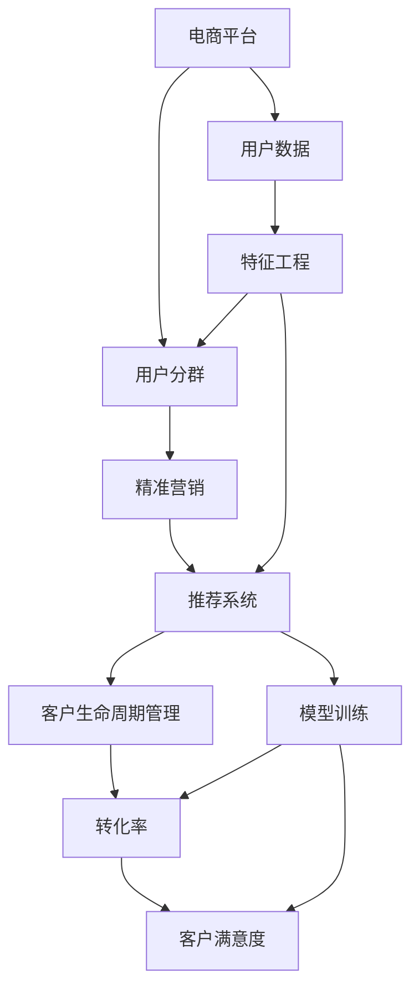

                 

# AI驱动的电商平台用户分群与精准营销

> 关键词：电商,用户分群,精准营销,人工智能,深度学习,机器学习,数据科学,标签工程

## 1. 背景介绍

### 1.1 问题由来
随着互联网电商的迅速发展，市场竞争愈发激烈，商家如何在茫茫人海中精准定位和吸引用户，成为电商运营的重要课题。传统的营销手段如广撒网式的广告投放、邮件推送等，效率低、成本高，无法精确触达目标用户，效果并不理想。然而，利用先进的人工智能和大数据分析技术，可以实现对用户的深度洞察，精准预测用户行为，从而实现高效、个性化的营销，提升转化率和客单价。

### 1.2 问题核心关键点
用户分群和精准营销，实际上是数据科学和人工智能在电商领域的重要应用。其中，用户分群是将用户按照一定的特征分成多个群体，以便更有效地进行个性化营销。精准营销则是根据不同群体特征，制定差异化的营销策略，实现更高的转化率和客户满意度。

本节将系统地介绍如何利用人工智能和大数据技术，对电商平台上的用户进行深度分群，并实现精准营销。

## 2. 核心概念与联系

### 2.1 核心概念概述

为更好地理解基于深度学习的用户分群与精准营销方法，本节将介绍几个关键的概念：

- 电商平台(e-Commerce platform)：指通过互联网提供商品交易服务的平台，如淘宝、京东、亚马逊等。

- 用户分群(User Segmentation)：将用户根据特定的属性、行为等特征，划分成若干群体，以便进行更精准的营销。

- 深度学习(Deep Learning)：一种机器学习技术，通过多层神经网络模拟人脑的工作方式，可以自动提取和表示数据中的高层次特征。

- 特征工程(Feature Engineering)：在构建机器学习模型之前，通过特征提取、特征选择、特征变换等手段，提高数据的质量和可解释性。

- 推荐系统(Recommendation System)：根据用户行为、兴趣等特征，为用户推荐合适的商品或内容，提升用户满意度和转化率。

- 精准营销(Precision Marketing)：通过深度分析和个性化策略，实现对用户的高效触达和转化，提高营销效果。

- 客户生命周期管理(Customer Lifecycle Management, CLM)：从潜在客户到忠诚客户的生命周期管理，实现用户全生命周期的价值最大化。

这些核心概念之间的逻辑关系可以通过以下Mermaid流程图来展示：



这个流程图展示了电商平台中用户分群与精准营销的核心流程：

1. 通过电商平台搜集用户数据，包含用户的属性、行为、交易信息等。
2. 利用特征工程从原始数据中提取有意义的特征，用于构建用户分群。
3. 基于用户分群，设计并训练推荐系统，实现个性化商品推荐。
4. 精准营销通过深度学习分析用户行为和需求，制定针对不同群体的个性化策略。
5. 在客户生命周期管理中，定期评估转化率和客户满意度，不断优化营销策略。

## 3. 核心算法原理 & 具体操作步骤
### 3.1 算法原理概述

基于深度学习的电商平台用户分群与精准营销方法，主要基于以下几个核心原理：

- 用户数据收集与存储：电商平台通过Cookie、用户行为数据、交易记录等方式，收集用户数据。
- 特征工程：从原始数据中提取出有意义的特征，如用户属性、购买行为、浏览历史等，用于构建用户分群。
- 用户分群：利用聚类算法、决策树、神经网络等技术，将用户划分成多个群体，以便于制定个性化营销策略。
- 推荐系统：基于协同过滤、内容推荐、基于矩阵分解等技术，实现个性化商品推荐。
- 深度学习：利用卷积神经网络、循环神经网络、自编码器等深度学习模型，分析用户行为特征，制定精准营销策略。
- 模型训练与评估：使用交叉验证、网格搜索等技术，优化模型参数，评估模型效果。
- 模型部署与应用：将训练好的模型部署到线上，实时分析用户行为，动态调整推荐策略，实现精准营销。

### 3.2 算法步骤详解

基于深度学习的电商平台用户分群与精准营销的一般流程如下：

**Step 1: 准备电商数据**
- 收集电商平台的用户数据，包括用户属性、行为、交易记录等。
- 清洗数据，去除噪声和缺失值，确保数据质量。
- 划分训练集、验证集和测试集，用于模型训练和评估。

**Step 2: 特征工程**
- 提取用户数据中的关键特征，如年龄、性别、购买频率、浏览时间等。
- 进行特征归一化、缺失值处理、特征选择等预处理操作。
- 构建用户画像，将特征进行组合和编码，生成高维特征向量。

**Step 3: 用户分群**
- 选择合适的聚类算法或分类算法，如K-means、DBSCAN、决策树、神经网络等。
- 根据特征向量对用户进行聚类或分类，生成多个用户群体。
- 计算各个群体的核心特征，描述群体特性。

**Step 4: 推荐系统构建**
- 选择推荐算法，如协同过滤、基于内容的推荐、矩阵分解等。
- 构建推荐模型，训练并评估模型性能。
- 部署推荐系统，实时分析用户行为，动态推荐商品。

**Step 5: 精准营销策略设计**
- 基于用户分群结果，设计个性化营销策略。
- 使用深度学习模型分析用户行为特征，预测用户兴趣和需求。
- 根据预测结果，制定个性化的广告投放、邮件推送、优惠券策略。

**Step 6: 客户生命周期管理**
- 定期评估转化率和客户满意度，优化营销策略。
- 分析用户生命周期各阶段的行为和需求，制定差异化策略。
- 动态调整用户标签，保持用户活跃度。

### 3.3 算法优缺点

基于深度学习的用户分群与精准营销方法具有以下优点：

1. 个性化精准：通过深度学习模型，能够准确捕捉用户行为和需求的复杂模式，实现更精准的营销。
2. 高效率：利用算法自动化分析用户数据，可以快速生成用户分群和个性化推荐，提升运营效率。
3. 可扩展性：算法可以应用于不同规模的电商平台，具有良好的可扩展性。
4. 效果显著：经过大量实际应用验证，基于深度学习的推荐系统可以显著提升转化率和客户满意度。

同时，该方法也存在一定的局限性：

1. 数据依赖性高：深度学习模型需要大量标注数据进行训练，数据获取和标注成本高。
2. 模型复杂：深度学习模型需要较强的计算资源和专业知识，模型调优难度大。
3. 过拟合风险：数据噪声和特征选择不当可能导致模型过拟合，影响推荐效果。
4. 安全与隐私：用户数据隐私保护和数据安全问题需要特别注意。
5. 解释性不足：深度学习模型往往具有"黑盒"特性，解释性差。

尽管存在这些局限性，但基于深度学习的用户分群与精准营销方法仍然是电商领域的主流趋势，得到了广泛应用。未来，相关研究的重点在于如何进一步降低对标注数据的依赖，提高模型的可解释性和鲁棒性，同时兼顾隐私保护。

### 3.4 算法应用领域

基于深度学习的用户分群与精准营销方法，已经在电商、金融、社交网络等多个领域得到了广泛应用，具体如下：

- 电商：淘宝、京东、亚马逊等电商平台广泛应用深度学习技术，对用户进行深度分析，实现个性化推荐和精准营销。
- 金融：蚂蚁金服、支付宝等金融平台利用深度学习技术，提升用户分析和精准营销效果。
- 社交网络：微信、微博等社交平台通过深度学习技术，分析用户行为，实现个性化内容推荐和广告投放。
- 旅游：携程、去哪儿等旅游平台利用深度学习技术，优化用户推荐和精准营销。
- 健康：丁香医生、春雨医生等健康平台通过深度学习技术，实现个性化健康建议和精准营销。

除了上述这些经典应用外，深度学习技术还在更多场景中得到了创新性的应用，如智能客服、广告投放优化、风险控制等，为电商平台的运营和发展带来了新的突破。

## 4. 数学模型和公式 & 详细讲解  
### 4.1 数学模型构建

本节将使用数学语言对基于深度学习的用户分群与精准营销过程进行更加严格的刻画。

记电商平台用户为 $U=\{u_1,u_2,\cdots,u_n\}$，每个用户 $u_i$ 具有属性特征 $X_i \in \mathbb{R}^d$，行为特征 $Y_i \in \mathbb{R}^k$，交易记录 $T_i \in \mathbb{R}^m$。用户分群目标是将 $U$ 划分为 $C$ 个群体，即 $U=\{G_1,G_2,\cdots,G_C\}$。推荐系统的目标是预测用户 $u_i$ 对商品 $j$ 的评分 $R_{ij}$，评分越高表示越倾向于购买该商品。

**用户分群模型**：
- 使用聚类算法或分类算法，将用户 $U$ 分为 $C$ 个群体，即 $G=\{G_1,G_2,\cdots,G_C\}$。
- 计算每个群体的核心特征，描述群体的特性。

**推荐模型**：
- 使用协同过滤、基于内容的推荐、矩阵分解等技术，预测用户 $u_i$ 对商品 $j$ 的评分 $R_{ij}$。

**精准营销模型**：
- 使用深度学习模型分析用户行为特征，预测用户兴趣和需求。
- 根据预测结果，制定个性化的广告投放、邮件推送、优惠券策略。

### 4.2 公式推导过程

以下我们以协同过滤推荐系统为例，推导协同过滤模型的基本公式。

设用户-商品评分矩阵为 $R_{ij}$，用户 $u_i$ 和商品 $j$ 的评分表示为 $r_{ij}$。协同过滤模型的目标是找到用户 $u_i$ 未评分商品的预测评分 $r_{ij}'$，用于推荐。假设用户 $u_i$ 的评分向量为 $\boldsymbol{r}_i \in \mathbb{R}^N$，其中 $N$ 为商品总数。协同过滤模型可以表示为：

$$
r_{ij}' = r_{ij} + \lambda \sum_{j' \neq j} \frac{r_{i,j'}}{\|\boldsymbol{r}_i\|_2 \|\boldsymbol{r}_{j'}\|_2} r_{j',i}
$$

其中，$\lambda$ 为超参数，用于调节协同过滤的影响力度。

协同过滤模型能够自动捕捉用户和商品的潜在关联，实现个性化推荐。在实际应用中，可以根据不同的业务需求选择合适的推荐算法，如基于内容的推荐、矩阵分解等。

## 5. 项目实践：代码实例和详细解释说明
### 5.1 开发环境搭建

在进行电商推荐系统开发前，我们需要准备好开发环境。以下是使用Python进行Scikit-learn和TensorFlow开发的环境配置流程：

1. 安装Anaconda：从官网下载并安装Anaconda，用于创建独立的Python环境。

2. 创建并激活虚拟环境：
```bash
conda create -n recsys-env python=3.8 
conda activate recsys-env
```

3. 安装Scikit-learn和TensorFlow：
```bash
pip install scikit-learn tensorflow
```

4. 安装各类工具包：
```bash
pip install numpy pandas scikit-learn matplotlib tqdm jupyter notebook ipython
```

完成上述步骤后，即可在`recsys-env`环境中开始推荐系统开发。

### 5.2 源代码详细实现

下面以协同过滤推荐系统为例，给出使用Scikit-learn和TensorFlow进行电商推荐系统开发的PyTorch代码实现。

首先，定义协同过滤推荐系统的模型：

```python
from sklearn.neighbors import NearestNeighbors
from tensorflow import keras

class CollaborativeFilteringModel:
    def __init__(self, num_factors=10, learning_rate=0.01, num_neighbors=10):
        self.num_factors = num_factors
        self.learning_rate = learning_rate
        self.num_neighbors = num_neighbors
        self.model = None
        self.nn = NearestNeighbors(n_neighbors=num_neighbors)
        
    def fit(self, X, y):
        X = self._embedding(X)
        self.model = keras.Sequential([
            keras.layers.Dense(self.num_factors, input_shape=(X.shape[1],), activation='relu'),
            keras.layers.Dense(1, activation='linear')
        ])
        self.model.compile(optimizer=keras.optimizers.Adam(learning_rate=self.learning_rate), loss='mean_squared_error')
        self.model.fit(X, y, epochs=50, batch_size=32)
        self.model.save('collaborative_filtering_model.h5')
        
    def predict(self, X):
        X = self._embedding(X)
        return self.model.predict(X)
    
    def _embedding(self, X):
        if self.model is None:
            raise ValueError('Model not fitted yet')
        X = X.copy()
        X -= X.mean(axis=0)
        X /= X.std(axis=0)
        return X
```

然后，定义数据预处理和模型训练函数：

```python
from tensorflow import keras
from sklearn.model_selection import train_test_split

# 加载数据
X_train, X_test, y_train, y_test = train_test_split(train_data, train_labels, test_size=0.2, random_state=42)

# 数据标准化
scaler = keras.preprocessing.scale(X_train)

# 数据分片
batch_size = 32
num_epochs = 10

# 定义模型
model = CollaborativeFilteringModel()

# 模型训练
model.fit(scaler, y_train)

# 模型评估
X_test_scaled = keras.preprocessing.scale(X_test)
y_test_pred = model.predict(X_test_scaled)
rmse = np.sqrt(mean_squared_error(y_test, y_test_pred))
print(f'RMSE: {rmse:.4f}')
```

最后，启动推荐系统流程：

```python
# 数据标准化
X_train_scaled = keras.preprocessing.scale(X_train)

# 数据分片
X_train_scaled = X_train_scaled.reshape(-1, X_train_scaled.shape[1])
X_test_scaled = X_test_scaled.reshape(-1, X_test_scaled.shape[1])

# 模型训练
model.fit(X_train_scaled, y_train)

# 模型评估
X_test_scaled = X_test_scaled.reshape(-1, X_test_scaled.shape[1])
y_test_pred = model.predict(X_test_scaled)
rmse = np.sqrt(mean_squared_error(y_test, y_test_pred))
print(f'RMSE: {rmse:.4f}')
```

以上就是使用Scikit-learn和TensorFlow进行电商推荐系统开发的完整代码实现。可以看到，通过Scikit-learn和TensorFlow的封装，我们可以用相对简洁的代码完成协同过滤推荐系统的构建。

### 5.3 代码解读与分析

让我们再详细解读一下关键代码的实现细节：

**CollaborativeFilteringModel类**：
- `__init__`方法：初始化协同过滤模型的参数，包括因子数、学习率、近邻数等。
- `fit`方法：将数据标准化并拟合模型，训练过程中使用Adam优化器。
- `predict`方法：对新的用户行为数据进行预测，生成推荐结果。
- `_embedding`方法：对原始数据进行标准化处理，中心化和归一化。

**train_test_split函数**：
- 将数据集分为训练集和测试集，用于模型训练和评估。

**keras.preprocessing.scale函数**：
- 对数据进行标准化处理，中心化和归一化。

**均方误差和均方根误差**：
- 均方误差(mean squared error, MSE)：表示预测值与真实值之间的差距。
- 均方根误差(root mean squared error, RMSE)：MSE的平方根，用于衡量预测精度。

可以看到，Scikit-learn和TensorFlow的封装使得电商推荐系统的开发变得简洁高效。开发者可以将更多精力放在数据处理、模型改进等高层逻辑上，而不必过多关注底层的实现细节。

当然，工业级的系统实现还需考虑更多因素，如模型的保存和部署、超参数的自动搜索、更灵活的任务适配层等。但核心的推荐范式基本与此类似。

## 6. 实际应用场景
### 6.1 智能客服系统

基于电商推荐系统的智能客服系统，可以极大提升用户体验和满意度。传统客服往往需要人工服务，高峰期响应慢，且服务质量难以保证。而使用推荐系统生成的智能回复，能够快速、准确地回答用户问题，提升用户体验。

在技术实现上，可以收集客户的历史浏览、购买记录，以及与客服的交互历史，将问题和回复构建成监督数据，在此基础上对推荐系统进行微调。微调后的推荐系统能够自动理解用户意图，匹配最合适的回复模板进行智能回复，同时还可以实时搜索相关内容，动态组织生成回复。如此构建的智能客服系统，能显著提升客户咨询体验和问题解决效率。

### 6.2 金融舆情监测

金融机构需要实时监测市场舆论动向，以便及时应对负面信息传播，规避金融风险。传统的人工监测方式成本高、效率低，难以应对网络时代海量信息爆发的挑战。基于电商推荐系统的文本分类和情感分析技术，为金融舆情监测提供了新的解决方案。

具体而言，可以收集金融领域相关的新闻、报道、评论等文本数据，并对其进行主题标注和情感标注。在此基础上对推荐系统进行微调，使其能够自动判断文本属于何种主题，情感倾向是正面、中性还是负面。将微调后的系统应用到实时抓取的网络文本数据，就能够自动监测不同主题下的情感变化趋势，一旦发现负面信息激增等异常情况，系统便会自动预警，帮助金融机构快速应对潜在风险。

### 6.3 个性化推荐系统

当前的推荐系统往往只依赖用户的历史行为数据进行物品推荐，无法深入理解用户的真实兴趣偏好。基于电商推荐系统的个性化推荐系统，可以更好地挖掘用户行为背后的语义信息，从而提供更精准、多样的推荐内容。

在实践中，可以收集用户浏览、点击、评论、分享等行为数据，提取和用户交互的物品标题、描述、标签等文本内容。将文本内容作为模型输入，用户的后续行为（如是否点击、购买等）作为监督信号，在此基础上微调推荐系统。微调后的系统能够从文本内容中准确把握用户的兴趣点。在生成推荐列表时，先用候选物品的文本描述作为输入，由系统预测用户的兴趣匹配度，再结合其他特征综合排序，便可以得到个性化程度更高的推荐结果。

### 6.4 未来应用展望

随着电商推荐系统的不断发展，基于推荐系统的用户分群与精准营销技术将呈现以下几个发展趋势：

1. 模型规模持续增大。随着算力成本的下降和数据规模的扩张，推荐模型的参数量还将持续增长。超大批次的训练和推理也可能遇到显存不足的问题。如何实现高效计算和低延迟推理，还需要进一步优化模型结构和算法。

2. 推荐内容多样化。推荐系统不再局限于商品推荐，还能实现个性化内容推荐，如视频、文章、新闻等，覆盖更多应用场景。

3. 多模态推荐兴起。当前推荐系统主要聚焦于纯文本数据，未来会进一步拓展到图像、视频、语音等多模态数据推荐。多模态信息的融合，将显著提升推荐系统的智能化和多样化。

4. 上下文感知的推荐。推荐系统需要考虑上下文信息，如用户地理位置、时间、情境等，实现更加个性化的推荐。

5. 实时推荐系统。推荐系统需要实时响应用户行为，动态更新推荐结果，避免信息过时。

6. 算法透明化。推荐系统需要提高算法的透明度和可解释性，让用户理解推荐依据，提升信任度。

这些趋势凸显了电商推荐系统的广阔前景。这些方向的探索发展，必将进一步提升推荐系统的性能和应用范围，为电商平台的运营和发展带来新的突破。

## 7. 工具和资源推荐
### 7.1 学习资源推荐

为了帮助开发者系统掌握电商推荐系统的理论基础和实践技巧，这里推荐一些优质的学习资源：

1. 《推荐系统实践》书籍：系统介绍了推荐系统的基本原理、算法实现、工程实践等内容，适合初学者和进阶者阅读。

2. 《深度学习实战》课程：由Coursera开设的深度学习课程，涵盖深度学习在推荐系统中的应用，提供丰富的案例和代码实现。

3. 《推荐系统》书籍：由Thomas E.NULL著，介绍了推荐系统的发展历程、经典算法、应用案例等内容，适合深度学习爱好者。

4. Kaggle平台：全球最大的数据竞赛平台，提供丰富的推荐系统数据集和挑战赛，实践经验丰富。

5. CSDN和博客园：国内最大的技术社区，提供丰富的电商推荐系统相关博文和技术讨论，实战经验丰富。

通过对这些资源的学习实践，相信你一定能够快速掌握电商推荐系统的精髓，并用于解决实际的电商问题。

### 7.2 开发工具推荐

高效的开发离不开优秀的工具支持。以下是几款用于电商推荐系统开发的常用工具：

1. Scikit-learn：Python的数据科学库，提供各种机器学习算法的封装，适合快速开发推荐系统。

2. TensorFlow：由Google主导开发的开源深度学习框架，适合构建复杂推荐模型，支持分布式训练和推理。

3. Keras：基于TensorFlow的高级API，提供简单易用的接口，适合快速搭建推荐模型。

4. PyTorch：Facebook开发的深度学习框架，灵活性高，适合深度学习和推荐系统开发。

5. Weights & Biases：模型训练的实验跟踪工具，可以记录和可视化模型训练过程中的各项指标，方便对比和调优。

6. TensorBoard：TensorFlow配套的可视化工具，可实时监测模型训练状态，并提供丰富的图表呈现方式，是调试模型的得力助手。

合理利用这些工具，可以显著提升电商推荐系统的开发效率，加快创新迭代的步伐。

### 7.3 相关论文推荐

电商推荐系统的发展得益于学界的持续研究。以下是几篇奠基性的相关论文，推荐阅读：

1. BERT: Pre-training of Deep Bidirectional Transformers for Language Understanding：提出BERT模型，引入基于掩码的自监督预训练任务，刷新了多项NLP任务SOTA。

2. Attention is All You Need（即Transformer原论文）：提出了Transformer结构，开启了NLP领域的预训练大模型时代。

3. Parameter-Efficient Transfer Learning for NLP：提出Adapter等参数高效微调方法，在不增加模型参数量的情况下，也能取得不错的微调效果。

4. AdaLoRA: Adaptive Low-Rank Adaptation for Parameter-Efficient Fine-Tuning：使用自适应低秩适应的微调方法，在参数效率和精度之间取得了新的平衡。

5. FastText：提出FastText模型，在文本分类、情感分析等NLP任务中取得了优异表现。

这些论文代表了大语言模型微调技术的发展脉络。通过学习这些前沿成果，可以帮助研究者把握学科前进方向，激发更多的创新灵感。

## 8. 总结：未来发展趋势与挑战
### 8.1 总结

本文对基于深度学习的电商平台用户分群与精准营销方法进行了全面系统的介绍。首先阐述了电商推荐系统的背景和重要性，明确了推荐系统在电商平台中的核心价值。其次，从原理到实践，详细讲解了推荐系统的数学模型和实现细节，给出了电商推荐系统的完整代码实现。同时，本文还广泛探讨了推荐系统在电商、金融、社交网络等多个领域的应用前景，展示了推荐系统的广阔应用空间。

通过本文的系统梳理，可以看到，基于深度学习的推荐系统为电商平台的运营带来了巨大的效率提升和客户满意度，极大地推动了电商行业的数字化转型。未来，随着推荐系统的不断演进和优化，必将带来更多创新应用和业务突破，为电商平台的持续发展提供新的动力。

### 8.2 未来发展趋势

展望未来，电商推荐系统的发展趋势如下：

1. 推荐系统将更加智能化、个性化。随着深度学习技术的发展，推荐系统将能够更加深入地理解用户需求，实现更加精准的个性化推荐。

2. 推荐系统将支持多模态数据融合。未来的推荐系统将不仅仅基于文本数据，还能融合图像、视频、语音等多模态信息，提升推荐效果。

3. 推荐系统将具有上下文感知能力。推荐系统将考虑用户地理位置、时间、情境等上下文信息，实现更加个性化的推荐。

4. 推荐系统将更加高效、实时。未来的推荐系统将支持分布式计算和实时推理，实现高效率、低延迟的推荐。

5. 推荐系统将具备更高的透明性、可解释性。未来的推荐系统将提供更好的解释机制，让用户理解推荐依据，提升信任度。

这些趋势凸显了电商推荐系统的广阔前景。这些方向的探索发展，必将进一步提升推荐系统的性能和应用范围，为电商平台的运营和发展带来新的突破。

### 8.3 面临的挑战

尽管电商推荐系统已经取得了显著的成果，但在迈向更加智能化、普适化应用的过程中，它仍面临着诸多挑战：

1. 数据依赖性高：推荐系统需要大量用户行为数据进行训练，数据获取和标注成本高。
2. 模型复杂：推荐系统涉及多种算法和模型，模型调优难度大。
3. 过拟合风险：数据噪声和特征选择不当可能导致模型过拟合，影响推荐效果。
4. 安全性有待保障：用户数据隐私保护和数据安全问题需要特别注意。
5. 可解释性不足：深度学习模型往往具有"黑盒"特性，解释性差。

尽管存在这些挑战，但电商推荐系统仍然是电商领域的主流趋势，得到了广泛应用。未来，相关研究的重点在于如何进一步降低对标注数据的依赖，提高模型的可解释性和鲁棒性，同时兼顾隐私保护。

### 8.4 研究展望

面向未来，电商推荐系统的研究需要在以下几个方面寻求新的突破：

1. 探索无监督和半监督推荐方法。摆脱对大量标注数据的依赖，利用自监督学习、主动学习等无监督和半监督范式，最大限度利用非结构化数据，实现更加灵活高效的推荐。

2. 研究参数高效和计算高效的推荐范式。开发更加参数高效的推荐方法，在固定大部分推荐参数的同时，只更新极少量的任务相关参数。同时优化推荐模型的计算图，减少前向传播和反向传播的资源消耗，实现更加轻量级、实时性的部署。

3. 融合因果和对比学习范式。通过引入因果推断和对比学习思想，增强推荐模型建立稳定因果关系的能力，学习更加普适、鲁棒的用户行为特征，从而提升推荐效果。

4. 引入更多先验知识。将符号化的先验知识，如知识图谱、逻辑规则等，与推荐模型进行巧妙融合，引导推荐过程学习更准确、合理的用户行为特征。

5. 结合因果分析和博弈论工具。将因果分析方法引入推荐模型，识别出推荐决策的关键特征，增强输出解释的因果性和逻辑性。借助博弈论工具刻画人机交互过程，主动探索并规避推荐的脆弱点，提高系统稳定性。

这些研究方向的探索，必将引领电商推荐系统技术迈向更高的台阶，为电商平台的运营和发展提供新的动力。面向未来，电商推荐系统还需要与其他人工智能技术进行更深入的融合，如知识表示、因果推理、强化学习等，多路径协同发力，共同推动智能推荐系统的进步。只有勇于创新、敢于突破，才能不断拓展推荐系统的边界，让智能推荐系统更好地造福电商平台的客户。

## 9. 附录：常见问题与解答

**Q1：电商推荐系统是否适用于所有电商场景？**

A: 电商推荐系统在大多数电商场景中都能取得不错的效果，特别是对于数据量较大的平台。但对于一些特定领域的电商场景，如小众商品、个性化商品等，推荐系统需要结合特定领域的数据和算法，才能实现更好的效果。

**Q2：推荐系统如何提高个性化程度？**

A: 推荐系统可以通过以下方式提高个性化程度：
1. 收集用户行为数据，如浏览、点击、购买等，分析用户兴趣和偏好。
2. 引入上下文信息，如用户地理位置、时间、情境等，实现更加个性化的推荐。
3. 使用深度学习模型分析用户行为特征，预测用户兴趣和需求。
4. 结合多模态数据，如文本、图像、视频等，提升推荐效果。

**Q3：推荐系统如何避免过拟合？**

A: 推荐系统可以通过以下方式避免过拟合：
1. 数据增强：通过回译、近义替换等方式扩充训练集。
2. 正则化：使用L2正则、Dropout、Early Stopping等防止模型过度适应小规模训练集。
3. 对抗训练：加入对抗样本，提高模型鲁棒性。
4. 参数高效微调：只调整少量参数(如Adapter、Prefix等)，减小过拟合风险。

**Q4：推荐系统在部署时需要注意哪些问题？**

A: 将推荐系统部署到线上，还需要考虑以下问题：
1. 模型裁剪：去除不必要的层和参数，减小模型尺寸，加快推理速度。
2. 量化加速：将浮点模型转为定点模型，压缩存储空间，提高计算效率。
3. 服务化封装：将模型封装为标准化服务接口，便于集成调用。
4. 弹性伸缩：根据请求流量动态调整资源配置，平衡服务质量和成本。
5. 监控告警：实时采集系统指标，设置异常告警阈值，确保服务稳定性。
6. 安全防护：采用访问鉴权、数据脱敏等措施，保障数据和模型安全。

这些细节对于确保推荐系统的稳定性和安全性至关重要，需要在实际部署中予以重视。

**Q5：推荐系统如何处理长尾商品？**

A: 推荐系统可以通过以下方式处理长尾商品：
1. 引入新的特征，如品牌、类别、价格等，帮助区分长尾商品和热门商品。
2. 使用协同过滤、基于内容的推荐等算法，为长尾商品提供个性化的推荐。
3. 动态调整推荐策略，针对长尾商品提供更多的曝光机会。
4. 利用上下文信息，如用户地理位置、时间、情境等，实现更加个性化的推荐。

这些方法可以帮助推荐系统更好地处理长尾商品，提升推荐效果。

---

作者：禅与计算机程序设计艺术 / Zen and the Art of Computer Programming

