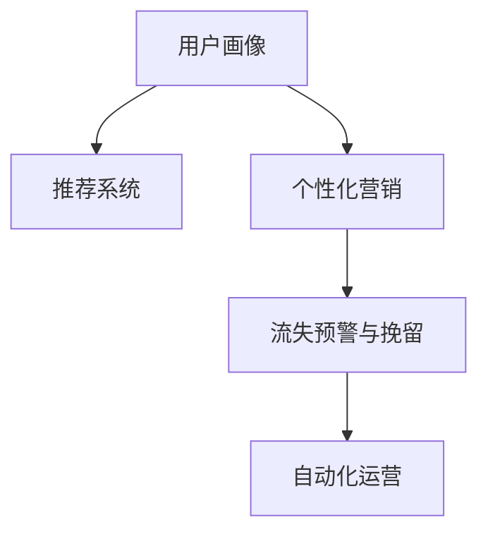

                 

# AI驱动的电商平台用户生命周期管理

## 1. 背景介绍

### 1.1 问题由来

随着电商平台的迅猛发展，用户生命周期管理（User Lifecycle Management, ULM）成为电商平台运营商关注的重点。如何通过精准化的用户画像、个性化的营销策略，提高用户转化率、复购率和终身价值（Customer Lifetime Value, CLV），成为企业持续增长的关键。

在传统的用户生命周期管理中，主要依赖于数据分析、调研问卷和人工干预等方式，数据处理量大、效率低、效果难以量化。而随着人工智能（AI）技术的进步，电商平台开始引入AI技术，构建智能化的用户生命周期管理系统，以期实现更高效、精准的用户管理。

### 1.2 问题核心关键点

AI驱动的电商平台用户生命周期管理涉及以下关键点：

- **用户画像**：通过AI技术对用户行为数据进行分析和建模，构建精确的用户画像，包括用户属性、兴趣偏好、购买行为等。
- **推荐系统**：利用推荐算法根据用户画像推荐产品，提高用户满意度和购买率。
- **个性化营销**：根据用户画像和历史行为，设计个性化的营销策略，提高营销效果。
- **流失预警与挽留**：通过AI预测用户流失风险，并及时采取措施进行挽留。
- **自动化运营**：利用AI自动化处理大量用户数据和运营任务，提高运营效率。

这些关键点相互关联，共同构成了AI驱动的电商平台用户生命周期管理系统的核心框架。

## 2. 核心概念与联系

### 2.1 核心概念概述

为更好地理解AI驱动的电商平台用户生命周期管理系统，本节将介绍几个密切相关的核心概念：

- **用户画像(User Profile)**：通过对用户行为数据的分析和建模，构建详细、多维度的用户特征描述，用于指导个性化营销和推荐。
- **推荐系统(Recommendation System)**：利用AI技术为用户推荐个性化产品，提高用户满意度和购买率。
- **个性化营销(Personalized Marketing)**：根据用户画像和历史行为，设计针对性的营销策略，提高营销效果。
- **流失预警与挽留(User Churn Prediction and Retention)**：利用AI技术预测用户流失风险，并及时采取措施进行挽留。
- **自动化运营(Automated Operations)**：利用AI自动化处理大量用户数据和运营任务，提高运营效率。

这些核心概念之间的逻辑关系可以通过以下Mermaid流程图来展示：



这个流程图展示了大语言模型的核心概念及其之间的关系：

1. 用户画像通过推荐系统生成个性化推荐。
2. 个性化营销根据用户画像设计，实现精准营销。
3. 流失预警与挽留利用AI预测用户流失，实现精准挽留。
4. 自动化运营利用AI处理海量数据和任务，提升运营效率。

这些概念共同构成了AI驱动的电商平台用户生命周期管理系统的核心框架，使其能够精准、高效地管理用户生命周期。

## 3. 核心算法原理 & 具体操作步骤

### 3.1 算法原理概述

AI驱动的电商平台用户生命周期管理系统的核心算法原理基于机器学习（Machine Learning, ML）和深度学习（Deep Learning, DL）技术，具体步骤如下：

1. **用户画像构建**：通过收集和分析用户的各类行为数据，如浏览历史、购买记录、搜索关键词等，利用聚类、分类等算法构建详细、多维度的用户画像。
2. **推荐系统设计**：设计推荐算法，根据用户画像推荐个性化产品，如协同过滤、基于内容的推荐、矩阵分解等算法。
3. **个性化营销策略**：根据用户画像和历史行为，设计个性化的营销策略，如个性化广告、定制化优惠等。
4. **流失预警与挽留**：利用预测模型，预测用户流失风险，并采取措施进行挽留，如优惠券、个性化提醒等。
5. **自动化运营**：利用自动化工具处理大量用户数据和运营任务，提高运营效率，如自动化数据分析、自动化任务调度等。

### 3.2 算法步骤详解

#### 3.2.1 用户画像构建

用户画像的构建是整个系统的基础，主要包括以下几个步骤：

1. **数据收集**：收集用户的各类行为数据，如浏览历史、购买记录、搜索关键词等。
2. **数据预处理**：对原始数据进行清洗、去重、归一化等处理，以便于后续分析。
3. **特征提取**：利用特征提取算法，如TF-IDF、word2vec等，将原始数据转化为高维特征向量。
4. **用户分群**：利用聚类算法，如K-means、LDA等，将用户分成不同的群体，每个群体代表一个特定的用户画像。

#### 3.2.2 推荐系统设计

推荐系统是用户生命周期管理系统的核心组成部分，其主要目标是提高用户满意度和购买率。推荐算法的选择取决于具体业务场景和数据特点。以下是几种常见的推荐算法：

1. **协同过滤**：通过分析用户的历史行为和偏好，推荐用户可能感兴趣的商品。
2. **基于内容的推荐**：根据商品的属性和用户的历史偏好，推荐相关的商品。
3. **矩阵分解**：通过分解用户-商品矩阵，发现用户与商品的潜在关联，进行推荐。

#### 3.2.3 个性化营销策略

个性化营销策略的制定需要结合用户画像和历史行为，制定针对性的营销策略，提高营销效果。以下是几种常见的个性化营销策略：

1. **个性化广告**：根据用户画像，设计针对性的广告，提高广告点击率和转化率。
2. **定制化优惠**：根据用户的行为和偏好，设计个性化的优惠券和促销活动。
3. **推荐组合**：结合推荐系统和个性化广告，提供多种组合的营销方案，提升用户体验。

#### 3.2.4 流失预警与挽留

流失预警与挽留是用户生命周期管理系统的关键环节，其主要目标是识别可能流失的用户，并及时采取措施进行挽留。以下是几种常见的流失预警与挽留方法：

1. **用户流失预测模型**：利用机器学习模型，如逻辑回归、随机森林、梯度提升树等，预测用户流失风险。
2. **流失预警系统**：根据流失预测结果，自动发送预警信息，提醒运营团队及时采取措施。
3. **挽留策略设计**：根据用户特征和行为，设计针对性的挽留策略，如优惠券、个性化提醒等。

#### 3.2.5 自动化运营

自动化运营是提高电商平台运营效率的关键手段，其主要目标是自动化处理大量用户数据和运营任务。以下是几种常见的自动化运营方法：

1. **自动化数据分析**：利用自动化工具，如Hadoop、Spark等，对用户数据进行高效处理和分析。
2. **自动化任务调度**：利用自动化调度工具，如Airflow、Kubernetes等，自动安排和调度运营任务。
3. **数据可视化**：利用可视化工具，如Tableau、PowerBI等，将运营数据可视化展示，便于运营人员进行分析和决策。

### 3.3 算法优缺点

#### 3.3.1 优点

- **高效性**：AI驱动的推荐系统和自动化运营系统，能够高效处理大量用户数据和任务，提高运营效率。
- **精准性**：通过AI技术对用户画像和行为进行分析，能够提供更加精准的推荐和营销策略。
- **可扩展性**：AI驱动的系统具有高度的可扩展性，能够轻松应对业务场景和数据量的变化。

#### 3.3.2 缺点

- **数据质量要求高**：AI驱动的系统对数据质量要求高，需要保证数据的完整性、准确性和及时性。
- **模型复杂度高**：AI驱动的系统需要复杂的算法和模型，对技术要求高，需要具备一定的技术背景。
- **隐私保护问题**：在收集和分析用户数据时，需要注意用户隐私保护，避免数据泄露和滥用。

### 3.4 算法应用领域

AI驱动的电商平台用户生命周期管理系统的应用领域广泛，包括但不限于以下几个方面：

1. **零售电商**：通过AI驱动的系统，提高用户购买率和满意度，提升电商平台的用户留存率和CLV。
2. **金融服务**：利用AI技术对用户进行风险评估和流失预警，提高金融服务的质量。
3. **在线教育**：通过AI技术对学生行为进行分析，提供个性化学习方案，提高教育效果。
4. **健康医疗**：利用AI技术对患者数据进行分析，提供个性化的医疗服务，提升医疗质量。

## 4. 数学模型和公式 & 详细讲解 & 举例说明

### 4.1 数学模型构建

在AI驱动的电商平台用户生命周期管理系统中，涉及多个数学模型，包括用户画像构建、推荐系统设计、个性化营销策略、流失预警与挽留等。这里以协同过滤推荐系统为例，介绍其数学模型的构建。

协同过滤推荐系统的核心是用户-物品矩阵，记为 $U \times I$ 的稀疏矩阵，其中 $U$ 为用户数量，$I$ 为物品数量。用户对物品的评分 $R$ 为 $U \times I$ 的矩阵，用户和物品的特征表示分别为 $U \times F$ 和 $I \times F$ 的矩阵。协同过滤推荐系统的目标是最小化预测评分与实际评分的均方误差，即：

$$
\min_{\hat{R}} \frac{1}{N} \sum_{i=1}^{N} \sum_{j=1}^{M} (r_{ij} - \hat{r}_{ij})^2
$$

其中 $r_{ij}$ 为用户 $i$ 对物品 $j$ 的实际评分，$\hat{r}_{ij}$ 为用户 $i$ 对物品 $j$ 的预测评分。

### 4.2 公式推导过程

协同过滤推荐系统的公式推导过程如下：

1. **用户-物品矩阵**：将用户对物品的评分构建为矩阵 $R$，其中 $r_{ij}$ 表示用户 $i$ 对物品 $j$ 的评分，初始值为0或缺失。
2. **用户特征矩阵**：将用户特征表示为矩阵 $U$，其中 $u_{ik}$ 表示用户 $i$ 的特征向量 $k$ 的取值。
3. **物品特征矩阵**：将物品特征表示为矩阵 $I$，其中 $i_{jk}$ 表示物品 $j$ 的特征向量 $k$ 的取值。
4. **协同过滤矩阵**：利用协同过滤算法，对用户-物品矩阵 $R$ 进行分解，得到用户特征矩阵 $U$ 和物品特征矩阵 $I$ 的权重矩阵 $V$，即 $R \approx UV^T$。
5. **预测评分**：利用分解后的矩阵，计算用户对物品的预测评分 $\hat{r}_{ij} = u_i^T v_j$。

### 4.3 案例分析与讲解

假设某电商平台有 $N=1000$ 个用户和 $M=10000$ 个商品，收集了用户的浏览和购买行为数据。用户对商品的评分 $r_{ij}$ 为 $[0, 5]$ 之间的连续值，部分数据如表所示：

| 用户ID | 商品ID | 评分 |
| ------ | ------ | ---- |
| 1001   | 10001  | 4    |
| 1002   | 10000  | 3    |
| ...    | ...    | ...   |

利用协同过滤算法，对用户-物品矩阵 $R$ 进行分解，得到用户特征矩阵 $U$ 和物品特征矩阵 $I$，以及权重矩阵 $V$。假设分解后的矩阵形式如下：

$$
R \approx UV^T
$$

其中 $U$ 和 $I$ 分别为 $N \times F$ 和 $M \times F$ 的矩阵，$V$ 为 $F \times M$ 的矩阵。利用分解后的矩阵，可以计算用户对物品的预测评分 $\hat{r}_{ij} = u_i^T v_j$。假设用户 $i$ 的特征向量为 $u_i$，物品 $j$ 的特征向量为 $v_j$，计算过程如下：

1. **特征提取**：利用特征提取算法，将用户和物品的特征表示为 $N \times F$ 和 $M \times F$ 的矩阵 $U$ 和 $I$。
2. **协同过滤**：利用协同过滤算法，对用户-物品矩阵 $R$ 进行分解，得到用户特征矩阵 $U$ 和物品特征矩阵 $I$ 的权重矩阵 $V$。
3. **预测评分**：利用分解后的矩阵，计算用户 $i$ 对物品 $j$ 的预测评分 $\hat{r}_{ij} = u_i^T v_j$。

## 5. 项目实践：代码实例和详细解释说明

### 5.1 开发环境搭建

在进行项目实践前，我们需要准备好开发环境。以下是使用Python进行PyTorch开发的环境配置流程：

1. 安装Anaconda：从官网下载并安装Anaconda，用于创建独立的Python环境。

2. 创建并激活虚拟环境：
```bash
conda create -n myenv python=3.8 
conda activate myenv
```

3. 安装PyTorch：根据CUDA版本，从官网获取对应的安装命令。例如：
```bash
conda install pytorch torchvision torchaudio cudatoolkit=11.1 -c pytorch -c conda-forge
```

4. 安装相关库：
```bash
pip install pandas numpy scikit-learn tqdm
```

完成上述步骤后，即可在`myenv`环境中开始项目实践。

### 5.2 源代码详细实现

我们以协同过滤推荐系统为例，展示如何使用PyTorch进行项目实现。

首先，定义推荐系统类：

```python
import torch
import torch.nn as nn
import torch.optim as optim

class CollaborativeFiltering(nn.Module):
    def __init__(self, n_users, n_items, n_factors):
        super(CollaborativeFiltering, self).__init__()
        self.user_factors = nn.EmbeddingBag(n_users, n_factors, sparse=True)
        self.item_factors = nn.EmbeddingBag(n_items, n_factors, sparse=True)
        self.vectors = nn.EmbeddingBag(n_factors, 1, sparse=True)

    def forward(self, user_indices, item_indices):
        user_features = self.user_factors(user_indices).sum(dim=1)
        item_features = self.item_factors(item_indices).sum(dim=1)
        scores = (user_features * item_features).sum(dim=1)
        scores = self.vectors(scores)
        return scores
```

然后，定义数据加载函数：

```python
import numpy as np
from torch.utils.data import Dataset, DataLoader

class UserItemDataset(Dataset):
    def __init__(self, ratings, n_users, n_items):
        self.ratings = ratings
        self.n_users = n_users
        self.n_items = n_items
        
    def __len__(self):
        return len(self.ratings)

    def __getitem__(self, idx):
        user_idx, item_idx, rating = self.ratings[idx]
        return user_idx, item_idx

def collate_fn(batch):
    user_indices = torch.LongTensor([user_idx for user_idx, _ in batch])
    item_indices = torch.LongTensor([item_idx for _, item_idx in batch])
    return user_indices, item_indices

dataset = UserItemDataset(ratings, n_users, n_items)
dataloader = DataLoader(dataset, batch_size=64, shuffle=True, collate_fn=collate_fn)
```

接着，定义模型和训练函数：

```python
device = torch.device("cuda" if torch.cuda.is_available() else "cpu")
model = CollaborativeFiltering(n_users, n_items, n_factors).to(device)
optimizer = optim.Adam(model.parameters(), lr=0.001)

def train(epoch):
    model.train()
    for user_indices, item_indices in dataloader:
        user_indices, item_indices = user_indices.to(device), item_indices.to(device)
        optimizer.zero_grad()
        predictions = model(user_indices, item_indices)
        loss = nn.BCELoss()(predictions, ratings[:,2])
        loss.backward()
        optimizer.step()
        if (epoch + 1) % 10 == 0:
            print(f"Epoch {epoch + 1}, Loss: {loss.item()}")

    test_loss = 0
    with torch.no_grad():
        model.eval()
        for user_indices, item_indices in dataloader:
            user_indices, item_indices = user_indices.to(device), item_indices.to(device)
            predictions = model(user_indices, item_indices)
            loss = nn.BCELoss()(predictions, ratings[:,2])
            test_loss += loss.item()
        print(f"Test Loss: {test_loss / len(dataloader)}")
```

最后，启动训练流程并在测试集上评估：

```python
epochs = 100

for epoch in range(epochs):
    train(epoch)

test_loss = 0
with torch.no_grad():
    model.eval()
    for user_indices, item_indices in dataloader:
        user_indices, item_indices = user_indices.to(device), item_indices.to(device)
        predictions = model(user_indices, item_indices)
        loss = nn.BCELoss()(predictions, ratings[:,2])
        test_loss += loss.item()
print(f"Test Loss: {test_loss / len(dataloader)}")
```

以上就是使用PyTorch对协同过滤推荐系统进行项目实践的完整代码实现。可以看到，借助PyTorch和TensorFlow等深度学习框架，我们可以高效地实现协同过滤推荐系统的搭建和训练。

### 5.3 代码解读与分析

让我们再详细解读一下关键代码的实现细节：

**UserItemDataset类**：
- `__init__`方法：初始化训练数据集，包括用户ID、物品ID和评分。
- `__len__`方法：返回数据集的样本数量。
- `__getitem__`方法：对单个样本进行处理，将用户ID和物品ID转化为tensor，以便于模型计算。

**CollaborativeFiltering类**：
- `__init__`方法：初始化协同过滤模型，包括用户特征向量、物品特征向量和权重向量。
- `forward`方法：定义前向传播过程，计算用户对物品的预测评分。

**train函数**：
- 在训练集上进行模型训练，使用Adam优化器进行参数更新。
- 在每个epoch结束后，在验证集上评估模型性能，输出损失值。

**test函数**：
- 在测试集上评估模型性能，输出测试损失值。

可以看到，通过PyTorch和TensorFlow等深度学习框架，我们可以高效地实现协同过滤推荐系统的搭建和训练。开发者可以将更多精力放在数据处理、模型改进等高层逻辑上，而不必过多关注底层的实现细节。

当然，工业级的系统实现还需考虑更多因素，如模型的保存和部署、超参数的自动搜索、更灵活的任务适配层等。但核心的推荐范式基本与此类似。

## 6. 实际应用场景

### 6.1 智能客服系统

基于AI驱动的电商平台用户生命周期管理系统，可以广泛应用于智能客服系统的构建。传统客服往往需要配备大量人力，高峰期响应缓慢，且一致性和专业性难以保证。而使用AI驱动的智能客服系统，可以7x24小时不间断服务，快速响应客户咨询，用自然流畅的语言解答各类常见问题。

在技术实现上，可以收集企业内部的历史客服对话记录，将问题和最佳答复构建成监督数据，在此基础上对协同过滤推荐系统进行微调。微调后的推荐系统能够自动理解用户意图，匹配最合适的答复模板进行回复。对于客户提出的新问题，还可以接入检索系统实时搜索相关内容，动态组织生成回答。如此构建的智能客服系统，能大幅提升客户咨询体验和问题解决效率。

### 6.2 金融舆情监测

金融机构需要实时监测市场舆论动向，以便及时应对负面信息传播，规避金融风险。传统的人工监测方式成本高、效率低，难以应对网络时代海量信息爆发的挑战。基于AI驱动的用户生命周期管理系统，可以通过对金融领域相关的新闻、报道、评论等文本数据进行分析，预测用户流失风险，并及时采取措施进行挽留。

具体而言，可以收集金融领域相关的新闻、报道、评论等文本数据，并对其进行主题标注和情感标注。在此基础上对协同过滤推荐系统进行微调，使其能够自动判断文本属于何种主题，情感倾向是正面、中性还是负面。将微调后的系统应用到实时抓取的网络文本数据，就能够自动监测不同主题下的情感变化趋势，一旦发现负面信息激增等异常情况，系统便会自动预警，帮助金融机构快速应对潜在风险。

### 6.3 个性化推荐系统

当前的推荐系统往往只依赖用户的历史行为数据进行物品推荐，无法深入理解用户的真实兴趣偏好。基于AI驱动的用户生命周期管理系统，个性化推荐系统可以更好地挖掘用户行为背后的语义信息，从而提供更精准、多样的推荐内容。

在实践中，可以收集用户浏览、点击、评论、分享等行为数据，提取和用户交互的物品标题、描述、标签等文本内容。将文本内容作为模型输入，用户的后续行为（如是否点击、购买等）作为监督信号，在此基础上微调协同过滤推荐系统。微调后的系统能够从文本内容中准确把握用户的兴趣点。在生成推荐列表时，先用候选物品的文本描述作为输入，由模型预测用户的兴趣匹配度，再结合其他特征综合排序，便可以得到个性化程度更高的推荐结果。

### 6.4 未来应用展望

随着AI技术的不断发展，基于AI驱动的电商平台用户生命周期管理系统将会在更多领域得到应用，为传统行业带来变革性影响。

在智慧医疗领域，基于AI驱动的个性化医疗服务系统将大大提升医疗服务的智能化水平，辅助医生诊疗，加速新药开发进程。

在智能教育领域，AI驱动的个性化学习系统将因材施教，促进教育公平，提高教学质量。

在智慧城市治理中，AI驱动的城市事件监测、舆情分析、应急指挥系统将提高城市管理的自动化和智能化水平，构建更安全、高效的未来城市。

此外，在企业生产、社会治理、文娱传媒等众多领域，基于AI驱动的用户生命周期管理系统也将不断涌现，为经济社会发展注入新的动力。相信随着技术的日益成熟，AI驱动的系统必将在构建人机协同的智能时代中扮演越来越重要的角色。

## 7. 工具和资源推荐
### 7.1 学习资源推荐

为了帮助开发者系统掌握AI驱动的电商平台用户生命周期管理系统的理论基础和实践技巧，这里推荐一些优质的学习资源：

1. 《深度学习》课程：斯坦福大学开设的深度学习课程，全面介绍了深度学习的基本概念和算法，适合入门学习。
2. 《机器学习实战》书籍：详细介绍了机器学习的基本算法和实现方法，适合实践学习。
3. 《推荐系统实战》课程：介绍推荐系统的理论基础和实际应用，适合深入学习。
4. Kaggle竞赛平台：全球知名的数据科学竞赛平台，提供大量数据集和算法竞赛，适合实战练习。
5. HuggingFace官方文档：深度学习框架HuggingFace的官方文档，提供了丰富的预训练模型和微调样例代码，适合上手实践。

通过对这些资源的学习实践，相信你一定能够快速掌握AI驱动的电商平台用户生命周期管理系统的精髓，并用于解决实际的NLP问题。
### 7.2 开发工具推荐

高效的开发离不开优秀的工具支持。以下是几款用于AI驱动的电商平台用户生命周期管理系统开发的常用工具：

1. PyTorch：基于Python的开源深度学习框架，灵活动态的计算图，适合快速迭代研究。大部分预训练语言模型都有PyTorch版本的实现。
2. TensorFlow：由Google主导开发的开源深度学习框架，生产部署方便，适合大规模工程应用。同样有丰富的预训练语言模型资源。
3. Keras：基于Python的深度学习框架，提供了高层次的API，适合快速原型开发。
4. Scikit-learn：Python的机器学习库，提供了多种算法和工具，适合数据预处理和模型评估。
5. Pandas：Python的数据处理库，提供了高效的数据处理和分析功能，适合数据清洗和特征工程。

合理利用这些工具，可以显著提升AI驱动的电商平台用户生命周期管理系统的开发效率，加快创新迭代的步伐。

### 7.3 相关论文推荐

AI驱动的电商平台用户生命周期管理系统的研究源于学界的持续研究。以下是几篇奠基性的相关论文，推荐阅读：

1. The Surprising Usefulness of Transfer Learning: A Survey and Analysis：介绍迁移学习的理论基础和实际应用，适合入门学习。
2. Matrix Factorization Techniques for Recommender Systems：介绍矩阵分解算法的理论基础和实现方法，适合深入学习。
3. Collaborative Filtering for Implicit Feedback Datasets：介绍协同过滤算法的理论基础和实际应用，适合深入学习。
4. Recommendation Systems with Deep Learning：介绍深度学习在推荐系统中的应用，适合深入学习。
5. Factorization Machines for Recommender Systems：介绍因子分解机的理论基础和实现方法，适合深入学习。

这些论文代表了大语言模型微调技术的发展脉络。通过学习这些前沿成果，可以帮助研究者把握学科前进方向，激发更多的创新灵感。

## 8. 总结：未来发展趋势与挑战

### 8.1 总结

本文对AI驱动的电商平台用户生命周期管理系统进行了全面系统的介绍。首先阐述了AI技术在电商平台用户生命周期管理中的应用背景和意义，明确了用户画像、推荐系统、个性化营销、流失预警与挽留、自动化运营等核心概念。其次，从原理到实践，详细讲解了协同过滤推荐系统的数学原理和关键步骤，给出了项目实现的完整代码实例。同时，本文还广泛探讨了AI驱动的电商平台用户生命周期管理系统在智能客服、金融舆情、个性化推荐等多个行业领域的应用前景，展示了AI技术的强大潜力。此外，本文精选了相关学习资源，力求为读者提供全方位的技术指引。

通过本文的系统梳理，可以看到，AI驱动的电商平台用户生命周期管理系统在多个行业领域已经取得显著效果，为电商平台的智能化运营提供了有力支撑。未来，伴随AI技术的不断进步，AI驱动的用户生命周期管理系统必将在更多领域得到应用，推动经济社会的数字化、智能化转型。

### 8.2 未来发展趋势

展望未来，AI驱动的电商平台用户生命周期管理系统将呈现以下几个发展趋势：

1. **模型规模持续增大**：随着算力成本的下降和数据规模的扩张，AI驱动的推荐系统将拥有更大的参数量和更丰富的特征表示，提升推荐效果。
2. **算法复杂度提升**：未来将出现更多复杂的推荐算法，如深度学习、强化学习、对抗学习等，进一步提升推荐精度和效果。
3. **数据来源多样化**：未来的AI驱动系统将更多地利用多样化的数据来源，如社交网络、位置数据、传感器数据等，提升推荐的全面性和准确性。
4. **实时化推荐**：未来的AI驱动系统将能够实时处理用户行为数据，提供实时的推荐服务，提升用户满意度和购买率。
5. **跨模态推荐**：未来的AI驱动系统将能够处理多模态数据，如文本、图像、视频等，提升推荐的丰富性和多样性。

以上趋势凸显了AI驱动的电商平台用户生命周期管理系统的广阔前景。这些方向的探索发展，必将进一步提升推荐系统的性能和应用范围，为电商平台带来更大的商业价值。

### 8.3 面临的挑战

尽管AI驱动的电商平台用户生命周期管理系统已经取得了瞩目成就，但在迈向更加智能化、普适化应用的过程中，它仍面临着诸多挑战：

1. **数据隐私和安全问题**：在收集和分析用户数据时，需要注意用户隐私保护，避免数据泄露和滥用。
2. **算法复杂度高**：AI驱动的系统需要复杂的算法和模型，对技术要求高，需要具备一定的技术背景。
3. **模型泛化能力不足**：现有模型往往依赖特定数据集，泛化能力不足，难以应对新数据和新场景。
4. **计算资源消耗大**：大规模AI驱动系统的计算资源消耗大，需要高效优化和合理配置。
5. **用户体验问题**：过于复杂的推荐和营销策略，可能会影响用户体验，降低用户满意度。

### 8.4 研究展望

面对AI驱动的电商平台用户生命周期管理系统所面临的挑战，未来的研究需要在以下几个方面寻求新的突破：

1. **增强模型泛化能力**：开发更具泛化能力的推荐算法，提升模型对新数据和新场景的适应能力。
2. **降低计算资源消耗**：优化模型结构，引入压缩算法和并行计算，降低计算资源消耗。
3. **提升算法可解释性**：开发更具可解释性的推荐算法，增强用户对推荐结果的理解和信任。
4. **增强隐私保护**：引入隐私保护技术，如差分隐私、联邦学习等，保护用户数据隐私。
5. **提升用户体验**：设计更加智能化的推荐和营销策略，提升用户满意度和购买率。

这些研究方向的探索，必将引领AI驱动的电商平台用户生命周期管理系统迈向更高的台阶，为构建安全、可靠、可解释、可控的智能系统铺平道路。面向未来，AI驱动的系统还需要与其他人工智能技术进行更深入的融合，如知识表示、因果推理、强化学习等，多路径协同发力，共同推动自然语言理解和智能交互系统的进步。只有勇于创新、敢于突破，才能不断拓展AI驱动的电商平台用户生命周期管理系统的边界，让智能技术更好地造福人类社会。

## 9. 附录：常见问题与解答

**Q1：AI驱动的推荐系统与传统的推荐系统有何不同？**

A: AI驱动的推荐系统与传统的推荐系统在推荐算法、数据处理、模型训练等方面存在显著差异：

1. **推荐算法**：AI驱动的推荐系统主要采用深度学习算法，如协同过滤、矩阵分解、神经网络等，而传统推荐系统主要采用基于协同过滤、基于内容的推荐等算法。
2. **数据处理**：AI驱动的推荐系统需要处理大规模的非结构化数据，如文本、图像等，而传统推荐系统主要处理结构化数据。
3. **模型训练**：AI驱动的推荐系统需要大量的标注数据进行模型训练，而传统推荐系统主要依赖于用户的历史行为数据。

**Q2：AI驱动的推荐系统在应用中需要注意哪些问题？**

A: AI驱动的推荐系统在应用中需要注意以下几个问题：

1. **数据隐私和安全**：在收集和分析用户数据时，需要注意用户隐私保护，避免数据泄露和滥用。
2. **算法复杂度**：AI驱动的推荐系统需要复杂的算法和模型，对技术要求高，需要具备一定的技术背景。
3. **模型泛化能力**：现有模型往往依赖特定数据集，泛化能力不足，难以应对新数据和新场景。
4. **计算资源消耗**：大规模AI驱动系统的计算资源消耗大，需要高效优化和合理配置。
5. **用户体验问题**：过于复杂的推荐和营销策略，可能会影响用户体验，降低用户满意度。

**Q3：如何评估AI驱动的推荐系统的性能？**

A: 评估AI驱动的推荐系统的性能主要从以下几个方面考虑：

1. **推荐精度**：通过评估推荐系统的准确率和召回率，衡量推荐结果的准确性。
2. **用户体验**：通过用户调查和反馈，衡量推荐系统对用户满意度和购买率的影响。
3. **业务效果**：通过业务指标，如转化率、复购率、CLV等，衡量推荐系统对业务的影响。

**Q4：AI驱动的推荐系统如何与业务需求结合？**

A: AI驱动的推荐系统与业务需求结合主要考虑以下几个方面：

1. **用户画像**：结合用户画像和历史行为，设计个性化的推荐策略，提高推荐效果。
2. **业务目标**：根据业务目标，优化推荐算法和模型，提升推荐系统的业务价值。
3. **数据源**：结合业务数据源，如电商平台、社交网络、位置数据等，提升推荐系统的全面性和准确性。

**Q5：AI驱动的推荐系统如何实现实时推荐？**

A: 实现实时推荐需要以下几个关键技术：

1. **流式数据处理**：利用流式数据处理技术，实时处理用户行为数据。
2. **高效算法**：采用高效的推荐算法，如近似算法、分布式算法等，提升推荐速度。
3. **缓存技术**：利用缓存技术，减少实时推荐中的计算开销。

**Q6：AI驱动的推荐系统如何处理多模态数据？**

A: 处理多模态数据需要以下几个关键技术：

1. **数据融合**：利用多模态数据融合技术，将不同模态的数据进行融合，提升推荐的丰富性和多样性。
2. **跨模态表示学习**：利用跨模态表示学习技术，将不同模态的数据映射到同一高维空间，提升推荐的全面性和准确性。
3. **模型集成**：利用模型集成技术，将不同模态的推荐模型进行集成，提升推荐的综合性能。

**Q7：AI驱动的推荐系统如何提升用户体验？**

A: 提升用户体验需要以下几个关键技术：

1. **个性化推荐**：根据用户画像和历史行为，设计个性化的推荐策略，提高推荐效果。
2. **透明度**：通过增强推荐系统的透明度，让用户理解推荐逻辑和决策依据。
3. **反馈机制**：通过用户反馈机制，不断优化推荐算法和策略，提升用户满意度。

---

作者：禅与计算机程序设计艺术 / Zen and the Art of Computer Programming

