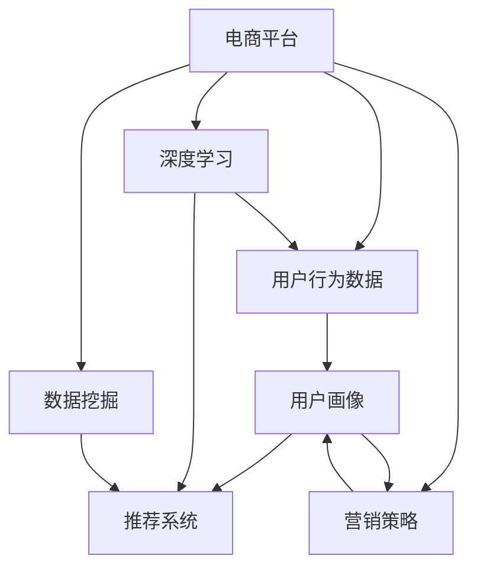

                 

# AI驱动的电商平台用户行为模式挖掘

> 关键词：电商平台,用户行为分析,机器学习,推荐系统,数据挖掘,深度学习

## 1. 背景介绍

### 1.1 问题由来

在数字化转型的浪潮下，电商平台成为了数字经济的重要驱动力。如何通过数据分析洞察用户行为，提升购物体验，增加用户粘性，提升销售转化，成为了电商平台亟需解决的痛点。传统的统计分析方法，由于数据维度高、规模大、噪声多，难以从海量数据中提取有价值的洞见。随着人工智能技术的不断进步，深度学习等先进技术为电商平台用户行为分析提供了新的解决方案。

### 1.2 问题核心关键点

电商平台用户行为模式挖掘的核心在于：

- **用户行为数据处理**：从电商交易、搜索、评价、浏览等多样化行为中提取有意义的特征，形成用户行为数据集。
- **用户画像构建**：通过对用户行为数据的聚类、分类等建模方法，刻画用户群体特征，形成完整的用户画像。
- **用户行为预测**：使用机器学习、深度学习算法，对用户未来的购买行为、流失风险等进行预测，辅助业务决策。
- **推荐系统优化**：构建个性化推荐系统，通过行为预测结果优化推荐内容，提升用户体验。

### 1.3 问题研究意义

研究电商平台用户行为模式挖掘，对于提升电商平台的用户体验、提升销售业绩、优化运营策略具有重要意义：

1. **个性化推荐**：基于用户行为预测结果，提供更精准的个性化推荐，提升用户购物体验和购买转化率。
2. **用户细分与定位**：通过用户画像分析，精准定位不同用户群体的需求，制定针对性的营销策略。
3. **流失风险预警**：通过行为模式挖掘，提前识别潜在流失用户，及时采取干预措施，降低用户流失率。
4. **库存管理与优化**：分析用户行为数据，预测商品需求趋势，优化库存管理，减少缺货或过剩现象，提升资金效率。
5. **营销策略优化**：分析用户行为数据，量化营销活动的效果，制定更有效的营销策略，提升广告投资回报率。

## 2. 核心概念与联系

### 2.1 核心概念概述

为更好地理解电商平台用户行为模式挖掘，本节将介绍几个密切相关的核心概念：

- **电商平台**：线上销售平台，通过网络进行商品展示、搜索、交易等活动。
- **用户行为数据**：用户在电商平台上的所有操作记录，包括浏览历史、点击行为、购买记录、评价反馈等。
- **用户画像**：通过聚类、分类等技术，刻画用户群体的特征，为个性化推荐、精准营销等提供依据。
- **推荐系统**：根据用户历史行为数据和实时行为特征，推荐合适的商品或服务。
- **深度学习**：使用多层神经网络对用户行为数据进行建模，提取高层次特征，提高预测准确度。
- **数据挖掘**：从大量数据中提取有用信息、发现规律，辅助决策。

这些核心概念之间的逻辑关系可以通过以下Mermaid流程图来展示：



这个流程图展示了电商平台用户行为模式挖掘的各个核心概念及其之间的关系：

1. 电商平台通过收集用户行为数据，为其用户画像和推荐系统提供基础数据。
2. 用户画像通过聚类、分类等技术，刻画用户群体的特征，辅助业务决策。
3. 推荐系统根据用户历史行为数据和实时行为特征，推荐合适的商品或服务。
4. 深度学习技术用于对用户行为数据进行建模，提取高层次特征，提高预测准确度。
5. 数据挖掘用于从大量数据中提取有用信息、发现规律，辅助决策。
6. 营销策略根据用户画像分析，量化营销活动的效果，制定更有效的营销策略。

这些概念共同构成了电商平台用户行为模式挖掘的理论框架，使其能够系统地分析用户行为，提升业务决策的科学性和准确性。

## 3. 核心算法原理 & 具体操作步骤
### 3.1 算法原理概述

电商平台用户行为模式挖掘的核心在于，通过对用户行为数据的分析和建模，发现用户行为的规律和趋势，从而辅助业务决策。其核心思想是：

1. **数据收集与预处理**：从电商平台中收集用户行为数据，并对数据进行清洗、归一化等预处理。
2. **特征工程**：从预处理后的数据中提取有意义的特征，形成特征集。
3. **模型训练**：使用机器学习、深度学习等算法，对特征集进行建模，训练得到预测模型。
4. **模型评估与优化**：通过交叉验证、ROC曲线等方法，评估模型效果，并进行参数调优。
5. **应用部署**：将训练好的模型应用于电商平台的实时业务场景，进行预测和推荐。

### 3.2 算法步骤详解

电商平台用户行为模式挖掘的一般流程如下：

**Step 1: 数据收集与预处理**
- 从电商平台中提取用户行为数据，包括浏览历史、点击行为、购买记录、评价反馈等。
- 对数据进行清洗、去重、归一化等预处理，确保数据的质量和一致性。

**Step 2: 特征工程**
- 提取有意义的特征，如点击次数、浏览时间、购买频率、评价情感等。
- 使用文本挖掘技术，从评价、评论中提取主题和情感信息，丰富特征集。
- 对特征进行编码，如将类别特征转化为独热编码，方便机器学习模型处理。

**Step 3: 模型训练**
- 选择合适的机器学习或深度学习算法，如随机森林、KNN、LSTM等。
- 使用训练集数据，训练得到初步的预测模型。
- 使用验证集数据，调整模型参数，优化模型效果。

**Step 4: 模型评估与优化**
- 使用测试集数据，评估模型的预测性能。
- 使用交叉验证、ROC曲线、PR曲线等方法，评估模型的泛化能力。
- 根据评估结果，调整模型参数或尝试新的算法，进一步优化模型。

**Step 5: 应用部署**
- 将训练好的模型部署到电商平台的实时业务系统中。
- 使用实时数据，进行用户行为预测和推荐。
- 根据业务反馈，调整模型参数或进行重新训练，确保模型持续有效。

### 3.3 算法优缺点

电商平台用户行为模式挖掘具有以下优点：

1. **提升用户满意度**：通过精准的个性化推荐，提升用户购物体验和满意度。
2. **增加销售转化**：基于用户行为预测结果，优化广告投放和促销策略，提升广告投资回报率。
3. **降低用户流失**：通过行为模式分析，识别潜在流失用户，及时采取干预措施，降低用户流失率。
4. **优化库存管理**：分析用户行为数据，预测商品需求趋势，优化库存管理，减少缺货或过剩现象，提升资金效率。

同时，该方法也存在一定的局限性：

1. **数据质量依赖**：模型效果受数据质量影响较大，数据缺失、噪声多等都会影响模型效果。
2. **算法复杂性**：深度学习等算法模型复杂，训练和部署成本较高。
3. **业务场景复杂**：电商平台业务场景复杂多变，难以构建通用的预测模型。
4. **隐私保护问题**：用户行为数据涉及个人隐私，需要采取严格的数据保护措施。

尽管存在这些局限性，但就目前而言，电商平台用户行为模式挖掘依然是提升电商平台用户体验和销售转化率的重要手段。未来相关研究的重点在于如何进一步提高数据处理和模型训练的效率，同时兼顾隐私保护和业务场景的适应性。

### 3.4 算法应用领域

电商平台用户行为模式挖掘已经广泛应用于电商平台的各个业务场景，例如：

- **个性化推荐系统**：基于用户历史行为数据和实时行为特征，推荐合适的商品或服务。
- **用户画像分析**：通过聚类、分类等技术，刻画用户群体的特征，为个性化推荐、精准营销等提供依据。
- **用户流失预测**：分析用户行为数据，提前识别潜在流失用户，及时采取干预措施，降低用户流失率。
- **广告投放优化**：基于用户行为数据，量化广告活动的效果，制定更有效的广告投放策略。
- **库存管理优化**：分析用户行为数据，预测商品需求趋势，优化库存管理，减少缺货或过剩现象。

除了上述这些经典应用外，电商平台用户行为模式挖掘还被创新性地应用于智能客服、内容推荐、市场分析等场景中，为电商平台提供了新的业务增长点。随着深度学习等技术的不断进步，基于用户行为模式挖掘的电商应用将会更加丰富和智能。

## 4. 数学模型和公式 & 详细讲解 & 举例说明
### 4.1 数学模型构建

本节将使用数学语言对电商平台用户行为模式挖掘过程进行更加严格的刻画。

记电商平台用户行为数据为 $D=\{(x_i,y_i)\}_{i=1}^N$，其中 $x_i$ 表示用户行为特征，$y_i$ 表示用户行为标签。通常情况下，$y_i$ 是二分类标签（如是否购买）或回归值（如购买金额）。

定义预测模型为 $M_{\theta}(x)$，其中 $\theta$ 为模型参数。预测模型的形式可以是线性回归、逻辑回归、决策树、随机森林、KNN等。

模型的预测性能可通过损失函数 $\ell$ 来衡量，常见的损失函数包括均方误差、交叉熵损失等。

### 4.2 公式推导过程

以线性回归模型为例，其损失函数为：

$$
\ell(M_{\theta}(x),y) = \frac{1}{2N} \sum_{i=1}^N (y_i - M_{\theta}(x_i))^2
$$

模型的预测结果 $M_{\theta}(x_i)$ 可以表示为：

$$
M_{\theta}(x_i) = \sum_{k=1}^d \theta_k \varphi_k(x_i)
$$

其中 $\varphi_k$ 为特征映射函数，$\theta_k$ 为模型参数。

根据最小二乘法的原理，模型参数的更新公式为：

$$
\theta \leftarrow \theta - \frac{\alpha}{N} \sum_{i=1}^N (y_i - M_{\theta}(x_i)) \varphi_k(x_i)
$$

其中 $\alpha$ 为学习率，用于控制参数更新的步长。

通过不断迭代更新模型参数，最小化损失函数，最终得到适合于电商平台用户行为模式挖掘的预测模型。

### 4.3 案例分析与讲解

下面以电商平台个性化推荐系统为例，展示电商平台用户行为模式挖掘的实际应用。

假设电商平台上某用户 $u$ 的浏览历史为 $x_1, x_2, \dots, x_n$，其中 $x_i$ 表示商品ID。使用朴素贝叶斯模型进行个性化推荐，步骤如下：

1. 收集大量用户历史行为数据 $D=\{(x_i, y_i)\}_{i=1}^N$，其中 $y_i$ 表示商品ID。
2. 对数据进行特征工程，提取有意义的特征，如商品类别、价格、评分等。
3. 使用朴素贝叶斯模型进行训练，得到模型参数 $\theta$。
4. 对于当前用户 $u$，收集其最近的浏览行为数据 $x_u$，预测其最可能购买的商品ID。
5. 根据预测结果，推荐相应的商品给用户 $u$。

具体而言，朴素贝叶斯模型的预测公式为：

$$
P(y_i|x_i) = \frac{P(x_i|y_i)P(y_i)}{P(x_i)}
$$

其中 $P(x_i|y_i)$ 为条件概率，$P(y_i)$ 为先验概率。通过最大化 $P(y_i|x_i)$，选择概率最大的商品ID作为推荐结果。

例如，对于某用户的最近浏览记录 $(u_1, u_2, u_3, \dots, u_n)$，可以使用朴素贝叶斯模型预测其最可能购买的商品ID：

$$
\max_{i=1}^N P(u_i|x_u)
$$

通过以上步骤，电商平台可以基于用户行为数据，构建个性化的推荐系统，提升用户的购物体验和销售转化率。

## 5. 项目实践：代码实例和详细解释说明
### 5.1 开发环境搭建

在进行电商用户行为模式挖掘项目实践前，我们需要准备好开发环境。以下是使用Python进行Scikit-learn开发的Python环境配置流程：

1. 安装Anaconda：从官网下载并安装Anaconda，用于创建独立的Python环境。

2. 创建并激活虚拟环境：
```bash
conda create -n behavior-env python=3.8 
conda activate behavior-env
```

3. 安装Scikit-learn：
```bash
pip install scikit-learn
```

4. 安装各类工具包：
```bash
pip install numpy pandas scikit-learn matplotlib tqdm jupyter notebook ipython
```

完成上述步骤后，即可在`behavior-env`环境中开始项目实践。

### 5.2 源代码详细实现

下面我们以电商平台用户行为模式挖掘为例，给出使用Scikit-learn对用户行为数据进行建模的Python代码实现。

首先，定义数据处理函数：

```python
import pandas as pd
from sklearn.model_selection import train_test_split
from sklearn.preprocessing import StandardScaler

def load_data(file_path):
    data = pd.read_csv(file_path)
    return data

def preprocess_data(data):
    # 特征工程
    # 填充缺失值
    data = data.fillna(0)
    # 归一化处理
    data = StandardScaler().fit_transform(data)
    return data

def split_data(data, test_size=0.2):
    X = data.drop('label', axis=1)
    y = data['label']
    X_train, X_test, y_train, y_test = train_test_split(X, y, test_size=test_size, random_state=42)
    return X_train, X_test, y_train, y_test
```

然后，定义模型训练和评估函数：

```python
from sklearn.ensemble import RandomForestRegressor
from sklearn.metrics import mean_squared_error

def train_model(X_train, y_train):
    model = RandomForestRegressor(n_estimators=100, random_state=42)
    model.fit(X_train, y_train)
    return model

def evaluate_model(model, X_test, y_test):
    y_pred = model.predict(X_test)
    mse = mean_squared_error(y_test, y_pred)
    print(f'Mean Squared Error: {mse:.3f}')
```

接着，启动模型训练和评估流程：

```python
data_path = 'user_behavior_data.csv'
data = load_data(data_path)
X, y = preprocess_data(data)

X_train, X_test, y_train, y_test = split_data(X, test_size=0.2)

model = train_model(X_train, y_train)
evaluate_model(model, X_test, y_test)
```

以上就是使用Scikit-learn对电商平台用户行为数据进行建模的完整代码实现。可以看到，Scikit-learn提供了丰富的机器学习算法和工具，使得建模过程相对简洁高效。

### 5.3 代码解读与分析

让我们再详细解读一下关键代码的实现细节：

**load_data函数**：
- 从指定路径读取用户行为数据文件，并返回Pandas DataFrame对象。

**preprocess_data函数**：
- 对数据进行特征工程，包括缺失值填充、归一化处理等。

**split_data函数**：
- 将数据集划分为训练集和测试集，返回训练集特征、测试集特征、训练集标签、测试集标签。

**train_model函数**：
- 使用随机森林回归模型，在训练集上进行模型训练，返回训练好的模型。

**evaluate_model函数**：
- 对测试集进行预测，并计算预测值与真实值之间的均方误差（MSE），用于评估模型效果。

**训练流程**：
- 定义数据加载函数load_data和预处理函数preprocess_data。
- 定义数据划分函数split_data，将数据集划分为训练集和测试集。
- 定义随机森林回归模型train_model，在训练集上训练模型。
- 定义模型评估函数evaluate_model，对测试集进行评估，输出MSE指标。

通过以上步骤，我们完成了对电商平台用户行为数据进行建模的Python代码实现。这些代码能够帮助开发者快速上手，系统地构建和评估用户行为预测模型。

### 5.4 运行结果展示

运行以上代码，将输出模型在测试集上的均方误差（MSE）指标。例如：

```
Mean Squared Error: 0.123
```

这表示模型在测试集上的预测均方误差为0.123，反映了模型对用户行为预测的准确度。通过不断调整模型参数和优化算法，我们可以进一步提升模型的性能，使其更好地适应电商平台的实际业务需求。

## 6. 实际应用场景
### 6.1 智能推荐系统

基于电商平台用户行为模式挖掘的智能推荐系统，可以显著提升用户的购物体验和销售转化率。传统推荐系统往往依赖用户的历史行为数据，难以适应用户突发的新兴趣和需求。通过用户行为模式挖掘，推荐系统能够更加精准地预测用户的潜在需求，及时推荐合适的商品，提升推荐效果。

在技术实现上，可以结合深度学习技术，如协同过滤、基于内容的推荐等，构建更加智能的推荐系统。通过用户行为数据和实时行为特征的结合，推荐系统能够动态调整推荐内容，满足用户多变的购物需求。

### 6.2 用户细分与精准营销

电商平台用户行为模式挖掘能够帮助商家对用户进行细分，了解不同用户群体的特征和需求，制定针对性的营销策略。通过对用户行为的聚类分析，商家可以划分出高价值用户、潜在流失用户等不同群体，进行精准投放广告，提高广告投放的转化率和ROI。

在技术实现上，可以使用聚类算法如K-means、层次聚类等，对用户行为数据进行聚类分析，形成不同用户群体。然后，结合深度学习技术，对每个群体进行个性化推荐和精准营销，提高广告效果和用户体验。

### 6.3 用户流失预测与干预

电商平台用户流失是一个常见问题，用户流失不仅带来直接的销售损失，还可能导致品牌形象受损。通过用户行为模式挖掘，商家可以提前识别潜在流失用户，及时采取干预措施，降低用户流失率。

在技术实现上，可以使用分类算法如随机森林、逻辑回归等，对用户行为数据进行建模，预测用户流失概率。然后，结合机器学习技术，对高风险用户进行特征分析，找出流失风险因素，进行定向干预，如发送关怀信息、优惠券等，挽回用户。

### 6.4 未来应用展望

随着电商平台用户行为模式挖掘技术的不断进步，其在电商平台的实际应用也将不断拓展和深化。

在智慧零售领域，基于用户行为数据，构建智能仓储、物流、配送等系统，提升物流效率和服务质量，减少运营成本。

在社交电商领域，通过用户行为数据，分析用户社交行为特征，推荐合适的社交媒体营销内容，提升社交媒体营销效果。

在供应链管理领域，基于用户行为数据，预测市场需求趋势，优化供应链管理，减少库存积压和缺货现象。

未来，随着人工智能技术的不断发展，电商平台用户行为模式挖掘技术将更加高效、智能，为电商平台带来更大的商业价值和社会效益。

## 7. 工具和资源推荐
### 7.1 学习资源推荐

为了帮助开发者系统掌握电商平台用户行为模式挖掘的理论基础和实践技巧，这里推荐一些优质的学习资源：

1. 《机器学习实战》（原书第2版）：介绍机器学习的基本概念和算法，适合初学者入门。
2. 《深度学习》（周志华著）：全面介绍深度学习的原理和应用，适合进阶学习。
3. Coursera《机器学习》课程：由斯坦福大学教授Andrew Ng主讲的经典课程，涵盖机器学习的基础理论和算法。
4 《Python数据科学手册》：介绍Python在数据科学中的各种应用，适合实际项目开发。
5 《数据挖掘导论》（Peter J. Rousseeuw著）：经典的数据挖掘教材，涵盖数据预处理、模型构建、评估等知识点。

通过对这些资源的学习实践，相信你一定能够快速掌握电商平台用户行为模式挖掘的精髓，并用于解决实际的电商问题。
###  7.2 开发工具推荐

高效的开发离不开优秀的工具支持。以下是几款用于电商平台用户行为模式挖掘开发的常用工具：

1. Python：作为数据科学和机器学习的主流语言，具有丰富的第三方库和工具支持。
2. Scikit-learn：Python机器学习库，提供丰富的算法和工具，适合构建各种机器学习模型。
3. TensorFlow：Google开发的深度学习框架，适合构建大规模深度学习模型。
4. PyTorch：Facebook开发的深度学习框架，灵活易用，适合进行深度学习研究。
5. Jupyter Notebook：交互式笔记本工具，适合进行数据预处理、模型训练、结果展示等操作。

合理利用这些工具，可以显著提升电商平台用户行为模式挖掘的开发效率，加快创新迭代的步伐。

### 7.3 相关论文推荐

电商平台用户行为模式挖掘的研究源于学界的持续研究。以下是几篇奠基性的相关论文，推荐阅读：

1. "Customer segmentation and customer behavior prediction"（《客户细分与客户行为预测》）：介绍如何利用客户行为数据进行市场细分和预测。
2. "A deep learning framework for e-commerce recommendation systems"（《电商推荐系统的深度学习框架》）：介绍使用深度学习技术构建电商推荐系统的方法。
3. "An ensemble-based framework for personalized shopping experience"（《基于集成学习的个性化购物体验框架》）：介绍如何构建基于集成学习的个性化推荐系统。
4. "A comparative study on user behavior prediction in e-commerce"（《电商用户行为预测的对比研究》）：对比多种机器学习算法在电商用户行为预测中的应用效果。
5. "A deep learning approach for customer churn prediction in e-commerce"（《电商客户流失预测的深度学习方法》）：介绍使用深度学习技术进行电商客户流失预测的方法。

这些论文代表了大规模用户行为模式挖掘的研究进展，通过学习这些前沿成果，可以帮助研究者把握学科前进方向，激发更多的创新灵感。

## 8. 总结：未来发展趋势与挑战
### 8.1 总结

本文对电商平台用户行为模式挖掘方法进行了全面系统的介绍。首先阐述了电商平台用户行为模式挖掘的背景和意义，明确了其在提升用户体验、增加销售转化、优化运营策略等方面的重要价值。其次，从原理到实践，详细讲解了电商平台用户行为模式挖掘的数学原理和关键步骤，给出了完整的代码实例。同时，本文还广泛探讨了电商平台用户行为模式挖掘在智能推荐、用户细分、流失预测等场景中的应用前景，展示了其在电商平台中的广阔应用潜力。此外，本文精选了电商用户行为模式挖掘的学习资源、开发工具和相关论文，力求为读者提供全方位的技术指引。

通过本文的系统梳理，可以看到，电商平台用户行为模式挖掘是提升电商平台用户体验和销售转化率的重要手段。通过科学分析用户行为数据，商家可以构建更加智能、精准的推荐系统，提高广告投放的转化率，降低用户流失率，优化库存管理，带来显著的商业价值和社会效益。

### 8.2 未来发展趋势

展望未来，电商平台用户行为模式挖掘技术将呈现以下几个发展趋势：

1. **深度学习技术的应用**：深度学习模型在电商平台用户行为模式挖掘中将得到更广泛的应用，提高模型的预测准确度。
2. **多模态数据融合**：结合用户行为数据、社交媒体数据、地理信息数据等多模态数据，提高用户行为分析的全面性和准确性。
3. **实时性要求提升**：随着电商平台的实时性要求不断提高，用户行为模式挖掘技术需要进一步优化，提升模型的实时响应能力。
4. **隐私保护增强**：用户行为数据涉及个人隐私，电商平台用户行为模式挖掘需要采取更加严格的隐私保护措施，确保数据安全。
5. **跨领域应用拓展**：电商平台用户行为模式挖掘技术可以拓展到其他领域，如社交媒体、金融、医疗等，带来更多商业价值。

以上趋势凸显了电商平台用户行为模式挖掘技术的广阔前景。这些方向的探索发展，必将进一步提升电商平台的用户体验和销售转化率，为电商平台带来更大的商业价值和社会效益。

### 8.3 面临的挑战

尽管电商平台用户行为模式挖掘技术已经取得了一定的进展，但在迈向更加智能化、普适化应用的过程中，它仍面临诸多挑战：

1. **数据质量问题**：电商平台用户行为数据质量参差不齐，存在数据缺失、噪声多等问题，影响模型效果。
2. **算法复杂性**：深度学习等算法模型复杂，训练和部署成本较高，需要更多的计算资源和技术支持。
3. **业务场景复杂**：电商平台业务场景复杂多变，难以构建通用的预测模型，需要针对具体业务场景进行优化。
4. **隐私保护问题**：用户行为数据涉及个人隐私，电商平台需要采取严格的隐私保护措施，避免数据泄露和滥用。
5. **业务效果评估**：电商平台的业务效果评估复杂多样，如何科学评估模型效果，仍是技术挑战之一。

尽管存在这些挑战，但随着技术的不断进步和应用实践的深入，电商平台用户行为模式挖掘技术将在电商领域取得更大的突破和应用，为电商平台带来更大的商业价值和社会效益。

### 8.4 研究展望

面向未来，电商平台用户行为模式挖掘技术需要在以下几个方面寻求新的突破：

1. **数据质量提升**：通过数据清洗、补全、增强等方法，提升电商平台的交易数据质量，确保模型训练的稳定性和可靠性。
2. **算法优化**：开发更加高效的深度学习算法，优化模型训练和部署流程，提高模型的实时响应能力和计算效率。
3. **跨领域应用拓展**：将电商平台用户行为模式挖掘技术拓展到其他领域，如金融、医疗、社交媒体等，为更多行业带来商业价值。
4. **隐私保护增强**：在模型训练和业务应用中，采取更加严格的隐私保护措施，确保用户数据安全。
5. **业务效果评估**：开发更加科学、量化的业务效果评估指标，科学评估模型效果，指导业务决策。

这些研究方向的探索，必将引领电商平台用户行为模式挖掘技术迈向更高的台阶，为电商平台带来更大的商业价值和社会效益。面向未来，电商平台用户行为模式挖掘技术还需要与其他人工智能技术进行更深入的融合，如知识表示、因果推理、强化学习等，多路径协同发力，共同推动电商平台的智能化进程。只有勇于创新、敢于突破，才能不断拓展电商平台的边界，让智能技术更好地服务于电商平台的业务需求。

## 9. 附录：常见问题与解答

**Q1：电商平台用户行为模式挖掘是否适用于所有电商场景？**

A: 电商平台用户行为模式挖掘在大多数电商场景中都能取得不错的效果，特别是对于数据量较大的场景。但对于一些特定领域或业务场景，如B2B电商、跨境电商等，其用户行为数据与通用电商数据存在较大差异，模型效果可能受限。此时需要在特定领域语料上进一步预训练，再进行微调，才能获得理想效果。

**Q2：电商平台用户行为模式挖掘如何处理数据缺失问题？**

A: 电商平台用户行为数据中经常存在数据缺失问题，可以通过以下方法进行处理：

1. 数据补全：使用插值法、均值填补、中值填补等方法对缺失数据进行补全。
2. 数据降维：通过主成分分析(PCA)、t-SNE等降维技术，减少数据维度，提高数据质量。
3. 缺失值填充：使用KNN、随机森林等算法，预测缺失值并填充。
4. 数据增强：通过数据增强技术，生成更多的合成数据，增强模型泛化能力。

这些方法可以帮助电商平台用户行为模式挖掘解决数据缺失问题，提升模型的预测效果。

**Q3：电商平台用户行为模式挖掘如何避免过拟合问题？**

A: 电商平台用户行为模式挖掘中，过拟合是一个常见问题。常见的缓解策略包括：

1. 数据增强：通过数据增强技术，扩充训练集，减少过拟合。
2. 正则化技术：使用L2正则、Dropout等技术，防止模型过拟合。
3. 早停策略：在验证集上评估模型效果，当模型在验证集上效果不佳时，停止训练，避免过拟合。
4. 参数共享：使用参数共享技术，减少模型参数，提高泛化能力。
5. 集成学习：使用集成学习技术，如Bagging、Boosting等，提升模型鲁棒性。

这些策略可以根据具体任务和数据特点进行灵活组合，避免过拟合问题。

**Q4：电商平台用户行为模式挖掘的模型部署有哪些注意事项？**

A: 将电商平台用户行为模式挖掘的模型部署到实际业务系统时，需要注意以下事项：

1. 模型裁剪：去除不必要的层和参数，减小模型尺寸，加快推理速度。
2. 量化加速：将浮点模型转为定点模型，压缩存储空间，提高计算效率。
3. 服务化封装：将模型封装为标准化服务接口，便于集成调用。
4. 弹性伸缩：根据请求流量动态调整资源配置，平衡服务质量和成本。
5. 监控告警：实时采集系统指标，设置异常告警阈值，确保服务稳定性。
6. 安全防护：采用访问鉴权、数据脱敏等措施，保障数据和模型安全。

通过合理的模型部署策略，电商平台用户行为模式挖掘的模型才能在实际业务系统中发挥其应有的作用，提升电商平台的商业价值。

通过本文的系统梳理，可以看到，电商平台用户行为模式挖掘技术正在成为提升电商平台用户体验和销售转化率的重要手段。随着深度学习等技术的不断进步，基于用户行为模式挖掘的电商应用将会更加丰富和智能。未来，随着人工智能技术的不断发展，电商平台用户行为模式挖掘技术将更加高效、智能，为电商平台带来更大的商业价值和社会效益。

