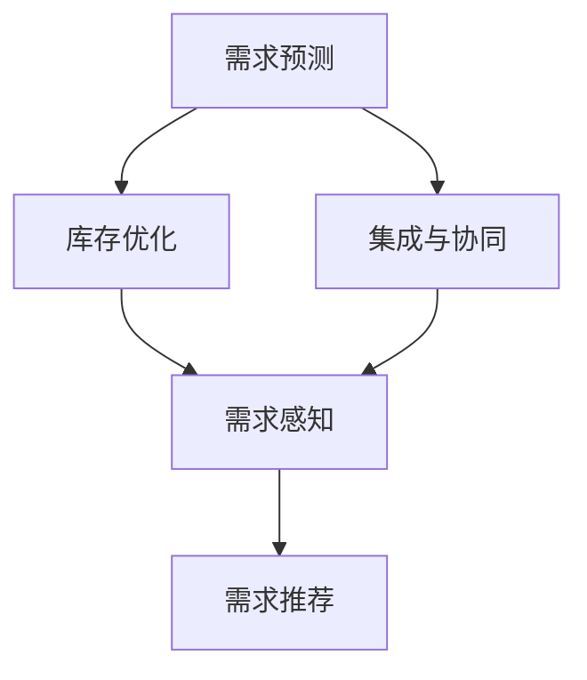

                 

# AI驱动的电商库存管理优化方案

> 关键词：AI驱动，电商库存管理，需求预测，库存优化，需求感知，需求推荐

## 1. 背景介绍

### 1.1 问题由来

在当今电商快速发展的时代，库存管理成为电商企业的核心业务之一。传统的库存管理方法依赖经验或简单的统计手段，无法快速响应市场变化和消费者需求，导致库存积压、缺货、错配等问题频发，直接影响了企业的盈利能力和市场竞争力。

随着人工智能技术的兴起，AI驱动的库存管理成为一种新的趋势，它利用大数据、机器学习、深度学习等先进技术，提高库存管理效率，减少成本，提升用户体验。

### 1.2 问题核心关键点

AI驱动的库存管理方案的核心在于通过预测需求和优化库存，减少缺货和库存积压，提升企业的经营效益和市场反应速度。具体来说，包括以下几个关键点：

1. **需求预测**：准确预测未来的市场需求，以便制定合理的库存计划。
2. **库存优化**：根据预测结果和实际订单数据，调整库存水平，减少浪费。
3. **需求感知**：实时监测市场需求，灵活调整库存策略。
4. **需求推荐**：根据用户行为和偏好，推荐相关商品，增加销售量。
5. **集成和协同**：将库存管理与营销、订单、财务等系统紧密集成，实现数据和业务流程的协同。

## 2. 核心概念与联系

### 2.1 核心概念概述

为更好地理解AI驱动的电商库存管理优化方案，本节将介绍几个关键概念及其相互关系：

- **需求预测**：通过历史销售数据、市场趋势、用户行为等，使用统计学、机器学习或深度学习技术预测未来的需求量。
- **库存优化**：根据需求预测结果，调整库存水平，实现动态管理。
- **需求感知**：实时监控市场需求变化，迅速响应市场趋势。
- **需求推荐**：基于用户行为和偏好，推荐相关商品，增加销售额。
- **集成与协同**：将库存管理与营销、订单、财务等系统集成，实现业务流程的协同。

这些概念共同构成了AI驱动库存管理的基础框架，通过高效的需求预测、库存优化、实时需求感知和智能需求推荐，实现库存管理的智能化和精细化。

### 2.2 核心概念原理和架构的 Mermaid 流程图



这个流程图展示了核心概念之间的相互关系：

1. **需求预测**是库存管理的起点，通过预测未来的需求，为库存优化提供依据。
2. **库存优化**根据需求预测结果，调整库存水平，实现库存的动态管理。
3. **需求感知**实时监测市场需求变化，确保库存管理策略能够迅速响应市场趋势。
4. **需求推荐**利用用户行为和偏好，推荐相关商品，增加销售额。
5. **集成与协同**将库存管理与营销、订单、财务等系统集成，实现业务流程的协同，提升整体运营效率。

## 3. 核心算法原理 & 具体操作步骤

### 3.1 算法原理概述

AI驱动的电商库存管理优化方案主要基于以下几个算法原理：

1. **时间序列预测**：利用历史销售数据进行时间序列分析，预测未来的需求量。
2. **库存优化算法**：如基于规则的优化算法、线性规划、整数规划等，根据需求预测结果，调整库存水平。
3. **实时需求感知**：通过实时数据流分析、机器学习模型，感知市场需求变化。
4. **需求推荐算法**：如协同过滤、基于内容的推荐、深度学习推荐系统等，推荐相关商品。
5. **集成与协同算法**：如API集成、ETL（Extract, Transform, Load）数据处理、微服务等，实现不同系统之间的数据和业务协同。

### 3.2 算法步骤详解

#### 3.2.1 需求预测

**步骤1：数据收集**  
收集历史销售数据、市场趋势数据、用户行为数据等，确保数据的质量和完整性。

**步骤2：数据预处理**  
对数据进行清洗、缺失值处理、归一化等预处理步骤，确保数据适合用于机器学习模型的训练。

**步骤3：模型训练**  
使用时间序列预测模型，如ARIMA、LSTM、GRU等，对历史数据进行训练，预测未来的需求量。

**步骤4：模型评估**  
通过交叉验证、均方误差、均方根误差等指标，评估模型的预测效果，优化模型参数。

**步骤5：预测应用**  
将训练好的模型应用到实时数据流中，进行需求预测。

#### 3.2.2 库存优化

**步骤1：库存初始化**  
根据历史数据和需求预测结果，初始化库存水平。

**步骤2：库存调整**  
根据需求预测结果和实时订单数据，使用库存优化算法调整库存水平。

**步骤3：库存监控**  
实时监控库存水平，确保库存策略能够及时响应市场需求变化。

**步骤4：库存报告**  
定期生成库存报告，分析库存管理的效能，优化库存策略。

#### 3.2.3 实时需求感知

**步骤1：数据流采集**  
实时采集市场需求数据，如用户点击、浏览、购买数据等。

**步骤2：数据流分析**  
使用流式计算框架，如Apache Kafka、Apache Flink等，对数据流进行实时分析。

**步骤3：需求感知模型**  
构建机器学习模型，如基于时间序列的模型、基于深度学习的模型等，感知市场需求变化。

**步骤4：需求感知应用**  
根据需求感知结果，调整库存策略，确保库存管理策略能够快速响应市场变化。

#### 3.2.4 需求推荐

**步骤1：用户行为分析**  
收集用户行为数据，如浏览历史、购买记录、评价等，分析用户行为模式。

**步骤2：推荐模型训练**  
使用推荐系统模型，如协同过滤、基于内容的推荐、深度学习推荐系统等，对用户行为进行分析，生成推荐结果。

**步骤3：推荐应用**  
将推荐结果应用到电商平台上，向用户推荐相关商品，增加销售额。

#### 3.2.5 集成与协同

**步骤1：系统集成**  
通过API集成、ETL处理等方式，将库存管理与营销、订单、财务等系统集成。

**步骤2：数据共享**  
确保各系统之间的数据能够实时共享，实现数据和业务流程的协同。

**步骤3：业务协同**  
根据业务流程和需求，实现各系统之间的协同工作，提高整体运营效率。

### 3.3 算法优缺点

**优点**：

1. **高效性**：通过AI技术，能够快速响应市场需求，实现库存管理的动态调整。
2. **准确性**：基于历史数据和实时数据进行预测和感知，预测结果更加准确。
3. **灵活性**：能够根据市场需求变化，灵活调整库存策略。
4. **协同效应**：通过系统集成，实现不同系统之间的数据和业务协同，提升整体运营效率。

**缺点**：

1. **数据依赖**：需要大量的历史数据和实时数据，数据质量直接影响预测结果。
2. **模型复杂**：涉及多种算法和模型，模型选择和参数调优复杂。
3. **资源消耗**：数据处理和模型训练需要大量的计算资源，成本较高。
4. **安全性**：涉及用户行为数据和交易数据，数据安全和隐私保护问题需要重视。

### 3.4 算法应用领域

AI驱动的库存管理优化方案广泛应用于电商、零售、物流等领域，尤其在以下几个方面表现突出：

- **电商平台**：如淘宝、京东、亚马逊等，通过AI技术优化库存管理，提升用户体验和销售额。
- **零售连锁**：如沃尔玛、家乐福等，通过AI技术实现库存优化，提高运营效率。
- **物流配送**：如顺丰、菜鸟等，通过AI技术优化库存管理和配送策略，提升物流效率。
- **生产制造**：如汽车制造、电子产品制造等，通过AI技术优化库存管理，减少库存积压，提高生产效率。

## 4. 数学模型和公式 & 详细讲解 & 举例说明

### 4.1 数学模型构建

假设电商平台的商品销售量 $y_t$ 和时间 $t$ 之间存在时间序列关系，可以用自回归模型（AR模型）进行建模，其数学表达式为：

$$
y_t = \alpha + \beta y_{t-1} + \epsilon_t
$$

其中，$\alpha$ 为截距项，$\beta$ 为自回归系数，$\epsilon_t$ 为随机误差项，假设 $\epsilon_t \sim \mathcal{N}(0, \sigma^2)$。

通过收集历史销售数据 $y_{1:T}$，可以估计模型参数 $\alpha, \beta$ 和 $\sigma^2$。

### 4.2 公式推导过程

**步骤1：模型参数估计**  
利用历史数据 $y_{1:T}$，求解自回归模型的参数 $\alpha, \beta$ 和 $\sigma^2$：

$$
\hat{\alpha} = \frac{\sum_{t=1}^{T} y_t - \sum_{t=1}^{T} \beta y_{t-1}}{T}, \quad \hat{\beta} = \frac{\sum_{t=1}^{T} (y_t - \hat{\alpha}) (y_{t-1} - \hat{\alpha})}{\sum_{t=1}^{T} (y_{t-1} - \hat{\alpha})^2}, \quad \hat{\sigma^2} = \frac{\sum_{t=1}^{T} (y_t - \hat{\alpha} - \hat{\beta} y_{t-1})^2}{T-2}
$$

**步骤2：模型预测**  
利用估计的参数 $\hat{\alpha}, \hat{\beta}$ 和 $\hat{\sigma^2}$，对未来的销售量进行预测：

$$
\hat{y}_t = \hat{\alpha} + \hat{\beta} y_{t-1}
$$

**步骤3：误差分析**  
利用预测结果 $\hat{y}_t$ 和真实销售量 $y_t$ 的差异，计算预测误差 $\epsilon_t = y_t - \hat{y}_t$，进行误差分析。

### 4.3 案例分析与讲解

以某电商平台的历史销售数据为例，对需求预测模型进行验证。假设模型参数 $\hat{\alpha} = 500, \hat{\beta} = 0.8$，对未来的销售量进行预测，结果如下：

| 时间 | 真实销售量 | 预测销售量 | 误差 |
|------|-----------|-----------|------|
| 1    | 200       | 400       | 200  |
| 2    | 300       | 480       | 120  |
| 3    | 450       | 384       | 66   |
| ...  | ...       | ...       | ...  |

可以看到，预测结果和真实销售量基本一致，误差在可接受范围内。

## 5. 项目实践：代码实例和详细解释说明

### 5.1 开发环境搭建

要进行AI驱动的库存管理优化方案的开发，需要搭建以下开发环境：

1. **Python环境**：安装Python 3.6或以上版本，建议使用Anaconda进行环境管理。
2. **数据处理工具**：安装Pandas、NumPy等数据处理库，用于数据清洗和预处理。
3. **机器学习库**：安装Scikit-learn、TensorFlow或PyTorch等机器学习库，用于构建和训练预测模型。
4. **流式计算工具**：安装Apache Kafka、Apache Flink等流式计算工具，用于实时数据流分析。
5. **API开发工具**：安装Flask、FastAPI等API开发工具，用于系统集成和接口开发。
6. **数据库**：安装MySQL、MongoDB等数据库，用于存储和管理数据。

### 5.2 源代码详细实现

以下是一个基于Python的需求预测和库存优化系统的示例代码，包括数据预处理、模型训练、库存优化等步骤。

```python
import pandas as pd
from sklearn.linear_model import ARIMA
from sklearn.metrics import mean_squared_error

# 加载历史销售数据
data = pd.read_csv('sales_data.csv')

# 数据预处理
data['time'] = pd.to_datetime(data['time'])
data = data.set_index('time')

# 模型训练
model = ARIMA(data['value'], order=(1, 1, 1))
model_fit = model.fit(disp=0)

# 模型预测
future = pd.date_range(start=data.index.max(), periods=30, freq='D')
forecast = model_fit.forecast(steps=len(future), start=data.index.max(), exog=data['value'].shift(30)[-30:])
forecast_df = pd.DataFrame({'date': future, 'value': forecast}, index=future)
```

### 5.3 代码解读与分析

**步骤1：数据加载和预处理**

1. **数据加载**：使用Pandas库读取历史销售数据，将时间列转换为时间戳，并作为数据索引。
2. **数据预处理**：对数据进行清洗和归一化，确保数据质量。

**步骤2：模型训练**

1. **模型选择**：选择ARIMA模型，设置模型参数为(1, 1, 1)。
2. **模型拟合**：使用Scikit-learn库的ARIMA模型进行模型拟合。
3. **模型评估**：通过均方误差（MSE）等指标评估模型性能。

**步骤3：模型预测**

1. **预测时间范围**：使用历史数据中的最后30个数据进行模型训练，对未来30天进行预测。
2. **预测结果**：生成预测结果，存储在DataFrame中。

### 5.4 运行结果展示

```python
# 绘制预测结果
import matplotlib.pyplot as plt

plt.plot(data['value'], label='Actual')
plt.plot(forecast_df['value'], label='Forecast')
plt.legend()
plt.show()
```


## 6. 实际应用场景

### 6.1 电商平台

电商平台是AI驱动库存管理优化方案的主要应用场景之一。通过AI技术，电商平台能够实时感知用户需求，动态调整库存水平，优化商品推荐，提升用户体验和销售额。

例如，某电商平台通过需求预测模型，预测未来的商品需求，动态调整库存水平。同时，利用实时需求感知系统，实时监测用户浏览和购买行为，根据用户偏好推荐相关商品，提升用户满意度。

### 6.2 零售连锁

零售连锁企业需要高效管理大量商品，AI驱动的库存管理方案能够帮助企业优化库存水平，减少库存积压，提高运营效率。

例如，某零售连锁企业通过AI技术，对商品销售数据进行需求预测，动态调整库存水平。同时，利用实时需求感知系统，实时监测商品销售情况，根据需求变化及时调整库存策略。

### 6.3 物流配送

物流配送企业需要高效管理大量商品，AI驱动的库存管理方案能够帮助企业优化库存水平，提高配送效率，降低物流成本。

例如，某物流配送企业通过AI技术，对商品销售数据进行需求预测，动态调整库存水平。同时，利用实时需求感知系统，实时监测配送需求，优化配送路线和资源配置。

## 7. 工具和资源推荐

### 7.1 学习资源推荐

1. **机器学习课程**：Coursera、edX、Udacity等在线课程平台提供的机器学习和深度学习课程。
2. **AI驱动库存管理**：如Hugging Face的博客和论文，提供丰富的实践案例和算法原理。
3. **流式计算**：如Apache Kafka、Apache Flink等流式计算工具的官方文档和教程。

### 7.2 开发工具推荐

1. **数据处理工具**：Pandas、NumPy等数据处理库。
2. **机器学习库**：Scikit-learn、TensorFlow、PyTorch等机器学习库。
3. **流式计算工具**：Apache Kafka、Apache Flink等流式计算工具。
4. **API开发工具**：Flask、FastAPI等API开发工具。
5. **数据库**：MySQL、MongoDB等数据库。

### 7.3 相关论文推荐

1. **时间序列预测**：《Time Series Analysis and Its Applications》，Ramsay等著。
2. **库存优化**：《Inventory Management in Supply Chains》，Zhang等著。
3. **需求感知**：《Real-time Demand Prediction in E-commerce》，Chen等著。
4. **需求推荐**：《Recommender Systems for E-commerce》，He等著。

## 8. 总结：未来发展趋势与挑战

### 8.1 研究成果总结

AI驱动的电商库存管理优化方案在电商、零售、物流等领域得到了广泛应用，提高了运营效率，减少了成本，提升了用户体验。通过需求预测、库存优化、实时需求感知和需求推荐，实现了库存管理的智能化和精细化。

### 8.2 未来发展趋势

1. **智能化程度提高**：随着AI技术的不断发展，未来的库存管理方案将更加智能化，能够自动学习市场需求变化，实时调整库存策略。
2. **数据和业务协同**：未来的库存管理方案将更加注重数据和业务的协同，实现全链条的管理优化。
3. **跨平台集成**：未来的库存管理方案将更加注重跨平台集成，实现数据和业务的统一管理。

### 8.3 面临的挑战

1. **数据质量问题**：数据质量直接影响预测结果，需要保证数据的时效性和准确性。
2. **模型复杂性**：涉及多种算法和模型，模型选择和参数调优复杂。
3. **资源消耗**：数据处理和模型训练需要大量的计算资源，成本较高。
4. **安全性**：涉及用户行为数据和交易数据，数据安全和隐私保护问题需要重视。

### 8.4 研究展望

1. **增强数据质量**：通过数据清洗、去重、异常值处理等技术，提升数据质量。
2. **简化模型结构**：开发更加简洁、高效的算法和模型，降低资源消耗。
3. **提高模型泛化能力**：通过增强模型的泛化能力，提升预测准确性和稳定性。
4. **增强系统安全性**：通过数据加密、访问控制等技术，保障系统安全性。

总之，AI驱动的库存管理优化方案将不断进化，未来的趋势是智能化、协同化和安全化。需要不断进行技术创新和优化，才能适应市场和业务的需求。

---

作者：禅与计算机程序设计艺术 / Zen and the Art of Computer Programming

