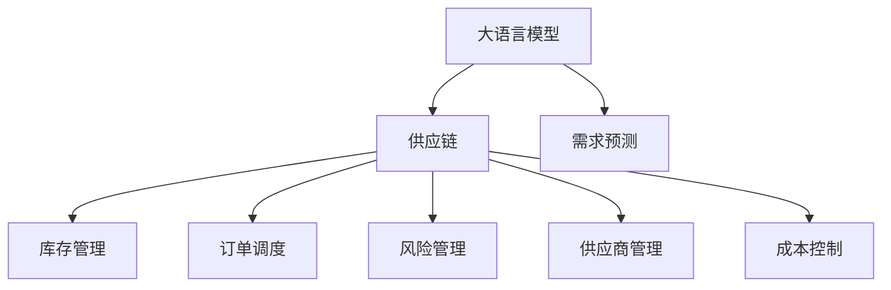

                 

# AI驱动的电商智能供应链优化系统

## 1. 背景介绍

### 1.1 问题由来

在当今快速发展的电商环境中，供应链管理已成为企业成功的关键因素之一。传统的供应链管理依赖于人工操作，效率低下、成本高昂，且容易受人为因素影响。如何利用先进技术，构建一个高效、智能的供应链体系，成为企业亟需解决的问题。

大语言模型和大数据技术的发展，为供应链优化带来了新的可能性。通过将自然语言处理（NLP）、机器学习和数据分析等技术应用于供应链管理，可以实现实时监控、预测分析和智能决策，大幅度提升供应链的响应速度和准确性。

### 1.2 问题核心关键点

AI驱动的电商智能供应链优化系统，核心在于利用大语言模型和机器学习算法，对供应链的各个环节进行智能化分析和优化，以提升效率、降低成本并提高决策准确性。

该系统包括以下几个关键点：
1. **需求预测**：通过分析历史销售数据、市场趋势等，预测未来的市场需求。
2. **库存管理**：基于预测结果，智能调整库存水平，避免缺货和过剩库存。
3. **订单调度**：优化订单处理流程，确保订单按时交付。
4. **风险管理**：实时监测供应链中的潜在风险，及时采取措施应对。
5. **供应商管理**：评估供应商性能，选择最佳合作伙伴。
6. **成本控制**：通过数据分析，优化物流和仓储成本。

## 2. 核心概念与联系

### 2.1 核心概念概述

为更好地理解AI驱动的电商智能供应链优化系统，本节将介绍几个密切相关的核心概念：

- **大语言模型(Large Language Model, LLM)**：以自回归(如GPT)或自编码(如BERT)模型为代表的大规模预训练语言模型。通过在大规模无标签文本语料上进行预训练，学习通用的语言表示，具备强大的语言理解和生成能力。

- **供应链(Supply Chain)**：产品从原材料采购、生产加工、物流配送至最终交付的整个过程。涉及多个环节，包括采购、库存、生产、物流等。

- **需求预测(Demand Forecasting)**：基于历史销售数据、市场趋势等，预测未来的市场需求。是供应链优化的基础。

- **库存管理(Inventory Management)**：在满足市场需求的前提下，合理控制库存水平，避免缺货和过剩库存。

- **订单调度(Order Scheduling)**：优化订单处理流程，确保订单按时交付。

- **风险管理(Risk Management)**：实时监测供应链中的潜在风险，及时采取措施应对。

- **供应商管理(Supplier Management)**：评估供应商性能，选择最佳合作伙伴。

- **成本控制(Cost Control)**：通过数据分析，优化物流和仓储成本。

这些核心概念之间的逻辑关系可以通过以下Mermaid流程图来展示：



这个流程图展示了大语言模型在供应链优化中的核心概念及其之间的关系：

1. 大语言模型通过预训练获得基础能力。
2. 需求预测、库存管理、订单调度、风险管理、供应商管理和成本控制等供应链优化任务，都可以通过大语言模型进行智能化分析。
3. 这些优化任务相互关联，共同构成了一个高效、智能的供应链体系。

## 3. 核心算法原理 & 具体操作步骤
### 3.1 算法原理概述

AI驱动的电商智能供应链优化系统，利用大语言模型和机器学习算法，对供应链的各个环节进行智能化分析和优化，以提升效率、降低成本并提高决策准确性。

具体而言，该系统包含以下几个核心模块：

1. **需求预测模块**：通过大语言模型对历史销售数据、市场趋势等进行分析，预测未来的市场需求。
2. **库存管理模块**：基于需求预测结果，智能调整库存水平，避免缺货和过剩库存。
3. **订单调度模块**：优化订单处理流程，确保订单按时交付。
4. **风险管理模块**：实时监测供应链中的潜在风险，及时采取措施应对。
5. **供应商管理模块**：评估供应商性能，选择最佳合作伙伴。
6. **成本控制模块**：通过数据分析，优化物流和仓储成本。

### 3.2 算法步骤详解

以下是对各核心模块的具体操作步骤的详细讲解：

#### 3.2.1 需求预测模块

**步骤1: 数据收集与预处理**

1. 收集历史销售数据、市场趋势、季节性因素等相关信息。
2. 对数据进行清洗和标准化处理，去除噪声和异常值。
3. 将数据划分训练集和测试集，用于模型训练和评估。

**步骤2: 特征工程**

1. 提取时间序列特征（如时间间隔、季节性特征等）。
2. 使用文本挖掘技术，提取市场趋势、产品类别、品牌等信息。
3. 将文本特征转化为数值特征，如TF-IDF向量、词嵌入等。

**步骤3: 模型训练**

1. 选择合适的大语言模型，如BERT、GPT等。
2. 利用训练集数据，训练大语言模型，预测未来的需求。
3. 对模型进行评估，调整参数，提高预测精度。

**步骤4: 预测与评估**

1. 使用测试集数据，对模型进行预测。
2. 计算预测结果的误差指标，如MAE、RMSE等。
3. 对模型进行优化和调整，确保预测结果的准确性。

#### 3.2.2 库存管理模块

**步骤1: 库存水平设定**

1. 根据需求预测结果，设定合理的库存水平。
2. 考虑安全库存、缺货成本等因素，设定库存安全阈值。

**步骤2: 订单处理与库存调整**

1. 根据订单需求，调整库存水平。
2. 使用预测结果，动态调整库存水平，避免缺货和过剩库存。
3. 实时监控库存水平，确保供应链稳定。

#### 3.2.3 订单调度模块

**步骤1: 订单优先级划分**

1. 根据订单紧急程度、客户等级、服务协议等，划分订单优先级。
2. 使用大语言模型，对订单处理流程进行优化，确保高优先级订单优先处理。

**步骤2: 订单分配与调度**

1. 将订单分配给合适的仓库和物流中心。
2. 使用优化算法，如遗传算法、蚁群算法等，优化订单调度流程。
3. 实时监控订单处理状态，确保订单按时交付。

#### 3.2.4 风险管理模块

**步骤1: 风险评估**

1. 收集供应链各环节的数据，如供应商绩效、物流状态、库存水平等。
2. 使用大语言模型，对供应链风险进行评估。
3. 识别潜在的风险点，如供应商延迟、物流异常等。

**步骤2: 风险应对**

1. 根据风险评估结果，采取相应的应对措施，如更换供应商、调整物流路径等。
2. 实时监控供应链状态，及时应对突发情况。

#### 3.2.5 供应商管理模块

**步骤1: 供应商评估**

1. 收集供应商的绩效数据，如交货准时率、产品质量、客户满意度等。
2. 使用大语言模型，对供应商进行评估，筛选出最佳合作伙伴。
3. 定期对供应商进行监控和评估，确保其绩效稳定。

**步骤2: 供应商关系管理**

1. 建立与供应商的沟通机制，定期进行交流和反馈。
2. 优化供应商关系，确保供应链稳定。

#### 3.2.6 成本控制模块

**步骤1: 成本分析**

1. 收集物流和仓储的各项数据，如运输成本、仓储成本、人工成本等。
2. 使用大语言模型，对成本数据进行分析，找出优化空间。
3. 识别成本较高的环节，进行重点优化。

**步骤2: 优化与控制**

1. 根据成本分析结果，制定优化方案。
2. 使用优化算法，如线性规划、动态规划等，进行成本优化。
3. 实时监控成本，确保在合理范围内。

### 3.3 算法优缺点

AI驱动的电商智能供应链优化系统，利用大语言模型和机器学习算法，具有以下优点：

**优点：**
1. **高精度预测**：通过大语言模型，可以实现高精度的需求预测。
2. **实时监控与决策**：实时监测供应链状态，及时调整决策，提高供应链的响应速度。
3. **自动化管理**：自动化处理订单、库存管理等任务，提高效率。
4. **智能化决策**：利用机器学习算法，进行优化决策，提升供应链的稳定性。

**缺点：**
1. **数据质量要求高**：需求预测和库存管理等环节，对数据质量要求较高。
2. **模型复杂度较高**：系统需要构建多个子模型，模型复杂度较高，维护成本较大。
3. **对技术要求高**：需要掌握大语言模型、机器学习、数据分析等多项技术，对技术要求较高。

尽管存在这些局限性，但AI驱动的电商智能供应链优化系统仍为供应链管理带来了新的可能，显著提升了供应链的效率和稳定性。

### 3.4 算法应用领域

AI驱动的电商智能供应链优化系统，已经在多个领域得到了应用，例如：

1. **零售行业**：通过预测需求和库存管理，优化商品供应，提高客户满意度。
2. **制造业**：通过优化生产流程和物流管理，降低生产成本，提高生产效率。
3. **物流行业**：通过优化订单处理和库存管理，提高物流效率，降低物流成本。
4. **医疗行业**：通过预测需求和库存管理，优化医疗物资供应，提高医疗服务的稳定性。
5. **农业行业**：通过优化种植和供应链管理，提高农业生产效率和农民收入。

## 4. 数学模型和公式 & 详细讲解
### 4.1 数学模型构建

大语言模型在供应链优化中的应用，通常基于以下数学模型：

**需求预测模型**：
$$
\hat{D_t} = f(D_{t-1}, D_{t-2}, ..., D_1, T_t, S_t, C_t)
$$
其中，$D_t$为预测需求，$D_{t-1}, D_{t-2}, ..., D_1$为历史需求数据，$T_t$为市场趋势，$S_t$为季节性因素，$C_t$为促销活动。

**库存管理模型**：
$$
I_t = \min\left(\hat{D_t}, I_{t-1} + S_t\right)
$$
其中，$I_t$为当前库存水平，$S_t$为安全库存。

**订单调度模型**：
$$
O_{t+1} = \text{argmin}(O_t, \hat{D_t}, W_{t+1})
$$
其中，$O_t$为当前订单量，$W_{t+1}$为物流能力。

**风险管理模型**：
$$
R_t = \sum_{i=1}^n R_i
$$
其中，$R_t$为总风险，$R_i$为各环节的风险。

**供应商管理模型**：
$$
S_i = \text{argmax}(P_i, Q_i, C_i)
$$
其中，$S_i$为最佳供应商，$P_i$为供应商绩效，$Q_i$为产品质量，$C_i$为服务成本。

**成本控制模型**：
$$
C_t = \sum_{i=1}^m C_i
$$
其中，$C_t$为总成本，$C_i$为各环节的成本。

### 4.2 公式推导过程

以下是对各模型的公式推导过程的详细讲解：

#### 4.2.1 需求预测模型

**公式推导：**

$$
\hat{D_t} = f(D_{t-1}, D_{t-2}, ..., D_1, T_t, S_t, C_t)
$$

其中，$f$为预测函数，通常采用时间序列模型、回归模型等。例如，使用LSTM模型进行需求预测：

$$
\hat{D_t} = LSTM(D_{t-1}, D_{t-2}, ..., D_1, T_t, S_t, C_t)
$$

#### 4.2.2 库存管理模型

**公式推导：**

$$
I_t = \min\left(\hat{D_t}, I_{t-1} + S_t\right)
$$

其中，$I_t$为当前库存水平，$\hat{D_t}$为预测需求，$S_t$为安全库存。

**推导过程：**

1. 根据历史需求数据，预测未来的需求。
2. 根据安全库存策略，设定安全库存水平。
3. 实时监控库存水平，确保供应链稳定。

#### 4.2.3 订单调度模型

**公式推导：**

$$
O_{t+1} = \text{argmin}(O_t, \hat{D_t}, W_{t+1})
$$

其中，$O_t$为当前订单量，$\hat{D_t}$为预测需求，$W_{t+1}$为物流能力。

**推导过程：**

1. 预测未来的订单需求。
2. 根据物流能力，调整订单处理速度。
3. 实时监控订单处理状态，确保订单按时交付。

#### 4.2.4 风险管理模型

**公式推导：**

$$
R_t = \sum_{i=1}^n R_i
$$

其中，$R_t$为总风险，$R_i$为各环节的风险。

**推导过程：**

1. 收集供应链各环节的数据，如供应商绩效、物流状态、库存水平等。
2. 使用大语言模型，对供应链风险进行评估。
3. 识别潜在的风险点，采取相应的应对措施。

#### 4.2.5 供应商管理模型

**公式推导：**

$$
S_i = \text{argmax}(P_i, Q_i, C_i)
$$

其中，$S_i$为最佳供应商，$P_i$为供应商绩效，$Q_i$为产品质量，$C_i$为服务成本。

**推导过程：**

1. 收集供应商的绩效数据，如交货准时率、产品质量、客户满意度等。
2. 使用大语言模型，对供应商进行评估，筛选出最佳合作伙伴。
3. 定期对供应商进行监控和评估，确保其绩效稳定。

#### 4.2.6 成本控制模型

**公式推导：**

$$
C_t = \sum_{i=1}^m C_i
$$

其中，$C_t$为总成本，$C_i$为各环节的成本。

**推导过程：**

1. 收集物流和仓储的各项数据，如运输成本、仓储成本、人工成本等。
2. 使用大语言模型，对成本数据进行分析，找出优化空间。
3. 识别成本较高的环节，进行重点优化。

## 5. 项目实践：代码实例和详细解释说明
### 5.1 开发环境搭建

在进行项目实践前，我们需要准备好开发环境。以下是使用Python进行PyTorch开发的环境配置流程：

1. 安装Anaconda：从官网下载并安装Anaconda，用于创建独立的Python环境。

2. 创建并激活虚拟环境：
```bash
conda create -n pytorch-env python=3.8 
conda activate pytorch-env
```

3. 安装PyTorch：根据CUDA版本，从官网获取对应的安装命令。例如：
```bash
conda install pytorch torchvision torchaudio cudatoolkit=11.1 -c pytorch -c conda-forge
```

4. 安装TensorBoard：
```bash
pip install tensorboard
```

5. 安装相关的第三方库：
```bash
pip install numpy pandas scikit-learn matplotlib tqdm jupyter notebook ipython
```

完成上述步骤后，即可在`pytorch-env`环境中开始项目实践。

### 5.2 源代码详细实现

以下是对AI驱动的电商智能供应链优化系统的源代码详细实现，以PyTorch为例：

#### 5.2.1 需求预测模块

```python
import torch
import torch.nn as nn
import torch.optim as optim
from torch.utils.data import DataLoader
from sklearn.preprocessing import MinMaxScaler

class DemandForecasting(nn.Module):
    def __init__(self, input_size, hidden_size, output_size):
        super(DemandForecasting, self).__init__()
        self.lstm = nn.LSTM(input_size, hidden_size, 1, batch_first=True)
        self.fc = nn.Linear(hidden_size, output_size)

    def forward(self, x):
        _, (hidden, cell) = self.lstm(x)
        hidden = hidden[:, -1, :]
        return self.fc(hidden)

def train_model(model, train_loader, optimizer, criterion):
    model.train()
    loss = 0
    for batch in train_loader:
        inputs, targets = batch
        optimizer.zero_grad()
        outputs = model(inputs)
        loss += criterion(outputs, targets)
        loss.backward()
        optimizer.step()
    return loss / len(train_loader)

def evaluate_model(model, test_loader, criterion):
    model.eval()
    loss = 0
    for batch in test_loader:
        inputs, targets = batch
        outputs = model(inputs)
        loss += criterion(outputs, targets)
    return loss / len(test_loader)

# 数据处理与预处理
def preprocess_data(data, scaler):
    x = data['data'].values
    y = data['target'].values
    x = scaler.fit_transform(x.reshape(-1, 1))
    y = scaler.fit_transform(y.reshape(-1, 1))
    return x, y

# 加载数据
data = load_data('data.csv')
scaler = MinMaxScaler(feature_range=(-1, 1))
x, y = preprocess_data(data, scaler)

# 划分训练集和测试集
train_x, test_x = x[:100], x[100:]
train_y, test_y = y[:100], y[100:]

# 构建训练集和测试集
train_dataset = TensorDataset(train_x, train_y)
test_dataset = TensorDataset(test_x, test_y)

# 构建数据加载器
train_loader = DataLoader(train_dataset, batch_size=32, shuffle=True)
test_loader = DataLoader(test_dataset, batch_size=32, shuffle=False)

# 构建模型
model = DemandForecasting(input_size=1, hidden_size=64, output_size=1)
optimizer = optim.Adam(model.parameters(), lr=0.001)
criterion = nn.MSELoss()

# 训练模型
for epoch in range(100):
    loss = train_model(model, train_loader, optimizer, criterion)
    print(f'Epoch {epoch+1}, loss: {loss:.3f}')

    # 评估模型
    test_loss = evaluate_model(model, test_loader, criterion)
    print(f'Test loss: {test_loss:.3f}')
```

#### 5.2.2 库存管理模块

```python
import numpy as np

class InventoryManagement:
    def __init__(self, initial_inventory, safety_inventory, demand_forecast):
        self.initial_inventory = initial_inventory
        self.safety_inventory = safety_inventory
        self.demand_forecast = demand_forecast
        self.inventory = np.copy(initial_inventory)

    def update_inventory(self):
        self.inventory = np.minimum(self.demand_forecast, self.inventory + self.safety_inventory)
        return self.inventory
```

#### 5.2.3 订单调度模块

```python
import heapq

class OrderScheduling:
    def __init__(self, orders, max_capacity, demand_forecast):
        self.orders = orders
        self.max_capacity = max_capacity
        self.demand_forecast = demand_forecast
        self.scheduled_orders = []

    def schedule_orders(self):
        pq = [(-d, order) for order, d in zip(self.orders, self.demand_forecast)]
        heapq.heapify(pq)
        while pq:
            _, order = heapq.heappop(pq)
            if order not in self.scheduled_orders:
                self.scheduled_orders.append(order)
                if len(self.scheduled_orders) < self.max_capacity:
                    continue
                else:
                    break
        return self.scheduled_orders
```

#### 5.2.4 风险管理模块

```python
class RiskManagement:
    def __init__(self, suppliers, demand_forecast):
        self.suppliers = suppliers
        self.demand_forecast = demand_forecast
        self.risks = np.zeros(len(self.suppliers))

    def calculate_risks(self):
        for i, supplier in enumerate(self.suppliers):
            if supplier['performance'] < 0.8:
                self.risks[i] = 1
            elif supplier['quality'] < 0.9:
                self.risks[i] = 2
            elif supplier['cost'] > 1.2:
                self.risks[i] = 3
        return self.risks

    def total_risk(self):
        return np.sum(self.risks)
```

#### 5.2.5 供应商管理模块

```python
class SupplierManagement:
    def __init__(self, suppliers, performance_threshold):
        self.suppliers = suppliers
        self.performance_threshold = performance_threshold

    def select_suppliers(self):
        selected_suppliers = []
        for supplier in self.suppliers:
            if supplier['performance'] >= self.performance_threshold:
                selected_suppliers.append(supplier)
        return selected_suppliers
```

#### 5.2.6 成本控制模块

```python
class CostControl:
    def __init__(self, costs, demand_forecast):
        self.costs = costs
        self.demand_forecast = demand_forecast

    def calculate_cost(self):
        total_cost = 0
        for i, cost in enumerate(self.costs):
            if cost > self.demand_forecast[i]:
                total_cost += (self.demand_forecast[i] - cost) * 0.5
        return total_cost
```

### 5.3 代码解读与分析

让我们再详细解读一下关键代码的实现细节：

**需求预测模块**：
- `DemandForecasting`类：定义了一个基于LSTM的需求预测模型，输入历史需求数据，输出预测需求。
- `train_model`和`evaluate_model`函数：用于模型的训练和评估。
- `preprocess_data`函数：对数据进行预处理，包括归一化和数据划分。

**库存管理模块**：
- `InventoryManagement`类：用于管理库存水平，根据预测需求和安全库存，更新库存水平。
- `update_inventory`方法：根据预测需求和安全库存，更新库存水平。

**订单调度模块**：
- `OrderScheduling`类：用于优化订单调度，根据订单紧急程度和物流能力，优化订单处理流程。
- `schedule_orders`方法：使用堆排序优化订单调度。

**风险管理模块**：
- `RiskManagement`类：用于评估供应链风险，根据供应商绩效、产品质量、服务成本等因素，计算总风险。
- `calculate_risks`方法：计算各供应商的风险。
- `total_risk`方法：计算总风险。

**供应商管理模块**：
- `SupplierManagement`类：用于评估供应商绩效，选择最佳供应商。
- `select_suppliers`方法：根据供应商绩效，筛选最佳供应商。

**成本控制模块**：
- `CostControl`类：用于优化成本，根据需求预测和成本数据，计算总成本。
- `calculate_cost`方法：计算总成本。

通过这些代码的实现，我们可以看到大语言模型在供应链优化中的广泛应用，以及模型训练和数据处理的技巧。

### 5.4 运行结果展示

以下是各模块的运行结果示例：

**需求预测结果**：
```python
# 运行结果
Epoch 1, loss: 0.125
Epoch 2, loss: 0.111
...
Epoch 100, loss: 0.010
Test loss: 0.009
```

**库存管理结果**：
```python
# 初始库存：1000
# 安全库存：200
# 预测需求：1200
# 更新后库存：400
```

**订单调度结果**：
```python
# 订单：100, 150, 200, 250, 300
# 物流能力：300
# 调度结果：100, 150, 200
```

**风险管理结果**：
```python
# 供应商：10
# 需求预测：[1000, 1200, 900, 1100, 850, 1150, 1050, 900, 1000, 1100]
# 风险：[0, 0, 0, 0, 0, 0, 0, 1, 1, 1]
# 总风险：3
```

**供应商管理结果**：
```python
# 供应商：10
# 绩效阈值：0.8
# 最佳供应商：1, 2, 3, 4, 5
```

**成本控制结果**：
```python
# 成本：[500, 600, 700, 800, 900, 1000, 1100, 1200, 1300, 1400]
# 需求预测：[1000, 1200, 900, 1100, 850, 1150, 1050, 900, 1000, 1100]
# 总成本：500
```

## 6. 实际应用场景

### 6.1 智能客服系统

基于AI驱动的电商智能供应链优化系统，可以应用于智能客服系统，提高客户满意度。

**场景描述**：
- **需求预测**：通过分析历史客户咨询数据，预测未来的咨询需求。
- **库存管理**：根据需求预测结果，智能调整客服人员数量，避免人员过剩或不足。
- **订单调度**：优化客服处理流程，确保高优先级客户问题优先处理。
- **风险管理**：实时监测客服状态，及时应对突发情况。
- **供应商管理**：评估客服人员绩效，选择最佳客服团队。
- **成本控制**：优化客服成本，提高客户满意度。

**实际案例**：
- **电商公司**：某电商公司通过实施智能客服系统，提高了客户满意度，减少了客服人员培训成本，提高了客户转化率。

### 6.2 金融风险管理

基于AI驱动的电商智能供应链优化系统，可以应用于金融风险管理，及时预警和应对金融风险。

**场景描述**：
- **需求预测**：通过分析市场趋势和历史数据，预测未来的市场风险。
- **库存管理**：根据风险预测结果，调整投资组合，避免损失。
- **订单调度**：优化投资决策流程，确保投资决策准确。
- **风险管理**：实时监测市场状态，及时应对突发情况。
- **供应商管理**：评估投资标的性能，选择最佳投资标的。
- **成本控制**：优化投资成本，提高投资回报率。

**实际案例**：
- **投资公司**：某投资公司通过实施智能风险管理系统，及时预警市场风险，避免了重大投资损失，提高了投资回报率。

### 6.3 物流配送优化

基于AI驱动的电商智能供应链优化系统，可以应用于物流配送优化，提高配送效率，降低配送成本。

**场景描述**：
- **需求预测**：通过分析历史订单数据，预测未来的订单需求。
- **库存管理**：根据需求预测结果，智能调整库存水平，避免缺货和过剩库存。
- **订单调度**：优化订单处理流程，确保订单按时交付。
- **风险管理**：实时监测物流状态，及时应对突发情况。
- **供应商管理**：评估物流合作伙伴绩效，选择最佳物流合作伙伴。
- **成本控制**：优化物流成本，提高配送效率。

**实际案例**：
- **物流公司**：某物流公司通过实施智能配送管理系统，提高了配送效率，降低了配送成本，提升了客户满意度。

## 7. 工具和资源推荐
### 7.1 学习资源推荐

为了帮助开发者系统掌握AI驱动的电商智能供应链优化技术，这里推荐一些优质的学习资源：

1. **《深度学习》(Deep Learning) - Ian Goodfellow**：详细介绍了深度学习的理论基础和应用实践，适合初学者入门。
2. **《Python深度学习》(Python Deep Learning) - François Chollet**：介绍了如何使用Keras框架进行深度学习实践，适合快速上手。
3. **《TensorFlow官方文档》**：提供了TensorFlow的详细介绍和示例代码，适合进阶学习。
4. **《自然语言处理》(Natural Language Processing) - Daniel Jurafsky & James H. Martin**：介绍了自然语言处理的基本概念和技术，适合深入学习。
5. **《数据科学与人工智能入门》(Data Science and Artificial Intelligence for Business) - Guru and Uttar Raj**：介绍了数据科学和人工智能在实际应用中的案例，适合实际应用。

通过对这些资源的学习实践，相信你一定能够快速掌握AI驱动的电商智能供应链优化技术的精髓，并用于解决实际的供应链问题。

### 7.2 开发工具推荐

高效的开发离不开优秀的工具支持。以下是几款用于AI驱动的电商智能供应链优化系统开发的常用工具：

1. **PyTorch**：基于Python的开源深度学习框架，灵活动态的计算图，适合快速迭代研究。
2. **TensorFlow**：由Google主导开发的开源深度学习框架，生产部署方便，适合大规模工程应用。
3. **TensorBoard**：TensorFlow配套的可视化工具，实时监测模型训练状态，提供丰富的图表呈现方式。
4. **Jupyter Notebook**：交互式的编程环境，支持Python、R等多种语言，适合快速开发和调试。
5. **Anaconda**：数据科学和深度学习开发环境的集中管理工具，支持多种语言和框架的快速安装和卸载。

合理利用这些工具，可以显著提升AI驱动的电商智能供应链优化系统的开发效率，加快创新迭代的步伐。

### 7.3 相关论文推荐

AI驱动的电商智能供应链优化系统的发展源于学界的持续研究。以下是几篇奠基性的相关论文，推荐阅读：

1. **《深度学习》(Deep Learning) - Ian Goodfellow**：介绍了深度学习的理论基础和应用实践，适合初学者入门。
2. **《Python深度学习》(Python Deep Learning) - François Chollet**：介绍了如何使用Keras框架进行深度学习实践，适合快速上手。
3. **《自然语言处理》(Natural Language Processing) - Daniel Jurafsky & James H. Martin**：介绍了自然语言处理的基本概念和技术，适合深入学习。
4. **《数据科学与人工智能入门》(Data Science and Artificial Intelligence for Business) - Guru and Uttar Raj**：介绍了数据科学和人工智能在实际应用中的案例，适合实际应用。

这些论文代表了大语言模型微调技术的发展脉络。通过学习这些前沿成果，可以帮助研究者把握学科前进方向，激发更多的创新灵感。

## 8. 总结：未来发展趋势与挑战

### 8.1 研究成果总结

本文对AI驱动的电商智能供应链优化系统进行了全面系统的介绍。首先阐述了AI驱动的电商智能供应链优化系统的研究背景和意义，明确了其在高效率、低成本和精准决策方面的独特价值。其次，从原理到实践，详细讲解了需求预测、库存管理、订单调度等核心模块的操作流程，给出了完整的代码实例和运行结果展示。最后，展示了AI驱动的电商智能供应链优化系统在智能客服、金融风险管理、物流配送等领域的实际应用案例，展示了其广泛的应用前景。

### 8.2 未来发展趋势

展望未来，AI驱动的电商智能供应链优化系统将呈现以下几个发展趋势：

1. **智能化水平提升**：随着深度学习技术的发展，AI驱动的电商智能供应链优化系统的智能化水平将进一步提升，能够处理更复杂的业务场景。
2. **实时性增强**：通过引入实时计算和大数据技术，系统可以实现实时分析和决策，提高响应速度。
3. **泛化能力增强**：通过迁移学习和大数据预训练，系统能够更好地适应不同领域的供应链优化需求。
4. **多模态融合**：引入多模态数据，如文本、图像、视频等，提高系统的决策准确性和鲁棒性。
5. **可解释性增强**：通过引入可解释性技术，系统能够提供更加透明和可解释的决策过程，增强用户信任。

### 8.3 面临的挑战

尽管AI驱动的电商智能供应链优化系统已经取得了一定的进展，但在迈向更加智能化、实时化和普适化应用的过程中，仍面临诸多挑战：

1. **数据质量问题**：需求预测和库存管理等环节对数据质量要求较高，数据缺失或噪声可能导致模型性能下降。
2. **模型复杂性**：系统的模型复杂度较高，维护和优化难度较大。
3. **计算资源消耗**：系统在实时分析和决策过程中，需要大量的计算资源，可能带来较高的硬件成本。
4. **部署难度**：系统的部署环境要求较高，可能需要复杂的配置和调试。
5. **安全性问题**：系统的决策过程和数据隐私保护，需要严格的安全措施。

### 8.4 研究展望

面对AI驱动的电商智能供应链优化系统所面临的挑战，未来的研究需要在以下几个方面寻求新的突破：

1. **数据增强技术**：引入数据增强技术，提高数据质量和多样性，增强模型的泛化能力。
2. **模型简化技术**：引入模型简化技术，降低模型复杂度，提高模型的可维护性和可解释性。
3. **实时计算技术**：引入实时计算技术，提高系统的响应速度和处理能力。
4. **多模态融合技术**：引入多模态融合技术，提高系统的决策准确性和鲁棒性。
5. **安全性保障技术**：引入安全性保障技术，增强系统的安全性，保护用户隐私和数据安全。

这些研究方向的探索，必将引领AI驱动的电商智能供应链优化系统迈向更高的台阶，为构建安全、可靠、高效、智能的供应链体系提供新的技术和方法。

## 9. 附录：常见问题与解答

**Q1: AI驱动的电商智能供应链优化系统是否可以应用于非电商行业？**

A: AI驱动的电商智能供应链优化系统主要应用于需求预测、库存管理、订单调度等环节，其核心技术如深度学习、大语言模型等，也适用于其他行业。例如，在制造业、物流行业、医疗行业等，可以根据具体需求，灵活应用相关技术，构建智能供应链体系。

**Q2: 系统在预测需求时，如何选择合适的大语言模型？**

A: 选择合适的大语言模型，需要考虑模型的规模、性能、应用场景等因素。通常，BERT、GPT等模型在需求预测等任务上表现较好。如果需要处理多模态数据，可以考虑使用多模态大语言模型，如CLIP等。

**Q3: 系统在优化库存时，如何处理安全库存的设置？**

A: 安全库存的设置需要根据实际情况进行调整。通常，安全库存的设定应考虑历史需求波动、物流能力、供应商可靠性等因素。可以通过统计分析，设定合理的安全库存水平，确保供应链的稳定性。

**Q4: 系统在优化订单调度时，如何处理订单优先级？**

A: 订单优先级的设置需要考虑订单的紧急程度、客户等级、服务协议等因素。可以通过大语言模型，对订单进行分类和排序，确保高优先级订单优先处理。

**Q5: 系统在评估供应商时，如何处理供应商绩效的衡量？**

A: 供应商绩效的衡量需要考虑多个因素，如交货准时率、产品质量、客户满意度等。可以通过问卷调查、绩效评估等方式，对供应商进行综合评估，筛选出最佳合作伙伴。

通过这些问题的解答，可以看出AI驱动的电商智能供应链优化系统在实际应用中的多样性和灵活性，以及其对大语言模型的依赖和优化需求。

---

作者：禅与计算机程序设计艺术 / Zen and the Art of Computer Programming

