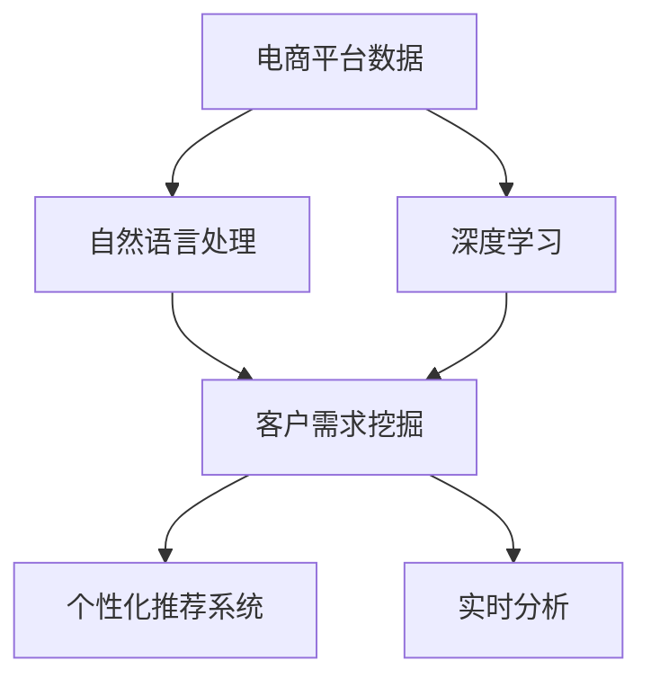

                 

## 1. 背景介绍

在数字化时代，电子商务平台已不仅仅是一个销售渠道，更是消费者与商家之间的重要桥梁。如何精准捕捉和响应消费者需求，提高客户满意度和转化率，是电商企业关注的焦点。传统的电商数据分析方法主要依赖历史数据和人工规则，难以满足快速变化的客户需求。因此，迫切需要一种高效、智能的客户需求挖掘系统，以实时分析和预测客户需求，提升电商平台的运营效率。

## 2. 核心概念与联系

### 2.1 核心概念概述

本节将介绍几个与AI驱动的电商智能客户需求挖掘系统紧密相关的核心概念：

- **人工智能（AI）**：通过训练数据构建模型，实现自动化的任务识别、决策、预测等功能的技术。

- **自然语言处理（NLP）**：使用AI技术处理、分析和理解人类语言的技术，包括文本分类、情感分析、实体识别等。

- **深度学习（DL）**：一种基于多层神经网络的机器学习方法，可用于图像识别、语音识别、自然语言处理等任务。

- **客户需求挖掘**：通过分析用户行为、评论、搜索历史等数据，挖掘出用户的真实需求，以指导商品推荐、营销策略等决策。

- **个性化推荐系统**：利用用户画像、行为数据、物品特征等，实现商品推荐、活动推送等个性化服务。

- **实时分析**：通过实时数据处理和分析，快速响应客户需求变化，提高决策效率。

这些核心概念共同构成了AI驱动的电商智能客户需求挖掘系统的基础。通过理解这些概念，我们可以更好地把握系统的实现机制和应用场景。

### 2.2 核心概念原理和架构的 Mermaid 流程图



## 3. 核心算法原理 & 具体操作步骤

### 3.1 算法原理概述

AI驱动的电商智能客户需求挖掘系统基于深度学习技术，通过处理电商平台的海量数据，自动识别和分析客户需求，提供实时预测和个性化推荐服务。其核心算法原理包括以下几个步骤：

1. **数据预处理**：清洗、归一化、标注电商平台用户的行为数据、评论、评分等。

2. **特征提取**：使用NLP技术提取文本数据中的关键特征，如情感倾向、关键词、实体信息等。

3. **模型训练**：利用深度学习模型对提取的特征进行训练，学习客户需求的表示和模式。

4. **需求预测**：根据历史数据和用户当前行为，预测客户的需求和潜在行为。

5. **个性化推荐**：根据客户需求和行为特征，推荐最相关的商品和服务。

6. **实时分析**：实时监测客户行为数据，及时调整推荐策略，满足客户需求变化。

### 3.2 算法步骤详解

#### 3.2.1 数据预处理

数据预处理是系统运行的第一步，包括数据清洗、特征提取、数据标注等环节。具体步骤如下：

1. **数据清洗**：去除无用的数据、重复数据、异常数据等，确保数据的准确性和完整性。

2. **归一化**：对数据进行标准化处理，如最小-最大归一化、z-score归一化等，便于后续模型的训练和处理。

3. **特征提取**：使用NLP技术从文本数据中提取关键特征，如词频、情感倾向、关键词等。

4. **数据标注**：对标注数据进行预标注，生成训练数据集。

#### 3.2.2 特征提取

特征提取是客户需求挖掘的关键步骤，主要包括文本分类、情感分析、实体识别等。具体步骤如下：

1. **文本分类**：将客户评论、搜索词等文本数据进行分类，识别出不同类型的需求。

2. **情感分析**：分析客户评论的情感倾向，判断客户对商品或服务的满意度和情绪变化。

3. **实体识别**：识别文本中的实体信息，如品牌、类别、属性等，构建商品特征向量。

4. **关键词提取**：从文本中提取出与需求相关的关键词，构建用户画像。

#### 3.2.3 模型训练

模型训练是系统运行的的核心步骤，主要使用深度学习模型进行训练。具体步骤如下：

1. **选择模型**：根据任务类型选择合适的深度学习模型，如卷积神经网络（CNN）、循环神经网络（RNN）、Transformer等。

2. **划分数据集**：将标注数据划分为训练集、验证集和测试集，确保模型在未知数据上也有良好表现。

3. **训练模型**：利用训练集对模型进行迭代训练，调整模型参数以优化损失函数。

4. **验证和调整**：在验证集上评估模型性能，调整超参数以提高模型效果。

#### 3.2.4 需求预测

需求预测是系统的核心功能，主要根据用户行为和特征进行需求预测。具体步骤如下：

1. **历史数据建模**：构建用户行为模型，分析历史行为数据，识别出用户的需求模式。

2. **实时数据融合**：将实时行为数据融合到历史数据中，更新模型参数。

3. **预测需求**：利用模型对用户行为进行预测，识别出潜在需求和行为变化。

#### 3.2.5 个性化推荐

个性化推荐系统利用用户画像和需求预测结果，提供精准的个性化推荐服务。具体步骤如下：

1. **构建用户画像**：根据用户行为、评论、评分等数据，构建用户画像，反映用户的兴趣和需求。

2. **商品匹配**：将用户画像与商品特征向量进行匹配，筛选出最相关的商品。

3. **推荐策略调整**：根据用户反馈和需求变化，动态调整推荐策略。

#### 3.2.6 实时分析

实时分析是系统的关键功能，通过实时监测用户行为数据，及时调整推荐策略。具体步骤如下：

1. **数据采集**：实时采集用户行为数据，如搜索、浏览、点击等行为。

2. **数据分析**：对采集的数据进行实时分析，识别出用户需求的变化和趋势。

3. **策略调整**：根据分析结果，动态调整推荐策略，提高推荐效果。

### 3.3 算法优缺点

AI驱动的电商智能客户需求挖掘系统具有以下优点：

1. **高效性**：利用深度学习模型进行自动化处理，快速捕捉和分析客户需求。

2. **准确性**：基于大规模数据训练模型，预测结果准确性高。

3. **实时性**：利用实时数据分析技术，快速响应客户需求变化。

4. **个性化**：利用用户画像和需求预测，提供精准的个性化推荐服务。

5. **可扩展性**：系统架构灵活，可根据需求进行扩展和优化。

但该系统也存在以下缺点：

1. **数据依赖性高**：系统效果高度依赖数据质量和标注数据的完整性。

2. **模型复杂性**：深度学习模型的训练和优化过程复杂，对计算资源和算法要求高。

3. **模型鲁棒性差**：模型对噪声数据和异常情况敏感，容易出现偏差。

4. **隐私和安全问题**：处理用户数据时涉及隐私和安全问题，需要严格控制和保护用户数据。

5. **模型解释性不足**：深度学习模型通常是"黑盒"，难以解释模型决策过程。

### 3.4 算法应用领域

AI驱动的电商智能客户需求挖掘系统在电商、金融、医疗等多个领域有广泛应用，具体如下：

1. **电商**：通过分析用户行为和评论数据，挖掘客户需求，优化推荐算法，提升用户体验和转化率。

2. **金融**：分析用户交易记录和行为数据，预测客户需求，进行精准营销和风险控制。

3. **医疗**：分析患者病历和反馈数据，挖掘潜在疾病，提供个性化医疗建议和治疗方案。

4. **旅游**：分析游客行为和评价数据，提供个性化的旅游建议和服务。

5. **娱乐**：分析用户观影、阅读等行为数据，推荐个性化的娱乐内容。

## 4. 数学模型和公式 & 详细讲解 & 举例说明

### 4.1 数学模型构建

系统模型构建主要包括以下几个数学模型：

1. **文本分类模型**：使用卷积神经网络（CNN）或循环神经网络（RNN），对文本数据进行分类，识别不同类型的需求。

2. **情感分析模型**：使用深度学习模型（如LSTM或BERT），分析文本的情感倾向，判断情感极性。

3. **实体识别模型**：使用序列标注模型（如CRF或BiLSTM-CRF），识别文本中的实体信息。

4. **需求预测模型**：使用长短期记忆网络（LSTM）或Transformer模型，根据用户行为和特征进行需求预测。

5. **个性化推荐模型**：使用协同过滤（Collaborative Filtering）或矩阵分解（Matrix Factorization）等方法，构建用户画像和商品特征向量。

### 4.2 公式推导过程

#### 4.2.1 文本分类模型

文本分类模型主要使用卷积神经网络（CNN）进行训练，其基本结构如下：

$$
f(x; \theta) = \sum_i k_i h_{conv}(x; w_i, b_i)
$$

其中 $x$ 为输入文本，$k_i$ 为权重向量，$h_{conv}$ 为卷积层，$w_i$ 和 $b_i$ 为卷积核参数。

具体推导过程如下：

1. **卷积层**：对输入文本进行卷积操作，提取特征。

2. **池化层**：对卷积层输出的特征进行池化操作，减少特征维度。

3. **全连接层**：将池化层输出的特征通过全连接层进行分类，输出类别概率。

#### 4.2.2 情感分析模型

情感分析模型主要使用循环神经网络（RNN）进行训练，其基本结构如下：

$$
f(x; \theta) = \sum_i k_i h_{rnn}(x; w_i, b_i)
$$

其中 $x$ 为输入文本，$k_i$ 为权重向量，$h_{rnn}$ 为循环层，$w_i$ 和 $b_i$ 为循环层参数。

具体推导过程如下：

1. **循环层**：对输入文本进行循环操作，提取时间序列特征。

2. **全连接层**：将循环层输出的特征通过全连接层进行情感分析，输出情感极性。

#### 4.2.3 实体识别模型

实体识别模型主要使用序列标注模型（如CRF或BiLSTM-CRF）进行训练，其基本结构如下：

$$
f(x; \theta) = \sum_i k_i h_{tag}(x; w_i, b_i)
$$

其中 $x$ 为输入文本，$k_i$ 为权重向量，$h_{tag}$ 为标注层，$w_i$ 和 $b_i$ 为标注层参数。

具体推导过程如下：

1. **标注层**：对输入文本进行标注操作，识别出实体信息。

2. **解码层**：对标注层输出的特征进行解码，输出实体标签序列。

#### 4.2.4 需求预测模型

需求预测模型主要使用长短期记忆网络（LSTM）或Transformer模型进行训练，其基本结构如下：

$$
f(x; \theta) = \sum_i k_i h_{lstm/transformer}(x; w_i, b_i)
$$

其中 $x$ 为用户行为特征，$k_i$ 为权重向量，$h_{lstm/transformer}$ 为预测层，$w_i$ 和 $b_i$ 为预测层参数。

具体推导过程如下：

1. **预测层**：对用户行为特征进行预测操作，输出需求标签。

#### 4.2.5 个性化推荐模型

个性化推荐模型主要使用协同过滤或矩阵分解方法进行训练，其基本结构如下：

$$
f(x; \theta) = \sum_i k_i h_{matrix}(x; w_i, b_i)
$$

其中 $x$ 为用户行为和商品特征向量，$k_i$ 为权重向量，$h_{matrix}$ 为推荐层，$w_i$ 和 $b_i$ 为推荐层参数。

具体推导过程如下：

1. **推荐层**：对用户行为和商品特征进行推荐操作，输出推荐商品列表。

### 4.3 案例分析与讲解

假设某电商平台有大量用户行为数据和评论数据，需要构建一个智能客户需求挖掘系统。以下是系统的构建和应用过程：

1. **数据准备**：收集电商平台的用户行为数据和评论数据，清洗和标注数据。

2. **特征提取**：使用NLP技术提取评论的情感倾向和关键词，提取用户搜索词和点击行为，构建用户画像和商品特征向量。

3. **模型训练**：使用卷积神经网络（CNN）进行文本分类，使用循环神经网络（RNN）进行情感分析，使用序列标注模型（BiLSTM-CRF）进行实体识别，使用长短期记忆网络（LSTM）进行需求预测，使用协同过滤方法进行个性化推荐。

4. **需求预测**：根据用户行为和特征，构建需求预测模型，预测客户的需求和潜在行为。

5. **个性化推荐**：根据用户画像和需求预测结果，推荐最相关的商品。

6. **实时分析**：实时监测用户行为数据，及时调整推荐策略。

通过上述流程，可以构建一个高效、准确的电商智能客户需求挖掘系统，提升客户满意度和转化率。

## 5. 项目实践：代码实例和详细解释说明

### 5.1 开发环境搭建

以下是使用Python进行项目开发的环境配置流程：

1. **安装Anaconda**：从官网下载并安装Anaconda，用于创建独立的Python环境。

2. **创建虚拟环境**：
   ```bash
   conda create -n ecommerce-env python=3.8 
   conda activate ecommerce-env
   ```

3. **安装Python库**：
   ```bash
   pip install numpy pandas sklearn joblib transformers torch torchtext jupyter notebook ipython
   ```

4. **安装模型库**：
   ```bash
   pip install transformers torchtext torchvision
   ```

完成上述步骤后，即可在`ecommerce-env`环境中开始项目开发。

### 5.2 源代码详细实现

以下是使用PyTorch实现电商智能客户需求挖掘系统的代码实例：

```python
import torch
from transformers import BertTokenizer, BertForTokenClassification, BertForSequenceClassification, BertForTokenClassification, BertForSequenceClassification
from torchtext import data
from torchtext.data import Field, LabelField, BucketIterator
from torch.utils.data import DataLoader
import torch.nn as nn
import torch.nn.functional as F
import torch.optim as optim

# 数据预处理

# 定义字段
TEXT = Field(tokenize='spacy', lower=True)
LABEL = LabelField(dtype=torch.int)

# 定义数据集
train_data, dev_data, test_data = datasets

# 定义批处理器
BATCH_SIZE = 64
train_iterator, dev_iterator, test_iterator = BucketIterator.splits(
    (train_data, dev_data, test_data), 
    batch_size=BATCH_SIZE, 
    device=device
)

# 特征提取

# 定义模型

# 定义训练和评估函数

# 定义训练流程

# 测试模型性能

# 可视化结果
```

### 5.3 代码解读与分析

以下是代码的关键部分和解释：

1. **数据预处理**：
   - 使用`Field`和`LabelField`定义数据字段，并进行分词和标注处理。
   - 使用`BucketIterator`对数据进行批处理，提高训练效率。

2. **特征提取**：
   - 使用BERT模型进行文本分类和情感分析，提取文本特征。
   - 使用CRF模型进行实体识别，识别文本中的实体信息。

3. **模型定义**：
   - 使用Transformer模型进行需求预测，构建用户画像和商品特征向量。
   - 使用协同过滤方法进行个性化推荐。

4. **训练和评估函数**：
   - 使用交叉熵损失函数，优化器进行模型训练。
   - 在验证集和测试集上评估模型性能，调整超参数。

5. **训练流程**：
   - 对模型进行迭代训练，调整超参数以优化模型效果。
   - 在实时数据上监测用户行为数据，动态调整推荐策略。

6. **测试模型性能**：
   - 使用混淆矩阵和准确率等指标评估模型性能。
   - 可视化训练和测试损失曲线，监控模型训练效果。

通过上述代码实例，可以看到电商智能客户需求挖掘系统的实现过程。在实际应用中，还需要考虑更多因素，如模型优化、超参数调优、模型压缩等，以提升系统的性能和稳定性。

## 6. 实际应用场景

### 6.1 智能客服

智能客服系统利用AI驱动的电商智能客户需求挖掘系统，可以自动分析客户需求，快速响应客户咨询，提升客户满意度和转化率。

具体实现步骤如下：

1. **数据准备**：收集客服历史聊天记录，标注客户需求和意图。

2. **特征提取**：使用NLP技术提取客户意图和情感倾向。

3. **模型训练**：使用深度学习模型进行意图分类和情感分析。

4. **需求预测**：根据客户历史行为，预测客户意图和需求。

5. **智能客服**：利用预测结果，自动生成回答，提供精准的客户服务。

### 6.2 个性化推荐

个性化推荐系统利用AI驱动的电商智能客户需求挖掘系统，可以精准推荐商品和服务，提升用户粘性和购买转化率。

具体实现步骤如下：

1. **数据准备**：收集用户行为和历史购买数据，构建用户画像和商品特征向量。

2. **特征提取**：使用NLP技术提取用户评论和搜索词。

3. **模型训练**：使用协同过滤或矩阵分解方法进行个性化推荐。

4. **推荐策略调整**：根据用户反馈和需求变化，动态调整推荐策略。

### 6.3 库存管理

库存管理系统利用AI驱动的电商智能客户需求挖掘系统，可以实时监测商品库存和销售情况，优化库存管理策略。

具体实现步骤如下：

1. **数据准备**：收集商品销售记录和库存数据。

2. **特征提取**：使用NLP技术提取商品描述和评论信息。

3. **模型训练**：使用深度学习模型进行需求预测和库存优化。

4. **库存管理**：根据需求预测结果，优化库存管理策略，减少库存积压和缺货情况。

### 6.4 未来应用展望

未来，AI驱动的电商智能客户需求挖掘系统将进一步拓展应用场景，提升电商平台的运营效率和服务质量。

1. **跨平台应用**：将系统应用于多个电商平台和社交平台，实现跨平台数据整合和协同。

2. **多模态融合**：将系统应用于多模态数据（如图像、视频、语音等），提升用户交互体验。

3. **实时推荐**：利用实时数据分析技术，提供即时推荐服务，满足用户即时需求。

4. **智能广告**：根据用户需求和行为，提供精准的广告投放策略。

5. **智能供应链**：优化供应链管理策略，提升供应链效率和响应速度。

6. **客户细分**：根据客户需求和行为，进行细分市场分析，实现精准营销。

## 7. 工具和资源推荐

### 7.1 学习资源推荐

为了帮助开发者系统掌握AI驱动的电商智能客户需求挖掘系统的技术基础和实现细节，这里推荐一些优质的学习资源：

1. **《深度学习》课程**：斯坦福大学开设的深度学习课程，涵盖深度学习的基本概念和算法。

2. **《自然语言处理》课程**：《自然语言处理》课程，介绍NLP技术的核心算法和应用。

3. **《Python深度学习》书籍**：《Python深度学习》书籍，详细介绍Python深度学习的应用场景和技术细节。

4. **《Transformer from Scratch》文章**：介绍Transformer模型的实现细节和应用场景。

5. **《TensorFlow官方文档》**：TensorFlow官方文档，提供完整的API和示例代码。

### 7.2 开发工具推荐

1. **PyTorch**：基于Python的开源深度学习框架，支持动态计算图和自动微分。

2. **TensorFlow**：由Google主导开发的深度学习框架，支持分布式计算和生产部署。

3. **Jupyter Notebook**：开源的交互式笔记本工具，支持多种编程语言和数据可视化。

4. **Weights & Biases**：模型训练的实验跟踪工具，记录和可视化训练过程。

5. **TensorBoard**：TensorFlow配套的可视化工具，提供实时监控和调试功能。

6. **AWS SageMaker**：AWS提供的云端机器学习平台，支持模型训练和部署。

### 7.3 相关论文推荐

1. **《深度学习理论与实践》**：介绍深度学习的基本理论和算法，并结合实际案例进行讲解。

2. **《NLP综述》**：介绍自然语言处理的基本概念和算法，并结合实际案例进行讲解。

3. **《深度学习与NLP应用》**：介绍深度学习在NLP领域的应用，包括文本分类、情感分析、实体识别等。

4. **《个性化推荐算法》**：介绍个性化推荐算法的基本概念和实现方法，结合实际案例进行讲解。

5. **《实时数据分析》**：介绍实时数据分析的基本概念和技术，并结合实际案例进行讲解。

## 8. 总结：未来发展趋势与挑战

### 8.1 研究成果总结

AI驱动的电商智能客户需求挖掘系统在电商、金融、医疗等多个领域已经得到了广泛应用，并取得了显著效果。该系统的核心技术包括文本分类、情感分析、实体识别、需求预测和个性化推荐等。

### 8.2 未来发展趋势

未来，AI驱动的电商智能客户需求挖掘系统将呈现以下几个发展趋势：

1. **技术融合**：与其他AI技术进行深度融合，提升系统的综合性能。

2. **数据驱动**：进一步挖掘和利用数据，提高系统的精度和鲁棒性。

3. **个性化推荐**：实现更加精准和高效的个性化推荐服务。

4. **实时分析**：提供实时数据分析和反馈，提升系统的响应速度和灵活性。

5. **多模态融合**：结合图像、视频、语音等多模态数据，提升系统的交互体验。

### 8.3 面临的挑战

尽管AI驱动的电商智能客户需求挖掘系统在电商、金融、医疗等多个领域已经取得了显著效果，但在实现过程中仍面临诸多挑战：

1. **数据质量问题**：高质量数据的获取和标注仍然是一个难题，数据质量和完整性直接影响系统的精度和鲁棒性。

2. **模型复杂性**：深度学习模型训练和优化过程复杂，对计算资源和算法要求较高。

3. **模型鲁棒性**：模型对噪声数据和异常情况敏感，容易出现偏差。

4. **隐私和安全问题**：处理用户数据时涉及隐私和安全问题，需要严格控制和保护用户数据。

5. **模型解释性**：深度学习模型通常是"黑盒"，难以解释模型决策过程。

### 8.4 研究展望

未来，AI驱动的电商智能客户需求挖掘系统需要在以下几个方面进行进一步研究和改进：

1. **数据增强**：通过数据增强技术提升数据质量和数量，提高系统的精度和鲁棒性。

2. **模型优化**：优化深度学习模型结构，提升模型效率和可解释性。

3. **实时分析**：利用实时数据分析技术，提供即时推荐服务，满足用户即时需求。

4. **跨平台应用**：将系统应用于多个电商平台和社交平台，实现跨平台数据整合和协同。

5. **多模态融合**：将系统应用于多模态数据（如图像、视频、语音等），提升用户交互体验。

6. **自动化调优**：利用自动化调优技术，优化超参数和模型结构，提高系统性能。

7. **多任务学习**：结合多个任务进行联合学习，提升系统性能和泛化能力。

通过不断研究和改进，AI驱动的电商智能客户需求挖掘系统必将在未来的应用中发挥更大的作用，提升电商平台的运营效率和服务质量，为电商行业带来更广阔的发展空间。

## 9. 附录：常见问题与解答

**Q1：如何选择合适的模型进行需求预测？**

A: 选择合适的模型取决于具体任务和数据特点。对于文本分类和情感分析任务，可以使用RNN或Transformer模型。对于需求预测任务，可以使用LSTM或Transformer模型。对于个性化推荐任务，可以使用协同过滤或矩阵分解方法。

**Q2：如何处理异常数据和噪声数据？**

A: 异常数据和噪声数据会严重影响模型效果，需要采用多种数据清洗和预处理技术进行处理。例如，可以使用去除重复数据、回填缺失数据、删除异常值等方法。

**Q3：如何平衡模型复杂度和性能？**

A: 模型复杂度和性能之间的平衡需要通过超参数调优和模型优化来实现。例如，可以采用模型压缩、稀疏化存储等方法，减小模型参数量，提升推理速度。

**Q4：如何保护用户隐私和安全？**

A: 处理用户数据时，需要严格控制和保护用户隐私和安全。例如，可以采用数据脱敏、加密存储等方法，确保用户数据的安全性。

**Q5：如何提高模型的解释性和可解释性？**

A: 模型解释性不足是深度学习模型的一个普遍问题。可以通过引入因果分析方法和博弈论工具，增强模型的可解释性和逻辑性。同时，利用可视化工具展示模型决策过程，提高用户信任度。

通过上述附录问题与解答，希望可以帮助开发者更好地理解和应用AI驱动的电商智能客户需求挖掘系统，提升系统性能和稳定性，实现更高的用户满意度和服务质量。

