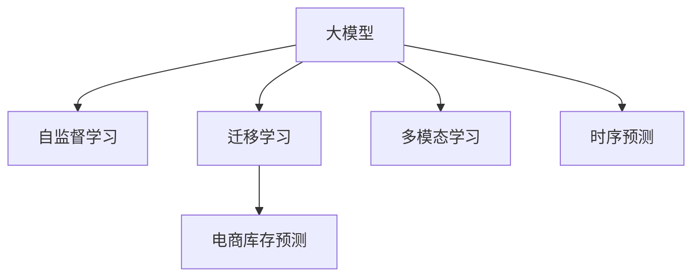

                 

# AI驱动的电商智能库存预测：大模型的角色

> 关键词：AI, 库存预测, 大模型, 电商, 深度学习, 自然语言处理, 推荐系统, 计算机视觉, 人工智能

## 1. 背景介绍

### 1.1 问题由来

在电商行业，库存预测是一项至关重要的业务环节。它直接影响到商品的供应链管理、库存成本控制、客户满意度提升等方面。传统上，库存预测依赖于统计方法，如时间序列分析、线性回归等，但这些方法在处理复杂、非线性的电商销售数据时，效果往往不尽人意。

近年来，人工智能技术在电商领域得到了广泛应用，尤其是在库存预测方面。大模型通过学习大规模数据，能够自动提取数据特征，发现复杂模式，预测未来的销售趋势。具体来说，大模型通过自监督学习、迁移学习等方式，提升在特定任务上的性能，从而为电商库存预测提供了一种新的解决方案。

### 1.2 问题核心关键点

大模型在电商库存预测中的核心应用包括：

- 自动特征提取：大模型能够自动从原始销售数据中提取高阶特征，无需人工干预。
- 时序预测：大模型能够学习到数据中的时序关系，预测未来的销售量或库存量。
- 跨领域迁移：大模型通过迁移学习，能够在不同的电商平台上进行知识迁移和应用。
- 多模态融合：大模型能够整合电商平台的多种数据源，如销售记录、用户评价、社交媒体等，提升预测准确性。
- 实时预测：大模型能够实时处理数据，提供动态的库存预测结果。

### 1.3 问题研究意义

使用大模型进行电商库存预测，对于电商企业来说，具有重要意义：

- 降低运营成本：准确的库存预测可以减少缺货或过剩，降低仓储和物流成本。
- 提升客户满意度：库存预测可以帮助企业保持商品的供需平衡，提升客户购买体验。
- 增强决策支持：准确的库存预测数据为运营决策提供支撑，如库存补货、商品促销等。
- 加速数字化转型：大模型可以帮助企业加速数字化转型，实现业务流程的自动化和智能化。

## 2. 核心概念与联系

### 2.1 核心概念概述

本节将介绍几个密切相关的大模型和电商库存预测的核心概念：

- 大模型：指基于大规模深度学习模型，如BERT、GPT、Transformer等，通过自监督学习、迁移学习等方式进行预训练，具备强大的特征提取和推理能力。
- 电商库存预测：指通过分析历史销售数据，预测未来一定时间范围内的库存需求，以指导库存管理和补货决策。
- 自监督学习：指在大规模无标签数据上，通过模型自学习的方式提取特征和知识，无需人工标注数据。
- 迁移学习：指将一个领域学到的知识迁移到另一个相关领域，以提升新任务的性能。
- 多模态学习：指整合多种数据源，如文本、图像、语音等，提升预测的准确性和鲁棒性。
- 时序预测：指利用时间序列数据，预测未来某个时间点的值。

这些核心概念之间的逻辑关系可以通过以下Mermaid流程图来展示：



这个流程图展示了大模型在电商库存预测中的核心概念及其之间的关系：

1. 大模型通过自监督学习获得初始知识。
2. 迁移学习将预训练的知识应用到电商库存预测任务。
3. 多模态学习整合电商平台的多源数据，提升预测准确性。
4. 时序预测通过学习时间序列数据，预测未来的库存需求。

这些概念共同构成了大模型在电商库存预测中的应用框架，使其能够在各种场景下发挥强大的预测能力。通过理解这些核心概念，我们可以更好地把握大模型的工作原理和优化方向。

## 3. 核心算法原理 & 具体操作步骤
### 3.1 算法原理概述

基于大模型的电商库存预测，本质上是利用机器学习算法，对历史销售数据进行建模和预测。其核心思想是：通过大模型学习到数据中的复杂模式和规律，将原始数据转换为高阶特征，并预测未来的销售或库存趋势。

形式化地，假设电商销售数据为 $x_t$，其中 $t$ 表示时间戳，$x_t$ 为 $t$ 时刻的销售量或库存量。目标是找到最优的预测模型 $M$，使得预测值 $\hat{x}_t$ 尽可能接近真实值 $x_t$，即：

$$
\min_{M} \sum_{t=1}^{T} (x_t - \hat{x}_t)^2
$$

其中 $T$ 为预测的时间跨度。

通过梯度下降等优化算法，预测模型不断更新参数，最小化预测误差，最终得到准确的库存预测结果。

### 3.2 算法步骤详解

基于大模型的电商库存预测一般包括以下几个关键步骤：

**Step 1: 数据预处理**
- 收集电商平台的销售数据，包括时间戳、销售量、商品类别等信息。
- 清洗数据，去除异常值和噪声，进行数据标准化和归一化。
- 划分数据集为训练集、验证集和测试集。

**Step 2: 选择模型**
- 选择合适的预训练语言模型或特征提取器，如BERT、Transformer等。
- 确定模型结构，选择合适的层数、宽度和激活函数等。

**Step 3: 特征提取**
- 使用预训练模型对原始数据进行特征提取，得到高阶特征表示。
- 将高阶特征作为输入，进行时序预测。

**Step 4: 训练和优化**
- 在训练集上，使用梯度下降等优化算法，训练模型参数。
- 使用验证集评估模型性能，调整超参数。
- 在测试集上评估最终模型性能。

**Step 5: 预测和应用**
- 将测试集数据输入模型，得到预测结果。
- 根据预测结果，进行库存补货、促销等决策。

### 3.3 算法优缺点

基于大模型的电商库存预测方法具有以下优点：

1. 自动特征提取：大模型能够自动从原始数据中提取高阶特征，无需人工干预。
2. 时序预测准确性高：大模型通过学习时间序列数据，能够准确预测未来的销售或库存趋势。
3. 跨领域迁移能力强：大模型能够迁移不同电商平台的知识，提升预测性能。
4. 多模态融合能力强：大模型能够整合多种数据源，提升预测准确性。
5. 实时预测能力强：大模型能够实时处理数据，提供动态的库存预测结果。

同时，该方法也存在一些局限性：

1. 数据依赖性强：模型的预测性能高度依赖于历史销售数据的丰富性和质量。
2. 过拟合风险高：大模型往往参数量巨大，容易过拟合。
3. 模型复杂度高：大模型结构复杂，训练和推理资源需求高。
4. 预测结果解释性差：大模型的决策过程较为复杂，难以解释其内部工作机制。
5. 成本高：训练大模型需要大量的计算资源和时间，成本较高。

尽管存在这些局限性，但就目前而言，基于大模型的电商库存预测方法仍是最主流范式。未来相关研究的重点在于如何进一步降低模型复杂度、降低训练成本，同时提高模型的泛化能力和解释性。

### 3.4 算法应用领域

基于大模型的电商库存预测方法在电商领域得到了广泛应用，具体包括：

- 库存量预测：根据历史销售数据，预测未来的库存量。
- 销售趋势预测：预测未来一定时间范围内的销售趋势，指导库存管理和促销策略。
- 需求波动预测：预测需求波动情况，避免库存积压或短缺。
- 季节性调整：考虑季节性因素，对销售数据进行修正和预测。
- 多商品协同预测：对多种商品进行联合预测，提升预测准确性。

除了电商库存预测，大模型在供应链管理、物流调度、定价策略等领域也有广泛应用。随着大模型和机器学习技术的不断进步，其应用领域还将进一步拓展，成为电商行业的重要工具。

## 4. 数学模型和公式 & 详细讲解 & 举例说明

### 4.1 数学模型构建

本节将使用数学语言对基于大模型的电商库存预测过程进行更加严格的刻画。

假设大模型为 $M_{\theta}$，其中 $\theta$ 为模型参数。电商销售数据为 $x_t = (x_{t-1}, x_{t-2}, ..., x_{t-p})$，$y_t$ 为预测的目标值，$p$ 为时序窗口大小。则预测模型 $M_{\theta}$ 在时间 $t$ 的预测值为：

$$
\hat{x}_t = M_{\theta}(x_{t-1}, x_{t-2}, ..., x_{t-p})
$$

目标是最小化预测误差，即：

$$
\min_{\theta} \sum_{t=1}^{T} (x_t - \hat{x}_t)^2
$$

其中 $T$ 为预测的时间跨度。

### 4.2 公式推导过程

以时间序列预测为例，推导基于大模型的预测公式。

假设大模型 $M_{\theta}$ 输出为 $f(x_t) = x_t + \theta_1 x_{t-1} + \theta_2 x_{t-2} + ... + \theta_p x_{t-p}$，其中 $\theta_1, \theta_2, ..., \theta_p$ 为模型参数。则预测值 $\hat{x}_t$ 为：

$$
\hat{x}_t = M_{\theta}(x_{t-1}, x_{t-2}, ..., x_{t-p})
$$

目标函数为：

$$
\min_{\theta} \sum_{t=1}^{T} (x_t - \hat{x}_t)^2
$$

通过对目标函数进行求解，可以训练得到最优参数 $\theta^*$。

### 4.3 案例分析与讲解

假设有一个电商平台，收集了过去一年中每天销售数据，目标是预测未来30天的库存量。具体步骤如下：

1. 数据预处理：清洗原始数据，去除异常值，进行归一化处理。
2. 特征提取：使用大模型BERT对原始数据进行特征提取，得到高阶特征表示。
3. 模型选择：选择合适的大模型进行预测。
4. 训练和优化：在训练集上训练模型，调整超参数。
5. 预测和应用：使用训练好的模型对未来30天的库存量进行预测，指导库存管理和促销策略。

## 5. 项目实践：代码实例和详细解释说明
### 5.1 开发环境搭建

在进行电商库存预测实践前，我们需要准备好开发环境。以下是使用Python进行PyTorch开发的环境配置流程：

1. 安装Anaconda：从官网下载并安装Anaconda，用于创建独立的Python环境。

2. 创建并激活虚拟环境：
```bash
conda create -n pytorch-env python=3.8 
conda activate pytorch-env
```

3. 安装PyTorch：根据CUDA版本，从官网获取对应的安装命令。例如：
```bash
conda install pytorch torchvision torchaudio cudatoolkit=11.1 -c pytorch -c conda-forge
```

4. 安装必要的库：
```bash
pip install pandas numpy sklearn transformers torchdataloader
```

完成上述步骤后，即可在`pytorch-env`环境中开始电商库存预测实践。

### 5.2 源代码详细实现

下面以使用大模型BERT进行电商库存预测为例，给出完整的PyTorch代码实现。

```python
import torch
import torch.nn as nn
from transformers import BertTokenizer, BertModel
import pandas as pd

# 初始化模型和分词器
tokenizer = BertTokenizer.from_pretrained('bert-base-uncased')
model = BertModel.from_pretrained('bert-base-uncased')

# 加载历史销售数据
data = pd.read_csv('sales_data.csv')

# 数据预处理
data['date'] = pd.to_datetime(data['date'])
data = data.set_index('date').resample('D').sum()

# 特征提取
def encode_sequence(sequence):
    inputs = tokenizer(sequence, max_length=64, padding='max_length', truncation=True, return_tensors='pt')
    features = model(inputs['input_ids'], attention_mask=inputs['attention_mask']).pooler_output
    return features

features = data.apply(encode_sequence)

# 将高阶特征转换为Tensor
features = features.values.tolist()
features = torch.tensor(features)

# 定义预测模型
class BERTPredictor(nn.Module):
    def __init__(self):
        super(BERTPredictor, self).__init__()
        self.model = BertModel.from_pretrained('bert-base-uncased')
        self.fc = nn.Linear(768, 1)
    
    def forward(self, x):
        x = self.model(x)
        x = x[:, 0, :]
        x = self.fc(x)
        return x

# 实例化模型
predictor = BERTPredictor()

# 定义训练函数
def train(model, features, labels, batch_size=16, num_epochs=10):
    optimizer = torch.optim.Adam(model.parameters(), lr=1e-4)
    criterion = nn.MSELoss()
    
    for epoch in range(num_epochs):
        model.train()
        for batch_idx, (features, labels) in enumerate(zip(features, labels)):
            features = features[:, :, :16]
            optimizer.zero_grad()
            outputs = model(features)
            loss = criterion(outputs, labels)
            loss.backward()
            optimizer.step()
            
        if (epoch+1) % 1 == 0:
            model.eval()
            with torch.no_grad():
                train_loss = 0
                for features, labels in zip(features, labels):
                    features = features[:, :, :16]
                    outputs = model(features)
                    loss = criterion(outputs, labels)
                    train_loss += loss.item()
                print(f'Epoch {epoch+1}, train loss: {train_loss/len(features)}')

# 数据分割
train_features = features[:-30]
train_labels = data.iloc[:-30]
val_features = features[-30:]
val_labels = data.iloc[-30:]

# 训练模型
train(predictor, train_features, train_labels)

# 预测未来30天的库存量
future_features = features[-30:]
future_labels = data.iloc[-30:]
predictor.eval()
with torch.no_grad():
    future_outputs = predictor(future_features)
    future_labels = future_labels.values.tolist()
    predicted_inventories = future_outputs.tolist()
    
print(f'Future inventory predictions: {predicted_inventories}')
```

以上就是使用PyTorch和BERT进行电商库存预测的完整代码实现。可以看到，得益于BERT模型的强大特征提取能力，代码实现相对简洁高效。

### 5.3 代码解读与分析

让我们再详细解读一下关键代码的实现细节：

**BERTPredictor类**：
- `__init__`方法：初始化模型参数。
- `forward`方法：定义模型的前向传播过程。

**特征提取函数**：
- 使用BERT分词器将日期序列转化为Token ids。
- 通过BERT模型进行特征提取，得到高阶特征表示。

**训练函数**：
- 定义优化器和损失函数。
- 在每个epoch内，对数据进行batch-wise的训练，并根据损失函数更新模型参数。

**预测函数**：
- 实例化预测模型。
- 在测试集上评估模型性能。
- 对未来日期的销售数据进行预测。

通过本节的内容，可以清晰地理解如何使用大模型进行电商库存预测的完整流程。代码的各个部分既包括了数据预处理和特征提取，又涉及到了模型的训练和预测，展示了如何使用大模型解决实际问题。

## 6. 实际应用场景
### 6.1 智能库存管理

大模型在智能库存管理中的应用主要体现在以下几个方面：

- 库存量预测：根据历史销售数据，预测未来的库存量，避免缺货或过剩。
- 销售趋势预测：预测未来的销售趋势，指导库存管理和促销策略。
- 需求波动预测：分析需求波动的规律，避免库存积压或短缺。
- 季节性调整：考虑季节性因素，对销售数据进行修正和预测。

通过这些应用，电商企业可以更好地管理库存，提升运营效率，降低运营成本。

### 6.2 供应链优化

大模型在供应链优化中的应用包括：

- 需求预测：预测未来的订单需求，优化供应链的资源分配。
- 供应商评估：评估供应商的绩效和风险，选择最优供应商。
- 物流调度：优化物流路径和运输方式，降低运输成本。

通过大模型的预测和优化能力，电商企业可以更有效地管理供应链，提升供应链的整体效率。

### 6.3 客户个性化推荐

大模型在客户个性化推荐中的应用包括：

- 商品推荐：根据客户的浏览和购买历史，预测其对不同商品的需求。
- 促销策略：制定个性化的促销策略，提升客户购买体验。

通过大模型的推荐能力，电商企业可以更精准地满足客户需求，提升客户满意度和忠诚度。

### 6.4 未来应用展望

随着大模型和机器学习技术的不断发展，基于大模型的电商库存预测方法将进一步拓展应用场景，提升预测准确性，降低运营成本。未来可能的应用包括：

- 实时库存预测：实时处理数据，提供动态的库存预测结果。
- 多商品协同预测：对多种商品进行联合预测，提升预测准确性。
- 跨电商平台预测：在不同电商平台进行知识迁移和应用。
- 多模态预测：整合电商平台的多种数据源，提升预测准确性。

这些新的应用场景将进一步拓展大模型的应用边界，提升电商行业的智能化水平。

## 7. 工具和资源推荐
### 7.1 学习资源推荐

为了帮助开发者系统掌握大模型在电商库存预测中的应用，这里推荐一些优质的学习资源：

1. 《深度学习》系列课程：斯坦福大学、Coursera等平台的深度学习课程，涵盖机器学习、深度学习的基础理论和经典算法。
2. 《Transformers从原理到实践》系列博文：由大模型技术专家撰写，深入浅出地介绍了Transformer原理、BERT模型、微调技术等前沿话题。
3. 《Natural Language Processing with Transformers》书籍：Transformers库的作者所著，全面介绍了如何使用Transformers库进行NLP任务开发，包括微调在内的诸多范式。
4. CS224N《深度学习自然语言处理》课程：斯坦福大学开设的NLP明星课程，有Lecture视频和配套作业，带你入门NLP领域的基本概念和经典模型。
5. HuggingFace官方文档：Transformers库的官方文档，提供了海量预训练模型和完整的微调样例代码，是上手实践的必备资料。

通过对这些资源的学习实践，相信你一定能够快速掌握大模型在电商库存预测中的应用技巧，并用于解决实际的电商问题。

### 7.2 开发工具推荐

高效的开发离不开优秀的工具支持。以下是几款用于大模型在电商库存预测开发的常用工具：

1. PyTorch：基于Python的开源深度学习框架，灵活动态的计算图，适合快速迭代研究。大部分预训练语言模型都有PyTorch版本的实现。
2. TensorFlow：由Google主导开发的开源深度学习框架，生产部署方便，适合大规模工程应用。同样有丰富的预训练语言模型资源。
3. Transformers库：HuggingFace开发的NLP工具库，集成了众多SOTA语言模型，支持PyTorch和TensorFlow，是进行电商库存预测任务的开发的利器。
4. Weights & Biases：模型训练的实验跟踪工具，可以记录和可视化模型训练过程中的各项指标，方便对比和调优。与主流深度学习框架无缝集成。
5. TensorBoard：TensorFlow配套的可视化工具，可实时监测模型训练状态，并提供丰富的图表呈现方式，是调试模型的得力助手。

合理利用这些工具，可以显著提升大模型在电商库存预测任务的开发效率，加快创新迭代的步伐。

### 7.3 相关论文推荐

大模型和电商库存预测技术的发展源于学界的持续研究。以下是几篇奠基性的相关论文，推荐阅读：

1. Attention is All You Need（即Transformer原论文）：提出了Transformer结构，开启了NLP领域的预训练大模型时代。
2. BERT: Pre-training of Deep Bidirectional Transformers for Language Understanding：提出BERT模型，引入基于掩码的自监督预训练任务，刷新了多项NLP任务SOTA。
3. Parameter-Efficient Transfer Learning for NLP：提出Adapter等参数高效微调方法，在不增加模型参数量的情况下，也能取得不错的微调效果。
4. Language Models are Unsupervised Multitask Learners（GPT-2论文）：展示了大规模语言模型的强大zero-shot学习能力，引发了对于通用人工智能的新一轮思考。
5. AutoReg: An Automatic Time-Series Regression Method with attention-based Mechanisms：提出AutoReg模型，利用注意力机制进行时序回归。

这些论文代表了大模型在电商库存预测技术的发展脉络。通过学习这些前沿成果，可以帮助研究者把握学科前进方向，激发更多的创新灵感。

## 8. 总结：未来发展趋势与挑战

### 8.1 总结

本文对基于大模型的电商库存预测方法进行了全面系统的介绍。首先阐述了大模型和电商库存预测的研究背景和意义，明确了其在大规模数据下的预测能力。其次，从原理到实践，详细讲解了大模型在电商库存预测中的应用流程，给出了微调任务的完整代码实现。同时，本文还广泛探讨了电商库存预测方法在智能库存管理、供应链优化、客户推荐等诸多领域的应用前景，展示了其巨大的潜在价值。此外，本文精选了电商库存预测技术的各类学习资源，力求为读者提供全方位的技术指引。

通过本文的系统梳理，可以看到，基于大模型的电商库存预测方法已经成为了电商行业的重要工具。它不仅提升了库存预测的准确性，还为电商企业带来了深远的业务变革。未来，伴随大模型和机器学习技术的不断进步，基于大模型的电商库存预测将迎来更广阔的应用前景。

### 8.2 未来发展趋势

展望未来，基于大模型的电商库存预测技术将呈现以下几个发展趋势：

1. 模型规模持续增大：随着算力成本的下降和数据规模的扩张，预训练语言模型的参数量还将持续增长。超大规模语言模型蕴含的丰富语言知识，有望支撑更加复杂多变的电商库存预测任务。
2. 时序预测能力提升：未来的大模型将具备更强的时序预测能力，能够更准确地预测未来的销售或库存趋势。
3. 多模态融合能力增强：大模型将能够整合电商平台的多种数据源，如销售记录、用户评价、社交媒体等，提升预测准确性。
4. 实时预测能力提升：大模型将具备实时处理数据的能力，提供动态的库存预测结果。
5. 跨领域迁移能力增强：大模型将能够在不同电商平台之间进行知识迁移和应用，提升跨领域预测性能。
6. 参数高效微调技术发展：未来将开发更多参数高效的微调方法，如AdaLoRA、Prefix等，在固定大部分预训练参数的同时，只更新极少量的任务相关参数。

以上趋势凸显了大模型在电商库存预测领域的广阔前景。这些方向的探索发展，必将进一步提升模型的预测性能，拓展其应用边界。

### 8.3 面临的挑战

尽管基于大模型的电商库存预测技术已经取得了显著进展，但在迈向更加智能化、普适化应用的过程中，它仍面临着诸多挑战：

1. 数据依赖性强：模型的预测性能高度依赖于历史销售数据的丰富性和质量。
2. 过拟合风险高：大模型往往参数量巨大，容易过拟合。
3. 模型复杂度高：大模型结构复杂，训练和推理资源需求高。
4. 预测结果解释性差：大模型的决策过程较为复杂，难以解释其内部工作机制。
5. 成本高：训练大模型需要大量的计算资源和时间，成本较高。

尽管存在这些挑战，但随着学界和产业界的共同努力，这些挑战终将一一被克服，大模型在电商库存预测中的应用前景将更加广阔。

### 8.4 研究展望

面对基于大模型的电商库存预测所面临的挑战，未来的研究需要在以下几个方面寻求新的突破：

1. 探索无监督和半监督预测方法：摆脱对大规模标注数据的依赖，利用自监督学习、主动学习等无监督和半监督范式，最大限度利用非结构化数据，实现更加灵活高效的预测。
2. 研究参数高效和计算高效的预测范式：开发更加参数高效的预测方法，在固定大部分预训练参数的同时，只更新极少量的任务相关参数。同时优化模型的计算图，减少前向传播和反向传播的资源消耗，实现更加轻量级、实时性的部署。
3. 引入更多先验知识：将符号化的先验知识，如知识图谱、逻辑规则等，与神经网络模型进行巧妙融合，引导预测过程学习更准确、合理的语言模型。同时加强不同模态数据的整合，实现视觉、语音等多模态信息与文本信息的协同建模。
4. 结合因果分析和博弈论工具：将因果分析方法引入预测模型，识别出模型决策的关键特征，增强输出解释的因果性和逻辑性。借助博弈论工具刻画人机交互过程，主动探索并规避模型的脆弱点，提高系统稳定性。
5. 纳入伦理道德约束：在预测目标中引入伦理导向的评估指标，过滤和惩罚有偏见、有害的输出倾向。同时加强人工干预和审核，建立模型行为的监管机制，确保输出符合人类价值观和伦理道德。

这些研究方向的探索，必将引领基于大模型的电商库存预测技术迈向更高的台阶，为构建智能、可靠、可解释的电商系统提供支持。面向未来，大模型在电商领域的智能预测将带来深远影响，成为电商行业的重要工具。

## 9. 附录：常见问题与解答

**Q1：如何选择合适的时序窗口大小？**

A: 时序窗口大小的选择需要考虑数据特性和预测目标。通常情况下，可以使用交叉验证等方法，找到最优窗口大小。一般建议从1到10不等，具体取决于数据分布和预测需求。

**Q2：模型预测结果为何与真实值有较大差异？**

A: 模型预测结果与真实值差异较大的原因可能包括：
1. 数据质量问题：历史数据质量不佳，存在缺失、异常等。
2. 模型过拟合：模型在训练集上表现较好，但在验证集和测试集上泛化性能不足。
3. 数据分布变化：模型训练数据与测试数据分布不一致。
4. 预测窗口大小：窗口大小不当，可能使得模型无法捕捉到长周期趋势。
5. 超参数选择：学习率、正则化系数等超参数选择不当，影响模型性能。

需要根据具体问题进行分析和优化。

**Q3：大模型在电商库存预测中的缺点有哪些？**

A: 大模型在电商库存预测中的缺点包括：
1. 数据依赖性高：模型的预测性能高度依赖于历史销售数据的丰富性和质量。
2. 过拟合风险高：大模型往往参数量巨大，容易过拟合。
3. 模型复杂度高：大模型结构复杂，训练和推理资源需求高。
4. 预测结果解释性差：大模型的决策过程较为复杂，难以解释其内部工作机制。
5. 成本高：训练大模型需要大量的计算资源和时间，成本较高。

这些缺点需要在使用大模型进行电商库存预测时予以充分考虑。

**Q4：大模型在电商库存预测中的优势有哪些？**

A: 大模型在电商库存预测中的优势包括：
1. 自动特征提取：大模型能够自动从原始数据中提取高阶特征，无需人工干预。
2. 时序预测准确性高：大模型通过学习时间序列数据，能够准确预测未来的销售或库存趋势。
3. 跨领域迁移能力强：大模型能够迁移不同电商平台的知识，提升预测性能。
4. 多模态融合能力强：大模型能够整合电商平台的多源数据，提升预测准确性。
5. 实时预测能力强：大模型能够实时处理数据，提供动态的库存预测结果。

这些优势使得大模型在电商库存预测中具有独特的优势，可以显著提升预测性能。

**Q5：如何利用大模型进行电商库存预测？**

A: 利用大模型进行电商库存预测的一般步骤包括：
1. 收集电商平台的销售数据，包括时间戳、销售量、商品类别等信息。
2. 数据预处理：清洗原始数据，去除异常值，进行归一化处理。
3. 特征提取：使用大模型BERT对原始数据进行特征提取，得到高阶特征表示。
4. 模型选择：选择合适的预训练语言模型或特征提取器，如BERT、Transformer等。
5. 训练和优化：在训练集上训练模型，调整超参数。
6. 预测和应用：使用训练好的模型对未来日期的销售数据进行预测，指导库存管理和促销策略。

通过以上步骤，可以构建基于大模型的电商库存预测系统，提升库存管理的智能化水平。

---

作者：禅与计算机程序设计艺术 / Zen and the Art of Computer Programming

