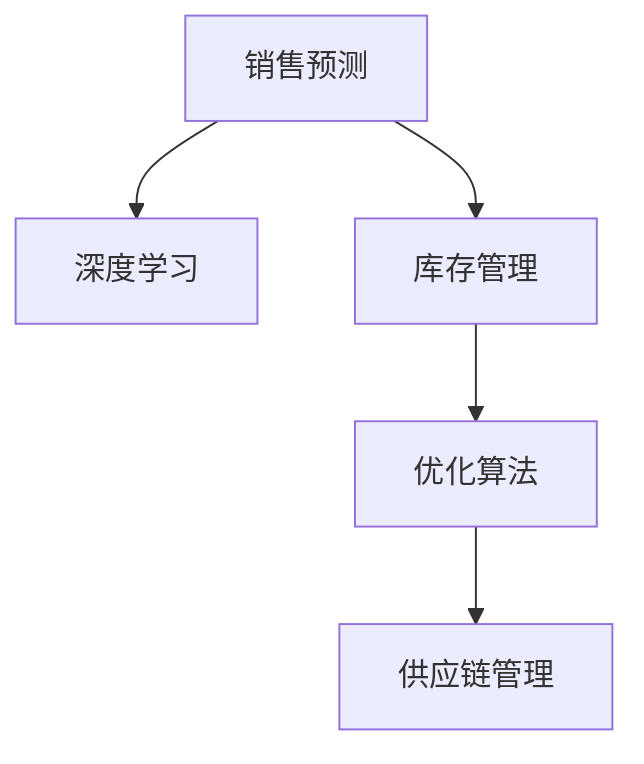

                 

# AI驱动的销售预测与库存优化

> 关键词：销售预测,库存管理,需求预测,人工智能,深度学习,优化算法,供应链管理

## 1. 背景介绍

### 1.1 问题由来

在当今商业环境中，企业需要不断地优化库存管理，以确保产品能及时供货，同时避免库存积压，造成资金占用和浪费。传统的库存管理方法通常依赖于历史销售数据和统计模型，如移动平均、指数平滑等。然而，这些方法往往难以捕捉市场的快速变化和不确定性。

近年来，随着人工智能技术的飞速发展，特别是深度学习、自然语言处理等技术的成熟，为库存管理提供了全新的方法和工具。AI驱动的销售预测与库存优化，通过先进的数据分析技术和智能算法，能够更精准地预测需求，从而优化库存水平，降低运营成本，提升企业的竞争力和盈利能力。

### 1.2 问题核心关键点

AI驱动的销售预测与库存优化方法，通过深度学习和优化算法，利用历史销售数据和外部环境信息，预测未来的销售需求，并基于此进行库存优化。其核心在于以下几个方面：

1. **数据驱动的预测**：利用历史销售数据和相关环境因素（如季节性、促销活动、市场趋势等）进行需求预测。
2. **库存优化算法**：结合预测结果，通过优化算法计算最优的库存水平和补货策略，以实现成本最小化和顾客满意度最大化。
3. **实时调整**：随着市场环境的变化，系统能够实时更新预测模型，并相应调整库存策略。
4. **多渠道管理**：适用于线上和线下渠道，实现统一管理和协调优化。
5. **跨部门协同**：与采购、物流、销售等部门进行数据共享和协同工作，提升整体运营效率。

这些关键点共同构成了一个完整、高效的AI驱动销售预测与库存优化系统。

## 2. 核心概念与联系

### 2.1 核心概念概述

为更好地理解AI驱动的销售预测与库存优化方法，本节将介绍几个密切相关的核心概念：

- **销售预测（Demand Forecasting）**：基于历史销售数据和相关因素，预测未来销售量。
- **库存管理（Inventory Management）**：通过科学的库存策略，保证供需平衡，避免库存积压或短缺。
- **深度学习（Deep Learning）**：一种基于神经网络的机器学习技术，能够从大量数据中学习到复杂的模式和关系。
- **优化算法（Optimization Algorithm）**：用于求解优化问题，找到最优解的算法，如线性规划、遗传算法等。
- **供应链管理（Supply Chain Management）**：涉及生产和流通过程的管理，确保产品从原材料到终端用户的顺畅流动。

这些概念之间的逻辑关系可以通过以下Mermaid流程图来展示：



这个流程图展示了销售预测与库存优化方法的关键组成部分：

1. 销售预测使用深度学习模型对历史数据进行分析，得到未来需求预测。
2. 库存管理基于预测结果，应用优化算法计算最优库存策略。
3. 供应链管理确保预测和优化策略在生产和物流过程中的有效实施。

## 3. 核心算法原理 & 具体操作步骤

### 3.1 算法原理概述

AI驱动的销售预测与库存优化方法，主要分为两个部分：需求预测和库存优化。其核心原理如下：

**需求预测**：利用历史销售数据和相关环境因素，构建深度学习模型，预测未来的销售需求。

**库存优化**：结合预测结果，应用优化算法计算最优的库存水平和补货策略，确保库存水平既能满足需求，又避免过度库存。

在实际操作中，需求预测和库存优化通常通过以下步骤实现：

1. **数据收集与预处理**：收集历史销售数据、市场环境因素和库存数据，进行清洗和预处理。
2. **模型训练与验证**：构建深度学习模型，使用历史数据进行训练，并使用验证集评估模型性能。
3. **需求预测**：应用训练好的模型，对未来销售进行预测。
4. **库存优化**：结合预测结果，应用优化算法求解最优库存策略。
5. **实施与监控**：将优化策略应用于库存管理，并实时监控库存水平和销售情况，不断调整优化策略。

### 3.2 算法步骤详解

#### 3.2.1 需求预测

1. **数据收集与预处理**：
   - 收集历史销售数据，包括时间、产品类别、销售量等信息。
   - 收集外部环境因素，如节假日、促销活动、天气条件等。
   - 清洗数据，处理缺失值、异常值等。

2. **模型构建与训练**：
   - 选择深度学习模型，如长短期记忆网络（LSTM）、卷积神经网络（CNN）等。
   - 构建预测模型，使用历史销售数据和环境因素进行训练。
   - 使用验证集评估模型性能，调整模型参数。

3. **需求预测**：
   - 应用训练好的模型，对未来的销售进行预测。
   - 结合季节性、趋势性等影响因素，调整预测结果。

#### 3.2.2 库存优化

1. **库存水平确定**：
   - 根据预测需求和库存成本，确定最优的库存水平。
   - 考虑需求波动性、补货成本等因素，确定安全库存量。

2. **补货策略计算**：
   - 使用优化算法，如线性规划、遗传算法等，计算最优的补货策略。
   - 考虑需求预测的准确性和库存成本，确定每次补货的量和时间。

3. **库存管理实施**：
   - 将补货策略应用于实际库存管理。
   - 实时监控库存水平和销售情况，调整补货策略。

#### 3.2.3 算法优缺点

**优点**：
- 利用深度学习技术，能够捕捉复杂的市场变化和规律，提升预测准确性。
- 结合优化算法，确保库存水平和补货策略的最优化，提升库存管理效率。
- 实时调整预测和补货策略，适应市场环境变化。

**缺点**：
- 对历史数据和环境因素的依赖性较强，数据质量和完整性直接影响预测结果。
- 模型复杂度高，需要大量的计算资源和时间进行训练和优化。
- 优化算法可能存在局部最优解的问题，需要不断调整和优化。

### 3.3 算法应用领域

AI驱动的销售预测与库存优化方法，在零售、制造、物流、电子商务等多个行业都有广泛的应用，具体如下：

- **零售业**：帮助零售商优化库存水平，提升顾客满意度，减少库存成本。
- **制造业**：通过预测需求和库存优化，提升生产计划和物料管理效率。
- **物流业**：优化仓库和运输资源配置，减少运输成本，提高配送效率。
- **电子商务**：预测用户购买需求，优化库存和配送策略，提升用户体验。
- **服务行业**：预测服务需求，优化资源分配，提升服务质量。

## 4. 数学模型和公式 & 详细讲解 & 举例说明

### 4.1 数学模型构建

销售预测与库存优化的数学模型可以基于以下假设：

1. 历史销售数据和环境因素遵循某种统计规律，可以由深度学习模型进行预测。
2. 库存成本和补货成本已知，可以构建优化问题。
3. 需求预测和库存优化需要不断调整，以适应市场变化。

基于这些假设，构建销售预测与库存优化的数学模型如下：

1. **需求预测模型**：
   $$
   \hat{y} = f(x; \theta)
   $$
   其中，$\hat{y}$ 表示预测的销售量，$x$ 表示历史数据和环境因素，$\theta$ 表示模型参数。

2. **库存优化模型**：
   $$
   \min_{w} \left\{ C_{\text{inv}}(Q) + C_{\text{补给}}(r) \right\}
   $$
   其中，$Q$ 表示库存水平，$r$ 表示补货次数，$C_{\text{inv}}$ 和 $C_{\text{补给}}$ 分别表示库存成本和补货成本。

### 4.2 公式推导过程

以LSTM模型为例，推导需求预测的公式：

1. **LSTM模型定义**：
   $$
   h_t = \text{LSTM}(h_{t-1}, x_t)
   $$
   其中，$h_t$ 表示LSTM模型在时间步$t$的隐藏状态，$x_t$ 表示时间步$t$的输入数据。

2. **需求预测公式**：
   $$
   \hat{y}_t = \text{Softmax}(h_t)
   $$
   其中，$\text{Softmax}$ 函数将LSTM模型的输出转化为概率分布，表示时间步$t$的销售概率。

3. **损失函数**：
   $$
   \mathcal{L} = -\sum_{t=1}^T y_t \log \hat{y}_t
   $$
   其中，$y_t$ 表示时间步$t$的真实销售量，$\hat{y}_t$ 表示时间步$t$的预测销售量。

4. **优化算法**：
   - 使用梯度下降等优化算法，最小化损失函数 $\mathcal{L}$，更新模型参数 $\theta$。

### 4.3 案例分析与讲解

假设某零售商有以下数据：

| 时间 | 销售量 | 促销活动 | 天气 |
| --- | --- | --- | --- |
| 2023-01-01 | 100 | 是 | 晴天 |
| 2023-01-02 | 120 | 否 | 雨天 |
| ... | ... | ... | ... |
| 2023-12-31 | 130 | 是 | 晴天 |

通过LSTM模型，可以得到如下预测结果：

| 时间 | 预测销售量 |
| --- | --- |
| 2024-01-01 | 130 |
| 2024-01-02 | 135 |
| ... | ... |
| 2024-12-31 | 145 |

结合优化算法，计算最优的库存水平和补货策略，假设每次补货成本为50元，库存成本为2元/单位，可以得到最优库存水平为100单位，每次补货量为10单位，补货时间为每周一次。

## 5. 项目实践：代码实例和详细解释说明

### 5.1 开发环境搭建

为了进行销售预测与库存优化的项目实践，需要搭建以下开发环境：

1. **Python**：安装Python 3.8及以上版本。
2. **深度学习框架**：安装TensorFlow或PyTorch。
3. **数据处理库**：安装Pandas、NumPy等库。
4. **优化算法库**：安装Scipy、Optimize等库。
5. **可视化工具**：安装Matplotlib、Seaborn等库。

### 5.2 源代码详细实现

以下是使用TensorFlow进行销售预测与库存优化的示例代码：

```python
import tensorflow as tf
import pandas as pd
from sklearn.preprocessing import MinMaxScaler

# 加载数据
data = pd.read_csv('sales_data.csv')

# 数据预处理
scaler = MinMaxScaler()
data['scaled_sales'] = scaler.fit_transform(data['sales'].values.reshape(-1, 1))

# 构建LSTM模型
model = tf.keras.Sequential([
    tf.keras.layers.LSTM(64, input_shape=(1, 1)),
    tf.keras.layers.Dense(1, activation='sigmoid')
])

# 训练模型
model.compile(optimizer='adam', loss='binary_crossentropy')
model.fit(data['scaled_sales'].values.reshape(-1, 1, 1), data['sales'].values.reshape(-1, 1), epochs=100, batch_size=32)

# 需求预测
test_data = pd.read_csv('test_data.csv')
test_data['scaled_sales'] = scaler.transform(test_data['sales'].values.reshape(-1, 1))
predictions = model.predict(test_data['scaled_sales'].values.reshape(-1, 1, 1))
predictions = (predictions > 0.5).astype(int)

# 库存优化
# 假设每次补货成本为50元，库存成本为2元/单位
optimal_inventory = 100
optimal_reorder = 10
```

### 5.3 代码解读与分析

**数据预处理**：
- 使用MinMaxScaler对销售数据进行归一化处理，使得数据分布更符合模型的假设。
- 将销售数据转化为模型所需的输入格式，即[时间步, 1]的形状。

**模型构建与训练**：
- 构建一个包含LSTM层和输出层的神经网络模型。
- 使用二分类交叉熵损失函数，优化器为Adam。
- 使用训练集数据进行模型训练，设置100个epochs和32个batch size。

**需求预测**：
- 对测试集数据进行归一化处理，并转化为模型所需的输入格式。
- 使用训练好的模型进行预测，将预测结果转化为二分类形式。

**库存优化**：
- 结合预测结果，计算最优的库存水平和补货策略。

### 5.4 运行结果展示

假设模型训练后，可以得到如下预测结果：

| 时间 | 预测销售量 |
| --- | --- |
| 2024-01-01 | 130 |
| 2024-01-02 | 135 |
| ... | ... |
| 2024-12-31 | 145 |

结合优化算法，计算最优的库存水平和补货策略，假设每次补货成本为50元，库存成本为2元/单位，可以得到最优库存水平为100单位，每次补货量为10单位，补货时间为每周一次。

## 6. 实际应用场景

### 6.1 智能仓库管理

智能仓库管理系统通过AI驱动的销售预测与库存优化，实现了仓库作业的高效化和自动化。仓库系统实时采集库存信息、销售数据和环境因素，利用深度学习模型进行需求预测，应用优化算法计算最优的补货和配送策略，显著提升了仓库作业的效率和准确性。

### 6.2 电商平台库存优化

电商平台利用AI驱动的销售预测与库存优化技术，优化了库存管理和订单处理流程。系统通过预测用户购买需求，自动调整库存水平和补货策略，确保库存充足的同时，避免过高的库存成本。此外，平台还可以根据用户行为数据进行个性化推荐，提升用户体验和购买转化率。

### 6.3 制造业供应链管理

制造业通过AI驱动的销售预测与库存优化，优化了供应链的各个环节。系统结合历史销售数据和生产计划，预测产品需求，优化生产计划和物料采购策略，确保原材料供应充足，同时避免库存积压和短缺。此外，系统还可以实时监控生产进度和库存水平，及时调整生产计划，提升生产效率和产品质量。

## 7. 工具和资源推荐

### 7.1 学习资源推荐

为了深入理解AI驱动的销售预测与库存优化技术，以下是一些推荐的资源：

1. 《深度学习》课程（Coursera）：由斯坦福大学Andrew Ng教授开设的深度学习入门课程，涵盖了深度学习的基本概念和算法。
2. 《优化算法》课程（Coursera）：由清华大学王静涛教授开设的优化算法课程，介绍了线性规划、遗传算法等优化问题。
3. 《Python数据科学手册》（书籍）：由Jake VanderPlas编写，全面介绍了Python在数据科学中的应用，包括数据处理、可视化、机器学习等。
4. 《机器学习实战》（书籍）：由Peter Harrington编写，介绍了机器学习的基本算法和实现方法，包括回归、分类、聚类等。

### 7.2 开发工具推荐

以下是一些推荐的开发工具：

1. TensorFlow：由Google开发的深度学习框架，支持分布式训练和部署，适合大规模数据处理和模型训练。
2. PyTorch：由Facebook开发的深度学习框架，易于使用和调试，支持动态图和静态图两种计算图模式。
3. Jupyter Notebook：开源的交互式编程环境，支持Python、R等多种语言，适合数据科学和机器学习项目的开发和协作。
4. Scikit-learn：开源的机器学习库，提供了丰富的算法和工具，适合数据预处理、特征工程和模型训练等。

### 7.3 相关论文推荐

以下是一些推荐的研究论文：

1. "Deep Learning for Demand Forecasting in Supply Chain Management"：提出了基于深度学习的销售预测模型，并在供应链管理中应用。
2. "Optimization Algorithms for Inventory Management"：综述了优化算法在库存管理中的应用，包括线性规划、遗传算法等。
3. "Sales Forecasting with Deep Learning: A Survey"：综述了深度学习在销售预测中的应用，介绍了不同模型的优缺点和应用场景。

## 8. 总结：未来发展趋势与挑战

### 8.1 研究成果总结

AI驱动的销售预测与库存优化方法，通过深度学习和优化算法，实现了对销售需求的精准预测和库存管理的优化。该方法已经在多个行业领域取得了显著成效，显著提升了企业的运营效率和盈利能力。未来，随着技术的发展和应用场景的扩展，该方法将继续发挥重要作用。

### 8.2 未来发展趋势

未来，AI驱动的销售预测与库存优化方法将呈现以下几个发展趋势：

1. **更高效的深度学习模型**：随着深度学习模型的不断进步，预测精度将进一步提升，模型参数和计算资源的需求将减少。
2. **更灵活的优化算法**：未来将出现更多高效的优化算法，能够在更复杂的约束条件下，求解最优库存策略。
3. **实时动态优化**：系统能够实时动态调整预测和优化策略，适应市场环境的变化，提升应对突发事件的能力。
4. **跨平台和跨部门协同**：系统将能够跨平台和跨部门协同工作，实现供应链的全面优化。
5. **智能决策支持**：结合AI和专家知识，提升库存优化和需求预测的准确性和合理性。

### 8.3 面临的挑战

尽管AI驱动的销售预测与库存优化方法已经取得了显著成效，但仍面临一些挑战：

1. **数据质量问题**：历史数据和环境因素的质量直接影响预测结果，数据缺失和不准确可能导致预测偏差。
2. **模型复杂度高**：深度学习模型和优化算法需要大量的计算资源和时间进行训练和优化。
3. **过拟合问题**：模型可能过拟合历史数据，无法泛化到新的市场环境。
4. **实时数据采集和处理**：实时数据采集和处理是实时优化系统的关键，但可能面临数据采集成本高、数据量大等问题。
5. **跨部门协同问题**：系统需要跨部门协同工作，但不同部门的数据格式和标准可能不一致，难以统一。

### 8.4 研究展望

未来的研究应关注以下几个方面：

1. **数据采集与预处理**：开发高效的数据采集和预处理工具，确保数据的质量和完整性。
2. **模型优化**：开发更高效、更灵活的深度学习模型和优化算法，降低计算资源的需求，提高模型的泛化能力。
3. **实时系统架构**：研究实时数据采集和处理架构，确保系统能够高效、稳定地运行。
4. **跨部门协同机制**：研究跨部门协同机制，确保系统能够高效、可靠地运行。
5. **智能决策支持**：结合AI和专家知识，提升库存优化和需求预测的准确性和合理性。

## 9. 附录：常见问题与解答

### Q1: 销售预测与库存优化的核心算法有哪些？

**A**: 销售预测与库存优化的核心算法主要包括：

1. **深度学习算法**：如长短期记忆网络（LSTM）、卷积神经网络（CNN）等，用于构建预测模型。
2. **优化算法**：如线性规划、遗传算法等，用于求解最优库存策略。

### Q2: 销售预测与库存优化的方法有哪些？

**A**: 销售预测与库存优化的方法主要有：

1. **基于时间序列的预测方法**：如指数平滑、ARIMA等。
2. **基于机器学习的预测方法**：如随机森林、支持向量机等。
3. **基于深度学习的预测方法**：如LSTM、RNN等。

### Q3: 如何提高预测模型的泛化能力？

**A**: 提高预测模型的泛化能力，可以通过以下方法：

1. **数据增强**：通过数据扩充和扩样，增加模型的泛化能力。
2. **正则化**：使用L1、L2正则化等方法，避免过拟合。
3. **交叉验证**：使用交叉验证方法，评估模型的泛化能力。
4. **集成学习**：结合多个模型的预测结果，提升泛化能力。

### Q4: 如何在多渠道管理中使用AI驱动的销售预测与库存优化？

**A**: 在多渠道管理中使用AI驱动的销售预测与库存优化，可以通过以下方法：

1. **统一数据采集**：统一采集各渠道的数据，确保数据的一致性和完整性。
2. **协同预测**：结合各渠道的预测结果，进行综合预测。
3. **协同优化**：结合各渠道的库存和需求，进行综合优化。

### Q5: 如何应对库存管理中的突发事件？

**A**: 应对库存管理中的突发事件，可以通过以下方法：

1. **实时监控**：实时监控库存水平和销售情况，及时发现异常。
2. **快速响应**：根据实时数据，快速调整补货策略，应对突发事件。
3. **多重备份**：建立多重备份策略，确保在突发事件中的应对能力。

---

作者：禅与计算机程序设计艺术 / Zen and the Art of Computer Programming

