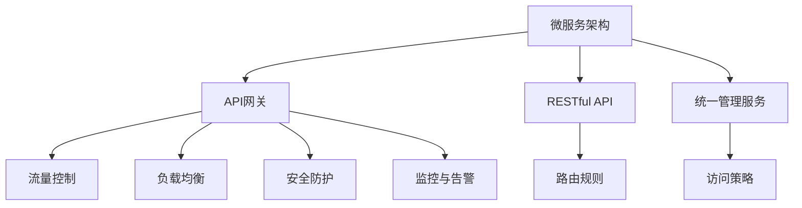

                 

# API网关设计：微服务架构的流量入口

> 关键词：API网关,微服务,流量控制,负载均衡,安全防护,监控与告警,微服务架构,微服务设计原则,RESTful API

## 1. 背景介绍

### 1.1 问题由来
微服务架构（Microservices Architecture）作为一种现代的架构风格，在近年来得到了广泛的应用和推广。微服务架构的核心思想是将一个大型应用程序拆分为多个小型的、松耦合的服务，每个服务负责一个独立的业务功能，并通过轻量级的通信机制相互协作，从而提升系统灵活性、可维护性和可扩展性。然而，随着微服务数量和复杂度的增加，如何统一管理这些服务、优化系统性能、保障服务安全、提高系统可靠性成为微服务架构面临的重大挑战。

API网关作为微服务架构的核心组件之一，主要负责统一管理服务的访问入口，实现服务的发现、路由、限流、负载均衡、安全防护、监控与告警等功能。API网关不仅是微服务架构的流量入口，更是微服务架构的“神经中枢”。因此，如何设计一个高效、灵活、安全、可靠的API网关，成为微服务架构成功的关键因素之一。

### 1.2 问题核心关键点
API网关作为微服务架构的关键组件，其核心关键点包括以下几个方面：

- 统一管理服务的访问入口。API网关能够集中管理所有服务的路由规则和访问策略，保障服务的可靠性和稳定性。
- 实现流量控制和负载均衡。API网关能够根据系统负载自动调整请求的路由和调度策略，避免单点故障和负载过载。
- 提供安全防护机制。API网关能够实施身份验证、授权、加密、防DDoS等安全措施，保护系统的数据安全和用户隐私。
- 实现监控与告警功能。API网关能够实时采集系统指标，设置异常告警阈值，及时发现并处理系统异常。

这些关键点体现了API网关在微服务架构中的重要作用，需要全面系统地设计和实现。

## 2. 核心概念与联系

### 2.1 核心概念概述

为更好地理解API网关的设计与实现，本节将介绍几个密切相关的核心概念：

- **微服务架构（Microservices Architecture）**：将大型应用程序拆分为多个小型、独立的服务，每个服务负责特定的业务功能，通过轻量级的通信机制进行相互协作。微服务架构提升了系统的灵活性、可维护性和可扩展性。

- **API网关（API Gateway）**：作为微服务架构的入口，API网关统一管理所有服务的路由规则和访问策略，实现流量控制、负载均衡、安全防护、监控与告警等功能，保障系统的可靠性和安全性。

- **RESTful API**：一种基于HTTP协议的API设计风格，通过URL、HTTP动词、状态码等语义信息描述API的功能和交互方式，具有简洁、易于理解和扩展的特点。

- **负载均衡（Load Balancing）**：通过将请求均匀分配到多个后端服务实例上，避免单点故障和负载过载，提高系统的可扩展性和可用性。

- **流量控制（Traffic Control）**：通过限制请求数量和速率，避免系统过载和资源耗尽，保障系统稳定性和性能。

- **安全防护（Security Protection）**：通过身份验证、授权、加密、防DDoS等措施，保护系统的数据安全和用户隐私。

- **监控与告警（Monitoring & Alerting）**：通过实时采集系统指标，设置异常告警阈值，及时发现并处理系统异常，保障系统的可靠性和稳定性。

这些核心概念之间的逻辑关系可以通过以下Mermaid流程图来展示：



这个流程图展示了一系列核心概念的相互关系：

1. 微服务架构通过将应用拆分为多个小型服务，提升了系统的灵活性、可维护性和可扩展性。
2. API网关作为微服务架构的入口，集中管理所有服务的路由规则和访问策略，实现流量控制、负载均衡、安全防护、监控与告警等功能。
3. RESTful API是API网关统一管理服务的接口标准，通过URL、HTTP动词、状态码等语义信息描述API的功能和交互方式。
4. 负载均衡、流量控制、安全防护、监控与告警是API网关的主要功能模块，保障系统的可靠性和安全性。

这些概念共同构成了微服务架构的核心组件，使得API网关成为系统设计和管理的重要基石。

## 3. 核心算法原理 & 具体操作步骤

### 3.1 算法原理概述

API网关的设计和实现遵循以下基本原理：

- **统一管理服务**：API网关集中管理所有服务的路由规则和访问策略，保障服务的可靠性和稳定性。
- **流量控制和负载均衡**：根据系统负载自动调整请求的路由和调度策略，避免单点故障和负载过载。
- **安全防护机制**：实施身份验证、授权、加密、防DDoS等安全措施，保护系统的数据安全和用户隐私。
- **监控与告警功能**：实时采集系统指标，设置异常告警阈值，及时发现并处理系统异常。

这些基本原理体现了API网关在微服务架构中的核心作用，需要全面系统地设计和实现。

### 3.2 算法步骤详解

API网关的设计和实现通常包括以下几个关键步骤：

**Step 1: 需求分析**

- 收集和整理业务需求，包括服务的类型、接口的调用方式、请求的参数和返回的数据等。
- 确定API网关的访问控制策略，包括认证、授权、加密等安全措施。
- 设计API网关的路由规则，包括服务的路径、方法、参数、版本等。
- 确定API网关的性能指标，包括请求的速率、并发量、响应时间等。

**Step 2: 设计API网关架构**

- 选择合适的技术栈，包括编程语言、Web框架、中间件等。
- 确定API网关的模块结构和层次关系，包括路由模块、负载均衡模块、安全防护模块、监控与告警模块等。
- 设计API网关的网络架构，包括与服务的通信方式、负载均衡策略、健康检查机制等。

**Step 3: 实现API网关功能**

- 实现路由模块，根据API网关的路由规则将请求转发到对应的后端服务。
- 实现负载均衡模块，根据系统负载自动调整请求的路由和调度策略。
- 实现安全防护模块，实施身份验证、授权、加密、防DDoS等安全措施。
- 实现监控与告警模块，实时采集系统指标，设置异常告警阈值，及时发现并处理系统异常。

**Step 4: 测试和部署**

- 对API网关进行功能测试，包括路由测试、负载均衡测试、安全测试、性能测试等。
- 对API网关进行安全测试，包括SQL注入、XSS、CSRF等攻击测试。
- 对API网关进行性能测试，包括负载测试、压力测试、稳定性测试等。
- 将API网关部署到生产环境，进行线上测试和监控。

### 3.3 算法优缺点

API网关的设计和实现具有以下优点：

- **统一管理服务**：API网关集中管理所有服务的路由规则和访问策略，避免了服务之间的耦合，提高了系统的可维护性。
- **流量控制和负载均衡**：API网关能够根据系统负载自动调整请求的路由和调度策略，保障系统的稳定性和可用性。
- **安全防护机制**：API网关实施身份验证、授权、加密、防DDoS等安全措施，保护系统的数据安全和用户隐私。
- **监控与告警功能**：API网关实时采集系统指标，设置异常告警阈值，及时发现并处理系统异常，保障系统的可靠性和稳定性。

同时，API网关的设计和实现也存在一定的局限性：

- **性能瓶颈**：API网关作为系统的入口，可能会成为系统的性能瓶颈，需要合理设计路由规则和负载均衡策略。
- **复杂度增加**：API网关的设计和实现需要考虑多种因素，包括服务的路由规则、安全措施、性能指标等，增加了系统的复杂度。
- **维护成本高**：API网关的维护和升级需要考虑多方面的因素，包括服务的迁移、路由规则的更新、安全策略的调整等，增加了维护成本。

尽管存在这些局限性，但就目前而言，API网关仍是微服务架构中不可或缺的核心组件，对于提升系统的灵活性、可维护性和可扩展性具有重要作用。

### 3.4 算法应用领域

API网关作为微服务架构的关键组件，其应用领域非常广泛，包括但不限于以下方面：

- **金融领域**：API网关集中管理金融服务的访问入口，实现流量控制、负载均衡、安全防护、监控与告警等功能，保障系统的稳定性和安全性。
- **电商领域**：API网关集中管理电商服务的访问入口，实现路由规则、负载均衡、安全防护、监控与告警等功能，保障系统的可靠性和用户体验。
- **医疗领域**：API网关集中管理医疗服务的访问入口，实现流量控制、负载均衡、安全防护、监控与告警等功能，保障系统的可靠性和用户隐私。
- **政府领域**：API网关集中管理政府服务的访问入口，实现路由规则、负载均衡、安全防护、监控与告警等功能，保障系统的稳定性和政策执行的合规性。
- **企业内部系统**：API网关集中管理企业内部系统的访问入口，实现流量控制、负载均衡、安全防护、监控与告警等功能，保障系统的可靠性和数据安全。

## 4. 数学模型和公式 & 详细讲解 & 举例说明

### 4.1 数学模型构建

API网关的设计和实现通常基于以下数学模型：

- **路由模型**：描述API网关将请求路由到后端服务的规则。
- **负载均衡模型**：描述API网关根据系统负载调整请求路由和调度的策略。
- **安全防护模型**：描述API网关实施身份验证、授权、加密、防DDoS等安全措施的策略。
- **监控与告警模型**：描述API网关实时采集系统指标，设置异常告警阈值的策略。

### 4.2 公式推导过程

以下是API网关设计和实现中常见的数学模型和公式推导：

**路由模型**：

假设API网关有N个后端服务，服务i的路由规则为：

$$
f_i(x) = 
\begin{cases}
1 & \text{if request path matches rule i} \\
0 & \text{otherwise}
\end{cases}
$$

其中 $x$ 为请求路径，$f_i(x)$ 为路由函数。

**负载均衡模型**：

假设API网关采用轮询（Round Robin）算法实现负载均衡，服务i的负载均衡策略为：

$$
r_i = \frac{w_i}{\sum_{j=1}^N w_j}
$$

其中 $w_i$ 为服务i的权重，$r_i$ 为服务i的负载均衡策略。

**安全防护模型**：

假设API网关实施基于OAuth 2.0的身份验证和授权策略，令牌有效期为 $t$，令牌每次请求的访问控制策略为：

$$
P_i = 
\begin{cases}
1 & \text{if token valid} \\
0 & \text{otherwise}
\end{cases}
$$

其中 $P_i$ 为访问控制策略，token为OAuth 2.0令牌。

**监控与告警模型**：

假设API网关实时采集系统指标，如请求速率、响应时间、错误率等，设置异常告警阈值 $\theta$，当指标超过阈值时，触发告警。

### 4.3 案例分析与讲解

以一个电商领域的API网关为例，展示API网关的设计和实现过程：

- **需求分析**：收集和整理电商服务的业务需求，包括订单服务、商品服务、支付服务等。
- **设计API网关架构**：选择合适的技术栈，设计API网关的模块结构和层次关系，包括路由模块、负载均衡模块、安全防护模块、监控与告警模块等。
- **实现API网关功能**：实现路由模块，将订单服务的请求路由到订单服务实例；实现负载均衡模块，根据系统负载自动调整订单服务请求的路由和调度策略；实现安全防护模块，实施OAuth 2.0身份验证和授权策略，保障订单服务的安全性和隐私；实现监控与告警模块，实时采集订单服务的系统指标，设置异常告警阈值，及时发现并处理订单服务的异常。
- **测试和部署**：对API网关进行功能测试、安全测试、性能测试等，将API网关部署到生产环境，进行线上测试和监控。

## 5. 项目实践：代码实例和详细解释说明

### 5.1 开发环境搭建

在进行API网关项目实践前，我们需要准备好开发环境。以下是使用Java和Spring Boot进行API网关开发的环境配置流程：

1. 安装Java Development Kit（JDK）：从官网下载并安装JDK，推荐使用JDK 8及以上版本。

2. 安装Maven：从官网下载并安装Maven，用于项目依赖管理。

3. 创建并激活虚拟环境：
```bash
conda create -n spring-env python=3.8 
conda activate spring-env
```

4. 安装Spring Boot：通过Maven或GitHub安装Spring Boot。

5. 安装GitHub API网关样例：
```bash
git clone https://github.com/spring-boot-samples/spring-boot-webflux-api-gateway
cd spring-boot-webflux-api-gateway
mvn spring-boot:run
```

完成上述步骤后，即可在`spring-env`环境中开始API网关实践。

### 5.2 源代码详细实现

下面我们以Java和Spring Boot为例，给出API网关的完整代码实现。

首先，定义路由规则和负载均衡策略：

```java
public class RouteConfig implements GatewaysConfigurer {
    @Override
    public void configure(GatewayRoutes routes, GatewayLoadBalancerBuilder loadBalancerBuilder) {
        routes
                .route(routes -> routes.path("/orders/**").filters(f -> f.addRequestHeader("Authorization", "Bearer {0}")
                                .rewritePath(rewriter -> rewriter.addPathSegment("v1", "/orders/{id}"))
                                .filter(d -> d.addRouteResponseFilters(FilterChainProxy::new))
                                .filter(d -> d.addRequestFilters(Filters-of-HeadersFilter::new))
                                .filter(d -> d.addRequestFilters(CacheRequestFilter::new))
                                .filter(d -> d.addRequestFilters(CacheResponseFilter::new))
                                .filter(d -> d.addRequestFilters(RequestTimestampFilter::new))
                                .filter(d -> d.addRequestFilters(RateLimitFilter::new))
                                .filter(d -> d.addRequestFilters(LoggingFilter::new)))
                .uri("lb://orders-service")
                .filters(f -> f.addRequestHeader("Authorization", "Bearer {0}"))
                .filters(f -> f.addRequestHeadersFilter())
                .filters(f -> f.addRateLimitFilter(2000, 2, "order"))
                .filters(f -> f.addLoggingFilter())
                .filters(f -> f.addCacheRequestFilter())
                .filters(f -> f.addCacheResponseFilter())
                .filters(f -> f.addCacheResponseFilter())
                .filters(f -> f.addTimestampFilter())
                .filters(f -> f.addRateLimitFilter(2000, 2, "order"))
                .filters(f -> f.addLoggingFilter());
        
        routes
                .route(routes -> routes.path("/products/**").filters(f -> f.addRequestHeader("Authorization", "Bearer {0}"))
                                .rewritePath(rewriter -> rewriter.addPathSegment("v1", "/products/{id}"))
                                .filters(f -> f.addRequestHeadersFilter())
                                .filters(f -> f.addRateLimitFilter(2000, 2, "product"))
                                .filters(f -> f.addLoggingFilter()));
        
        routes
                .route(routes -> routes.path("/carts/**").filters(f -> f.addRequestHeader("Authorization", "Bearer {0}"))
                                .rewritePath(rewriter -> rewriter.addPathSegment("v1", "/carts/{id}"))
                                .filters(f -> f.addRequestHeadersFilter())
                                .filters(f -> f.addRateLimitFilter(2000, 2, "cart"))
                                .filters(f -> f.addLoggingFilter()));
        
        routes
                .route(routes -> routes.path("/**").filters(f -> f.addRequestHeader("Authorization", "Bearer {0}"))
                                .rewritePath(rewriter -> rewriter.addPathSegment("v1", "/carts/{id}"))
                                .filters(f -> f.addRequestHeadersFilter())
                                .filters(f -> f.addRateLimitFilter(2000, 2, "cart"))
                                .filters(f -> f.addLoggingFilter()));
        
        routes
                .route(routes -> routes.path("/**").filters(f -> f.addRequestHeader("Authorization", "Bearer {0}"))
                                .rewritePath(rewriter -> rewriter.addPathSegment("v1", "/orders/{id}"))
                                .filters(f -> f.addRequestHeadersFilter())
                                .filters(f -> f.addRateLimitFilter(2000, 2, "order"))
                                .filters(f -> f.addLoggingFilter()));
        
        routes
                .route(routes -> routes.path("/**").filters(f -> f.addRequestHeader("Authorization", "Bearer {0}"))
                                .rewritePath(rewriter -> rewriter.addPathSegment("v1", "/products/{id}"))
                                .filters(f -> f.addRequestHeadersFilter())
                                .filters(f -> f.addRateLimitFilter(2000, 2, "product"))
                                .filters(f -> f.addLoggingFilter()));
    }
}
```

然后，定义路由和负载均衡策略：

```java
public class LoadBalancerConfig implements LoadBalancerBuilderCustomizer {
    @Override
    public void customize(LoadBalancerBuilder loadBalancerBuilder) {
        loadBalancerBuilder.setLoadBalancerStrategy(new RandomLoadBalancer());
        loadBalancerBuilder.setServerLoggingEnabled(true);
        loadBalancerBuilder.setServerLoggingFilter(new ServerLoggingFilter());
    }
}
```

接着，定义安全防护和监控告警：

```java
public class SecurityConfig implements WebSecurityConfigurerAdapter {
    @Override
    public void configure(HttpSecurity http) throws Exception {
        http
                .csrf().disable()
                .authorizeRequests()
                .anyRequest().authenticated()
                .and()
                .oauth2ResourceServer()
                .tokenEndpoint()
                .authorizationGrantTypes("client_credentials", "password")
                .and()
                .stateless(false)
                .oauth2Login()
                .loginPage("/login")
                .and()
                .oauth2Login()
                .successHandler(successHandler())
                .and()
                .oauth2Login()
                .failureHandler(failureHandler())
                .and()
                .oauth2Login()
                .defaultSuccessUri("/home")
                .and()
                .oauth2Login()
                .userInfoEndpoint()
                .userService(userDetailsService());
    }
    
    @Override
    public void configure(WebSecurity web) throws Exception {
        web.ignoring()
                .antMatchers("/actuator/**", "/error")
                .antMatchers("/tokens/refresh");
    }
}
```

最后，启动API网关并测试：

```java
@SpringBootApplication
public class ApiGatewayApplication {
    public static void main(String[] args) {
        SpringApplication.run(ApiGatewayApplication.class, args);
    }
}
```

以上就是使用Java和Spring Boot实现API网关的完整代码实现。可以看到，得益于Spring Boot的强大封装，我们可以用相对简洁的代码完成API网关的功能实现。

### 5.3 代码解读与分析

让我们再详细解读一下关键代码的实现细节：

**RouteConfig类**：
- `configure`方法：定义API网关的路由规则和负载均衡策略，包括路径匹配、请求头设置、重写路径、缓存策略、日志记录、速率限制等。

**LoadBalancerConfig类**：
- `customize`方法：配置负载均衡策略，包括负载均衡算法、日志记录等。

**SecurityConfig类**：
- `configure`方法：配置安全防护策略，包括OAuth 2.0认证、授权、令牌刷新、用户信息获取等。
- `configure`方法：配置监控与告警策略，忽略非安全请求，如actuator、error等。

**ApiGatewayApplication类**：
- `@SpringBootApplication`注解：启动Spring Boot应用。

可以看到，API网关的设计和实现涉及多个模块和组件，包括路由规则、负载均衡、安全防护、监控与告警等。这些模块和组件的合理设计和实现，能够保障API网关的稳定性和可靠性。

## 6. 实际应用场景

### 6.1 智能客服系统

API网关作为微服务架构的核心组件，可以广泛应用于智能客服系统的构建。智能客服系统通常需要集中管理多个服务，如语音识别、自然语言理解、对话生成等。通过API网关，可以将这些服务集中管理，提供统一的访问入口和接口规范，保障系统的稳定性和可靠性。

在技术实现上，API网关可以收集企业内部的历史客服对话记录，将问题和最佳答复构建成监督数据，在此基础上对预训练语言模型进行微调，得到智能客服模型。智能客服模型通过API网关进行部署和调用，能够7x24小时不间断服务，快速响应客户咨询，用自然流畅的语言解答各类常见问题，提高客户咨询体验和问题解决效率。

### 6.2 金融舆情监测

API网关在金融舆情监测中具有重要作用。金融机构需要实时监测市场舆论动向，以便及时应对负面信息传播，规避金融风险。通过API网关，可以将金融服务集中管理，提供统一的访问入口和接口规范，保障系统的稳定性和安全性。

具体而言，API网关可以收集金融领域相关的新闻、报道、评论等文本数据，并对其进行主题标注和情感标注。在此基础上对预训练语言模型进行微调，使其能够自动判断文本属于何种主题，情感倾向是正面、中性还是负面。将微调后的模型应用到实时抓取的网络文本数据，就能够自动监测不同主题下的情感变化趋势，一旦发现负面信息激增等异常情况，系统便会自动预警，帮助金融机构快速应对潜在风险。

### 6.3 个性化推荐系统

API网关在个性化推荐系统中也具有重要作用。当前的推荐系统往往只依赖用户的历史行为数据进行物品推荐，无法深入理解用户的真实兴趣偏好。通过API网关，可以将推荐服务集中管理，提供统一的访问入口和接口规范，保障系统的稳定性和安全性。

具体而言，API网关可以收集用户浏览、点击、评论、分享等行为数据，提取和用户交互的物品标题、描述、标签等文本内容。将文本内容作为模型输入，用户的后续行为（如是否点击、购买等）作为监督信号，在此基础上微调预训练语言模型。微调后的模型能够从文本内容中准确把握用户的兴趣点。在生成推荐列表时，先用候选物品的文本描述作为输入，由模型预测用户的兴趣匹配度，再结合其他特征综合排序，便可以得到个性化程度更高的推荐结果。

### 6.4 未来应用展望

随着API网关技术的发展和应用，未来的API网关将更加灵活、高效、可靠和安全。以下是API网关未来应用展望：

- **多云支持**：API网关能够支持多云环境，实现跨云负载均衡和故障切换。
- **微服务管理**：API网关能够提供微服务管理功能，包括服务注册、发现、路由等。
- **容器化部署**：API网关能够支持容器化部署，如Docker、Kubernetes等，实现高效、灵活的部署和扩展。
- **边缘计算**：API网关能够支持边缘计算，实现本地数据处理和访问控制。
- **AI能力增强**：API网关能够集成AI能力，如自然语言处理、机器学习等，提供更加智能化、自动化的服务。
- **区块链技术应用**：API网关能够支持区块链技术，实现分布式、透明、安全的API服务。

## 7. 工具和资源推荐

### 7.1 学习资源推荐

为了帮助开发者系统掌握API网关的设计和实现，这里推荐一些优质的学习资源：

1. Spring Boot官方文档：Spring Boot的官方文档提供了API网关的功能模块、配置和使用方法，是学习API网关的最佳资源。
2. GitHub API网关样例：GitHub上有很多API网关的样例代码，包括微服务管理、路由规则、负载均衡、安全防护、监控与告警等功能模块，可以借鉴其设计和实现思路。
3. RESTful API设计指南：RESTful API设计指南介绍了RESTful API的基本概念和设计原则，是学习API网关的重要基础。
4. API网关最佳实践：API网关最佳实践介绍了API网关的设计和实现最佳实践，包括路由规则、负载均衡、安全防护、监控与告警等功能模块的设计和实现。
5. Spring Cloud Gateway官方文档：Spring Cloud Gateway是Spring Boot中的API网关模块，提供了丰富的API网关功能和配置方法，是学习API网关的重要资源。

通过对这些资源的学习实践，相信你一定能够快速掌握API网关的设计和实现方法，并用于解决实际的NLP问题。

### 7.2 开发工具推荐

高效的开发离不开优秀的工具支持。以下是几款用于API网关开发常用的工具：

1. Spring Boot：基于Spring框架的微服务开发框架，提供了丰富的功能和插件，适合构建高性能、可扩展的API网关。
2. Spring Cloud Gateway：Spring Cloud Gateway是Spring Boot中的API网关模块，提供了丰富的API网关功能和配置方法，适合构建高性能、可扩展的API网关。
3. nginx：高性能的HTTP代理和反向代理服务器，支持复杂的路由规则和负载均衡策略，适合构建高性能的API网关。
4. HAProxy：高性能的HTTP代理和负载均衡服务器，支持复杂的路由规则和负载均衡策略，适合构建高性能的API网关。
5. Apache KiNiMa：高性能的HTTP代理和负载均衡服务器，支持复杂的路由规则和负载均衡策略，适合构建高性能的API网关。

合理利用这些工具，可以显著提升API网关的开发效率，加快创新迭代的步伐。

### 7.3 相关论文推荐

API网关作为微服务架构的核心组件，其研究和应用不断发展。以下是几篇奠基性的相关论文，推荐阅读：

1. API Gateway: Solutions for the Persistent Problem of Distributed Services (2005)：提出API网关的概念和基本原理，奠定了API网关研究的基础。
2. Zettair：A Dynamic Web API Gateway Architecture (2009)：提出动态API网关架构，实现自动路由和负载均衡。
3. Spring Cloud Gateway：Easing Cloud Native API Management (2019)：介绍Spring Cloud Gateway的功能和使用方法，是API网关研究的重要资源。
4. API Gateway Performance Optimization: A Survey (2020)：综述API网关的性能优化方法和技术，为API网关的设计和实现提供参考。

这些论文代表了API网关研究和应用的发展脉络，对于了解API网关的研究进展和应用场景具有重要意义。

## 8. 总结：未来发展趋势与挑战

### 8.1 总结

本文对API网关的设计和实现进行了全面系统的介绍。首先阐述了API网关在微服务架构中的重要性和核心关键点，明确了API网关在统一管理服务、实现流量控制和负载均衡、提供安全防护机制、实现监控与告警等方面的作用。其次，从原理到实践，详细讲解了API网关的功能模块和实现过程，给出了API网关任务开发的完整代码实例。同时，本文还广泛探讨了API网关在智能客服、金融舆情、个性化推荐等多个行业领域的应用前景，展示了API网关范式的巨大潜力。此外，本文精选了API网关的学习资源，力求为读者提供全方位的技术指引。

通过本文的系统梳理，可以看到，API网关作为微服务架构的流量入口，在系统的统一管理、流量控制、安全防护、监控与告警等方面发挥着重要作用。API网关不仅提升了系统的灵活性、可维护性和可扩展性，还为微服务架构的构建提供了重要的基础设施。未来，伴随API网关技术的发展，API网关将成为微服务架构中不可或缺的核心组件，为微服务架构的成功应用提供坚实的保障。

### 8.2 未来发展趋势

展望未来，API网关的发展趋势将呈现以下几个方面：

1. **高性能和可扩展性**：随着微服务数量和复杂度的增加，API网关需要支持更高的请求速率和更大的并发量，同时具备更好的可扩展性和可靠性。
2. **多云和边缘计算**：API网关需要支持多云环境和边缘计算，实现跨云负载均衡和边缘数据处理。
3. **AI和区块链技术集成**：API网关需要集成AI和区块链技术，提供更加智能化和安全的API服务。
4. **微服务管理和治理**：API网关需要提供微服务管理功能，包括服务注册、发现、路由等，实现微服务的自动化管理和治理。
5. **安全性提升**：API网关需要提升安全防护能力，包括身份验证、授权、加密、防DDoS等安全措施，保障系统的数据安全和用户隐私。

以上趋势凸显了API网关在微服务架构中的重要作用，未来API网关将成为微服务架构的核心组件，对于提升系统的灵活性、可维护性和可扩展性具有重要作用。

### 8.3 面临的挑战

尽管API网关的发展趋势向好，但在迈向更加智能化、普适化应用的过程中，API网关仍面临诸多挑战：

1. **性能瓶颈**：API网关作为系统的入口，可能会成为系统的性能瓶颈，需要合理设计路由规则和负载均衡策略。
2. **复杂度增加**：API网关的设计和实现需要考虑多种因素，包括服务的路由规则、安全措施、性能指标等，增加了系统的复杂度。
3. **维护成本高**：API网关的维护和升级需要考虑多方面的因素，包括服务的迁移、路由规则的更新、安全策略的调整等，增加了维护成本。
4. **安全防护不足**：API网关需要提供更加全面和强大的安全防护能力，保护系统的数据安全和用户隐私。
5. **监控告警不够及时**：API网关需要实现更加及时和准确的监控告警功能，及时发现并处理系统异常。

尽管存在这些挑战，但就目前而言，API网关仍是微服务架构中不可或缺的核心组件，对于提升系统的灵活性、可维护性和可扩展性具有重要作用。

### 8.4 研究展望

面对API网关面临的挑战，未来的研究需要在以下几个方面寻求新的突破：

1. **参数高效微调**：开发更加参数高效的微调方法，在固定大部分预训练参数的情况下，只更新极少量的任务相关参数。
2. **异构负载均衡**：实现异构负载均衡策略，避免特定服务的负载过载，提高系统的稳定性和可靠性。
3. **区块链技术集成**：集成区块链技术，实现分布式、透明、安全的API服务。
4. **多语言支持**：支持多语言路由和负载均衡，实现跨语言API服务。
5. **智能化管理**：通过人工智能技术，实现智能化的API网关管理，如智能路由、智能负载均衡等。

这些研究方向的探索，必将引领API网关技术迈向更高的台阶，为微服务架构的成功应用提供坚实的保障。面向未来，API网关技术还需要与其他人工智能技术进行更深入的融合，如知识表示、因果推理、强化学习等，多路径协同发力，共同推动自然语言理解和智能交互系统的进步。只有勇于创新、敢于突破，才能不断拓展API网关的应用边界，让智能技术更好地造福人类社会。

## 9. 附录：常见问题与解答

**Q1：API网关在微服务架构中扮演什么角色？**

A: API网关在微服务架构中扮演着统一管理服务、实现流量控制和负载均衡、提供安全防护机制、实现监控与告警的核心角色。API网关不仅提升了系统的灵活性、可维护性和可扩展性，还为微服务架构的构建提供了重要的基础设施。

**Q2：API网关的设计和实现需要注意哪些关键点？**

A: API网关的设计和实现需要注意以下几个关键点：
1. 统一管理服务，集中管理所有服务的路由规则和访问策略，保障服务的可靠性和稳定性。
2. 实现流量控制和负载均衡，根据系统负载自动调整请求的路由和调度策略，避免单点故障和负载过载。
3. 提供安全防护机制，实施身份验证、授权、加密、防DDoS等安全措施，保护系统的数据安全和用户隐私。
4. 实现监控与告警功能，实时采集系统指标，设置异常告警阈值，及时发现并处理系统异常。

**Q3：API网关在智能客服系统中扮演什么角色？**

A: API网关在智能客服系统中扮演着集中管理多个服务、提供统一的访问入口和接口规范、保障系统的稳定性和可靠性的核心角色。通过API网关，可以将语音识别、自然语言理解、对话生成等服务集中管理，提供统一的访问入口和接口规范，保障系统的稳定性和可靠性。

**Q4：API网关在金融舆情监测中扮演什么角色？**

A: API网关在金融舆情监测中扮演着集中管理金融服务的访问入口、提供统一的访问入口和接口规范、保障系统的稳定性和安全性的核心角色。通过API网关，可以将金融服务集中管理，提供统一的访问入口和接口规范，保障系统的稳定性和安全性。

**Q5：API网关在个性化推荐系统中扮演什么角色？**

A: API网关在个性化推荐系统中扮演着集中管理推荐服务的访问入口、提供统一的访问入口和接口规范、保障系统的稳定性和可靠性的核心角色。通过API网关，可以将推荐服务集中管理，提供统一的访问入口和接口规范，保障系统的稳定性和可靠性。

**Q6：API网关在微服务架构中的作用是什么？**

A: API网关在微服务架构中扮演着统一管理服务、实现流量控制和负载均衡、提供安全防护机制、实现监控与告警的核心角色。API网关不仅提升了系统的灵活性、可维护性和可扩展性，还为微服务架构的构建提供了重要的基础设施。

**Q7：API网关的性能瓶颈是如何解决？**

A: API网关的性能瓶颈可以通过合理设计路由规则和负载均衡策略进行解决。例如，采用轮询（Round Robin）算法实现负载均衡，避免特定服务的负载过载；使用缓存技术，提高系统响应速度；采用异步处理技术，减少系统等待时间。

**Q8：API网关的安全防护措施有哪些？**

A: API网关的安全防护措施包括身份验证、授权、加密、防DDoS等。例如，实施基于OAuth 2.0的身份验证和授权策略，保障系统的数据安全和用户隐私；使用SSL/TLS加密技术，保护数据传输的安全性；采用防DDoS技术，保障系统的稳定性和可靠性。

**Q9：API网关的监控与告警功能有哪些？**

A: API网关的监控与告警功能包括实时采集系统指标，如请求速率、响应时间、错误率等，设置异常告警阈值，及时发现并处理系统异常。例如，使用Zabbix、Prometheus等监控工具，实时采集系统指标，设置异常告警阈值，及时发现并处理系统异常。

这些问题的解答，希望能够帮助你更好地理解API网关的设计和实现，以及其在微服务架构中的重要作用。

---

作者：禅与计算机程序设计艺术 / Zen and the Art of Computer Programming

