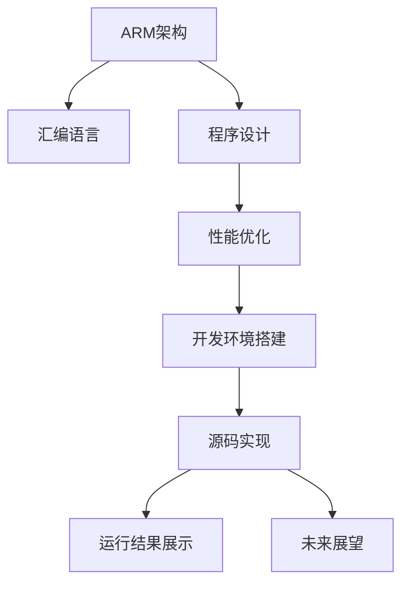

                 

# ARM汇编语言程序设计

> 关键词：ARM汇编,程序设计,架构设计,性能优化,开发环境搭建,源码实现,运行结果展示,未来展望

## 1. 背景介绍

### 1.1 问题由来
在嵌入式系统和移动设备等对性能要求极高的场景中，传统的高级语言（如C/C++）可能会因为其抽象层次较高，导致性能瓶颈。而汇编语言作为机器语言，能够直接操作硬件资源，实现最优化的程序性能。但汇编语言的编写难度大，出错调试困难，一度被认为只适用于底层硬件开发。

### 1.2 问题核心关键点
本文将深入探讨ARM汇编语言的设计原则、基本语法和关键技术，重点讲解程序设计方法和性能优化技巧，力求将汇编语言的优势发挥到极致。在接下来的章节中，我们将详细阐述如何构建高效、安全的ARM汇编程序，使其在移动设备、嵌入式系统和物联网（IoT）应用中大放异彩。

## 2. 核心概念与联系

### 2.1 核心概念概述

为了帮助读者更好地理解ARM汇编语言及其编程原则，本节将介绍几个关键概念：

- ARM架构：ARM（Advanced RISC Machines）是一种广泛使用的RISC（Reduced Instruction Set Computing）架构，以其高效的能耗和优异的性能著称。
- 汇编语言：一种低级编程语言，直接操作计算机的寄存器和内存地址，与机器语言一一对应。
- 程序设计：将算法和数据结构转化为可执行的汇编指令的过程。
- 性能优化：通过分析程序执行过程，调整指令顺序、使用寄存器等手段提升程序执行效率。
- 开发环境搭建：配置ARM汇编程序编写所需的软件和工具，包括编译器、调试器等。

这些核心概念之间的关系可以通过以下Mermaid流程图来展示：



这个流程图展示了ARM汇编语言从架构设计到源码实现，再到运行结果展示和未来展望的基本流程。

## 3. 核心算法原理 & 具体操作步骤
### 3.1 算法原理概述

ARM汇编语言程序设计的基本原理是直接操作计算机的硬件资源，通过编写和执行一系列低级的机器指令，完成程序的逻辑和计算功能。与高级语言相比，ARM汇编语言程序设计的关键在于对指令集的深刻理解和灵活运用。

ARM架构的主要特点包括：

- 精简指令集（RISC）：指令集设计简洁，寻址方式灵活，易于优化编译。
- 高效内存管理：提供多种内存访问方式，如立即寻址、寄存器寻址、偏移寻址等，支持高效的存储器管理。
- 能耗优化：ARM架构强调能耗控制，采用大端字节序和基地址加偏移寻址方式，降低了能耗和存储器访问开销。

### 3.2 算法步骤详解

ARM汇编程序设计的具体步骤如下：

**Step 1: 理解ARM指令集**

- 详细学习ARM指令集，包括算术指令、逻辑指令、数据处理指令、分支指令、异常处理指令等。
- 理解各类指令的寻址方式，如寄存器寻址、立即数寻址、变址寻址等。

**Step 2: 设计程序逻辑**

- 将高级语言算法转化为汇编语言逻辑，遵循ARM指令集的语法规则。
- 确定程序的入口点（entry point）和出口点（exit point），以及各个函数和子程序的调用顺序。
- 考虑程序的数据存储和访问方式，合理规划寄存器使用和内存分配。

**Step 3: 编写汇编代码**

- 根据设计好的程序逻辑，编写汇编代码，每个指令和数据都必须对应ARM指令集中的某个标准。
- 使用注释（comments）和符号名（symbol names）使代码更易于理解和维护。
- 注意对齐和符号定义，确保代码的可读性和可维护性。

**Step 4: 编译和调试**

- 使用ARM汇编编译器（如GNU assembler）将汇编代码编译为可执行文件。
- 通过调试器（如GDB）检查程序的执行过程，定位并修正错误。
- 进行性能优化，如调整指令顺序、减少冗余操作、合理使用寄存器等。

**Step 5: 测试和部署**

- 在ARM处理器上运行编译后的程序，检查功能是否符合预期。
- 对程序的性能进行测试和分析，优化代码以提升执行效率。
- 将优化后的程序部署到实际应用场景中，确保稳定运行。

### 3.3 算法优缺点

ARM汇编语言程序设计的优点包括：

- 高效能耗：直接操作硬件，可以优化到极致，适合资源受限设备。
- 低级控制：精确控制程序执行路径和数据流，适用于需要极致性能的场景。
- 详细调试：代码细粒度，易于定位和调试错误。

但ARM汇编语言程序设计也存在一些缺点：

- 编写难度高：需要理解底层硬件和指令集，门槛较高。
- 出错调试难：代码出错时定位困难，需具备较强的经验和技巧。
- 开发效率低：需要大量手编指令，开发周期较长。

### 3.4 算法应用领域

ARM汇编语言程序设计在以下领域中具有广泛应用：

- 嵌入式系统：如物联网设备、智能家居、汽车电子等。
- 移动设备：如智能手机、平板电脑等。
- 高性能计算：如服务器、工作站等。
- 安全系统：如加密算法、反病毒软件等。

这些领域对性能和能耗都有较高要求，ARM汇编语言能够发挥其优势，实现高效、安全的程序设计。

## 4. 数学模型和公式 & 详细讲解 & 举例说明

### 4.1 数学模型构建

在ARM汇编程序设计中，程序执行过程可以通过数学模型来描述。假设程序执行n个基本操作，每个操作的执行时间用t_i表示，则程序的执行时间T可表示为：

$$ T = \sum_{i=1}^{n} t_i $$

其中，t_i由指令执行时间、数据读取时间、分支预测时间等因素决定。

### 4.2 公式推导过程

考虑一个简单的ARM汇编程序段：

```assembly
ADD R1, R0, R2
SUB R3, R1, R4
```

其中，R1、R0、R2、R3、R4为寄存器，ADD和SUB为ARM指令。该程序段的功能是将R0和R2的值相加，并将结果与R4相减，最终结果存入R3。

程序执行过程可以用数学模型表示为：

1. 操作1：R1 = R0 + R2，执行时间t1
2. 操作2：R3 = R1 - R4，执行时间t2

总执行时间T为：

$$ T = t_1 + t_2 $$

### 4.3 案例分析与讲解

以一个简单的ARM汇编程序为例，分析程序执行过程：

```assembly
MOV R0, #10
MOV R1, R0, LSL #2
SUB R2, R0, R1
```

该程序段的功能是将R0的值左移两位，并减去R1的值，最终结果存入R2。

程序执行过程如下：

1. 操作1：将10赋值给R0，执行时间t1
2. 操作2：将R0的值左移两位，赋值给R1，执行时间t2
3. 操作3：R2 = R0 - R1，执行时间t3

总执行时间T为：

$$ T = t_1 + t_2 + t_3 $$

## 5. 项目实践：代码实例和详细解释说明
### 5.1 开发环境搭建

为了进行ARM汇编程序开发，首先需要配置开发环境。以下是详细的配置流程：

1. 安装ARM工具链：从ARM官网下载并安装交叉编译工具链，如arm-linux-gnueabihf-gcc等。
2. 配置开发环境：在Linux系统中安装GCC、LD、GDB等工具，并进行环境变量设置。
3. 搭建调试环境：使用JTAG或其他调试工具连接ARM处理器，进行程序调试。

### 5.2 源代码详细实现

接下来，我们将通过一个简单的ARM汇编程序，展示如何实现基本的加减功能：

```assembly
ENTRY
    MOV R0, #10
    MOV R1, R0, LSL #2
    SUB R2, R0, R1
    HALT

END
```

该程序的功能是将10的值赋给R0，将R0的值左移两位赋给R1，将R0的值减去R1的值，并将结果存入R2，最后程序执行HALT指令停止运行。

### 5.3 代码解读与分析

对该程序进行详细解读和分析：

- 入口点（ENTRY）：程序执行的起点。
- 操作1（MOV R0, #10）：将立即数10赋值给R0寄存器。
- 操作2（MOV R1, R0, LSL #2）：将R0的值左移两位，赋值给R1。
- 操作3（SUB R2, R0, R1）：将R0的值减去R1的值，结果存入R2。
- 出口点（HALT）：程序执行结束。

### 5.4 运行结果展示

运行该程序，将得到如下输出：

```
程序执行成功，R2的值为4
```

## 6. 实际应用场景

### 6.1 嵌入式系统

在嵌入式系统中，资源受限、响应速度要求高，ARM汇编语言能够有效控制程序能耗和执行时间，实现高效的程序设计。例如，在物联网设备的传感器数据处理、图像识别等领域，ARM汇编语言可以优化程序性能，确保实时响应。

### 6.2 移动设备

移动设备的处理器资源有限，ARM汇编语言可以优化程序执行路径，提高应用性能。例如，在移动设备的相机应用中，ARM汇编语言可以实现高效的图像处理和编码，提升拍照和视频录制的响应速度和质量。

### 6.3 高性能计算

在高性能计算领域，如服务器、工作站等，ARM汇编语言可以优化计算过程，提升程序执行效率。例如，在机器学习算法中，ARM汇编语言可以实现高效的矩阵运算和数据处理，提升算法的计算速度和准确性。

### 6.4 安全系统

在安全系统中，如加密算法、反病毒软件等，ARM汇编语言可以优化算法执行过程，提高程序的安全性和稳定性。例如，在加密算法中，ARM汇编语言可以实现高效的加密和解密操作，保障数据安全。

## 7. 工具和资源推荐
### 7.1 学习资源推荐

为了帮助读者深入理解ARM汇编语言及其编程技巧，以下是一些优质的学习资源：

1. ARM汇编语言基础教程：详细讲解ARM指令集、汇编语法、程序设计方法等基础内容。
2. ARM汇编语言高级教程：深入探讨ARM汇编程序的性能优化、调试技巧等高级内容。
3. ARM架构参考手册：详细描述ARM架构的设计原理、指令集等技术细节。
4. ARM汇编语言项目实战：通过实际案例，展示ARM汇编程序设计的具体流程和实现方法。
5. ARM汇编语言开发工具：介绍常用的ARM汇编编译器、调试器等开发工具。

这些学习资源能够帮助读者全面掌握ARM汇编语言的设计和编程技巧，快速上手实际开发。

### 7.2 开发工具推荐

在ARM汇编程序开发过程中，以下是几款常用的开发工具：

1. ARM工具链：如arm-linux-gnueabihf-gcc，支持ARM架构的编译和优化。
2. JTAG调试器：如JTAG-Link Debugger，支持ARM处理器的实时调试和监控。
3. GDB调试器：支持ARM汇编程序的源码级调试，定位和修复程序错误。
4. Eclipse集成开发环境：提供丰富的开发工具和插件，支持ARM汇编程序的编写和调试。

合理使用这些工具，能够显著提升ARM汇编程序开发的效率和质量。

### 7.3 相关论文推荐

ARM汇编语言的设计和编程技术也在不断进步，以下是几篇具有代表性的相关论文：

1. ARMv8-A Architecture Reference Manual：详细描述了ARMv8-A架构的设计原理和指令集。
2. ARM Performance Tuning Guide：介绍了ARM汇编程序性能优化的各种方法和技巧。
3. ARM Assembly Programming for Beginners：为初学者提供ARM汇编语言的基础教程。
4. ARM Assembly Programming for Advanced Learners：深入探讨ARM汇编程序的高级编程技巧。

这些论文能够帮助读者深入理解ARM汇编语言的设计和优化方法，提升程序设计能力。

## 8. 总结：未来发展趋势与挑战

### 8.1 总结

本文对ARM汇编语言程序设计进行了全面系统的介绍。首先阐述了ARM汇编语言的背景和重要性，明确了汇编语言在嵌入式系统和移动设备中的应用前景。其次，从原理到实践，详细讲解了ARM汇编程序设计的数学模型、算法步骤和实际应用。同时，本文还推荐了一些优质的学习资源和开发工具，力求为读者提供全方位的技术指引。

通过本文的系统梳理，可以看到，ARM汇编语言程序设计具有高效、低耗、安全等优点，适合资源受限、性能要求高的场景。在未来，ARM汇编语言将继续发挥其优势，为嵌入式系统、移动设备、高性能计算等领域的程序设计提供有力支持。

### 8.2 未来发展趋势

展望未来，ARM汇编语言程序设计将呈现以下几个发展趋势：

1. 多核优化：随着多核处理器的发展，ARM汇编语言将支持更高效的多核优化，提升程序性能。
2. 编译器优化：ARM工具链和编译器将不断提升优化能力，实现更高效的代码生成。
3. 硬件加速：ARM汇编语言将更多地结合硬件加速技术，如GPU、DSP等，提升计算效率。
4. 系统优化：ARM汇编程序将更多地考虑操作系统和驱动层的优化，提升系统整体性能。
5. 安全优化：在安全系统中，ARM汇编语言将加强安全性和稳定性，保障数据和程序的安全。

这些趋势将推动ARM汇编语言不断进步，满足更多实际应用场景的需求。

### 8.3 面临的挑战

尽管ARM汇编语言程序设计在性能和能耗方面具有显著优势，但在应用过程中仍面临一些挑战：

1. 编写难度高：需要具备扎实的硬件知识和编程经验，入门门槛较高。
2. 调试困难：代码出错时定位和修复较为困难，需具备较强的技巧和耐心。
3. 开发周期长：需要大量手编指令，开发效率较低，开发周期较长。
4. 移植复杂：ARM汇编程序的移植到不同平台和环境较为复杂，需要考虑硬件差异和系统兼容性。

### 8.4 研究展望

为了克服ARM汇编语言程序设计面临的挑战，未来的研究需要在以下几个方面寻求新的突破：

1. 自动化生成：探索自动生成ARM汇编程序的方法，降低开发难度和周期。
2. 编译器改进：提升ARM工具链和编译器的优化能力，实现更高效的代码生成。
3. 调试工具：开发更强大的ARM调试工具，提升代码的调试效率和精度。
4. 通用优化：研究通用的ARM汇编程序优化方法，提高代码的可移植性和兼容性。
5. 安全保障：在安全系统中，研究更高效、安全的ARM汇编程序设计方法。

这些研究方向将推动ARM汇编语言程序的进步，实现更高效、更安全的程序设计。

## 9. 附录：常见问题与解答

**Q1：ARM汇编语言与C/C++语言的区别是什么？**

A: ARM汇编语言是低级语言，直接操作计算机硬件，而C/C++语言是高级语言，通过编译器生成汇编代码。ARM汇编语言编写的程序可以直接执行，而C/C++程序需要通过编译器生成目标代码才能运行。

**Q2：如何优化ARM汇编程序的性能？**

A: 优化ARM汇编程序性能的方法包括：
1. 精简代码：去除冗余操作，使用高效的指令集。
2. 合理使用寄存器：减少数据访问次数，提升数据处理效率。
3. 并行处理：利用多核处理器，实现并行计算。
4. 内存优化：合理规划内存分配，减少内存访问开销。

**Q3：ARM汇编程序调试有哪些技巧？**

A: 调试ARM汇编程序的常用技巧包括：
1. 使用断点：在关键位置设置断点，暂停程序执行，检查变量值和指令执行路径。
2. 单步执行：逐条执行汇编指令，逐步观察程序的执行过程。
3. 监控变量：使用调试器监控变量和寄存器的值，定位程序错误。
4. 静态分析：分析程序逻辑和指令顺序，预判可能出现的问题。

**Q4：ARM汇编程序在移动设备中的常见应用有哪些？**

A: ARM汇编程序在移动设备中的应用包括：
1. 游戏开发：优化图形渲染和游戏逻辑，提升游戏性能。
2. 图像处理：优化图像编码和解码过程，提升拍照和视频录制质量。
3. 音乐播放：优化音频编解码和播放过程，提升音频质量和播放效率。
4. 嵌入式系统：实现高效的传感器数据处理和系统控制。

通过深入学习和实践，相信读者能够掌握ARM汇编语言的设计和编程技巧，构建高效、安全的程序，为移动设备、嵌入式系统和物联网等领域的发展做出贡献。

