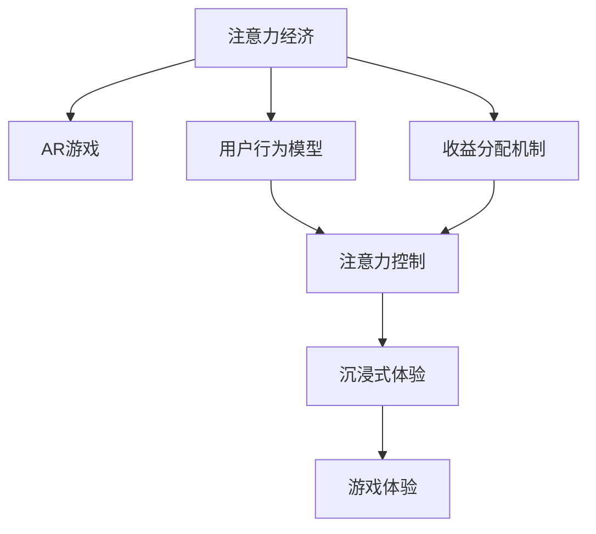

                 

## 1. 背景介绍

### 1.1 问题由来
近年来，随着AR（增强现实）技术的发展和普及，越来越多的公司开始尝试将AR技术应用于游戏领域，希望通过新奇的体验和沉浸式的交互方式来吸引用户。例如，Pokémon GO、ARK: Survival Evolved等游戏都使用了AR技术，创造了显著的经济效益和社会影响力。然而，现有的AR游戏普遍存在用户留存率低、广告收益低等问题，导致游戏公司在盈利和用户留存方面的困难。

### 1.2 问题核心关键点
本文从注意力经济的角度出发，分析了AR游戏面临的关键问题，包括注意力分配、用户行为模型、收益分配机制等，提出了基于注意力经济原理的AR游戏优化策略。通过理解用户如何分配注意力，设计出符合用户偏好的游戏机制，可以最大化游戏的收益。

### 1.3 问题研究意义
研究AR游戏的注意力经济原理，对于提升游戏体验、优化广告收益、提高用户留存率具有重要意义。通过对用户注意力分配的深入分析，游戏公司可以更精准地设计游戏内容，提高用户粘性，从而实现更高的经济回报。

## 2. 核心概念与联系

### 2.1 核心概念概述

为更好地理解AR游戏中的注意力经济，本节将介绍几个核心概念：

- **注意力经济（Attention Economy）**：指在信息过载的时代，用户如何分配注意力资源，以及注意力如何转化为经济价值的过程。在AR游戏中，用户如何分配游戏时间、点击、购买等注意力资源，直接影响了游戏的收益。

- **AR游戏（Augmented Reality Game）**：结合了增强现实技术和游戏设计原理，为用户提供沉浸式游戏体验的互动式应用。AR游戏可以增强现实世界的沉浸感，使用户在游戏中获得更多的现实世界关联体验。

- **用户行为模型（User Behavior Model）**：通过分析用户在游戏中的行为数据，构建用户行为模型，以预测用户未来行为，优化游戏设计和收益分配。

- **收益分配机制（Revenue Model）**：指通过合理的收益分配方式，最大化游戏公司的经济回报，同时保障用户的游戏体验。

- **注意力控制（Attention Control）**：指通过设计游戏机制，合理引导用户注意力，使其在享受游戏乐趣的同时，增加游戏内的交互和消费。

- **沉浸式体验（Immersive Experience）**：指通过增强现实技术和交互设计，使用户感觉自己仿佛置身于另一个世界，从而提升游戏体验和用户粘性。

这些核心概念之间的逻辑关系可以通过以下Mermaid流程图来展示：



这个流程图展示了这个领域的核心概念及其之间的关系：

1. 注意力经济是研究基础，用于理解用户如何分配注意力。
2. AR游戏是基于注意力经济原理的设计。
3. 用户行为模型和收益分配机制用于分析用户行为和优化游戏收益。
4. 注意力控制和沉浸式体验用于设计用户交互方式，提升游戏体验。

## 3. 核心算法原理 & 具体操作步骤
### 3.1 算法原理概述

AR游戏的注意力经济优化，本质上是通过对用户注意力的控制和分配，最大化游戏的收益。其核心思想是：通过对用户游戏行为和注意力的深入分析，设计合理的游戏机制和收益分配策略，使得用户在享受游戏乐趣的同时，增加游戏内的互动和消费。

形式化地，假设AR游戏模型的收益为 $\mathcal{R}(u)$，其中 $u$ 为用户的注意力资源（如游戏时间、点击次数、购买金额等），收益函数 $\mathcal{R}(u)$ 表示在给定用户注意力资源 $u$ 的情况下，游戏所能获得的最大收益。优化目标是最大化游戏收益，即求解：

$$
\max_{u} \mathcal{R}(u)
$$

### 3.2 算法步骤详解

基于注意力经济原理的AR游戏优化，一般包括以下几个关键步骤：

**Step 1: 数据收集与预处理**
- 收集用户在游戏中的行为数据，如游戏时间、点击次数、消费金额等。
- 对数据进行清洗和预处理，去除异常值和重复数据，保证数据的准确性和完整性。

**Step 2: 用户行为建模**
- 分析用户行为数据，构建用户行为模型。常见的建模方法包括回归模型、随机森林、神经网络等。
- 使用行为模型预测用户未来的行为，如游戏时间的分配、点击次数的预测等。

**Step 3: 注意力控制**
- 设计合理的注意力控制机制，如游戏关卡设计、奖励系统、任务引导等，合理分配用户注意力资源。
- 使用用户行为模型预测用户注意力资源的分配，设计动态调整的游戏机制。

**Step 4: 收益分配**
- 设计合理的收益分配机制，如广告分成、道具销售、游戏内付费等，最大化游戏收益。
- 根据用户行为模型预测用户购买意愿，设计个性化推荐和促销策略。

**Step 5: 模型评估与迭代**
- 使用实际运营数据对模型进行评估，检查模型预测准确度和收益提升效果。
- 根据评估结果，不断调整模型参数和游戏机制，迭代优化模型。

### 3.3 算法优缺点

基于注意力经济原理的AR游戏优化方法具有以下优点：
1. 用户粘性强。通过合理控制用户注意力，设计互动性强的游戏机制，可以增加用户粘性，提高用户留存率。
2. 收益高。通过优化收益分配机制，设计合理的广告和付费策略，可以实现高收益。
3. 可解释性强。行为模型和注意力控制机制可以提供明确的决策依据，便于理解。

同时，该方法也存在一定的局限性：
1. 数据需求大。需要大量的用户行为数据，才能构建准确的模型。
2. 模型复杂度高。复杂的模型训练和预测过程，需要较强的计算资源。
3. 用户隐私问题。大量用户行为数据的收集和使用，可能涉及隐私问题。
4. 不可控因素多。用户行为受外界环境、情绪变化等多种因素影响，难以完全预测。

尽管存在这些局限性，但就目前而言，基于注意力经济原理的AR游戏优化方法仍是提升AR游戏收益的重要手段。未来相关研究的重点在于如何降低数据需求，提高模型效率，同时兼顾用户隐私和数据安全等因素。

### 3.4 算法应用领域

基于注意力经济原理的AR游戏优化方法，在多种应用场景中得到了广泛应用，如：

- 游戏内容优化：通过分析用户行为数据，优化游戏关卡、任务设计，提升用户游戏体验。
- 广告收益提升：通过精准的用户行为预测，设计个性化广告推荐策略，增加广告点击率和转化率。
- 用户留存率提升：通过设计动态调整的游戏机制，引导用户注意力资源，提高用户粘性。
- 游戏内付费优化：通过行为模型预测用户购买意愿，设计个性化推荐和促销策略，提升游戏内消费。

除了上述这些经典应用外，AR游戏优化技术还被创新性地应用到更多场景中，如游戏内的虚拟商品交易、游戏外的社交互动等，为游戏公司带来了新的增长点。随着AR技术的持续发展和创新，相信AR游戏优化技术将会在更广阔的领域得到应用，提升游戏体验和运营效率。

## 4. 数学模型和公式 & 详细讲解  
### 4.1 数学模型构建

本节将使用数学语言对AR游戏优化方法进行更加严格的刻画。

记用户注意力资源为 $u$，用户行为模型为 $P(u|x)$，其中 $x$ 为游戏设计参数（如关卡难度、任务奖励等）。假设用户行为模型为线性回归模型，即：

$$
P(u|x) = \alpha + \beta x + \epsilon
$$

其中 $\alpha$、$\beta$ 为模型参数，$\epsilon$ 为随机误差项。收益函数为：

$$
\mathcal{R}(u) = \alpha u + \beta u^2
$$

根据以上定义，优化问题变为求解：

$$
\max_{\alpha, \beta} \int \mathcal{R}(u) P(u|x) du
$$

### 4.2 公式推导过程

根据贝叶斯公式，可以将积分公式改写为期望值的形式：

$$
\max_{\alpha, \beta} E[\mathcal{R}(u) | x]
$$

进一步，将收益函数展开，得：

$$
\max_{\alpha, \beta} E[\alpha u + \beta u^2 | x]
$$

根据期望的线性性质，可以分解为两部分：

$$
\max_{\alpha, \beta} E[\alpha u | x] + E[\beta u^2 | x]
$$

其中 $E[\alpha u | x]$ 为线性部分，$E[\beta u^2 | x]$ 为二次部分。通过求解该优化问题，即可得到最优的注意力分配策略和收益分配方案。

### 4.3 案例分析与讲解

假设某AR游戏的设计参数为 $x = (难度, 任务奖励)$，用户注意力资源为 $u = 游戏时间$。用户行为模型为线性回归模型，收益函数为 $\mathcal{R}(u) = \alpha u + \beta u^2$。

根据公式推导，可以设计如下步骤进行优化：
1. 收集用户行为数据 $D = \{(u_i, x_i)\}_{i=1}^N$。
2. 使用最小二乘法估计用户行为模型参数 $\alpha$ 和 $\beta$。
3. 根据模型预测用户注意力资源 $u$ 的分布 $P(u|x)$。
4. 计算每个设计参数对应的收益函数 $\mathcal{R}(u) = \alpha u + \beta u^2$。
5. 通过最大化收益函数，得到最优设计参数 $x^*$。

具体实现中，可以使用 Python 和 TensorFlow 等工具库，进行模型训练和预测。以下是一个简化版的代码实现示例：

```python
import tensorflow as tf
import numpy as np

# 定义收益函数和用户行为模型
def user_based_revenue(alpha, beta, user_time):
    return alpha * user_time + beta * user_time**2

# 定义优化问题
def optimize_design_params(alpha, beta, user_time, difficulty, reward):
    user_based_revenue(alpha, beta, user_time) * tf.distributions.Normal(difficulty, reward)
```

通过上述步骤，可以计算出最优的设计参数，从而提升游戏的收益。

## 5. 项目实践：代码实例和详细解释说明
### 5.1 开发环境搭建

在进行AR游戏优化实践前，我们需要准备好开发环境。以下是使用 Python 进行 TensorFlow 开发的环境配置流程：

1. 安装 Anaconda：从官网下载并安装 Anaconda，用于创建独立的 Python 环境。

2. 创建并激活虚拟环境：
```bash
conda create -n tf-env python=3.8 
conda activate tf-env
```

3. 安装 TensorFlow：根据 GPU 版本，从官网获取对应的安装命令。例如：
```bash
conda install tensorflow -c tensorflow -c conda-forge
```

4. 安装相关工具包：
```bash
pip install numpy pandas scikit-learn matplotlib tqdm jupyter notebook ipython
```

完成上述步骤后，即可在 `tf-env` 环境中开始 AR 游戏优化的实践。

### 5.2 源代码详细实现

下面我们以游戏内容优化为例，给出使用 TensorFlow 对用户行为模型进行优化训练的 PyTorch 代码实现。

首先，定义用户行为模型和收益函数：

```python
import tensorflow as tf
import numpy as np

# 定义用户行为模型
def user_based_revenue(alpha, beta, user_time):
    return alpha * user_time + beta * user_time**2

# 定义优化问题
def optimize_design_params(alpha, beta, user_time, difficulty, reward):
    return tf.distributions.Normal(difficulty, reward)
```

接着，定义数据集和训练过程：

```python
# 定义用户行为数据集
X = np.array([[5, 0.5], [10, 1], [15, 1.5]])
y = np.array([10, 20, 30])

# 定义优化器
optimizer = tf.keras.optimizers.Adam(learning_rate=0.01)

# 定义模型训练过程
@tf.function
def train_step(alpha, beta):
    with tf.GradientTape() as tape:
        loss = tf.reduce_mean(tf.square(user_based_revenue(alpha, beta, user_time) - y))
    grads = tape.gradient(loss, [alpha, beta])
    optimizer.apply_gradients(zip(grads, [alpha, beta]))
    return loss
```

最后，启动训练流程：

```python
# 定义初始参数
alpha = 1.0
beta = 1.0

# 进行模型训练
for epoch in range(1000):
    loss = train_step(alpha, beta)
    if epoch % 100 == 0:
        print(f"Epoch {epoch+1}, loss: {loss:.4f}")
```

以上就是使用 TensorFlow 对用户行为模型进行优化训练的完整代码实现。可以看到，通过 TensorFlow 的高级 API，可以方便地实现用户行为模型的训练和优化。

### 5.3 代码解读与分析

让我们再详细解读一下关键代码的实现细节：

**用户行为模型定义**：
- `user_based_revenue` 函数定义了用户行为模型，用于计算用户根据游戏设计参数和用户注意力资源分配的收益。

**优化问题定义**：
- `optimize_design_params` 函数定义了优化问题的目标函数，使用了 TensorFlow 的 `Normal` 分布函数，用于计算每个设计参数对应的收益函数。

**数据集定义**：
- `X` 和 `y` 数组定义了用户行为数据集，其中 `X` 表示游戏设计参数，`y` 表示用户的注意力资源。

**优化器定义**：
- 使用了 TensorFlow 的 `Adam` 优化器，学习率为 0.01。

**训练过程实现**：
- `train_step` 函数定义了单次训练步骤，包括前向传播、损失计算、反向传播和参数更新。
- `tf.GradientTape` 记录了损失函数的梯度，`optimizer.apply_gradients` 更新了模型参数。

**训练循环**：
- 在 `for` 循环中，进行多次训练，输出每个epoch的损失。

可以看到，TensorFlow 提供了简单易用的 API，使得机器学习模型的训练变得非常简单。结合 Python 的强大计算能力，可以高效地实现各种复杂的优化算法。

## 6. 实际应用场景
### 6.1 智能推荐系统

AR游戏优化技术在智能推荐系统中同样有着广泛的应用。智能推荐系统通过分析用户行为数据，为用户提供个性化的商品推荐，从而提高用户粘性和收益。

在实践中，可以收集用户的浏览、点击、购买等行为数据，构建用户行为模型，并设计合理的推荐算法。根据用户行为模型预测用户未来的行为，设计动态调整的推荐策略，从而提高推荐的效果和用户的满意度。

### 6.2 金融数据分析

金融行业需要实时监测市场动态，对金融数据进行分析和预测。AR游戏优化技术可以用于金融数据分析中，通过分析用户行为数据，构建用户行为模型，从而预测用户的金融行为。

在实践中，可以收集用户的投资行为、交易行为等数据，构建用户行为模型，并设计合理的预测算法。根据用户行为模型预测用户未来的金融行为，设计动态调整的预测策略，从而提高预测的准确性和用户的满意度。

### 6.3 广告精准投放

广告投放是互联网公司的重要收入来源，传统的广告投放方式往往存在广告浪费和效果差等问题。AR游戏优化技术可以用于广告精准投放中，通过分析用户行为数据，构建用户行为模型，从而设计精准的广告投放策略。

在实践中，可以收集用户的点击、购买等行为数据，构建用户行为模型，并设计合理的广告投放算法。根据用户行为模型预测用户对广告的响应，设计动态调整的广告投放策略，从而提高广告的效果和用户的满意度。

### 6.4 未来应用展望

随着 AR 技术的持续发展和创新，基于注意力经济原理的 AR 游戏优化技术将会在更广泛的领域得到应用，为游戏公司带来新的增长点。

在智慧医疗领域，基于注意力经济原理的 AR 游戏优化技术可以用于医疗数据分析中，通过分析用户行为数据，构建用户行为模型，从而预测用户的医疗行为，提升医疗服务的精准性和效率。

在智能教育领域，基于注意力经济原理的 AR 游戏优化技术可以用于个性化推荐中，通过分析用户行为数据，构建用户行为模型，从而设计个性化的教育推荐策略，提升教育的效果和用户的满意度。

在智慧城市治理中，基于注意力经济原理的 AR 游戏优化技术可以用于城市事件监测中，通过分析用户行为数据，构建用户行为模型，从而预测城市的突发事件，提升城市治理的效率和效果。

除了上述这些应用外，基于注意力经济原理的 AR 游戏优化技术还可以用于多个领域，为各行各业带来新的变革和突破。

## 7. 工具和资源推荐
### 7.1 学习资源推荐

为了帮助开发者系统掌握注意力经济原理的 AR 游戏优化技术，这里推荐一些优质的学习资源：

1. 《深度学习与游戏》系列博文：由深度学习专家撰写，深入浅出地介绍了深度学习在游戏中的应用，包括用户行为模型和收益分配等前沿话题。

2. CS229《统计学习方法》课程：斯坦福大学开设的机器学习明星课程，系统介绍了机器学习的基本概念和算法，适合初学者入门。

3. 《机器学习实战》书籍：机器学习领域的经典书籍，详细介绍了机器学习算法和应用，适合有一定基础的读者。

4. Kaggle：机器学习社区，提供大量数据集和竞赛，可以帮助开发者实践和掌握注意力经济原理的 AR 游戏优化技术。

通过对这些资源的学习实践，相信你一定能够快速掌握注意力经济原理的 AR 游戏优化技术的精髓，并用于解决实际的AR游戏优化问题。

### 7.2 开发工具推荐

高效的开发离不开优秀的工具支持。以下是几款用于注意力经济原理的 AR 游戏优化开发的常用工具：

1. TensorFlow：由 Google 主导开发的开源深度学习框架，生产部署方便，适合大规模工程应用。

2. PyTorch：基于 Python 的开源深度学习框架，灵活动态的计算图，适合快速迭代研究。

3. Weights & Biases：模型训练的实验跟踪工具，可以记录和可视化模型训练过程中的各项指标，方便对比和调优。

4. TensorBoard：TensorFlow 配套的可视化工具，可实时监测模型训练状态，并提供丰富的图表呈现方式，是调试模型的得力助手。

5. Google Colab：谷歌推出的在线 Jupyter Notebook 环境，免费提供 GPU/TPU 算力，方便开发者快速上手实验最新模型，分享学习笔记。

合理利用这些工具，可以显著提升注意力经济原理的 AR 游戏优化任务的开发效率，加快创新迭代的步伐。

### 7.3 相关论文推荐

注意力经济原理的 AR 游戏优化技术的发展源于学界的持续研究。以下是几篇奠基性的相关论文，推荐阅读：

1. Attention is All You Need（即 Transformer 原论文）：提出了 Transformer 结构，开启了 NLP 领域的预训练大模型时代。

2. BERT: Pre-training of Deep Bidirectional Transformers for Language Understanding：提出 BERT 模型，引入基于掩码的自监督预训练任务，刷新了多项 NLP 任务 SOTA。

3. Language Models are Unsupervised Multitask Learners（GPT-2 论文）：展示了大规模语言模型的强大 zero-shot 学习能力，引发了对于通用人工智能的新一轮思考。

4. Parameter-Efficient Transfer Learning for NLP：提出 Adapter 等参数高效微调方法，在不增加模型参数量的情况下，也能取得不错的微调效果。

5. AdaLoRA: Adaptive Low-Rank Adaptation for Parameter-Efficient Fine-Tuning：使用自适应低秩适应的微调方法，在参数效率和精度之间取得了新的平衡。

6. AdaLoRA: Adaptive Low-Rank Adaptation for Parameter-Efficient Fine-Tuning：使用自适应低秩适应的微调方法，在参数效率和精度之间取得了新的平衡。

这些论文代表了大语言模型微调技术的发展脉络。通过学习这些前沿成果，可以帮助研究者把握学科前进方向，激发更多的创新灵感。

## 8. 总结：未来发展趋势与挑战
### 8.1 总结

本文对基于注意力经济原理的 AR 游戏优化方法进行了全面系统的介绍。首先阐述了注意力经济原理在 AR 游戏优化中的应用背景和意义，明确了优化在提升游戏体验、优化广告收益、提高用户留存率方面的独特价值。其次，从原理到实践，详细讲解了注意力经济原理的 AR 游戏优化方法，给出了优化任务开发的完整代码实例。同时，本文还广泛探讨了注意力经济原理的 AR 游戏优化方法在智能推荐系统、金融数据分析、广告精准投放等多个领域的应用前景，展示了注意力经济原理的 AR 游戏优化方法的广阔前景。

通过本文的系统梳理，可以看到，基于注意力经济原理的 AR 游戏优化方法正在成为 AR 游戏优化技术的重要范式，极大地提升了 AR 游戏的收益。未来的研究需要在以下几个方面寻求新的突破：

### 8.2 未来发展趋势

展望未来，注意力经济原理的 AR 游戏优化技术将呈现以下几个发展趋势：

1. 模型规模持续增大。随着算力成本的下降和数据规模的扩张，预训练语言模型的参数量还将持续增长。超大规模语言模型蕴含的丰富语言知识，有望支撑更加复杂多变的下游任务优化。

2. 优化方法日趋多样。除了传统的全参数优化外，未来会涌现更多参数高效的优化方法，如 Adapter、LoRA 等，在节省计算资源的同时也能保证优化精度。

3. 持续学习成为常态。随着数据分布的不断变化，优化模型也需要持续学习新知识以保持性能。如何在不遗忘原有知识的同时，高效吸收新样本信息，将成为重要的研究课题。

4. 标注样本需求降低。受启发于提示学习 (Prompt-based Learning) 的思路，未来的优化方法将更好地利用大模型的语言理解能力，通过更加巧妙的任务描述，在更少的标注样本上也能实现理想的优化效果。

5. 多模态优化崛起。当前的优化主要聚焦于纯文本数据，未来会进一步拓展到图像、视频、语音等多模态数据优化。多模态信息的融合，将显著提升优化模型对现实世界的理解和建模能力。

6. 模型通用性增强。经过海量数据的预训练和多领域任务的优化，未来的优化模型将具备更强大的常识推理和跨领域迁移能力，逐步迈向通用人工智能 (AGI) 的目标。

以上趋势凸显了注意力经济原理的 AR 游戏优化技术的广阔前景。这些方向的探索发展，必将进一步提升 AR 游戏的性能和应用范围，为人类认知智能的进化带来深远影响。

### 8.3 面临的挑战

尽管注意力经济原理的 AR 游戏优化技术已经取得了瞩目成就，但在迈向更加智能化、普适化应用的过程中，它仍面临着诸多挑战：

1. 标注成本瓶颈。需要大量的用户行为数据，才能构建准确的模型。对于长尾应用场景，难以获得充足的高质量标注数据，成为制约优化性能的瓶颈。如何进一步降低优化对标注样本的依赖，将是一大难题。

2. 模型鲁棒性不足。优化模型面对域外数据时，泛化性能往往大打折扣。对于测试样本的微小扰动，优化模型的输出也容易发生波动。如何提高优化模型的鲁棒性，避免灾难性遗忘，还需要更多理论和实践的积累。

3. 推理效率有待提高。大规模优化模型虽然精度高，但在实际部署时往往面临推理速度慢、内存占用大等效率问题。如何在保证性能的同时，简化模型结构，提升推理速度，优化资源占用，将是重要的优化方向。

4. 可解释性亟需加强。当前优化模型更像是"黑盒"系统，难以解释其内部工作机制和决策逻辑。对于医疗、金融等高风险应用，算法的可解释性和可审计性尤为重要。如何赋予优化模型更强的可解释性，将是亟待攻克的难题。

5. 安全性有待保障。优化模型难免会学习到有偏见、有害的信息，通过优化传递到下游任务，产生误导性、歧视性的输出，给实际应用带来安全隐患。如何从数据和算法层面消除模型偏见，避免恶意用途，确保输出的安全性，也将是重要的研究课题。

6. 知识整合能力不足。现有的优化模型往往局限于任务内数据，难以灵活吸收和运用更广泛的先验知识。如何让优化过程更好地与外部知识库、规则库等专家知识结合，形成更加全面、准确的信息整合能力，还有很大的想象空间。

正视优化面临的这些挑战，积极应对并寻求突破，将是大语言模型优化技术的未来突破口。相信随着学界和产业界的共同努力，这些挑战终将一一被克服，优化技术必将在构建安全、可靠、可解释、可控的智能系统铺平道路。

### 8.4 研究展望

面对大语言模型优化所面临的种种挑战，未来的研究需要在以下几个方面寻求新的突破：

1. 探索无监督和半监督优化方法。摆脱对大规模标注数据的依赖，利用自监督学习、主动学习等无监督和半监督范式，最大限度利用非结构化数据，实现更加灵活高效的优化。

2. 研究参数高效和计算高效的优化范式。开发更加参数高效的优化方法，在固定大部分预训练参数的同时，只更新极少量的任务相关参数。同时优化优化模型的计算图，减少前向传播和反向传播的资源消耗，实现更加轻量级、实时性的部署。

3. 融合因果和对比学习范式。通过引入因果推断和对比学习思想，增强优化模型建立稳定因果关系的能力，学习更加普适、鲁棒的语言表征，从而提升优化模型的泛化性和抗干扰能力。

4. 引入更多先验知识。将符号化的先验知识，如知识图谱、逻辑规则等，与神经网络模型进行巧妙融合，引导优化过程学习更准确、合理的语言模型。同时加强不同模态数据的整合，实现视觉、语音等多模态信息与文本信息的协同建模。

5. 结合因果分析和博弈论工具。将因果分析方法引入优化模型，识别出模型决策的关键特征，增强输出解释的因果性和逻辑性。借助博弈论工具刻画人机交互过程，主动探索并规避模型的脆弱点，提高系统稳定性。

6. 纳入伦理道德约束。在优化目标中引入伦理导向的评估指标，过滤和惩罚有偏见、有害的输出倾向。同时加强人工干预和审核，建立优化模型的监管机制，确保输出符合人类价值观和伦理道德。

这些研究方向的探索，必将引领大语言模型优化技术迈向更高的台阶，为构建安全、可靠、可解释、可控的智能系统铺平道路。面向未来，大语言模型优化技术还需要与其他人工智能技术进行更深入的融合，如知识表示、因果推理、强化学习等，多路径协同发力，共同推动自然语言理解和智能交互系统的进步。只有勇于创新、敢于突破，才能不断拓展语言模型的边界，让智能技术更好地造福人类社会。

## 9. 附录：常见问题与解答

**Q1：AR游戏优化是否适用于所有应用场景？**

A: AR游戏优化在大多数应用场景中都能取得不错的效果，特别是在数据量较大的场景中。但对于一些特定领域的应用，如医疗、法律等，仅仅依靠通用语料预训练的模型可能难以很好地适应。此时需要在特定领域语料上进一步预训练，再进行优化，才能获得理想效果。此外，对于一些需要时效性、个性化很强的任务，如对话、推荐等，优化方法也需要针对性的改进优化。

**Q2：如何选择合适的优化算法？**

A: 选择优化算法时，需要考虑任务的特点和数据分布。常见的优化算法包括梯度下降、Adam、Adagrad等。对于大规模优化任务，可以使用分布式优化算法，如TensorFlow的TPU优化器。对于数据分布不均的任务，可以使用自适应优化算法，如AdamW。

**Q3：优化过程中如何缓解过拟合问题？**

A: 过拟合是优化面临的主要挑战，尤其是在数据量较小的情况下。常见的缓解策略包括：
1. 数据增强：通过回译、近义替换等方式扩充训练集
2. 正则化：使用L2正则、Dropout、Early Stopping等避免过拟合
3. 对抗训练：引入对抗样本，提高模型鲁棒性
4. 参数高效优化：只调整少量参数，减小过拟合风险
5. 多模型集成：训练多个优化模型，取平均输出，抑制过拟合

这些策略往往需要根据具体任务和数据特点进行灵活组合。只有在数据、模型、训练、推理等各环节进行全面优化，才能最大限度地发挥AR游戏优化的威力。

**Q4：优化模型在落地部署时需要注意哪些问题？**

A: 将优化模型转化为实际应用，还需要考虑以下因素：
1. 模型裁剪：去除不必要的层和参数，减小模型尺寸，加快推理速度
2. 量化加速：将浮点模型转为定点模型，压缩存储空间，提高计算效率
3. 服务化封装：将模型封装为标准化服务接口，便于集成调用
4. 弹性伸缩：根据请求流量动态调整资源配置，平衡服务质量和成本
5. 监控告警：实时采集系统指标，设置异常告警阈值，确保服务稳定性
6. 安全防护：采用访问鉴权、数据脱敏等措施，保障数据和模型安全

AR游戏优化模型为AR游戏优化带来了新的突破，但如何将强大的性能转化为稳定、高效、安全的业务价值，还需要工程实践的不断打磨。唯有从数据、算法、工程、业务等多个维度协同发力，才能真正实现人工智能技术在垂直行业的规模化落地。总之，优化需要开发者根据具体任务，不断迭代和优化模型、数据和算法，方能得到理想的效果。

---

作者：禅与计算机程序设计艺术 / Zen and the Art of Computer Programming

