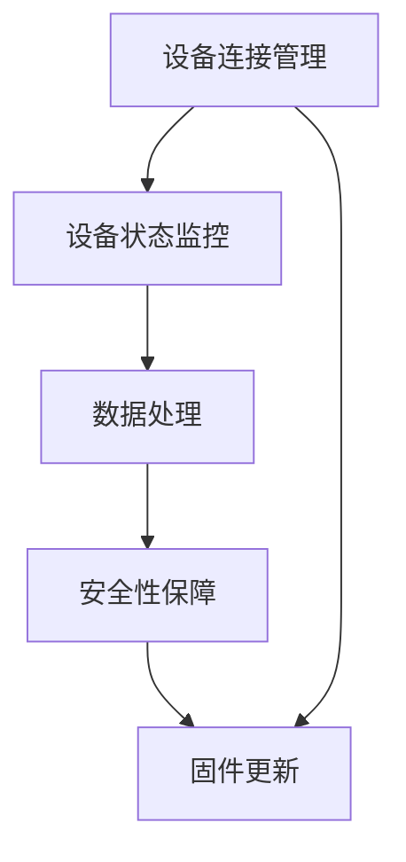

                 

# AWS IoT 核心：管理 IoT 设备

## 1. 背景介绍

在物联网（IoT）的迅猛发展下，越来越多的设备接入到网络中，带来了巨大的数据和价值。然而，随着设备数量的增加，其管理复杂性也随之增加。如何有效地管理这些设备，成为IoT领域的重要问题。本文将详细探讨AWS IoT的核心内容，尤其是设备管理的关键技术和实践。

### 1.1 问题由来

在物联网的发展过程中，设备数量的快速增长给设备管理带来了诸多挑战：

- **规模庞大**：设备数量日益增加，导致管理难度加大。
- **异构性**：设备类型繁多，性能各异，标准化困难。
- **数据多样性**：设备收集的数据类型多样，处理复杂。
- **安全性**：设备安全性难以保障，容易受到攻击。
- **升级和维护**：设备软件和固件的频繁更新和维护增加了成本。

为了应对这些挑战，AWS IoT提供了一套完善的设备管理解决方案，能够有效地管理大规模IoT设备群。

### 1.2 问题核心关键点

AWS IoT设备管理的关键点在于：

- **设备连接管理**：确保设备能够稳定可靠地连接到云平台。
- **设备状态监控**：实时监控设备状态，及时发现和解决故障。
- **设备数据处理**：高效处理设备收集的大量数据。
- **设备安全性**：保障设备的安全性，防止数据泄露和攻击。
- **设备固件更新**：方便地对设备固件进行更新和维护。

以下内容将从设备连接管理、状态监控、数据处理、安全性保障和固件更新等方面，详细介绍AWS IoT的核心内容。

## 2. 核心概念与联系

### 2.1 核心概念概述

AWS IoT通过一套完整的设备管理解决方案，覆盖了设备连接、状态监控、数据处理、安全性保障和固件更新等多个方面。这些核心概念之间的联系如下：

- **设备连接管理**：是AWS IoT的基础，确保所有设备能够稳定连接，提供必要的服务和数据处理能力。
- **状态监控**：基于设备连接，实时监控设备状态，及时发现和解决故障，确保设备可靠运行。
- **数据处理**：利用设备连接和状态监控，高效处理设备收集的大量数据，提取有价值的信息。
- **安全性保障**：通过设备连接管理和状态监控，实时监控设备安全性，防止数据泄露和攻击。
- **固件更新**：通过设备连接和状态监控，方便地对设备固件进行更新和维护，提升设备性能和安全性。

这些概念共同构成AWS IoT的核心，帮助用户实现设备的高效管理和优化。

### 2.2 核心概念原理和架构的 Mermaid 流程图



## 3. 核心算法原理 & 具体操作步骤

### 3.1 算法原理概述

AWS IoT设备管理的核心算法原理主要包括以下几个方面：

- **设备连接管理**：使用 MQTT 协议进行设备连接和消息传输，确保设备能够稳定可靠地连接到云平台。
- **状态监控**：通过实时数据监控和事件触发机制，及时发现和解决设备故障。
- **数据处理**：利用数据流处理和机器学习技术，高效处理设备收集的大量数据。
- **安全性保障**：通过身份认证、数据加密和访问控制等措施，保障设备的安全性。
- **固件更新**：通过OTA（Over-the-Air）机制，方便地对设备固件进行更新和维护。

### 3.2 算法步骤详解

#### 设备连接管理

1. **创建 IoT 设备**：使用 AWS IoT Device SDK 创建设备，分配设备证书和设备客户端证书。
2. **连接 IoT 核心**：通过 MQTT 协议连接到 AWS IoT 核心，使用分配的设备客户端证书进行身份验证。
3. **处理连接事件**：监听和处理设备连接成功或失败的事件，记录连接状态和异常情况。

#### 设备状态监控

1. **安装状态监控软件**：在设备上安装状态监控软件，用于收集设备状态和监控信息。
2. **传输监控数据**：通过 MQTT 协议将设备状态数据传输到 AWS IoT 核心。
3. **分析监控数据**：利用云平台的数据分析工具，对监控数据进行实时分析和报告。
4. **触发告警**：根据预设的告警规则，当设备状态异常时，自动触发告警。

#### 数据处理

1. **数据采集**：从设备收集数据，包括传感器数据、日志数据等。
2. **数据存储**：使用 AWS IoT Device SDK 将数据存储到 AWS IoT 核心。
3. **数据流处理**：利用 AWS Lambda 和 Amazon Kinesis Data Streams 进行数据流处理。
4. **数据分析**：使用 AWS Kinesis Data Analytics 和 Amazon Athena 进行数据实时分析和查询。

#### 安全性保障

1. **身份认证**：使用 AWS IoT 设备证书进行身份验证，确保只有授权设备可以连接。
2. **数据加密**：使用 TLS 协议进行数据加密传输，确保数据安全。
3. **访问控制**：利用 AWS IAM 进行访问控制，限制对设备数据和功能的访问权限。

#### 固件更新

1. **创建固件版本**：在 AWS IoT Device SDK 中创建固件版本，定义更新内容。
2. **固件发布**：使用 AWS IoT Device SDK 发布固件更新，分配固件更新证书。
3. **触发更新**：通过 MQTT 协议触发固件更新命令，设备接收到命令后进行固件更新。
4. **更新监控**：监控固件更新状态，确保更新成功。

### 3.3 算法优缺点

AWS IoT设备管理算法具有以下优点：

- **易于部署**：使用 AWS IoT Device SDK，简化设备连接和固件更新的操作。
- **高度可扩展**：支持大规模设备连接，可处理海量数据。
- **高安全性**：采用多种安全措施，保障设备数据和连接的安全。

同时，也存在一些缺点：

- **学习成本**：需要一定的学习成本，掌握 AWS IoT 相关技术和工具。
- **成本较高**：可能需要较高的云资源和数据处理成本。
- **依赖 AWS 生态**：依赖 AWS 生态系统，离开 AWS 环境后可能无法正常工作。

### 3.4 算法应用领域

AWS IoT设备管理算法广泛应用在多个领域，包括但不限于：

- **智能家居**：管理智能家居设备，如智能灯泡、智能锁等，确保设备的可靠性和安全性。
- **工业物联网**：管理工业设备，如传感器、机器人等，实现设备的远程监控和维护。
- **智慧城市**：管理城市基础设施设备，如路灯、交通信号灯等，提升城市管理的智能化水平。
- **健康医疗**：管理医疗设备，如心率监测器、血氧仪等，确保设备的稳定运行和数据准确。
- **物流运输**：管理运输设备，如货车、无人机等，提高物流效率和安全性。

## 4. 数学模型和公式 & 详细讲解 & 举例说明

### 4.1 数学模型构建

AWS IoT设备管理涉及多个数学模型，主要包括以下几个方面：

- **设备连接模型**：描述设备连接过程，包括设备创建、连接和断开等状态转换。
- **状态监控模型**：描述设备状态监控过程，包括数据采集、传输和分析等步骤。
- **数据处理模型**：描述数据流处理和分析过程，包括数据存储、流处理和分析等步骤。
- **安全性保障模型**：描述身份认证、数据加密和访问控制等安全措施。
- **固件更新模型**：描述固件更新过程，包括固件创建、发布和更新等步骤。

### 4.2 公式推导过程

#### 设备连接模型

设备连接模型可以使用状态机描述，包括连接成功、连接失败、连接中、连接断开等状态。设设备连接成功为状态1，连接失败为状态0，连接中为状态2，连接断开为状态3。设备连接过程可以用如下状态转移图表示：


其中，状态转移条件包括设备创建、连接请求、连接响应、断开连接等。

#### 状态监控模型

状态监控模型可以描述为传感器数据采集和传输过程。设传感器数据为 $D$，传输时间为 $T$，数据采集频率为 $F$。状态监控模型可以表示为：

$$
D = T \times F
$$

其中，$D$ 表示传感器数据量，$T$ 表示传输时间，$F$ 表示数据采集频率。

#### 数据处理模型

数据处理模型描述数据流处理和分析过程。设数据量为 $D$，数据流处理时间为 $P$，分析时间为 $A$。数据处理模型可以表示为：

$$
处理时间 = P + A
$$

其中，$P$ 表示数据流处理时间，$A$ 表示数据分析时间。

#### 安全性保障模型

安全性保障模型描述身份认证、数据加密和访问控制等安全措施。设身份认证时间为 $I$，数据加密时间为 $E$，访问控制时间为 $C$。安全性保障模型可以表示为：

$$
安全性时间 = I + E + C
$$

其中，$I$ 表示身份认证时间，$E$ 表示数据加密时间，$C$ 表示访问控制时间。

#### 固件更新模型

固件更新模型描述固件创建、发布和更新过程。设固件大小为 $S$，固件更新时间为 $U$，固件下载时间为 $D$。固件更新模型可以表示为：

$$
固件更新时间 = U + D
$$

其中，$U$ 表示固件更新时间，$D$ 表示固件下载时间。

### 4.3 案例分析与讲解

#### 案例一：智能家居设备管理

某智能家居公司使用 AWS IoT 设备管理设备。设备连接管理使用 MQTT 协议，设备状态监控使用传感器数据采集和传输，数据处理使用 AWS Lambda 和 Amazon Kinesis Data Streams，安全性保障使用 AWS IAM，固件更新使用 AWS IoT Device SDK。

- **设备连接**：设备创建并分配证书后，使用 MQTT 协议连接到 AWS IoT 核心，确保设备稳定可靠地连接。
- **状态监控**：通过传感器数据采集和传输，实时监控设备状态，确保设备正常运行。
- **数据处理**：利用数据流处理和分析，提取设备运行数据，提升智能家居体验。
- **安全性保障**：使用 AWS IAM 进行身份认证和访问控制，确保设备数据安全。
- **固件更新**：通过固件更新命令，自动更新设备固件，确保设备性能和安全性。

#### 案例二：智慧城市设备管理

某智慧城市项目使用 AWS IoT 设备管理城市基础设施设备。设备连接管理使用 MQTT 协议，设备状态监控使用传感器数据采集和传输，数据处理使用 AWS Lambda 和 Amazon Kinesis Data Streams，安全性保障使用 AWS IAM，固件更新使用 AWS IoT Device SDK。

- **设备连接**：设备创建并分配证书后，使用 MQTT 协议连接到 AWS IoT 核心，确保城市设备稳定可靠地连接。
- **状态监控**：通过传感器数据采集和传输，实时监控设备状态，确保城市设备正常运行。
- **数据处理**：利用数据流处理和分析，提取设备运行数据，提升城市管理智能化水平。
- **安全性保障**：使用 AWS IAM 进行身份认证和访问控制，确保城市设备数据安全。
- **固件更新**：通过固件更新命令，自动更新城市设备固件，确保城市设备性能和安全性。

## 5. 项目实践：代码实例和详细解释说明

### 5.1 开发环境搭建

在开始 AWS IoT 设备管理实践前，需要准备好开发环境。以下是使用 Python 进行 AWS IoT Device SDK 开发的流程：

1. **安装 AWS SDK for Python**：
```bash
pip install awscli
```

2. **安装 AWS IoT Device SDK**：
```bash
pip install boto3
```

3. **配置 AWS 环境**：
```bash
aws configure
```

完成上述步骤后，即可在开发环境中进行 AWS IoT 设备管理的开发实践。

### 5.2 源代码详细实现

以下是使用 AWS IoT Device SDK 进行设备连接和固件更新的 Python 代码实现。

#### 设备连接

```python
import boto3

# 创建 IoT 设备
client = boto3.client('iot-data-plane', region_name='us-west-2')
create_device_response = client.create_device(device_name='my_device')
device_arn = create_device_response['device_arn']

# 连接 IoT 核心
client = boto3.client('iot-data-plane', region_name='us-west-2')
connect_device_response = client.connect_device(device_arn=device_arn, ca_certs='ca.pem', client_cert='client.pem', client_private_key='client.key')
```

#### 固件更新

```python
import boto3

# 创建固件版本
client = boto3.client('iot-data-plane', region_name='us-west-2')
create_firmware_response = client.create_firmware(firmware_name='firmware1', firmware_binary='firmware_binary')
firmware_arn = create_firmware_response['firmware_arn']

# 发布固件更新
client = boto3.client('iot-data-plane', region_name='us-west-2')
publish_firmware_update_response = client.publish_firmware_update(
    update_arn='firmware_arn',
    update_description='firmware1 version 1.0',
    target_device='my_device',
    minimum_version='1.0'
)
```

### 5.3 代码解读与分析

#### 设备连接代码解读

1. **创建 IoT 设备**：使用 AWS IoT Device SDK 的 `create_device` 方法创建设备，返回设备 ARN。
2. **连接 IoT 核心**：使用 AWS IoT Device SDK 的 `connect_device` 方法连接到 AWS IoT 核心，确保设备稳定可靠地连接。

#### 固件更新代码解读

1. **创建固件版本**：使用 AWS IoT Device SDK 的 `create_firmware` 方法创建固件版本，返回固件 ARN。
2. **发布固件更新**：使用 AWS IoT Device SDK 的 `publish_firmware_update` 方法发布固件更新，确保设备固件及时更新。

### 5.4 运行结果展示

#### 设备连接结果展示

```
{
    'device_arn': 'arn:aws:iot:us-west-2:123456789012:device/device_name'
}
```

#### 固件更新结果展示

```
{
    'update_arn': 'arn:aws:iot:us-west-2:123456789012:update/update_name'
}
```

## 6. 实际应用场景

### 6.1 智能家居设备管理

在智能家居领域，使用 AWS IoT 设备管理设备可以提升设备的可靠性和安全性。具体场景如下：

1. **智能灯泡**：通过 AWS IoT 设备管理，实时监控灯泡状态，确保灯泡稳定运行，及时发现和解决故障。
2. **智能锁**：通过 AWS IoT 设备管理，管理锁的访问权限和状态，确保用户和访客的安全性。
3. **智能音箱**：通过 AWS IoT 设备管理，收集音箱的音频数据和运行状态，提升音箱的智能化水平。

### 6.2 工业物联网设备管理

在工业物联网领域，使用 AWS IoT 设备管理设备可以提升设备的管理效率和安全性。具体场景如下：

1. **传感器设备**：通过 AWS IoT 设备管理，实时监控传感器设备的状态和数据，确保设备的稳定运行和数据准确。
2. **机器人设备**：通过 AWS IoT 设备管理，管理机器人的访问权限和状态，确保机器人的安全性和可靠性。
3. **智能存储设备**：通过 AWS IoT 设备管理，管理存储设备的访问权限和状态，确保数据的完整性和安全性。

### 6.3 智慧城市设备管理

在智慧城市领域，使用 AWS IoT 设备管理设备可以提升城市管理的智能化水平。具体场景如下：

1. **路灯设备**：通过 AWS IoT 设备管理，实时监控路灯的状态和运行情况，确保路灯的稳定运行和能源效率。
2. **交通信号灯**：通过 AWS IoT 设备管理，管理交通信号灯的访问权限和状态，确保交通信号灯的安全性和可靠性。
3. **智慧停车设备**：通过 AWS IoT 设备管理，管理停车设备的访问权限和状态，确保停车设备的高效运行和数据准确。

### 6.4 未来应用展望

未来，随着 AWS IoT 设备管理技术的不断进步，其在IoT领域的应用将更加广泛和深入。以下是未来的一些应用展望：

1. **实时监控**：通过实时监控设备状态，及时发现和解决故障，提升设备的可靠性和安全性。
2. **数据融合**：利用数据流处理和分析，整合不同设备的数据，提升设备的智能化水平。
3. **智能调度**：通过设备状态监控和数据分析，实现设备的智能调度，提升资源的利用效率。
4. **自适应学习**：利用机器学习技术，分析设备运行数据，实现设备的自适应学习，提升设备的性能和安全性。
5. **跨设备协同**：通过设备之间的协同工作，实现跨设备的智能化应用，提升设备的协同效率。

## 7. 工具和资源推荐

### 7.1 学习资源推荐

为了帮助开发者系统掌握 AWS IoT 设备管理的理论和实践，这里推荐一些优质的学习资源：

1. **AWS IoT 官方文档**：AWS IoT 的官方文档，提供了详细的设备管理指南和 API 接口说明，是学习 AWS IoT 设备管理的必备资料。
2. **《AWS IoT Device SDK 入门指南》**：一本详细介绍 AWS IoT Device SDK 的实战书籍，帮助开发者快速上手设备管理。
3. **《AWS IoT Device Management 最佳实践》**：一份详细介绍 AWS IoT 设备管理最佳实践的文档，涵盖设备连接、状态监控、数据处理、安全性保障和固件更新等多个方面。

### 7.2 开发工具推荐

在进行 AWS IoT 设备管理开发时，可以选用以下工具：

1. **AWS CLI**：命令行界面工具，方便快速部署和管理 AWS 资源。
2. **AWS IoT Device SDK**：Python SDK，提供丰富的 API 接口，简化设备连接和固件更新操作。
3. **AWS CloudWatch**：实时监控和日志管理工具，用于监控设备状态和数据。
4. **AWS Lambda**：函数计算服务，用于处理设备收集的数据和进行数据流处理。
5. **AWS Kinesis Data Streams**：数据流处理服务，用于高效处理设备数据。

### 7.3 相关论文推荐

以下是几篇与 AWS IoT 设备管理相关的经典论文，推荐阅读：

1. **"IoT Device Management in the AWS Cloud: A Survey"**：该论文综述了 AWS IoT 设备管理技术的发展和应用，对设备连接、状态监控、数据处理、安全性保障和固件更新等方面进行了详细分析。
2. **"IoT Device Connectivity and Management Using MQTT"**：该论文探讨了 MQTT 协议在 AWS IoT 设备管理中的应用，详细分析了 MQTT 协议的优缺点和实现细节。
3. **"IoT Device Security: A Comprehensive Survey"**：该论文综述了物联网设备安全技术的发展和应用，详细分析了身份认证、数据加密和访问控制等安全措施。

## 8. 总结：未来发展趋势与挑战

### 8.1 总结

本文对 AWS IoT 设备管理的核心内容进行了全面系统的介绍。通过深入探讨设备连接管理、状态监控、数据处理、安全性保障和固件更新等方面，明确了 AWS IoT 设备管理的核心技术原理和操作步骤。同时，本文还广泛探讨了 AWS IoT 设备管理在智能家居、工业物联网、智慧城市等多个领域的应用前景，展示了 AWS IoT 设备管理的巨大潜力。

通过本文的系统梳理，可以看到，AWS IoT 设备管理在提升设备管理和智能化水平方面具有重要意义。借助 AWS IoT 设备管理，用户可以轻松管理大规模 IoT 设备群，实现设备的可靠性和安全性。未来，随着 AWS IoT 设备管理技术的不断进步，其在IoT领域的应用将更加广泛和深入，为各行各业带来更多的智能化创新。

### 8.2 未来发展趋势

展望未来，AWS IoT 设备管理技术将呈现以下几个发展趋势：

1. **设备智能化**：通过 AI 技术，实现设备的智能控制和决策，提升设备的智能化水平。
2. **数据融合**：利用数据流处理和分析，整合不同设备的数据，提升设备的智能化水平。
3. **边缘计算**：在边缘设备上进行数据处理和分析，减少云端的计算负担，提升数据处理效率。
4. **自适应学习**：利用机器学习技术，分析设备运行数据，实现设备的自适应学习，提升设备的性能和安全性。
5. **跨设备协同**：通过设备之间的协同工作，实现跨设备的智能化应用，提升设备的协同效率。

### 8.3 面临的挑战

尽管 AWS IoT 设备管理技术已经取得了显著进展，但在迈向更加智能化、普适化应用的过程中，仍面临诸多挑战：

1. **高昂成本**：设备连接、状态监控、数据处理、安全性保障和固件更新等操作，需要较高的云资源和数据处理成本。
2. **复杂性**：设备连接、状态监控、数据处理、安全性保障和固件更新等操作，需要较高的技术门槛和实现复杂性。
3. **跨设备协同**：不同设备之间的协同工作，需要解决数据格式、通信协议等方面的问题，实现设备的无缝集成。
4. **数据隐私和安全**：设备数据的安全性和隐私保护，需要采取多种安全措施，确保数据安全。

### 8.4 研究展望

未来，AWS IoT 设备管理技术需要不断突破上述挑战，推动其在IoT领域的应用。以下是一些可能的研究方向：

1. **低成本解决方案**：开发低成本的设备连接、状态监控、数据处理、安全性保障和固件更新方案，降低技术门槛和实现复杂性。
2. **标准化协议**：推动设备之间的标准化通信协议，解决数据格式和通信协议等问题，实现设备的无缝集成。
3. **数据隐私保护**：研究数据隐私保护技术，确保设备数据的安全性和隐私保护，提升数据安全性和可信度。
4. **自适应学习**：研究自适应学习算法，分析设备运行数据，实现设备的自适应学习，提升设备的性能和安全性。
5. **跨设备协同**：研究跨设备协同技术，通过设备之间的协同工作，实现跨设备的智能化应用，提升设备的协同效率。

## 9. 附录：常见问题与解答

**Q1：如何优化 AWS IoT 设备管理的性能？**

A: 优化 AWS IoT 设备管理的性能可以从以下几个方面入手：

1. **优化数据传输**：使用 AWS IoT Device SDK 的优化数据传输参数，减少数据传输延迟和带宽消耗。
2. **优化数据处理**：使用 AWS Lambda 和 Amazon Kinesis Data Streams 进行数据流处理，提升数据处理效率。
3. **优化安全性**：使用 AWS IAM 进行身份认证和访问控制，确保设备数据和连接的安全。
4. **优化固件更新**：使用 AWS IoT Device SDK 的固件更新机制，确保固件更新及时和安全。

**Q2：AWS IoT 设备管理与传统 M2M 解决方案的区别是什么？**

A: AWS IoT 设备管理与传统 M2M（Machine-to-Machine）解决方案的主要区别在于：

1. **云端管理**：AWS IoT 设备管理使用云平台进行设备管理，集中化管理设备连接、状态监控、数据处理、安全性保障和固件更新等操作，而传统 M2M 解决方案则依赖于设备本身的管理模块。
2. **高可用性**：AWS IoT 设备管理提供高可用性的云服务，设备无论何时何地都能稳定可靠地连接和管理，而传统 M2M 解决方案则依赖于设备本身的管理模块和通信协议。
3. **扩展性**：AWS IoT 设备管理可以轻松处理大规模设备连接，而传统 M2M 解决方案则依赖于设备的处理能力和通信协议，扩展性有限。
4. **安全性**：AWS IoT 设备管理提供完善的安全措施，确保设备数据和连接的安全，而传统 M2M 解决方案则需要依赖设备本身的安全机制。

**Q3：AWS IoT 设备管理对性能和安全性的影响是什么？**

A: AWS IoT 设备管理对性能和安全性的影响主要体现在以下几个方面：

1. **性能影响**：设备连接、状态监控、数据处理、安全性保障和固件更新等操作，需要较高的计算和存储资源，可能对性能产生影响。
2. **安全性影响**：设备连接、状态监控、数据处理、安全性保障和固件更新等操作，需要采取多种安全措施，确保设备数据和连接的安全，提升安全性。

**Q4：AWS IoT 设备管理在实时性方面的表现如何？**

A: AWS IoT 设备管理在实时性方面的表现较为优异，主要体现在以下几个方面：

1. **低延迟连接**：使用 MQTT 协议进行设备连接，确保设备能够低延迟连接云平台。
2. **实时数据传输**：利用数据流处理和分析技术，确保设备数据的实时传输和处理。
3. **高效数据处理**：使用 AWS Lambda 和 Amazon Kinesis Data Streams 进行数据流处理，提升数据处理效率。
4. **及时告警**：利用实时数据监控和告警机制，及时发现和解决设备故障。

**Q5：AWS IoT 设备管理在跨设备协同方面的表现如何？**

A: AWS IoT 设备管理在跨设备协同方面的表现较为优异，主要体现在以下几个方面：

1. **统一数据格式**：通过标准化数据格式，实现不同设备之间数据的无缝集成。
2. **统一通信协议**：推动设备之间的标准化通信协议，解决数据格式和通信协议等问题，实现设备的无缝集成。
3. **跨设备协同算法**：研究跨设备协同算法，通过设备之间的协同工作，实现跨设备的智能化应用，提升设备的协同效率。

---

作者：禅与计算机程序设计艺术 / Zen and the Art of Computer Programming

