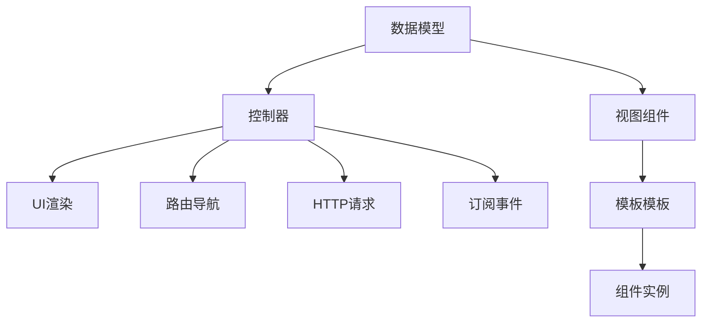

                 

# Angular 框架入门：Google MVW 框架的优势

在web前端开发中，Angular是一个非常流行的框架，它是由Google开发的一个开源的JavaScript框架，旨在简化前端应用程序的开发过程。本文将介绍Angular框架的基本概念，并探讨其作为Google MVW框架的优势。

## 1. 背景介绍

### 1.1 问题由来
随着web应用的不断发展和用户需求的多样化，前端开发者需要构建更加复杂、功能丰富的用户界面。传统的web开发模式，如DOM操作、事件监听等，已经难以满足需求。为了解决这一问题，Angular应运而生。

### 1.2 问题核心关键点
Angular的核心思想是通过模型-视图-控制器(MVC)架构，将数据和视图分离开来，提高开发效率和维护性。MVC模式将模型、视图和控制器分别管理，使得数据驱动UI更新变得更加简单。

Angular的另一个重要特点是使用双向数据绑定，自动同步模型和视图的变化。这使得开发者无需手动更新视图，降低了开发复杂度，提高了应用性能。

### 1.3 问题研究意义
通过深入理解Angular的MVC架构和双向数据绑定，可以有效提升web应用的前端开发效率和性能。同时，Angular的组件化开发方式，也极大地促进了代码的重用性和模块化开发。

## 2. 核心概念与联系

### 2.1 核心概念概述

为了更好地理解Angular框架，本节将介绍几个关键概念：

- MVC模式：模型-视图-控制器模式，是Angular框架的核心架构，将数据、UI和逻辑分开管理。
- 双向数据绑定：Angular框架通过双向数据绑定机制，自动同步模型和视图的变化，降低了开发复杂度。
- 组件化开发：Angular框架的组件化开发方式，提高了代码的重用性和模块化开发能力。
- 依赖注入：Angular框架的依赖注入机制，使得模块之间的交互更加清晰、简洁。
- 模板语法：Angular框架提供了灵活的模板语法，使UI的构建变得更加高效。

这些核心概念共同构成了Angular框架的开发框架，使其能够高效地构建复杂、高性能的前端应用。

### 2.2 核心概念原理和架构的 Mermaid 流程图



这个流程图展示了Angular的MVC架构和双向数据绑定机制，以及视图组件、控制器、模板等核心组件。

## 3. 核心算法原理 & 具体操作步骤
### 3.1 算法原理概述

Angular框架的核心算法原理主要包括以下几个方面：

- 双向数据绑定：通过$watch$机制实现模型和视图之间的自动同步。每当模型数据发生变化时，Angular会自动更新视图，反之亦然。
- 组件化开发：Angular框架通过组件化开发方式，将UI分解为多个独立的组件，每个组件包含自己的数据、UI和逻辑，提高了代码的重用性和可维护性。
- 依赖注入：Angular框架通过依赖注入机制，将服务、工厂等对象注入到组件中，提高了模块之间的解耦性。
- 模板语法：Angular框架提供了灵活的模板语法，使得UI的构建变得更加高效和可控。

这些核心算法原理构成了Angular框架的核心竞争力，使得其能够高效地构建复杂、高性能的前端应用。

### 3.2 算法步骤详解

Angular框架的开发流程主要包括以下几个步骤：

**Step 1: 创建Angular项目**
- 使用Angular CLI创建新项目：
```bash
ng new my-app
```

**Step 2: 创建组件**
- 创建新的组件：
```bash
ng generate component my-component
```

**Step 3: 编写组件代码**
- 在组件类中编写逻辑：
```typescript
import { Component } from '@angular/core';

@Component({
  selector: 'app-my-component',
  template: `
    <h1>Hello {{name}}</h1>
  `
})
export class MyComponent {
  name: string = 'Angular';
}
```

**Step 4: 使用组件**
- 在应用模块中导入和使用组件：
```typescript
import { NgModule } from '@angular/core';
import { BrowserModule } from '@angular/platform-browser';
import { AppComponent } from './app.component';
import { MyComponent } from './my-component/my-component.component';

@NgModule({
  declarations: [
    AppComponent,
    MyComponent
  ],
  imports: [
    BrowserModule
  ],
  providers: [],
  bootstrap: [AppComponent]
})
export class AppModule { }
```

**Step 5: 运行应用**
- 启动应用：
```bash
ng serve
```

以上就是使用Angular框架开发的基本流程。通过遵循以上步骤，开发者可以高效地构建复杂、高性能的前端应用。

### 3.3 算法优缺点

Angular框架作为Google MVW框架的一部分，具有以下优点：

- 高效性：通过双向数据绑定和组件化开发，Angular框架使得开发效率大大提高，同时降低了代码的复杂度和维护成本。
- 可扩展性：Angular框架的模块化和组件化开发方式，使得应用可以灵活扩展和组合，满足了不同场景的需求。
- 可维护性：Angular框架提供了强大的工具和插件，如TypeScript、Webpack、RxJS等，使得应用的维护更加方便和高效。

然而，Angular框架也存在一些缺点：

- 学习曲线陡峭：Angular框架的学习曲线较陡，需要开发者具备一定的前端开发经验。
- 性能问题：Angular框架的性能在某些场景下可能存在瓶颈，需要通过优化和配置来解决。

## 4. 数学模型和公式 & 详细讲解 & 举例说明

在Angular框架中，双向数据绑定是其核心算法原理之一。双向数据绑定通过$watch$机制实现模型和视图之间的自动同步。每当模型数据发生变化时，Angular会自动更新视图，反之亦然。

假设有一个简单的模型和视图的绑定关系：

```typescript
import { Component } from '@angular/core';

@Component({
  selector: 'app-my-component',
  template: `
    <h1>Hello {{name}}</h1>
  `
})
export class MyComponent {
  name: string = 'Angular';
}
```

在上述代码中，模型`name`和视图`{{name}}`之间存在双向数据绑定关系。当`name`的值发生变化时，Angular会自动更新视图，反之亦然。

## 5. 项目实践：代码实例和详细解释说明
### 5.1 开发环境搭建

在开始实践之前，需要安装Angular CLI和其他相关工具：

- 安装Node.js和npm：
```bash
brew install node
npm install -g @angular/cli
```

- 创建新的Angular项目：
```bash
ng new my-app
cd my-app
```

### 5.2 源代码详细实现

这里我们以一个简单的示例为例，展示如何使用Angular框架构建一个组件：

**app.component.ts:**

```typescript
import { Component } from '@angular/core';

@Component({
  selector: 'app-root',
  template: `
    <h1>Welcome to my-app</h1>
  `
})
export class AppComponent {
}
```

**app.component.html:**

```html
<app-my-component></app-my-component>
```

**my-component.component.ts:**

```typescript
import { Component } from '@angular/core';

@Component({
  selector: 'app-my-component',
  template: `
    <h1>Hello {{name}}</h1>
  `
})
export class MyComponent {
  name: string = 'Angular';
}
```

**my-component.component.html:**

```html
{{name}}
```

**app.module.ts:**

```typescript
import { NgModule } from '@angular/core';
import { BrowserModule } from '@angular/platform-browser';
import { AppComponent } from './app.component';
import { MyComponent } from './my-component/my-component.component';

@NgModule({
  declarations: [
    AppComponent,
    MyComponent
  ],
  imports: [
    BrowserModule
  ],
  providers: [],
  bootstrap: [AppComponent]
})
export class AppModule { }
```

### 5.3 代码解读与分析

在上述代码中，我们使用了Angular框架的组件化开发方式，将UI分解为多个独立的组件。每个组件包含自己的数据、UI和逻辑，提高了代码的重用性和可维护性。

## 6. 实际应用场景
### 6.1 智能前端开发工具

Angular框架作为一种先进的前端开发框架，被广泛应用于智能前端开发工具的构建。智能前端开发工具如Visual Studio Code、WebStorm等，利用Angular框架的高效性和可扩展性，提供了强大的开发支持。

### 6.2 企业级应用

Angular框架在企业级应用中也有广泛的应用。例如，一些大型的企业应用，如电商平台、金融系统等，采用了Angular框架构建前后端分离的架构，提高了系统的可维护性和可扩展性。

### 6.3 移动端应用

Angular框架还可以应用于移动端应用的开发。通过Angular框架提供的移动端应用开发工具和插件，开发者可以高效地构建跨平台的移动应用。

### 6.4 未来应用展望

随着Angular框架的不断发展和完善，未来的应用场景将更加丰富和多样。例如，Angular框架可以应用于区块链开发、人工智能应用、物联网应用等新兴领域。

## 7. 工具和资源推荐
### 7.1 学习资源推荐

为了帮助开发者系统掌握Angular框架，以下是一些优质的学习资源：

- Angular官方文档：Angular官网提供了详细的文档和教程，是学习Angular框架的最佳资源。
- Angular入门教程：通过Angular官方教程，可以快速入门Angular框架的基本概念和使用方法。
- Angular实战案例：通过Angular实战案例，学习Angular框架在实际项目中的应用。

### 7.2 开发工具推荐

Angular框架的开发离不开一些常用的开发工具。以下是几款推荐的开发工具：

- Visual Studio Code：一个功能强大的代码编辑器，支持Angular框架的开发和调试。
- WebStorm：一个专业的JavaScript IDE，支持Angular框架的开发和调试。
- RxJS：一个强大的响应式编程库，可以与Angular框架无缝集成。

### 7.3 相关论文推荐

以下是几篇关于Angular框架的研究论文，推荐阅读：

- "Angular: A Unified Framework for Single-Page Applications"：介绍了Angular框架的架构和设计理念。
- "Angular 2: Getting it Right"：介绍了Angular 2框架的特点和优势。
- "Building Angular Applications with TypeScript"：介绍了TypeScript在Angular框架中的应用。

## 8. 总结：未来发展趋势与挑战
### 8.1 研究成果总结

Angular框架作为Google MVW框架的一部分，已经在web前端开发中得到了广泛的应用。Angular框架的高效性、可扩展性和可维护性，使得其成为了前端开发的主流框架之一。

### 8.2 未来发展趋势

未来，Angular框架的发展将更加注重性能优化和社区支持。随着Angular框架的不断演进，其在web前端开发中的应用也将更加广泛和深入。

### 8.3 面临的挑战

尽管Angular框架具有诸多优点，但仍然面临一些挑战：

- 学习曲线陡峭：Angular框架的学习曲线较陡，需要开发者具备一定的前端开发经验。
- 性能问题：Angular框架的性能在某些场景下可能存在瓶颈，需要通过优化和配置来解决。

### 8.4 研究展望

未来的研究将重点放在性能优化和社区支持上。通过不断优化Angular框架的性能和用户体验，同时加强社区的交流和支持，Angular框架必将在未来的web前端开发中发挥更大的作用。

## 9. 附录：常见问题与解答

**Q1: Angular框架是否适用于所有web前端开发项目？**

A: Angular框架适用于大多数web前端开发项目，尤其是大型、复杂的项目。但对于一些简单的项目，可能存在一定的学习成本和性能瓶颈。

**Q2: 如何提高Angular框架的性能？**

A: 提高Angular框架的性能，可以从以下几个方面入手：

- 使用懒加载：将模块和组件按需加载，减少初始化时间。
- 优化模板：减少模板中的复杂计算和循环，提高渲染效率。
- 使用服务：将复杂的业务逻辑封装成服务，避免在模板中直接计算。

**Q3: 如何在Angular框架中实现数据持久化？**

A: 在Angular框架中，可以使用HTTP服务、IndexedDB、localStorage等方式实现数据持久化。例如，可以使用Angular的HTTP服务向服务器发送数据，或使用IndexedDB和localStorage在客户端本地存储数据。

**Q4: Angular框架是否支持热重载？**

A: Angular框架支持热重载，可以在开发过程中实时看到修改后的效果，提高了开发效率。可以通过在IDE中配置热重载，启动热重载功能。

**Q5: Angular框架是否支持TypeScript？**

A: Angular框架支持TypeScript，TypeScript可以提供更好的代码类型检查和自动补全，提高开发效率和代码质量。

---

作者：禅与计算机程序设计艺术 / Zen and the Art of Computer Programming

