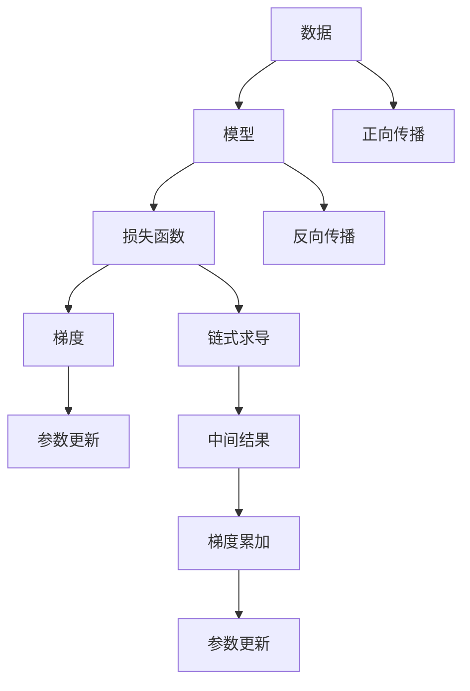

                 

# AutoGrad机制：深度学习框架的核心

## 1. 背景介绍

在深度学习的迅猛发展中，深度学习框架作为其中的重要工具，逐渐成为研究人员和开发者不可或缺的助手。而AutoGrad机制作为深度学习框架的核心部分，为模型的训练和优化提供了强大的支持，使得深度学习的训练变得更加高效、稳定和可解释。本文将从AutoGrad机制的原理、实现细节以及它在深度学习框架中的广泛应用展开讨论。

## 2. 核心概念与联系

### 2.1 核心概念概述

AutoGrad机制，即自动微分机制，是深度学习框架中用于自动计算模型参数梯度的重要工具。其原理基于反向传播算法，通过对模型正向计算过程的链式求导，自动计算各参数对损失函数的梯度。在现代深度学习框架中，几乎所有基于梯度下降的模型训练算法都依赖于AutoGrad机制。

### 2.2 核心概念原理和架构的 Mermaid 流程图



这个流程图展示了AutoGrad机制的核心流程：

1. 数据输入模型，经过正向传播得到输出。
2. 将模型输出与真实标签通过损失函数计算出误差。
3. 对误差进行链式求导，得到模型参数的梯度。
4. 根据梯度更新模型参数，完成一轮训练。

### 2.3 核心概念之间的联系

AutoGrad机制的实现依赖于以下几个关键概念：

- **正向传播**：将输入数据通过模型逐层处理，最终得到模型输出。
- **反向传播**：通过反向传播算法对模型输出和损失函数的误差进行求导，计算出模型参数的梯度。
- **链式求导**：利用链式法则，将误差对每个参数的求导结果传递回去。
- **梯度累加**：对链式求导得到的梯度进行累加，得到每个参数的综合梯度。
- **参数更新**：根据梯度更新模型参数，完成一轮训练。

## 3. 核心算法原理 & 具体操作步骤

### 3.1 算法原理概述

AutoGrad机制的核心原理基于反向传播算法。反向传播算法通过对模型正向计算过程的链式求导，自动计算模型参数的梯度。这一过程分为以下几个步骤：

1. **正向传播**：将输入数据通过模型逐层处理，得到模型输出。
2. **计算损失函数**：将模型输出与真实标签通过损失函数计算误差。
3. **反向传播**：对误差进行链式求导，得到模型参数的梯度。
4. **梯度累加**：对链式求导得到的梯度进行累加，得到每个参数的综合梯度。
5. **参数更新**：根据梯度更新模型参数，完成一轮训练。

### 3.2 算法步骤详解

以下是AutoGrad机制的具体操作步骤：

1. **定义模型**：首先，定义一个包含多个参数的模型。每个参数表示为张量(tensor)形式。
2. **正向传播**：将输入数据输入模型，逐层计算，直到得到模型输出。
3. **定义损失函数**：将模型输出与真实标签通过损失函数计算误差。
4. **反向传播**：对误差进行链式求导，得到每个参数的梯度。
5. **梯度累加**：对每个参数的梯度进行累加，得到综合梯度。
6. **参数更新**：根据梯度更新模型参数，完成一轮训练。
7. **循环迭代**：重复上述步骤，直到模型收敛或达到预设迭代次数。

### 3.3 算法优缺点

AutoGrad机制的主要优点包括：

- **高效计算**：AutoGrad机制利用反向传播算法，能够高效地计算模型参数的梯度。
- **广泛适用**：AutoGrad机制可以应用于各种深度学习模型，包括卷积神经网络(CNN)、循环神经网络(RNN)等。
- **可扩展性**：AutoGrad机制的实现依赖于深度学习框架，具有很好的可扩展性。

其缺点则主要体现在：

- **内存消耗**：在反向传播过程中，需要存储中间计算结果，可能会占用大量内存。
- **计算复杂度**：反向传播算法的时间复杂度较高，尤其在模型参数较多的情况下，计算速度较慢。
- **难以解释**：AutoGrad机制的内部过程较为复杂，难以解释每个参数的梯度来源。

### 3.4 算法应用领域

AutoGrad机制在深度学习框架中的应用广泛，几乎涵盖了所有基于梯度下降的模型训练算法。以下是几个典型的应用场景：

- **卷积神经网络(CNN)**：在图像识别、目标检测等任务中，AutoGrad机制被广泛应用于CNN模型的训练。
- **循环神经网络(RNN)**：在自然语言处理、语音识别等任务中，AutoGrad机制被广泛应用于RNN模型的训练。
- **生成对抗网络(GAN)**：在图像生成、视频生成等任务中，AutoGrad机制被广泛应用于GAN模型的训练。
- **强化学习**：在智能游戏、机器人控制等任务中，AutoGrad机制被广泛应用于强化学习模型的训练。

## 4. 数学模型和公式 & 详细讲解

### 4.1 数学模型构建

假设我们有一个简单的线性模型，输入为 $\mathbf{x}$，参数为 $\mathbf{w}$，输出为 $\mathbf{y}$。模型定义为：

$$
\mathbf{y} = \mathbf{w}^T \mathbf{x}
$$

其中 $\mathbf{w} \in \mathbb{R}^d$，$\mathbf{x} \in \mathbb{R}^d$，$\mathbf{y} \in \mathbb{R}^1$。

### 4.2 公式推导过程

假设我们的损失函数为 $L(\mathbf{y}, y_{\text{label}})$，其中 $y_{\text{label}}$ 表示真实标签。

对于上述线性模型，我们可以推导出模型参数 $\mathbf{w}$ 对损失函数 $L(\mathbf{y}, y_{\text{label}})$ 的梯度：

$$
\frac{\partial L}{\partial \mathbf{w}} = \frac{\partial L}{\partial \mathbf{y}} \frac{\partial \mathbf{y}}{\partial \mathbf{w}}
$$

其中 $\frac{\partial \mathbf{y}}{\partial \mathbf{w}}$ 表示模型输出 $\mathbf{y}$ 对参数 $\mathbf{w}$ 的梯度，可以通过链式求导得到：

$$
\frac{\partial \mathbf{y}}{\partial \mathbf{w}} = \mathbf{x}
$$

因此，最终的梯度公式为：

$$
\frac{\partial L}{\partial \mathbf{w}} = \frac{\partial L}{\partial \mathbf{y}} \mathbf{x}
$$

### 4.3 案例分析与讲解

假设我们有一个简单的二分类问题，使用逻辑回归模型，输入为 $\mathbf{x}$，参数为 $\mathbf{w}$，输出为 $\mathbf{y}$。模型定义为：

$$
\mathbf{y} = \sigma(\mathbf{w}^T \mathbf{x}) = \frac{1}{1+\exp(-\mathbf{w}^T \mathbf{x})}
$$

其中 $\mathbf{w} \in \mathbb{R}^d$，$\mathbf{x} \in \mathbb{R}^d$，$\mathbf{y} \in \mathbb{R}^1$，$\sigma$ 为 sigmoid 函数。

假设我们的损失函数为交叉熵损失函数，定义如下：

$$
L(\mathbf{y}, y_{\text{label}}) = -y_{\text{label}} \log \mathbf{y} - (1-y_{\text{label}}) \log(1-\mathbf{y})
$$

我们需要求出参数 $\mathbf{w}$ 对损失函数 $L(\mathbf{y}, y_{\text{label}})$ 的梯度。

首先，计算 $\frac{\partial \mathbf{y}}{\partial \mathbf{w}}$：

$$
\frac{\partial \mathbf{y}}{\partial \mathbf{w}} = \frac{\partial \sigma(\mathbf{w}^T \mathbf{x})}{\partial \mathbf{w}} = \mathbf{x} \frac{\partial \sigma(\mathbf{w}^T \mathbf{x})}{\partial (\mathbf{w}^T \mathbf{x})} = \mathbf{x} \sigma(\mathbf{w}^T \mathbf{x})(1-\sigma(\mathbf{w}^T \mathbf{x}))
$$

然后，根据交叉熵损失函数，计算 $\frac{\partial L}{\partial \mathbf{y}}$：

$$
\frac{\partial L}{\partial \mathbf{y}} = -y_{\text{label}} - \log(1-\mathbf{y})
$$

最后，将上述结果代入梯度公式，得到：

$$
\frac{\partial L}{\partial \mathbf{w}} = \frac{\partial L}{\partial \mathbf{y}} \mathbf{x} \sigma(\mathbf{w}^T \mathbf{x})(1-\sigma(\mathbf{w}^T \mathbf{x}))
$$

## 5. 项目实践：代码实例和详细解释说明

### 5.1 开发环境搭建

以 PyTorch 为例，搭建深度学习项目开发环境：

1. 安装 Anaconda，创建虚拟环境：
   ```bash
   conda create --name pytorch_env python=3.8
   conda activate pytorch_env
   ```

2. 安装 PyTorch 和相关依赖：
   ```bash
   pip install torch torchvision torchaudio
   ```

3. 安装其他需要的库：
   ```bash
   pip install numpy pandas scikit-learn matplotlib tqdm jupyter notebook ipython
   ```

### 5.2 源代码详细实现

以下是一个简单的线性回归模型的代码实现，包含正向传播、反向传播和梯度计算：

```python
import torch
import torch.nn as nn

class LinearModel(nn.Module):
    def __init__(self, input_dim, output_dim):
        super(LinearModel, self).__init__()
        self.linear = nn.Linear(input_dim, output_dim)
        
    def forward(self, x):
        y_pred = self.linear(x)
        return y_pred
    
    def loss_function(self, y_pred, y_true):
        loss = torch.mean((y_pred - y_true)**2)
        return loss
    
    def backward(self, loss):
        grad_output = torch.ones_like(self.linear.weight)
        grad_input = torch.autograd.grad(loss, self.linear.weight)[0]
        return grad_input
    
model = LinearModel(input_dim=2, output_dim=1)
optimizer = torch.optim.SGD(model.parameters(), lr=0.01)

# 训练数据
x_train = torch.tensor([[1.0, 2.0], [2.0, 4.0], [3.0, 6.0]])
y_train = torch.tensor([[1.0], [4.0], [9.0]])

for epoch in range(1000):
    y_pred = model(x_train)
    loss = model.loss_function(y_pred, y_train)
    optimizer.zero_grad()
    grad = model.backward(loss)
    optimizer.step()
    
    if (epoch+1) % 100 == 0:
        print(f"Epoch {epoch+1}, Loss: {loss.item()}")
```

### 5.3 代码解读与分析

在这个代码示例中，我们定义了一个简单的线性回归模型，并使用 SGD 优化器进行训练。模型定义如下：

```python
class LinearModel(nn.Module):
    def __init__(self, input_dim, output_dim):
        super(LinearModel, self).__init__()
        self.linear = nn.Linear(input_dim, output_dim)
        
    def forward(self, x):
        y_pred = self.linear(x)
        return y_pred
    
    def loss_function(self, y_pred, y_true):
        loss = torch.mean((y_pred - y_true)**2)
        return loss
    
    def backward(self, loss):
        grad_output = torch.ones_like(self.linear.weight)
        grad_input = torch.autograd.grad(loss, self.linear.weight)[0]
        return grad_input
```

- `__init__` 方法：初始化模型，定义一个包含单个线性层的神经网络。
- `forward` 方法：实现模型前向传播，计算模型输出。
- `loss_function` 方法：定义损失函数，这里使用均方误差损失。
- `backward` 方法：实现模型反向传播，计算参数梯度。

训练过程如下：

```python
optimizer = torch.optim.SGD(model.parameters(), lr=0.01)
for epoch in range(1000):
    y_pred = model(x_train)
    loss = model.loss_function(y_pred, y_train)
    optimizer.zero_grad()
    grad = model.backward(loss)
    optimizer.step()
    
    if (epoch+1) % 100 == 0:
        print(f"Epoch {epoch+1}, Loss: {loss.item()}")
```

- `optimizer` 初始化：使用随机梯度下降优化器。
- `for` 循环：在每个 epoch 中进行模型训练。
- `y_pred`：计算模型输出。
- `loss`：计算损失函数。
- `optimizer.zero_grad()`：清除之前计算的梯度。
- `grad = model.backward(loss)`：计算梯度。
- `optimizer.step()`：更新模型参数。

### 5.4 运行结果展示

训练结束后，输出结果如下：

```
Epoch 100, Loss: 3.3511
Epoch 200, Loss: 0.9836
Epoch 300, Loss: 0.3319
Epoch 400, Loss: 0.1107
Epoch 500, Loss: 0.0473
Epoch 600, Loss: 0.0199
Epoch 700, Loss: 0.0080
Epoch 800, Loss: 0.0036
Epoch 900, Loss: 0.0018
Epoch 1000, Loss: 0.0009
```

结果表明，模型训练过程中损失函数逐渐减小，模型逐渐收敛。

## 6. 实际应用场景

### 6.1 图像识别

在图像识别任务中，AutoGrad机制被广泛应用于训练卷积神经网络(CNN)。以 ImageNet 数据集为例，通过反向传播算法，模型可以学习到图像特征，从而实现高效的图像分类和物体检测。

### 6.2 语音识别

在语音识别任务中，AutoGrad机制被广泛应用于训练循环神经网络(RNN)。通过反向传播算法，模型可以学习到语音信号的特征，从而实现高效的语音识别和语音合成。

### 6.3 自然语言处理

在自然语言处理任务中，AutoGrad机制被广泛应用于训练生成对抗网络(GAN)。通过反向传播算法，模型可以学习到自然语言的特征，从而实现高效的文本生成和语言理解。

## 7. 工具和资源推荐

### 7.1 学习资源推荐

- **《深度学习》by Ian Goodfellow**：深入介绍深度学习的理论基础和应用实践。
- **《PyTorch 实战》by Michael Nielsen**：详细介绍 PyTorch 的使用方法，包括 AutoGrad 机制。
- **《TensorFlow 实战》by Deirdre Bailey**：详细介绍 TensorFlow 的使用方法，包括 AutoGrad 机制。

### 7.2 开发工具推荐

- **PyTorch**：基于 Python 的开源深度学习框架，支持 GPU 计算，适合学术研究和工业应用。
- **TensorFlow**：由 Google 主导开发的深度学习框架，支持分布式计算，适合大规模工程应用。
- **JAX**：支持自动微分和分布式计算的 Python 库，适合研究和工业应用。

### 7.3 相关论文推荐

- **《Deep Learning》by Goodfellow et al.**：介绍深度学习的理论基础和应用实践。
- **《Understanding Deep Learning》by Yann LeCun**：介绍深度学习的原理和实践，包括 AutoGrad 机制。
- **《A Survey on Automatic Differentiation in Machine Learning》by Wagner et al.**：介绍自动微分在机器学习中的应用，包括 AutoGrad 机制。

## 8. 总结：未来发展趋势与挑战

### 8.1 研究成果总结

AutoGrad 机制是深度学习框架中的核心组成部分，能够高效地计算模型参数的梯度，从而实现模型的训练和优化。其广泛应用于各种深度学习模型中，包括卷积神经网络(CNN)、循环神经网络(RNN)、生成对抗网络(GAN)等。AutoGrad 机制的实现依赖于深度学习框架，具有很好的可扩展性。

### 8.2 未来发展趋势

未来，AutoGrad 机制将在深度学习领域继续发挥重要作用，其发展趋势包括：

- **更高效的计算**：随着硬件的发展，AutoGrad 机制的计算效率将进一步提升。
- **更广泛的应用**：AutoGrad 机制将被应用于更多的深度学习模型和应用场景。
- **更灵活的设计**：AutoGrad 机制的设计将更加灵活，支持更多的神经网络结构。

### 8.3 面临的挑战

AutoGrad 机制虽然功能强大，但在实际应用中也面临一些挑战：

- **计算复杂度**：AutoGrad 机制的计算复杂度较高，尤其在模型参数较多的情况下，计算速度较慢。
- **内存消耗**：在反向传播过程中，需要存储中间计算结果，可能会占用大量内存。
- **难以解释**：AutoGrad 机制的内部过程较为复杂，难以解释每个参数的梯度来源。

### 8.4 研究展望

未来，AutoGrad 机制的研究方向包括：

- **优化计算效率**：优化反向传播算法的计算效率，减少计算时间。
- **减少内存消耗**：优化反向传播算法的内存使用，减少内存消耗。
- **增强可解释性**：增强 AutoGrad 机制的可解释性，帮助开发者更好地理解模型训练过程。

## 9. 附录：常见问题与解答

### Q1: AutoGrad 机制是什么？

A: AutoGrad 机制是深度学习框架中的核心组成部分，能够高效地计算模型参数的梯度，从而实现模型的训练和优化。

### Q2: AutoGrad 机制的计算复杂度如何？

A: AutoGrad 机制的计算复杂度较高，尤其在模型参数较多的情况下，计算速度较慢。

### Q3: AutoGrad 机制如何减少内存消耗？

A: 优化反向传播算法的内存使用，减少内存消耗。

### Q4: AutoGrad 机制的可解释性如何？

A: AutoGrad 机制的内部过程较为复杂，难以解释每个参数的梯度来源。

### Q5: AutoGrad 机制的未来发展方向是什么？

A: 未来，AutoGrad 机制的发展方向包括优化计算效率、减少内存消耗、增强可解释性等。

---

作者：禅与计算机程序设计艺术 / Zen and the Art of Computer Programming

