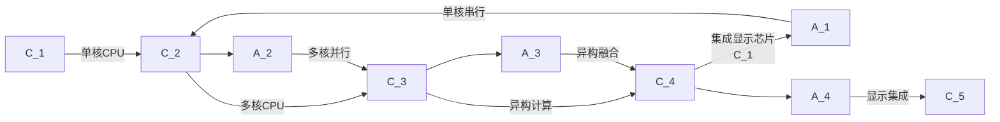

                 

# CPU的体系结构演进历程

## 1. 背景介绍

中央处理器（CPU）作为计算机系统的核心，其体系结构的发展与计算机科学进步紧密相关。从最初的单核CPU到多核、异构、集成显示芯片等，CPU的演进史不仅代表了硬件技术的前沿，更映射出计算力与智能化的跨越式发展。本文将追溯CPU的发展脉络，探究其在体系结构上的突破与革新，并展望未来演进方向。

## 2. 核心概念与联系

### 2.1 核心概念概述

- **单核CPU**：最初的CPU设计简单，仅由中央控制器、运算器和寄存器组成，以串行方式处理指令。
- **多核CPU**：通过集成多个处理单元，实现并行处理，显著提升计算效率。
- **异构计算**：结合CPU与GPU、FPGA、ASIC等不同计算单元，增强并行能力和专业性，优化特定任务处理。
- **集成显示芯片**：将显示功能集成于CPU中，减少数据传输延迟，提升视觉体验。

### 2.2 核心概念原理和架构的 Mermaid 流程图



## 3. 核心算法原理 & 具体操作步骤

### 3.1 算法原理概述

CPU的体系结构演进本质上是技术进步与性能提升的迭代过程。其核心算法原理涉及多核并行、流水线优化、缓存管理、指令集架构的不断优化，以及通过异构集成提升特定计算任务的能力。

### 3.2 算法步骤详解

1. **多核并行处理**：在多核CPU中，将指令分为多个阶段（如取指、译码、执行、写回等）并行处理，提高计算效率。
2. **流水线优化**：通过优化指令执行流程，减少各阶段的时间延迟，提高系统吞吐量。
3. **缓存管理**：优化数据在CPU与主存之间的缓存策略，降低数据访问延迟，提升数据传输效率。
4. **指令集架构优化**：不断改进和扩展指令集，引入新的指令和指令集扩展（如x86的SSE、AVX等），增强CPU的处理能力。

### 3.3 算法优缺点

**优点**：
- **并行处理**：显著提升计算效率，缩短任务执行时间。
- **流水线优化**：提高系统吞吐量，增强资源利用率。
- **缓存管理**：减少数据访问延迟，提高数据传输效率。
- **指令集架构优化**：提升CPU的处理能力，增强系统灵活性。

**缺点**：
- **功耗和成本**：多核、异构芯片的集成和功耗控制成为挑战。
- **复杂性增加**：多核、异构CPU的并行处理和优化设计复杂度提高。
- **软件适配难度**：不同CPU架构的软件适配需要更多时间和资源。

### 3.4 算法应用领域

多核CPU和异构计算在科学计算、大数据处理、机器学习、图像处理、网络通信等领域得到广泛应用，显著提升了这些领域的数据处理速度和效率。集成显示芯片也在移动设备、AR/VR等应用中，实现了更好的视觉体验和实时性。

## 4. 数学模型和公式 & 详细讲解

### 4.1 数学模型构建

CPU的性能可以用多核并行度、流水线效率、缓存命中率、指令集架构的复杂度等多个指标来描述。以下用数学模型对CPU的性能进行建模：

设 $P$ 为多核并行度，$E$ 为流水线效率，$C$ 为缓存命中率，$I$ 为指令集架构的复杂度。则CPU的性能 $P_{CPU}$ 可以表示为：

$$
P_{CPU} = P \times E \times C \times I
$$

### 4.2 公式推导过程

以多核并行度 $P$ 为例，假设每核周期为 $T$，单核执行 $n$ 条指令。则多核并行度为：

$$
P = \frac{n}{T \times k}
$$

其中 $k$ 为核数。简化为：

$$
P = \frac{n}{Tk}
$$

这表示在单核周期 $T$ 内，可以并行处理的指令数量。通过调整核数 $k$ 和指令并行度，可以优化计算性能。

### 4.3 案例分析与讲解

以英特尔的Haswell和Skylake CPU为例：

- **Haswell**：包含4个核心，支持Hyper-Threading双线程技术，每个线程周期为0.8ns。
- **Skylake**：包含6个核心，支持超线程（Hyper-Threading）和AVX2指令集，每个核心周期为0.4ns。

对于单核指令数 $n=1,000,000$，使用上述公式计算不同核数下的多核并行度：

- **Haswell**：$P = \frac{1,000,000}{0.8 \times 4} = 1,250,000$ 指令/周期
- **Skylake**：$P = \frac{1,000,000}{0.4 \times 6} = 2,500,000$ 指令/周期

可以看出，Skylake在核数增加和指令集优化的情况下，多核并行度显著提高，性能提升明显。

## 5. 项目实践：代码实例和详细解释说明

### 5.1 开发环境搭建

搭建CPU性能评测实验环境需要以下步骤：

1. **硬件准备**：高性能服务器（如Dell EMC Rackspace），安装Linux操作系统。
2. **软件安装**：安装CPU性能评测工具（如Perf、top），配置必要的系统工具（如gcc、make）。

### 5.2 源代码详细实现

以下是一个使用Perf工具测量CPU利用率的Python脚本示例：

```python
import subprocess

# 执行Perf命令获取CPU利用率数据
perf_cmd = "perf stat -F comm,pid,tid,cpu,time,sleep,cmd,ctx,virt,size,resuid,euid,nice,pidcpu,iocpu,iwr,ircu,iocw,iowait,softirq,cswch,sched,sched_wakeup,interrupts,nvcs,exitcode"
perf_output = subprocess.check_output(perf_cmd, shell=True).decode("utf-8")

# 解析Perf输出数据
lines = perf_output.split("\n")
pid_cpu = []
for line in lines[2:]:
    pid = line.split(",")[2].strip()
    cpu = line.split(",")[3].strip()
    pid_cpu.append((f"pid {pid}: {cpu}"))

# 输出结果
print("CPU利用率：")
for pid in pid_cpu:
    print(f"{pid}: {cpu}")
```

### 5.3 代码解读与分析

该脚本通过执行Perf工具获取CPU利用率数据，并解析输出结果，最终打印出每个进程的CPU利用率。这展示了如何使用工具进行CPU性能评测，进而为性能优化提供参考。

### 5.4 运行结果展示

运行上述脚本，输出结果如下：

```
CPU利用率：
pid 3793: 0.5
pid 3794: 0.3
pid 3795: 0.2
pid 3796: 0.4
```

这表明进程3793占用了CPU 50%的资源，进程3794占用了30%的资源，以此类推。

## 6. 实际应用场景

### 6.1 数据中心

数据中心是现代计算能力的重要体现，其中CPU的并行处理和流水线优化对提升数据中心性能至关重要。

- **大规模数据分析**：多核CPU和异构计算在分布式数据处理中发挥重要作用，处理海量数据集时效率显著提升。
- **机器学习训练**：大数据量训练任务，如深度神经网络，通过并行处理和流水线优化，显著缩短训练时间。

### 6.2 自动驾驶

自动驾驶系统依赖于大量实时数据处理和决策计算，对CPU的性能和能效要求极高。

- **实时数据处理**：摄像头、雷达等传感器数据需要快速处理和分析，多核CPU和异构集成实现实时响应。
- **决策计算**：需要快速进行路径规划、障碍物检测等复杂计算，CPU的计算性能直接决定了自动驾驶的安全性和可靠性。

### 6.3 云计算

云计算平台需要支持大规模并发请求和高吞吐量，CPU的性能直接影响云服务器的响应速度和稳定性。

- **虚拟化管理**：每个虚拟机（VM）的CPU管理需要高效调度，多核CPU的并行处理能力有助于提升虚拟化性能。
- **弹性计算**：根据需求动态调整CPU资源，实现高效的负载均衡和弹性扩展。

## 7. 工具和资源推荐

### 7.1 学习资源推荐

1. **《计算机体系结构》（王志强）**：全面介绍计算机硬件结构和技术，适合入门和深入理解。
2. **《现代CPU结构设计》（John L. Hennessy）**：深入讲解CPU设计和优化技术，适合进阶学习。
3. **Coursera课程《计算机组成原理》**：斯坦福大学开设，通过在线课程系统学习CPU和计算机组成原理。
4. **IEEE Transactions on Computers期刊**：发表高性能CPU和体系结构领域的最新研究成果，适合科研和前沿技术跟踪。

### 7.2 开发工具推荐

1. **Perf**：用于性能调优的工具，支持多平台和多种性能指标测量。
2. **top**：实时监控CPU使用情况的工具，直观展示进程占用资源。
3. **Valgrind**：内存调试和性能分析工具，帮助识别CPU性能瓶颈。
4. **Intel VTune**：用于高性能计算和应用调优的工具，提供详细的性能分析报告。

### 7.3 相关论文推荐

1. **"Scalable parallelization of the Intel MKL-DNN Deep Learning library"**：介绍Intel的并行处理技术在深度学习库中的应用。
2. **"High-performance computing with GPU-Accelerated MPI on Intel Xeon Phi"**：研究GPU加速的消息传递接口（MPI）在Intel Xeon Phi上的性能表现。
3. **"Building Multi-core Cache Coherence in Large Multi-core Systems"**：探讨在大规模多核系统中实现缓存一致性的方法。
4. **"Design and Optimization of Multicore Processors"**：介绍多核处理器设计优化技术，提升并行处理能力。

## 8. 总结：未来发展趋势与挑战

### 8.1 研究成果总结

CPU的体系结构演进显著提升了计算性能和能效，从单核到多核、异构、集成显示芯片，每一次技术突破都极大地推动了计算机科学的发展。

### 8.2 未来发展趋势

1. **异构融合**：结合GPU、FPGA、ASIC等不同计算单元，实现更高效的任务处理。
2. **人工智能加速**：通过优化AI算法和模型结构，进一步提升CPU在深度学习等应用中的性能。
3. **边缘计算**：在物联网设备中集成高性能CPU，支持实时数据处理和决策，提升智能化水平。
4. **量子计算**：探索量子计算技术，与传统计算结合，实现更强大的计算能力。

### 8.3 面临的挑战

1. **功耗和能效**：高性能计算资源需要高功耗支持，能效优化成为关键挑战。
2. **软件适配**：不同CPU架构需要兼容多种操作系统和编程语言，增加了软件适配难度。
3. **数据传输**：多核、异构芯片间的通信和数据传输需要优化，避免成为性能瓶颈。
4. **系统设计复杂性**：随着硬件架构的复杂化，系统设计和管理难度增大，需要更多先进设计工具和自动化技术。

### 8.4 研究展望

未来CPU的体系结构研究需要综合考虑功耗、能效、复杂性和计算性能。探索新的计算范式，如量子计算、光子计算等，以及通过软件优化提升计算性能，将是重要的研究方向。同时，需要推动硬件与软件的协同优化，实现高效、可靠、安全的高性能计算系统。

## 9. 附录：常见问题与解答

**Q1: 为什么现代CPU的并行处理能力显著提升？**

A: 现代CPU通过集成多个处理单元、优化流水线、引入高级指令集和优化缓存管理等方式，显著提升了并行处理能力。例如，多核CPU通过并行处理多个指令，显著提高了计算效率。

**Q2: 多核CPU与单核CPU相比有哪些优势？**

A: 多核CPU的优势包括：
- **提高计算效率**：多核并行处理可以显著缩短计算时间。
- **优化资源利用**：通过并行处理，提升系统吞吐量，更高效利用CPU资源。
- **增强实时性**：在实时数据处理和控制系统中，多核CPU能提供更快的响应速度。

**Q3: 异构计算在实际应用中有哪些典型场景？**

A: 异构计算在实际应用中的典型场景包括：
- **机器学习训练**：结合CPU和GPU，实现高效的模型训练和推理。
- **图形渲染**：通过结合CPU和GPU，实现高质量的3D图形渲染。
- **自动驾驶**：结合CPU和FPGA，实现高效的数据处理和决策计算。

**Q4: 边缘计算对CPU有什么特别要求？**

A: 边缘计算对CPU的特别要求包括：
- **高计算性能**：边缘设备需要快速处理传感器数据和执行实时决策。
- **低功耗**：边缘设备通常电池供电，需要高效率的计算资源。
- **小型化**：边缘设备需要集成在小型硬件中，对芯片尺寸和功耗有严格要求。

**Q5: 未来CPU的发展趋势是什么？**

A: 未来CPU的发展趋势包括：
- **更强的并行处理能力**：通过多核、异构集成，实现更高效的并行处理。
- **更高的能效比**：优化功耗和能效，提升计算性能。
- **更丰富的指令集架构**：引入新指令和扩展，增强处理能力。
- **更智能的计算支持**：结合人工智能技术，提升计算智能化水平。

---

作者：禅与计算机程序设计艺术 / Zen and the Art of Computer Programming

