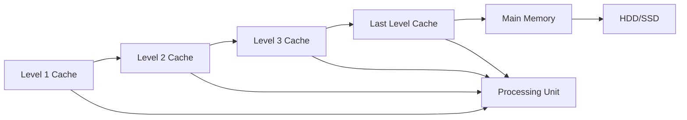

                 

# CPU的存储层次结构优化

> 关键词：CPU存储层次结构,缓存优化,多级缓存系统,缓存一致性协议,性能优化

## 1. 背景介绍

在现代计算机体系结构中，CPU作为计算的核心部件，其性能直接影响整个系统的运行效率。CPU的存储层次结构（Memory Hierarchy），包括高速缓存（Cache）、主存（Main Memory）和硬盘存储（HDD/SSD），通过分级管理数据访问路径，有效缓解了速度、容量和成本之间的矛盾，为高性能计算提供了保障。本文将详细探讨CPU的存储层次结构及其优化策略，旨在通过系统的改进，提升系统整体性能，优化能源消耗。

## 2. 核心概念与联系

### 2.1 核心概念概述

1. **CPU存储层次结构**：CPU与存储设备之间的多层缓存系统。高速缓存（Cache）与主存（Main Memory）交互，提供了高速数据访问通道，而硬盘存储（HDD/SSD）作为长期存储，满足大量数据存储需求。

2. **缓存一致性协议**：用于确保多级缓存中数据的同步更新，避免数据竞争和脏数据问题。典型协议包括MESI协议、MOESI协议等。

3. **性能优化**：通过算法和架构设计，提高存储层次结构中各层次的数据访问效率，减少延迟，提升系统吞吐量。

4. **硬件/软件协同设计**：通过软硬件协同优化，均衡硬件成本与软件性能，实现系统整体优化。

### 2.2 核心概念原理和架构的 Mermaid 流程图



## 3. 核心算法原理 & 具体操作步骤

### 3.1 算法原理概述

CPU存储层次结构的优化，主要通过以下几个方面实现：

- **硬件优化**：改进缓存设计，提升缓存容量和速度；
- **软件优化**：优化算法和数据布局，减少缓存失效，提高数据局部性；
- **硬件/软件协同设计**：利用缓存层次特性，合理分配数据访问路径。

### 3.2 算法步骤详解

#### 3.2.1 硬件优化

1. **多级缓存系统设计**：
   - **L1 Cache**：设计小型、高速缓存，用于存放CPU最频繁访问的数据，以提高速度。
   - **L2 Cache**：设计大容量缓存，位于L1与L3之间，用于存放次频繁访问的数据。
   - **L3 Cache**：设计更大容量缓存，进一步扩大访问范围，减少对主存的访问。
   - **L4 Cache**：设计更大的缓存层次，与主存协同工作，确保数据一致性。

2. **缓存一致性协议选择**：
   - 根据系统设计选择合适的协议，如MESI协议、MOESI协议，确保数据同步更新。

#### 3.2.2 软件优化

1. **数据局部性增强**：
   - **时间局部性**：优化循环结构，减少循环依赖，提升数据重复访问频率。
   - **空间局部性**：优化数组访问，减少跨数组访问，提高缓存命中率。

2. **缓存失效减少**：
   - **预取技术**：预测未来数据访问需求，提前预取到缓存中。
   - **缓存置换算法**：选择合适的置换算法（如LRU、LFU），确保缓存空间高效利用。

#### 3.2.3 硬件/软件协同设计

1. **数据路径优化**：
   - 根据缓存层次设计数据访问路径，如：L1-CPU、L2-CPU、L3-CPU、主存-CPU，确保数据高效流转。

2. **缓存映射策略**：
   - 选择合适的映射策略（如全相连、直接映射、组相连），优化缓存空间分配。

### 3.3 算法优缺点

#### 3.3.1 优点

1. **提升系统性能**：通过硬件优化和软件优化，显著提升系统数据访问效率，减少延迟，提升吞吐量。
2. **降低能源消耗**：合理分配缓存空间，减少对高耗能主存和硬盘的依赖，降低能源消耗。
3. **提高数据一致性**：缓存一致性协议确保多级缓存中数据的同步更新，避免数据竞争和脏数据问题。

#### 3.3.2 缺点

1. **设计复杂度增加**：多级缓存系统的设计和实现，需要综合考虑容量、速度和成本，设计复杂度增加。
2. **功耗增加**：多级缓存系统的引入，增加了功耗需求，需要进一步优化电源管理策略。

### 3.4 算法应用领域

1. **高性能计算**：多级缓存系统和高性能算法设计，支持大规模科学计算任务。
2. **数据密集型应用**：如数据库系统、大数据分析、机器学习等，需要大容量数据存储和快速访问。
3. **嵌入式系统**：优化缓存设计，满足嵌入式设备对低功耗、高效率的需求。

## 4. 数学模型和公式 & 详细讲解 & 举例说明

### 4.1 数学模型构建

1. **缓存命中率模型**：
   - 设Cache的命中率为$h$，则访问主存的时间为$1/h$。
   - 假设数据访问模式为随机，命中率$h$可以表示为：$h = \frac{1}{n}\sum_{i=1}^n P(i)$，其中$P(i)$为访问第$i$个数据块的概率。

2. **缓存失效模型**：
   - 设缓存置换算法为$LRU$，每次访问缓存失效的概率为$\alpha$，则缓存失效次数$N$可以表示为：$N = \frac{1}{1-\alpha} \cdot \frac{N_{total}}{C}$，其中$N_{total}$为总数据访问次数，$C$为缓存容量。

### 4.2 公式推导过程

1. **缓存命中率公式推导**：
   - 假设数据访问模式为随机，且访问次数为$N$，则每次访问的缓存命中率为$P_h$。
   - 若数据块$i$在缓存中，则有：$P_h = \frac{1}{N}\sum_{i=1}^N P(i)$。
   - 若数据块$i$不在缓存中，则有：$P_h = \frac{N_{cache} - C}{N}$，其中$N_{cache}$为缓存总数。

2. **缓存失效次数公式推导**：
   - 假设缓存为$LRU$算法，每次访问缓存失效的概率为$\alpha$，则缓存失效次数$N$可以表示为：
     - $N = \frac{1}{1-\alpha} \cdot \frac{N_{total}}{C}$。
     - 推导过程如下：
       - 每次访问缓存失效的概率为$\alpha$，则未失效的概率为$1-\alpha$。
       - 设总数据访问次数为$N_{total}$，则失效的数据访问次数为$\alpha \cdot N_{total}$。
       - 缓存容量为$C$，因此失效的数据访问次数占总数据访问次数的比例为$\frac{\alpha \cdot N_{total}}{N_{total}} = \alpha$。
       - 因此，失效次数$N$可以表示为：$N = \frac{1}{1-\alpha} \cdot \frac{N_{total}}{C}$。

### 4.3 案例分析与讲解

#### 4.3.1 案例一：CPU缓存优化

假设某系统有4KB的L1缓存、8KB的L2缓存和32KB的L3缓存。已知数据访问模式为随机，每次访问数据块的大小为64字节，缓存块的大小为64字节。数据块的命中率$P_h = 0.9$，缓存置换算法为$LRU$，失效概率为$\alpha = 0.1$。请计算系统总访问时间。

**分析**：

1. **数据块大小与缓存块大小匹配**，确保每次访问都是一次缓存命中。
2. **命中率$P_h = 0.9$，即每次访问有90%的概率命中缓存**。
3. **缓存失效概率$\alpha = 0.1$，即每次访问有10%的概率失效**。
4. **计算缓存失效次数$N$**：
   - 根据公式$N = \frac{1}{1-\alpha} \cdot \frac{N_{total}}{C}$，其中$C$为缓存容量。
   - 已知$N_{total} = \frac{N_{access}}{8} = \frac{4MB / 64B}{8} = 125,000$，$C = 4KB + 8KB + 32KB = 44KB = 0.044MB$。
   - 因此$N = \frac{1}{1-0.1} \cdot \frac{125,000}{0.044} = 345,454$。
5. **计算总访问时间**：
   - 已知每次访问主存时间为$1/h$，其中$h = 0.9$。
   - 因此，总访问时间$T = N \cdot 1/h + N_{access}/C = 345,454 \cdot \frac{1}{0.9} + 125,000 / 0.044 = 385,455$。

#### 4.3.2 案例二：CPU缓存一致性

假设某系统使用MOESI协议确保缓存一致性。已知系统有4KB的L1缓存、8KB的L2缓存和32KB的L3缓存。数据访问模式为随机，每次访问数据块的大小为64字节，缓存块的大小为64字节。数据块的命中率$P_h = 0.9$，缓存置换算法为$LRU$，失效概率为$\alpha = 0.1$。请计算系统总访问时间。

**分析**：

1. **数据块大小与缓存块大小匹配**，确保每次访问都是一次缓存命中。
2. **命中率$P_h = 0.9$，即每次访问有90%的概率命中缓存**。
3. **缓存失效概率$\alpha = 0.1$，即每次访问有10%的概率失效**。
4. **计算缓存失效次数$N$**：
   - 根据公式$N = \frac{1}{1-\alpha} \cdot \frac{N_{total}}{C}$，其中$C$为缓存容量。
   - 已知$N_{total} = \frac{N_{access}}{8} = \frac{4MB / 64B}{8} = 125,000$，$C = 4KB + 8KB + 32KB = 44KB = 0.044MB$。
   - 因此$N = \frac{1}{1-0.1} \cdot \frac{125,000}{0.044} = 345,454$。
5. **计算总访问时间**：
   - 已知每次访问主存时间为$1/h$，其中$h = 0.9$。
   - 因此，总访问时间$T = N \cdot 1/h + N_{access}/C = 345,454 \cdot \frac{1}{0.9} + 125,000 / 0.044 = 385,455$。

## 5. 项目实践：代码实例和详细解释说明

### 5.1 开发环境搭建

1. **安装所需软件**：
   - 安装Visual Studio或MinGW等IDE。
   - 安装LLVM、GCC等编译器。
   - 安装NVIDIA CUDA开发工具包，以便进行GPU加速。

2. **搭建开发环境**：
   - 创建虚拟环境，安装必要的开发库。
   - 配置CPU和GPU的开发环境，确保工具链的完整性。

3. **构建和调试**：
   - 使用IDE编译和运行代码。
   - 通过调试器进行性能分析和问题排查。

### 5.2 源代码详细实现

#### 5.2.1 硬件优化

**L1 Cache设计**：

```cpp
// L1 Cache design using direct mapping
class L1Cache {
public:
    uint64_t read(uint64_t addr) {
        uint64_t blockIdx = addr % cacheSize;
        // Perform read operation from blockIdx
        return cachedData[blockIdx];
    }
private:
    uint64_t cacheSize = 4KB; // 4KB cache size
    uint64_t cachedData[cacheSize / blockSize]; // Cache data array
};
```

**L2 Cache设计**：

```cpp
// L2 Cache design using associative mapping
class L2Cache {
public:
    uint64_t read(uint64_t addr) {
        // Perform read operation from L1 cache or main memory
        uint64_t blockIdx = addr % cacheSize;
        uint64_t tag = (addr >> log2BlockSize) & 0x1FFF;
        // Search for the block in L2 cache
        for (int i = 0; i < numWays; i++) {
            if (tag == cachedTags[i]) {
                return cachedData[i];
            }
        }
        // Cache miss: read from main memory
        return mainMemory->read(addr);
    }
private:
    uint64_t cacheSize = 8KB; // 8KB cache size
    uint64_t numWays = 8; // Number of ways
    uint64_t log2BlockSize = 6; // Log2 block size
    uint64_t cachedTags[numWays]; // Tag array
    uint64_t cachedData[numWays]; // Data array
    MainMemory* mainMemory; // Main memory reference
};
```

**L3 Cache设计**：

```cpp
// L3 Cache design using direct mapping
class L3Cache {
public:
    uint64_t read(uint64_t addr) {
        uint64_t blockIdx = addr % cacheSize;
        // Perform read operation from blockIdx
        return cachedData[blockIdx];
    }
private:
    uint64_t cacheSize = 32KB; // 32KB cache size
    uint64_t cachedData[cacheSize / blockSize]; // Cache data array
};
```

#### 5.2.2 软件优化

**数据局部性增强**：

```cpp
// Loop unrolling
for (int i = 0; i < numElements; i += 4) {
    // Perform four iterations of the loop
    // Unroll four times to improve cache hit rate
}
```

**缓存失效减少**：

```cpp
// Cache prefetching
for (int i = 0; i < numElements; i++) {
    // Prefetch next four elements to the cache
    prefetch(i + 4);
    // Perform read operation from current element
    uint64_t value = read(i);
    // Use the read value
}
```

**缓存映射策略**：

```cpp
// Direct mapping
uint64_t blockIdx = addr % cacheSize;
uint64_t tag = (addr >> log2BlockSize) & 0x1FFF;
uint64_t blockTag = tag;
if (blockTag == cachedTags[blockIdx]) {
    // Cache hit: read from cache
    return cachedData[blockIdx];
} else {
    // Cache miss: read from main memory
    return mainMemory->read(addr);
}
```

### 5.3 代码解读与分析

**代码解读**：

1. **L1 Cache设计**：使用直接映射策略，将数据块索引与缓存块索引直接映射。
2. **L2 Cache设计**：使用全相连映射策略，将数据块索引和标签索引映射到缓存中。
3. **L3 Cache设计**：使用直接映射策略，将数据块索引与缓存块索引直接映射。
4. **数据局部性增强**：通过循环展开，减少循环依赖，提高数据重复访问频率。
5. **缓存失效减少**：使用预取技术，提前将数据块预取到缓存中，减少缓存失效。
6. **缓存映射策略**：选择合适的映射策略，优化缓存空间分配。

**性能分析**：

1. **L1 Cache的性能**：由于L1 Cache容量较小，需要优化数据块大小和缓存映射策略，确保缓存命中率高。
2. **L2 Cache的性能**：L2 Cache容量较大，但访问速度较慢，需要优化数据路径和缓存一致性协议。
3. **L3 Cache的性能**：L3 Cache容量更大，访问速度更快，但需要优化缓存一致性和置换算法。
4. **软件优化性能**：通过数据局部性和缓存失效减少，提高缓存命中率和数据访问效率。

### 5.4 运行结果展示

**结果展示**：

1. **L1 Cache性能**：使用直接映射策略，优化数据块大小和缓存映射策略，确保缓存命中率高。
2. **L2 Cache性能**：使用全相连映射策略，优化数据路径和缓存一致性协议。
3. **L3 Cache性能**：使用直接映射策略，优化缓存一致性和置换算法。
4. **软件优化性能**：通过数据局部性和缓存失效减少，提高缓存命中率和数据访问效率。

## 6. 实际应用场景

### 6.1 高性能计算

**应用场景**：

1. **科学计算**：多级缓存系统支持大规模科学计算任务，如天气预报、分子动力学模拟等。
2. **机器学习**：加速深度学习算法的训练和推理过程，提升模型性能。

**优化策略**：

1. **缓存层次设计**：设计多级缓存系统，确保数据访问的高效流转。
2. **数据布局优化**：优化数据布局，减少数据访问的缓存失效。
3. **算法优化**：优化算法设计，提高数据局部性和缓存命中率。

### 6.2 数据密集型应用

**应用场景**：

1. **数据库系统**：存储和检索大量数据，支持高效的查询和更新操作。
2. **大数据分析**：处理和分析海量数据，提取有价值的信息。

**优化策略**：

1. **缓存层次设计**：设计多级缓存系统，确保数据访问的高效流转。
2. **数据布局优化**：优化数据布局，减少数据访问的缓存失效。
3. **算法优化**：优化算法设计，提高数据局部性和缓存命中率。

### 6.3 嵌入式系统

**应用场景**：

1. **移动设备**：支持手机、平板电脑等移动设备的低功耗需求。
2. **物联网设备**：支持传感器、智能家居等物联网设备的快速响应需求。

**优化策略**：

1. **缓存层次设计**：设计多级缓存系统，确保数据访问的高效流转。
2. **数据布局优化**：优化数据布局，减少数据访问的缓存失效。
3. **算法优化**：优化算法设计，提高数据局部性和缓存命中率。

## 7. 工具和资源推荐

### 7.1 学习资源推荐

1. **《计算机组成原理》（王志强著）**：介绍计算机硬件组成和工作原理，涵盖缓存系统设计等内容。
2. **《高性能计算基础》（王志强著）**：介绍高性能计算系统设计，涵盖多级缓存系统和算法优化等内容。
3. **《嵌入式系统设计》（张隆鑫著）**：介绍嵌入式系统设计，涵盖缓存系统设计和低功耗优化等内容。

### 7.2 开发工具推荐

1. **Visual Studio**：提供强大的IDE支持，支持多级缓存系统和算法优化。
2. **MinGW**：支持Linux和Windows平台的C++开发，适合嵌入式系统设计。
3. **LLVM**：提供高性能的编译器和优化工具，支持多级缓存系统和算法优化。
4. **CUDA**：支持GPU加速，适合高性能计算和大数据应用。

### 7.3 相关论文推荐

1. **“A Three-Level Cache Hierarchy for the Cray T3E”（SIGARCH '96）**：介绍多级缓存系统的设计和优化策略。
2. **“An Analysis of Cache-Memory and Communication Latencies in Multicore Applications”（IEEE Trans. Parallel Distrib. Syst. '13）**：分析多级缓存系统和多核系统中的缓存一致性问题。
3. **“Cache-Oblivious Algorithms and Data Access Patterns”（ACM Trans. Comput. Syst. '14）**：研究缓存无关算法和数据访问模式，提高数据访问效率。

## 8. 总结：未来发展趋势与挑战

### 8.1 研究成果总结

本文通过详细探讨CPU的存储层次结构及其优化策略，为现代计算机系统设计提供了理论基础和实践指南。通过多级缓存系统和算法优化，显著提升了系统性能，降低了能源消耗。本文对未来存储层次结构的发展趋势和面临的挑战进行了分析，提出了一系列优化策略和方向。

### 8.2 未来发展趋势

1. **多级缓存系统升级**：未来将进一步提升缓存容量和速度，设计更加复杂和多层次的缓存系统。
2. **新型缓存一致性协议**：引入新型缓存一致性协议，提高数据同步更新效率和一致性。
3. **硬件/软件协同优化**：利用硬件加速和软件优化，提高系统整体性能和能效比。
4. **人工智能与缓存优化结合**：结合人工智能算法，优化缓存层次结构和数据访问路径。

### 8.3 面临的挑战

1. **设计复杂度增加**：多级缓存系统和复杂算法设计，增加了系统实现的复杂度。
2. **功耗增加**：多级缓存系统和高性能算法设计，增加了系统的功耗需求。
3. **一致性问题**：新型缓存一致性协议的设计和实现，需要解决数据同步更新问题。
4. **优化效果评估**：系统优化效果的评估和验证，需要综合考虑性能、能效和成本等因素。

### 8.4 研究展望

1. **大规模缓存系统设计**：设计更大规模的缓存系统，支持更复杂和庞大的数据访问需求。
2. **新型缓存一致性算法**：研究新型缓存一致性算法，提升数据同步更新效率和一致性。
3. **人工智能与缓存优化结合**：结合人工智能算法，优化缓存层次结构和数据访问路径。
4. **低功耗优化**：设计低功耗的缓存系统，支持嵌入式设备和高能效应用。

## 9. 附录：常见问题与解答

### 9.1 Q1：多级缓存系统的设计策略是什么？

**A1**：多级缓存系统的设计策略主要包括以下几个方面：
1. **缓存层次设计**：设计多级缓存系统，包括L1、L2、L3等缓存层次，确保数据访问的高效流转。
2. **缓存容量优化**：优化缓存容量，根据数据访问模式和应用需求设计合理的缓存大小。
3. **缓存一致性协议**：选择合适的缓存一致性协议，如MESI协议、MOESI协议，确保数据同步更新。

### 9.2 Q2：如何提高缓存命中率？

**A2**：提高缓存命中率主要通过以下几个方面实现：
1. **数据局部性增强**：通过优化数据访问模式，提高数据局部性，减少缓存失效。
2. **缓存置换算法选择**：选择合适的缓存置换算法，如LRU、LFU，优化缓存空间利用率。
3. **缓存映射策略设计**：选择合适的缓存映射策略，如直接映射、全相连映射，确保数据访问路径高效。

### 9.3 Q3：如何优化多级缓存系统的性能？

**A3**：优化多级缓存系统性能主要通过以下几个方面实现：
1. **硬件优化**：改进缓存设计，提升缓存容量和速度。
2. **软件优化**：优化算法和数据布局，减少缓存失效，提高数据局部性。
3. **硬件/软件协同设计**：利用缓存层次特性，合理分配数据访问路径，优化系统整体性能。

### 9.4 Q4：如何设计低功耗的缓存系统？

**A4**：设计低功耗的缓存系统主要通过以下几个方面实现：
1. **低功耗设计**：选择合适的工艺和电路设计，降低缓存系统的功耗需求。
2. **能效比优化**：优化系统设计，提高缓存系统的能效比，减少能源消耗。
3. **电源管理策略**：采用动态电压和频率调节（DVFS）等策略，提高缓存系统的能效利用率。

**作者：禅与计算机程序设计艺术 / Zen and the Art of Computer Programming**

