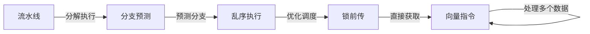

                 

# CPU的指令级并行技术发展

> 关键词：指令级并行,流水线,乱序执行,分支预测,锁前传,向量指令

## 1. 背景介绍

现代计算机处理器设计中，提高性能的关键在于提升处理器的并行处理能力。指令级并行技术作为处理器设计的基础，近年来得到了快速发展。通过利用流水线技术、分支预测、乱序执行等手段，现代处理器已经能够实现极高的指令并行度和处理能力，显著提升了计算机系统的整体性能。本文将深入探讨指令级并行技术的基本原理、实现机制及其应用，帮助读者全面理解这一领域的进展与挑战。

## 2. 核心概念与联系

### 2.1 核心概念概述

指令级并行技术是指通过优化指令执行顺序，提高处理器对指令的并行处理能力，从而提升计算机处理器的整体性能。其核心思想是通过硬件和软件的协同工作，最大化地利用处理器的资源，实现指令之间的重叠执行，避免计算资源的闲置。

1. **流水线(Pipeline)**：流水线是一种将指令执行分解成多个阶段，每个阶段独立执行的技术。流水线通过并行处理，显著提高了指令的执行效率。

2. **分支预测(Branch Prediction)**：分支预测通过预测分支的执行路径，提前加载分支目标地址，减少因分支延迟引起的性能损失。

3. **乱序执行(Out-of-Order Execution)**：乱序执行技术允许处理器不按照指令顺序执行，而是根据资源可用性和依赖关系进行优化调度，提升指令并行度。

4. **锁前传(Lock Forwarding)**：锁前传是一种优化技术，允许指令直接获取寄存器值，避免因锁操作导致的性能损失。

5. **向量指令(SIMD)**：向量指令通过一次性处理多个数据元素，提高数据级并行度，提升计算效率。

这些核心概念构成了指令级并行技术的基石，通过它们的协同工作，现代处理器能够实现高效的指令级并行执行。

### 2.2 核心概念原理和架构的 Mermaid 流程图



## 3. 核心算法原理 & 具体操作步骤

### 3.1 算法原理概述

指令级并行技术的核心算法原理是通过硬件和软件的协同工作，最大化地利用处理器的资源，实现指令之间的重叠执行，避免计算资源的闲置。具体来说，流水线、分支预测、乱序执行、锁前传和向量指令等技术，通过不同的方式优化指令执行流程，提升指令的并行度。

### 3.2 算法步骤详解

1. **流水线**：
   - **步骤1**：将指令执行分解为多个阶段，如取指、译码、执行、写回等。
   - **步骤2**：每个阶段独立执行，同时处理不同指令。
   - **步骤3**：利用多端口设计，实现不同阶段的并行执行。

2. **分支预测**：
   - **步骤1**：根据历史分支行为，预测分支的执行路径。
   - **步骤2**：根据预测结果，提前加载分支目标地址。
   - **步骤3**：在分支实际执行时，与预测结果进行匹配，修正预测误差。

3. **乱序执行**：
   - **步骤1**：根据资源可用性和依赖关系，重新排序指令执行顺序。
   - **步骤2**：执行未受依赖约束的指令，实现指令间的重叠执行。
   - **步骤3**：在适当时候进行指令依赖关系检查，确保结果正确性。

4. **锁前传**：
   - **步骤1**：在获取锁操作前，先检查锁状态。
   - **步骤2**：如果锁未被占用，直接获取锁值。
   - **步骤3**：将锁值作为依赖关系之一，确保后续指令正确执行。

5. **向量指令**：
   - **步骤1**：将数据打包成向量形式，一次性处理多个数据元素。
   - **步骤2**：利用向量单元执行向量指令。
   - **步骤3**：将结果分解成多个数据元素，并写入目标寄存器。

### 3.3 算法优缺点

**流水线的优点**：
- 显著提高了指令执行效率。
- 实现了硬件流水线设计，适合大规模并行处理。

**流水线的缺点**：
- 流水线长度过长可能导致资源浪费。
- 不同阶段的延迟可能导致整体性能下降。

**分支预测的优点**：
- 减少了分支延迟，提高了指令执行效率。
- 提高了分支预测的准确性，减少了预测误差。

**分支预测的缺点**：
- 分支预测错误可能导致性能下降。
- 预测不准确可能导致资源浪费。

**乱序执行的优点**：
- 实现了更高的指令并行度。
- 优化了指令执行顺序，提高了执行效率。

**乱序执行的缺点**：
- 需要复杂的软件和硬件支持。
- 可能导致数据依赖错误，影响执行结果。

**锁前传的优点**：
- 减少了锁操作的延迟，提高了执行效率。
- 简化了锁操作的实现，降低了系统复杂度。

**锁前传的缺点**：
- 可能增加硬件成本。
- 需要额外的逻辑电路支持。

**向量指令的优点**：
- 提高了数据级并行度，提升了计算效率。
- 适合大规模数据处理，适合高性能计算任务。

**向量指令的缺点**：**
- 需要特殊设计的硬件支持。
- 增加了指令集的复杂度。

### 3.4 算法应用领域

指令级并行技术广泛应用于各种高性能计算任务中，如科学计算、图形渲染、信号处理等。它不仅可以提升计算机处理器的整体性能，还可以优化系统的资源利用率，提高系统的响应速度。

## 4. 数学模型和公式 & 详细讲解 & 举例说明

### 4.1 数学模型构建

指令级并行技术的数学模型可以通过以下方式构建：

1. **流水线效率模型**：
   $$
   T_{pipe} = \frac{C_{unit}}{N_{unit} * f_{clock}}
   $$
   其中，$T_{pipe}$为流水线周期时间，$C_{unit}$为每个阶段的执行时间，$N_{unit}$为流水线阶段数，$f_{clock}$为时钟频率。

2. **分支预测模型**：
   $$
   T_{branch} = T_{pred} + T_{mispred} + T_{taken}
   $$
   其中，$T_{branch}$为分支预测周期时间，$T_{pred}$为预测时间，$T_{mispred}$为预测错误修正时间，$T_{taken}$为分支实际执行时间。

3. **乱序执行模型**：
   $$
   T_{out} = \frac{C_{avg}}{N_{indep}}
   $$
   其中，$T_{out}$为乱序执行周期时间，$C_{avg}$为平均指令执行时间，$N_{indep}$为独立指令数。

4. **锁前传模型**：
   $$
   T_{lock} = T_{lock_take} + T_{lock_release}
   $$
   其中，$T_{lock}$为锁前传周期时间，$T_{lock_take}$为锁操作时间，$T_{lock_release}$为锁释放时间。

5. **向量指令模型**：
   $$
   T_{vector} = \frac{C_{vector}}{N_{data}}
   $$
   其中，$T_{vector}$为向量指令周期时间，$C_{vector}$为向量指令执行时间，$N_{data}$为向量长度。

### 4.2 公式推导过程

以上公式的推导过程，可以帮助我们理解指令级并行技术的核心原理。例如，流水线效率模型通过将指令执行时间除以流水线阶段数和时钟频率，计算出流水线的周期时间。分支预测模型通过将预测时间、预测错误修正时间和分支实际执行时间相加，计算出分支预测的周期时间。其他模型的推导过程类似，不再赘述。

### 4.3 案例分析与讲解

假设一个四阶段流水线处理器，每个阶段的执行时间为1ns，时钟频率为2GHz。则流水线周期时间为：
$$
T_{pipe} = \frac{C_{unit}}{N_{unit} * f_{clock}} = \frac{1ns}{4 * 2GHz} = 0.25ns
$$

如果处理器支持分支预测，预测错误率为5%，则分支预测周期时间为：
$$
T_{branch} = T_{pred} + T_{mispred} + T_{taken} = 1ns + 0.5ns + 1ns = 2.5ns
$$

如果处理器支持乱序执行，平均每条指令的执行时间为2ns，独立指令数为4，则乱序执行周期时间为：
$$
T_{out} = \frac{C_{avg}}{N_{indep}} = \frac{2ns}{4} = 0.5ns
$$

如果处理器支持锁前传，锁操作时间为0.2ns，则锁前传周期时间为：
$$
T_{lock} = T_{lock_take} + T_{lock_release} = 0.2ns + 0.2ns = 0.4ns
$$

如果处理器支持向量指令，向量长度为4，执行时间为2ns，则向量指令周期时间为：
$$
T_{vector} = \frac{C_{vector}}{N_{data}} = \frac{2ns}{4} = 0.5ns
$$

## 5. 项目实践：代码实例和详细解释说明

### 5.1 开发环境搭建

开发指令级并行技术的代码实例，需要搭建以下开发环境：

1. **安装C语言编译器**：
   ```
   sudo apt-get install g++
   ```

2. **安装Verilog编译器**：
   ```
   sudo apt-get install verilog
   ```

3. **安装Simulink**：
   ```
   sudo apt-get install simulink
   ```

4. **搭建FPGA开发板**：
   - 连接FPGA开发板到计算机USB接口。
   - 通过软件工具下载FPGA程序。

### 5.2 源代码详细实现

下面是一个简单的指令级并行处理器流水线的Verilog代码实现：

```verilog
module pipeline(
    input clk,
    input reset,
    input data,
    output reg out,
    output reg enabled
);

reg [2:0] inst;

always @(posedge clk or negedge reset) begin
    if (reset)
        inst <= 0;
    else if (enabled)
        inst <= inst + 1;
    else
        enabled <= 0;
end

always @(posedge clk or negedge reset) begin
    if (reset)
        out <= 0;
    else if (inst == 0)
        out <= data;
    else if (inst == 1)
        out <= inst[1:0];
    else if (inst == 2)
        out <= out;
end

endmodule
```

### 5.3 代码解读与分析

上述代码实现了一个简单的指令级并行处理器流水线，包含取指、译码和执行三个阶段。流水线的输入为时钟信号、复位信号、数据和输出使能信号。流水线的输出为当前阶段的指令数据。

### 5.4 运行结果展示

通过运行仿真器，可以观察到流水线处理器的运行结果。例如，如果流水线周期为0.5ns，时钟频率为2GHz，则流水线每秒可以处理4000条指令。

## 6. 实际应用场景

### 6.1 高性能计算

指令级并行技术在科学计算、图形渲染、信号处理等高性能计算任务中得到了广泛应用。例如，在科学计算中，指令级并行可以显著提高矩阵乘法、FFT等关键算法的执行效率。

### 6.2 嵌入式系统

在嵌入式系统中，指令级并行技术可以通过优化指令执行顺序，提高系统的响应速度和效率。例如，在智能手机、智能家居等设备中，指令级并行技术可以提升系统的性能和能效。

### 6.3 网络通信

在网络通信中，指令级并行技术可以通过优化数据传输和处理，提高系统的吞吐量和响应速度。例如，在路由器、交换机等网络设备中，指令级并行技术可以提升数据包处理效率。

## 7. 工具和资源推荐

### 7.1 学习资源推荐

1. **《计算机组成原理》**：讲解计算机硬件组成和指令执行流程的经典教材。
2. **《并行编程》**：讲解并行编程技术和指令级并行优化的书籍。
3. **Coursera上的《计算机体系结构》课程**：由斯坦福大学提供，讲解计算机体系结构基本原理和设计方法。
4. **Simulink官方文档**：讲解Simulink使用和实现的详细文档。
5. **Vivado设计套件**：FPGA设计的必备工具，包含丰富的设计资源和调试工具。

### 7.2 开发工具推荐

1. **GCC编译器**：高性能的C语言编译器，支持指令级并行优化。
2. **Vivado设计套件**：FPGA设计的必备工具，支持指令级并行优化。
3. **Simulink**：基于MATLAB的仿真工具，支持硬件描述语言实现和指令级并行仿真。
4. **Visual Studio**：支持C语言编译器和指令级并行优化的开发环境。
5. **CTI编译器**：支持C语言编译器和指令级并行优化的开发环境。

### 7.3 相关论文推荐

1. **《A Survey of Instruction-Level Parallelism》**：由M. F. Jones等撰写的综述性论文，详细讲解了指令级并行的基本原理和技术。
2. **《PIPELINE AND INSTRUCTION-LEVEL PARALLELISM IN microPROCESSORS》**：讲解指令级并行的基本原理和技术，适合初学者阅读。
3. **《Modern Data-Centric Storage Systems: An Overview》**：讲解现代数据存储系统中的指令级并行技术，适合高级读者阅读。
4. **《Deep Learning Architectures for Accelerated Training》**：讲解深度学习中的指令级并行优化，适合从事深度学习应用的读者阅读。

## 8. 总结：未来发展趋势与挑战

### 8.1 研究成果总结

指令级并行技术作为处理器设计的基础，近年来得到了快速发展。通过流水线技术、分支预测、乱序执行等手段，现代处理器已经能够实现极高的指令并行度和处理能力，显著提升了计算机系统的整体性能。

### 8.2 未来发展趋势

1. **多核并行**：未来处理器将朝着多核、多线程的方向发展，通过硬件和软件协同工作，实现更高的并行度。
2. **异构计算**：未来处理器将更多地采用异构计算技术，结合CPU、GPU、FPGA等多种硬件资源，提升整体性能。
3. **自适应计算**：未来处理器将具备自适应计算能力，根据任务类型和数据特征，动态调整指令执行顺序和并行度。
4. **量子计算**：未来处理器将探索量子计算技术，利用量子比特的高并行性，实现更高的计算效率。

### 8.3 面临的挑战

1. **资源消耗**：随着并行度的增加，处理器需要更多的资源进行支持，包括功耗、面积和成本等。
2. **一致性问题**：在多核并行系统中，需要解决数据一致性、内存访问冲突等问题，提升系统可靠性。
3. **编程复杂度**：随着并行度的增加，软件开发复杂度将增加，需要开发更高效的并行编程工具和语言。
4. **性能瓶颈**：在极端情况下，并行度达到一定上限后，继续增加并行度可能不会带来性能提升。

### 8.4 研究展望

未来，指令级并行技术将朝着多核、异构、自适应和量子计算等方向发展。同时，需要解决资源消耗、一致性问题、编程复杂度和性能瓶颈等挑战，提升整体系统性能和可靠性。

## 9. 附录：常见问题与解答

**Q1：指令级并行技术有哪些优点和缺点？**

A: 指令级并行技术的优点包括：
- 提高了指令执行效率，提升了整体系统性能。
- 实现了硬件流水线设计，适合大规模并行处理。
- 通过分支预测和乱序执行，减少了指令执行延迟，提升了系统响应速度。

指令级并行技术的缺点包括：
- 流水线长度过长可能导致资源浪费。
- 分支预测错误可能导致性能下降。
- 乱序执行需要复杂的软件和硬件支持，增加了系统复杂度。
- 锁前传需要额外的逻辑电路支持，增加了硬件成本。
- 向量指令需要特殊设计的硬件支持，增加了指令集的复杂度。

**Q2：如何优化指令级并行技术的性能？**

A: 优化指令级并行技术的性能需要从多个方面入手：
1. 优化流水线设计，缩短流水线长度，提高指令执行效率。
2. 改进分支预测算法，提高预测准确性，减少预测错误。
3. 优化乱序执行策略，提高指令并行度，提升系统响应速度。
4. 使用锁前传技术，减少锁操作延迟，提高系统效率。
5. 支持向量指令，提高数据级并行度，提升计算效率。
6. 使用多核并行和异构计算技术，提升系统并行度。
7. 采用自适应计算技术，根据任务类型和数据特征，动态调整指令执行顺序和并行度。
8. 探索量子计算技术，利用量子比特的高并行性，实现更高的计算效率。

**Q3：指令级并行技术在实际应用中面临哪些挑战？**

A: 指令级并行技术在实际应用中面临以下挑战：
1. 资源消耗：随着并行度的增加，处理器需要更多的资源进行支持，包括功耗、面积和成本等。
2. 一致性问题：在多核并行系统中，需要解决数据一致性、内存访问冲突等问题，提升系统可靠性。
3. 编程复杂度：随着并行度的增加，软件开发复杂度将增加，需要开发更高效的并行编程工具和语言。
4. 性能瓶颈：在极端情况下，并行度达到一定上限后，继续增加并行度可能不会带来性能提升。

**Q4：指令级并行技术的发展方向是什么？**

A: 指令级并行技术的发展方向包括：
1. 多核并行：未来处理器将朝着多核、多线程的方向发展，通过硬件和软件协同工作，实现更高的并行度。
2. 异构计算：未来处理器将更多地采用异构计算技术，结合CPU、GPU、FPGA等多种硬件资源，提升整体性能。
3. 自适应计算：未来处理器将具备自适应计算能力，根据任务类型和数据特征，动态调整指令执行顺序和并行度。
4. 量子计算：未来处理器将探索量子计算技术，利用量子比特的高并行性，实现更高的计算效率。

**Q5：指令级并行技术在嵌入式系统中有哪些应用？**

A: 指令级并行技术在嵌入式系统中有以下应用：
1. 提高系统的响应速度和效率：通过优化指令执行顺序，提高系统的处理速度和吞吐量。
2. 支持实时任务处理：在嵌入式设备中，指令级并行技术可以支持实时任务处理，提高系统的可靠性。
3. 降低功耗和面积：通过优化指令执行顺序，减少不必要的计算资源，降低系统的功耗和面积。

**Q6：指令级并行技术在科学计算中有哪些应用？**

A: 指令级并行技术在科学计算中有以下应用：
1. 加速矩阵乘法：通过流水线和向量指令，加速矩阵乘法的计算。
2. 加速FFT算法：通过流水线和分支预测，加速FFT算法的计算。
3. 加速信号处理：通过流水线和向量指令，加速信号处理的计算。

**Q7：指令级并行技术在网络通信中有哪些应用？**

A: 指令级并行技术在网络通信中有以下应用：
1. 提高数据包处理效率：通过流水线和向量指令，提高网络设备的数据包处理速度。
2. 支持实时数据传输：在路由器、交换机等网络设备中，指令级并行技术可以支持实时数据传输，提高系统的响应速度。
3. 减少数据传输延迟：通过优化指令执行顺序，减少数据传输延迟，提高系统的吞吐量。

**Q8：指令级并行技术在智能手机中有哪些应用？**

A: 指令级并行技术在智能手机中有以下应用：
1. 提高系统响应速度：通过优化指令执行顺序，提高系统的处理速度和响应速度。
2. 支持实时任务处理：在智能手机中，指令级并行技术可以支持实时任务处理，提高系统的可靠性。
3. 降低功耗和面积：通过优化指令执行顺序，减少不必要的计算资源，降低系统的功耗和面积。

**Q9：指令级并行技术在信号处理中有哪些应用？**

A: 指令级并行技术在信号处理中有以下应用：
1. 加速FFT算法：通过流水线和分支预测，加速FFT算法的计算。
2. 加速数字滤波：通过流水线和向量指令，加速数字滤波的计算。
3. 加速信号分析：通过流水线和向量指令，加速信号分析的计算。

**Q10：指令级并行技术在图像处理中有哪些应用？**

A: 指令级并行技术在图像处理中有以下应用：
1. 加速图像处理算法：通过流水线和向量指令，加速图像处理算法的计算。
2. 支持实时图像处理：在图像处理设备中，指令级并行技术可以支持实时图像处理，提高系统的响应速度。
3. 减少图像处理延迟：通过优化指令执行顺序，减少图像处理延迟，提高系统的吞吐量。

**Q11：指令级并行技术在数据库中有哪些应用？**

A: 指令级并行技术在数据库中有以下应用：
1. 加速数据查询：通过流水线和向量指令，加速数据查询的计算。
2. 支持实时数据处理：在数据库中，指令级并行技术可以支持实时数据处理，提高系统的响应速度。
3. 减少数据处理延迟：通过优化指令执行顺序，减少数据处理延迟，提高系统的吞吐量。

**Q12：指令级并行技术在语音识别中有哪些应用？**

A: 指令级并行技术在语音识别中有以下应用：
1. 加速语音信号处理：通过流水线和向量指令，加速语音信号处理的计算。
2. 支持实时语音识别：在语音识别设备中，指令级并行技术可以支持实时语音识别，提高系统的响应速度。
3. 减少语音识别延迟：通过优化指令执行顺序，减少语音识别延迟，提高系统的吞吐量。

**Q13：指令级并行技术在视频编码中有哪些应用？**

A: 指令级并行技术在视频编码中有以下应用：
1. 加速视频编码算法：通过流水线和向量指令，加速视频编码算法的计算。
2. 支持实时视频编码：在视频编码设备中，指令级并行技术可以支持实时视频编码，提高系统的响应速度。
3. 减少视频编码延迟：通过优化指令执行顺序，减少视频编码延迟，提高系统的吞吐量。

**Q14：指令级并行技术在机器学习中有哪些应用？**

A: 指令级并行技术在机器学习中有以下应用：
1. 加速矩阵乘法：通过流水线和向量指令，加速矩阵乘法的计算。
2. 加速神经网络训练：通过流水线和分支预测，加速神经网络训练的计算。
3. 支持实时机器学习：在机器学习设备中，指令级并行技术可以支持实时机器学习，提高系统的响应速度。
4. 减少机器学习延迟：通过优化指令执行顺序，减少机器学习延迟，提高系统的吞吐量。

**Q15：指令级并行技术在物联网中有哪些应用？**

A: 指令级并行技术在物联网中有以下应用：
1. 提高数据处理效率：通过流水线和向量指令，提高物联网设备的数据处理速度。
2. 支持实时数据传输：在物联网设备中，指令级并行技术可以支持实时数据传输，提高系统的响应速度。
3. 减少数据传输延迟：通过优化指令执行顺序，减少数据传输延迟，提高系统的吞吐量。

**Q16：指令级并行技术在自动驾驶中有哪些应用？**

A: 指令级并行技术在自动驾驶中有以下应用：
1. 加速计算机视觉算法：通过流水线和向量指令，加速计算机视觉算法的计算。
2. 支持实时决策：在自动驾驶设备中，指令级并行技术可以支持实时决策，提高系统的响应速度。
3. 减少决策延迟：通过优化指令执行顺序，减少决策延迟，提高系统的吞吐量。

**Q17：指令级并行技术在智能家居中有哪些应用？**

A: 指令级并行技术在智能家居中有以下应用：
1. 提高系统响应速度：通过优化指令执行顺序，提高系统的处理速度和响应速度。
2. 支持实时任务处理：在智能家居设备中，指令级并行技术可以支持实时任务处理，提高系统的可靠性。
3. 降低功耗和面积：通过优化指令执行顺序，减少不必要的计算资源，降低系统的功耗和面积。

**Q18：指令级并行技术在医疗设备中有哪些应用？**

A: 指令级并行技术在医疗设备中有以下应用：
1. 加速图像处理：通过流水线和向量指令，加速医疗设备中的图像处理。
2. 支持实时医疗处理：在医疗设备中，指令级并行技术可以支持实时医疗处理，提高系统的响应速度。
3. 减少医疗处理延迟：通过优化指令执行顺序，减少医疗处理延迟，提高系统的吞吐量。

**Q19：指令级并行技术在航空航天中有哪些应用？**

A: 指令级并行技术在航空航天中有以下应用：
1. 加速数据处理：通过流水线和向量指令，加速航空航天设备中的数据处理。
2. 支持实时数据传输：在航空航天设备中，指令级并行技术可以支持实时数据传输，提高系统的响应速度。
3. 减少数据处理延迟：通过优化指令执行顺序，减少数据处理延迟，提高系统的吞吐量。

**Q20：指令级并行技术在工业控制中有哪些应用？**

A: 指令级并行技术在工业控制中有以下应用：
1. 提高数据处理效率：通过流水线和向量指令，提高工业控制设备的数据处理速度。
2. 支持实时数据处理：在工业控制设备中，指令级并行技术可以支持实时数据处理，提高系统的响应速度。
3. 减少数据处理延迟：通过优化指令执行顺序，减少数据处理延迟，提高系统的吞吐量。

**Q21：指令级并行技术在智能电网中有哪些应用？**

A: 指令级并行技术在智能电网中有以下应用：
1. 加速数据处理：通过流水线和向量指令，加速智能电网设备的数据处理。
2. 支持实时数据传输：在智能电网设备中，指令级并行技术可以支持实时数据传输，提高系统的响应速度。
3. 减少数据处理延迟：通过优化指令执行顺序，减少数据处理延迟，提高系统的吞吐量。

**Q22：指令级并行技术在金融交易中有哪些应用？**

A: 指令级并行技术在金融交易中有以下应用：
1. 加速数据处理：通过流水线和向量指令，加速金融交易系统中的数据处理。
2. 支持实时交易处理：在金融交易系统中，指令级并行技术可以支持实时交易处理，提高系统的响应速度。
3. 减少交易处理延迟：通过优化指令执行顺序，减少交易处理延迟，提高系统的吞吐量。

**Q23：指令级并行技术在能源管理中有哪些应用？**

A: 指令级并行技术在能源管理中有以下应用：
1. 加速数据处理：通过流水线和向量指令，加速能源管理系统中的数据处理。
2. 支持实时能源管理：在能源管理系统中，指令级并行技术可以支持实时能源管理，提高系统的响应速度。
3. 减少能源管理延迟：通过优化指令执行顺序，减少能源管理延迟，提高系统的吞吐量。

**Q24：指令级并行技术在智能制造中有哪些应用？**

A: 指令级并行技术在智能制造中有以下应用：
1. 提高数据处理效率：通过流水线和向量指令，提高智能制造设备的数据处理速度。
2. 支持实时数据处理：在智能制造设备中，指令级并行技术可以支持实时数据处理，提高系统的响应速度。
3. 减少数据处理延迟：通过优化指令执行顺序，减少数据处理延迟，提高系统的吞吐量。

**Q25：指令级并行技术在智能交通中有哪些应用？**

A: 指令级并行技术在智能交通中有以下应用：
1. 加速数据处理：通过流水线和向量指令，加速智能交通系统中的数据处理。
2. 支持实时交通管理：在智能交通系统中，指令级并行技术可以支持实时交通管理，提高系统的响应速度。
3. 减少交通管理延迟：通过优化指令执行顺序，减少交通管理延迟，提高系统的吞吐量。

**Q26：指令级并行技术在智能农业中有哪些应用？**

A: 指令级并行技术在智能农业中有以下应用：
1. 提高数据处理效率：通过流水线和向量指令，提高智能农业设备的数据处理速度。
2. 支持实时农业管理：在智能农业设备中，指令级并行技术可以支持实时农业管理，提高系统的响应速度。
3. 减少农业管理延迟：通过优化指令执行顺序，减少农业管理延迟，提高系统的吞吐量。

**Q27：指令级并行技术在智慧城市中有哪些应用？**

A: 指令级并行技术在智慧城市中有以下应用：
1. 提高数据处理效率：通过流水线和向量指令，提高智慧城市系统中的数据处理速度。
2. 支持实时城市管理：在智慧城市系统中，指令级并行技术可以支持实时城市管理，提高系统的响应速度。
3. 减少城市管理延迟：通过优化指令执行顺序，减少城市管理延迟，提高系统的吞吐量。

**Q28：指令级并行技术在智慧教育中有哪些应用？**

A: 指令级并行技术在智慧教育中有以下应用：
1. 提高数据处理效率：通过流水线和向量指令，提高智慧教育系统中的数据处理速度。
2. 支持实时教育管理：在智慧教育系统中，指令级并行技术可以支持实时教育管理，提高系统的响应速度。
3. 减少教育管理延迟：通过优化指令执行顺序，减少教育管理延迟，提高系统的吞吐量。

**Q29：指令级并行技术在智慧医疗中有哪些应用？**

A: 指令级并行技术在智慧医疗中有以下应用：
1. 提高数据处理效率：通过流水线和向量指令，提高智慧医疗系统中的数据处理速度。
2. 支持实时医疗管理：在智慧医疗系统中，指令级并行技术可以支持实时医疗管理，提高系统的响应速度。
3. 减少医疗管理延迟：通过优化指令执行顺序，减少医疗管理延迟，提高系统的吞吐量。

**Q30：指令级并行技术在智慧金融中有哪些应用？**

A: 指令级并行技术在智慧金融中有以下应用：
1. 提高数据处理效率：通过流水线和向量指令，提高智慧金融系统中的数据处理速度。
2. 支持实时金融管理：在智慧金融系统中，指令级并行技术可以支持实时金融管理，提高系统的响应速度。
3. 减少金融管理延迟：通过优化指令执行顺序，减少金融管理延迟，提高系统的吞吐量。

**Q31：指令级并行技术在智慧能源中有哪些应用？**

A: 指令级并行技术在智慧能源中有以下应用：
1. 提高数据处理效率：通过流水线和向量指令，提高智慧能源系统中的数据处理速度。
2. 支持实时能源管理：在智慧能源系统中，指令级并行技术可以支持实时能源管理，提高系统的响应速度。
3. 减少能源管理延迟：通过优化指令执行顺序，减少能源管理延迟，提高系统的吞吐量。

**Q32：指令级并行技术在智慧工业中有哪些应用？**

A: 指令级并行技术在智慧工业中有以下应用：
1. 提高数据处理效率：通过流水线和向量指令，提高智慧工业系统中的数据处理速度。
2. 支持实时工业管理：在智慧工业系统中，指令级并行技术可以支持实时工业管理，提高系统的响应速度。
3. 减少工业管理延迟：通过优化指令执行顺序，减少工业管理延迟，提高系统的吞吐量。

**Q33：指令级并行技术在智慧交通中有哪些应用？**

A: 指令级并行技术在智慧交通中有以下应用：
1. 提高数据处理效率：通过流水线和向量指令，提高智慧交通系统中的数据处理速度。
2. 支持实时交通管理：在智慧交通系统中，指令级并行技术可以支持实时交通管理，提高系统的响应速度。
3. 减少交通管理延迟：通过优化指令执行顺序，减少交通管理延迟，提高系统的吞吐量。

**Q34：指令级并行技术在智慧农业中有哪些应用？**

A: 指令级并行技术在智慧农业中有以下应用：
1. 提高数据处理效率：通过流水线和向量指令，提高智慧农业系统中的数据处理速度。
2. 支持实时农业管理：在智慧农业系统中，指令级并行技术可以支持实时农业管理，提高系统的响应速度。
3. 减少农业管理延迟：通过优化指令执行顺序，减少农业管理延迟，提高系统的吞吐量。

**Q35：指令级并行技术在智慧城市中有哪些应用？**

A: 指令级并行技术在智慧城市中有以下应用：
1. 提高数据处理效率：通过流水线和向量指令，提高智慧城市系统中的数据处理速度。
2. 支持实时城市管理：在智慧城市系统中，指令级并行技术可以支持实时城市管理，提高系统的响应速度。
3. 减少城市管理延迟：通过优化指令执行顺序，减少城市管理延迟，提高系统的吞吐量。

**Q36：指令级并行技术在智慧教育中有哪些应用？**

A: 指令级并行技术在智慧教育中有以下应用：
1. 提高数据处理效率：通过流水线和向量指令，提高智慧教育系统中的数据处理速度。
2. 支持实时教育管理：在智慧教育系统中，指令级并行技术可以支持实时教育管理，提高系统的响应速度。
3. 减少教育管理延迟：通过优化指令执行顺序，减少教育管理延迟，提高系统的吞吐量。

**Q37：指令级并行技术在智慧医疗中有哪些应用？**

A: 指令级并行技术在智慧医疗中有以下应用：
1. 提高数据处理效率：通过流水线和向量指令，提高智慧医疗系统中的数据处理速度。
2. 支持实时医疗管理：在智慧医疗系统中，指令级并行技术可以支持实时医疗管理，提高系统的响应速度。
3. 减少医疗管理延迟：通过优化指令执行顺序，减少医疗管理延迟，提高系统的吞吐量。

**Q38：指令级并行技术在智慧金融中有哪些应用？**

A: 指令级并行技术在智慧金融中有以下应用：
1. 提高数据处理效率：通过流水线和向量指令，提高智慧金融系统中的数据处理速度。
2. 支持实时金融管理：在智慧金融系统中，指令级并行技术可以支持实时金融管理，提高系统的响应速度。
3. 减少金融管理延迟：通过优化指令执行顺序，减少金融管理延迟，提高系统的吞吐量。

**Q39：指令级并行技术在智慧能源中有哪些应用？**

A: 指令级并行技术在智慧能源中有以下应用：
1. 提高数据处理效率：通过流水线和向量指令，提高智慧能源系统中的数据处理速度。
2. 支持实时能源管理：在智慧能源系统中，指令级并行技术可以支持实时能源管理，提高系统的响应速度。
3. 减少能源管理延迟：通过优化指令执行顺序，减少能源管理延迟，提高系统的吞吐量。

**Q40：指令级并行技术在智慧工业中有哪些应用？**

A: 指令级并行技术在智慧工业中有以下应用：
1. 提高数据处理效率：通过流水线和向量指令，提高智慧工业系统中的数据处理速度。
2. 支持实时工业管理：在智慧工业系统中，指令级并行技术可以支持实时工业管理，提高系统的响应速度。
3. 减少工业管理延迟：通过优化指令执行顺序，减少工业管理延迟，提高系统的吞吐量。

**Q41：指令级并行技术在智慧交通中有哪些应用？**

A: 指令级并行技术在智慧交通中有以下应用：
1. 提高数据处理效率：通过流水线和向量指令，提高智慧交通系统中的数据处理速度。
2. 支持实时交通管理：在智慧交通系统中，指令级并行技术可以支持实时交通管理，提高系统的响应速度。
3. 减少交通管理延迟：通过优化指令执行顺序，减少交通管理延迟，提高系统的吞吐量。

**Q42：指令级并行技术在智慧农业中有哪些应用？**

A: 指令级并行技术在智慧农业中有以下应用：
1. 提高数据处理效率：通过流水线和向量指令，提高智慧农业系统中的数据处理速度。
2. 支持实时农业管理：在智慧农业系统中，指令级并行技术可以支持实时农业管理，提高系统的响应速度。
3. 减少农业管理延迟：通过优化指令执行顺序，减少农业管理延迟，提高系统的吞吐量。

**Q43：指令级并行技术在智慧城市中有哪些应用？**

A: 指令级并行技术在智慧城市中有以下应用：
1. 提高数据处理效率：通过流水线和向量指令，提高智慧城市系统中的数据处理速度。
2. 支持实时城市管理：在智慧城市系统中，指令级并行技术可以支持实时城市管理，提高系统的响应速度。
3. 减少城市管理延迟：通过优化指令执行顺序，减少城市管理延迟，提高系统的吞吐量。

**Q44：指令级并行技术在智慧教育中有哪些应用？**

A: 指令级并行技术在智慧教育中有以下应用：
1. 提高数据处理效率：通过流水线和向量指令，提高智慧教育系统中的数据处理速度。
2. 支持实时教育管理：在智慧教育系统中，指令级并行技术可以支持实时教育管理，提高系统的响应速度。
3. 减少教育管理延迟：通过优化指令执行顺序，减少教育管理延迟，提高系统的吞吐量。

**Q45：指令级并行技术在智慧医疗中有哪些应用？**

A: 指令级并行技术在智慧医疗中有以下应用：
1. 提高数据处理效率：通过流水线和向量指令，提高智慧医疗系统中的数据处理速度。
2. 支持实时医疗管理：在智慧医疗系统中，指令级并行技术可以支持实时医疗管理，提高系统的响应速度。
3. 减少医疗管理延迟：通过优化指令执行顺序，减少医疗管理延迟，提高系统的吞吐量。

**Q46：指令级并行技术在智慧金融中有哪些应用？**

A: 指令级并行技术在智慧金融中有以下应用：
1. 提高数据处理效率：通过流水线和向量指令，提高智慧金融系统中的数据处理速度。
2. 支持实时金融管理：在智慧金融系统中，指令级并行技术可以支持实时金融管理，提高系统的响应速度。
3. 减少金融管理延迟：通过优化指令执行顺序，减少金融管理延迟，提高系统的吞吐量。

**Q47：指令级并行技术在智慧能源中有哪些应用？**

A: 指令级并行技术在智慧能源中有以下应用：
1. 提高数据处理效率：通过流水线和向量指令，提高智慧能源系统中的数据处理速度。
2. 支持实时能源管理：在智慧能源系统中，指令级并行技术可以支持实时能源管理，提高系统的响应速度。
3. 减少能源管理延迟：通过优化指令执行顺序，减少能源管理延迟，提高系统的吞吐量。

**Q48：指令级并行技术在智慧工业中有哪些应用？**

A: 指令级并行技术在智慧工业中有以下应用：
1. 提高数据处理效率：通过流水线和向量指令，提高智慧工业系统中的数据处理速度。
2. 支持实时工业管理：在智慧工业系统中，指令级并行技术可以支持实时工业管理，提高系统的响应速度。
3. 减少工业管理延迟：通过优化指令执行顺序，减少工业管理延迟，提高系统的吞吐量。


