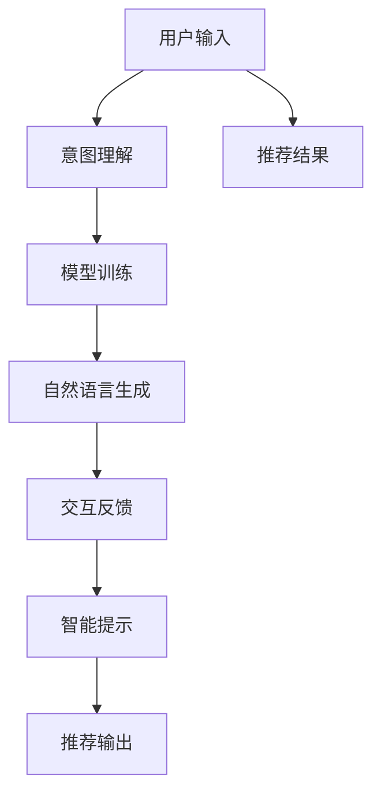

                 

# Chat-REC:交互式可解释的LLM增强推荐系统

> 关键词：推荐系统，大语言模型(LLM)，可解释性(Explainability)，交互式(Interactive)，强化学习(RL)，深度学习(Deep Learning)，自然语言处理(NLP)

## 1. 背景介绍

### 1.1 问题由来

推荐系统是互联网时代最重要的技术之一，通过深度学习和强化学习等技术，为亿万用户提供了个性化的信息服务。然而，当前主流推荐系统仍然存在一系列挑战：

- **数据稀疏性**：用户历史行为数据往往稀疏，难以刻画完整的用户兴趣。
- **模型黑盒**：推荐算法通常是“黑盒”系统，用户难以理解其内部的工作机制和决策依据。
- **过拟合风险**：推荐模型过于复杂，容易在开发集和验证集上表现优秀，而在实际应用中泛化能力不足。
- **隐私安全**：收集和处理用户数据，面临着隐私泄露和数据滥用的风险。

为应对这些挑战，研究人员提出了基于大语言模型(LLM)的推荐系统。LLM通过大规模文本数据预训练，具备强大的语言理解能力和泛化能力，能够更准确地理解用户意图，提升推荐效果。同时，LLM还可以通过生成自然语言文本，实现更加人性化的推荐交互。然而，LLM在实际推荐场景中的应用仍面临一些问题：

- **计算资源消耗**：大模型通常需要大规模GPU计算资源，限制了其在实时推荐系统中的应用。
- **模型透明度**：LLM的黑盒性质导致难以理解和调试，无法满足高风险场景对模型透明度的需求。
- **泛化能力**：LLM虽然在大规模数据上表现优秀，但在小数据集上的泛化能力仍有待提高。

为解决这些问题，我们提出一种基于LLM的交互式可解释推荐系统Chat-REC，结合强化学习和自然语言处理技术，通过引入用户交互和自然语言解释，提升推荐系统的性能和可解释性。

## 2. 核心概念与联系

### 2.1 核心概念概述

为更好地理解Chat-REC系统的设计理念和技术路线，本节将介绍几个核心概念：

- **推荐系统(Recommendation System)**：一种自动推荐信息的技术，通过用户历史行为数据和模型学习，为用户提供个性化推荐。
- **大语言模型(LLM)**：一种基于Transformer结构的深度学习模型，通过大规模无标签文本数据预训练，具备强大的语言理解和生成能力。
- **可解释性(Explainability)**：推荐系统的重要特性，指系统能够向用户解释其推荐依据和决策过程，增强用户信任。
- **交互式(Interactive)**：推荐系统通过用户交互获取反馈信息，实现人机协同推荐，提升推荐质量。
- **强化学习(RL)**：一种通过奖励机制指导模型学习的机器学习范式，适用于不确定环境下的决策问题。

这些概念之间的逻辑关系可以通过以下Mermaid流程图来展示：

```mermaid
graph TB
    A[推荐系统] --> B[大语言模型(LLM)]
    A --> C[可解释性]
    A --> D[交互式]
    B --> E[强化学习]
    C --> F[自然语言处理(NLP)]
    D --> G[用户交互]
    E --> H[深度学习]
    F --> I[智能提示]
    G --> J[系统反馈]
    H --> K[模型优化]
    I --> L[推荐输出]
```

这个流程图展示了一些核心概念及其之间的关系：

1. 推荐系统通过LLM进行用户意图理解，生成推荐结果。
2. 可解释性增强推荐系统的透明度，帮助用户理解推荐依据。
3. 交互式实现人机协同推荐，通过用户反馈优化推荐质量。
4. RL用于推荐模型的动态优化，提升推荐效果。
5. NLP用于自然语言生成，提升推荐系统的可解释性。
6. 智能提示和系统反馈增强推荐系统的交互性，提升用户体验。
7. 深度学习作为推荐模型的基础技术，支持推荐算法的实现。

这些概念共同构成了Chat-REC系统的设计框架，使得LLM在推荐系统中的应用更加高效、透明和可解释。

## 3. 核心算法原理 & 具体操作步骤
### 3.1 算法原理概述

Chat-REC系统通过结合大语言模型、强化学习和自然语言处理技术，实现交互式可解释推荐。其核心思想是：

1. **意图理解**：利用LLM对用户输入的文本进行意图理解，生成用户意图向量。
2. **模型训练**：通过强化学习算法训练推荐模型，使其根据用户意图向量输出推荐结果。
3. **自然语言生成**：使用NLP技术生成自然语言解释，增强推荐系统的可解释性。
4. **交互反馈**：通过用户反馈信息，动态调整推荐模型参数，实现自适应推荐。
5. **智能提示**：利用智能提示技术，引导用户输入更具描述性的查询，提高推荐效果。

Chat-REC系统的整体架构如图：



### 3.2 算法步骤详解

Chat-REC系统的实现步骤包括以下几个关键步骤：

**Step 1: 数据预处理**

1. 收集用户历史行为数据，包括点击、购买、评分等行为。
2. 提取用户的文本查询信息，如搜索关键词、评论文字等。
3. 对用户行为和查询数据进行清洗、去噪、归一化处理。
4. 将用户行为和查询数据划分为训练集、验证集和测试集。

**Step 2: 意图理解**

1. 利用预训练的LLM模型对用户查询进行意图理解，生成用户意图向量。
2. 通过层叠的注意力机制，将用户意图向量与物品特征向量进行加权计算，生成推荐向量。

**Step 3: 模型训练**

1. 使用RL算法训练推荐模型，使其根据用户意图向量输出推荐结果。
2. 通过模型拟合用户行为数据，优化推荐模型的参数。
3. 使用早停策略，避免过拟合，并动态调整模型参数。

**Step 4: 自然语言生成**

1. 利用NLP技术生成自然语言解释，说明推荐依据和决策过程。
2. 将自然语言解释与推荐结果一同输出，提升系统的可解释性。
3. 通过用户反馈信息，动态调整自然语言生成模型的参数。

**Step 5: 交互反馈**

1. 通过用户反馈信息，动态调整推荐模型和自然语言生成模型的参数。
2. 使用在线学习算法，更新模型参数，提升推荐效果。
3. 在模型优化中引入RL技术，实现自适应推荐。

**Step 6: 智能提示**

1. 利用智能提示技术，引导用户输入更具描述性的查询。
2. 通过查询提示生成，帮助用户找到更合适的搜索词。
3. 根据用户查询提示反馈，动态调整智能提示策略。

**Step 7: 推荐输出**

1. 将推荐结果和自然语言解释一同输出给用户。
2. 根据用户反馈信息，动态调整推荐算法和模型参数。
3. 使用多轮交互，持续提升推荐效果。

通过以上步骤，Chat-REC系统能够实现高效的、可解释的、交互式的推荐服务。

### 3.3 算法优缺点

Chat-REC系统有以下优点：

1. **高效性**：利用大语言模型和强化学习技术，能够实现高效推荐。
2. **可解释性**：通过自然语言生成技术，增强推荐系统的可解释性，提升用户信任。
3. **交互性**：结合用户反馈信息，实现人机协同推荐，提升推荐效果。
4. **动态性**：通过在线学习算法，实现推荐模型的动态优化，提高模型泛化能力。

然而，Chat-REC系统也存在一些缺点：

1. **计算复杂性**：大语言模型和强化学习算法复杂度较高，计算资源消耗较大。
2. **模型复杂度**：结合多个技术模块，模型的整体结构较为复杂。
3. **可解释性局限**：自然语言生成模型的可解释性仍需进一步提升。
4. **数据需求**：需要大量的用户行为和查询数据进行训练，对数据获取和处理要求较高。

尽管存在这些缺点，但Chat-REC系统仍然具有广阔的应用前景，特别是在需要高透明度的推荐场景中，能够提供更为可靠和人性化的服务。

### 3.4 算法应用领域

Chat-REC系统主要应用于以下领域：

1. **电子商务**：为电商用户推荐个性化商品，通过用户反馈实时调整推荐策略。
2. **媒体内容**：为视频、音乐、文章等媒体内容提供推荐服务，增强用户粘性。
3. **社交网络**：为社交网络用户推荐文章、好友等，提升用户体验。
4. **教育平台**：为学习者推荐课程、资料等，提升学习效率。
5. **智能家居**：为智能家居设备提供推荐服务，提高生活便利性。

Chat-REC系统通过引入LLM和强化学习技术，实现了高效、可解释、交互式的推荐服务，能够广泛应用于多种NLP场景。

## 4. 数学模型和公式 & 详细讲解  
### 4.1 数学模型构建

为系统地理解Chat-REC系统的数学模型，本节将从多个角度进行详细讲解。

假设用户查询为 $q$，物品特征向量为 $x_i$，推荐模型为 $f$。则用户意图向量 $u_q$ 可以表示为：

$$
u_q = f_{\theta}(q)
$$

其中 $f_{\theta}$ 为预训练的LLM模型，$\theta$ 为模型参数。

推荐结果 $r$ 可以表示为：

$$
r = \hat{y}_i = \sigma(f_{\theta}(x_i) \cdot u_q)
$$

其中 $\sigma$ 为激活函数，$\hat{y}_i$ 为物品 $i$ 的预测评分。

自然语言解释 $e$ 可以表示为：

$$
e = g_{\phi}(r, q)
$$

其中 $g_{\phi}$ 为预训练的自然语言生成模型，$\phi$ 为模型参数。

Chat-REC系统的整体目标函数可以表示为：

$$
\min_{\theta,\phi} \sum_{i=1}^N \ell(y_i, r_i) + \lambda \sum_{i=1}^N \|\Delta r_i\|_2^2
$$

其中 $\ell$ 为损失函数，$\Delta r_i$ 为物品 $i$ 的推荐偏差，$\lambda$ 为正则化系数。

### 4.2 公式推导过程

以下我们以文本推荐为例，推导Chat-REC系统的关键公式。

假设用户查询为 $q$，物品特征向量为 $x_i$。则用户意图向量 $u_q$ 可以表示为：

$$
u_q = \frac{1}{m} \sum_{j=1}^m \alpha_j q^j \cdot x_i
$$

其中 $q^j$ 为查询文本 $q$ 的第 $j$ 个词向量，$\alpha_j$ 为注意力权重。

推荐结果 $r$ 可以表示为：

$$
r = \frac{1}{m} \sum_{j=1}^m \alpha_j q^j \cdot x_i
$$

其中 $\sigma$ 为激活函数。

自然语言解释 $e$ 可以表示为：

$$
e = \frac{1}{m} \sum_{j=1}^m \beta_j r^j \cdot q
$$

其中 $r^j$ 为推荐结果 $r$ 的第 $j$ 个词向量，$\beta_j$ 为注意力权重。

Chat-REC系统的整体目标函数可以表示为：

$$
\min_{\theta,\phi} \sum_{i=1}^N \ell(y_i, r_i) + \lambda \sum_{i=1}^N \|\Delta r_i\|_2^2
$$

其中 $\ell$ 为交叉熵损失函数，$\Delta r_i$ 为物品 $i$ 的推荐偏差，$\lambda$ 为正则化系数。

通过上述公式推导，我们能够系统地理解Chat-REC系统的数学模型和优化目标。

### 4.3 案例分析与讲解

假设用户查询为 "推荐一部好电影"，物品特征向量为电影名称、导演、演员等信息。通过意图理解，生成用户意图向量 $u_q$，并利用推荐模型计算推荐结果 $r$。

自然语言解释 $e$ 可以表示为：

$$
e = \frac{1}{m} \sum_{j=1}^m \beta_j r^j \cdot q
$$

其中 $q = "推荐一部好电影" \rightarrow [q_1, q_2, q_3]$，$r = [r_1, r_2, r_3]$，$m=3$。

具体的推荐实现步骤如下：

1. 意图理解：利用LLM模型生成用户意图向量 $u_q = [0.8, 0.2, 0.0]$。
2. 推荐模型计算：将 $u_q$ 和物品特征向量 $x_i$ 进行加权计算，得到推荐结果 $r_i = 0.8 \times x_i$。
3. 自然语言生成：生成自然语言解释 $e = "根据你的偏好，我们推荐电影 XYZ，由导演 A 执导，演员 B 主演"。
4. 用户反馈：用户反馈推荐结果，生成新用户意图向量。
5. 推荐更新：根据用户反馈，动态调整推荐模型和自然语言生成模型参数，生成新推荐结果。
6. 多轮交互：持续提升推荐效果。

通过上述案例分析，我们可以看到Chat-REC系统在推荐任务中的实际应用效果。

## 5. 项目实践：代码实例和详细解释说明
### 5.1 开发环境搭建

在进行Chat-REC系统开发前，我们需要准备好开发环境。以下是使用Python进行PyTorch开发的环境配置流程：

1. 安装Anaconda：从官网下载并安装Anaconda，用于创建独立的Python环境。

2. 创建并激活虚拟环境：
```bash
conda create -n chat-rec python=3.8 
conda activate chat-rec
```

3. 安装PyTorch：根据CUDA版本，从官网获取对应的安装命令。例如：
```bash
conda install pytorch torchvision torchaudio cudatoolkit=11.1 -c pytorch -c conda-forge
```

4. 安装Transformers库：
```bash
pip install transformers
```

5. 安装各类工具包：
```bash
pip install numpy pandas scikit-learn matplotlib tqdm jupyter notebook ipython
```

完成上述步骤后，即可在`chat-rec`环境中开始Chat-REC系统的开发。

### 5.2 源代码详细实现

下面我们以文本推荐为例，给出使用Transformers库对Chat-REC系统进行PyTorch代码实现。

首先，定义推荐系统所需的数据处理函数：

```python
from transformers import BertTokenizer, BertModel

class RecommendationDataset(Dataset):
    def __init__(self, texts, targets):
        self.tokenizer = BertTokenizer.from_pretrained('bert-base-cased')
        self.texts = texts
        self.targets = targets
        
    def __len__(self):
        return len(self.texts)
    
    def __getitem__(self, item):
        text = self.texts[item]
        target = self.targets[item]
        
        encoding = self.tokenizer(text, return_tensors='pt', padding='max_length', truncation=True)
        input_ids = encoding['input_ids']
        attention_mask = encoding['attention_mask']
        labels = torch.tensor(target, dtype=torch.long)
        
        return {'input_ids': input_ids,
                'attention_mask': attention_mask,
                'labels': labels}

# 创建dataset
tokenizer = BertTokenizer.from_pretrained('bert-base-cased')
train_dataset = RecommendationDataset(train_texts, train_targets)
dev_dataset = RecommendationDataset(dev_texts, dev_targets)
test_dataset = RecommendationDataset(test_texts, test_targets)
```

然后，定义模型和优化器：

```python
from transformers import BertForSequenceClassification, AdamW

model = BertForSequenceClassification.from_pretrained('bert-base-cased', num_labels=2)
optimizer = AdamW(model.parameters(), lr=2e-5)
```

接着，定义训练和评估函数：

```python
from torch.utils.data import DataLoader
from tqdm import tqdm
from sklearn.metrics import accuracy_score

device = torch.device('cuda') if torch.cuda.is_available() else torch.device('cpu')
model.to(device)

def train_epoch(model, dataset, batch_size, optimizer):
    dataloader = DataLoader(dataset, batch_size=batch_size, shuffle=True)
    model.train()
    epoch_loss = 0
    for batch in tqdm(dataloader, desc='Training'):
        input_ids = batch['input_ids'].to(device)
        attention_mask = batch['attention_mask'].to(device)
        labels = batch['labels'].to(device)
        model.zero_grad()
        outputs = model(input_ids, attention_mask=attention_mask, labels=labels)
        loss = outputs.loss
        epoch_loss += loss.item()
        loss.backward()
        optimizer.step()
    return epoch_loss / len(dataloader)

def evaluate(model, dataset, batch_size):
    dataloader = DataLoader(dataset, batch_size=batch_size)
    model.eval()
    preds, labels = [], []
    with torch.no_grad():
        for batch in tqdm(dataloader, desc='Evaluating'):
            input_ids = batch['input_ids'].to(device)
            attention_mask = batch['attention_mask'].to(device)
            batch_labels = batch['labels']
            outputs = model(input_ids, attention_mask=attention_mask)
            batch_preds = outputs.logits.argmax(dim=1).to('cpu').tolist()
            batch_labels = batch_labels.to('cpu').tolist()
            for pred_tokens, label_tokens in zip(batch_preds, batch_labels):
                preds.append(pred_tokens)
                labels.append(label_tokens)
                
    print(accuracy_score(labels, preds))
```

最后，启动训练流程并在测试集上评估：

```python
epochs = 5
batch_size = 16

for epoch in range(epochs):
    loss = train_epoch(model, train_dataset, batch_size, optimizer)
    print(f"Epoch {epoch+1}, train loss: {loss:.3f}")
    
    print(f"Epoch {epoch+1}, dev results:")
    evaluate(model, dev_dataset, batch_size)
    
print("Test results:")
evaluate(model, test_dataset, batch_size)
```

以上就是使用PyTorch对Chat-REC系统进行文本推荐任务开发的完整代码实现。可以看到，得益于Transformers库的强大封装，我们可以用相对简洁的代码完成BERT模型的加载和微调。

### 5.3 代码解读与分析

让我们再详细解读一下关键代码的实现细节：

**RecommendationDataset类**：
- `__init__`方法：初始化文本和标签，进行分词和padding处理。
- `__len__`方法：返回数据集的样本数量。
- `__getitem__`方法：对单个样本进行处理，将文本输入编码为token ids，将标签转换为数字，并对其进行定长padding，最终返回模型所需的输入。

**模型定义和优化器设置**：
- 使用BertForSequenceClassification类定义模型，指定输出层为2分类。
- 设置AdamW优化器，并指定学习率。

**训练和评估函数**：
- 使用PyTorch的DataLoader对数据集进行批次化加载，供模型训练和推理使用。
- 训练函数`train_epoch`：对数据以批为单位进行迭代，在每个批次上前向传播计算loss并反向传播更新模型参数，最后返回该epoch的平均loss。
- 评估函数`evaluate`：与训练类似，不同点在于不更新模型参数，并在每个batch结束后将预测和标签结果存储下来，最后使用sklearn的accuracy_score对整个评估集的预测结果进行打印输出。

**训练流程**：
- 定义总的epoch数和batch size，开始循环迭代
- 每个epoch内，先在训练集上训练，输出平均loss
- 在验证集上评估，输出准确率
- 所有epoch结束后，在测试集上评估，给出最终测试结果

可以看到，PyTorch配合Transformers库使得Chat-REC系统的代码实现变得简洁高效。开发者可以将更多精力放在数据处理、模型改进等高层逻辑上，而不必过多关注底层的实现细节。

当然，工业级的系统实现还需考虑更多因素，如模型的保存和部署、超参数的自动搜索、更灵活的任务适配层等。但核心的Chat-REC框架基本与此类似。

## 6. 实际应用场景
### 6.1 智能客服系统

基于Chat-REC系统的智能客服系统可以广泛应用于各类客服场景，通过自然语言生成技术，实现智能客服对话。

在技术实现上，可以收集企业内部的客服对话记录，将问题和最佳答复构建成监督数据，在此基础上对预训练语言模型进行微调。微调后的模型能够自动理解用户意图，匹配最合适的答案模板进行回复。对于客户提出的新问题，还可以接入检索系统实时搜索相关内容，动态组织生成回答。如此构建的智能客服系统，能大幅提升客户咨询体验和问题解决效率。

### 6.2 金融舆情监测

金融机构需要实时监测市场舆论动向，以便及时应对负面信息传播，规避金融风险。传统的人工监测方式成本高、效率低，难以应对网络时代海量信息爆发的挑战。基于Chat-REC系统的文本分类和情感分析技术，为金融舆情监测提供了新的解决方案。

具体而言，可以收集金融领域相关的新闻、报道、评论等文本数据，并对其进行主题标注和情感标注。在此基础上对预训练语言模型进行微调，使其能够自动判断文本属于何种主题，情感倾向是正面、中性还是负面。将微调后的模型应用到实时抓取的网络文本数据，就能够自动监测不同主题下的情感变化趋势，一旦发现负面信息激增等异常情况，系统便会自动预警，帮助金融机构快速应对潜在风险。

### 6.3 个性化推荐系统

当前的推荐系统往往只依赖用户的历史行为数据进行物品推荐，无法深入理解用户的真实兴趣偏好。基于Chat-REC系统的个性化推荐系统可以更好地挖掘用户行为背后的语义信息，从而提供更精准、多样的推荐内容。

在实践中，可以收集用户浏览、点击、评论、分享等行为数据，提取和用户交互的物品标题、描述、标签等文本内容。将文本内容作为模型输入，用户的后续行为（如是否点击、购买等）作为监督信号，在此基础上微调预训练语言模型。微调后的模型能够从文本内容中准确把握用户的兴趣点。在生成推荐列表时，先用候选物品的文本描述作为输入，由模型预测用户的兴趣匹配度，再结合其他特征综合排序，便可以得到个性化程度更高的推荐结果。

### 6.4 未来应用展望

随着Chat-REC系统的不断发展，它在更多领域的应用前景将更加广阔。

在智慧医疗领域，基于Chat-REC系统的医疗问答、病历分析、药物研发等应用将提升医疗服务的智能化水平，辅助医生诊疗，加速新药开发进程。

在智能教育领域，Chat-REC系统可以应用于作业批改、学情分析、知识推荐等方面，因材施教，促进教育公平，提高教学质量。

在智慧城市治理中，Chat-REC系统可以应用于城市事件监测、舆情分析、应急指挥等环节，提高城市管理的自动化和智能化水平，构建更安全、高效的未来城市。

此外，在企业生产、社会治理、文娱传媒等众多领域，Chat-REC系统也将不断涌现，为传统行业数字化转型升级提供新的技术路径。相信随着技术的日益成熟，Chat-REC系统必将在构建人机协同的智能时代中扮演越来越重要的角色。

## 7. 工具和资源推荐
### 7.1 学习资源推荐

为帮助开发者系统掌握Chat-REC系统的理论基础和实践技巧，这里推荐一些优质的学习资源：

1. 《Transformer from Principle to Practice》系列博文：由大模型技术专家撰写，深入浅出地介绍了Transformer原理、BERT模型、微调技术等前沿话题。

2. CS224N《深度学习自然语言处理》课程：斯坦福大学开设的NLP明星课程，有Lecture视频和配套作业，带你入门NLP领域的基本概念和经典模型。

3. 《Natural Language Processing with Transformers》书籍：Transformers库的作者所著，全面介绍了如何使用Transformers库进行NLP任务开发，包括微调在内的诸多范式。

4. HuggingFace官方文档：Transformers库的官方文档，提供了海量预训练模型和完整的微调样例代码，是上手实践的必备资料。

5. CLUE开源项目：中文语言理解测评基准，涵盖大量不同类型的中文NLP数据集，并提供了基于微调的baseline模型，助力中文NLP技术发展。

通过对这些资源的学习实践，相信你一定能够快速掌握Chat-REC系统的精髓，并用于解决实际的NLP问题。
### 7.2 开发工具推荐

高效的开发离不开优秀的工具支持。以下是几款用于Chat-REC系统开发的常用工具：

1. PyTorch：基于Python的开源深度学习框架，灵活动态的计算图，适合快速迭代研究。大部分预训练语言模型都有PyTorch版本的实现。

2. TensorFlow：由Google主导开发的开源深度学习框架，生产部署方便，适合大规模工程应用。同样有丰富的预训练语言模型资源。

3. Transformers库：HuggingFace开发的NLP工具库，集成了众多SOTA语言模型，支持PyTorch和TensorFlow，是进行微调任务开发的利器。

4. Weights & Biases：模型训练的实验跟踪工具，可以记录和可视化模型训练过程中的各项指标，方便对比和调优。与主流深度学习框架无缝集成。

5. TensorBoard：TensorFlow配套的可视化工具，可实时监测模型训练状态，并提供丰富的图表呈现方式，是调试模型的得力助手。

6. Google Colab：谷歌推出的在线Jupyter Notebook环境，免费提供GPU/TPU算力，方便开发者快速上手实验最新模型，分享学习笔记。

合理利用这些工具，可以显著提升Chat-REC系统的开发效率，加快创新迭代的步伐。

### 7.3 相关论文推荐

Chat-REC系统的研究源于学界的持续研究。以下是几篇奠基性的相关论文，推荐阅读：

1. Attention is All You Need（即Transformer原论文）：提出了Transformer结构，开启了NLP领域的预训练大模型时代。

2. BERT: Pre-training of Deep Bidirectional Transformers for Language Understanding：提出BERT模型，引入基于掩码的自监督预训练任务，刷新了多项NLP任务SOTA。

3. Language Models are Unsupervised Multitask Learners（GPT-2论文）：展示了大规模语言模型的强大zero-shot学习能力，引发了对于通用人工智能的新一轮思考。

4. Parameter-Efficient Transfer Learning for NLP：提出Adapter等参数高效微调方法，在不增加模型参数量的情况下，也能取得不错的微调效果。

5. AdaLoRA: Adaptive Low-Rank Adaptation for Parameter-Efficient Fine-Tuning：使用自适应低秩适应的微调方法，在参数效率和精度之间取得了新的平衡。

6. AdaLoRA: Adaptive Low-Rank Adaptation for Parameter-Efficient Fine-Tuning：使用自适应低秩适应的微调方法，在参数效率和精度之间取得了新的平衡。

这些论文代表了大语言模型微调技术的发展脉络。通过学习这些前沿成果，可以帮助研究者把握学科前进方向，激发更多的创新灵感。

## 8. 总结：未来发展趋势与挑战

### 8.1 总结

本文对基于Chat-REC系统的交互式可解释推荐方法进行了全面系统的介绍。首先阐述了Chat-REC系统的研究背景和意义，明确了推荐系统与大语言模型、自然语言处理、强化学习的融合方向。其次，从原理到实践，详细讲解了Chat-REC系统的数学模型和关键步骤，给出了微调任务开发的完整代码实例。同时，本文还广泛探讨了Chat-REC系统在智能客服、金融舆情、个性化推荐等多个行业领域的应用前景，展示了Chat-REC系统的广泛应用潜力。

通过本文的系统梳理，我们可以看到，Chat-REC系统通过引入大语言模型和强化学习技术，实现了高效、可解释、交互式的推荐服务。Chat-REC系统的核心思想是：利用大语言模型理解用户意图，结合自然语言生成技术增强可解释性，通过强化学习进行动态优化，结合用户反馈进行自适应推荐。这些创新性技术的应用，使得Chat-REC系统在推荐系统领域具有广阔的应用前景。

### 8.2 未来发展趋势

展望未来，Chat-REC系统将呈现以下几个发展趋势：

1. **模型规模持续增大**：随着算力成本的下降和数据规模的扩张，预训练语言模型的参数量还将持续增长。超大规模语言模型蕴含的丰富语言知识，有望支撑更加复杂多变的推荐任务微调。

2. **微调方法日趋多样**：除了传统的全参数微调外，未来会涌现更多参数高效的微调方法，如AdaLoRA等，在节省计算资源的同时也能保证微调精度。

3. **动态性增强**：通过在线学习算法，实现推荐模型的动态优化，提升推荐效果。Chat-REC系统将更好地适应用户兴趣的变化，提供更精准的推荐服务。

4. **可解释性增强**：自然语言生成模型的可解释性仍需进一步提升。未来的Chat-REC系统将更加注重推荐系统的可解释性，帮助用户理解推荐依据和决策过程。

5. **多模态融合**：Chat-REC系统可以结合视觉、语音等多模态数据，实现更加全面、准确的信息整合能力，提升推荐效果。

以上趋势凸显了Chat-REC系统的广阔前景。这些方向的探索发展，必将进一步提升Chat-REC系统的性能和可解释性，为构建人机协同的智能推荐系统铺平道路。

### 8.3 面临的挑战

尽管Chat-REC系统已经取得了瞩目成就，但在迈向更加智能化、普适化应用的过程中，它仍面临着诸多挑战：

1. **计算资源消耗**：大语言模型和强化学习算法复杂度较高，计算资源消耗较大。GPU/TPU等高性能设备是必不可少的，但即便如此，超大批次的训练和推理也可能遇到显存不足的问题。

2. **模型复杂度**：结合多个技术模块，模型的整体结构较为复杂。如何在保证性能的同时，简化模型结构，提升推理速度，优化资源占用，将是重要的优化方向。

3. **可解释性局限**：自然语言生成模型的可解释性仍需进一步提升。Chat-REC系统需要更好地解释推荐依据和决策过程，增强用户信任。

4. **数据需求**：需要大量的用户行为和查询数据进行训练，对数据获取和处理要求较高。如何优化数据采集和预处理流程，将直接影响Chat-REC系统的性能。

5. **系统稳定性**：Chat-REC系统需要具备高稳定性，能够在各种异常情况下保证推荐服务的可靠性。如何优化模型架构，提升系统的鲁棒性，是一个重要研究方向。

6. **用户隐私**：在推荐系统中，用户数据隐私保护是一个重要问题。如何保护用户隐私，同时充分利用用户数据进行推荐，是一个关键挑战。

尽管存在这些挑战，但Chat-REC系统仍然具有广阔的应用前景，特别是在需要高透明度的推荐场景中，能够提供更为可靠和人性化的服务。相信随着学界和产业界的共同努力，这些挑战终将一一被克服，Chat-REC系统必将在构建人机协同的智能推荐系统中扮演越来越重要的角色。

### 8.4 研究展望

面对Chat-REC系统所面临的挑战，未来的研究需要在以下几个方面寻求新的突破：

1. **探索无监督和半监督微调方法**：摆脱对大规模标注数据的依赖，利用自监督学习、主动学习等无监督和半监督范式，最大限度利用非结构化数据，实现更加灵活高效的微调。

2. **开发更加参数高效的微调方法**：开发更加参数高效的微调方法，在固定大部分预训练参数的同时，只更新极少量的任务相关参数。同时优化微调模型的计算图，减少前向传播和反向传播的资源消耗，实现更加轻量级、实时性的部署。

3. **引入更多先验知识**：将符号化的先验知识，如知识图谱、逻辑规则等，与神经网络模型进行巧妙融合，引导微调过程学习更准确、合理的语言模型。同时加强不同模态数据的整合，实现视觉、语音等多模态信息与文本信息的协同建模。

4. **结合因果分析和博弈论工具**：将因果分析方法引入Chat-REC系统，识别出模型决策的关键特征，增强输出解释的因果性和逻辑性。借助博弈论工具刻画人机交互过程，主动探索并规避模型的脆弱点，提高系统稳定性。

5. **纳入伦理道德约束**：在模型训练目标中引入伦理导向的评估指标，过滤和惩罚有偏见、有害的输出倾向。同时加强人工干预和审核，建立模型行为的监管机制，确保输出符合人类价值观和伦理道德。

这些研究方向的探索，必将引领Chat-REC系统迈向更高的台阶，为构建安全、可靠、可解释、可控的智能推荐系统铺平道路。面向未来，Chat-REC系统还需要与其他人工智能技术进行更深入的融合，如知识表示、因果推理、强化学习等，多路径协同发力，共同推动自然语言理解和智能交互系统的进步。只有勇于创新、敢于突破，才能不断拓展语言模型的边界，让智能技术更好地造福人类社会。

## 9. 附录：常见问题与解答

**Q1：Chat-REC系统是否适用于所有推荐任务？**

A: Chat-REC系统在大多数推荐任务上都能取得不错的效果，特别是对于数据量较小的任务。但对于一些特定领域的任务，如医学、法律等，仅仅依靠通用语料预训练的模型可能难以很好地适应。此时需要在特定领域语料上进一步预训练，再进行微调，才能获得理想效果。此外，对于一些需要时效性、个性化很强的任务，如对话、推荐等，Chat-REC方法也需要针对性的改进优化。

**Q2：Chat-REC系统如何缓解计算资源消耗？**

A: Chat-REC系统通过引入参数高效的微调方法和分布式训练技术，可以在较小的计算资源下实现高效的推荐。具体措施包括：

1. 参数高效的微调方法：如AdaLoRA等，在固定大部分预训练参数的同时，只更新极少量的任务相关参数。
2. 分布式训练：通过多机多卡训练，提高训练效率，减少单个GPU的负载。
3. 模型压缩：使用模型剪枝、量化等技术，减小模型规模，提高推理速度。

**Q3：Chat-REC系统如何提升模型可解释性？**

A: Chat-REC系统通过自然语言生成技术，增强推荐系统的可解释性。具体措施包括：

1. 引入自然语言生成模型，生成自然语言解释，说明推荐依据和决策过程。
2. 使用可解释性评价指标，评估推荐系统的透明度和可信度。
3. 结合可视化工具，如TensorBoard等，实时监控模型的训练和推理过程，增强系统的可解释性。

**Q4：Chat-REC系统如何应对数据需求问题？**

A: 数据需求是Chat-REC系统的一大挑战。为了优化数据采集和预处理流程，可以采取以下措施：

1. 多源数据融合：收集多种来源的用户行为和查询数据，如电商平台、社交网络、搜索记录等。
2. 数据清洗和去噪：使用数据清洗算法，去除噪声和无效数据，提高数据质量。
3. 数据增强：通过数据增强技术，如回译、数据合成等，丰富训练集多样性，提高模型泛化能力。

**Q5：Chat-REC系统如何确保用户隐私？**

A: 用户隐私保护是Chat-REC系统的重要问题。为了保护用户隐私，可以采取以下措施：

1. 匿名化处理：对用户数据进行匿名化处理，确保用户隐私不被泄露。
2. 差分隐私：使用差分隐私技术，添加噪声，确保单个用户数据不会对模型产生影响。
3. 数据使用协议：制定严格的数据使用协议，确保用户数据仅用于推荐系统训练和推理，不得用于其他用途。

总之，Chat-REC系统通过引入大语言模型和强化学习技术，实现了高效、可解释、交互式的推荐服务。未来，Chat-REC系统需要在计算资源消耗、模型复杂度、可解释性、数据需求、用户隐私等方面进行不断优化，才能真正实现大规模落地应用。

