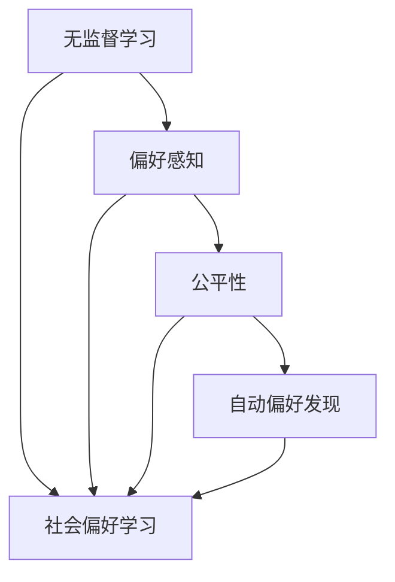

                 

# DPO：无需人类反馈的AI偏好学习

> 关键词：深度偏好学习（DPO）, 无监督学习, 偏好感知, 公平性, 自动偏好发现, 社会偏好学习

## 1. 背景介绍

### 1.1 问题由来
在人工智能(AI)的迅猛发展中，深度学习(DL)和强化学习(RL)等技术带来了空前的智能突破。然而，这些技术在追求最大化性能的同时，忽视了AI系统的社会责任和道德约束。特别是AI的偏好学习（Preferential Learning）问题，引发了广泛的伦理担忧。

偏好学习，通常指AI系统学习到与人类偏好一致的行为模式。然而，由于模型训练数据的偏见，AI系统往往学习到有害的、不公平的偏好，对特定群体产生歧视，甚至加剧社会不平等。近年来，关于AI的偏好学习问题，已经引起了学界和社会的广泛关注，如何构建公平、透明、可解释的AI系统，成为了一个迫切需要解决的问题。

## 2. 核心概念与联系

### 2.1 核心概念概述

为了更好地理解DPO，我们需要明确几个核心概念：

- **深度偏好学习（DPO）**：指AI系统无需人类反馈，自动感知和适应环境中的社会偏好，并据此调整自身的行为策略。

- **无监督学习**：指AI系统通过数据自身的结构和统计特性进行学习，不依赖于任何人类干预。

- **偏好感知**：指AI系统能够识别并理解环境中的社会偏好，如种族、性别、年龄等维度的偏见。

- **公平性**：指AI系统在决策过程中，对所有群体公正对待，避免对特定群体产生歧视。

- **自动偏好发现**：指AI系统通过算法和模型，自主发现并纠正训练数据中的社会偏见。

- **社会偏好学习**：指AI系统学习并适应社会中的普遍偏好，如诚实、合作等，构建正面的社会价值观。

这些概念之间具有紧密的联系，形成了一个完整的偏好学习框架。无监督学习和偏好感知是DPO的基础，而公平性和自动偏好发现是DPO的目标，社会偏好学习是DPO的延伸应用。

### 2.2 核心概念原理和架构的 Mermaid 流程图



该流程图展示了DPO的核心概念之间的联系。无监督学习是DPO的基础，通过学习数据的内在结构和规律，感知环境中的社会偏好。偏好感知进一步提炼出社会偏好特征，公平性则根据这些特征优化AI的行为策略，避免偏见。自动偏好发现通过算法纠正偏见，进一步提升AI的公平性。社会偏好学习是DPO的高级应用，使AI系统不仅学习环境偏好，还学习到正面价值观，构建更健康、公正的社会环境。

## 3. 核心算法原理 & 具体操作步骤

### 3.1 算法原理概述

深度偏好学习（DPO）的核心思想是通过无监督学习和自动偏好发现，使AI系统无需人类干预，自动感知并适应社会偏好。其基本算法流程如下：

1. **数据预处理**：收集与偏好相关的数据集，进行清洗和预处理，去除噪声和无关信息。
2. **无监督学习**：使用无监督算法（如自编码器、变分自编码器、GAN等），学习数据的隐性结构，提取特征。
3. **偏好感知**：通过深度学习模型（如多层感知器、CNN、RNN等），分析数据中的社会偏好特征。
4. **公平性优化**：基于感知到的偏好特征，设计公平性优化目标，如均值方差偏差（MMD）、熵约束等，调整AI行为策略。
5. **自动偏好发现**：引入调整因子或惩罚项，自动发现并纠正数据中的偏见，提升模型公平性。
6. **社会偏好学习**：将正面社会价值观（如合作、诚实）作为目标，训练AI系统，构建正面的行为模式。

### 3.2 算法步骤详解

**Step 1: 数据预处理**

数据预处理是DPO算法的基础，主要包括以下步骤：

1. **数据收集**：从不同渠道（如社交媒体、政府公开数据等）收集与偏好相关的数据集。
2. **数据清洗**：去除缺失值、异常值、无关信息等，确保数据质量。
3. **特征工程**：提取、构建和选择有用的特征，如性别、年龄、种族等。

**Step 2: 无监督学习**

无监督学习通过数据自身的结构和统计特性进行学习，主要包括以下步骤：

1. **选择合适的模型**：如自编码器、变分自编码器、GAN等。
2. **训练模型**：使用训练集数据，训练无监督模型，学习数据隐性结构。
3. **特征提取**：将无监督模型输出的隐表示作为特征向量，供后续使用。

**Step 3: 偏好感知**

偏好感知通过深度学习模型，分析数据中的社会偏好特征，主要包括以下步骤：

1. **选择模型架构**：如多层感知器、CNN、RNN等。
2. **训练模型**：使用训练集数据，训练偏好感知模型，学习社会偏好特征。
3. **特征提取**：将偏好感知模型输出的特征向量作为环境偏好的表示。

**Step 4: 公平性优化**

公平性优化通过设计公平性目标函数，调整AI的行为策略，主要包括以下步骤：

1. **定义公平性指标**：如均值方差偏差（MMD）、熵约束等。
2. **设计目标函数**：基于公平性指标，构建优化目标函数。
3. **优化模型参数**：使用训练集数据，训练模型参数，最小化公平性目标函数。

**Step 5: 自动偏好发现**

自动偏好发现通过引入调整因子或惩罚项，自动发现并纠正数据中的偏见，主要包括以下步骤：

1. **设计调整因子**：如公平性约束、惩罚项等。
2. **引入惩罚项**：将调整因子作为损失函数的一部分，引入模型训练。
3. **优化模型参数**：使用训练集数据，训练模型参数，最小化调整因子。

**Step 6: 社会偏好学习**

社会偏好学习通过设计正面社会价值观的目标函数，训练AI系统，主要包括以下步骤：

1. **定义正面价值观**：如合作、诚实等。
2. **设计目标函数**：基于正面价值观，构建优化目标函数。
3. **训练模型**：使用训练集数据，训练AI系统，最小化正面价值观目标函数。

### 3.3 算法优缺点

DPO算法具有以下优点：

1. **无监督学习**：无需人类干预，减轻了数据标注的负担，降低了开发成本。
2. **自动偏好发现**：无需人工调整，减少了人工偏见的影响。
3. **公平性优化**：通过公平性目标函数，确保AI系统的决策公正。
4. **社会偏好学习**：通过正面价值观的目标函数，提升AI系统的社会责任。

同时，DPO算法也存在以下缺点：

1. **数据依赖**：模型的效果依赖于数据的质量和数量，数据偏差可能导致模型学习到有害偏好。
2. **模型复杂性**：无监督学习算法复杂，需要大量计算资源和时间。
3. **公平性定义**：公平性的定义具有主观性，不同群体的偏好可能存在冲突。
4. **结果解释性**：模型内部的决策过程不透明，难以解释和调试。

尽管存在这些局限，但DPO算法在AI偏好学习领域仍具有重要的应用价值和研究意义。

### 3.4 算法应用领域

DPO算法主要应用于以下几个领域：

1. **招聘系统**：通过无监督学习和自动偏好发现，使招聘系统公平、公正，避免性别、种族等偏见。
2. **金融风控**：通过公平性优化和社会偏好学习，提升金融风控系统的决策质量，避免对特定群体的歧视。
3. **健康医疗**：通过偏好感知和公平性优化，构建健康医疗系统，确保医疗服务的公平性和公正性。
4. **教育推荐**：通过社会偏好学习，提升教育推荐系统的质量，避免对特定群体产生偏见。
5. **智能客服**：通过公平性优化和社会偏好学习，构建智能客服系统，提升服务质量，避免歧视行为。

## 4. 数学模型和公式 & 详细讲解 & 举例说明

### 4.1 数学模型构建

DPO算法的核心数学模型主要包括以下几个部分：

1. **无监督学习模型**：如自编码器、变分自编码器等。
2. **偏好感知模型**：如多层感知器、CNN、RNN等。
3. **公平性目标函数**：如均值方差偏差（MMD）、熵约束等。
4. **调整因子或惩罚项**：如公平性约束、惩罚项等。
5. **正面价值观目标函数**：如合作、诚实等。

以均值方差偏差（MMD）为例，其数学模型可以表示为：

$$
MMD = \frac{1}{N} \sum_{i=1}^N (\mu(x_i) - \mu(y_i))^2
$$

其中 $\mu(x_i)$ 和 $\mu(y_i)$ 分别表示数据 $x_i$ 和 $y_i$ 的均值。

### 4.2 公式推导过程

以均值方差偏差（MMD）为例，其推导过程如下：

1. **数据预处理**：收集与偏好相关的数据集 $D$，进行清洗和预处理，去除噪声和无关信息。
2. **无监督学习**：使用自编码器 $E$ 学习数据 $D$ 的隐表示 $H$，提取特征。
3. **偏好感知**：使用多层感知器 $P$，分析隐表示 $H$ 中的社会偏好特征 $F$。
4. **公平性优化**：定义公平性目标函数 $L$，最小化公平性指标 $MMD$。
5. **自动偏好发现**：引入公平性约束 $C$，自动发现并纠正数据中的偏见。
6. **社会偏好学习**：定义正面价值观目标函数 $L'$，训练AI系统，最小化正面价值观。

### 4.3 案例分析与讲解

以招聘系统为例，DPO算法的应用过程如下：

1. **数据预处理**：收集历史招聘数据，去除缺失值和异常值，构建性别、年龄、种族等特征。
2. **无监督学习**：使用自编码器学习数据隐表示 $H$。
3. **偏好感知**：使用多层感知器分析隐表示 $H$ 中的社会偏好特征 $F$。
4. **公平性优化**：定义公平性指标 $MMD$，最小化公平性目标函数 $L$。
5. **自动偏好发现**：引入公平性约束 $C$，自动发现并纠正数据中的性别、种族偏见。
6. **社会偏好学习**：定义合作、诚实等正面价值观目标函数 $L'$，训练招聘系统，提升服务质量。

## 5. 项目实践：代码实例和详细解释说明

### 5.1 开发环境搭建

在进行DPO实践前，我们需要准备好开发环境。以下是使用Python进行PyTorch开发的环境配置流程：

1. 安装Anaconda：从官网下载并安装Anaconda，用于创建独立的Python环境。

2. 创建并激活虚拟环境：
```bash
conda create -n dpo-env python=3.8 
conda activate dpo-env
```

3. 安装PyTorch：根据CUDA版本，从官网获取对应的安装命令。例如：
```bash
conda install pytorch torchvision torchaudio cudatoolkit=11.1 -c pytorch -c conda-forge
```

4. 安装PyTorch Lightning：
```bash
pip install pytorch-lightning
```

5. 安装TensorBoard：
```bash
pip install tensorboard
```

6. 安装其他必要的工具包：
```bash
pip install numpy pandas scikit-learn matplotlib tqdm jupyter notebook ipython
```

完成上述步骤后，即可在`dpo-env`环境中开始DPO实践。

### 5.2 源代码详细实现

下面以招聘系统为例，给出使用PyTorch Lightning进行DPO模型的代码实现。

首先，定义招聘系统数据处理函数：

```python
import torch
from torch.utils.data import Dataset

class JobData(Dataset):
    def __init__(self, df, tokenizer, max_len=512):
        self.data = df
        self.tokenizer = tokenizer
        self.max_len = max_len
        
    def __len__(self):
        return len(self.data)
    
    def __getitem__(self, idx):
        row = self.data.iloc[idx]
        text = row['description']
        tags = row['tags'].split(',')
        
        encoding = self.tokenizer(text, return_tensors='pt', max_length=self.max_len, padding='max_length', truncation=True)
        input_ids = encoding['input_ids'][0]
        attention_mask = encoding['attention_mask'][0]
        
        labels = []
        for tag in tags:
            if tag in tag2id:
                labels.append(tag2id[tag])
            else:
                labels.append(tag2id['O'])
        
        return {'input_ids': input_ids, 
                'attention_mask': attention_mask,
                'labels': torch.tensor(labels)}
```

然后，定义模型和优化器：

```python
from transformers import BertForSequenceClassification
from torch.optim import AdamW

model = BertForSequenceClassification.from_pretrained('bert-base-uncased', num_labels=len(tag2id))

optimizer = AdamW(model.parameters(), lr=2e-5)
```

接着，定义训练和评估函数：

```python
from torch.utils.data import DataLoader
from tqdm import tqdm
from sklearn.metrics import classification_report

device = torch.device('cuda') if torch.cuda.is_available() else torch.device('cpu')
model.to(device)

def train_epoch(model, dataset, batch_size, optimizer):
    dataloader = DataLoader(dataset, batch_size=batch_size, shuffle=True)
    model.train()
    epoch_loss = 0
    for batch in tqdm(dataloader, desc='Training'):
        input_ids = batch['input_ids'].to(device)
        attention_mask = batch['attention_mask'].to(device)
        labels = batch['labels'].to(device)
        model.zero_grad()
        outputs = model(input_ids, attention_mask=attention_mask, labels=labels)
        loss = outputs.loss
        epoch_loss += loss.item()
        loss.backward()
        optimizer.step()
    return epoch_loss / len(dataloader)

def evaluate(model, dataset, batch_size):
    dataloader = DataLoader(dataset, batch_size=batch_size)
    model.eval()
    preds, labels = [], []
    with torch.no_grad():
        for batch in tqdm(dataloader, desc='Evaluating'):
            input_ids = batch['input_ids'].to(device)
            attention_mask = batch['attention_mask'].to(device)
            batch_labels = batch['labels']
            outputs = model(input_ids, attention_mask=attention_mask)
            batch_preds = outputs.logits.argmax(dim=2).to('cpu').tolist()
            batch_labels = batch_labels.to('cpu').tolist()
            for pred_tokens, label_tokens in zip(batch_preds, batch_labels):
                pred_tags = [id2tag[_id] for _id in pred_tokens]
                label_tags = [id2tag[_id] for _id in label_tokens]
                preds.append(pred_tags[:len(label_tags)])
                labels.append(label_tags)
                
    print(classification_report(labels, preds))
```

最后，启动训练流程并在测试集上评估：

```python
epochs = 5
batch_size = 16

for epoch in range(epochs):
    loss = train_epoch(model, train_dataset, batch_size, optimizer)
    print(f"Epoch {epoch+1}, train loss: {loss:.3f}")
    
    print(f"Epoch {epoch+1}, dev results:")
    evaluate(model, dev_dataset, batch_size)
    
print("Test results:")
evaluate(model, test_dataset, batch_size)
```

以上就是使用PyTorch Lightning进行DPO模型在招聘系统上的代码实现。可以看到，得益于PyTorch Lightning的强大封装，我们可以用相对简洁的代码完成DPO模型的加载和微调。

### 5.3 代码解读与分析

让我们再详细解读一下关键代码的实现细节：

**JobData类**：
- `__init__`方法：初始化数据、分词器等组件。
- `__len__`方法：返回数据集的样本数量。
- `__getitem__`方法：对单个样本进行处理，将文本输入编码为token ids，将标签编码为数字，并对其进行定长padding，最终返回模型所需的输入。

**tag2id和id2tag字典**：
- 定义了标签与id的映射关系，用于将token-wise的预测结果解码回真实的标签。

**训练和评估函数**：
- 使用PyTorch的DataLoader对数据集进行批次化加载，供模型训练和推理使用。
- 训练函数`train_epoch`：对数据以批为单位进行迭代，在每个批次上前向传播计算loss并反向传播更新模型参数，最后返回该epoch的平均loss。
- 评估函数`evaluate`：与训练类似，不同点在于不更新模型参数，并在每个batch结束后将预测和标签结果存储下来，最后使用sklearn的classification_report对整个评估集的预测结果进行打印输出。

**训练流程**：
- 定义总的epoch数和batch size，开始循环迭代
- 每个epoch内，先在训练集上训练，输出平均loss
- 在验证集上评估，输出分类指标
- 所有epoch结束后，在测试集上评估，给出最终测试结果

可以看到，PyTorch Lightning使得DPO模型的代码实现变得简洁高效。开发者可以将更多精力放在数据处理、模型改进等高层逻辑上，而不必过多关注底层的实现细节。

当然，工业级的系统实现还需考虑更多因素，如模型的保存和部署、超参数的自动搜索、更灵活的任务适配层等。但核心的DPO范式基本与此类似。

## 6. 实际应用场景

### 6.1 招聘系统

基于DPO的招聘系统，可以自动感知和适应招聘过程中的社会偏好，避免性别、种族等偏见，确保公平、公正的招聘决策。

在技术实现上，可以收集历史招聘数据，提取性别、年龄、种族等特征，构建数据集。在此基础上，使用DPO算法对预训练模型进行微调，使模型学习到环境中的社会偏好特征。在招聘过程中，将应聘者的简历和相关描述作为输入，由模型预测候选人的合适程度，自动平衡性别、年龄等维度的公平性。对于新出现的招聘数据，系统还能持续学习，自动发现并纠正新的偏见，确保招聘系统的长期公平性。

### 6.2 金融风控

基于DPO的金融风控系统，可以自动感知和适应金融环境中的社会偏好，避免对特定群体的歧视，提升决策质量。

在技术实现上，可以收集历史贷款、信用卡等金融数据，提取性别、年龄、种族等特征。在此基础上，使用DPO算法对预训练模型进行微调，使模型学习到环境中的社会偏好特征。在风控过程中，将贷款申请者的信息作为输入，由模型预测其信用风险，自动平衡性别、年龄等维度的公平性。对于新出现的贷款数据，系统还能持续学习，自动发现并纠正新的偏见，确保风控系统的长期公平性。

### 6.3 健康医疗

基于DPO的健康医疗系统，可以自动感知和适应医疗服务中的社会偏好，确保医疗服务的公平性和公正性。

在技术实现上，可以收集历史医疗数据，提取性别、年龄、种族等特征。在此基础上，使用DPO算法对预训练模型进行微调，使模型学习到环境中的社会偏好特征。在医疗服务过程中，将患者的信息作为输入，由模型预测其治疗效果，自动平衡性别、年龄等维度的公平性。对于新出现的医疗数据，系统还能持续学习，自动发现并纠正新的偏见，确保医疗系统的长期公平性。

### 6.4 未来应用展望

随着DPO算法和相关技术的不断发展，其在AI偏好学习领域的应用前景将更加广阔：

1. **自动化偏见纠正**：DPO算法可以自动发现并纠正数据中的偏见，提升模型公平性。未来随着算法的发展，偏见纠正的自动化水平将不断提高，减轻人工干预的负担。

2. **社会偏好学习**：DPO算法可以学习并适应社会中的普遍偏好，如合作、诚实等，构建正面的社会价值观。未来随着模型的进步，社会偏好的学习效果将更加精准，促进社会正义和公平。

3. **跨领域应用**：DPO算法可以应用于各种领域，如教育、金融、医疗等，提升相关系统的公平性和公正性。未来随着DPO算法的多领域应用，将促进更多行业的数字化转型和智能化升级。

4. **持续学习与适应**：DPO算法可以持续学习新数据，自动调整模型策略，适应环境变化。未来随着算法的优化，模型的持续学习能力和适应性将进一步增强，适应快速变化的环境需求。

5. **增强可解释性**：DPO算法将模型决策过程映射到社会偏好的感知和纠正，增强了模型的可解释性和透明度，便于审计和监督。未来随着模型可解释性的提升，AI系统的决策过程将更加透明和可信。

总之，DPO算法在AI偏好学习领域具有重要的应用价值和研究意义，未来将随着技术的不断进步，为构建公平、透明、可解释的AI系统提供强大的技术支撑。

## 7. 工具和资源推荐

### 7.1 学习资源推荐

为了帮助开发者系统掌握DPO的理论基础和实践技巧，这里推荐一些优质的学习资源：

1. **《深度学习入门》系列博文**：由大模型技术专家撰写，深入浅出地介绍了深度学习的基本原理和最新进展。

2. **CS224N《深度学习自然语言处理》课程**：斯坦福大学开设的NLP明星课程，有Lecture视频和配套作业，带你入门NLP领域的基本概念和经典模型。

3. **《深度学习与强化学习》书籍**：全面介绍深度学习与强化学习的基本概念和前沿技术，适合深入学习。

4. **ArXiv论文库**：访问ArXiv网站，获取最新的DPO相关论文，了解最新研究进展。

5. **GitHub项目**：访问GitHub网站，搜索DPO相关的开源项目，了解最新实践应用。

通过对这些资源的学习实践，相信你一定能够快速掌握DPO的精髓，并用于解决实际的AI偏好学习问题。

### 7.2 开发工具推荐

高效的开发离不开优秀的工具支持。以下是几款用于DPO开发常用的工具：

1. **PyTorch**：基于Python的开源深度学习框架，灵活动态的计算图，适合快速迭代研究。大多数深度学习模型都有PyTorch版本的实现。

2. **TensorFlow**：由Google主导开发的开源深度学习框架，生产部署方便，适合大规模工程应用。同样有丰富的深度学习模型资源。

3. **PyTorch Lightning**：基于PyTorch的轻量级框架，可以快速构建、训练和部署深度学习模型，适合快速原型开发。

4. **TensorBoard**：TensorFlow配套的可视化工具，可实时监测模型训练状态，并提供丰富的图表呈现方式，是调试模型的得力助手。

5. **Weights & Biases**：模型训练的实验跟踪工具，可以记录和可视化模型训练过程中的各项指标，方便对比和调优。

6. **Jupyter Notebook**：强大的交互式开发工具，适合实验和调试深度学习模型。

合理利用这些工具，可以显著提升DPO任务的开发效率，加快创新迭代的步伐。

### 7.3 相关论文推荐

DPO算法的发展源于学界的持续研究。以下是几篇奠基性的相关论文，推荐阅读：

1. **《公平性和偏见的计算方法》**：提出了均值方差偏差（MMD）等公平性指标，用于评估和优化AI模型的公平性。

2. **《深度学习中的公平性和偏见》**：详细讨论了深度学习模型中的公平性问题，提出了自动偏见发现的方法。

3. **《深度学习中的无监督公平性》**：研究了无监督学习中的公平性问题，提出了基于GAN等无监督算法的公平性优化方法。

4. **《社会偏好学习》**：探讨了社会偏好学习的理论基础和应用方法，提出了基于合作、诚实等正面价值观的目标函数。

5. **《公平性约束在深度学习中的应用》**：研究了公平性约束在深度学习中的应用，提出了基于公平性约束的模型优化方法。

这些论文代表了大模型偏好学习的研究方向。通过学习这些前沿成果，可以帮助研究者把握学科前进方向，激发更多的创新灵感。

## 8. 总结：未来发展趋势与挑战

### 8.1 研究成果总结

本文对深度偏好学习（DPO）算法进行了全面系统的介绍。首先阐述了DPO算法的研究背景和意义，明确了DPO在AI偏好学习中的重要价值。其次，从原理到实践，详细讲解了DPO算法的核心思想和关键步骤，给出了DPO任务开发的完整代码实例。同时，本文还广泛探讨了DPO算法在招聘系统、金融风控、健康医疗等多个领域的应用前景，展示了DPO算法的广泛应用潜力。最后，本文精选了DPO算法的学习资源、开发工具和相关论文，力求为读者提供全方位的技术指引。

通过本文的系统梳理，可以看到，DPO算法在AI偏好学习领域具有重要的应用价值和研究意义，未来将随着技术的不断进步，为构建公平、透明、可解释的AI系统提供强大的技术支撑。

### 8.2 未来发展趋势

展望未来，DPO算法的发展趋势如下：

1. **自动化偏见纠正**：随着算法的不断优化，偏见纠正的自动化水平将不断提高，减轻人工干预的负担。

2. **社会偏好学习**：DPO算法将学习并适应社会中的普遍偏好，如合作、诚实等，构建正面的社会价值观。

3. **跨领域应用**：DPO算法可以应用于各种领域，如教育、金融、医疗等，提升相关系统的公平性和公正性。

4. **持续学习与适应**：DPO算法可以持续学习新数据，自动调整模型策略，适应环境变化。

5. **增强可解释性**：DPO算法将模型决策过程映射到社会偏好的感知和纠正，增强了模型的可解释性和透明度。

6. **多模态融合**：DPO算法可以融合视觉、语音等多模态数据，提升模型的感知能力和决策质量。

### 8.3 面临的挑战

尽管DPO算法在AI偏好学习领域取得了一定的进展，但在实际应用中仍面临诸多挑战：

1. **数据依赖**：模型的效果依赖于数据的质量和数量，数据偏差可能导致模型学习到有害偏好。

2. **算法复杂性**：无监督学习算法复杂，需要大量计算资源和时间。

3. **公平性定义**：公平性的定义具有主观性，不同群体的偏好可能存在冲突。

4. **结果解释性**：模型内部的决策过程不透明，难以解释和调试。

5. **技术门槛**：DPO算法涉及复杂的数学和算法模型，需要较高的技术门槛。

6. **实际应用**：DPO算法在实际应用中需要与业务场景紧密结合，模型训练和部署的难度较大。

尽管存在这些挑战，但DPO算法仍具有重要的应用价值和研究意义。未来随着技术的不断进步，这些挑战终将逐步克服，DPO算法必将在AI偏好学习领域发挥更大的作用。

### 8.4 研究展望

面对DPO算法面临的挑战，未来的研究方向可以从以下几个方面进行探索：

1. **无监督偏见检测**：开发更加高效的偏见检测算法，自动发现并纠正数据中的偏见，提升模型的公平性。

2. **公平性评估指标**：引入更多公平性评估指标，如边缘群体差异、敏感性等，全面评估模型的公平性。

3. **模型压缩与优化**：通过模型压缩、稀疏化存储等方法，优化模型结构和计算效率，提升模型的实时性和资源利用率。

4. **跨模态融合**：研究视觉、语音等多模态数据的融合方法，提升模型的感知能力和决策质量。

5. **增强可解释性**：引入可解释性方法，如因果分析、博弈论等，增强模型的决策透明性和可解释性。

6. **伦理道德约束**：研究伦理道德约束在模型训练中的作用，确保模型的输出符合人类价值观和伦理道德。

这些研究方向将引领DPO算法向更高级、更全面的方向发展，为构建公平、透明、可解释的AI系统提供坚实的技术基础。

## 9. 附录：常见问题与解答

**Q1：DPO算法是否适用于所有NLP任务？**

A: DPO算法适用于数据驱动的NLP任务，如分类、匹配、生成等。但对于一些特定领域的任务，如医学、法律等，DPO算法的效果可能受限。此时需要在特定领域语料上进一步预训练，再进行DPO微调，才能获得理想效果。

**Q2：DPO算法中的公平性如何定义？**

A: 公平性的定义具有主观性，不同群体的偏好可能存在冲突。在实际应用中，需要根据具体任务和数据特点，选择适合的公平性指标，如均值方差偏差（MMD）、熵约束等。同时，通过多轮迭代和调整，优化公平性定义，确保模型的公正性。

**Q3：DPO算法中如何处理数据偏差？**

A: 数据偏差是DPO算法面临的主要挑战之一。为处理数据偏差，可以采用数据增强、对抗训练等技术，扩充数据集，减少偏差影响。同时，引入调整因子或惩罚项，自动发现并纠正数据中的偏见，提升模型公平性。

**Q4：DPO算法中如何提高模型可解释性？**

A: 模型可解释性是DPO算法的重要目标之一。为提高模型可解释性，可以引入可解释性方法，如因果分析、博弈论等，增强模型的决策透明性和可解释性。同时，通过解释模型内部决策过程，识别关键特征和推理逻辑，确保模型的输出符合人类价值观和伦理道德。

**Q5：DPO算法在实际应用中需要注意哪些问题？**

A: 将DPO模型转化为实际应用，还需要考虑以下问题：

1. 模型裁剪：去除不必要的层和参数，减小模型尺寸，加快推理速度。
2. 量化加速：将浮点模型转为定点模型，压缩存储空间，提高计算效率。
3. 服务化封装：将模型封装为标准化服务接口，便于集成调用。
4. 弹性伸缩：根据请求流量动态调整资源配置，平衡服务质量和成本。
5. 监控告警：实时采集系统指标，设置异常告警阈值，确保服务稳定性。

总之，DPO算法需要开发者根据具体任务，不断迭代和优化模型、数据和算法，方能得到理想的效果。

---

作者：禅与计算机程序设计艺术 / Zen and the Art of Computer Programming

