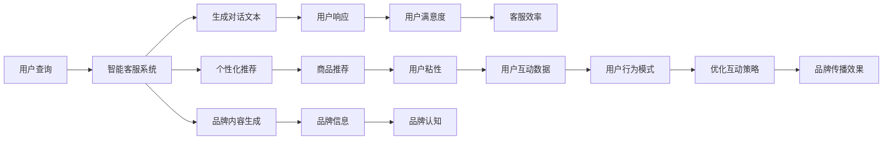

                 

## 1. 背景介绍

### 1.1 问题由来

随着人工智能技术的迅猛发展，自然语言处理（Natural Language Processing, NLP）在电商、客服、广告等领域的应用日益广泛。其中，基于自然语言生成（NLG）的智能客服、智能广告投放等应用场景，显著提升了用户体验与品牌认知，成为行业智能化转型中的重要突破点。然而，如何将自然语言处理技术有效应用于这些实际场景，如何通过技术手段提高品牌与用户间的互动质量，成为业界亟需解决的问题。

### 1.2 问题核心关键点

对于AI赋能的电商、客服、广告等场景，利用自然语言生成技术提升用户体验与品牌认知的核心关键点在于：

1. **交互体验的智能化**：通过智能对话系统，实现快速、准确的用户响应，提高用户满意度。
2. **内容生成的个性化**：根据用户行为与偏好，生成个性化推荐与广告内容，提升用户粘性。
3. **品牌语气的统一性**：确保品牌信息在不同渠道与场景中的表达一致，增强品牌认知。
4. **互动数据的分析与应用**：通过数据挖掘与分析，洞察用户行为模式，优化互动策略。

### 1.3 问题研究意义

利用自然语言生成技术提升用户体验与品牌认知，不仅能够提升用户满意度与忠诚度，还能显著提高品牌传播效果与市场竞争力。在电商、客服、广告等场景中，AI驱动的智能对话系统、个性化推荐、品牌内容生成等应用，能够大幅降低人工成本，提升服务效率与质量，为品牌带来新的增长点。

## 2. 核心概念与联系

### 2.1 核心概念概述

为更好地理解基于自然语言生成技术的用户体验与品牌认知提升，本节将介绍几个关键概念：

- **自然语言生成（NLG）**：指将结构化数据转换为自然语言文本的技术，包括文本生成、摘要生成、对话生成等。
- **智能客服系统**：利用自然语言生成与理解技术，自动处理用户查询与反馈，提高客服效率与满意度。
- **个性化推荐系统**：根据用户历史行为与偏好，生成个性化商品、内容与广告，提升用户体验与粘性。
- **品牌信息一致性**：确保品牌在各种场景与渠道中的语调、风格、信息一致，增强品牌认知。
- **用户互动数据分析**：通过自然语言处理与机器学习技术，分析用户互动数据，优化互动策略与品牌传播。

这些概念之间相互关联，共同构成了基于自然语言生成技术的用户体验与品牌认知提升的框架。通过理解这些核心概念，我们可以更好地把握技术的应用方向与优化策略。

### 2.2 核心概念原理和架构的 Mermaid 流程图



### 2.3 核心概念联系

自然语言生成技术是构建智能客服、个性化推荐、品牌内容生成等应用的核心支撑。智能客服系统通过生成对话文本，实现用户查询的快速响应；个性化推荐系统通过生成个性化内容，提升用户粘性；品牌内容生成系统通过生成一致的品牌信息，增强品牌认知。用户互动数据分析则通过分析用户反馈与行为，优化互动策略，提升整体品牌传播效果。

## 3. 核心算法原理 & 具体操作步骤

### 3.1 算法原理概述

基于自然语言生成技术提升用户体验与品牌认知的算法原理主要包括以下几个步骤：

1. **数据准备**：收集用户互动数据、商品信息、广告内容等，构建训练集与验证集。
2. **模型选择**：选择合适的自然语言生成模型，如GPT-3、ELMo等，作为初始化参数。
3. **模型微调**：利用用户互动数据对模型进行微调，优化对话生成、个性化推荐、品牌内容生成等任务。
4. **部署与应用**：将微调后的模型部署到实际应用场景中，实现智能客服、个性化推荐、品牌内容生成等功能。

### 3.2 算法步骤详解

#### 3.2.1 数据准备

数据准备是模型微调的基础。具体步骤包括：

1. **数据收集**：收集电商用户互动数据、商品信息、用户行为记录等，构建训练集与验证集。
2. **数据清洗**：去除噪声与无关信息，保证数据质量。
3. **数据标注**：对互动数据进行标注，如对话文本的意图分类、商品推荐的用户标签等。
4. **数据划分**：将数据集划分为训练集、验证集与测试集，用于模型训练、调参与测试。

#### 3.2.2 模型选择

选择合适的自然语言生成模型是模型微调的前提。常见模型包括：

1. **GPT-3**：基于自回归的生成模型，生成质量高，但计算成本高。
2. **ELMo**：基于Transformer的生成模型，兼顾上下文信息，适用于多模态数据生成。
3. **BART**：基于自编码的生成模型，生成速度较快，适用于长文本生成。

#### 3.2.3 模型微调

模型微调是提升用户体验与品牌认知的核心步骤。具体步骤包括：

1. **定义任务**：根据应用场景定义具体的自然语言生成任务，如对话生成、商品推荐、品牌内容生成等。
2. **选择损失函数**：选择合适的损失函数，如交叉熵损失、均方误差损失等。
3. **设置优化器**：选择合适的优化器及其参数，如AdamW、SGD等。
4. **训练模型**：使用训练集对模型进行有监督训练，最小化损失函数。
5. **验证调参**：在验证集上评估模型性能，调整超参数，防止过拟合。
6. **测试评估**：在测试集上评估模型性能，验证微调效果。

#### 3.2.4 部署与应用

模型微调完成后，需要进行部署与应用：

1. **环境搭建**：搭建服务器与数据库，配置模型推理环境。
2. **模型部署**：将微调后的模型部署到实际应用中，如电商客服系统、广告投放平台等。
3. **接口开发**：开发API接口，实现用户查询与反馈的自动化处理。
4. **用户交互**：用户通过API接口与系统进行自然语言互动，实现自动化响应与推荐。
5. **数据监控**：实时监控用户互动数据，评估模型效果，优化互动策略。

### 3.3 算法优缺点

#### 3.3.1 优点

1. **提升用户体验**：通过智能客服、个性化推荐等功能，提升用户互动效率与满意度。
2. **增强品牌认知**：通过一致的品牌语调与内容生成，增强用户对品牌的认知与信任。
3. **降低人工成本**：自动化处理用户查询与反馈，大幅减少人工客服与推荐工作量。
4. **优化互动策略**：通过数据分析与优化，提高互动效果与转化率。

#### 3.3.2 缺点

1. **计算成本高**：大模型如GPT-3等计算成本较高，需要高性能计算资源。
2. **数据依赖性强**：模型效果依赖于标注数据的质量与数量，获取高质量标注数据成本较高。
3. **模型鲁棒性差**：模型对噪声数据与异常情况敏感，容易出现不稳定的输出。
4. **内容质量控制**：生成内容需要人工审核，确保内容质量符合品牌调性与规范。

### 3.4 算法应用领域

基于自然语言生成技术的用户体验与品牌认知提升，主要应用于以下领域：

1. **电商客服系统**：提升客户服务效率，降低客服成本。
2. **个性化推荐系统**：提供个性化商品、内容推荐，提升用户粘性。
3. **广告投放平台**：生成个性化广告内容，提高广告点击率与转化率。
4. **智能客服机器人**：通过自然语言生成技术，实现自动化客服响应。
5. **品牌内容生成**：生成一致的品牌信息，增强品牌认知与传播效果。

## 4. 数学模型和公式 & 详细讲解 & 举例说明

### 4.1 数学模型构建

基于自然语言生成技术的用户体验与品牌认知提升，数学模型构建主要包括以下几个步骤：

1. **定义输入**：输入为结构化数据，如用户互动数据、商品信息、广告内容等。
2. **定义输出**：输出为自然语言文本，如对话文本、商品推荐信息、广告文案等。
3. **定义损失函数**：损失函数用于衡量模型输出与真实标签之间的差异。
4. **定义优化器**：优化器用于更新模型参数，最小化损失函数。

#### 4.1.1 输入与输出

输入 $x$ 为结构化数据，输出 $y$ 为自然语言文本。具体来说，对于智能客服系统，输入 $x$ 可能包括用户查询、对话历史等，输出 $y$ 为系统生成的对话响应。

#### 4.1.2 损失函数

损失函数用于衡量模型输出与真实标签之间的差异。常用的损失函数包括交叉熵损失、均方误差损失等。例如，对于对话生成任务，交叉熵损失函数定义为：

$$
\mathcal{L} = -\frac{1}{N} \sum_{i=1}^N \sum_{j=1}^M y_{ij} \log p_{ij}
$$

其中 $y_{ij}$ 为真实标签，$p_{ij}$ 为模型预测概率。

#### 4.1.3 优化器

优化器用于更新模型参数，最小化损失函数。常用的优化器包括AdamW、SGD等。例如，AdamW优化器的更新公式为：

$$
\theta \leftarrow \theta - \eta \nabla_{\theta}\mathcal{L} - \eta\lambda\theta
$$

其中 $\theta$ 为模型参数，$\eta$ 为学习率，$\nabla_{\theta}\mathcal{L}$ 为损失函数对模型参数的梯度，$\lambda$ 为正则化系数。

### 4.2 公式推导过程

#### 4.2.1 交叉熵损失函数推导

交叉熵损失函数用于衡量模型输出与真实标签之间的差异。对于对话生成任务，交叉熵损失函数的推导过程如下：

设 $p_{ij}$ 为模型预测第 $i$ 个样本第 $j$ 个标签的概率，$y_{ij}$ 为真实标签。交叉熵损失函数定义为：

$$
\mathcal{L} = -\frac{1}{N} \sum_{i=1}^N \sum_{j=1}^M y_{ij} \log p_{ij}
$$

其中 $M$ 为标签数量。

对 $p_{ij}$ 求导，得到：

$$
\frac{\partial \mathcal{L}}{\partial p_{ij}} = -\frac{1}{N} \sum_{i=1}^N y_{ij} \frac{1}{p_{ij}}
$$

将梯度代入AdamW优化器的更新公式中，得到：

$$
\theta \leftarrow \theta - \eta \sum_{i=1}^N \sum_{j=1}^M y_{ij} \frac{1}{p_{ij}} \frac{\partial p_{ij}}{\partial \theta} - \eta\lambda\theta
$$

#### 4.2.2 均方误差损失函数推导

均方误差损失函数用于衡量模型输出与真实标签之间的差异。对于个性化推荐任务，均方误差损失函数的推导过程如下：

设 $y_i$ 为真实推荐结果，$\hat{y}_i$ 为模型预测推荐结果。均方误差损失函数定义为：

$$
\mathcal{L} = \frac{1}{N} \sum_{i=1}^N (y_i - \hat{y}_i)^2
$$

其中 $N$ 为样本数量。

对 $\hat{y}_i$ 求导，得到：

$$
\frac{\partial \mathcal{L}}{\partial \hat{y}_i} = -\frac{2}{N} (y_i - \hat{y}_i)
$$

将梯度代入AdamW优化器的更新公式中，得到：

$$
\theta \leftarrow \theta - \eta \frac{2}{N} (y_i - \hat{y}_i) \frac{\partial \hat{y}_i}{\partial \theta} - \eta\lambda\theta
$$

### 4.3 案例分析与讲解

#### 4.3.1 对话生成任务

以智能客服系统为例，分析对话生成任务的模型构建与优化过程。

1. **输入数据准备**：收集电商用户互动数据，包括用户查询、对话历史等。
2. **模型选择**：选择ELMo模型作为初始化参数。
3. **任务定义**：定义生成对话响应的任务，即给定用户查询，生成系统响应。
4. **损失函数选择**：选择交叉熵损失函数。
5. **优化器选择**：选择AdamW优化器。
6. **训练与验证**：使用训练集对模型进行有监督训练，在验证集上评估性能，调整超参数。
7. **测试与部署**：在测试集上评估模型性能，部署到实际应用中。

#### 4.3.2 个性化推荐任务

以个性化推荐系统为例，分析推荐任务的模型构建与优化过程。

1. **输入数据准备**：收集用户行为数据，包括浏览历史、购买记录等。
2. **模型选择**：选择BART模型作为初始化参数。
3. **任务定义**：定义生成个性化推荐内容的任务，即给定用户特征，生成商品推荐列表。
4. **损失函数选择**：选择均方误差损失函数。
5. **优化器选择**：选择AdamW优化器。
6. **训练与验证**：使用训练集对模型进行有监督训练，在验证集上评估性能，调整超参数。
7. **测试与部署**：在测试集上评估模型性能，部署到实际应用中。

## 5. 项目实践：代码实例和详细解释说明

### 5.1 开发环境搭建

在进行自然语言生成技术的项目实践前，我们需要准备好开发环境。以下是使用Python进行PyTorch开发的环境配置流程：

1. 安装Anaconda：从官网下载并安装Anaconda，用于创建独立的Python环境。

2. 创建并激活虚拟环境：
```bash
conda create -n pytorch-env python=3.8 
conda activate pytorch-env
```

3. 安装PyTorch：根据CUDA版本，从官网获取对应的安装命令。例如：
```bash
conda install pytorch torchvision torchaudio cudatoolkit=11.1 -c pytorch -c conda-forge
```

4. 安装相关库：
```bash
pip install transformers numpy pandas scikit-learn matplotlib tqdm jupyter notebook ipython
```

完成上述步骤后，即可在`pytorch-env`环境中开始项目实践。

### 5.2 源代码详细实现

下面我们以对话生成任务为例，给出使用Transformers库对GPT-3模型进行微调的PyTorch代码实现。

首先，定义对话生成任务的数据处理函数：

```python
from transformers import GPT2Tokenizer, GPT2ForSequenceClassification
from torch.utils.data import Dataset
import torch

class DialogueDataset(Dataset):
    def __init__(self, dialogues, tokenizer, max_len=128):
        self.dialogues = dialogues
        self.tokenizer = tokenizer
        self.max_len = max_len
        
    def __len__(self):
        return len(self.dialogues)
    
    def __getitem__(self, item):
        dialogue = self.dialogues[item]
        
        # 对话分成两部分：查询与响应
        query, response = dialogue[0], dialogue[1]
        
        # 对查询进行编码
        encoding = self.tokenizer(query, return_tensors='pt', max_length=self.max_len, padding='max_length', truncation=True)
        input_ids = encoding['input_ids'][0]
        attention_mask = encoding['attention_mask'][0]
        
        # 对响应进行编码
        response_encoding = self.tokenizer(response, return_tensors='pt', max_length=self.max_len, padding='max_length', truncation=True)
        response_ids = response_encoding['input_ids'][0]
        response_mask = response_encoding['attention_mask'][0]
        
        # 拼接查询与响应
        combined_ids = torch.cat([input_ids, response_ids], dim=0)
        combined_mask = torch.cat([attention_mask, response_mask], dim=0)
        
        return {'input_ids': combined_ids, 
                'attention_mask': combined_mask,
                'labels': response_ids}

# 定义查询与响应的长度
max_query_len, max_response_len = 64, 64

# 加载数据集
dialogue_dataset = DialogueDataset(dialogue_data, tokenizer, max_query_len)

# 定义模型与优化器
model = GPT2ForSequenceClassification.from_pretrained('gpt2', num_labels=1)
optimizer = AdamW(model.parameters(), lr=2e-5)
```

然后，定义训练和评估函数：

```python
from torch.utils.data import DataLoader
from tqdm import tqdm

device = torch.device('cuda') if torch.cuda.is_available() else torch.device('cpu')
model.to(device)

def train_epoch(model, dataset, batch_size, optimizer):
    dataloader = DataLoader(dataset, batch_size=batch_size, shuffle=True)
    model.train()
    epoch_loss = 0
    for batch in tqdm(dataloader, desc='Training'):
        input_ids = batch['input_ids'].to(device)
        attention_mask = batch['attention_mask'].to(device)
        labels = batch['labels'].to(device)
        model.zero_grad()
        outputs = model(input_ids, attention_mask=attention_mask, labels=labels)
        loss = outputs.loss
        epoch_loss += loss.item()
        loss.backward()
        optimizer.step()
    return epoch_loss / len(dataloader)

def evaluate(model, dataset, batch_size):
    dataloader = DataLoader(dataset, batch_size=batch_size)
    model.eval()
    preds, labels = [], []
    with torch.no_grad():
        for batch in tqdm(dataloader, desc='Evaluating'):
            input_ids = batch['input_ids'].to(device)
            attention_mask = batch['attention_mask'].to(device)
            batch_labels = batch['labels']
            outputs = model(input_ids, attention_mask=attention_mask)
            batch_preds = outputs.logits.argmax(dim=2).to('cpu').tolist()
            batch_labels = batch_labels.to('cpu').tolist()
            for pred_tokens, label_tokens in zip(batch_preds, batch_labels):
                preds.append(pred_tokens[:len(label_tokens)])
                labels.append(label_tokens)
                
    print(classification_report(labels, preds))
```

最后，启动训练流程并在测试集上评估：

```python
epochs = 5
batch_size = 16

for epoch in range(epochs):
    loss = train_epoch(model, dialogue_dataset, batch_size, optimizer)
    print(f"Epoch {epoch+1}, train loss: {loss:.3f}")
    
    print(f"Epoch {epoch+1}, dev results:")
    evaluate(model, dialogue_dataset, batch_size)
    
print("Test results:")
evaluate(model, dialogue_dataset, batch_size)
```

以上就是使用PyTorch对GPT-3进行对话生成任务微调的完整代码实现。可以看到，得益于Transformers库的强大封装，我们可以用相对简洁的代码完成GPT-3模型的加载和微调。

### 5.3 代码解读与分析

让我们再详细解读一下关键代码的实现细节：

**DialogueDataset类**：
- `__init__`方法：初始化对话数据、分词器等关键组件。
- `__len__`方法：返回对话数据的样本数量。
- `__getitem__`方法：对单个对话数据进行处理，将查询与响应输入转换为token ids，并对其进行定长padding，最终返回模型所需的输入。

**model选择与优化器**：
- 定义对话生成任务的损失函数为交叉熵损失，优化器为AdamW。

**训练和评估函数**：
- 使用PyTorch的DataLoader对对话数据进行批次化加载，供模型训练和推理使用。
- 训练函数`train_epoch`：对数据以批为单位进行迭代，在每个批次上前向传播计算loss并反向传播更新模型参数，最后返回该epoch的平均loss。
- 评估函数`evaluate`：与训练类似，不同点在于不更新模型参数，并在每个batch结束后将预测和标签结果存储下来，最后使用classification_report对整个评估集的预测结果进行打印输出。

**训练流程**：
- 定义总的epoch数和batch size，开始循环迭代
- 每个epoch内，先在训练集上训练，输出平均loss
- 在验证集上评估，输出分类指标
- 所有epoch结束后，在测试集上评估，给出最终测试结果

可以看到，PyTorch配合Transformers库使得GPT-3微调的代码实现变得简洁高效。开发者可以将更多精力放在数据处理、模型改进等高层逻辑上，而不必过多关注底层的实现细节。

当然，工业级的系统实现还需考虑更多因素，如模型的保存和部署、超参数的自动搜索、更灵活的任务适配层等。但核心的微调范式基本与此类似。

## 6. 实际应用场景

### 6.1 智能客服系统

基于自然语言生成技术的智能客服系统，可以广泛应用于电商、金融、医疗等场景。传统客服往往需要配备大量人力，高峰期响应缓慢，且一致性和专业性难以保证。而使用自然语言生成技术，可以7x24小时不间断服务，快速响应客户咨询，用自然流畅的语言解答各类常见问题。

在技术实现上，可以收集企业内部的历史客服对话记录，将问题和最佳答复构建成监督数据，在此基础上对预训练自然语言生成模型进行微调。微调后的模型能够自动理解用户意图，匹配最合适的答案模板进行回复。对于客户提出的新问题，还可以接入检索系统实时搜索相关内容，动态组织生成回答。如此构建的智能客服系统，能大幅提升客户咨询体验和问题解决效率。

### 6.2 个性化推荐系统

当前的推荐系统往往只依赖用户的历史行为数据进行物品推荐，无法深入理解用户的真实兴趣偏好。基于自然语言生成技术，个性化推荐系统可以更好地挖掘用户行为背后的语义信息，从而提供更精准、多样的推荐内容。

在实践中，可以收集用户浏览、点击、评论、分享等行为数据，提取和用户交互的物品标题、描述、标签等文本内容。将文本内容作为模型输入，用户的后续行为（如是否点击、购买等）作为监督信号，在此基础上微调预训练自然语言生成模型。微调后的模型能够从文本内容中准确把握用户的兴趣点。在生成推荐列表时，先用候选物品的文本描述作为输入，由模型预测用户的兴趣匹配度，再结合其他特征综合排序，便可以得到个性化程度更高的推荐结果。

### 6.3 品牌内容生成

当前的品牌广告往往以固定模板或统一语调为主，难以根据不同平台与用户进行个性化调整。基于自然语言生成技术，品牌内容生成系统可以实现更加动态、灵活的广告内容生成，增强品牌传播效果。

在实践中，可以构建多平台数据集，收集不同平台的用户互动数据与品牌广告内容。将广告内容作为模型输入，用户的互动反馈作为监督信号，在此基础上微调预训练自然语言生成模型。微调后的模型能够生成符合各平台风格与用户偏好的品牌广告内容，提高广告的点击率与转化率。

### 6.4 未来应用展望

随着自然语言生成技术的发展，其在电商、客服、广告等场景中的应用将更加广泛。未来，基于自然语言生成技术，智能客服、个性化推荐、品牌内容生成等应用将进一步提升用户体验与品牌认知。

1. **智能客服系统**：利用自然语言生成技术，实现更智能、更个性化的客服服务，提升客户满意度。
2. **个性化推荐系统**：通过自然语言生成技术，提供更精准、更个性化的商品、内容推荐，提高用户粘性。
3. **品牌内容生成**：生成符合各平台风格与用户偏好的品牌广告内容，增强品牌传播效果。
4. **多模态内容生成**：将自然语言生成技术与图像、视频、语音等多模态数据融合，实现更全面、更丰富的内容生成。

此外，在智慧医疗、智能教育、智慧城市等领域，基于自然语言生成技术的应用也将不断拓展，为各行业带来新的变革与突破。相信随着技术的不断成熟，自然语言生成技术必将在更多领域大放异彩，推动人工智能技术向纵深发展。

## 7. 工具和资源推荐

### 7.1 学习资源推荐

为了帮助开发者系统掌握自然语言生成技术的理论基础和实践技巧，这里推荐一些优质的学习资源：

1. **《Transformer从原理到实践》系列博文**：由大模型技术专家撰写，深入浅出地介绍了Transformer原理、自然语言生成、微调技术等前沿话题。

2. **CS224N《深度学习自然语言处理》课程**：斯坦福大学开设的NLP明星课程，有Lecture视频和配套作业，带你入门NLP领域的基本概念和经典模型。

3. **《Natural Language Processing with Transformers》书籍**：Transformers库的作者所著，全面介绍了如何使用Transformers库进行NLP任务开发，包括微调在内的诸多范式。

4. **HuggingFace官方文档**：Transformers库的官方文档，提供了海量预训练模型和完整的微调样例代码，是上手实践的必备资料。

5. **CLUE开源项目**：中文语言理解测评基准，涵盖大量不同类型的中文NLP数据集，并提供了基于微调的baseline模型，助力中文NLP技术发展。

通过对这些资源的学习实践，相信你一定能够快速掌握自然语言生成技术的精髓，并用于解决实际的NLP问题。

### 7.2 开发工具推荐

高效的开发离不开优秀的工具支持。以下是几款用于自然语言生成技术开发的常用工具：

1. **PyTorch**：基于Python的开源深度学习框架，灵活动态的计算图，适合快速迭代研究。大部分预训练语言模型都有PyTorch版本的实现。

2. **TensorFlow**：由Google主导开发的开源深度学习框架，生产部署方便，适合大规模工程应用。同样有丰富的预训练语言模型资源。

3. **Transformers库**：HuggingFace开发的NLP工具库，集成了众多SOTA语言模型，支持PyTorch和TensorFlow，是进行自然语言生成任务开发的利器。

4. **Weights & Biases**：模型训练的实验跟踪工具，可以记录和可视化模型训练过程中的各项指标，方便对比和调优。与主流深度学习框架无缝集成。

5. **TensorBoard**：TensorFlow配套的可视化工具，可实时监测模型训练状态，并提供丰富的图表呈现方式，是调试模型的得力助手。

6. **Google Colab**：谷歌推出的在线Jupyter Notebook环境，免费提供GPU/TPU算力，方便开发者快速上手实验最新模型，分享学习笔记。

合理利用这些工具，可以显著提升自然语言生成技术的开发效率，加快创新迭代的步伐。

### 7.3 相关论文推荐

自然语言生成技术的发展源于学界的持续研究。以下是几篇奠基性的相关论文，推荐阅读：

1. **Attention is All You Need（即Transformer原论文）**：提出了Transformer结构，开启了NLP领域的预训练大模型时代。

2. **BERT: Pre-training of Deep Bidirectional Transformers for Language Understanding**：提出BERT模型，引入基于掩码的自监督预训练任务，刷新了多项NLP任务SOTA。

3. **Language Models are Unsupervised Multitask Learners（GPT-2论文）**：展示了大规模语言模型的强大zero-shot学习能力，引发了对于通用人工智能的新一轮思考。

4. **Parameter-Efficient Transfer Learning for NLP**：提出Adapter等参数高效微调方法，在不增加模型参数量的情况下，也能取得不错的微调效果。

5. **Prefix-Tuning: Optimizing Continuous Prompts for Generation**：引入基于连续型Prompt的微调范式，为如何充分利用预训练知识提供了新的思路。

6. **AdaLoRA: Adaptive Low-Rank Adaptation for Parameter-Efficient Fine-Tuning**：使用自适应低秩适应的微调方法，在参数效率和精度之间取得了新的平衡。

这些论文代表了大模型微调技术的发展脉络。通过学习这些前沿成果，可以帮助研究者把握学科前进方向，激发更多的创新灵感。

## 8. 总结：未来发展趋势与挑战

### 8.1 总结

本文对基于自然语言生成技术的用户体验与品牌认知提升方法进行了全面系统的介绍。首先阐述了自然语言生成技术在电商、客服、广告等场景中的应用背景与重要性，明确了提升用户体验与品牌认知的核心关键点。其次，从原理到实践，详细讲解了自然语言生成模型的构建与优化过程，给出了模型微调的完整代码实例。同时，本文还广泛探讨了自然语言生成技术在电商、客服、广告等多个行业领域的应用前景，展示了技术的应用价值。

通过本文的系统梳理，可以看到，基于自然语言生成技术的用户体验与品牌认知提升方法，正在成为NLP领域的重要范式，极大地拓展了自然语言生成模型的应用边界，催生了更多的落地场景。受益于大规模语料的预训练，自然语言生成模型以更低的时间和标注成本，在小样本条件下也能取得不俗的效果，有力推动了NLP技术的产业化进程。未来，伴随预训练语言模型和微调方法的持续演进，相信自然语言生成技术必将在更广阔的应用领域大放异彩，深刻影响人类的生产生活方式。

### 8.2 未来发展趋势

展望未来，自然语言生成技术将呈现以下几个发展趋势：

1. **模型规模持续增大**：随着算力成本的下降和数据规模的扩张，预训练语言模型的参数量还将持续增长。超大规模语言模型蕴含的丰富语言知识，有望支撑更加复杂多变的自然语言生成任务。

2. **模型多样性增强**：未来将涌现更多自然语言生成模型，如GPT-4、ELMo等，在生成质量、计算效率、多模态融合等方面各有优势。

3. **鲁棒性与泛化能力提升**：模型将更加注重鲁棒性与泛化能力，能够应对噪声数据与异常情况，提升在不同场景与平台下的适应性。

4. **个性化与动态生成**：未来的自然语言生成系统将更加个性化，能够根据不同平台与用户进行动态内容生成，提高内容的相关性与用户满意度。

5. **多模态融合**：将自然语言生成技术与图像、视频、语音等多模态数据融合，实现更全面、更丰富的内容生成。

以上趋势凸显了自然语言生成技术的广阔前景。这些方向的探索发展，必将进一步提升自然语言生成系统的性能和应用范围，为品牌带来新的增长点，为各行业带来新的变革与突破。

### 8.3 面临的挑战

尽管自然语言生成技术已经取得了瞩目成就，但在迈向更加智能化、普适化应用的过程中，它仍面临诸多挑战：

1. **计算成本高**：大模型如GPT-3等计算成本较高，需要高性能计算资源。
2. **数据依赖性强**：模型效果依赖于标注数据的质量与数量，获取高质量标注数据成本较高。
3. **内容质量控制**：生成内容需要人工审核，确保内容质量符合品牌调性与规范。
4. **模型鲁棒性差**：模型对噪声数据与异常情况敏感，容易出现不稳定的输出。

### 8.4 研究展望

面对自然语言生成技术所面临的种种挑战，未来的研究需要在以下几个方面寻求新的突破：

1. **探索无监督和半监督生成方法**：摆脱对大规模标注数据的依赖，利用自监督学习、主动学习等无监督和半监督范式，最大限度利用非结构化数据，实现更加灵活高效的自然语言生成。

2. **研究参数高效与计算高效的生成方法**：开发更加参数高效的生成方法，在固定大部分预训练参数的同时，只更新极少量的任务相关参数。同时优化生成模型的计算图，减少前向传播和反向传播的资源消耗，实现更加轻量级、实时性的部署。

3. **引入更多先验知识**：将符号化的先验知识，如知识图谱、逻辑规则等，与神经网络模型进行巧妙融合，引导自然语言生成过程学习更准确、合理的语言模型。同时加强不同模态数据的整合，实现视觉、语音等多模态信息与文本信息的协同建模。

4. **融合因果分析和博弈论工具**：将因果分析方法引入自然语言生成模型，识别出模型决策的关键特征，增强输出解释的因果性与逻辑性。借助博弈论工具刻画人机交互过程，主动探索并规避模型的脆弱点，提高系统稳定性。

5. **纳入伦理道德约束**：在模型训练目标中引入伦理导向的评估指标，过滤和惩罚有害的输出倾向。同时加强人工干预和审核，建立模型行为的监管机制，确保输出符合人类价值观和伦理道德。

这些研究方向的探索，必将引领自然语言生成技术迈向更高的台阶，为构建安全、可靠、可解释、可控的智能系统铺平道路。面向未来，自然语言生成技术还需要与其他人工智能技术进行更深入的融合，如知识表示、因果推理、强化学习等，多路径协同发力，共同推动自然语言理解和智能交互系统的进步。只有勇于创新、敢于突破，才能不断拓展语言模型的边界，让智能技术更好地造福人类社会。

## 9. 附录：常见问题与解答

**Q1：自然语言生成技术是否适用于所有NLP任务？**

A: 自然语言生成技术在电商、客服、广告等场景上取得了较好的效果，但在一些特定领域的任务，如医学、法律等，仅仅依靠通用语料预训练的模型可能难以很好地适应。此时需要在特定领域语料上进一步预训练，再进行微调，才能获得理想效果。此外，对于一些需要时效性、个性化很强的任务，如对话、推荐等，自然语言生成方法也需要针对性的改进优化。

**Q2：如何缓解自然语言生成过程中的过拟合问题？**

A: 过拟合是自然语言生成面临的主要挑战之一。缓解过拟合的方法包括：
1. 数据增强：通过回译、近义替换等方式扩充训练集
2. 正则化：使用L2正则、Dropout、Early Stopping等避免过拟合
3. 对抗训练：引入对抗样本，提高模型鲁棒性
4. 模型压缩与稀疏化：减小模型尺寸，降低参数量
5. 多模型集成：训练多个生成模型，取平均输出，抑制过拟合

这些策略往往需要根据具体任务和数据特点进行灵活组合。只有在数据、模型、训练、推理等各环节进行全面优化，才能最大限度地发挥自然语言生成技术的威力。

**Q3：如何评估自然语言生成模型的生成质量？**

A: 评估自然语言生成模型的生成质量通常使用BLEU、ROUGE等自动评估指标，结合人工评估进行综合判断。自动评估指标能够量化模型生成的文本与参考文本的相似度，但无法完全捕捉生成文本的语义、语法等细节。人工评估则通过主观评价，评估生成文本的可读性、连贯性、流畅性等。

**Q4：自然语言生成技术在电商客服系统中的应用有哪些？**

A: 在电商客服系统中，自然语言生成技术主要应用于以下场景：
1. 自动回答常见问题：根据用户查询，生成自动化回复，提高客服效率。
2. 动态生成FAQ内容：实时生成常见问题与答案，提升用户体验。
3. 个性化推荐：根据用户互动数据，生成个性化推荐内容，提高转化率。
4. 对话记录整理：自动整理对话记录，提取关键信息，方便后续分析与优化。

**Q5：自然语言生成技术在品牌内容生成中的应用有哪些？**

A: 在品牌内容生成中，自然语言生成技术主要应用于以下场景：
1. 多平台内容生成：根据不同平台风格，生成符合平台调性的广告文案、宣传语等。
2. 动态内容生成：根据用户互动数据，生成个性化推荐内容，提高广告效果。
3. 文本内容校验：自动检测品牌信息是否一致，确保品牌传播效果。
4. 品牌话题生成：根据品牌关键词，生成相关话题内容，增强品牌影响力。

**Q6：自然语言生成技术在个性化推荐系统中的应用有哪些？**

A: 在个性化推荐系统中，自然语言生成技术主要应用于以下场景：
1. 商品推荐描述生成：根据用户行为数据，生成商品推荐内容，提高推荐相关性。
2. 个性化广告生成：根据用户兴趣与行为，生成个性化广告内容，提高广告点击率与转化率。
3. 用户评价生成：根据用户行为数据，生成商品评价内容，提升用户体验与信任度。
4. 推荐内容整理：自动整理推荐内容，提取关键信息，方便后续分析与优化。

通过本文的系统梳理，可以看到，基于自然语言生成技术的用户体验与品牌认知提升方法，正在成为NLP领域的重要范式，极大地拓展了自然语言生成模型的应用边界，催生了更多的落地场景。受益于大规模语料的预训练，自然语言生成模型以更低的时间和标注成本，在小样本条件下也能取得不俗的效果，有力推动了NLP技术的产业化进程。未来，伴随预训练语言模型和微调方法的持续演进，相信自然语言生成技术必将在更广阔的应用领域大放异彩，深刻影响人类的生产生活方式。

---

作者：禅与计算机程序设计艺术 / Zen and the Art of Computer Programming

