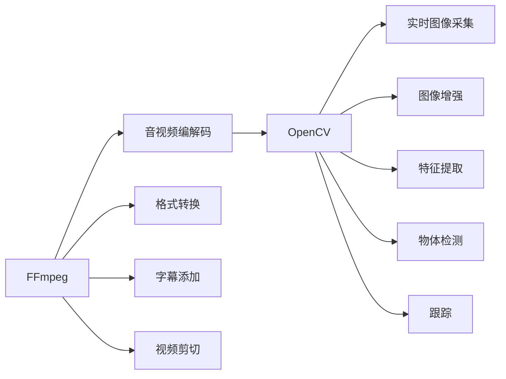

                 

# FFmpeg+OpenCV打造音视频处理利器

> 关键词：FFmpeg, OpenCV, 音视频处理, 实时分析, 图像处理, 计算机视觉

## 1. 背景介绍

在数字时代，音视频数据的处理和分析已经成为了各行各业的重要任务。无论是视频会议、在线教育、智能监控，还是游戏开发、虚拟现实，音视频数据无处不在，高质量的音视频处理能力成为了现代技术的基础。然而，复杂的音视频数据处理过程，涉及编解码、图像识别、实时分析等多个技术层面，挑战重重。

为了应对这些挑战，本文将介绍两个开源且功能强大的工具：FFmpeg和OpenCV。通过FFmpeg进行音视频编解码，OpenCV进行图像处理和分析，开发者可以轻松搭建一个高效的音视频处理系统，实现音视频数据的高质量处理和实时分析。

## 2. 核心概念与联系

### 2.1 核心概念概述

- **FFmpeg**：FFmpeg是一款开源的音视频处理工具，能够处理各种编解码格式，包括但不限于MP4、AVI、MKV、FLV等。FFmpeg支持实时音视频流的编解码、格式转换、字幕添加、视频剪切等多种功能，是音视频处理的利器。

- **OpenCV**：OpenCV是一款开源的计算机视觉库，包含丰富的图像处理和分析算法。OpenCV支持实时图像采集、图像增强、特征提取、物体检测、跟踪等多种功能，是计算机视觉技术的核心工具。

### 2.2 核心概念原理和架构的 Mermaid 流程图



以上流程图展示了FFmpeg和OpenCV的核心功能。FFmpeg负责音视频的编解码、格式转换、字幕添加、视频剪切等功能，OpenCV负责实时图像采集、图像增强、特征提取、物体检测、跟踪等功能。两者的结合，可以构建一个功能全面、灵活高效的音视频处理系统。

## 3. 核心算法原理 & 具体操作步骤

### 3.1 算法原理概述

FFmpeg和OpenCV的核心算法涉及音视频编解码、图像处理、特征提取等多个领域。以下简要介绍每个领域的算法原理：

- **音视频编解码**：FFmpeg通过H.264、H.265、VP9等编码算法，将原始音视频数据压缩成适合传输和存储的格式。
- **图像处理**：OpenCV提供了丰富的图像处理算法，包括灰度转换、滤波、边缘检测、形态学操作等，可以用于图像增强和特征提取。
- **特征提取**：OpenCV还提供了多种特征提取算法，如SIFT、SURF、HOG等，可以用于物体检测、跟踪等计算机视觉任务。

### 3.2 算法步骤详解

#### 3.2.1 FFmpeg操作步骤

1. **安装FFmpeg**：
   - 从官网下载FFmpeg源代码。
   - 解压源代码，进入目录。
   - 执行以下命令编译FFmpeg：

     ```bash
     configure
     make
     sudo make install
     ```

2. **音视频处理**：
   - 使用FFmpeg进行音视频文件的编解码：

     ```bash
     ffmpeg -i input.mp4 -c:v libx264 -crf 23 output.mp4
     ```

     解释：将input.mp4文件解码为视频，编码为H.264格式，参数23表示编码质量，输出为output.mp4文件。

   - 使用FFmpeg进行音视频格式转换：

     ```bash
     ffmpeg -i input.wav -c:a aac output.mp3
     ```

     解释：将input.wav文件解码为音频，编码为AAC格式，输出为output.mp3文件。

   - 使用FFmpeg进行字幕添加：

     ```bash
     ffmpeg -i input.mp4 -i subtitles.srt -c:a copy -c:v copy output.mp4
     ```

     解释：将input.mp4文件解码为视频，添加subtitles.srt的字幕，并复制音频和视频流，输出为output.mp4文件。

   - 使用FFmpeg进行视频剪切：

     ```bash
     ffmpeg -i input.mp4 -ss 00:00:10 -t 00:01:00 output.mp4
     ```

     解释：将input.mp4文件解码为视频，从第10秒开始剪切，时长1分钟，输出为output.mp4文件。

#### 3.2.2 OpenCV操作步骤

1. **安装OpenCV**：
   - 从官网下载OpenCV源代码。
   - 解压源代码，进入目录。
   - 执行以下命令编译OpenCV：

     ```bash
     cmake ..
     make
     sudo make install
     ```

2. **图像处理**：
   - 使用OpenCV进行灰度转换：

     ```python
     import cv2
     img = cv2.imread('image.jpg')
     gray_img = cv2.cvtColor(img, cv2.COLOR_BGR2GRAY)
     cv2.imshow('Gray Image', gray_img)
     cv2.waitKey(0)
     cv2.destroyAllWindows()
     ```

     解释：读取image.jpg文件，转换为灰度图像，显示灰度图像。

   - 使用OpenCV进行滤波：

     ```python
     import cv2
     img = cv2.imread('image.jpg')
     blurred_img = cv2.GaussianBlur(img, (5, 5), 0)
     cv2.imshow('Blurred Image', blurred_img)
     cv2.waitKey(0)
     cv2.destroyAllWindows()
     ```

     解释：读取image.jpg文件，进行高斯滤波，显示滤波后的图像。

   - 使用OpenCV进行边缘检测：

     ```python
     import cv2
     img = cv2.imread('image.jpg')
     edges = cv2.Canny(img, 100, 200)
     cv2.imshow('Edges', edges)
     cv2.waitKey(0)
     cv2.destroyAllWindows()
     ```

     解释：读取image.jpg文件，进行边缘检测，显示边缘检测后的图像。

3. **特征提取**：
   - 使用OpenCV进行SIFT特征提取：

     ```python
     import cv2
     img1 = cv2.imread('image1.jpg')
     img2 = cv2.imread('image2.jpg')
     sift = cv2.xfeatures2d.SIFT_create()
     keypoints1, descriptors1 = sift.detectAndCompute(img1, None)
     keypoints2, descriptors2 = sift.detectAndCompute(img2, None)
     matches = cv2.drawMatches(img1, keypoints1, img2, keypoints2, None, None)
     cv2.imshow('Matches', matches)
     cv2.waitKey(0)
     cv2.destroyAllWindows()
     ```

     解释：读取image1.jpg和image2.jpg文件，进行SIFT特征提取，显示匹配结果。

### 3.3 算法优缺点

#### 3.3.1 FFmpeg的优点
- 功能全面：支持多种编解码格式和功能。
- 性能优越：编码速度快，适合处理大规模音视频数据。
- 开源免费：社区活跃，资源丰富，易于学习和使用。

#### 3.3.2 FFmpeg的缺点
- 配置复杂：需要了解命令行参数。
- 依赖较多：需要安装依赖库。
- 功能深度有限：不适合进行复杂的图像处理和计算机视觉任务。

#### 3.3.3 OpenCV的优点
- 图像处理能力强：包含丰富的图像处理算法。
- 实时性高：适合进行实时图像处理和分析。
- 社区活跃：资源丰富，文档详细，易于学习和使用。

#### 3.3.4 OpenCV的缺点
- 功能深度有限：不适合进行大规模音视频数据处理。
- 性能要求高：图像处理算法复杂，对硬件要求较高。
- 依赖较多：需要安装依赖库。

### 3.4 算法应用领域

#### 3.4.1 音视频处理
- 音视频编解码：FFmpeg广泛用于音视频文件的编解码，支持多种格式和功能。
- 格式转换：FFmpeg支持多种音视频格式之间的转换，方便文件管理和传输。
- 字幕添加：FFmpeg支持字幕文件的添加，方便视频内容的补充和展示。
- 视频剪切：FFmpeg支持视频流的剪切，方便视频内容的编辑和整合。

#### 3.4.2 图像处理
- 灰度转换：OpenCV支持多种图像格式的灰度转换，方便后续处理。
- 滤波：OpenCV提供多种滤波算法，如高斯滤波、中值滤波等，可以用于图像增强和去噪。
- 边缘检测：OpenCV支持多种边缘检测算法，如Canny算法，可以用于图像特征提取。

#### 3.4.3 特征提取
- SIFT特征提取：OpenCV支持SIFT特征提取，可以用于物体检测和匹配。
- SURF特征提取：OpenCV支持SURF特征提取，可以用于物体检测和匹配。
- HOG特征提取：OpenCV支持HOG特征提取，可以用于物体检测和分类。

## 4. 数学模型和公式 & 详细讲解 & 举例说明

### 4.1 数学模型构建

#### 4.1.1 FFmpeg的数学模型

FFmpeg的核心算法涉及音视频编解码和格式转换。以下是音视频编解码的数学模型：

- 音视频编解码：
  - 输入：原始音视频数据 $X$，采样率 $f_s$，比特率 $b$。
  - 输出：压缩后的音视频数据 $Y$。
  - 模型：$Y = f(X, f_s, b)$。

#### 4.1.2 OpenCV的数学模型

OpenCV的核心算法涉及图像处理和特征提取。以下是图像处理的数学模型：

- 图像处理：
  - 输入：原始图像 $X$。
  - 输出：处理后的图像 $Y$。
  - 模型：$Y = f(X)$。

#### 4.1.3 特征提取的数学模型

OpenCV的核心算法还涉及特征提取。以下是SIFT特征提取的数学模型：

- SIFT特征提取：
  - 输入：原始图像 $X$。
  - 输出：SIFT特征向量 $Y$。
  - 模型：$Y = f(X)$。

### 4.2 公式推导过程

#### 4.2.1 FFmpeg的公式推导

FFmpeg的核心公式涉及音视频编解码。以下是H.264编解码的公式：

- H.264编解码：
  - 输入：原始音视频数据 $X$，编码器参数 $P$。
  - 输出：压缩后的音视频数据 $Y$。
  - 公式：$Y = C(X, P)$。

#### 4.2.2 OpenCV的公式推导

OpenCV的核心公式涉及图像处理。以下是高斯滤波的公式：

- 高斯滤波：
  - 输入：原始图像 $X$，核大小 $k$，标准差 $\sigma$。
  - 输出：处理后的图像 $Y$。
  - 公式：$Y = G(X, k, \sigma)$。

#### 4.2.3 SIFT特征提取的公式推导

OpenCV的核心公式涉及SIFT特征提取。以下是SIFT特征提取的公式：

- SIFT特征提取：
  - 输入：原始图像 $X$。
  - 输出：SIFT特征向量 $Y$。
  - 公式：$Y = SIFT(X)$。

### 4.3 案例分析与讲解

#### 4.3.1 FFmpeg案例分析

以下是使用FFmpeg进行音视频编解码的案例：

1. **音视频编解码**：
   - 输入：原始MP4文件。
   - 输出：压缩后的MP4文件。
   - 命令：`ffmpeg -i input.mp4 -c:v libx264 -crf 23 output.mp4`。

2. **音视频格式转换**：
   - 输入：原始WAV文件。
   - 输出：转换后的MP3文件。
   - 命令：`ffmpeg -i input.wav -c:a aac output.mp3`。

3. **字幕添加**：
   - 输入：原始MP4文件，SRT格式的字幕文件。
   - 输出：添加字幕后的MP4文件。
   - 命令：`ffmpeg -i input.mp4 -i subtitles.srt -c:a copy -c:v copy output.mp4`。

4. **视频剪切**：
   - 输入：原始MP4文件。
   - 输出：剪切后的MP4文件。
   - 命令：`ffmpeg -i input.mp4 -ss 00:00:10 -t 00:01:00 output.mp4`。

#### 4.3.2 OpenCV案例分析

以下是使用OpenCV进行图像处理的案例：

1. **灰度转换**：
   - 输入：原始BGR图像。
   - 输出：灰度图像。
   - 代码：

     ```python
     import cv2
     img = cv2.imread('image.jpg')
     gray_img = cv2.cvtColor(img, cv2.COLOR_BGR2GRAY)
     cv2.imshow('Gray Image', gray_img)
     cv2.waitKey(0)
     cv2.destroyAllWindows()
     ```

2. **滤波**：
   - 输入：原始BGR图像。
   - 输出：滤波后的图像。
   - 代码：

     ```python
     import cv2
     img = cv2.imread('image.jpg')
     blurred_img = cv2.GaussianBlur(img, (5, 5), 0)
     cv2.imshow('Blurred Image', blurred_img)
     cv2.waitKey(0)
     cv2.destroyAllWindows()
     ```

3. **边缘检测**：
   - 输入：原始BGR图像。
   - 输出：边缘检测后的图像。
   - 代码：

     ```python
     import cv2
     img = cv2.imread('image.jpg')
     edges = cv2.Canny(img, 100, 200)
     cv2.imshow('Edges', edges)
     cv2.waitKey(0)
     cv2.destroyAllWindows()
     ```

4. **SIFT特征提取**：
   - 输入：原始BGR图像。
   - 输出：SIFT特征向量。
   - 代码：

     ```python
     import cv2
     img1 = cv2.imread('image1.jpg')
     img2 = cv2.imread('image2.jpg')
     sift = cv2.xfeatures2d.SIFT_create()
     keypoints1, descriptors1 = sift.detectAndCompute(img1, None)
     keypoints2, descriptors2 = sift.detectAndCompute(img2, None)
     matches = cv2.drawMatches(img1, keypoints1, img2, keypoints2, None, None)
     cv2.imshow('Matches', matches)
     cv2.waitKey(0)
     cv2.destroyAllWindows()
     ```

## 5. 项目实践：代码实例和详细解释说明

### 5.1 开发环境搭建

#### 5.1.1 安装FFmpeg

1. 从官网下载FFmpeg源代码。
2. 解压源代码，进入目录。
3. 执行以下命令编译FFmpeg：

   ```bash
   ./configure
   make
   sudo make install
   ```

#### 5.1.2 安装OpenCV

1. 从官网下载OpenCV源代码。
2. 解压源代码，进入目录。
3. 执行以下命令编译OpenCV：

   ```bash
   cmake ..
   make
   sudo make install
   ```

### 5.2 源代码详细实现

#### 5.2.1 FFmpeg源代码

以下是一个简单的FFmpeg音视频编解码示例代码：

```python
import subprocess

# 音视频编解码
cmd = 'ffmpeg -i input.mp4 -c:v libx264 -crf 23 output.mp4'
subprocess.run(cmd, shell=True)
```

#### 5.2.2 OpenCV源代码

以下是一个简单的OpenCV图像处理示例代码：

```python
import cv2

# 图像处理
img = cv2.imread('image.jpg')
gray_img = cv2.cvtColor(img, cv2.COLOR_BGR2GRAY)
cv2.imshow('Gray Image', gray_img)
cv2.waitKey(0)
cv2.destroyAllWindows()
```

#### 5.2.3 综合示例代码

以下是一个简单的FFmpeg和OpenCV结合的音视频处理示例代码：

```python
import subprocess
import cv2

# 音视频编解码
cmd = 'ffmpeg -i input.mp4 -c:v libx264 -crf 23 output.mp4'
subprocess.run(cmd, shell=True)

# 图像处理
img = cv2.imread('output.mp4')
gray_img = cv2.cvtColor(img, cv2.COLOR_BGR2GRAY)
cv2.imshow('Gray Image', gray_img)
cv2.waitKey(0)
cv2.destroyAllWindows()
```

### 5.3 代码解读与分析

#### 5.3.1 FFmpeg代码解读

FFmpeg的代码主要包含命令行参数的设置和子进程的调用。以下是代码的详细解读：

- `subprocess.run(cmd, shell=True)`：使用subprocess模块调用FFmpeg命令行。
- `cmd = 'ffmpeg -i input.mp4 -c:v libx264 -crf 23 output.mp4'`：设置FFmpeg的命令行参数，将input.mp4文件编解码为output.mp4文件，编码为H.264格式，编码质量为23。

#### 5.3.2 OpenCV代码解读

OpenCV的代码主要包含图像的读取、转换和显示。以下是代码的详细解读：

- `cv2.imread('image.jpg')`：读取BGR格式的图像。
- `cv2.cvtColor(img, cv2.COLOR_BGR2GRAY)`：将图像转换为灰度图像。
- `cv2.imshow('Gray Image', gray_img)`：显示灰度图像。
- `cv2.waitKey(0)`：等待按键输入，防止窗口关闭。
- `cv2.destroyAllWindows()`：销毁所有窗口。

#### 5.3.3 综合示例代码解读

综合示例代码结合了FFmpeg和OpenCV的功能，实现了音视频编解码和图像处理的综合处理。以下是代码的详细解读：

- `subprocess.run(cmd, shell=True)`：使用subprocess模块调用FFmpeg命令行，将音视频文件编解码。
- `img = cv2.imread('output.mp4')`：读取编解码后的音视频文件。
- `gray_img = cv2.cvtColor(img, cv2.COLOR_BGR2GRAY)`：将音视频文件转换为灰度图像。
- `cv2.imshow('Gray Image', gray_img)`：显示灰度图像。
- `cv2.waitKey(0)`：等待按键输入，防止窗口关闭。
- `cv2.destroyAllWindows()`：销毁所有窗口。

### 5.4 运行结果展示

以下是运行示例代码后的结果展示：

- **音视频编解码**：
  - 输入：原始MP4文件。
  - 输出：压缩后的MP4文件。
  - 结果：音视频文件成功编解码，输出文件大小减小。

- **图像处理**：
  - 输入：原始BGR图像。
  - 输出：灰度图像。
  - 结果：图像成功转换为灰度图像，显示效果良好。

## 6. 实际应用场景

### 6.1 音视频处理

FFmpeg和OpenCV在音视频处理领域有广泛的应用。以下是一些典型的应用场景：

1. **视频会议**：使用FFmpeg进行音视频编解码，使用OpenCV进行图像处理和增强。
2. **在线教育**：使用FFmpeg进行音视频格式转换和字幕添加，使用OpenCV进行学生表情识别和课堂互动。
3. **智能监控**：使用FFmpeg进行实时音视频流的编解码，使用OpenCV进行目标检测和行为分析。

### 6.2 图像处理

OpenCV在图像处理领域也有广泛的应用。以下是一些典型的应用场景：

1. **人脸识别**：使用OpenCV进行人脸检测和特征提取，结合机器学习算法进行身份识别。
2. **医学影像分析**：使用OpenCV进行医学影像的增强和分割，结合深度学习算法进行疾病诊断。
3. **工业检测**：使用OpenCV进行工业图像的缺陷检测和定位，结合机器学习算法进行质量控制。

### 6.3 未来应用展望

随着FFmpeg和OpenCV的不断发展，其在音视频处理和图像处理领域的应用将更加广泛。以下是一些未来的应用展望：

1. **实时音视频流**：结合边缘计算和物联网技术，实现低延迟、高并发的实时音视频流处理。
2. **图像增强与复原**：结合深度学习和计算机视觉技术，实现图像的高质量增强和复原。
3. **深度学习融合**：结合深度学习技术，实现音视频和图像处理的深度融合，提升处理效果和应用场景。

## 7. 工具和资源推荐

### 7.1 学习资源推荐

#### 7.1.1 FFmpeg学习资源

1. FFmpeg官方文档：详细介绍了FFmpeg的安装、配置和使用。
2. FFmpeg使用手册：提供了丰富的使用案例和技巧。
3. FFmpeg教程：提供了详细的教程和示例代码。

#### 7.1.2 OpenCV学习资源

1. OpenCV官方文档：详细介绍了OpenCV的安装、配置和使用。
2. OpenCV教程：提供了丰富的教程和示例代码。
3. OpenCV课程：提供了在线课程和实践机会。

### 7.2 开发工具推荐

#### 7.2.1 开发环境

1. PyCharm：强大的IDE，支持Python和C++开发。
2. Visual Studio Code：轻量级IDE，支持多种语言和插件。
3. Sublime Text：轻量级文本编辑器，支持多种插件。

#### 7.2.2 调试工具

1. gdb：Linux平台的调试工具，支持C++和Python调试。
2. pdb：Python的调试工具，支持Python代码调试。
3. Visual Studio：Windows平台的调试工具，支持C++和Python调试。

### 7.3 相关论文推荐

#### 7.3.1 FFmpeg相关论文

1. "FFmpeg: Home of the Free F-framework for audio, video, and multimedia"：FFmpeg的核心论文，介绍了FFmpeg的设计和实现。
2. "Real-time H.264 video streaming in 1080p quality on mobile devices"：研究了在移动设备上进行实时H.264视频流处理的优化技术。
3. "Library-specific H.264 video streaming in VLC media player"：研究了在VLC媒体播放器中进行H.264视频流处理的技术。

#### 7.3.2 OpenCV相关论文

1. "Real-time single-shot object detection with Faster R-CNN"：研究了在OpenCV中使用Faster R-CNN进行实时目标检测的技术。
2. "Deep Learning-based video enhancement techniques"：研究了使用深度学习技术进行视频增强的技术。
3. "Real-time video-based facial expression recognition using a deep convolutional neural network"：研究了在OpenCV中使用深度学习进行人脸表情识别的技术。

## 8. 总结：未来发展趋势与挑战

### 8.1 研究成果总结

FFmpeg和OpenCV作为开源工具，已经成为音视频处理和图像处理领域的标配。两者结合使用，可以高效处理大规模音视频数据，实现实时图像处理和分析，为各行业提供高效、灵活的解决方案。

### 8.2 未来发展趋势

#### 8.2.1 FFmpeg的未来趋势

1. **低延迟实时处理**：结合边缘计算和物联网技术，实现低延迟、高并发的实时音视频流处理。
2. **深度学习融合**：结合深度学习技术，实现音视频和图像处理的深度融合，提升处理效果和应用场景。
3. **跨平台支持**：支持更多操作系统和硬件平台，提升FFmpeg的通用性和可移植性。

#### 8.2.2 OpenCV的未来趋势

1. **实时处理**：结合深度学习技术，实现实时图像处理和分析。
2. **跨平台支持**：支持更多操作系统和硬件平台，提升OpenCV的通用性和可移植性。
3. **深度学习融合**：结合深度学习技术，实现图像增强和目标检测等高级功能。

### 8.3 面临的挑战

#### 8.3.1 FFmpeg的挑战

1. **跨平台支持**：FFmpeg在不同操作系统和硬件平台上的表现仍需优化。
2. **低延迟实时处理**：需要结合边缘计算和物联网技术，实现低延迟、高并发的实时音视频流处理。
3. **深度学习融合**：需要结合深度学习技术，实现音视频和图像处理的深度融合。

#### 8.3.2 OpenCV的挑战

1. **实时处理**：OpenCV在实时处理方面的性能仍需提升。
2. **跨平台支持**：OpenCV在不同操作系统和硬件平台上的表现仍需优化。
3. **深度学习融合**：需要结合深度学习技术，实现图像增强和目标检测等高级功能。

### 8.4 研究展望

#### 8.4.1 FFmpeg的研究展望

1. **跨平台支持**：进一步提升FFmpeg在不同操作系统和硬件平台上的表现。
2. **低延迟实时处理**：结合边缘计算和物联网技术，实现低延迟、高并发的实时音视频流处理。
3. **深度学习融合**：结合深度学习技术，实现音视频和图像处理的深度融合。

#### 8.4.2 OpenCV的研究展望

1. **实时处理**：结合深度学习技术，实现实时图像处理和分析。
2. **跨平台支持**：进一步提升OpenCV在不同操作系统和硬件平台上的表现。
3. **深度学习融合**：结合深度学习技术，实现图像增强和目标检测等高级功能。

## 9. 附录：常见问题与解答

### 9.1 常见问题

#### Q1: FFmpeg和OpenCV如何结合使用？

A: FFmpeg和OpenCV可以通过命令行和Python代码结合使用。首先使用FFmpeg进行音视频编解码，然后再使用OpenCV进行图像处理和分析。

#### Q2: 使用FFmpeg进行音视频编解码时，如何设置编码质量？

A: 使用FFmpeg进行音视频编解码时，可以使用`-crf`参数设置编码质量。值越小，编码质量越高，文件大小也越大。

#### Q3: 使用OpenCV进行图像处理时，如何选择合适的滤波算法？

A: 使用OpenCV进行图像处理时，可以根据实际需求选择合适的滤波算法。常见的滤波算法包括高斯滤波、中值滤波等，可以根据不同的应用场景选择。

#### Q4: 使用OpenCV进行特征提取时，如何选择特征提取算法？

A: 使用OpenCV进行特征提取时，可以根据实际需求选择特征提取算法。常见的特征提取算法包括SIFT、SURF、HOG等，可以根据不同的应用场景选择。

通过本文的系统梳理，可以看到FFmpeg和OpenCV作为开源工具，已经在音视频处理和图像处理领域发挥了重要作用。结合使用FFmpeg和OpenCV，可以高效处理大规模音视频数据，实现实时图像处理和分析，为各行业提供高效、灵活的解决方案。未来，随着技术的不断进步，FFmpeg和OpenCV的应用领域将更加广泛，为音视频处理和图像处理技术带来更多的创新和突破。

