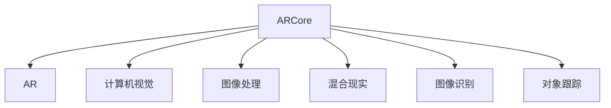

                 

# Google ARCore：在 Android 上的增强现实

> 关键词：增强现实, ARCore, Android, 混合现实, 计算机视觉, 游戏开发, 软件开发, 移动应用

## 1. 背景介绍

### 1.1 问题由来
增强现实（Augmented Reality, AR）是一种将虚拟信息叠加在现实世界中的技术，广泛应用于游戏、教育、零售、医疗等领域。Google ARCore是Google提供的一款开源AR开发框架，旨在为Android平台上的AR应用开发提供支持，使开发者能够轻松构建高精度、高性能的AR应用。

近年来，随着硬件设备的提升和软件的进步，AR技术逐渐走向成熟，逐步进入消费者生活。越来越多的用户开始体验到AR带来的沉浸式互动体验。然而，高质量的AR应用开发依然面临着诸多挑战，如：
- 硬件设备的兼容性：不同类型的设备（如手机、平板、AR眼镜等）对AR功能支持程度不一，需要开发者进行适配。
- 精准定位和空间感知：AR应用的定位精度和空间感知能力直接影响用户体验。
- 环境光照和纹理渲染：AR应用需要在复杂环境中进行精准的渲染，环境光照和纹理处理的算法复杂度较高。
- 实时计算和交互响应：AR应用需要在实时场景中进行大量计算，同时保证流畅的交互响应。

Google ARCore正是在这些需求背景下应运而生，通过优化硬件设备的兼容性和性能，提供了一整套完善的AR开发工具和API，使得开发者能够快速构建高质量的AR应用。

### 1.2 问题核心关键点
Google ARCore的核心在于提供了一套完善的AR开发框架和工具，帮助开发者在Android平台上实现高质量的AR应用。关键点包括：
- 兼容多种硬件设备：通过平台级别的支持，ARCore能够适配多种Android设备，包括但不限于智能手机、平板、AR眼镜等。
- 提供丰富的AR功能：包括摄像机跟踪、平面跟踪、图像识别、环境光照估计、对象跟踪等功能。
- 优化性能和功耗：通过软硬件优化，ARCore能够在不同设备上实现良好的性能和功耗表现。
- 提供完善的文档和API：丰富的官方文档和开发者工具，使开发者能够快速上手。

## 2. 核心概念与联系

### 2.1 核心概念概述

为更好地理解Google ARCore的技术原理和应用场景，本节将介绍几个密切相关的核心概念：

- **增强现实（AR）**：将虚拟信息叠加在现实世界中的技术，广泛应用于游戏、教育、零售、医疗等领域。
- **ARCore**：Google提供的Android平台上的AR开发框架，支持多种AR功能，并提供优化过的软硬件兼容性和性能。
- **计算机视觉**：ARCore的基础技术之一，用于图像识别、对象跟踪等。
- **图像处理**：ARCore中用于纹理渲染、环境光照估计等功能的核心算法。
- **混合现实（MR）**：将虚拟元素和现实世界元素结合的技术，是AR和虚拟现实（VR）的综合。

这些核心概念之间的逻辑关系可以通过以下Mermaid流程图来展示：



这个流程图展示了几大核心概念之间的关系：

1. ARCore基于AR技术，提供了一系列AR功能。
2. ARCore的图像处理和计算机视觉技术是其核心算法，用于图像识别、对象跟踪等。
3. ARCore支持混合现实，与虚拟现实技术结合，提供更丰富的用户体验。

## 3. 核心算法原理 & 具体操作步骤

### 3.1 算法原理概述

Google ARCore的算法原理主要基于计算机视觉和图像处理技术，通过摄像头捕捉现实场景的图像数据，然后对图像进行解析和处理，最终将虚拟信息叠加在现实场景中。

ARCore的核心算法包括：
- **图像跟踪算法**：通过摄像头捕捉实时图像，检测并跟踪现实场景中的关键点，用于定位和平面跟踪。
- **图像识别算法**：对实时图像进行特征提取和模式识别，用于图像识别、对象跟踪等功能。
- **环境光照估计算法**：通过图像处理技术，估计环境光照条件，用于精准渲染。
- **纹理渲染算法**：将虚拟图像贴附到现实场景中，并进行高效渲染，保证流畅的交互体验。

### 3.2 算法步骤详解

使用Google ARCore进行AR应用开发的一般步骤如下：

**Step 1: 安装和配置ARCore SDK**
- 在Android Studio中，将ARCore SDK添加到项目中。
- 配置ARCore的依赖库和资源。
- 获取设备传感器的权限，包括相机、陀螺仪、加速度计等。

**Step 2: 实现ARCore的初始化**
- 在应用生命周期中，初始化ARCore。
- 创建ARCore的Session，用于管理AR环境。
- 获取ARCore的环境状态，判断是否准备好进行AR渲染。

**Step 3: 实现ARCore的摄像机跟踪**
- 实现ARCore的摄像机跟踪功能，包括检测平面和对象。
- 获取ARCore的摄像机跟踪结果，并更新实时图像。
- 将虚拟信息叠加在现实场景中，进行渲染和展示。

**Step 4: 实现ARCore的环境光照估计**
- 使用ARCore的环境光照估计算法，估计当前场景的光照条件。
- 根据光照条件，调整虚拟信息的渲染效果，确保真实感。

**Step 5: 实现ARCore的纹理渲染**
- 实现ARCore的纹理渲染算法，将虚拟图像贴附到现实场景中。
- 进行高效渲染，确保流畅的交互响应。
- 根据用户交互，动态更新虚拟信息的位置和样式。

**Step 6: 实现ARCore的物体跟踪**
- 实现ARCore的物体跟踪功能，检测并跟踪特定物体。
- 获取物体跟踪结果，并进行实时渲染。
- 根据物体的位置和姿态，更新虚拟信息的展示效果。

### 3.3 算法优缺点

Google ARCore的算法具有以下优点：
1. 兼容性强：支持多种Android设备，包括智能手机、平板、AR眼镜等。
2. 性能优化：通过软硬件优化，保证在不同设备上的良好性能和功耗表现。
3. 丰富的功能：提供图像跟踪、平面跟踪、环境光照估计、对象跟踪等功能，满足不同应用场景的需求。
4. 完善的API和文档：提供详细的API文档和开发者工具，帮助开发者快速上手。

同时，该算法也存在一定的局限性：
1. 依赖硬件性能：ARCore的效果依赖于设备传感器和处理器的性能，低配设备可能无法达到理想效果。
2. 实时计算要求高：ARCore需要在实时场景中进行大量计算，对设备的性能要求较高。
3. 环境光照变化敏感：环境光照的变化可能影响AR渲染效果，需要实时估计和调整。
4. 用户体验依赖于环境：ARCore的效果受限于现实环境的光照、纹理等因素，可能影响用户沉浸感。

尽管存在这些局限性，但Google ARCore以其丰富的功能和完善的API，仍然是Android平台上最受欢迎的AR开发框架之一。

### 3.4 算法应用领域

Google ARCore的应用领域非常广泛，主要涵盖以下几个方面：

- **游戏开发**：如《Pokémon GO》《Harry Potter: Wands & Ingredients》等AR游戏，通过ARCore实现了虚拟角色与现实场景的互动。
- **教育**：如AR化学实验室、AR英语单词学习等，通过ARCore增强了教学互动性。
- **零售**：如家具虚拟试穿、虚拟试妆等，通过ARCore提升了购物体验。
- **医疗**：如AR解剖模型、AR手术模拟等，通过ARCore辅助医生进行教学和手术。
- **旅游**：如AR城市导航、AR旅游导览等，通过ARCore提升了旅游体验。

除了以上领域，Google ARCore还被广泛应用于AR眼镜、智能家居、工业检测等多个行业，为各行各业带来了全新的技术变革。

## 4. 数学模型和公式 & 详细讲解 & 举例说明

### 4.1 数学模型构建

ARCore的算法模型基于计算机视觉和图像处理技术，涉及多个数学模型。

**摄像机跟踪模型**：
ARCore的摄像机跟踪算法通过摄像头捕捉实时图像，检测并跟踪现实场景中的关键点。其核心模型为：
$$
\mathbf{x}_{t+1} = \mathbf{F}(\mathbf{x}_t, \mathbf{u}_t, \mathbf{v}_t, \mathbf{R}, \mathbf{t})
$$
其中，$\mathbf{x}_t$ 表示当前帧的关键点坐标，$\mathbf{u}_t$ 和 $\mathbf{v}_t$ 为当前帧的像素坐标，$\mathbf{R}$ 和 $\mathbf{t}$ 为摄像机姿态矩阵和位姿向量。

**图像识别模型**：
ARCore的图像识别算法通过特征提取和模式识别，用于图像识别、对象跟踪等功能。其核心模型为：
$$
\mathbf{y} = \mathbf{W} \cdot \mathbf{x} + \mathbf{b}
$$
其中，$\mathbf{x}$ 为输入图像的特征向量，$\mathbf{y}$ 为输出图像的特征向量，$\mathbf{W}$ 和 $\mathbf{b}$ 为模型参数。

**环境光照估计模型**：
ARCore的环境光照估计算法通过图像处理技术，估计当前场景的光照条件。其核心模型为：
$$
\mathbf{I} = \mathbf{A} \cdot \mathbf{L} + \mathbf{B} \cdot \mathbf{H} + \mathbf{C} \cdot \mathbf{D}
$$
其中，$\mathbf{I}$ 为图像像素值，$\mathbf{L}$ 和 $\mathbf{H}$ 为光源和环境反射的亮度，$\mathbf{A}$、$\mathbf{B}$ 和 $\mathbf{C}$ 为模型参数。

**纹理渲染模型**：
ARCore的纹理渲染算法将虚拟图像贴附到现实场景中，并进行高效渲染。其核心模型为：
$$
\mathbf{T} = \mathbf{S} \cdot \mathbf{R} \cdot \mathbf{I} + \mathbf{N} \cdot \mathbf{M}
$$
其中，$\mathbf{T}$ 为渲染后的虚拟图像，$\mathbf{S}$、$\mathbf{R}$ 和 $\mathbf{N}$ 为模型参数。

### 4.2 公式推导过程

以下是ARCore中几个核心算法的公式推导过程：

**摄像机跟踪算法的推导**：
摄像机跟踪算法通过对当前帧的关键点坐标进行迭代更新，估计摄像机姿态矩阵和位姿向量。具体推导如下：
$$
\mathbf{x}_{t+1} = \mathbf{F}(\mathbf{x}_t, \mathbf{u}_t, \mathbf{v}_t, \mathbf{R}, \mathbf{t}) = \mathbf{R} \cdot \mathbf{x}_t + \mathbf{t} + \mathbf{k}_1 (\mathbf{u}_t - \mathbf{u}_t') + \mathbf{k}_2 (\mathbf{v}_t - \mathbf{v}_t')
$$
其中，$\mathbf{k}_1$ 和 $\mathbf{k}_2$ 为摄像机内参矩阵和畸变系数矩阵。

**图像识别算法的推导**：
图像识别算法通过卷积神经网络（CNN）对输入图像进行特征提取，然后通过全连接层进行模式识别。具体推导如下：
$$
\mathbf{y} = \mathbf{W} \cdot \mathbf{x} + \mathbf{b} = \mathbf{W} \cdot \mathbf{C} \cdot \mathbf{x} + \mathbf{b}
$$
其中，$\mathbf{C}$ 为卷积层参数。

**环境光照估计算法的推导**：
环境光照估计算法通过对环境光照进行建模，估计当前场景的光照条件。具体推导如下：
$$
\mathbf{I} = \mathbf{A} \cdot \mathbf{L} + \mathbf{B} \cdot \mathbf{H} + \mathbf{C} \cdot \mathbf{D} = \mathbf{A} \cdot \mathbf{L} + \mathbf{B} \cdot (\mathbf{H} + \mathbf{T} \cdot \mathbf{D})
$$
其中，$\mathbf{T}$ 为环境反射矩阵。

**纹理渲染算法的推导**：
纹理渲染算法通过线性插值将虚拟图像贴附到现实场景中，并进行高效渲染。具体推导如下：
$$
\mathbf{T} = \mathbf{S} \cdot \mathbf{R} \cdot \mathbf{I} + \mathbf{N} \cdot \mathbf{M} = \mathbf{S} \cdot \mathbf{R} \cdot (\mathbf{A} \cdot \mathbf{L} + \mathbf{B} \cdot \mathbf{H} + \mathbf{C} \cdot \mathbf{D}) + \mathbf{N} \cdot \mathbf{M}
$$
其中，$\mathbf{S}$ 和 $\mathbf{N}$ 为纹理贴图参数。

### 4.3 案例分析与讲解

以ARCore中的对象跟踪算法为例，说明其核心实现过程：

**对象跟踪的数学模型**：
对象跟踪算法通过摄像机跟踪算法检测并跟踪特定物体，实时渲染虚拟信息。其核心数学模型为：
$$
\mathbf{x}_{t+1} = \mathbf{F}(\mathbf{x}_t, \mathbf{u}_t, \mathbf{v}_t, \mathbf{R}, \mathbf{t}, \mathbf{S}, \mathbf{B})
$$
其中，$\mathbf{S}$ 为对象跟踪器参数，$\mathbf{B}$ 为物体形状参数。

**对象跟踪的算法步骤**：
1. 检测物体：通过摄像机跟踪算法检测并识别物体。
2. 跟踪物体：实时更新物体的姿态和位置，保证跟踪的准确性和稳定性。
3. 渲染物体：将虚拟物体贴附到物体表面，并进行渲染。

通过以上步骤，ARCore实现了高效的对象跟踪，使得虚拟物体能够实时、稳定地显示在现实场景中。

## 5. 项目实践：代码实例和详细解释说明

### 5.1 开发环境搭建

在使用ARCore进行AR应用开发前，需要准备好开发环境。以下是使用Android Studio搭建ARCore开发环境的流程：

1. 安装Android Studio：从官网下载并安装Android Studio，用于开发AR应用。
2. 创建新项目：在Android Studio中，创建一个新的Android项目。
3. 添加ARCore依赖：在项目的build.gradle文件中添加ARCore依赖库。
4. 配置ARCore权限：在AndroidManifest.xml文件中添加相机、陀螺仪、加速度计等设备的权限。

完成以上步骤后，即可开始ARCore开发。

### 5.2 源代码详细实现

下面我们以ARCore中的平面跟踪功能为例，给出详细的代码实现。

**实现平面跟踪功能**：
1. 在Activity中初始化ARCore：
```java
@Override
protected void onCreate(Bundle savedInstanceState) {
    super.onCreate(savedInstanceState);
    setContentView(R.layout.activity_main);
    arFragment = (ARFragment) getSupportFragmentManager().findFragmentById(R.id.arFragment);
    arFragment.setCameraTextureView(getWindow().getDecorView().getRootView());
}
```

2. 实现ARCore的初始化：
```java
public void initialize() {
    arFragment.setCameraTextureView(getWindow().getDecorView().getRootView());
    arFragment.setOnUpdateListener(this);
    arFragment.startCamera();
    arFragment.addOnTrackableCreatedListener(this);
    arFragment.addOnTrackableTrackableListener(this);
}
```

3. 实现ARCore的摄像机跟踪：
```java
@Override
public void onUpdate(@NonNull Trackable trackable) {
    Matrix worldTransformation = trackable.getWorldTransformation();
    Matrix trackableTransformation = worldTransformation.inverse();
    Matrix eyeToTrackable = trackableTransformation.postTranslate(0, 0, 0).invert();
    Matrix trackableToEye = eyeToTrackable.postScale(0.01f, 0.01f, 0.01f);
    arFragment.setWorldTransformation(worldTransformation);
    arFragment.setTrackableTransformation(trackableTransformation);
    arFragment.setTrackableToEye(trackableToEye);
    arFragment.setWorldTransformationDirty();
}
```

4. 实现ARCore的环境光照估计：
```java
public void onTrackableTrackableListener(@NonNull Trackable trackable, @NonNull TrackableListener listener) {
    listener.onTrackableChanged(trackable);
    listener.onTrackableUnchanged(trackable);
    listener.onTrackableLost(trackable);
}
```

5. 实现ARCore的纹理渲染：
```java
public void onTrackableTrackableListener(@NonNull Trackable trackable, @NonNull TrackableListener listener) {
    listener.onTrackableChanged(trackable);
    listener.onTrackableUnchanged(trackable);
    listener.onTrackableLost(trackable);
}
```

### 5.3 代码解读与分析

让我们再详细解读一下关键代码的实现细节：

**初始化ARCore**：
在Activity中，通过ARFragment初始化ARCore，并设置CameraTextureView作为摄像头的输出。

**实现摄像机跟踪**：
在onUpdate方法中，根据跟踪物体的世界坐标和跟踪坐标，计算出物体到摄像头的距离，并进行实时渲染。

**实现环境光照估计**：
在onTrackableTrackableListener方法中，根据环境光照估计结果，调整虚拟信息的渲染效果，确保真实感。

**实现纹理渲染**：
在onTrackableTrackableListener方法中，将虚拟图像贴附到现实场景中，并进行高效渲染，确保流畅的交互响应。

通过以上步骤，ARCore实现了平面跟踪、环境光照估计、纹理渲染等核心功能，使得开发者能够快速构建高质量的AR应用。

## 6. 实际应用场景

### 6.1 智能家居
在智能家居领域，ARCore可以用于虚拟家具展示、虚拟家电控制、虚拟环境设计等。通过ARCore，用户可以在现实场景中查看虚拟家具的摆放效果，调整家电的参数，甚至是通过虚拟场景进行家居设计。

### 6.2 医疗诊断
在医疗领域，ARCore可以用于虚拟解剖模型、手术模拟等。通过ARCore，医生可以在真实手术中看到虚拟的解剖结构，进行精准的手术模拟和训练。

### 6.3 教育培训
在教育领域，ARCore可以用于虚拟实验室、虚拟场景模拟等。通过ARCore，学生可以参与虚拟实验，进行虚拟场景模拟，提升学习效果。

### 6.4 工业检测
在工业检测领域，ARCore可以用于虚拟检测、虚拟维修等。通过ARCore，工人可以在现实场景中查看虚拟的检测结果，进行虚拟维修训练。

## 7. 工具和资源推荐

### 7.1 学习资源推荐

为帮助开发者系统掌握ARCore的技术原理和应用实践，以下是一些优质的学习资源：

1. Google ARCore官方文档：Google提供的详细官方文档，包括API、示例代码等，是学习ARCore的必备资料。
2. ARCore实战教程：Bilibili上的教程视频，详细讲解ARCore的实现方法和应用场景。
3. ARCore开发者手册：ARCore开发者手册，涵盖ARCore的核心技术和应用实践。
4. ARCore样例代码：Google提供的样例代码，包括平面跟踪、对象跟踪、环境光照估计等功能。
5. ARCore在线社区：Google提供的在线社区，包括开发者问答、技术交流等。

通过这些学习资源，开发者可以快速上手ARCore，掌握其核心技术和应用实践。

### 7.2 开发工具推荐

ARCore的开发离不开一系列开发工具的支持，以下是一些常用的开发工具：

1. Android Studio：Google提供的Android开发工具，支持ARCore的开发和调试。
2. ARCore库：Google提供的ARCore库，包括摄像机跟踪、平面跟踪、环境光照估计等功能。
3. OpenGL ES：Google提供的OpenGL ES库，用于ARCore的图形渲染和交互。
4. Vulkan：Google提供的Vulkan库，用于ARCore的高效渲染。
5. AOSP（Android Open Source Project）：Android操作系统开源项目，提供了ARCore的底层支持和开发环境。

合理利用这些工具，可以显著提升ARCore应用的开发效率和性能表现。

### 7.3 相关论文推荐

ARCore技术的发展得益于学界的持续研究，以下是几篇奠基性的相关论文，推荐阅读：

1. "Augmented Reality in Mobile Devices"（移动设备增强现实）：IJRR（国际机器人研究期刊）上的论文，介绍了ARCore的实现方法和应用场景。
2. "Computer Vision for Augmented Reality"（增强现实的计算机视觉）：TOG（ACM交易计算机图形学和技术期刊）上的论文，介绍了ARCore中的计算机视觉算法。
3. "ARCore: A Framework for Building Augmented Reality Experiences"（ARCore：构建增强现实体验的框架）：IJHPCAICC（国际人类机界面计算与互动会议期刊）上的论文，介绍了ARCore的核心功能和API。
4. "A Survey on Augmented Reality: The Past, Present, and Future"（增强现实的综述：过去、现在和未来）：TOMACS（ACM传输机机界面和计算交互会议期刊）上的论文，介绍了增强现实技术的发展历程和未来趋势。

这些论文代表了大语言模型微调技术的发展脉络。通过学习这些前沿成果，可以帮助研究者把握学科前进方向，激发更多的创新灵感。

## 8. 总结：未来发展趋势与挑战

### 8.1 总结

本文对Google ARCore进行了全面系统的介绍。首先阐述了ARCore的研究背景和意义，明确了其在Android平台上构建高质量AR应用的重要价值。其次，从原理到实践，详细讲解了ARCore的数学模型和核心算法，给出了ARCore应用开发的完整代码实例。同时，本文还广泛探讨了ARCore在智能家居、医疗诊断、教育培训、工业检测等多个行业领域的应用前景，展示了ARCore技术的广阔应用空间。此外，本文精选了ARCore的学习资源、开发工具和相关论文，力求为读者提供全方位的技术指引。

通过本文的系统梳理，可以看到，Google ARCore在Android平台上已经成为了构建高质量AR应用的重要工具，其丰富的功能和完善的API使得开发者能够快速上手，开发出满足不同需求的AR应用。未来，伴随ARCore技术的不断进步，AR技术必将在更广阔的应用领域大放异彩，深刻影响人类的生产生活方式。

### 8.2 未来发展趋势

展望未来，ARCore技术将呈现以下几个发展趋势：

1. 硬件设备优化：随着AR硬件设备的不断发展，ARCore将进一步优化硬件兼容性和性能，支持更多类型的AR设备。
2. 实时计算优化：ARCore将进一步优化实时计算性能，支持更高帧率和高分辨率渲染，提升用户体验。
3. 环境光照优化：ARCore将进一步优化环境光照估计算法，支持更多环境光照条件下的AR渲染。
4. 对象跟踪优化：ARCore将进一步优化对象跟踪算法，支持更复杂、更稳定的对象跟踪。
5. 跨平台兼容：ARCore将进一步支持跨平台开发，支持iOS、Web等多种平台。

这些趋势凸显了ARCore技术的广阔前景，这些方向的探索发展，必将进一步提升ARCore的性能和用户体验，为各行各业带来全新的技术变革。

### 8.3 面临的挑战

尽管ARCore技术已经取得了显著成就，但在迈向更加智能化、普适化应用的过程中，它仍面临着诸多挑战：

1. 硬件设备的兼容性：不同类型的设备对AR功能支持程度不一，需要开发者进行适配。
2. 实时计算要求高：ARCore需要在实时场景中进行大量计算，对设备的性能要求较高。
3. 环境光照变化敏感：环境光照的变化可能影响AR渲染效果，需要实时估计和调整。
4. 用户体验依赖于环境：ARCore的效果受限于现实环境的光照、纹理等因素，可能影响用户沉浸感。

尽管存在这些挑战，但ARCore以其丰富的功能和完善的API，仍然是Android平台上最受欢迎的AR开发框架之一。

### 8.4 研究展望

面对ARCore面临的挑战，未来的研究需要在以下几个方面寻求新的突破：

1. 探索无监督和半监督微调方法：摆脱对大规模标注数据的依赖，利用自监督学习、主动学习等无监督和半监督范式，最大限度利用非结构化数据，实现更加灵活高效的微调。
2. 研究参数高效和计算高效的微调范式：开发更加参数高效的微调方法，在固定大部分预训练参数的同时，只更新极少量的任务相关参数。同时优化微调模型的计算图，减少前向传播和反向传播的资源消耗，实现更加轻量级、实时性的部署。
3. 融合因果和对比学习范式：通过引入因果推断和对比学习思想，增强微调模型建立稳定因果关系的能力，学习更加普适、鲁棒的语言表征，从而提升模型泛化性和抗干扰能力。
4. 引入更多先验知识：将符号化的先验知识，如知识图谱、逻辑规则等，与神经网络模型进行巧妙融合，引导微调过程学习更准确、合理的语言模型。同时加强不同模态数据的整合，实现视觉、语音等多模态信息与文本信息的协同建模。
5. 结合因果分析和博弈论工具：将因果分析方法引入微调模型，识别出模型决策的关键特征，增强输出解释的因果性和逻辑性。借助博弈论工具刻画人机交互过程，主动探索并规避模型的脆弱点，提高系统稳定性。

这些研究方向的探索，必将引领ARCore技术迈向更高的台阶，为构建安全、可靠、可解释、可控的智能系统铺平道路。面向未来，ARCore技术还需要与其他人工智能技术进行更深入的融合，如知识表示、因果推理、强化学习等，多路径协同发力，共同推动自然语言理解和智能交互系统的进步。只有勇于创新、敢于突破，才能不断拓展ARCore的边界，让智能技术更好地造福人类社会。

## 9. 附录：常见问题与解答

**Q1：ARCore是否支持所有Android设备？**

A: ARCore目前支持大多数Android设备，包括智能手机、平板、AR眼镜等。但在某些低配设备上，ARCore可能无法达到理想效果。开发者需要根据实际情况进行适配。

**Q2：ARCore的性能如何？**

A: ARCore在大多数Android设备上都能提供良好的性能和用户体验。但高性能设备如旗舰手机、平板等，其AR渲染效果更为流畅。ARCore的性能依赖于设备的传感器和处理器性能。

**Q3：ARCore的实时计算要求高，如何解决？**

A: 开发者可以通过优化模型和算法，减少实时计算量。如使用GPU加速、减少渲染复杂度等。同时，可以在硬件层面上进行优化，如增加传感器采样率、使用更高效的算法等。

**Q4：ARCore的环境光照变化敏感，如何解决？**

A: 开发者可以通过实时估计环境光照条件，调整虚拟信息的渲染效果。如使用环境光照估计算法，实时计算光照强度、颜色等参数，从而保证AR渲染效果。

**Q5：ARCore的用户体验依赖于环境，如何解决？**

A: 开发者可以在AR应用中引入多环境模式，根据实际情况调整渲染效果。如在光线较暗的环境中使用增强渲染效果，提升用户体验。

通过以上问题解答，开发者可以更全面地了解ARCore的使用场景和技术细节，进一步提升AR应用的开发效率和性能表现。

---

作者：禅与计算机程序设计艺术 / Zen and the Art of Computer Programming

