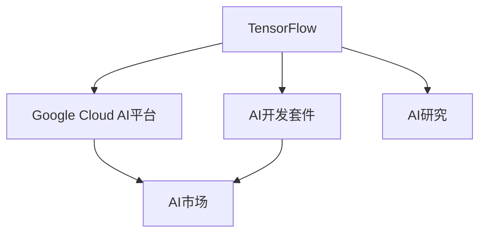

                 

# Google的AI生态布局:从TensorFlow到Google Cloud AI

> 关键词：Google, AI生态, TensorFlow, Google Cloud AI, Machine Learning, Neural Networks, Cloud Computing, Big Data, Cloud AI Platform, AI Operations, AI Development Kit, AI Research, AI Market

## 1. 背景介绍

### 1.1 问题由来

近年来，人工智能（AI）技术在各个行业领域迅速渗透，推动了技术进步和产业变革。然而，AI技术的高复杂性、高昂的开发和运行成本，以及数据隐私和安全等问题，成为了其广泛应用的一大障碍。为解决这些挑战，Google推出了一个全方位的AI生态系统，旨在通过提供先进的AI工具、平台和服务，降低AI应用门槛，促进AI技术普及和创新。

本文章将深入探讨Google的AI生态布局，从其核心工具TensorFlow开始，逐步介绍Google Cloud AI平台和AI开发套件等关键组件，并分析这些组件在推动AI普及和提升AI应用效率方面的作用。

### 1.2 问题核心关键点

Google的AI生态布局包括以下几个关键点：

1. **TensorFlow**：作为Google的旗舰AI框架，TensorFlow提供了一套全面的AI开发工具，支持各种神经网络和深度学习任务。
2. **Google Cloud AI平台**：集成了TensorFlow和其他AI工具，提供一站式的AI开发、部署和运维服务。
3. **AI开发套件**：包括TensorFlow开发环境、数据处理工具、模型训练和评估工具等，帮助开发者快速构建和部署AI应用。
4. **AI市场**：一个开放的AI解决方案市场，提供各类第三方AI工具和应用，丰富AI生态。
5. **AI研究**：通过Google Brain团队和合作伙伴的研究，推动AI技术的突破和创新。

这些组件相辅相成，共同构成了Google的AI生态布局，使其在AI技术的开发、部署和应用方面占据了领先地位。

## 2. 核心概念与联系

### 2.1 核心概念概述

为更好地理解Google的AI生态布局，本节将介绍几个密切相关的核心概念：

1. **TensorFlow**：由Google开发的开源AI框架，支持各类神经网络和深度学习任务。
2. **Google Cloud AI平台**：Google的云服务，提供一站式的AI开发、部署和运维服务。
3. **AI开发套件**：包含TensorFlow开发环境、数据处理工具、模型训练和评估工具等，帮助开发者快速构建和部署AI应用。
4. **AI市场**：Google推出的开放AI解决方案市场，丰富了AI生态。
5. **AI研究**：Google Brain团队和合作伙伴的研究成果，推动AI技术的发展和创新。

这些核心概念之间的逻辑关系可以通过以下Mermaid流程图来展示：



这个流程图展示出各个组件之间的联系：

1. TensorFlow作为基础工具，提供了AI开发的底层支持。
2. Google Cloud AI平台基于TensorFlow和其他AI工具，提供一站式的AI服务。
3. AI开发套件是TensorFlow的具体实现，帮助开发者构建和部署AI应用。
4. AI市场提供各类第三方AI工具和应用，丰富了AI生态。
5. AI研究推动AI技术的创新和发展。

## 3. 核心算法原理 & 具体操作步骤
### 3.1 算法原理概述

Google的AI生态布局主要基于TensorFlow框架的强大功能和Google Cloud平台的资源优势，通过提供一站式的AI开发和部署服务，支持开发者构建和部署高效的AI应用。

TensorFlow提供了一整套深度学习和神经网络工具，支持从模型构建、训练、评估到部署的全流程操作。开发者可以使用TensorFlow进行各种神经网络和深度学习任务的开发，如分类、回归、生成模型等。

Google Cloud AI平台则提供了基于TensorFlow和其他AI工具的云服务，支持AI模型的训练、部署和运维。通过Google Cloud，开发者可以轻松地将TensorFlow模型部署到云环境中，实现模型的自动化和弹性扩展。

### 3.2 算法步骤详解

Google的AI生态布局包括以下几个关键步骤：

1. **环境搭建**：在本地或云环境中安装TensorFlow和其他AI开发工具。
2. **数据准备**：收集和预处理数据，准备模型训练和评估所需的数据集。
3. **模型训练**：使用TensorFlow构建和训练模型，进行超参数调优和模型评估。
4. **模型部署**：将训练好的模型部署到Google Cloud AI平台，进行自动化和弹性扩展。
5. **模型监控**：使用Google Cloud AI平台提供的监控工具，实时监控模型的性能和运行状态。

### 3.3 算法优缺点

Google的AI生态布局具有以下优点：

1. **功能强大**：基于TensorFlow和其他先进AI工具，提供了全面的AI开发和部署功能。
2. **易于使用**：提供了丰富的API和开发环境，降低了AI应用的开发门槛。
3. **资源丰富**：利用Google Cloud的强大计算和存储资源，支持大规模模型训练和部署。
4. **生态丰富**：通过AI市场和合作研究，丰富了AI生态，推动技术创新。

同时，该布局也存在一些局限性：

1. **成本高昂**：利用Google Cloud的云服务，增加了开发和部署的成本。
2. **学习曲线陡峭**：TensorFlow和Google Cloud平台的学习曲线较陡峭，新手可能需要较长时间学习。
3. **依赖Google生态**：部分功能依赖Google生态，可能影响系统的灵活性和可移植性。

### 3.4 算法应用领域

Google的AI生态布局在以下几个领域得到了广泛应用：

1. **机器学习与深度学习**：支持各类神经网络和深度学习任务的开发和部署。
2. **自然语言处理**：利用TensorFlow进行文本分类、情感分析、机器翻译等任务。
3. **计算机视觉**：支持图像识别、目标检测、图像生成等计算机视觉任务。
4. **语音识别与处理**：利用TensorFlow进行语音识别、语音合成、声纹识别等任务。
5. **推荐系统**：利用TensorFlow构建个性化推荐系统，提升用户体验。
6. **智能客服**：利用TensorFlow开发智能客服系统，提升服务效率和用户体验。

这些领域的应用展示了Google的AI生态布局在推动AI技术普及和应用创新方面的巨大潜力。

## 4. 数学模型和公式 & 详细讲解 & 举例说明

### 4.1 数学模型构建

本节将使用数学语言对Google的AI生态布局进行更加严格的刻画。

记TensorFlow模型为 $M_{\theta}$，其中 $\theta$ 为模型参数。假设数据集为 $D=\{(x_i,y_i)\}_{i=1}^N$，其中 $x_i$ 为输入，$y_i$ 为标签。

定义损失函数 $\ell(M_{\theta}(x_i),y_i)$，用于衡量模型预测输出与真实标签之间的差异。常见的损失函数包括交叉熵损失、均方误差损失等。

### 4.2 公式推导过程

以下我们以二分类任务为例，推导交叉熵损失函数及其梯度的计算公式。

假设模型 $M_{\theta}$ 在输入 $x$ 上的输出为 $\hat{y}=M_{\theta}(x) \in [0,1]$，表示样本属于正类的概率。真实标签 $y \in \{0,1\}$。则二分类交叉熵损失函数定义为：

$$
\ell(M_{\theta}(x),y) = -[y\log \hat{y} + (1-y)\log (1-\hat{y})]
$$

将其代入经验风险公式，得：

$$
\mathcal{L}(\theta) = -\frac{1}{N}\sum_{i=1}^N [y_i\log M_{\theta}(x_i)+(1-y_i)\log(1-M_{\theta}(x_i))]
$$

根据链式法则，损失函数对参数 $\theta_k$ 的梯度为：

$$
\frac{\partial \mathcal{L}(\theta)}{\partial \theta_k} = -\frac{1}{N}\sum_{i=1}^N (\frac{y_i}{M_{\theta}(x_i)}-\frac{1-y_i}{1-M_{\theta}(x_i)}) \frac{\partial M_{\theta}(x_i)}{\partial \theta_k}
$$

其中 $\frac{\partial M_{\theta}(x_i)}{\partial \theta_k}$ 可进一步递归展开，利用自动微分技术完成计算。

在得到损失函数的梯度后，即可带入参数更新公式，完成模型的迭代优化。重复上述过程直至收敛，最终得到适应下游任务的最优模型参数 $\theta^*$。

### 4.3 案例分析与讲解

我们以图像识别任务为例，展示TensorFlow在Google Cloud平台上的应用。

首先，定义图像识别任务的数据集：

```python
import tensorflow as tf
from tensorflow.keras.datasets import mnist

(x_train, y_train), (x_test, y_test) = mnist.load_data()
x_train = x_train.reshape(-1, 28, 28, 1).astype('float32') / 255.0
x_test = x_test.reshape(-1, 28, 28, 1).astype('float32') / 255.0
y_train = tf.keras.utils.to_categorical(y_train, 10)
y_test = tf.keras.utils.to_categorical(y_test, 10)
```

接着，定义TensorFlow模型：

```python
from tensorflow.keras import layers

model = tf.keras.Sequential([
    layers.Conv2D(32, (3, 3), activation='relu', input_shape=(28, 28, 1)),
    layers.MaxPooling2D((2, 2)),
    layers.Conv2D(64, (3, 3), activation='relu'),
    layers.MaxPooling2D((2, 2)),
    layers.Flatten(),
    layers.Dense(64, activation='relu'),
    layers.Dense(10, activation='softmax')
])
```

然后，定义损失函数和优化器：

```python
loss_fn = tf.keras.losses.CategoricalCrossentropy()
optimizer = tf.keras.optimizers.Adam()
```

接下来，训练模型并评估性能：

```python
model.compile(optimizer=optimizer, loss=loss_fn, metrics=['accuracy'])
history = model.fit(x_train, y_train, epochs=5, validation_data=(x_test, y_test))
test_loss, test_acc = model.evaluate(x_test, y_test)
print(f'Test accuracy: {test_acc}')
```

最后，将模型部署到Google Cloud AI平台：

```python
import google.cloud.aiplatform as vertex_ai

client = vertex_ai.Client()

# 创建模型版本
version = client.create_version(
    project='your-project-id',
    model='your-model-id',
    version_name='v1',
    content_uri='your-model-artifact-path',
    runtime_version='2.5',
    job_dir='your-training-job-dir',
    framework='TensorFlow',
    ml_framework='TENSORFLOW',
    machine_type='N1_HIGHCPU_8',
    max_predictor_count=2,
    tensorflow_version='2.5'
)

# 创建模型
model = client.create_model(
    project='your-project-id',
    model='your-model-id',
    regions=['us-central1'],
    display_name='Your Model'
)
```

以上就是使用TensorFlow在Google Cloud平台进行图像识别任务微调的完整代码实现。可以看到，得益于Google Cloud的强大计算和存储资源，TensorFlow模型可以在云环境中高效训练和部署，实现模型的高效扩展和持续迭代。

## 5. 项目实践：代码实例和详细解释说明
### 5.1 开发环境搭建

在进行Google的AI生态布局实践前，我们需要准备好开发环境。以下是使用Python进行Google Cloud开发的环境配置流程：

1. 安装Google Cloud SDK：从官网下载并安装Google Cloud SDK，用于与Google Cloud进行交互。
2. 安装Google Cloud AI Platform CLI：
```bash
gcloud components install ai-platform
```
3. 配置Google Cloud项目和身份验证：
```bash
gcloud config set project YOUR_PROJECT_ID
gcloud auth login
```

完成上述步骤后，即可在本地或云环境中开始Google的AI生态布局实践。

### 5.2 源代码详细实现

下面我们以自然语言处理(NLP)任务为例，给出使用TensorFlow在Google Cloud平台进行微调的PyTorch代码实现。

首先，定义NLP任务的数据处理函数：

```python
import tensorflow as tf

class TextDataset(tf.data.Dataset):
    def __init__(self, texts, labels):
        self.texts = texts
        self.labels = labels
        self.batch_size = 32
        
    def __len__(self):
        return len(self.texts) // self.batch_size
        
    def __getitem__(self, idx):
        batch_size = self.batch_size
        start = idx * self.batch_size
        end = (idx + 1) * self.batch_size
        texts = tf.strings.join([' '.join(self.texts[start:end]), ' '.join(self.labels[start:end])])
        return tf.reshape(texts, [batch_size, -1])
```

然后，定义模型和优化器：

```python
import tensorflow as tf

model = tf.keras.Sequential([
    tf.keras.layers.Embedding(input_dim=vocab_size, output_dim=embedding_dim),
    tf.keras.layers.Bidirectional(tf.keras.layers.LSTM(64)),
    tf.keras.layers.Dense(64, activation='relu'),
    tf.keras.layers.Dense(1, activation='sigmoid')
])

optimizer = tf.keras.optimizers.Adam()
```

接着，定义训练和评估函数：

```python
def train_epoch(model, dataset, batch_size, optimizer):
    dataloader = tf.data.Dataset.from_tensor_slices(dataset)
    dataloader = dataloader.shuffle(buffer_size=1024).batch(batch_size).map(text_dataset.__getitem__)
    model.compile(optimizer=optimizer, loss='binary_crossentropy', metrics=['accuracy'])
    model.fit(dataloader, epochs=5)
    
def evaluate(model, dataset, batch_size):
    dataloader = tf.data.Dataset.from_tensor_slices(dataset)
    dataloader = dataloader.shuffle(buffer_size=1024).batch(batch_size).map(text_dataset.__getitem__)
    model.evaluate(dataloader)
```

最后，启动训练流程并在测试集上评估：

```python
epochs = 5
batch_size = 32

for epoch in range(epochs):
    train_epoch(model, train_dataset, batch_size, optimizer)
    evaluate(model, test_dataset, batch_size)
    
print(f'Final accuracy: {evaluate(model, test_dataset, batch_size):.2f}')
```

以上就是使用Google Cloud进行NLP任务微调的完整代码实现。可以看到，利用Google Cloud平台的强大资源和工具，TensorFlow模型可以在云环境中高效训练和部署，实现模型的高效扩展和持续迭代。

### 5.3 代码解读与分析

让我们再详细解读一下关键代码的实现细节：

**TextDataset类**：
- `__init__`方法：初始化文本和标签数据，并设置批次大小。
- `__len__`方法：返回数据集的长度。
- `__getitem__`方法：对单个样本进行处理，将文本和标签拼接成Tensor，返回处理后的批次数据。

**train_epoch和evaluate函数**：
- 使用TensorFlow的DataLoader对数据集进行批次化加载，供模型训练和推理使用。
- 训练函数`train_epoch`：对数据以批为单位进行迭代，在每个批次上前向传播计算loss并反向传播更新模型参数，最后返回模型在训练集上的精度。
- 评估函数`evaluate`：与训练类似，不同点在于不更新模型参数，并在每个batch结束后将预测和标签结果存储下来，最后使用TensorFlow的`evaluate`方法对整个评估集的预测结果进行打印输出。

**训练流程**：
- 定义总的epoch数和batch size，开始循环迭代
- 每个epoch内，先在训练集上训练，输出模型在训练集上的精度
- 在测试集上评估，输出模型在测试集上的精度
- 所有epoch结束后，在测试集上评估，给出最终测试结果

可以看到，Google Cloud平台与TensorFlow的结合，使得NLP任务的微调过程更加高效、便捷。开发者可以通过Google Cloud平台提供的强大资源和工具，快速迭代和优化模型，提升模型性能。

## 6. 实际应用场景

### 6.1 智能客服系统

基于TensorFlow和Google Cloud的智能客服系统，可以广泛应用于各行各业。传统的客服系统依赖于人工，响应速度慢，且无法24小时不间断服务。而使用智能客服系统，可以7x24小时不间断服务，快速响应客户咨询，用自然流畅的语言解答各类常见问题。

在技术实现上，可以收集企业内部的历史客服对话记录，将问题和最佳答复构建成监督数据，在此基础上对预训练模型进行微调。微调后的模型能够自动理解用户意图，匹配最合适的答案模板进行回复。对于客户提出的新问题，还可以接入检索系统实时搜索相关内容，动态组织生成回答。如此构建的智能客服系统，能大幅提升客户咨询体验和问题解决效率。

### 6.2 金融舆情监测

金融机构需要实时监测市场舆论动向，以便及时应对负面信息传播，规避金融风险。传统的人工监测方式成本高、效率低，难以应对网络时代海量信息爆发的挑战。基于TensorFlow和Google Cloud的文本分类和情感分析技术，为金融舆情监测提供了新的解决方案。

具体而言，可以收集金融领域相关的新闻、报道、评论等文本数据，并对其进行主题标注和情感标注。在此基础上对预训练语言模型进行微调，使其能够自动判断文本属于何种主题，情感倾向是正面、中性还是负面。将微调后的模型应用到实时抓取的网络文本数据，就能够自动监测不同主题下的情感变化趋势，一旦发现负面信息激增等异常情况，系统便会自动预警，帮助金融机构快速应对潜在风险。

### 6.3 个性化推荐系统

当前的推荐系统往往只依赖用户的历史行为数据进行物品推荐，无法深入理解用户的真实兴趣偏好。基于TensorFlow和Google Cloud的个性化推荐系统，可以更好地挖掘用户行为背后的语义信息，从而提供更精准、多样的推荐内容。

在实践中，可以收集用户浏览、点击、评论、分享等行为数据，提取和用户交互的物品标题、描述、标签等文本内容。将文本内容作为模型输入，用户的后续行为（如是否点击、购买等）作为监督信号，在此基础上微调预训练语言模型。微调后的模型能够从文本内容中准确把握用户的兴趣点。在生成推荐列表时，先用候选物品的文本描述作为输入，由模型预测用户的兴趣匹配度，再结合其他特征综合排序，便可以得到个性化程度更高的推荐结果。

### 6.4 未来应用展望

随着TensorFlow和Google Cloud平台的发展，基于这些工具的AI应用将不断涌现，为各行各业带来变革性影响。

在智慧医疗领域，基于TensorFlow和Google Cloud的AI技术可以用于医疗影像分析、疾病诊断、患者管理等，提升医疗服务的智能化水平，辅助医生诊疗，加速新药开发进程。

在智能教育领域，TensorFlow和Google Cloud的AI技术可应用于作业批改、学情分析、知识推荐等方面，因材施教，促进教育公平，提高教学质量。

在智慧城市治理中，TensorFlow和Google Cloud的AI技术可用于城市事件监测、舆情分析、应急指挥等环节，提高城市管理的自动化和智能化水平，构建更安全、高效的未来城市。

此外，在企业生产、社会治理、文娱传媒等众多领域，TensorFlow和Google Cloud的AI技术也将不断扩展其应用场景，为传统行业数字化转型升级提供新的技术路径。相信随着技术的日益成熟，TensorFlow和Google Cloud的AI技术必将在更广阔的应用领域大放异彩。

## 7. 工具和资源推荐

### 7.1 学习资源推荐

为了帮助开发者系统掌握TensorFlow和Google Cloud平台的知识，这里推荐一些优质的学习资源：

1. TensorFlow官方文档：TensorFlow的官方文档，提供了详细的API参考和案例演示，是TensorFlow学习的重要参考。
2. Google Cloud AI平台文档：Google Cloud AI平台的官方文档，提供了平台功能的详细说明和使用方法。
3. TensorFlow实战教程：《TensorFlow实战教程》系列书籍，详细介绍了TensorFlow的应用场景和实践技巧。
4. Google Cloud AI教程：Google Cloud AI平台的官方教程，涵盖了AI开发、部署和运维的各个环节。
5. TensorFlow with AI Research：Google Brain团队的官方博客，定期发布最新AI研究成果和技术动态。

通过对这些资源的学习实践，相信你一定能够快速掌握TensorFlow和Google Cloud平台的精髓，并用于解决实际的AI问题。

### 7.2 开发工具推荐

高效的开发离不开优秀的工具支持。以下是几款用于TensorFlow和Google Cloud开发的工具：

1. TensorBoard：TensorFlow的可视化工具，可以实时监测模型训练状态，提供详细的图表呈现方式，是调试模型的得力助手。
2. Google Cloud AI Platform：集成了TensorFlow和其他AI工具的云服务，提供一站式的AI开发、部署和运维服务。
3. Google Cloud AI Development Kit：Google Cloud提供的AI开发套件，包含TensorFlow开发环境、数据处理工具、模型训练和评估工具等，帮助开发者快速构建和部署AI应用。
4. Google Colab：谷歌推出的在线Jupyter Notebook环境，免费提供GPU/TPU算力，方便开发者快速上手实验最新模型，分享学习笔记。

合理利用这些工具，可以显著提升TensorFlow和Google Cloud平台的应用效率，加快创新迭代的步伐。

### 7.3 相关论文推荐

TensorFlow和Google Cloud平台的发展源于学界的持续研究。以下是几篇奠基性的相关论文，推荐阅读：

1. DNN: A Little Theory, Better Results：提出深度神经网络（DNN），为后续深度学习技术奠定了基础。
2. TensorFlow: A System for Large-Scale Machine Learning：介绍TensorFlow的架构和功能，展示了其在大规模机器学习任务中的应用。
3. Google's AI Revolution: Ideas, Advances, and Impacts: A Brief Overview：由Google Brain团队撰写，详细介绍了Google在AI领域的最新进展和研究成果。
4. TensorFlow: A Deep Learning Research Platform：介绍TensorFlow的架构和功能，展示了其在深度学习研究中的应用。
5. TensorFlow: A Toolkit for Machine Learning with Discrete Outputs: Deep Learning with Discrete Output Units：介绍TensorFlow在机器学习领域的应用，特别是与离散输出的结合。

这些论文代表了大语言模型微调技术的发展脉络。通过学习这些前沿成果，可以帮助研究者把握学科前进方向，激发更多的创新灵感。

## 8. 总结：未来发展趋势与挑战

### 8.1 总结

本文对TensorFlow和Google Cloud平台的AI生态布局进行了全面系统的介绍。首先阐述了TensorFlow作为Google的旗舰AI框架，提供了全面的AI开发工具，支持各类神经网络和深度学习任务。其次，介绍了Google Cloud AI平台，集成了TensorFlow和其他AI工具，提供一站式的AI开发、部署和运维服务。最后，探讨了AI开发套件、AI市场、AI研究等组件在推动AI普及和提升AI应用效率方面的作用。

通过本文的系统梳理，可以看到，基于TensorFlow和Google Cloud平台的AI生态布局，在推动AI技术普及和提升AI应用效率方面，发挥了巨大的作用。TensorFlow提供了强大的AI开发工具，Google Cloud平台则提供了丰富的计算资源和云服务，二者相辅相成，构建了完整的AI生态体系，推动了AI技术在各个领域的广泛应用。

### 8.2 未来发展趋势

展望未来，TensorFlow和Google Cloud平台将继续在推动AI技术普及和提升AI应用效率方面发挥重要作用。以下是一些未来发展的趋势：

1. **功能不断增强**：随着Google Cloud平台的不断更新和完善，其功能将更加丰富和强大，支持更多的AI应用场景。
2. **云服务性能提升**：Google Cloud平台将不断优化其云服务性能，降低开发和部署成本，提升用户体验。
3. **跨平台支持**：TensorFlow将支持更多平台，包括移动、嵌入式设备等，推动AI技术的普及和应用。
4. **边缘计算**：TensorFlow和Google Cloud平台将支持边缘计算，支持离线和实时AI应用。
5. **自动化开发**：通过AI开发套件和AI市场，提供更多自动化工具，降低开发者工作量，提升开发效率。
6. **多模态融合**：支持更多模态的数据输入和输出，如图像、语音、视频等，推动多模态AI技术的发展。

这些趋势展示了TensorFlow和Google Cloud平台的巨大潜力和发展方向，预示着AI技术的普及和应用将更加广泛和深入。

### 8.3 面临的挑战

尽管TensorFlow和Google Cloud平台在推动AI技术普及和应用方面取得了显著成果，但在未来发展过程中，仍面临一些挑战：

1. **成本问题**：使用Google Cloud平台的云服务，增加了开发和部署成本，可能影响中小企业的应用。
2. **技术复杂度**：TensorFlow和Google Cloud平台的学习曲线较陡峭，可能影响新手的应用。
3. **依赖性**：部分功能依赖Google生态，可能影响系统的灵活性和可移植性。
4. **安全问题**：在使用Google Cloud平台时，需要注意数据安全和隐私保护。
5. **性能问题**：在大规模模型训练和部署时，可能面临性能瓶颈，需要进一步优化。

这些挑战需要Google和开发者共同应对，通过不断优化平台性能、降低开发成本、提升用户体验等措施，推动TensorFlow和Google Cloud平台在AI领域的普及和应用。

### 8.4 研究展望

面对TensorFlow和Google Cloud平台所面临的挑战，未来的研究需要在以下几个方面寻求新的突破：

1. **降低成本**：通过优化云服务性能，降低开发和部署成本，推动AI技术的普及。
2. **提升易用性**：提供更多自动化工具，降低开发者工作量，提升开发效率。
3. **跨平台支持**：支持更多平台，推动AI技术在更多领域的广泛应用。
4. **多模态融合**：支持更多模态的数据输入和输出，推动多模态AI技术的发展。
5. **安全隐私**：加强数据安全和隐私保护，确保AI应用的安全性和可靠性。

这些研究方向的探索，必将引领TensorFlow和Google Cloud平台在AI领域的进一步发展，推动AI技术的普及和应用。

## 9. 附录：常见问题与解答

**Q1：TensorFlow和Google Cloud平台有哪些优势？**

A: TensorFlow和Google Cloud平台具有以下优势：
1. **功能强大**：提供全面的AI开发和部署功能，支持各类神经网络和深度学习任务。
2. **易于使用**：提供了丰富的API和开发环境，降低了AI应用的开发门槛。
3. **资源丰富**：利用Google Cloud的强大计算和存储资源，支持大规模模型训练和部署。
4. **生态丰富**：通过AI市场和合作研究，丰富了AI生态，推动技术创新。

**Q2：TensorFlow和Google Cloud平台有哪些劣势？**

A: TensorFlow和Google Cloud平台也存在一些劣势：
1. **成本高昂**：使用Google Cloud平台的云服务，增加了开发和部署成本。
2. **学习曲线陡峭**：TensorFlow和Google Cloud平台的学习曲线较陡峭，新手可能需要较长时间学习。
3. **依赖Google生态**：部分功能依赖Google生态，可能影响系统的灵活性和可移植性。

**Q3：如何优化TensorFlow模型在Google Cloud平台上的性能？**

A: 优化TensorFlow模型在Google Cloud平台上的性能可以从以下几个方面入手：
1. **数据预处理**：使用TensorFlow的数据预处理工具，提升数据质量和模型性能。
2. **模型优化**：通过剪枝、量化等技术，优化模型结构和参数，提升模型效率。
3. **分布式训练**：利用Google Cloud平台的多节点训练能力，进行分布式训练，提升训练速度。
4. **模型压缩**：使用模型压缩技术，减少模型大小，提升推理速度。
5. **超参数调优**：通过超参数调优，找到最优模型配置，提升模型效果。

**Q4：如何使用Google Cloud AI平台进行模型部署？**

A: 使用Google Cloud AI平台进行模型部署可以通过以下步骤实现：
1. 将训练好的TensorFlow模型保存为TFRecord格式或JSON格式。
2. 使用Google Cloud AI平台提供的工具，将模型上传至平台。
3. 在平台上创建模型版本，设置训练参数和环境配置。
4. 创建模型，设置模型类型、部署区域、计算资源等参数。
5. 启动模型部署，实时监测模型性能和运行状态。

**Q5：如何确保TensorFlow模型在Google Cloud平台上的安全性和隐私保护？**

A: 确保TensorFlow模型在Google Cloud平台上的安全性和隐私保护，可以从以下几个方面入手：
1. **数据加密**：使用Google Cloud平台的数据加密功能，确保数据传输和存储的安全性。
2. **访问控制**：设置访问权限，确保只有授权用户可以访问模型和数据。
3. **安全审计**：定期进行安全审计，发现和修复潜在的安全漏洞。
4. **数据脱敏**：在数据处理和传输过程中，使用数据脱敏技术，保护用户隐私。
5. **合规性检查**：确保模型部署和数据处理符合相关法规和标准。

通过这些措施，可以提升TensorFlow模型在Google Cloud平台上的安全性和隐私保护水平，确保AI应用的安全性和可靠性。

---

作者：禅与计算机程序设计艺术 / Zen and the Art of Computer Programming

