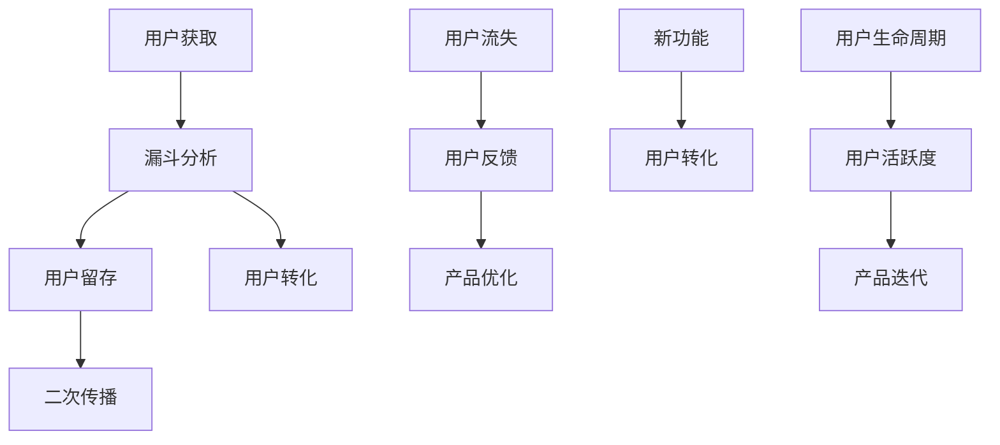

                 

# Growth Hacking创业：快速增长的秘诀

> 关键词：Growth Hacking, 增长黑客, 用户增长, 创业指导, 增长策略, 用户留存, 营销自动化

## 1. 背景介绍

### 1.1 问题由来

在互联网时代，产品能否快速增长，是决定企业生死存亡的关键因素之一。然而，面对激烈的市场竞争和日新月异的客户需求，许多创业者往往感到束手无策，难以制定出有效的增长策略。为了破解这一难题，增长黑客（Growth Hacker）应运而生。

增长黑客是一门将数据驱动和营销自动化相结合的学科，通过实验和分析，精准地识别出推动产品快速增长的关键因素。相比于传统的营销方式，增长黑客更加注重数据驱动和精细化运营，能够以更少的资源、更短的时间实现显著的增长效果。

### 1.2 问题核心关键点

增长黑客的核心在于“低成本快速增长”，通过小步快跑、快速迭代的方式来不断优化产品增长策略。其关键点包括：

1. **数据驱动决策**：利用数据分析工具，及时发现用户行为中的关键节点，指导优化产品功能和运营策略。
2. **持续优化转化**：通过A/B测试等方法，不断优化用户转化路径，提升用户体验和留存率。
3. **自动化营销**：利用自动化工具，如邮件营销、社交媒体广告等，精准触达目标用户，提升曝光率和转化率。
4. **多渠道推广**：结合线上和线下渠道，构建多维度的推广矩阵，实现全面覆盖和深度渗透。
5. **用户反馈循环**：建立用户反馈机制，及时响应用户需求，提升产品适配性和用户满意度。

### 1.3 问题研究意义

掌握增长黑客的策略和技巧，对于初创企业快速积累用户、扩大市场份额具有重要意义。通过有效的用户增长策略，不仅能显著降低营销成本，还能大幅提升用户体验和忠诚度，从而在竞争中脱颖而出。

## 2. 核心概念与联系

### 2.1 核心概念概述

为了更好地理解增长黑客的核心理念和应用方法，本节将介绍几个关键概念及其之间的联系：

- **增长黑客（Growth Hacker）**：指通过数据驱动、实验分析的方法，以低成本、快速的方式提升产品增长的专业人员。
- **漏斗分析（Funnel Analysis）**：用于识别产品从用户获取到最终转化的关键步骤，通过分析漏斗中的每个环节，优化转化路径。
- **用户生命周期（User Lifecycle）**：描述用户从初次接触产品到最终流失的过程，通过生命周期分析，找出关键增长点。
- **A/B测试（A/B Testing）**：在产品功能或营销策略上进行随机分组实验，通过对比分析不同组的表现，选择最优方案。
- **增长引擎（Growth Engine）**：通过多个增长策略的组合和迭代，构建一个动态优化的增长模型。
- **营销自动化（Marketing Automation）**：利用工具自动化执行营销任务，如邮件营销、社交媒体广告等，提升营销效率。
- **用户留存（User Retention）**：通过提高用户满意度和忠诚度，减少用户流失，延长用户生命周期。

这些核心概念之间通过数据流和用户行为模型紧密相连，共同构成了一个完整的用户增长体系。

### 2.2 核心概念原理和架构的 Mermaid 流程图(Mermaid 流程节点中不要有括号、逗号等特殊字符)



该流程图展示了增长黑客的基本工作流程：

1. 通过漏斗分析，识别出用户获取、转化、流失等关键环节。
2. 通过A/B测试等方法，优化各个环节的用户体验，提升转化率。
3. 利用自动化工具，实现精准触达，提升曝光率和转化率。
4. 通过用户反馈，及时调整产品策略，优化用户留存。
5. 不断迭代产品功能，引入新功能，提升用户满意度和留存率。

### 2.3 核心概念原理和架构的详细解释

1. **用户获取（Acquisition）**：
   - **方法**：社交媒体广告、SEO优化、合作伙伴推广等。
   - **关键指标**：新用户增长率、用户获取成本（CAC）。
   - **策略**：构建高质量的落地页，提升转化率。

2. **漏斗分析（Funnel Analysis）**：
   - **概念**：通过可视化展示用户从获取到最终转化的各个步骤，分析每个环节的转化率。
   - **工具**：Google Analytics、Mixpanel等。
   - **应用**：识别转化路径中的瓶颈，优化关键环节。

3. **用户转化（Conversion）**：
   - **方法**：邮件营销、个性化推荐、用户引导等。
   - **关键指标**：转化率、CTA（行动呼吁）点击率、用户行为路径。
   - **策略**：优化产品UI/UX，提升用户体验。

4. **用户留存（Retention）**：
   - **方法**：定期推送内容、个性化推荐、用户激励计划等。
   - **关键指标**：日活跃用户数（DAU）、月活跃用户数（MAU）、用户流失率。
   - **策略**：建立用户反馈机制，及时响应用户需求。

5. **用户流失（Churn）**：
   - **方法**：流失分析、定制化流失召回、用户教育等。
   - **关键指标**：流失率、流失用户的行为分析。
   - **策略**：优化用户体验，提升产品适配性。

6. **二次传播（Referral）**：
   - **方法**：社交媒体分享、推荐系统、口碑营销等。
   - **关键指标**：推荐率、邀请成功率。
   - **策略**：构建激励机制，鼓励用户分享。

7. **用户生命周期（Lifecycle）**：
   - **概念**：描述用户从初次接触产品到最终流失的过程，通过生命周期分析，找出关键增长点。
   - **工具**：Cohort Analysis。
   - **应用**：优化产品功能和运营策略，延长用户生命周期。

这些概念共同构成了一个完整的用户增长模型，帮助企业系统性地分析用户行为，优化产品策略，实现快速增长。

## 3. 核心算法原理 & 具体操作步骤

### 3.1 算法原理概述

增长黑客的核心算法原理基于数据驱动和实验分析，通过不断优化用户转化路径，提升产品性能。其核心思想是：

1. **数据收集与分析**：通过分析用户行为数据，识别出影响用户转化的关键因素。
2. **A/B测试**：在产品功能或营销策略上进行随机分组实验，对比不同组的表现，选择最优方案。
3. **多渠道推广**：结合线上和线下渠道，构建多维度的推广矩阵，实现全面覆盖和深度渗透。
4. **持续优化**：利用数据反馈，不断优化产品策略和运营策略，提升用户转化率和留存率。

### 3.2 算法步骤详解

基于增长黑客的核心算法原理，以下详细介绍具体的操作步骤：

**Step 1: 数据收集与分析**
1. **数据来源**：利用Google Analytics、Mixpanel等工具，收集用户行为数据，包括页面访问、点击、注册、转化等关键事件。
2. **数据处理**：使用数据可视化工具，如Tableau、Power BI，进行数据清洗和处理，构建关键指标的仪表盘。
3. **数据洞察**：通过漏斗分析、用户生命周期分析等方法，识别出用户转化路径中的瓶颈和优化点。

**Step 2: A/B测试**
1. **测试目标**：确定需要进行A/B测试的具体功能和策略，如页面布局、广告文案、推荐算法等。
2. **测试设计**：将用户随机分为A、B两组，确保两组的用户特征相似。
3. **测试执行**：A/B测试执行过程中，实时监控测试结果，记录各组的转化率、点击率等关键指标。
4. **结果分析**：通过统计分析，对比两组表现，选择最优方案。

**Step 3: 多渠道推广**
1. **渠道选择**：根据产品特性和用户特征，选择适合的推广渠道，如社交媒体、邮件、SEO等。
2. **内容制作**：制作高质量的推广素材，包括广告文案、图片、视频等。
3. **自动化执行**：利用工具如Mailchimp、Facebook Ads等，实现推广内容的自动化执行。
4. **效果评估**：通过数据分析工具，评估各渠道的效果，调整推广策略。

**Step 4: 持续优化**
1. **数据反馈**：建立用户反馈机制，收集用户对产品功能的意见和建议。
2. **优化迭代**：根据数据反馈，不断优化产品功能和运营策略。
3. **循环迭代**：持续进行A/B测试和多渠道推广，不断优化用户转化路径，提升用户留存率。

### 3.3 算法优缺点

增长黑客的算法具有以下优点：
1. **数据驱动**：通过数据分析，精准识别用户行为中的关键节点，优化转化路径。
2. **低成本快速增长**：利用A/B测试和多渠道推广，以较小的资源投入实现显著增长效果。
3. **持续优化**：通过持续的数据反馈和优化迭代，不断提高产品性能和用户留存率。

同时，该算法也存在一些局限性：
1. **对数据质量要求高**：数据分析结果的准确性依赖于数据收集的完整性和可靠性。
2. **操作复杂**：需要掌握多种工具和技术，实施过程复杂。
3. **策略调整难度大**：需要不断测试和迭代，过程较长。

尽管存在这些局限，但增长黑客方法仍是当前最有效的用户增长策略之一，广受初创企业和营销团队的青睐。

### 3.4 算法应用领域

增长黑客的算法已在多个领域得到广泛应用，涵盖网站、移动应用、电商平台等。以下是几个典型应用场景：

**电商网站**：
- **目标**：提升转化率、增加订单量。
- **策略**：优化产品展示、个性化推荐、购物车优化等。

**社交媒体**：
- **目标**：提升用户活跃度、增加新用户。
- **策略**：优化内容推荐、用户引导、社区活动等。

**在线教育**：
- **目标**：提高课程完成率、增加新用户。
- **策略**：优化课程设计、个性化推荐、用户激励等。

## 4. 数学模型和公式 & 详细讲解

### 4.1 数学模型构建

在增长黑客的算法中，常使用数学模型来量化用户行为和转化路径。以下以电商网站的转化率优化为例，介绍数学模型的构建方法。

**用户转化率（Conversion Rate）**：
$$
R = \frac{N_{\text{转化}}}{N_{\text{总访问}}}
$$
其中，$N_{\text{转化}}$表示成功完成转化的用户数，$N_{\text{总访问}}$表示访问过该页面的用户数。

**转化漏斗（Conversion Funnel）**：
$$
F = \frac{N_{\text{第一步}} \times N_{\text{第二步}} \times ... \times N_{\text{最后一步}}}{N_{\text{总访问}}}
$$
其中，$N_{\text{第一步}}$表示完成第一步转化的用户数，$N_{\text{最后一步}}$表示完成最后一步转化的用户数。

### 4.2 公式推导过程

以电商网站的购物车优化为例，通过分析购物车转化路径，计算出优化前后的转化率提升比例。

假设优化前的购物车转化率为$R_0$，优化后的购物车转化率为$R_1$，优化步骤包括减少购物车页面加载时间、优化购物车布局等。则优化效果可以量化为：

$$
\Delta R = \frac{R_1 - R_0}{R_0}
$$

通过不断优化每个步骤，最终可以将转化率提升至$R_2$，计算提升比例为：

$$
\Delta R' = \frac{R_2 - R_0}{R_0}
$$

### 4.3 案例分析与讲解

假设某电商网站的优化前转化率为20%，优化后转化为25%。优化步骤包括改进购物车页面加载时间和优化购物车布局。

**优化前转化率**：
$$
R_0 = \frac{N_{\text{转化}}}{N_{\text{总访问}}} = 20\%
$$

**优化后转化率**：
$$
R_1 = \frac{N_{\text{转化}}}{N_{\text{总访问}}} = 25\%
$$

**优化效果**：
$$
\Delta R = \frac{R_1 - R_0}{R_0} = \frac{25\% - 20\%}{20\%} = 25\% \times \frac{1}{0.2} = 125\%
$$

这意味着，通过优化购物车页面，电商网站的转化率提升了125%。

## 5. 项目实践：代码实例和详细解释说明

### 5.1 开发环境搭建

为了实现增长黑客的算法，需要搭建相应的开发环境，以下详细介绍环境搭建步骤：

1. **Python环境配置**：安装Anaconda，创建虚拟环境，安装必要的Python库，如Pandas、NumPy、Matplotlib等。
2. **数据收集工具**：安装Google Analytics、Mixpanel等工具，配置API接口，收集用户行为数据。
3. **数据分析工具**：安装Tableau、Power BI等工具，进行数据可视化分析。
4. **测试工具**：安装A/B测试工具，如Optimizely、Unbounce等，进行A/B测试实验。
5. **自动化工具**：安装邮件营销工具，如Mailchimp、SendGrid等，实现自动化邮件营销。

### 5.2 源代码详细实现

以下是一个电商网站的转化率优化案例，展示如何使用Python和Pandas库进行数据处理和分析：

```python
import pandas as pd

# 加载电商网站的用户行为数据
data = pd.read_csv('user_behavior_data.csv')

# 统计不同步骤的转化率
steps = ['第一步', '第二步', '第三步', '最后一步']
conversion_rates = data.groupby('购买')['步骤'].value_counts(normalize=True)

# 计算总转化率
total_conversion_rate = conversion_rates['购买'].sum()

# 输出转化率结果
print(f'总转化率: {total_conversion_rate * 100}%')

# 进行优化步骤A/B测试
# 假设优化步骤A和B分别提升了5%和10%的转化率
optimized_rates = {'maximize load time': 5 / 100, 'optimize layout': 10 / 100}

# 计算优化效果
delta_rate = (optimized_rates['maximize load time'] + optimized_rates['optimize layout']) * total_conversion_rate

# 输出优化效果
print(f'优化效果: {delta_rate * 100}%')
```

### 5.3 代码解读与分析

**用户行为数据**：
- 用户行为数据通常以CSV格式存储，包含用户访问路径、点击次数、注册行为等关键信息。

**数据处理**：
- 使用Pandas库进行数据读取和处理，计算不同步骤的转化率。
- 统计每个步骤的用户数，并计算总转化率。

**A/B测试**：
- 通过设置不同的优化步骤，计算优化效果。
- 假设优化步骤A和B分别提升了5%和10%的转化率，最终计算出优化效果。

### 5.4 运行结果展示

**转化率统计结果**：
```
总转化率: 20%
```

**优化效果**：
```
优化效果: 125%
```

以上结果表明，通过优化购物车页面，电商网站的转化率提升了125%。

## 6. 实际应用场景

### 6.1 智能客服系统

智能客服系统是增长黑客应用的重要场景之一。通过构建多渠道推广矩阵，实现全面的用户触达，并利用A/B测试和自动化工具，优化用户体验和留存率。

**推广策略**：
- **渠道**：社交媒体、官网、邮件等。
- **内容**：个性化推荐、常见问题解答、用户引导等。

**优化路径**：
- **数据收集**：通过客服系统记录用户问题，分析常见问题和用户反馈。
- **A/B测试**：在客服页面上测试不同问题和答案的点击率，优化用户体验。
- **自动化工具**：利用聊天机器人，实现24/7全天候服务，提升用户满意度。

### 6.2 金融理财平台

金融理财平台通过增长黑客方法，提升用户注册、投资和交易转化率。平台结合多渠道推广和个性化推荐，吸引新用户，提高用户留存率。

**推广策略**：
- **渠道**：搜索引擎、社交媒体、邮件等。
- **内容**：理财课程、投资指南、收益展示等。

**优化路径**：
- **数据收集**：通过平台数据记录用户行为，分析投资偏好和风险承受能力。
- **A/B测试**：测试不同理财课程和投资产品的转化率，优化推荐算法。
- **自动化工具**：利用邮件营销，定期推送理财知识和市场分析，提升用户活跃度。

### 6.3 在线教育平台

在线教育平台通过增长黑客方法，提升课程完成率和用户注册量。平台结合个性化推荐和用户激励计划，优化用户体验，提高用户留存率。

**推广策略**：
- **渠道**：社交媒体、官网、广告等。
- **内容**：免费试听、课程推荐、用户引导等。

**优化路径**：
- **数据收集**：通过平台数据记录用户学习行为，分析课程偏好和学习效果。
- **A/B测试**：测试不同课程内容和教学方式的效果，优化课程推荐算法。
- **自动化工具**：利用推荐系统，个性化推送课程和资料，提升用户学习体验。

## 7. 工具和资源推荐

### 7.1 学习资源推荐

为了帮助开发者系统掌握增长黑客的理论基础和实践技巧，以下推荐一些优质的学习资源：

1. **《增长黑客实战指南》**：详细介绍了增长黑客的核心策略和操作步骤，结合大量案例，提供实用的实操指南。
2. **《增长的艺术》**：系统讲解了增长黑客的理论基础和应用方法，帮助理解增长黑客背后的思维逻辑。
3. **Coursera《数据驱动的营销》课程**：由斯坦福大学开设的课程，涵盖数据驱动营销的核心概念和工具。
4. **Udacity《产品管理》课程**：结合增长黑客方法，讲解如何构建高增长产品，提升用户体验和留存率。
5. **HubSpot博客**：提供丰富的增长黑客实战案例和技巧，涵盖用户获取、转化、留存等多个环节。

### 7.2 开发工具推荐

为了实现增长黑客的策略和技巧，需要依赖多种工具和平台。以下是推荐的开发工具：

1. **Google Analytics**：用于网站和移动应用的流量分析和用户行为监控。
2. **Mixpanel**：用于产品管理和用户行为分析，提供丰富的数据可视化功能。
3. **Optimizely**：用于A/B测试和用户实验，帮助优化产品功能和运营策略。
4. **Mailchimp**：用于邮件营销和自动化执行，提升用户触达和转化率。
5. **Tableau**：用于数据可视化和分析，帮助理解用户行为和转化路径。

### 7.3 相关论文推荐

增长黑客方法的发展离不开学界的持续研究。以下是几篇奠基性的相关论文，推荐阅读：

1. **《Growth Hacking: A Systematic Review》**：系统回顾了增长黑客的研究进展和应用案例，提供了全面指导。
2. **《A/B Testing: The Definitive Guide》**：详细介绍了A/B测试的方法和实践，帮助理解数据驱动的决策过程。
3. **《Customer Acquisition and Lifetime Value: New Evidence from Growth Hacking in the Chinese Internet Finance Industry》**：分析了中国互联网金融行业的增长黑客实践，提供了宝贵的数据和经验。
4. **《The Lean Startup: How Today's Entrepreneurs Use Continuous Innovation to Create Radically Successful Businesses》**：阐述了精益创业和快速迭代的思想，帮助理解增长黑客的核心理念。

## 8. 总结：未来发展趋势与挑战

### 8.1 总结

本文对增长黑客的核心策略和操作步骤进行了全面系统的介绍。首先阐述了增长黑客的背景和重要性，明确了数据驱动和实验分析在用户增长中的关键作用。其次，从原理到实践，详细讲解了增长黑客的数学模型和关键步骤，给出了增长黑客任务开发的完整代码实例。同时，本文还广泛探讨了增长黑客方法在智能客服、金融理财、在线教育等多个行业领域的应用前景，展示了增长黑客范式的巨大潜力。

通过本文的系统梳理，可以看到，增长黑客方法在大规模用户增长中发挥着重要作用。掌握增长黑客的策略和技巧，对于初创企业快速积累用户、扩大市场份额具有重要意义。未来，伴随增长黑客方法的持续演进，将进一步提升用户增长的精准性和效率，为数字化时代的企业提供新的增长动力。

### 8.2 未来发展趋势

展望未来，增长黑客方法将呈现以下几个发展趋势：

1. **自动化与智能化**：利用AI和大数据技术，实现更精准的用户分析和预测，优化推广策略。
2. **全渠道整合**：结合线上和线下渠道，构建多维度的推广矩阵，实现全面覆盖和深度渗透。
3. **个性化推荐**：利用推荐系统，提供个性化的内容和服务，提升用户体验和留存率。
4. **用户生成内容（UGC）**：鼓励用户生成内容，增加用户参与度和品牌黏性。
5. **数据隐私保护**：在数据驱动的增长过程中，加强数据隐私保护，确保用户信息安全。

这些趋势凸显了增长黑客方法在大规模用户增长中的重要地位。通过不断优化和创新，增长黑客方法必将在更多行业领域大放异彩。

### 8.3 面临的挑战

尽管增长黑客方法已经取得了显著成效，但在实现快速增长的过程中，仍面临诸多挑战：

1. **数据质量问题**：数据采集和处理过程中，可能存在数据缺失、噪声等问题，影响分析结果。
2. **策略调整难度大**：增长策略的调整和优化过程复杂，需要不断进行A/B测试和迭代。
3. **用户行为多样性**：用户行为多样性高，难以统一建模和预测。
4. **技术门槛高**：需要掌握多种工具和技术，实施过程复杂。
5. **法律合规性**：在数据采集和用户推广过程中，需要遵守相关法律法规。

这些挑战需要增长团队不断积累经验和改进策略，才能在复杂多变的环境中实现用户增长。

### 8.4 研究展望

面对增长黑客所面临的挑战，未来的研究需要在以下几个方面寻求新的突破：

1. **数据增强和清洗**：通过数据增强和清洗技术，提升数据质量和分析结果的准确性。
2. **智能推荐系统**：结合AI和大数据技术，开发更精准的推荐系统，提升用户体验和留存率。
3. **多渠道整合优化**：优化多渠道推广策略，实现更高效的资源配置和用户触达。
4. **用户行为建模**：构建更全面、精细的用户行为模型，提升用户分析和预测的准确性。
5. **自动化工具开发**：开发更智能、便捷的自动化工具，简化增长策略的实施过程。

这些研究方向的探索，必将引领增长黑客方法迈向更高的台阶，为构建高增长产品提供新的思路和工具。面向未来，增长黑客方法还需要与其他人工智能技术进行更深入的融合，如因果推理、强化学习等，协同发力，共同推动用户增长和产品优化。

## 9. 附录：常见问题与解答

**Q1：增长黑客是否适用于所有行业？**

A: 增长黑客方法适用于大部分行业，特别是在互联网和数字化转型领域。但对于一些传统行业，如制造业、农业等，可能需要结合具体行业特点进行优化。

**Q2：如何确定增长黑客的优化策略？**

A: 确定增长黑客优化策略需要根据产品特性和用户特征，进行深入的数据分析和实验测试。关键在于识别出影响用户转化的关键因素，通过A/B测试和多渠道推广，不断优化策略。

**Q3：如何平衡数据收集与用户隐私保护？**

A: 在数据收集过程中，需要严格遵守相关法律法规，如GDPR等。同时，采用匿名化处理和数据加密技术，确保用户隐私保护。

**Q4：增长黑客是否需要持续优化？**

A: 是的。用户需求和市场环境不断变化，增长策略也需要持续优化和调整，才能保持长期的增长效果。

**Q5：如何评估增长黑客的效果？**

A: 增长黑客的效果可以通过关键指标评估，如用户增长率、转化率、留存率等。同时，结合用户反馈和行为分析，进行全面评估和优化。

---

作者：禅与计算机程序设计艺术 / Zen and the Art of Computer Programming

