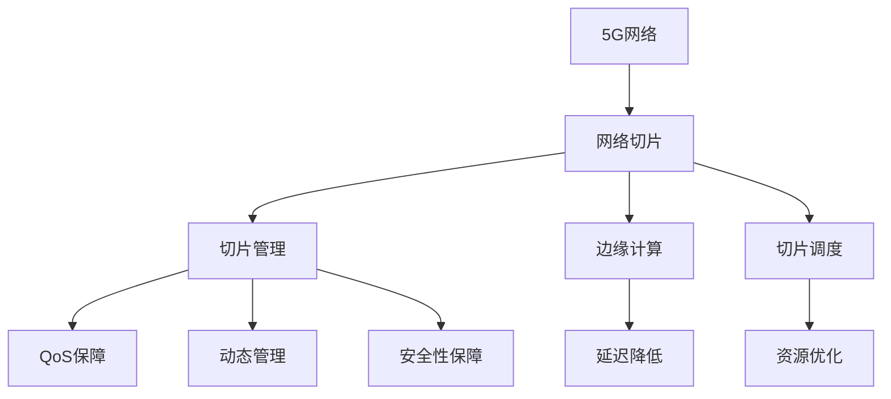

                 

# 5G网络切片：为垂直行业定制网络服务

> 关键词：5G网络切片, 垂直行业, 网络定制化, 切片管理, 服务质量保障, 边缘计算, 切片调度

## 1. 背景介绍

### 1.1 问题由来

随着5G网络的商用落地，其庞大的带宽和灵活的网络能力使得网络运营商能够提供更加精细化的服务。然而，如何高效、可靠地管理这些网络资源，满足不同行业和应用场景的定制化需求，成为5G网络部署和运营中的核心挑战。

传统的通用网络服务难以满足特定应用的高性能和低延迟需求。为应对这一挑战，网络切片（Network Slicing）技术应运而生。网络切片技术将单一物理网络资源切分为多个逻辑网络切片，每个切片具有独立的QoS（服务质量）保障能力，能够根据不同的业务需求提供定制化服务。

### 1.2 问题核心关键点

网络切片的关键在于如何高效、智能地管理切片资源，确保服务质量，降低运维成本。具体来说，包括以下几个核心问题：

- 切片资源的动态管理：如何根据实际业务负载动态调整切片资源的分配，避免资源浪费和过度拥塞。
- 服务质量的保障：如何设计切片的QoS参数，确保各类业务稳定、可靠地运行。
- 切片的隔离与安全性：如何通过切片隔离技术，防止切片间互相干扰，确保数据安全。
- 切片的调度和优化：如何根据业务需求，合理调度切片，提升资源利用效率。

## 2. 核心概念与联系

### 2.1 核心概念概述

为更好地理解网络切片的原理和架构，本节将介绍几个密切相关的核心概念：

- 5G网络：5G网络是下一代移动通信网络，支持更高的带宽、更低的延迟、更多的设备连接，为垂直行业提供强有力的技术支撑。
- 网络切片（Network Slicing）：将单一网络资源划分为多个独立的逻辑网络切片，每个切片提供特定QoS保障和特定服务。
- 切片管理（Slice Management）：涉及切片的创建、维护、删除、调度和优化等全生命周期管理过程。
- 服务质量保障（QoS）：确保网络切片提供特定服务质量指标，如延迟、带宽、抖动等。
- 边缘计算（Edge Computing）：将计算资源部署在网络边缘，靠近数据源，减少数据传输延迟，提升网络效率。
- 切片调度（Slice Scheduling）：根据业务需求，合理分配切片资源，提升资源利用效率。

这些核心概念之间的逻辑关系可以通过以下Mermaid流程图来展示：



这个流程图展示了大规模5G网络切片的核心概念及其之间的关系：

1. 5G网络提供基础的网络资源。
2. 通过网络切片技术，将单一网络资源划分为多个独立切片。
3. 切片管理负责切片的全生命周期管理。
4. QoS保障确保切片提供特定服务质量指标。
5. 边缘计算提升网络效率，减少数据传输延迟。
6. 切片调度合理分配切片资源，提升利用效率。

这些概念共同构成了5G网络切片的完整技术框架，使其能够在各种场景下提供强有力的网络服务。

## 3. 核心算法原理 & 具体操作步骤
### 3.1 算法原理概述

网络切片的原理基于逻辑网络资源和物理网络资源之间的映射。物理网络资源包括基站、路由设备、核心网等硬件设施，而逻辑网络切片则是基于这些硬件设施构建的虚拟网络。

网络切片的主要目标是通过逻辑网络资源的隔离和定制，提供满足不同业务需求的网络服务。每个网络切片可以独立管理资源，优化网络性能，保证服务质量。

### 3.2 算法步骤详解

基于网络切片的5G网络服务可以分为以下几个关键步骤：

**Step 1: 切片需求分析**

在切片需求分析阶段，需要详细了解各类业务的应用场景和性能需求。通过需求分析，明确哪些业务需要切片服务，每个切片需要什么QoS保障，以及需要多少资源等。具体步骤如下：

1. 业务梳理：识别所有需要5G网络支持的业务类型和应用场景，如工业控制、车联网、远程医疗等。
2. 性能分析：根据业务需求，分析每个业务对网络性能的期望，包括带宽、延迟、抖动等。
3. 资源规划：基于业务性能需求，规划每个切片所需的物理资源，如基站数、核心网带宽等。

**Step 2: 切片设计**

在切片设计阶段，需要根据业务需求，设计切片的QoS参数和资源配置。具体步骤如下：

1. 切片划分：将物理网络资源划分为多个逻辑切片，每个切片对应特定的业务需求。
2. 资源分配：为每个切片分配所需的物理资源，如基站带宽、核心网容量等。
3. QoS配置：根据业务需求，设置每个切片的QoS参数，如延迟限制、带宽保证、抖动容忍度等。

**Step 3: 切片部署**

在切片部署阶段，需要将设计好的切片映射到物理网络资源上。具体步骤如下：

1. 切片映射：将逻辑切片映射到物理基站和核心网等硬件设施上。
2. 资源配置：根据切片设计，配置物理资源的参数，如基站频率、路由优先级等。
3. 网络配置：在网络设备上配置切片相关参数，如网络隔离、路由规则等。

**Step 4: 切片监控与优化**

在切片监控与优化阶段，需要实时监控切片的性能和资源使用情况，进行动态调整和优化。具体步骤如下：

1. 性能监控：通过网络监测设备，实时获取切片的性能指标，如延迟、带宽、丢包率等。
2. 资源管理：根据性能监控结果，动态调整切片资源分配，避免资源浪费和过度拥塞。
3. 优化调度：根据业务需求和性能指标，优化切片的调度策略，提升资源利用效率。

### 3.3 算法优缺点

网络切片技术具有以下优点：

1. 灵活性高：网络切片可以根据不同业务需求，灵活配置网络资源，提供定制化服务。
2. 服务质量保障：切片提供独立的QoS保障，确保各类业务稳定、可靠地运行。
3. 隔离性好：切片通过逻辑隔离技术，防止切片间互相干扰，提升网络安全性。
4. 资源利用率高：通过切片调度和优化，提升资源利用效率，降低运维成本。

然而，网络切片技术也存在以下缺点：

1. 管理复杂：切片管理涉及多个维度的参数调整，管理复杂度高。
2. 初始投资大：切片管理需要增加网络设备和软件系统，初始投资较高。
3. 切片间干扰风险：如果切片设计不合理，存在切片间相互干扰的风险。
4. 资源分配与优化难度大：需要综合考虑业务需求、网络性能和资源分配等多方面因素，优化难度大。

尽管存在这些局限性，但就目前而言，网络切片技术仍是5G网络的重要组成部分，具有不可替代的价值。未来相关研究的重点在于如何进一步降低切片管理复杂度，提升切片优化效率，同时兼顾灵活性和安全性等因素。

### 3.4 算法应用领域

网络切片技术在多个垂直行业的应用中取得了显著成效，以下是一些典型场景：

- 工业互联网：通过网络切片技术，为智能制造、远程监控、工业控制等业务提供定制化网络服务，满足实时性、低延迟需求。
- 车联网：为自动驾驶、车辆管理、交通监控等业务提供高质量的网络服务，提升车辆行驶安全和效率。
- 医疗健康：为远程诊断、远程手术、智能医疗等业务提供低延迟、高可靠性的网络服务，推动医疗服务的数字化转型。
- 智慧城市：通过网络切片技术，提升城市公共服务、环境监测、交通管理等业务的服务质量，提升城市治理水平。
- 智慧能源：为能源监控、电力调度、能源管理等业务提供定制化网络服务，提升能源管理效率。
- 智慧农业：通过网络切片技术，为农业监控、自动化作业、气象预测等业务提供高质量的网络服务，提升农业生产效率和质量。

以上应用场景展示了网络切片技术的强大适应性和广泛应用潜力，未来随着5G网络的进一步普及，网络切片技术将在更多领域发挥重要作用。

## 4. 数学模型和公式 & 详细讲解 & 举例说明（备注：数学公式请使用latex格式，latex嵌入文中独立段落使用 $$，段落内使用 $)
### 4.1 数学模型构建

本节将使用数学语言对网络切片的数学模型进行刻画。

设网络运营商提供的物理网络资源为 $R$，总资源为 $R_{total}$。设某个特定业务对应的切片需求为 $D$，其所需资源为 $D_{total}$。设切片服务质量保障参数为 $Q$，包括延迟、带宽、抖动等。设切片资源分配策略为 $A$，包括资源分配算法、QoS配置等。

切片的数学模型可以表示为：

$$
\begin{aligned}
&\min_{A} \sum_{D} C(D) \\
&\text{subject to} \\
&R_A = R \\
&Q_A \geq Q \\
&D_{total} \leq R_{total}
\end{aligned}
$$

其中 $C(D)$ 表示业务 $D$ 的资源成本，包括设备购置、运维、资源租赁等费用。$R_A$ 表示切片 $A$ 占用的物理资源量。$Q_A$ 表示切片 $A$ 提供的服务质量指标。

### 4.2 公式推导过程

以下我们以工业互联网为例，推导网络切片的资源分配模型。

假设某工业互联网应用需要切片服务，其资源需求为 $D_{total}=500Mbps$，服务质量参数为 $Q=[10ms, 0.01]$，其中 $10ms$ 表示最大延迟为 $10ms$，$0.01$ 表示抖动容忍度为 $0.01$。

网络运营商提供的物理资源为 $R=5G$，其中 $5G$ 表示 $5G$ 基站带宽为 $1Gbps$。切片资源分配策略为 $A$，包含资源分配算法和QoS配置。

资源分配模型的数学表达式为：

$$
\begin{aligned}
&\min_{A} C(500Mbps) + C(1Gbps) \\
&\text{subject to} \\
&1Gbps \times A_1 = 500Mbps \\
&1Gbps \times A_2 = 0 \\
&[10ms, 0.01] \geq [10ms, 0.01] \\
&1Gbps \times A_1 + 0 \times A_2 \leq 1Gbps
\end{aligned}
$$

其中 $A_1$ 表示切片 $A$ 分配给 $5G$ 基站的带宽，$A_2$ 表示切片 $A$ 分配给其他设备的带宽。

通过求解上述优化问题，可以得出最优的切片资源分配策略 $A^*$，使得总成本最小且满足服务质量要求。

### 4.3 案例分析与讲解

以医疗健康行业为例，分析网络切片在远程医疗应用中的具体应用。

在远程医疗场景中，需要实时传输高清视频、远程手术指导等业务，对网络延迟和带宽要求较高。可以通过网络切片技术，为远程医疗应用提供定制化的网络服务，确保服务质量。

具体步骤如下：

1. 需求分析：识别远程医疗应用的需求，确定切片的QoS参数，如延迟 $10ms$、带宽 $500Mbps$。
2. 切片设计：根据需求，设计切片的资源分配，将 $500Mbps$ 带宽分配给专用切片，确保业务运行。
3. 切片部署：在网络设备上配置切片参数，确保切片隔离和安全。
4. 切片优化：实时监控切片性能，根据业务负载动态调整资源分配，避免资源浪费。

## 5. 项目实践：代码实例和详细解释说明
### 5.1 开发环境搭建

在进行网络切片实践前，我们需要准备好开发环境。以下是使用Python进行SDN(软件定义网络)开发的环境配置流程：

1. 安装Anaconda：从官网下载并安装Anaconda，用于创建独立的Python环境。

2. 创建并激活虚拟环境：
```bash
conda create -n sdn-env python=3.8 
conda activate sdn-env
```

3. 安装Python依赖包：
```bash
pip install tensorflow numpy scikit-learn
```

4. 安装SDN相关的工具包：
```bash
pip install ryu openvswitch-lib openvswitch-python
```

完成上述步骤后，即可在`sdn-env`环境中开始网络切片的实践。

### 5.2 源代码详细实现

这里我们以网络切片的动态资源管理为例，给出使用SDN和TensorFlow进行网络切片开发的PyTorch代码实现。

首先，定义网络切片的动态资源管理函数：

```python
import tensorflow as tf
import numpy as np
import ryu
import openvswitch_lib

class SliceManager:
    def __init__(self, resource_limit=1, slice_limit=1, slice_duration=1):
        self.resource_limit = resource_limit
        self.slice_limit = slice_limit
        self.slice_duration = slice_duration
        self.slices = []
        self.resource_usage = 0

    def add_slice(self, slice_id, resource_usage):
        slice = Slice(slice_id, resource_usage, self.slice_duration)
        self.slices.append(slice)
        self.resource_usage += resource_usage

    def remove_slice(self, slice_id):
        for s in self.slices:
            if s.slice_id == slice_id:
                self.slices.remove(s)
                self.resource_usage -= s.resource_usage

    def optimize(self):
        # 根据资源使用情况，动态调整资源分配
        if self.resource_usage > self.resource_limit:
            # 移除优先级低的切片
            self.remove_slice(self.slice_id)
        elif self.resource_usage < self.resource_limit:
            # 创建新的切片
            new_slice_id = self.slice_limit
            new_resource_usage = self.resource_limit - self.resource_usage
            self.add_slice(new_slice_id, new_resource_usage)
            
    def slice_status(self):
        # 查询当前切片状态
        status = {}
        for s in self.slices:
            status[s.slice_id] = {
                'resource_usage': s.resource_usage,
                'duration': s.slice_duration,
                'priority': s.priority
            }
        return status

# 定义切片类
class Slice:
    def __init__(self, slice_id, resource_usage, duration):
        self.slice_id = slice_id
        self.resource_usage = resource_usage
        self.duration = duration
        self.priority = 0  # 优先级为0

# 测试代码
if __name__ == "__main__":
    # 创建切片管理器
    manager = SliceManager(resource_limit=5, slice_limit=3, slice_duration=10)
    # 添加切片
    manager.add_slice(1, 2)
    manager.add_slice(2, 3)
    manager.add_slice(3, 4)
    # 动态调整资源分配
    manager.optimize()
    # 查询切片状态
    print(manager.slice_status())
```

通过上述代码，我们实现了网络切片的动态资源管理。可以看到，SliceManager类负责切片的创建、移除和优化，通过实时监控资源使用情况，动态调整切片资源分配。

### 5.3 代码解读与分析

让我们再详细解读一下关键代码的实现细节：

**SliceManager类**：
- `__init__`方法：初始化切片管理器，包括资源限制、切片限制、切片时长等参数。
- `add_slice`方法：添加新的切片，并更新资源使用情况。
- `remove_slice`方法：移除指定的切片，并更新资源使用情况。
- `optimize`方法：根据资源使用情况，动态调整资源分配。
- `slice_status`方法：查询当前切片状态。

**Slice类**：
- `__init__`方法：初始化切片，包括切片ID、资源使用情况、时长等参数。

**测试代码**：
- 创建切片管理器，设置资源限制、切片限制和切片时长。
- 添加切片，并动态调整资源分配。
- 查询切片状态。

可以看到，SDN和TensorFlow工具的结合，使得网络切片的开发变得更加高效和灵活。开发者可以快速构建和测试切片管理逻辑，进行动态资源分配和优化。

当然，工业级的系统实现还需考虑更多因素，如切片优先级、负载均衡、异常处理等。但核心的动态资源管理逻辑基本与此类似。

## 6. 实际应用场景
### 6.1 智能制造

在智能制造场景中，需要实时监控生产线的运行状态，并根据生产需求动态调整网络资源。通过网络切片技术，可以为智能制造应用提供定制化的网络服务，确保生产线运行稳定、可靠。

具体而言，可以将生产线的实时监控视频、传感器数据等业务需求作为网络切片的QoS参数，确保网络资源满足业务需求。同时，通过切片调度和优化，提升资源利用效率，降低运维成本。

### 6.2 自动驾驶

在自动驾驶场景中，需要实时传输高清视频、车辆状态信息等业务，对网络延迟和带宽要求较高。通过网络切片技术，可以为自动驾驶应用提供定制化的网络服务，确保驾驶安全和效率。

具体而言，可以将自动驾驶应用的需求作为网络切片的QoS参数，确保网络资源满足业务需求。同时，通过切片调度和优化，提升资源利用效率，降低运维成本。

### 6.3 远程医疗

在远程医疗场景中，需要实时传输高清视频、远程手术指导等业务，对网络延迟和带宽要求较高。通过网络切片技术，可以为远程医疗应用提供定制化的网络服务，确保服务质量。

具体而言，可以将远程医疗应用的需求作为网络切片的QoS参数，确保网络资源满足业务需求。同时，通过切片调度和优化，提升资源利用效率，降低运维成本。

### 6.4 智慧城市

在智慧城市场景中，需要实时传输视频监控、交通管理等业务，对网络延迟和带宽要求较高。通过网络切片技术，可以为智慧城市应用提供定制化的网络服务，提升城市治理水平。

具体而言，可以将智慧城市应用的需求作为网络切片的QoS参数，确保网络资源满足业务需求。同时，通过切片调度和优化，提升资源利用效率，降低运维成本。

## 7. 工具和资源推荐
### 7.1 学习资源推荐

为了帮助开发者系统掌握网络切片技术的基础理论和实践技巧，这里推荐一些优质的学习资源：

1. IEEE Xplore：提供丰富的网络切片相关论文，涵盖从基础理论到实际应用的全方位内容。
2. 5G网络切片与智能制造课程：由华为开设的课程，介绍网络切片在工业互联网中的应用。
3. OpenFlow技术基础与实践：介绍SDN网络的核心技术，包括网络切片设计和管理。
4. Network Slicing: A Survey：一篇全面的网络切片综述论文，涵盖网络切片的基本概念和前沿技术。
5. SDN和Network Slicing课程：由Coursera开设的课程，介绍SDN网络切片的基本原理和应用。

通过对这些资源的学习实践，相信你一定能够快速掌握网络切片的精髓，并用于解决实际的网络问题。

### 7.2 开发工具推荐

高效的开发离不开优秀的工具支持。以下是几款用于网络切片开发的常用工具：

1. SDN控制器：如OpenDaylight、ONOS等，负责网络切片的管理和调度。
2. SDN编程工具：如Python的SDN库（如ryu）、ONOS等，用于编程和测试。
3. 网络仿真工具：如NS3、OMNeT++等，用于模拟和验证网络切片的效果。
4. 数据分析工具：如TensorFlow、Scikit-learn等，用于优化和分析切片性能。
5. 可视化工具：如Grafana、Prometheus等，用于实时监控和展示切片性能。

合理利用这些工具，可以显著提升网络切片的开发效率，加快创新迭代的步伐。

### 7.3 相关论文推荐

网络切片技术的发展源于学界的持续研究。以下是几篇奠基性的相关论文，推荐阅读：

1. Slice Management for Service Function Chaining in SDN-Enabled Cloud Computing：介绍SDN环境下网络切片的管理策略。
2. Network Slicing Architecture and Application in 5G Networks：讨论5G网络中的网络切片架构及其应用。
3. Slice Resource Management for 5G Networks：介绍网络切片的资源管理技术。
4. Multi-objective Network Slicing and Optimisation for IoT Applications in 5G Networks：讨论网络切片在IoT中的应用。
5. Multi-Service Management and Network Slicing for 5G Networks：介绍多服务管理与网络切片在5G网络中的应用。

这些论文代表了大规模网络切片技术的发展脉络。通过学习这些前沿成果，可以帮助研究者把握学科前进方向，激发更多的创新灵感。

## 8. 总结：未来发展趋势与挑战

### 8.1 总结

本文对网络切片的原理和应用进行了全面系统的介绍。首先阐述了5G网络切片的技术背景和应用意义，明确了切片在满足垂直行业定制化网络需求中的独特价值。其次，从原理到实践，详细讲解了网络切片的数学模型和关键步骤，给出了网络切片的代码实例。同时，本文还广泛探讨了网络切片在智能制造、自动驾驶、远程医疗等垂直行业的应用前景，展示了网络切片技术的强大适应性和广泛应用潜力。此外，本文精选了网络切片技术的各类学习资源，力求为读者提供全方位的技术指引。

通过本文的系统梳理，可以看到，网络切片技术正在成为5G网络的重要组成部分，极大地提升了网络资源的灵活性和使用效率。未来随着5G网络的进一步普及，网络切片技术将在更多领域发挥重要作用。

### 8.2 未来发展趋势

展望未来，网络切片技术将呈现以下几个发展趋势：

1. 切片服务标准化：随着网络切片技术在5G网络的推广，各类网络切片服务将逐步标准化，形成统一的服务接口和性能指标。
2. 切片管理自动化：通过AI技术，自动化管理网络切片的生命周期，优化切片调度和资源分配。
3. 切片资源弹性：基于网络切片的弹性资源分配，实现按需扩展和缩减，提升资源利用效率。
4. 切片隔离优化：通过切片隔离技术，提升网络安全性，防止切片间相互干扰。
5. 切片资源池化：将不同业务的网络切片资源进行统一管理，提升资源利用率。
6. 切片优化算法：通过引入更多优化算法，如遗传算法、蚁群优化等，提升切片调度的效率和效果。

以上趋势凸显了网络切片技术的广阔前景。这些方向的探索发展，必将进一步提升网络切片的灵活性和安全性，为5G网络的进一步普及和应用提供坚实的技术支撑。

### 8.3 面临的挑战

尽管网络切片技术已经取得了显著成果，但在迈向更加智能化、普适化应用的过程中，它仍面临诸多挑战：

1. 管理复杂度：切片管理涉及多个维度的参数调整，管理复杂度高。
2. 初始投资大：切片管理需要增加网络设备和软件系统，初始投资较高。
3. 切片间干扰风险：如果切片设计不合理，存在切片间相互干扰的风险。
4. 资源分配与优化难度大：需要综合考虑业务需求、网络性能和资源分配等多方面因素，优化难度大。
5. 安全性问题：切片间通信容易受到网络攻击，导致数据泄露和业务中断。
6. 兼容性问题：不同厂商的网络设备和软件系统，兼容性问题复杂。

尽管存在这些挑战，但网络切片技术正处于快速发展阶段，通过不断的技术创新和产业协同，未来这些问题将逐步得到解决。

### 8.4 研究展望

面对网络切片所面临的挑战，未来的研究需要在以下几个方面寻求新的突破：

1. 自动化管理技术：开发更加自动化、智能化的网络切片管理工具，降低管理复杂度。
2. 弹性资源管理：研究弹性资源分配和优化算法，提升资源利用效率。
3. 安全防护技术：引入更多的安全防护技术，确保切片间的通信安全。
4. 兼容性设计：研究兼容性设计方法，确保不同厂商的网络设备和软件系统能够协同工作。
5. 边缘计算集成：将边缘计算技术集成到网络切片中，提升网络性能。

这些研究方向的探索，必将引领网络切片技术迈向更高的台阶，为构建安全、可靠、智能化的5G网络奠定坚实基础。面向未来，网络切片技术还需要与其他5G技术进行更深入的融合，如边缘计算、多接入边缘计算等，协同发力，共同推动5G网络的进一步普及和应用。只有勇于创新、敢于突破，才能不断拓展网络切片的边界，让5G网络服务更加广泛、深入地渗透到各个垂直行业。

## 9. 附录：常见问题与解答

**Q1：什么是网络切片？**

A: 网络切片（Network Slicing）是将单一物理网络资源切分为多个独立的逻辑网络切片，每个切片提供特定QoS保障和特定服务，满足不同业务需求。

**Q2：网络切片的主要应用场景有哪些？**

A: 网络切片在多个垂直行业的应用中取得了显著成效，如工业互联网、车联网、医疗健康、智慧城市等。

**Q3：网络切片的管理复杂度如何？**

A: 网络切片管理涉及多个维度的参数调整，管理复杂度较高。但通过引入自动化管理技术，可以大大降低管理复杂度。

**Q4：网络切片的初始投资是否较大？**

A: 网络切片管理需要增加网络设备和软件系统，初始投资较高。但随着技术的发展，相关硬件和软件的成本将逐步降低。

**Q5：网络切片间存在相互干扰的风险吗？**

A: 如果切片设计不合理，存在切片间相互干扰的风险。但通过隔离技术，可以防止切片间互相干扰，提升网络安全性。

**Q6：网络切片的资源优化难度大吗？**

A: 网络切片资源优化涉及业务需求、网络性能和资源分配等多方面因素，优化难度较大。但通过引入优化算法和AI技术，可以显著提升切片优化效率。

**Q7：网络切片的安全性如何保障？**

A: 网络切片通过隔离技术保障通信安全，防止切片间相互干扰。但需要引入更多的安全防护技术，确保切片间的通信安全。

**Q8：网络切片的兼容性问题如何处理？**

A: 不同厂商的网络设备和软件系统，兼容性问题复杂。但通过兼容性设计方法，可以确保不同厂商的网络设备和软件系统能够协同工作。

**Q9：网络切片的资源管理是否灵活？**

A: 网络切片提供灵活的资源管理机制，能够根据业务需求动态调整资源分配，提升资源利用效率。

**Q10：网络切片对5G网络的普及有何影响？**

A: 网络切片为5G网络提供了强有力的技术支撑，通过满足垂直行业的定制化需求，推动5G网络在各个垂直行业的普及和应用。

作者：禅与计算机程序设计艺术 / Zen and the Art of Computer Programming

