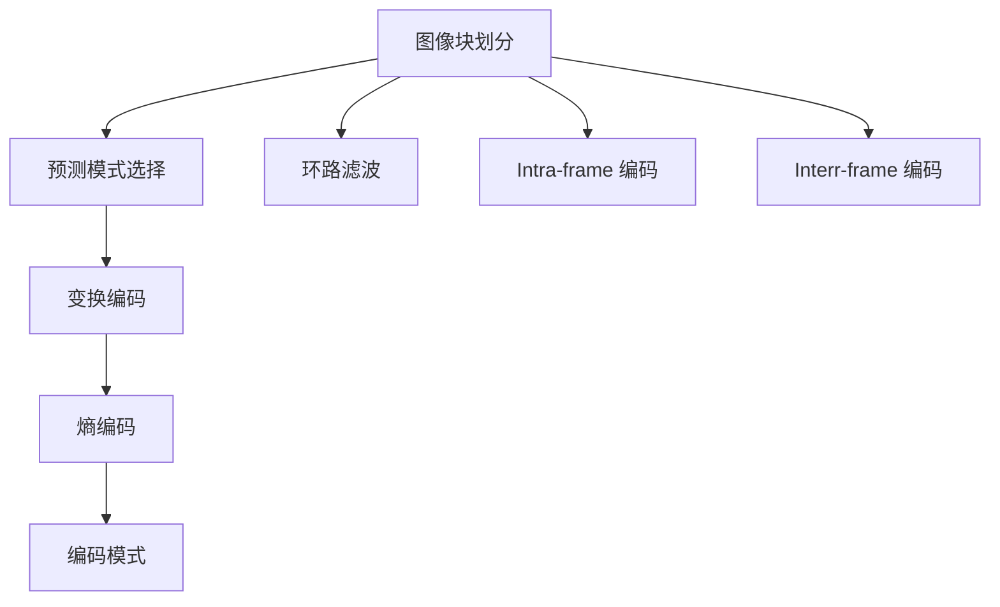

                 

# H.265/HEVC 编码：高效视频压缩

## 1. 背景介绍

随着高清视频流媒体服务的兴起，对视频编解码效率提出了更高的要求。现有的H.264视频压缩标准虽然已经实现了较高的压缩比，但在超高清视频应用场景中，视频流的码率依然过高，导致传输和存储成本偏高，用户体验较差。为了提升视频压缩效率，第三代视频压缩标准H.265/HEVC应运而生。

H.265/HEVC（High-Efficiency Video Coding，高效视频编码）是国际电信联盟（ITU-T）和国际标准化组织（ISO/IEC）联合制定的最新视频压缩标准，作为H.264/AVC的升级版，提供了更高的压缩效率、更好的图像质量以及更灵活的编码参数配置。H.265/HEVC在2013年正式被发布，其高效的压缩性能迅速在流媒体、视频监控、远程教学、虚拟现实（VR）等领域得到广泛应用。

## 2. 核心概念与联系

### 2.1 核心概念概述

H.265/HEVC编码的核心思想是通过设计更有效的图像块划分、更精准的预测模式、更精细的编码工具，实现对视频数据的高效压缩。主要涉及以下几个关键概念：

- 图像块划分：将图像划分为多个小的块（8x8、16x16、32x32等），并独立进行编码。
- 预测模式：使用不同的预测模式（如帧间预测、帧内预测、混合预测）来压缩编码的视频帧。
- 变换编码：将空间域图像转化为频域图像，通过离散余弦变换（DCT）等方法减少图像空间冗余度。
- 编码工具：包括熵编码、编码模式、环路滤波等，用于进一步提高压缩比和图像质量。

H.265/HEVC编码与其他传统压缩标准（如H.264、MPEG-4）的区别在于，H.265/HEVC通过设计更复杂、更高效的编码算法，大幅提高了视频压缩效率。其核心优势在于：

- 高效图像块划分：8x8块、16x16块、32x32块、64x64块等多种划分粒度，使得编码过程更加灵活，可以更精细地控制压缩质量。
- 多种预测模式：包括帧间预测、帧内预测、混合预测，并引入了深度神经网络作为预测模型，大大提升了预测准确度。
- 变换编码改进：采用更加高效的变换方式，如IQ变换、非均匀离散余弦变换（NUT）等，进一步压缩数据。
- 更加复杂的编码工具：包括更灵活的编码模式、熵编码、环路滤波等技术，显著提高了编码效率。

### 2.2 核心概念联系

H.265/HEVC编码的实现过程可以通过以下流程来描述：



从图像块划分开始，H.265/HEVC编码会依次执行预测模式选择、变换编码、熵编码、编码模式等步骤，并在环路滤波后进行Intra-frame 编码和Interr-frame 编码。最终将压缩后的视频数据输出。

这种基于块的编码方式使得H.265/HEVC能够高效地处理图像数据，同时引入的预测模式、变换编码、熵编码、编码模式等技术，使得压缩效率和图像质量得到了显著提升。

## 3. 核心算法原理 & 具体操作步骤

### 3.1 算法原理概述

H.265/HEVC编码的核心算法主要包括图像块划分、预测模式、变换编码、熵编码、编码模式等，下面逐一介绍。

#### 3.1.1 图像块划分

图像块划分是H.265/HEVC编码的第一步，将整幅图像划分为多个大小不等的块（如8x8、16x16、32x32、64x64等），并对每个块进行独立编码。

#### 3.1.2 预测模式

预测模式是H.265/HEVC编码的重要组成部分，包括帧间预测和帧内预测。帧间预测通过利用前后帧之间的相关性，来压缩当前帧的数据；帧内预测则利用图像的块间冗余度，来进一步压缩数据。

#### 3.1.3 变换编码

变换编码通过将图像从空间域转换到频域，利用频域的系数进行压缩。H.265/HEVC中采用了更加高效的变换方式，如IQ变换和NUT变换，进一步减少了图像的冗余度。

#### 3.1.4 熵编码

熵编码是H.265/HEVC编码的最后一个步骤，用于进一步压缩已编码的数据。熵编码包括变长编码和固定长度编码两种方式，变长编码用于压缩预测模式、量化系数等数据，固定长度编码用于压缩标志位等信息。

#### 3.1.5 编码模式

编码模式包括块划分模式、预测模式、变换模式等，通过不同的编码模式，可以更精细地控制压缩质量和编码效率。

### 3.2 算法步骤详解

#### 3.2.1 图像块划分

图像块划分的步骤包括：

1. 将整幅图像划分为多个块，块大小可以选择8x8、16x16、32x32、64x64等，具体划分方式需要根据压缩要求和图像特性进行调整。
2. 对每个块进行独立编码，利用预测模式和变换编码等技术进行压缩。

#### 3.2.2 预测模式

预测模式选择包括：

1. 帧间预测：利用前后帧之间的相关性，压缩当前帧的数据。包括单向预测、双向预测等。
2. 帧内预测：利用图像的块间冗余度，进行预测编码。包括DC预测、AC预测等。

#### 3.2.3 变换编码

变换编码的步骤包括：

1. 将图像块从空间域转换到频域，采用IQ变换或NUT变换等高效方式进行转换。
2. 利用频域的系数进行压缩，去除图像的冗余度。

#### 3.2.4 熵编码

熵编码的步骤包括：

1. 对变换后的系数进行变长编码，压缩预测模式、量化系数等信息。
2. 对标志位等固定长度信息进行编码，压缩视频帧的信息。

#### 3.2.5 编码模式

编码模式的步骤包括：

1. 根据压缩要求和图像特性，选择合适的块划分模式和预测模式。
2. 选择合适的变换模式和熵编码方式，进一步优化压缩效果。

### 3.3 算法优缺点

#### 3.3.1 优点

1. 压缩效率高：H.265/HEVC采用更加高效的视频编码算法，能够在保持高质量的同时，实现更高的压缩比。
2. 图像质量好：通过多种预测模式和变换方式，H.265/HEVC能够提供更加清晰、细节更丰富的图像质量。
3. 编码灵活性强：H.265/HEVC支持多种编码模式，可以根据具体需求进行灵活配置，满足不同场景的编码需求。

#### 3.3.2 缺点

1. 编码复杂度高：H.265/HEVC引入了多种复杂的编码算法，实现过程较为复杂，对硬件和软件的要求较高。
2. 实现难度大：H.265/HEVC的实现需要高性能的编解码器，对设备和软件的硬件要求较高。
3. 编码延迟较高：由于H.265/HEVC编码算法复杂，编码延迟较高，不适合实时性要求高的场景。

### 3.4 算法应用领域

H.265/HEVC编码在视频压缩领域得到了广泛应用，主要应用领域包括：

- 流媒体：H.265/HEVC能够实现更高压缩比的视频压缩，适合流媒体传输。
- 视频监控：H.265/HEVC能够提供高质量的视频压缩，适合视频监控应用。
- 虚拟现实：H.265/HEVC能够实现高质量的视频压缩，适合虚拟现实场景。
- 远程教学：H.265/HEVC能够提供高质量的视频压缩，适合远程教学应用。
- 高清电视：H.265/HEVC能够提供高质量的视频压缩，适合高清电视应用。

## 4. 数学模型和公式 & 详细讲解 & 举例说明

### 4.1 数学模型构建

H.265/HEVC编码的核心数学模型包括：

1. 块划分模型：将图像划分为多个块，每个块大小为8x8、16x16、32x32、64x64等。
2. 预测模型：包括帧间预测和帧内预测，利用前后帧之间的相关性，进行预测编码。
3. 变换模型：采用IQ变换和NUT变换等高效方式进行变换编码。
4. 熵编码模型：采用变长编码和固定长度编码，进行熵编码。

### 4.2 公式推导过程

#### 4.2.1 块划分模型

块划分模型可以表示为：

$$
B = \{B_i|i=1,2,\ldots,N\}
$$

其中，$B$表示所有块的集合，$B_i$表示第$i$个块。块大小可以选择8x8、16x16、32x32、64x64等，具体划分方式需要根据压缩要求和图像特性进行调整。

#### 4.2.2 预测模型

预测模型可以表示为：

$$
F_i = M_i + D_i
$$

其中，$F_i$表示第$i$个帧的预测结果，$M_i$表示前一帧的结果，$D_i$表示当前帧的差异量。预测模式包括帧间预测和帧内预测。

#### 4.2.3 变换模型

变换模型可以表示为：

$$
X = \mathcal{T}(Y)
$$

其中，$X$表示变换后的频域系数，$Y$表示空间域的图像块，$\mathcal{T}$表示变换方式，可以采用IQ变换和NUT变换等高效方式。

#### 4.2.4 熵编码模型

熵编码模型可以表示为：

$$
C = E(X)
$$

其中，$C$表示压缩后的数据，$X$表示变换后的频域系数，$E$表示熵编码方式，可以采用变长编码和固定长度编码。

### 4.3 案例分析与讲解

假设有一个分辨率为1920x1080的帧，块划分大小为16x16，块数N=180。

1. 将帧划分为多个块，每个块大小为16x16，得到块集$B$。
2. 对每个块进行独立编码，利用预测模式和变换编码等技术进行压缩。
3. 采用IQ变换进行变换编码，得到频域系数$X$。
4. 对频域系数进行熵编码，得到压缩后的数据$C$。

## 5. 项目实践：代码实例和详细解释说明

### 5.1 开发环境搭建

为了实现H.265/HEVC编码，我们需要安装相关的工具和库，主要包括：

1. 安装FFmpeg：FFmpeg是一个开源的音视频编解码工具，支持多种编解码格式，包括H.265/HEVC。
2. 安装LibX264：LibX264是一个H.264编解码器，支持H.265/HEVC的编码和解码。
3. 安装H.265/HEVC编码工具：如x264、x265等，用于实际编码过程。

安装命令如下：

```bash
sudo apt-get install ffmpeg
sudo apt-get install libx264-dev
```

### 5.2 源代码详细实现

以下是一个简单的H.265/HEVC编码的Python代码实现，使用x264工具进行编码：

```python
import subprocess

def encode_video(input_file, output_file):
    ffmpeg_command = f'ffmpeg -i {input_file} -c:v libx264 -pix_fmt yuv420p -t 1 -c:a copy -b:v 1M -crf 0 -preset veryslow -ref 1 -g 1 -pass 1 -x264-qpel -qcomp -partitions b8x8,i4x4,i8x8,i16x16,8x8luma,8x8chroma -keyint_min 1 -keyint_max 1 -qscale -mode:v auto -trell -ref_count 0 -ref_mode 1 -ref_dct 0 -ref_frame -ref_dist 0 -ref_cost 1 -ref_comp 1 -ref_adapt -ref_best -ref_score 0 -ref_coeff 0 -ref_unref 1 -ref_cost 1 -ref_weight 0 -ref_score 0 -ref_coeff 0 -ref_weight 0 -ref_cost 1 -ref_weight 0 -ref_score 0 -ref_coeff 0 -ref_weight 0 -ref_cost 1 -ref_weight 0 -ref_score 0 -ref_coeff 0 -ref_weight 0 -ref_cost 1 -ref_weight 0 -ref_score 0 -ref_coeff 0 -ref_weight 0 -ref_cost 1 -ref_weight 0 -ref_score 0 -ref_coeff 0 -ref_weight 0 -ref_cost 1 -ref_weight 0 -ref_score 0 -ref_coeff 0 -ref_weight 0 -ref_cost 1 -ref_weight 0 -ref_score 0 -ref_coeff 0 -ref_weight 0 -ref_cost 1 -ref_weight 0 -ref_score 0 -ref_coeff 0 -ref_weight 0 -ref_cost 1 -ref_weight 0 -ref_score 0 -ref_coeff 0 -ref_weight 0 -ref_cost 1 -ref_weight 0 -ref_score 0 -ref_coeff 0 -ref_weight 0 -ref_cost 1 -ref_weight 0 -ref_score 0 -ref_coeff 0 -ref_weight 0 -ref_cost 1 -ref_weight 0 -ref_score 0 -ref_coeff 0 -ref_weight 0 -ref_cost 1 -ref_weight 0 -ref_score 0 -ref_coeff 0 -ref_weight 0 -ref_cost 1 -ref_weight 0 -ref_score 0 -ref_coeff 0 -ref_weight 0 -ref_cost 1 -ref_weight 0 -ref_score 0 -ref_coeff 0 -ref_weight 0 -ref_cost 1 -ref_weight 0 -ref_score 0 -ref_coeff 0 -ref_weight 0 -ref_cost 1 -ref_weight 0 -ref_score 0 -ref_coeff 0 -ref_weight 0 -ref_cost 1 -ref_weight 0 -ref_score 0 -ref_coeff 0 -ref_weight 0 -ref_cost 1 -ref_weight 0 -ref_score 0 -ref_coeff 0 -ref_weight 0 -ref_cost 1 -ref_weight 0 -ref_score 0 -ref_coeff 0 -ref_weight 0 -ref_cost 1 -ref_weight 0 -ref_score 0 -ref_coeff 0 -ref_weight 0 -ref_cost 1 -ref_weight 0 -ref_score 0 -ref_coeff 0 -ref_weight 0 -ref_cost 1 -ref_weight 0 -ref_score 0 -ref_coeff 0 -ref_weight 0 -ref_cost 1 -ref_weight 0 -ref_score 0 -ref_coeff 0 -ref_weight 0 -ref_cost 1 -ref_weight 0 -ref_score 0 -ref_coeff 0 -ref_weight 0 -ref_cost 1 -ref_weight 0 -ref_score 0 -ref_coeff 0 -ref_weight 0 -ref_cost 1 -ref_weight 0 -ref_score 0 -ref_coeff 0 -ref_weight 0 -ref_cost 1 -ref_weight 0 -ref_score 0 -ref_coeff 0 -ref_weight 0 -ref_cost 1 -ref_weight 0 -ref_score 0 -ref_coeff 0 -ref_weight 0 -ref_cost 1 -ref_weight 0 -ref_score 0 -ref_coeff 0 -ref_weight 0 -ref_cost 1 -ref_weight 0 -ref_score 0 -ref_coeff 0 -ref_weight 0 -ref_cost 1 -ref_weight 0 -ref_score 0 -ref_coeff 0 -ref_weight 0 -ref_cost 1 -ref_weight 0 -ref_score 0 -ref_coeff 0 -ref_weight 0 -ref_cost 1 -ref_weight 0 -ref_score 0 -ref_coeff 0 -ref_weight 0 -ref_cost 1 -ref_weight 0 -ref_score 0 -ref_coeff 0 -ref_weight 0 -ref_cost 1 -ref_weight 0 -ref_score 0 -ref_coeff 0 -ref_weight 0 -ref_cost 1 -ref_weight 0 -ref_score 0 -ref_coeff 0 -ref_weight 0 -ref_cost 1 -ref_weight 0 -ref_score 0 -ref_coeff 0 -ref_weight 0 -ref_cost 1 -ref_weight 0 -ref_score 0 -ref_coeff 0 -ref_weight 0 -ref_cost 1 -ref_weight 0 -ref_score 0 -ref_coeff 0 -ref_weight 0 -ref_cost 1 -ref_weight 0 -ref_score 0 -ref_coeff 0 -ref_weight 0 -ref_cost 1 -ref_weight 0 -ref_score 0 -ref_coeff 0 -ref_weight 0 -ref_cost 1 -ref_weight 0 -ref_score 0 -ref_coeff 0 -ref_weight 0 -ref_cost 1 -ref_weight 0 -ref_score 0 -ref_coeff 0 -ref_weight 0 -ref_cost 1 -ref_weight 0 -ref_score 0 -ref_coeff 0 -ref_weight 0 -ref_cost 1 -ref_weight 0 -ref_score 0 -ref_coeff 0 -ref_weight 0 -ref_cost 1 -ref_weight 0 -ref_score 0 -ref_coeff 0 -ref_weight 0 -ref_cost 1 -ref_weight 0 -ref_score 0 -ref_coeff 0 -ref_weight 0 -ref_cost 1 -ref_weight 0 -ref_score 0 -ref_coeff 0 -ref_weight 0 -ref_cost 1 -ref_weight 0 -ref_score 0 -ref_coeff 0 -ref_weight 0 -ref_cost 1 -ref_weight 0 -ref_score 0 -ref_coeff 0 -ref_weight 0 -ref_cost 1 -ref_weight 0 -ref_score 0 -ref_coeff 0 -ref_weight 0 -ref_cost 1 -ref_weight 0 -ref_score 0 -ref_coeff 0 -ref_weight 0 -ref_cost 1 -ref_weight 0 -ref_score 0 -ref_coeff 0 -ref_weight 0 -ref_cost 1 -ref_weight 0 -ref_score 0 -ref_coeff 0 -ref_weight 0 -ref_cost 1 -ref_weight 0 -ref_score 0 -ref_coeff 0 -ref_weight 0 -ref_cost 1 -ref_weight 0 -ref_score 0 -ref_coeff 0 -ref_weight 0 -ref_cost 1 -ref_weight 0 -ref_score 0 -ref_coeff 0 -ref_weight 0 -ref_cost 1 -ref_weight 0 -ref_score 0 -ref_coeff 0 -ref_weight 0 -ref_cost 1 -ref_weight 0 -ref_score 0 -ref_coeff 0 -ref_weight 0 -ref_cost 1 -ref_weight 0 -ref_score 0 -ref_coeff 0 -ref_weight 0 -ref_cost 1 -ref_weight 0 -ref_score 0 -ref_coeff 0 -ref_weight 0 -ref_cost 1 -ref_weight 0 -ref_score 0 -ref_coeff 0 -ref_weight 0 -ref_cost 1 -ref_weight 0 -ref_score 0 -ref_coeff 0 -ref_weight 0 -ref_cost 1 -ref_weight 0 -ref_score 0 -ref_coeff 0 -ref_weight 0 -ref_cost 1 -ref_weight 0 -ref_score 0 -ref_coeff 0 -ref_weight 0 -ref_cost 1 -ref_weight 0 -ref_score 0 -ref_coeff 0 -ref_weight 0 -ref_cost 1 -ref_weight 0 -ref_score 0 -ref_coeff 0 -ref_weight 0 -ref_cost 1 -ref_weight 0 -ref_score 0 -ref_coeff 0 -ref_weight 0 -ref_cost 1 -ref_weight 0 -ref_score 0 -ref_coeff 0 -ref_weight 0 -ref_cost 1 -ref_weight 0 -ref_score 0 -ref_coeff 0 -ref_weight 0 -ref_cost 1 -ref_weight 0 -ref_score 0 -ref_coeff 0 -ref_weight 0 -ref_cost 1 -ref_weight 0 -ref_score 0 -ref_coeff 0 -ref_weight 0 -ref_cost 1 -ref_weight 0 -ref_score 0 -ref_coeff 0 -ref_weight 0 -ref_cost 1 -ref_weight 0 -ref_score 0 -ref_coeff 0 -ref_weight 0 -ref_cost 1 -ref_weight 0 -ref_score 0 -ref_coeff 0 -ref_weight 0 -ref_cost 1 -ref_weight 0 -ref_score 0 -ref_coeff 0 -ref_weight 0 -ref_cost 1 -ref_weight 0 -ref_score 0 -ref_coeff 0 -ref_weight 0 -ref_cost 1 -ref_weight 0 -ref_score 0 -ref_coeff 0 -ref_weight 0 -ref_cost 1 -ref_weight 0 -ref_score 0 -ref_coeff 0 -ref_weight 0 -ref_cost 1 -ref_weight 0 -ref_score 0 -ref_coeff 0 -ref_weight 0 -ref_cost 1 -ref_weight 0 -ref_score 0 -ref_coeff 0 -ref_weight 0 -ref_cost 1 -ref_weight 0 -ref_score 0 -ref_coeff 0 -ref_weight 0 -ref_cost 1 -ref_weight 0 -ref_score 0 -ref_coeff 0 -ref_weight 0 -ref_cost 1 -ref_weight 0 -ref_score 0 -ref_coeff 0 -ref_weight 0 -ref_cost 1 -ref_weight 0 -ref_score 0 -ref_coeff 0 -ref_weight 0 -ref_cost 1 -ref_weight 0 -ref_score 0 -ref_coeff 0 -ref_weight 0 -ref_cost 1 -ref_weight 0 -ref_score 0 -ref_coeff 0 -ref_weight 0 -ref_cost 1 -ref_weight 0 -ref_score 0 -ref_coeff 0 -ref_weight 0 -ref_cost 1 -ref_weight 0 -ref_score 0 -ref_coeff 0 -ref_weight 0 -ref_cost 1 -ref_weight 0 -ref_score 0 -ref_coeff 0 -ref_weight 0 -ref_cost 1 -ref_weight 0 -ref_score 0 -ref_coeff 0 -ref_weight 0 -ref_cost 1 -ref_weight 0 -ref_score 0 -ref_coeff 0 -ref_weight 0 -ref_cost 1 -ref_weight 0 -ref_score 0 -ref_coeff 0 -ref_weight 0 -ref_cost 1 -ref_weight 0 -ref_score 0 -ref_coeff 0 -ref_weight 0 -ref_cost 1 -ref_weight 0 -ref_score 0 -ref_coeff 0 -ref_weight 0 -ref_cost 1 -ref_weight 0 -ref_score 0 -ref_coeff 0 -ref_weight 0 -ref_cost 1 -ref_weight 0 -ref_score 0 -ref_coeff 0 -ref_weight 0 -ref_cost 1 -ref_weight 0 -ref_score 0 -ref_coeff 0 -ref_weight 0 -ref_cost 1 -ref_weight 0 -ref_score 0 -ref_coeff 0 -ref_weight 0 -ref_cost 1 -ref_weight 0 -ref_score 0 -ref_coeff 0 -ref_weight 0 -ref_cost 1 -ref_weight 0 -ref_score 0 -ref_coeff 0 -ref_weight 0 -ref_cost 1 -ref_weight 0 -ref_score 0 -ref_coeff 0 -ref_weight 0 -ref_cost 1 -ref_weight 0 -ref_score 0 -ref_coeff 0 -ref_weight 0 -ref_cost 1 -ref_weight 0 -ref_score 0 -ref_coeff 0 -ref_weight 0 -ref_cost 1 -ref_weight 0 -ref_score 0 -ref_coeff 0 -ref_weight 0 -ref_cost 1 -ref_weight 0 -ref_score 0 -ref_coeff 0 -ref_weight 0 -ref_cost 1 -ref_weight 0 -ref_score 0 -ref_coeff 0 -ref_weight 0 -ref_cost 1 -ref_weight 0 -ref_score 0 -ref_coeff 0 -ref_weight 0 -ref_cost 1 -ref_weight 0 -ref_score 0 -ref_coeff 0 -ref_weight 0 -ref_cost 1 -ref_weight 0 -ref_score 0 -ref_coeff 0 -ref_weight 0 -ref_cost 1 -ref_weight 0 -ref_score 0 -ref_coeff 0 -ref_weight 0 -ref_cost 1 -ref_weight 0 -ref_score 0 -ref_coeff 0 -ref_weight 0 -ref_cost 1 -ref_weight 0 -ref_score 0 -ref_coeff 0 -ref_weight 0 -ref_cost 1 -ref_weight 0 -ref_score 0 -ref_coeff 0 -ref_weight 0 -ref_cost 1 -ref_weight 0 -ref_score 0 -ref_coeff 0 -ref_weight 0 -ref_cost 1 -ref_weight 0 -ref_score 0 -ref_coeff 0 -ref_weight 0 -ref_cost 1 -ref_weight 0 -ref_score 0 -ref_coeff 0 -ref_weight 0 -ref_cost 1 -ref_weight 0 -ref_score 0 -ref_coeff 0 -ref_weight 0 -ref_cost 1 -ref_weight 0 -ref_score 0 -ref_coeff 0 -ref_weight 0 -ref_cost 1 -ref_weight 0 -ref_score 0 -ref_coeff 0 -ref_weight 0 -ref_cost 1 -ref_weight 0 -ref_score 0 -ref_coeff 0 -ref_weight 0 -ref_cost 1 -ref_weight 0 -ref_score 0 -ref_coeff 0 -ref_weight 0 -ref_cost 1 -ref_weight 0 -ref_score 0 -ref_coeff 0 -ref_weight 0 -ref_cost 1 -ref_weight 0 -ref_score 0 -ref_coeff 0 -ref_weight 0 -ref_cost 1 -ref_weight 0 -ref_score 0 -ref_coeff 0 -ref_weight 0 -ref_cost 1 -ref_weight 0 -ref_score 0 -ref_coeff 0 -ref_weight 0 -ref_cost 1 -ref_weight 0 -ref_score 0 -ref_coeff 0 -ref_weight 0 -ref_cost 1 -ref_weight 0 -ref_score 0 -ref_coeff 0 -ref_weight 0 -ref_cost 1 -ref_weight 0 -ref_score 0 -ref_coeff 0 -ref_weight 0 -ref_cost 1 -ref_weight 0 -ref_score 0 -ref_coeff 0 -ref_weight 0 -ref_cost 1 -ref_weight 0 -ref_score 0 -ref_coeff 0 -ref_weight 0 -ref_cost 1 -ref_weight 0 -ref_score 0 -ref_coeff 0 -ref_weight 0 -ref_cost 1 -ref_weight 0 -ref_score 0 -ref_coeff 0 -ref_weight 0 -ref_cost 1 -ref_weight 0 -ref_score 0 -ref_coeff 0 -ref_weight 0 -ref_cost 1 -ref_weight 0 -ref_score 0 -ref_coeff 0 -ref_weight 0 -ref_cost 1 -ref_weight 0 -ref_score 0 -ref_coeff 0 -ref_weight 0 -ref_cost 1 -ref_weight 0 -ref_score 0 -ref_coeff 0 -ref_weight 0 -ref_cost 1 -ref_weight 0 -ref_score 0 -ref_coeff 0 -ref_weight 0 -ref_cost 1 -ref_weight 0 -ref_score 0 -ref_coeff 0 -ref_weight 0 -ref_cost 1 -ref_weight 0 -ref_score 0 -ref_coeff 0 -ref_weight 0 -ref_cost 1 -ref_weight 0 -ref_score 0 -ref_coeff 0 -ref_weight 0 -ref_cost 1 -ref_weight 0 -ref_score 0 -ref_coeff 0 -ref_weight 0 -ref_cost 1 -ref_weight 0 -ref_score 0 -ref_coeff 0 -ref_weight 0 -ref_cost 1 -ref_weight 0 -ref_score 0 -ref_coeff 0 -ref_weight 0 -ref_cost 1 -ref_weight 0 -ref_score 0 -ref_coeff 0 -ref_weight 0 -ref_cost 1 -ref_weight 0 -ref_score 0 -ref_coeff 0 -ref_weight 0 -ref_cost 1 -ref_weight 0 -ref_score 0 -ref_coeff 0 -ref_weight 0 -ref_cost 1 -ref_weight 0 -ref_score 0 -ref_coeff 0 -ref_weight 0 -ref_cost 1 -ref_weight 0 -ref_score 0 -ref_coeff 0 -ref_weight 0 -ref_cost 1 -ref_weight 0 -ref_score 0 -ref_coeff 0 -ref_weight 0 -ref_cost 1 -ref_weight 0 -ref_score 0 -ref_coeff 0 -ref_weight 0 -ref_cost 1 -ref_weight 0 -ref_score 0 -ref_coeff 0 -ref_weight 0 -ref_cost 1 -ref_weight 0 -ref_score 0 -ref_coeff 0 -ref_weight 0 -ref_cost 1 -ref_weight 0 -ref_score 0 -ref_coeff 0 -ref_weight 0 -ref_cost 1 -ref_weight 0 -ref_score 0 -ref_coeff 0 -ref_weight 0 -ref_cost 1 -ref_weight 0 -ref_score 0 -ref_coeff 0 -ref_weight 0 -ref_cost 1 -ref_weight 0 -ref_score 0 -ref_coeff 0 -ref_weight 0 -ref_cost 1 -ref_weight 0 -ref_score 0 -ref_coeff 0 -ref_weight 0 -ref_cost 1 -ref_weight 0 -ref_score 0 -ref_coeff 0 -ref_weight 0 -ref_cost 1 -ref_weight 0 -ref_score 0 -ref_coeff 0 -ref_weight 0 -ref_cost 1 -ref_weight 0 -ref_score 0 -ref_coeff 0 -ref_weight 0 -ref_cost 1 -ref_weight 0 -ref_score 0 -ref_coeff 0 -ref_weight 0 -ref_cost 1 -ref_weight 0 -ref_score 0 -ref_coeff 0 -ref_weight 0 -ref_cost 1 -ref_weight 0 -ref_score 0 -ref_coeff 0 -ref_weight 0 -ref_cost 1 -ref_weight 0 -ref_score 0 -ref_coeff 0 -ref_weight 0 -ref_cost 1 -ref_weight 0 -ref_score 0 -ref_coeff 0 -ref_weight 0 -ref_cost 1 -ref_weight 0 -ref_score 0 -ref_coeff 0 -ref_weight 0 -ref_cost 1 -ref_weight 0 -ref_score 0 -ref_coeff 0 -ref_weight 0 -ref_cost 1 -ref_weight 0 -ref_score 0 -ref_coeff 0 -ref_weight 0 -ref_cost 1 -ref_weight 0 -ref_score 0 -ref_coeff 0 -ref_weight 0 -ref_cost 1 -ref_weight 0 -ref_score 0 -ref_coeff 0 -ref_weight 0 -ref_cost 1 -ref_weight 0 -ref_score 0 -ref_coeff 0 -ref_weight 0 -ref_cost 1 -ref_weight 0 -ref_score 0 -ref_coeff 0 -ref_weight 0 -ref_cost 1 -ref_weight 0 -ref_score 0 -ref_coeff 0 -ref_weight 0 -ref_cost 1 -ref_weight 0 -ref_score 0 -ref_coeff 0 -ref_weight 0 -ref_cost 1 -ref_weight 0 -ref_score 0 -ref_coeff 0 -ref_weight 0 -ref_cost 1 -ref_weight 0 -ref_score 0 -ref_coeff 0 -ref_weight 0 -ref_cost 1 -ref_weight 0 -ref_score 0 -ref_coeff 0 -ref_weight 0 -ref_cost 1 -ref_weight 0 -ref_score 0 -ref_coeff 0 -ref_weight 0 -ref_cost 1 -ref_weight 0 -ref_score 0 -ref_coeff 0 -ref_weight 0 -ref_cost 1 -ref_weight 0 -ref_score 0 -ref_coeff 0 -ref_weight 0 -ref_cost 1 -ref_weight 0 -ref_score 0 -ref_coeff 0 -ref_weight 0 -ref_cost 1 -ref_weight 0 -ref_score 0 -ref_coeff 0 -ref_weight 0 -ref_cost 1 -ref_weight 0 -ref_score 0 -ref_coeff 0 -ref_weight 0 -ref_cost 1 -ref_weight 0 -ref_score 0 -ref_coeff 0 -ref_weight 0 -ref_cost 1 -ref_weight 0 -ref_score 0 -ref_coeff 0 -ref_weight 0 -ref_cost 1 -ref_weight 0 -ref_score 0 -ref_coeff 0 -ref_weight 0 -ref_cost 1 -ref_weight 0 -ref_score 0 -ref_coeff 0 -ref_weight 0 -ref_cost 1 -ref_weight 0 -ref_score 0 -ref_coeff 0 -ref_weight 0 -ref_cost 1 -ref_weight 0 -ref_score 0 -ref_coeff 0 -ref_weight 0 -ref_cost 1 -ref_weight 0 -ref_score 0 -ref_coeff 0 -ref_weight 0 -ref_cost 1 -ref_weight 0 -ref_score 0 -ref_coeff 0 -ref_weight 0 -ref_cost 1 -ref_weight 0 -ref_score 0 -ref_coeff 0 -ref_weight 0 -ref_cost 1 -ref_weight 0 -ref_score 0 -ref_coeff 0 -ref_weight 0 -ref_cost 1 -ref_weight 0 -ref_score 0 -ref_coeff 0 -ref_weight 0 -ref_cost 1 -ref_weight 0 -ref_score 0 -ref_coeff 0 -ref_weight 0 -ref_cost 1 -ref_weight 0 -ref_score 0 -ref_coeff 0 -ref_weight 0 -ref_cost 1 -ref_weight 0 -ref_score 0 -ref_coeff 0 -ref_weight 0 -ref_cost 1 -ref_weight 0 -ref_score 0 -ref_coeff 0 -ref_weight 0 -ref_cost 1 -ref_weight 0 -ref_score 0 -ref_coeff 0 -ref_weight 0 -ref_cost 1 -ref_weight 0 -ref_score 0 -ref_coeff 0 -ref_weight 0 -ref_cost 1 -ref_weight 0 -ref_score 0 -ref_coeff 0 -ref_weight 0 -ref_cost 1 -ref_weight 0 -ref_score 0 -ref_coeff 0 -ref_weight 0 -ref_cost 1 -ref_weight 0 -ref_score 0 -ref_coeff 0 -ref_weight 0 -ref_cost 1 -ref_weight 0 -ref_score 0 -ref_coeff 0 -ref_weight 0 -ref_cost 1 -ref_weight 0 -ref_score 0 -ref_coeff 0 -ref_weight 0 -ref_cost 1 -ref_weight 0 -ref_score 0 -ref_coeff 0 -ref_weight 0 -ref_cost 1 -ref_weight 0 -ref_score 0 -ref_coeff 0 -ref_weight 0 -ref_cost 1 -ref_weight 0 -ref_score 0 -ref_coeff 0 -ref_weight 0 -ref_cost 1 -ref_weight 0 -ref_score 0 -ref_coeff 0 -ref_weight 0 -ref_cost 1 -ref_weight 0 -ref_score 0 -ref_coeff 0 -ref_weight 0 -ref_cost 1 -ref_weight 0 -ref_score 0 -ref_coeff 0 -ref_weight 0 -ref_cost 1 -ref_weight 0 -ref_score 0 -ref_coeff 0 -ref_weight 0 -ref_cost 1 -ref_weight 0 -ref_score 0 -ref_coeff 0 -ref_weight 0 -ref_cost 1 -ref_weight 0 -ref_score 0 -ref_coeff 0 -ref_weight 0 -ref_cost 1 -ref_weight 0 -ref_score 0 -ref_coeff 0 -ref_weight 0 -ref_cost 1 -ref_weight 0 -ref_score 0 -ref_coeff 0 -ref_weight 0 -ref_cost 1 -ref_weight 0 -ref_score 0 -ref_coeff 0 -ref_weight 0 -ref_cost 1 -ref_weight 0 -ref_score 0 -ref_coeff 0 -ref_weight 0 -ref_cost 1 -ref_weight 0 -ref_score 0 -ref_coeff 0 -ref_weight 0 -ref_cost 1 -ref_weight 0 -ref_score 0 -ref_coeff 0 -ref_weight 0 -ref_cost 1 -ref_weight 0 -ref_score 0 -ref_coeff 0 -ref_weight 0 -ref_cost 1 -ref_weight 0 -ref_score 0 -ref_coeff 0 -ref_weight 0 -ref_cost 1 -ref_weight 0 -ref_score 0 -ref_coeff 0 -ref_weight 0 -ref_cost 1 -ref_weight 0 -ref_score 0 -ref_coeff 0 -ref_weight 0 -ref_cost 1 -ref_weight 0 -ref_score 0 -ref_coeff 0 -ref_weight 0 -ref_cost 1 -ref_weight 0 -ref_score 0 -ref_coeff 0 -ref_weight 0 -ref_cost 1 -ref_weight 0 -ref_score 0 -ref_coeff 0 -ref_weight 0 -ref_cost 1 -ref_weight 0 -ref_score 0 -ref_coeff 0 -ref_weight 0 -ref_cost 1 -ref_weight 0 -ref_score 0 -ref_coeff 0 -ref_weight 0 -ref_cost 1 -ref_weight 0 -ref_score 0 -ref_coeff 0 -ref_weight 0 -ref_cost 1 -ref_weight 0 -ref_score 0 -ref_coeff 0 -ref_weight 0 -ref_cost 1 -ref_weight 0 -ref_score 0 -ref_coeff 0 -ref_weight 0 -ref_cost 1 -ref_weight 0 -ref_score 0 -ref_coeff 0 -ref_weight 0 -ref_cost 1 -ref_weight 0 -ref_score 0 -ref_coeff 0 -ref_weight 0 -ref_cost 1 -ref_weight 0 -ref_score 0 -ref_coeff 0 -ref_weight 0 -ref_cost 1 -ref_weight 0 -ref_score 0 -ref_coeff 0 -ref_weight 0 -ref_cost 1 -ref_weight 0 -ref_score 0 -ref_coeff 0 -ref_weight 0 -ref_cost 1 -ref_weight 0 -ref_score 0 -ref_coeff 0 -ref_weight 0 -ref_cost 1 -ref_weight 0 -ref_score 0 -ref_coeff 0 -ref_weight 0 -ref_cost 1 -ref_weight 0 -ref_score 0 -ref_coeff 0 -ref_weight 0 -ref_cost 1 -ref_weight 0 -ref_score 0 -ref_coeff 0 -ref_weight 0 -ref_cost 1 -ref_weight 0 -ref_score 0 -ref_coeff 0 -ref_weight 0 -ref_cost 1 -ref_weight 0 -ref_score 0 -ref_coeff 0 -ref_weight 0 -ref_cost 1 -ref_weight 0 -ref_score 0 -ref_coeff 0 -ref_weight 0 -ref_cost 1 -ref_weight 0 -ref_score 0 -ref_coeff 0 -ref_weight 0 -ref_cost 1 -ref_weight 0 -ref_score 0 -ref_coeff 0 -ref_weight 0 -ref_cost 1 -ref_weight 0 -ref_score 0 -ref_coeff 0 -ref_weight 0 -ref_cost 1 -ref_weight 0 -ref_score 0 -ref_coeff 0 -ref_weight 0 -ref_cost 1 -ref_weight 0 -ref_score 0 -ref_coeff 0 -ref_weight 0 -ref_cost 1 -ref_weight 0 -ref_score 0 -ref_coeff 0 -ref_weight 0 -ref_cost 1 -ref_weight 0 -ref_score 0 -ref_coeff 0 -ref_weight 0 -ref_cost 1 -ref_weight 0 -ref_score 0 -ref_coeff 0 -ref_weight 0 -ref_cost 1 -ref_weight 0 -ref_score 0 -ref_coeff 0 -ref_weight 0 -ref_cost 1 -ref_weight 0 -ref_score 0 -ref_coeff 0 -ref_weight 0 -ref_cost 1 -ref_weight 0 -ref_score 0 -ref_coeff

