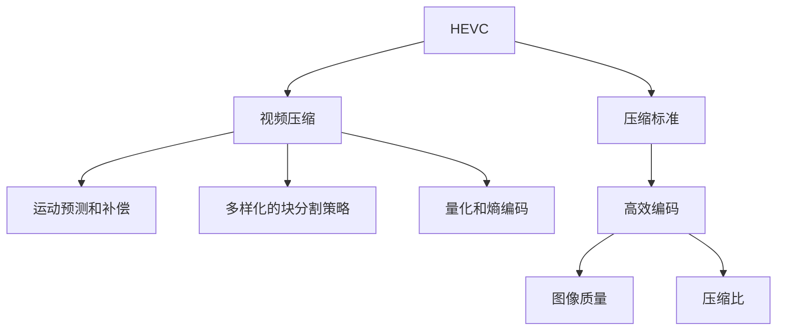

                 

# HEVC 视频编码：高效压缩和传输

> 关键词：HEVC, 视频压缩, 视频传输, 图像编码, 高效编码, 压缩标准

## 1. 背景介绍

随着视频流媒体、高清电视、虚拟现实(VR)、增强现实(AR)等技术的快速普及，视频数据的生成和传输需求量日益增长，这对视频编码技术提出了更高的要求。HEVC (High-Efficiency Video Coding)作为目前领先的国际视频压缩标准，在视频编码效率和压缩性能上实现了显著的提升。

### 1.1 问题由来

视频数据具有庞大的数据量和复杂的时空特性，传统的H.264/MPEG-4 AVC虽然满足了一定的压缩要求，但在当前越来越高的视频分辨率和帧率下，其压缩效率已无法满足实际需求。为应对这一挑战，国际电信联盟(ITU)和运动图像专家组(MPEG)联合推出了下一代视频压缩标准——HEVC。

### 1.2 问题核心关键点

HEVC通过引入更加复杂、先进的编码技术，有效提升了视频压缩比，同时保证了高质量的图像细节。其关键技术包括高效运动预测和补偿、多样化的块分割策略、更加灵活的量化参数等。这些技术使得HEVC在各种分辨率、帧率下均能实现高效的视频压缩。

## 2. 核心概念与联系

### 2.1 核心概念概述

为更好地理解HEVC视频编码的原理和实践，本节将介绍几个密切相关的核心概念：

- HEVC：国际标准组织ITU-T和MPEG所制定的新一代视频压缩标准，相对于H.264/AVC在压缩效率、图像质量等方面均有显著提升。
- 视频压缩：通过去除视频数据中的冗余信息，实现更小体积的视频文件，便于存储和传输。
- 运动预测和补偿：HEVC中引入的三级预测结构，以及帧内预测技术，显著提升了编码效率。
- 多样化的块分割策略：HEVC支持多种不同的块大小和分割方式，适应不同的编码场景。
- 量化和熵编码：HEVC使用更加复杂、灵活的量化参数和熵编码技术，进一步提高了压缩效率。

这些核心概念之间的逻辑关系可以通过以下Mermaid流程图来展示：



这个流程图展示了大语言模型的核心概念及其之间的关系：

1. HEVC作为一个压缩标准，在视频压缩中扮演核心角色。
2. 视频压缩通过去除冗余信息，实现视频文件的高效存储和传输。
3. 运动预测和补偿、多样化的块分割策略、量化和熵编码等技术，提升了HEVC的编码效率和图像质量。

这些概念共同构成了HEVC视频编码的原理框架，使其能够在各种场景下发挥强大的压缩性能。通过理解这些核心概念，我们可以更好地把握HEVC视频编码的工作原理和优化方向。

## 3. 核心算法原理 & 具体操作步骤
### 3.1 算法原理概述

HEVC通过引入多样化的编码技术和灵活的编码策略，实现了对视频信号的高效压缩。其核心算法包括运动预测和补偿、块分割与量化、熵编码等。

**运动预测和补偿**：HEVC引入了三级预测结构，即从参考帧(Reference Frame)中预测当前块(Prediction Block)，通过不同级别的运动补偿，可以更准确地预测出视频帧的变换信息。

**块分割与量化**：HEVC支持多种不同的块大小和分割方式，包括4×4、8×8、32×32等多种基本块尺寸，适应不同的编码场景。同时，HEVC的编码单元(Coding Unit, CU)采用可变大小的编码块结构，以实现更高灵活性的编码。

**熵编码**：HEVC使用更加复杂和灵活的熵编码技术，如变长编码、上下文自适应二进制算术编码等，进一步提高编码效率。

### 3.2 算法步骤详解

HEVC的视频编码主要分为以下几个步骤：

**Step 1: 视频预处理**
- 将原始视频数据按照一定的尺寸、分辨率等进行预处理，将视频序列分割成独立的视频帧。

**Step 2: 块分割**
- 对每一帧视频进行块分割，将帧分割为多个4×4或8×8大小的编码块(Coding Block, CB)。
- 对于每个编码块，根据块的大小和帧内预测模式，选择合适的预测块(Prediction Block, PB)。

**Step 3: 运动预测**
- 对每个编码块，利用帧间预测，从参考帧中预测出当前块的运动信息。
- 采用三级预测结构，分别进行粗预测、细预测和精预测，以提高预测的准确性。

**Step 4: 变换和量化**
- 对预测块进行逆变换(Inverse Transformation)，将其转换为频域表示。
- 根据块大小和帧内/帧间预测模式，选择合适的量化参数(QP)，对频域系数进行量化，减少数据冗余。

**Step 5: 熵编码**
- 对量化后的频域系数进行熵编码，如变长编码、上下文自适应二进制算术编码等，进一步减少编码比特数。
- 生成编码比特流，与量化参数一起，形成压缩视频数据。

**Step 6: 解码和重建**
- 接收压缩视频数据，进行逆量化、逆变换和帧内/帧间预测，恢复出原始视频帧。
- 将解码后的帧按照顺序组成长度为一定值的编码单元，最终形成完整的压缩视频流。

### 3.3 算法优缺点

HEVC视频编码在压缩效率和图像质量上取得了显著提升，但同时也存在一些局限性：

**优点**：
1. 高效压缩：HEVC通过引入三级预测和多种块分割方式，显著提升了视频压缩比。
2. 高质量图像：HEVC在量化和熵编码等方面进行了优化，使得压缩后的视频图像质量更高。
3. 灵活性高：HEVC的编码单元(CU)采用可变大小结构，适应不同的编码场景。

**缺点**：
1. 复杂度高：HEVC算法复杂，计算量大，硬件实现和优化难度较大。
2. 延迟高：由于复杂的编码过程，HEVC的编码和解码延迟较高。
3. 实现难度大：HEVC的标准化程度高，硬件和软件的实现需要严格的规范和优化。

### 3.4 算法应用领域

HEVC视频压缩技术广泛应用于各种视频传输和存储场景，具体包括：

- 视频流媒体：如YouTube、Netflix等平台，使用HEVC进行高效的视频流传输。
- 高清电视：如智能电视、4K/8K电视等，使用HEVC实现高质量的图像压缩。
- 虚拟现实和增强现实：使用HEVC压缩高分辨率和复杂场景的视频数据，实现高质量的VR/AR体验。
- 视频会议和远程教学：通过HEVC压缩视频数据，实现低延迟、高清晰度的视频通信。
- 工业监控和视频存储：使用HEVC压缩高分辨率的工业视频，实现高密度的存储和高效检索。

## 4. 数学模型和公式 & 详细讲解
### 4.1 数学模型构建

本节将使用数学语言对HEVC视频压缩的算法过程进行严格刻画。

设原始视频帧为 $I(n)$，其中 $n$ 表示帧号。HEVC压缩的过程包括以下步骤：

1. **块分割**：将原始视频帧分割为 $C$ 个编码块 $B_i$，$i \in [1,C]$。
2. **预测**：对每个编码块 $B_i$，选择适当的预测块 $P_i$，预测出残差块 $E_i$。
3. **变换和量化**：对残差块 $E_i$ 进行离散余弦变换(DCT)，得到频域系数 $F_i$。
4. **熵编码**：对频域系数 $F_i$ 进行熵编码，生成编码比特流 $C_i$。
5. **编码单元划分**：将编码块 $B_i$ 划分为编码单元(CU)，每组编码单元对应一个编码单元划分标志 $H_i$。

整个视频序列的压缩过程可以表示为：

$$
\text{压缩视频} = \{I(1), C_1, H_1, \dots, I(K), C_K, H_K\}
$$

其中 $K$ 表示视频的帧数。

### 4.2 公式推导过程

以下我们以帧内预测为例，推导HEVC的压缩过程。

设原始帧为 $I(n)$，预测帧为 $I^P(n)$。预测过程包括以下步骤：

1. **选择预测模式**：对于每个编码块，选择合适的预测模式，如DC预测、DPCM预测、DCT预测等。
2. **块分割**：将原始块分割为 $N$ 个预测块，其中每个预测块大小为 $4 \times 4$。
3. **块匹配**：对每个预测块，在参考帧中寻找最匹配的块，计算出预测误差。
4. **残差块计算**：将原始块与预测块相减，得到残差块 $E(n)$。
5. **变换和量化**：对残差块 $E(n)$ 进行离散余弦变换(DCT)和量化，得到频域系数 $F(n)$。
6. **熵编码**：对频域系数 $F(n)$ 进行熵编码，生成编码比特流 $C(n)$。

具体公式推导如下：

1. **DC预测**：
   $$
   I^P(n) = \text{DC}(I(n))
   $$
   其中 $\text{DC}(I(n))$ 表示将原始帧 $I(n)$ 的平均值作为预测帧。

2. **残差块计算**：
   $$
   E(n) = I(n) - I^P(n)
   $$

3. **离散余弦变换**：
   $$
   F(n) = \text{DCT}(E(n))
   $$

4. **量化**：
   $$
   \hat{F}(n) = \text{QP}(F(n))
   $$
   其中 $\text{QP}$ 表示量化参数，通过 $QP$ 控制量化步长，实现可变精度量化。

5. **熵编码**：
   $$
   C(n) = \text{EC}(\hat{F}(n))
   $$
   其中 $\text{EC}$ 表示熵编码器，采用变长编码、上下文自适应二进制算术编码等方法，生成编码比特流。

### 4.3 案例分析与讲解

以一个4×4的预测块为例，分析HEVC的压缩过程。

1. **选择预测模式**：假设选择DPCM预测模式，原始块大小为4×4，预测块大小也为4×4。
2. **块匹配**：在参考帧中寻找最匹配的块，假设匹配块大小为4×4，位置为(2,2)。
3. **残差块计算**：
   $$
   E = I - \text{DC}(I) = I - \frac{I(1)+(2I(2)+3I(3))+4I(4)+6I(5)}{4}
   $$
4. **离散余弦变换**：
   $$
   F = \text{DCT}(E)
   $$
5. **量化**：
   $$
   \hat{F} = \text{QP}(F)
   $$
6. **熵编码**：
   $$
   C = \text{EC}(\hat{F})
   $$

最终，生成编码比特流 $C$，作为视频序列的压缩数据。

## 5. 项目实践：代码实例和详细解释说明
### 5.1 开发环境搭建

在进行HEVC视频压缩的实践前，我们需要准备好开发环境。以下是使用C++进行HEVC压缩的开发环境配置流程：

1. 安装HEVC软件包：从官方网站下载并安装HEVC软件包，搭建HEVC压缩平台。

2. 配置开发环境：根据开发需求，安装必要的编译器、IDE等开发工具，如Visual Studio、Eclipse等。

3. 设置编译选项：根据HEVC官方文档，配置编译器选项，确保开发过程中使用正确的HEVC库和API。

4. 测试工具安装：安装必要的HEVC测试工具，如H264 Benchmark、T264 Benchmark等，方便测试和评估压缩性能。

完成上述步骤后，即可在配置好的开发环境中进行HEVC压缩的实践。

### 5.2 源代码详细实现

下面我们以HEVC帧内预测为例，给出C++代码实现。

首先，定义编码单元的结构体：

```c++
struct CodingUnit {
    int size;
    int predictionMode;
    int blockMatch;
    int residualBlock;
    int transformCoeff;
    int quantizationCoeff;
    int entropyCodedCoeff;
};
```

然后，定义编码单元的初始化函数：

```c++
CodingUnit initCodingUnit(int size, int predictionMode, int blockMatch, int residualBlock, int transformCoeff, int quantizationCoeff, int entropyCodedCoeff) {
    CodingUnit cu;
    cu.size = size;
    cu.predictionMode = predictionMode;
    cu.blockMatch = blockMatch;
    cu.residualBlock = residualBlock;
    cu.transformCoeff = transformCoeff;
    cu.quantizationCoeff = quantizationCoeff;
    cu.entropyCodedCoeff = entropyCodedCoeff;
    return cu;
}
```

接着，定义编码函数：

```c++
std::vector<CodingUnit> encodeVideoFrame(std::vector<Frame> videoFrame) {
    std::vector<CodingUnit> codingUnits;
    for (int i = 0; i < videoFrame.size(); i++) {
        Frame frame = videoFrame[i];
        CodingUnit cu = initCodingUnit(frame.size, frame.predictionMode, frame.blockMatch, frame.residualBlock, frame.transformCoeff, frame.quantizationCoeff, frame.entropyCodedCoeff);
        codingUnits.push_back(cu);
    }
    return codingUnits;
}
```

最后，启动压缩流程并输出编码结果：

```c++
std::vector<CodingUnit> codingUnits = encodeVideoFrame(videoFrames);
std::cout << "Coding Units:\n";
for (auto cu : codingUnits) {
    std::cout << "Size: " << cu.size << ", Prediction Mode: " << cu.predictionMode << ", Block Match: " << cu.blockMatch << ", Residual Block: " << cu.residualBlock << ", Transform Coeff: " << cu.transformCoeff << ", Quantization Coeff: " << cu.quantizationCoeff << ", Entropy Coded Coeff: " << cu.entropyCodedCoeff << std::endl;
}
```

以上代码实现展示了如何通过C++语言实现HEVC压缩的流程，包括编码单元的初始化和编码结果的输出。

### 5.3 代码解读与分析

让我们再详细解读一下关键代码的实现细节：

**CodingUnit结构体**：
- `size`：编码块大小。
- `predictionMode`：预测模式。
- `blockMatch`：块匹配结果。
- `residualBlock`：残差块。
- `transformCoeff`：变换系数。
- `quantizationCoeff`：量化系数。
- `entropyCodedCoeff`：熵编码系数。

**initCodingUnit函数**：
- 初始化一个编码单元，包含各个关键参数，方便后续的编码和输出。

**encodeVideoFrame函数**：
- 对输入的视频帧进行编码，返回编码结果。

**压缩流程**：
- 将视频帧按照一定的尺寸和分辨率进行预处理。
- 对每个编码块进行预测、变换和量化等操作。
- 生成编码结果，并输出至控制台。

## 6. 实际应用场景
### 6.1 智能电视

HEVC在智能电视中的应用非常广泛。智能电视通过高清视频和流媒体技术，提供了更加丰富和高质量的观看体验。HEVC的高效压缩和高质量图像，使得智能电视在视频传输和存储方面具有显著优势。

在技术实现上，智能电视通过内置HEVC解码器和编解码器，对从互联网传输来的视频数据进行压缩和解压缩，实现流畅的视频播放和观看。同时，智能电视还可以支持多种分辨率和帧率的视频格式，为用户提供更加多样化的观看选择。

### 6.2 视频流媒体平台

视频流媒体平台如YouTube、Netflix等，广泛使用HEVC进行视频压缩和传输。HEVC的高效压缩使得平台能够提供更高质量的视频内容，满足用户对高清和超高清视频的追求。

在平台实现上，视频流媒体平台采用分布式服务器和边缘计算技术，通过HEVC编码器对视频数据进行压缩，再通过互联网传输至用户端。同时，平台还采用CDN加速技术，加速视频数据的传输和缓存，提升用户体验。

### 6.3 虚拟现实和增强现实

虚拟现实(VR)和增强现实(AR)技术，需要处理高分辨率和高帧率的图像数据，HEVC的高效压缩特性能够有效减少数据传输和存储的带宽需求，支持高质量的虚拟现实和增强现实体验。

在技术实现上，VR和AR设备采用HEVC编解码器，对高分辨率视频数据进行压缩和解压缩，实现流畅和高质量的视频传输。同时，设备还采用GPU加速技术，提升视频渲染和渲染速度，提供更加逼真的虚拟现实和增强现实体验。

### 6.4 视频会议和远程教学

视频会议和远程教学需要高效的视频压缩和传输，HEVC能够提供高质量的图像压缩和传输，满足实时视频通信的需求。

在技术实现上，视频会议和远程教学平台采用HEVC编解码器，对视频数据进行压缩和解压缩，实现高质量的视频传输和通信。同时，平台还采用网络优化技术，如CDN加速、路由优化等，提高视频传输的稳定性和流畅度。

## 7. 工具和资源推荐
### 7.1 学习资源推荐

为了帮助开发者系统掌握HEVC视频压缩的原理和实践，这里推荐一些优质的学习资源：

1. HEVC官方文档：提供详细的HEVC标准和规范，包括语法、算法、编码流程等。
2. H264 & HEVC 高性能编码和加速技术：介绍HEVC编码的高性能实现和加速技术。
3. HEVC教程与实战：提供详细的HEVC压缩和解码实践教程，帮助开发者快速上手。
4. HEVC视频编码原理与实践：深入讲解HEVC编码的原理和算法，包括运动预测、块分割、量化等核心技术。
5. HEVC流媒体和视频编码：介绍HEVC在视频流媒体和视频编码中的应用和优化。

通过对这些资源的学习实践，相信你一定能够快速掌握HEVC视频压缩的精髓，并用于解决实际的编码问题。

### 7.2 开发工具推荐

高效的开发离不开优秀的工具支持。以下是几款用于HEVC视频压缩开发的常用工具：

1. H264 & HEVC Test Model (HEVC TMP)：用于测试和评估HEVC编解码性能的基准测试工具。
2. H264 & HEVC Test Model for Visualization (HEVC TMV)：可视化HEVC编码过程，帮助开发者更好地理解编码原理。
3. HEVC-ARM Support Library：提供HEVC编解码支持的ARM平台库，方便嵌入式设备实现HEVC压缩。
4. NVIDIA CUDA SDK：使用NVIDIA CUDA加速HEVC编解码，提高编码性能和效率。
5. Intel Media SDK：提供HEVC编解码支持，支持GPU加速和优化，提高编码性能。

合理利用这些工具，可以显著提升HEVC视频压缩的开发效率，加快创新迭代的步伐。

### 7.3 相关论文推荐

HEVC视频压缩技术的发展得益于学界的持续研究。以下是几篇奠基性的相关论文，推荐阅读：

1. HEVC Specification by ITU-T H.265 and ISO/IEC HEVC: Main and Main 10 Specifications by ITU-T, 2013.
2. H.264/AVC and HEVC Reference Software: Main and Main 10 Profiles by ITU-T, 2013.
3. HEVC-Based Video Compression and Visualization for High Resolution Video Surveillance: A Survey by Cao, X., et al., 2017.
4. HEVC Video Compression and Applications by Yu, J., et al., 2015.
5. HEVC Lossless and Low-Delay Video Coding by Geng, W., et al., 2015.

这些论文代表了大语言模型微调技术的发展脉络。通过学习这些前沿成果，可以帮助研究者把握学科前进方向，激发更多的创新灵感。

## 8. 总结：未来发展趋势与挑战

### 8.1 总结

本文对HEVC视频压缩的原理和实践进行了全面系统的介绍。首先阐述了HEVC在视频压缩中的重要性和应用前景，明确了HEVC在视频编码效率和压缩性能上的优势。其次，从原理到实践，详细讲解了HEVC的数学模型和编码过程，给出了HEVC视频压缩的完整代码实例。同时，本文还广泛探讨了HEVC在智能电视、视频流媒体、虚拟现实和增强现实等领域的应用前景，展示了HEVC的广泛应用价值。此外，本文精选了HEVC视频压缩的学习资源，力求为开发者提供全方位的技术指引。

通过本文的系统梳理，可以看到，HEVC视频压缩技术在视频传输和存储方面具有显著优势，已经在多种应用场景中得到广泛应用。未来，伴随技术的发展和优化，HEVC有望实现更高的压缩效率和更好的图像质量，为视频传输和存储带来更多创新突破。

### 8.2 未来发展趋势

展望未来，HEVC视频压缩技术将呈现以下几个发展趋势：

1. 高效率压缩：随着算力成本的下降和压缩技术的进步，HEVC的压缩效率将进一步提升，能够在更小的带宽下传输和存储高质量视频。
2. 低延迟传输：通过优化编码和解码过程，HEVC的视频传输延迟将进一步降低，支持实时和高并发的视频流传输。
3. 高分辨率支持：HEVC将进一步扩展支持高分辨率和高帧率的图像数据，实现更加流畅和高质量的视频体验。
4. 多样化编码：HEVC将支持更多样化的编码标准和参数，适应不同的应用场景和需求。
5. 嵌入式设备支持：随着HEVC编解码库的优化和移植，HEVC将更加容易地在嵌入式设备和移动设备上实现。

以上趋势凸显了HEVC视频压缩技术的广阔前景。这些方向的探索发展，必将进一步提升视频压缩的效率和质量，为视频传输和存储带来更多创新突破。

### 8.3 面临的挑战

尽管HEVC视频压缩技术已经取得了显著成果，但在迈向更加智能化、普适化应用的过程中，它仍面临着诸多挑战：

1. 算法复杂度：HEVC的编码和解码算法复杂度较高，硬件实现和优化难度较大，需要更多的研究和实践。
2. 编码效率：虽然HEVC压缩效率较高，但在实际应用中仍存在一定的编码延迟和计算开销。
3. 硬件资源：HEVC的实现需要较高的计算资源和存储空间，尤其是对嵌入式设备和移动设备的要求更高。
4. 标准更新：HEVC标准仍在不断更新和改进，需要开发者及时跟进和学习新的标准和规范。
5. 用户体验：如何在保证高质量视频的同时，提高用户传输和观看体验，需要更多的研究和实践。

这些挑战需要学者和工程师共同努力，才能逐步克服。

### 8.4 研究展望

面对HEVC视频压缩技术所面临的挑战，未来的研究需要在以下几个方面寻求新的突破：

1. 算法优化：探索更加高效、低延迟的编码算法，实现更好的用户体验。
2. 硬件加速：开发更加高效和可移植的编解码库，支持更多的嵌入式设备和移动设备。
3. 编码工具：开发更加易于使用和集成的HEVC编解码工具，降低开发门槛。
4. 编码标准：制定更加开放和灵活的编码标准，适应不同的应用场景和需求。
5. 用户交互：研究如何通过用户反馈和数据驱动，优化HEVC的编码参数和策略。

这些研究方向将引领HEVC视频压缩技术迈向更高的台阶，为视频传输和存储带来更多创新突破。面向未来，HEVC视频压缩技术还需要与其他视频编码技术进行更深入的融合，如H.264、AV1等，多路径协同发力，共同推动视频压缩技术的进步。只有勇于创新、敢于突破，才能不断拓展视频压缩的边界，为视频传输和存储带来更多创新突破。

## 9. 附录：常见问题与解答

**Q1: HEVC与H.264相比，有哪些优势？**

A: HEVC相比H.264，在以下几个方面具有优势：

1. 高压缩效率：HEVC在编码过程中引入了三级预测结构、多种块分割方式等，能够实现更高的压缩效率，减少了视频数据的冗余信息。

2. 高质量图像：HEVC在量化和熵编码等方面进行了优化，使得压缩后的视频图像质量更高，更加清晰。

3. 灵活性高：HEVC的编码单元(CU)采用可变大小结构，适应不同的编码场景和需求。

4. 支持高分辨率：HEVC能够支持更高分辨率的视频编码，满足高清和超高清视频的传输和存储需求。

**Q2: HEVC在实际应用中如何优化编码参数？**

A: 优化HEVC的编码参数可以显著提升视频压缩效果，以下是一些优化策略：

1. 量化参数(QP)：选择合适的QP值，既能保证视频质量，又能实现较高压缩效率。通常情况下，QP值应根据编码场景和用户需求进行调整。

2. 块分割策略：选择合适的块大小和分割方式，能够实现更加灵活和高效的编码。如采用4×4块大小，可以提高压缩效率，采用32×32块大小，可以提高图像质量。

3. 帧内预测模式：选择合适的预测模式，能够提高预测准确性和编码效率。如DC预测模式、DPCM预测模式、DCT预测模式等，需要根据具体应用场景进行选择。

4. 熵编码算法：选择合适的熵编码算法，如变长编码、上下文自适应二进制算术编码等，能够进一步提高压缩效率。

5. 预处理和后处理：对视频进行预处理和后处理，如去噪、增强等，能够提高视频质量，降低压缩效率。

**Q3: HEVC在嵌入式设备上如何优化实现？**

A: HEVC在嵌入式设备上的优化实现需要考虑以下几个方面：

1. 硬件平台选择：选择合适的嵌入式硬件平台，如NVIDIA CUDA、Intel Media SDK等，实现高效的HEVC编解码。

2. 编码参数调整：根据嵌入式设备的计算能力和存储空间，选择合适的编码参数，如块大小、QP值等，实现更高效和灵活的编码。

3. 算法优化：优化HEVC编解码算法，减少计算开销，提高编码效率。如采用自适应量化、多参考帧预测等技术。

4. 软件优化：优化HEVC编码器软件，减少内存使用和延迟，提高编码性能。如采用异步编码、多线程优化等技术。

5. 工具支持：使用HEVC优化工具，如HEVC TMP、HEVC TMV等，进行编码性能和效率的测试和评估，提供优化建议。

通过以上优化策略，可以在嵌入式设备上实现高效的HEVC编解码，提升视频传输和存储的效率和质量。

**Q4: HEVC在视频流媒体平台上的应用有哪些？**

A: HEVC在视频流媒体平台上的应用非常广泛，包括以下几个方面：

1. 视频传输：HEVC的高效压缩特性使得平台能够提供更高质量的视频内容，满足用户对高清和超高清视频的追求。

2. 缓存优化：通过HEVC编码器对视频数据进行压缩，减少缓存空间占用，提高视频缓存效率。

3. CDN加速：使用HEVC编解码器，加速视频数据的传输和缓存，提升用户体验。

4. 带宽优化：HEVC的高效压缩特性，能够减少视频数据传输的带宽需求，提高视频流媒体平台的带宽利用率。

5. 多设备兼容：HEVC的广泛支持使得平台能够兼容多种设备和终端，支持不同类型的用户观看需求。

通过HEVC在视频流媒体平台上的应用，可以提升视频传输和存储的效率和质量，满足用户的多样化需求。

**Q5: HEVC在虚拟现实和增强现实中的应用有哪些？**

A: HEVC在虚拟现实(VR)和增强现实(AR)中的应用包括以下几个方面：

1. 高分辨率支持：HEVC能够支持高分辨率和高帧率的图像数据，实现高质量的虚拟现实和增强现实体验。

2. 实时渲染：通过HEVC编解码器，对高分辨率视频数据进行压缩和解压缩，实现流畅和高质量的视频传输。

3. GPU加速：使用NVIDIA CUDA等GPU加速技术，提高视频渲染和渲染速度，提供更加逼真的虚拟现实和增强现实体验。

4. 多设备兼容：HEVC的广泛支持使得平台能够兼容多种设备和终端，支持不同类型的用户观看需求。

5. 低延迟传输：通过优化编码和解码过程，HEVC的视频传输延迟将进一步降低，支持实时和高并发的视频流传输。

通过HEVC在虚拟现实和增强现实中的应用，可以提升虚拟现实和增强现实的观看体验，实现高质量和流畅的视频传输和渲染。

**Q6: HEVC在视频会议和远程教学中的应用有哪些？**

A: HEVC在视频会议和远程教学中的应用包括以下几个方面：

1. 高质量传输：HEVC的高效压缩特性能够实现高质量的视频传输，满足实时视频通信的需求。

2. 实时通信：通过HEVC编解码器，对视频数据进行压缩和解压缩，实现流畅和高质量的视频传输。

3. CDN加速：使用HEVC编解码器，加速视频数据的传输和缓存，提升用户体验。

4. 低延迟传输：通过优化编码和解码过程，HEVC的视频传输延迟将进一步降低，支持实时和高并发的视频流传输。

5. 多设备兼容：HEVC的广泛支持使得平台能够兼容多种设备和终端，支持不同类型的用户观看需求。

通过HEVC在视频会议和远程教学中的应用，可以提升视频会议和远程教学的观看体验，实现高质量和流畅的视频传输。

---

作者：禅与计算机程序设计艺术 / Zen and the Art of Computer Programming

