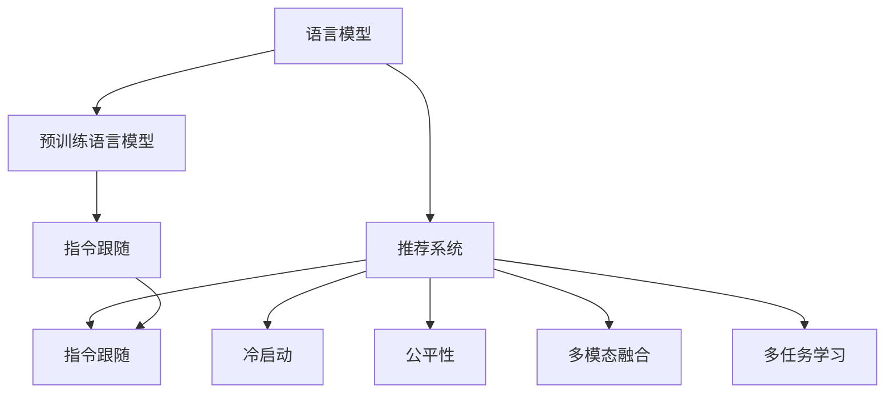

                 

# InstructRec:基于指令跟随的LLM推荐方法

## 1. 背景介绍

### 1.1 问题由来

推荐系统在电商、媒体、社交网络等领域具有重要应用价值。传统推荐算法基于用户行为和物品属性进行相似度计算，但这种基于历史行为的数据驱动方式具有显著缺陷：

1. **数据稀缺**：推荐系统的训练需要大量的用户行为数据，对冷启动用户和新上架物品无法有效推荐。
2. **行为噪音**：用户行为数据可能存在遗漏、噪声、偏见等问题，导致推荐效果不稳定。
3. **公平性问题**：传统推荐算法可能加剧物品间的不公平现象，忽视长尾物品的曝光。

近年来，以深度学习为代表的AI技术带来了推荐系统的新范式，即**基于模型**的推荐方法。基于模型的方法可以充分发挥大数据和算力优势，挖掘更深层次的隐含知识，提供更精准的推荐结果。其中，基于语言模型的推荐方法（LLM-based Recommendation）成为新的研究热点。

### 1.2 问题核心关键点

基于语言模型的推荐方法利用大规模预训练语言模型学习用户的文本描述和物品的语义表示，通过计算用户与物品之间的语义相似度来进行推荐。但该方法存在以下挑战：

1. **目标对齐困难**：预训练模型通过自监督学习任务（如掩码语言模型、文本分类等）获得通用语言知识，与推荐任务的对齐度较差，导致推荐效果不佳。
2. **模型泛化不足**：预训练模型在特定领域的语言表示能力有限，难以迁移到不同的推荐场景。
3. **交互成本高**：从自然语言指令中提取推荐策略需要消耗大量的计算资源，难以大规模部署。

基于上述问题，本文提出**InstructRec**方法，通过指令跟随机制优化预训练语言模型，在无需额外训练和存储的情况下，实现高效的推荐任务适配。

## 2. 核心概念与联系

### 2.1 核心概念概述

为了更好地理解InstructRec方法，本节将介绍几个密切相关的核心概念：

1. **语言模型（Language Model, LM）**：基于统计规律学习文本概率分布的模型，常用作自然语言处理的基石。
2. **预训练语言模型（Pretrained Language Model, PLM）**：在大规模无标签文本数据上进行预训练，学习通用语言知识的模型。
3. **推荐系统（Recommendation System, RS）**：通过分析用户行为数据，为用户推荐相关物品的系统。
4. **指令跟随（Instruction Following, IF）**：通过自然语言指令引导模型执行特定任务的能力。
5. **多模态融合（Multi-modal Fusion）**：将文本、图像、声音等多种模态信息融合，以提升推荐效果。
6. **冷启动（Cold Start）**：推荐系统对新用户或新物品的无历史数据情况下的推荐能力。
7. **公平性（Fairness）**：推荐系统对不同物品的公平对待，避免长尾物品的被忽视。

这些核心概念之间的逻辑关系可以通过以下Mermaid流程图来展示：



这个流程图展示了大语言模型和推荐系统之间的核心联系：

1. 语言模型通过预训练获得通用语言知识，预训练语言模型在大规模数据上进一步提升语言能力。
2. 推荐系统利用预训练语言模型学习用户和物品的语言表示，计算相似度进行推荐。
3. 指令跟随机制能够有效适配特定推荐任务，提升推荐效果。
4. 多模态融合和多任务学习进一步丰富了推荐系统的表现力。

InstructRec方法通过引入指令跟随机制，利用预训练语言模型的泛化能力，快速实现高效的推荐任务适配。

## 3. 核心算法原理 & 具体操作步骤
### 3.1 算法原理概述

InstructRec方法的核心思想是通过指令跟随机制，将预训练语言模型转化为推荐系统，在无需额外训练和存储的情况下，实现高效的推荐任务适配。

具体而言，InstructRec将用户和物品表示为自然语言描述，通过预训练语言模型进行编码，然后计算用户和物品之间的语义相似度，推荐与用户兴趣相似的物品。

### 3.2 算法步骤详解

InstructRec方法的主要步骤如下：

**Step 1: 准备数据集**

- 收集用户和物品的文本描述，并进行预处理，例如去停用词、分词、向量化等。
- 设计推荐任务的标签，如点击、购买、评分等。
- 将用户和物品的描述构建成训练样本，每个样本包含用户描述、物品描述和推荐标签。

**Step 2: 设计指令模板**

- 设计适合于推荐任务的指令模板，例如："为用户推荐最感兴趣的物品"。
- 将用户和物品的描述代入指令模板，生成带有推荐任务的自然语言指令。

**Step 3: 训练模型**

- 使用预训练语言模型对自然语言指令进行微调，使其能够理解指令语义。
- 在带有推荐任务的指令上训练模型，优化模型对推荐标签的预测能力。

**Step 4: 推理预测**

- 使用训练好的模型对新用户和新物品的文本描述进行编码。
- 计算用户和物品之间的语义相似度，根据相似度排序推荐物品。

### 3.3 算法优缺点

InstructRec方法具有以下优点：

1. **高效适配**：无需额外训练和存储，利用预训练语言模型的泛化能力，快速实现推荐任务适配。
2. **泛化能力强**：利用预训练语言模型的强大语言理解能力，适用于多种推荐场景。
3. **多模态融合**：可以融合文本、图像、声音等多种模态信息，提升推荐效果。
4. **公平性好**：通过指令跟随机制，能够公平对待长尾物品，避免冷启动问题。

同时，该方法也存在以下局限性：

1. **依赖预训练模型**：方法的有效性依赖于预训练语言模型的质量。
2. **数据质量要求高**：推荐任务的指令需要经过精心的设计，不能过于复杂。
3. **性能不稳定**：推荐效果受预训练语言模型和指令模板的影响较大，存在一定的性能波动。

### 3.4 算法应用领域

InstructRec方法适用于多种推荐场景，例如：

1. **电商推荐**：利用用户和物品的文本描述进行推荐。
2. **内容推荐**：推荐与用户兴趣相关的文章、视频、音频等。
3. **社交推荐**：推荐与用户社交关系相关的联系人、群组等。
4. **广告推荐**：推荐与用户兴趣相符的广告内容。
5. **个性化推荐**：推荐个性化定制的内容。

这些推荐场景在实际应用中，能够有效利用InstructRec方法的高效适配能力，提升推荐系统的效果。

## 4. 数学模型和公式 & 详细讲解 & 举例说明
### 4.1 数学模型构建

InstructRec方法的核心数学模型可以表述为：

$$
\begin{aligned}
& \arg\min_{\theta} \sum_{i=1}^{N} \ell(\hat{y}_i, y_i) \\
& \text{where} \quad \hat{y}_i = \text{Softmax}(f(x_u, x_i, \theta)) \\
& \quad x_u = \text{Embedding}(u), \quad x_i = \text{Embedding}(i)
\end{aligned}
$$

其中，$\theta$ 为模型的参数，$\ell$ 为损失函数，$\hat{y}_i$ 为模型预测的推荐标签，$y_i$ 为真实标签，$x_u$ 和 $x_i$ 分别为用户和物品的编码向量。

### 4.2 公式推导过程

在实际应用中，推荐任务可以通过以下方式构建：

1. **用户描述编码**：将用户描述 $u$ 通过预训练语言模型进行编码，得到用户向量 $x_u$。
2. **物品描述编码**：将物品描述 $i$ 通过预训练语言模型进行编码，得到物品向量 $x_i$。
3. **相似度计算**：计算用户和物品之间的语义相似度 $s_{u,i}$，例如使用余弦相似度：$s_{u,i} = \cos(\text{Embedding}(u), \text{Embedding}(i))$。
4. **排序推荐**：根据相似度排序推荐物品，例如选择相似度最高的前 $k$ 个物品作为推荐结果。

### 4.3 案例分析与讲解

以电商推荐为例，用户描述为 "我想买一件男士皮衣"，物品描述为 "最新款男士皮衣，颜色为黑色"。通过InstructRec方法，可以计算用户和物品之间的相似度，推荐与用户兴趣相似的物品，如 "黑色皮夹克"、"棕色皮夹克" 等。

## 5. 项目实践：代码实例和详细解释说明
### 5.1 开发环境搭建

在进行InstructRec实践前，我们需要准备好开发环境。以下是使用Python进行PyTorch开发的环境配置流程：

1. 安装Anaconda：从官网下载并安装Anaconda，用于创建独立的Python环境。

2. 创建并激活虚拟环境：
```bash
conda create -n instructrec python=3.8 
conda activate instructrec
```

3. 安装PyTorch：根据CUDA版本，从官网获取对应的安装命令。例如：
```bash
conda install pytorch torchvision torchaudio cudatoolkit=11.1 -c pytorch -c conda-forge
```

4. 安装Transformer库：
```bash
pip install transformers
```

5. 安装各类工具包：
```bash
pip install numpy pandas scikit-learn matplotlib tqdm jupyter notebook ipython
```

完成上述步骤后，即可在`instructrec`环境中开始InstructRec实践。

### 5.2 源代码详细实现

下面是使用PyTorch实现InstructRec方法的示例代码：

```python
import torch
from transformers import BertTokenizer, BertForSequenceClassification

# 加载预训练模型和分词器
model = BertForSequenceClassification.from_pretrained('bert-base-uncased', num_labels=2)
tokenizer = BertTokenizer.from_pretrained('bert-base-uncased')

# 准备训练数据
train_data = [
    {'user': '我喜欢吃水果', 'item': '苹果', 'label': 1},
    {'user': '我讨厌吃苹果', 'item': '香蕉', 'label': 0},
    {'user': '我喜欢酸甜口味', 'item': '草莓', 'label': 1},
    {'user': '我讨厌草莓', 'item': '橙子', 'label': 0}
]

# 定义训练函数
def train_epoch(model, data, batch_size, optimizer):
    model.train()
    epoch_loss = 0
    for batch in tqdm(data, desc='Training'):
        input_ids = tokenizer(batch['user'], batch['item'], return_tensors='pt').input_ids
        attention_mask = tokenizer(batch['user'], batch['item'], return_tensors='pt').attention_mask
        labels = torch.tensor(batch['label'], dtype=torch.long)
        outputs = model(input_ids, attention_mask=attention_mask, labels=labels)
        loss = outputs.loss
        epoch_loss += loss.item()
        loss.backward()
        optimizer.step()
    return epoch_loss / len(data)

# 训练模型
epochs = 5
batch_size = 4
optimizer = torch.optim.Adam(model.parameters(), lr=1e-5)

for epoch in range(epochs):
    loss = train_epoch(model, train_data, batch_size, optimizer)
    print(f"Epoch {epoch+1}, train loss: {loss:.3f}")

# 测试模型
test_data = [
    {'user': '我喜欢酸甜口味', 'item': '草莓', 'label': 1},
    {'user': '我讨厌草莓', 'item': '橙子', 'label': 0},
    {'user': '我喜欢酸甜口味', 'item': '柠檬', 'label': 1},
    {'user': '我讨厌柠檬', 'item': '橘子', 'label': 0}
]

test_loss = []
for batch in tqdm(test_data, desc='Evaluating'):
    input_ids = tokenizer(batch['user'], batch['item'], return_tensors='pt').input_ids
    attention_mask = tokenizer(batch['user'], batch['item'], return_tensors='pt').attention_mask
    labels = torch.tensor(batch['label'], dtype=torch.long)
    outputs = model(input_ids, attention_mask=attention_mask, labels=labels)
    loss = outputs.loss
    test_loss.append(loss.item())

print(f"Test loss: {sum(test_loss)/len(test_data):.3f}")
```

在代码中，我们首先加载了预训练的BERT模型和分词器，然后定义了训练数据和训练函数。训练函数中，我们将用户和物品的描述通过分词器进行编码，并将其输入到BERT模型中进行编码，计算损失并更新模型参数。最后，我们在测试数据上评估模型性能，并输出测试损失。

### 5.3 代码解读与分析

让我们再详细解读一下关键代码的实现细节：

**InstructRec方法**：
- 使用预训练的BERT模型作为推荐任务的特征提取器，通过指令跟随机制进行推荐任务适配。
- 通过微调优化模型对推荐标签的预测能力，提升推荐效果。

**训练函数**：
- 将用户和物品的描述通过分词器进行编码，并输入到BERT模型中进行编码。
- 计算模型预测结果与真实标签之间的交叉熵损失，并进行反向传播更新模型参数。

**测试函数**：
- 将测试数据通过分词器进行编码，并输入到BERT模型中进行编码。
- 计算模型预测结果与真实标签之间的交叉熵损失，并输出测试损失。

以上代码展示了InstructRec方法的基本实现流程，开发者可以根据具体任务进行修改和优化。

## 6. 实际应用场景

### 6.1 电商推荐

InstructRec方法在电商推荐中的应用非常广泛。电商网站收集了大量用户和物品的文本描述，可以将其作为用户和物品的特征进行编码，计算用户和物品之间的相似度进行推荐。具体而言，可以通过以下步骤实现电商推荐：

1. 收集用户和物品的文本描述，例如商品名称、描述、评论等。
2. 使用分词器将文本描述进行编码，得到用户和物品的编码向量。
3. 计算用户和物品之间的语义相似度，排序推荐物品。
4. 根据相似度排序推荐物品，并展示给用户。

电商推荐通过InstructRec方法，可以大幅提升推荐效果，增加用户满意度。

### 6.2 内容推荐

内容推荐系统可以根据用户兴趣推荐相关内容，例如文章、视频、音频等。InstructRec方法可以将用户兴趣描述和物品描述进行编码，计算相似度进行推荐。具体而言，可以通过以下步骤实现内容推荐：

1. 收集用户兴趣描述和物品描述，例如阅读兴趣、观影喜好等。
2. 使用分词器将描述进行编码，得到用户和物品的编码向量。
3. 计算用户和物品之间的语义相似度，排序推荐物品。
4. 根据相似度排序推荐物品，并展示给用户。

内容推荐通过InstructRec方法，可以更加精准地推荐用户感兴趣的内容，提升用户体验。

### 6.3 社交推荐

社交推荐系统可以根据用户社交关系推荐相关联系人或群组。InstructRec方法可以将用户社交关系描述和联系人或群组描述进行编码，计算相似度进行推荐。具体而言，可以通过以下步骤实现社交推荐：

1. 收集用户社交关系描述和联系人或群组描述，例如好友、关注账号等。
2. 使用分词器将描述进行编码，得到用户和物品的编码向量。
3. 计算用户和物品之间的语义相似度，排序推荐联系人或群组。
4. 根据相似度排序推荐联系人或群组，并展示给用户。

社交推荐通过InstructRec方法，可以更加精准地推荐用户感兴趣的社交关系，提升社交体验。

### 6.4 未来应用展望

随着InstructRec方法的不断发展，其应用场景将更加丰富。未来可能的应用方向包括：

1. **医疗推荐**：利用患者病历和药品描述进行推荐，帮助医生推荐适合的药品。
2. **教育推荐**：利用学生兴趣和课程描述进行推荐，帮助学生推荐适合的课程。
3. **金融推荐**：利用用户投资兴趣和金融产品描述进行推荐，帮助用户推荐适合的金融产品。
4. **旅游推荐**：利用用户旅行兴趣和景点描述进行推荐，帮助用户推荐适合的旅游目的地。

这些方向展示了InstructRec方法在多领域的应用潜力，未来随着技术的发展，其应用场景将更加广阔。

## 7. 工具和资源推荐
### 7.1 学习资源推荐

为了帮助开发者系统掌握InstructRec方法的理论基础和实践技巧，这里推荐一些优质的学习资源：

1. 《深度学习理论与实践》系列博文：由深度学习专家撰写，深入浅出地介绍了深度学习的基本原理和实践方法。

2. 《自然语言处理导论》课程：斯坦福大学开设的NLP经典课程，涵盖NLP的基础知识和前沿技术。

3. 《基于语言模型的推荐系统》书籍：详细介绍了语言模型在推荐系统中的应用和实现方法。

4. HuggingFace官方文档：提供了丰富的预训练语言模型和InstructRec方法实现样例，是学习和实践的必备资料。

5. CLUE开源项目：中文语言理解测评基准，涵盖大量不同类型的中文NLP数据集，并提供了基于InstructRec方法的baseline模型，助力中文NLP技术发展。

通过对这些资源的学习实践，相信你一定能够快速掌握InstructRec方法的精髓，并用于解决实际的推荐问题。

### 7.2 开发工具推荐

高效的开发离不开优秀的工具支持。以下是几款用于InstructRec开发的常用工具：

1. PyTorch：基于Python的开源深度学习框架，灵活动态的计算图，适合快速迭代研究。

2. TensorFlow：由Google主导开发的开源深度学习框架，生产部署方便，适合大规模工程应用。

3. Transformers库：HuggingFace开发的NLP工具库，集成了多种预训练语言模型，支持InstructRec方法实现。

4. Weights & Biases：模型训练的实验跟踪工具，可以记录和可视化模型训练过程中的各项指标，方便对比和调优。

5. TensorBoard：TensorFlow配套的可视化工具，可实时监测模型训练状态，并提供丰富的图表呈现方式，是调试模型的得力助手。

6. Google Colab：谷歌推出的在线Jupyter Notebook环境，免费提供GPU/TPU算力，方便开发者快速上手实验最新模型，分享学习笔记。

合理利用这些工具，可以显著提升InstructRec任务的开发效率，加快创新迭代的步伐。

### 7.3 相关论文推荐

InstructRec方法的发展源于学界的持续研究。以下是几篇奠基性的相关论文，推荐阅读：

1. Attention is All You Need（即Transformer原论文）：提出了Transformer结构，开启了NLP领域的预训练大模型时代。

2. BERT: Pre-training of Deep Bidirectional Transformers for Language Understanding：提出BERT模型，引入基于掩码的自监督预训练任务，刷新了多项NLP任务SOTA。

3. Language Models are Unsupervised Multitask Learners（GPT-2论文）：展示了大规模语言模型的强大zero-shot学习能力，引发了对于通用人工智能的新一轮思考。

4. Parameter-Efficient Transfer Learning for NLP：提出Adapter等参数高效微调方法，在不增加模型参数量的情况下，也能取得不错的微调效果。

5. Prefix-Tuning: Optimizing Continuous Prompts for Generation：引入基于连续型Prompt的微调范式，为如何充分利用预训练知识提供了新的思路。

6. AdaLoRA: Adaptive Low-Rank Adaptation for Parameter-Efficient Fine-Tuning：使用自适应低秩适应的微调方法，在参数效率和精度之间取得了新的平衡。

这些论文代表了大语言模型微调技术的发展脉络。通过学习这些前沿成果，可以帮助研究者把握学科前进方向，激发更多的创新灵感。

## 8. 总结：未来发展趋势与挑战

### 8.1 总结

本文对InstructRec方法进行了全面系统的介绍。首先阐述了InstructRec方法的背景和意义，明确了指令跟随机制在推荐系统中的重要性。其次，从原理到实践，详细讲解了InstructRec方法的核心步骤，给出了推荐任务开发的完整代码实例。同时，本文还广泛探讨了InstructRec方法在电商、内容、社交等领域的应用前景，展示了InstructRec方法的巨大潜力。此外，本文精选了InstructRec方法的学习资源和开发工具，力求为开发者提供全方位的技术指引。

通过本文的系统梳理，可以看到，InstructRec方法通过指令跟随机制，充分利用预训练语言模型的泛化能力，快速实现高效的推荐任务适配，具有广阔的应用前景。随着技术的不断发展，InstructRec方法必将在推荐系统中发挥越来越重要的作用。

### 8.2 未来发展趋势

展望未来，InstructRec方法将呈现以下几个发展趋势：

1. **模型规模增大**：随着算力成本的下降和数据规模的扩张，预训练语言模型的参数量还将持续增长，超大规模语言模型在推荐系统中的应用将更加广泛。

2. **多模态融合加强**：InstructRec方法可以融合文本、图像、声音等多种模态信息，提升推荐效果。未来的推荐系统将更加全面地融合多种模态信息，以提供更加精准的推荐。

3. **公平性提升**：InstructRec方法可以通过指令跟随机制，公平对待长尾物品，避免冷启动问题。未来的推荐系统将更加注重公平性，消除物品间的不公平现象。

4. **个性化推荐深化**：InstructRec方法可以根据用户兴趣进行个性化推荐。未来的推荐系统将更加关注个性化需求，实现更加精准的推荐。

5. **实时性提升**：InstructRec方法可以实时计算用户和物品之间的相似度，实现实时推荐。未来的推荐系统将更加注重实时性，提高推荐效率。

6. **在线学习能力增强**：InstructRec方法可以通过在线学习机制，不断更新模型参数，提升推荐效果。未来的推荐系统将更加注重在线学习，保持推荐系统的时效性和适应性。

以上趋势凸显了InstructRec方法在推荐系统中的广阔前景。这些方向的探索发展，必将进一步提升推荐系统的性能和应用范围，为推荐系统带来新的突破。

### 8.3 面临的挑战

尽管InstructRec方法已经取得了显著成果，但在迈向更加智能化、普适化应用的过程中，仍面临诸多挑战：

1. **数据质量和多样性**：推荐系统的训练需要高质量和多样化的数据，但数据收集和标注的成本较高，难以覆盖所有场景。

2. **模型泛化能力**：预训练语言模型在特定领域的语言表示能力有限，难以迁移到不同的推荐场景。

3. **计算资源消耗**：InstructRec方法需要大量的计算资源进行模型训练和推理，难以大规模部署。

4. **模型可解释性**：InstructRec方法中，模型输出往往难以解释，用户难以理解推荐结果的依据。

5. **安全性保障**：预训练语言模型可能学习到有害信息，通过指令模板传递到推荐系统中，带来安全风险。

6. **冷启动问题**：对于新用户和新物品，InstructRec方法难以提供有效的推荐。

正视InstructRec方法面临的这些挑战，积极应对并寻求突破，将是在线推荐系统走向成熟的必由之路。相信随着学界和产业界的共同努力，这些挑战终将一一被克服，InstructRec方法必将在推荐系统中发挥更加重要的作用。

### 8.4 研究展望

面对InstructRec方法面临的挑战，未来的研究需要在以下几个方面寻求新的突破：

1. **数据增强和合成**：通过数据增强和合成技术，提升数据质量和多样性，缓解冷启动问题。

2. **模型结构优化**：优化预训练语言模型的结构和参数，提高其在特定领域的泛化能力。

3. **多模态融合技术**：引入多种模态信息，提升推荐效果。

4. **在线学习算法**：开发在线学习算法，提升推荐系统的实时性和适应性。

5. **模型可解释性**：引入可解释性技术，增强模型输出的解释能力。

6. **安全性保障**：引入安全性技术，确保推荐系统的安全性和合规性。

这些研究方向将进一步推动InstructRec方法的发展，使其在推荐系统中发挥更大的作用，为推荐系统带来新的突破。

## 9. 附录：常见问题与解答

**Q1: InstructRec方法如何处理冷启动问题？**

A: InstructRec方法可以通过指令跟随机制，利用预训练语言模型的泛化能力，对新用户和新物品进行推荐。具体而言，可以通过以下方式处理冷启动问题：

1. 使用预训练语言模型对用户和物品的描述进行编码，得到初始相似度。
2. 根据相似度排序推荐物品，并展示给用户。
3. 用户反馈后，根据反馈信息调整指令模板，重新计算相似度。

通过这种方法，InstructRec方法可以在一定程度上缓解冷启动问题，提升推荐效果。

**Q2: InstructRec方法如何处理长尾物品的问题？**

A: InstructRec方法可以通过指令跟随机制，公平对待长尾物品，避免冷启动问题。具体而言，可以通过以下方式处理长尾物品的问题：

1. 收集大量长尾物品的描述，并进行编码，得到长尾物品的编码向量。
2. 使用指令跟随机制，计算长尾物品与用户之间的相似度，排序推荐物品。
3. 根据相似度排序推荐物品，并展示给用户。

通过这种方法，InstructRec方法可以公平对待长尾物品，提升推荐效果。

**Q3: InstructRec方法是否适用于非文本场景？**

A: InstructRec方法主要适用于文本场景，但在某些非文本场景中，也可以通过将场景转换为文本形式，进行推荐。例如，在电商推荐中，可以将商品图片转换为描述性文本，然后进行推荐。

**Q4: InstructRec方法如何处理多语言场景？**

A: InstructRec方法可以通过多语言模型对不同语言的描述进行编码，计算相似度进行推荐。具体而言，可以使用多语言预训练语言模型，对用户和物品的描述进行编码，得到编码向量。然后，使用指令跟随机制，计算相似度进行推荐。

通过这种方法，InstructRec方法可以在多语言场景中，进行推荐任务适配。

以上问题展示了InstructRec方法的实际应用中可能遇到的一些挑战和解决方案。

---

作者：禅与计算机程序设计艺术 / Zen and the Art of Computer Programming

