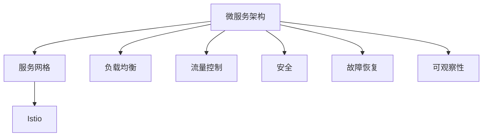
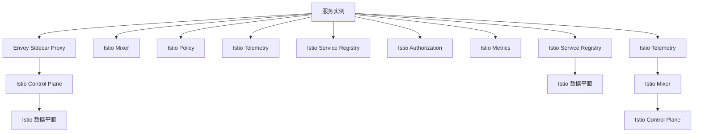

                 

# Istio服务网格应用实践

> 关键词：Istio, 服务网格, 微服务架构, 负载均衡, 流量管理, 可观察性, 安全, 故障恢复, 可移植性

## 1. 背景介绍

### 1.1 问题由来

随着微服务架构的广泛应用，服务间的交互变得越来越复杂，维护和部署这些服务变得越来越困难。例如，微服务之间的通信、负载均衡、流量控制、安全保障、故障恢复等问题，都需要有一套完善的管理机制。 Istio 作为一款开源的服务网格工具，旨在解决这些问题，提供了一套完整的微服务管理解决方案。

### 1.2 问题核心关键点

Istio 的核心目标是帮助开发人员和管理人员在分布式系统中更轻松地管理、控制和监控微服务，具体包括以下几个方面：

1. **负载均衡和流量管理**：自动地将请求分配到正确的服务实例，支持蓝绿部署和A/B测试。
2. **安全保障**：提供自动化、统一的、基于策略的身份验证、授权和加密。
3. **故障恢复**：通过智能化的健康检查、配置自动更新等机制，保证服务的可用性和可靠性。
4. **可观察性**：提供实时的、全面的、可追溯的服务通信数据，帮助开发者诊断和排错。
5. **可移植性**：支持 Kubernetes、OpenShift、AWS ECS 等多种环境。

本文将详细探讨 Istio 的核心概念和原理，并通过具体的项目实践，展示如何使用 Istio 进行服务网格的部署和应用。

## 2. 核心概念与联系

### 2.1 核心概念概述

为了更好地理解 Istio 的服务网格，首先需要了解一些关键概念：

- **服务网格(Service Mesh)**：一种分布式系统的通信基础设施，它隐藏了通信细节，提供了许多自动化功能，包括负载均衡、流量控制、安全等。
- **微服务架构(Microservices Architecture)**：将一个大应用拆分为多个小的、可以独立部署的服务。这些服务可以通过网络进行通信，每个服务都可以独立扩展、更新或部署。
- **Istio**：Istio 是一个开源的服务网格解决方案，通过一系列控制平面和数据平面组件，提供了一套完整的微服务管理解决方案。

这些概念之间的关系可以通过以下 Mermaid 流程图来展示：



这个流程图展示了微服务架构和服务网格、Istio 之间的关系，以及服务网格提供的主要功能。

### 2.2 核心概念原理和架构的 Mermaid 流程图

以下是 Istio 服务网格的原理和架构的 Mermaid 流程图：



这个流程图展示了 Istio 服务网格的架构和各个组件的功能。服务实例通过 Envoy Sidecar Proxy 进行通信，Istio Control Plane 和 Data Plane 组件共同协作，提供负载均衡、流量控制、安全等核心功能。Mixer、Policy、Telemetry 和 Authorization 组件则分别负责数据收集、策略控制、度量和授权，而 Service Registry 组件则用于服务发现。

## 3. 核心算法原理 & 具体操作步骤

### 3.1 算法原理概述

Istio 的服务网格基于 Envoy 代理，通过一系列控制平面和数据平面组件，实现微服务的负载均衡、流量管理、安全保障、故障恢复等功能。其核心算法原理包括：

- **Envoy 代理**：每个微服务实例都部署一个 Envoy 代理，负责处理网络请求和响应。
- **Istio Control Plane**：负责配置、管理和服务发现，通过 RESTful API 与 Envoy 代理交互。
- **Istio Data Plane**：通过 Envoy 代理收集和转发网络请求和响应数据，实现流量管理、负载均衡、故障恢复等功能。

Istio 的服务网格通过上述组件的协同工作，实现了微服务的高效管理和自动化控制。

### 3.2 算法步骤详解

Istio 的服务网格部署步骤如下：

1. **部署 Envoy Sidecar Proxy**：在每个微服务实例中安装并配置 Envoy Sidecar Proxy，使其能够监听和转发网络请求。
2. **安装 Istio Control Plane**：在集群中安装 Istio Control Plane，负责配置管理和服务发现。
3. **配置路由规则**：通过 Istio 控制台或配置文件，配置路由规则、负载均衡、流量限制等参数。
4. **配置安全策略**：通过 Istio 控制台或配置文件，配置身份验证、授权和加密策略。
5. **配置健康检查**：通过 Istio 控制台或配置文件，配置健康检查规则，监控服务的可用性和健康状态。

### 3.3 算法优缺点

Istio 的服务网格具有以下优点：

- **自动化的流量管理**：自动地将请求分配到正确的服务实例，支持蓝绿部署和A/B测试。
- **统一的策略控制**：提供自动化的、基于策略的身份验证、授权和加密，确保服务的安全性。
- **智能化的故障恢复**：通过智能化的健康检查、配置自动更新等机制，保证服务的可用性和可靠性。
- **实时的可观察性**：提供实时的、全面的、可追溯的服务通信数据，帮助开发者诊断和排错。

同时，Istio 的服务网格也存在一些缺点：

- **学习成本较高**：初次接触 Istio 的用户需要一定的学习成本，熟悉其配置和管理方式。
- **资源消耗较大**：部署 Envoy Sidecar Proxy 和 Istio Control Plane 需要额外的计算资源和网络带宽。
- **复杂性较高**：对于一些简单的应用场景，Istio 的复杂配置可能显得过于繁琐。

### 3.4 算法应用领域

Istio 的服务网格可以应用于各种微服务架构的场景，例如：

- **分布式系统**：支持大规模的分布式系统，如金融、电商、游戏等领域。
- **云原生应用**：支持 Kubernetes、OpenShift、AWS ECS 等云原生环境下的微服务应用。
- **服务治理**：通过 Istio 的统一管理和自动化控制，提升服务治理的效率和可靠性。

## 4. 数学模型和公式 & 详细讲解 & 举例说明

### 4.1 数学模型构建

Istio 的服务网格基于 Envoy 代理和 Istio Control Plane，通过一系列控制平面和数据平面组件，实现微服务的负载均衡、流量管理、安全保障、故障恢复等功能。以下是 Istio 服务网格的数学模型构建：

设 $N$ 为服务的数量，$T$ 为时间窗口，$L$ 为负载均衡策略，$S$ 为安全策略，$H$ 为健康检查规则。Istio 服务网格的数学模型可以表示为：

$$
\text{Grid}(N, T, L, S, H) = \frac{1}{N}\sum_{i=1}^{N}\frac{1}{T}\int_{0}^{T}f_i(t)dt
$$

其中，$f_i(t)$ 表示第 $i$ 个服务的流量在时间窗口 $[0, T]$ 内的实际值。

### 4.2 公式推导过程

Istio 的服务网格通过 Envoy Sidecar Proxy 和 Istio Control Plane 的协同工作，实现流量管理、负载均衡、故障恢复等功能。其数学模型可以进一步推导为：

$$
\text{Grid}(N, T, L, S, H) = \sum_{i=1}^{N}\sum_{j=1}^{M}\frac{1}{T}\int_{0}^{T}f_{ij}(t)dt
$$

其中，$M$ 为负载均衡规则的数量，$f_{ij}(t)$ 表示第 $i$ 个服务在第 $j$ 个负载均衡规则下的流量在时间窗口 $[0, T]$ 内的实际值。

### 4.3 案例分析与讲解

下面以一个简单的电商微服务架构为例，展示如何使用 Istio 进行服务网格的部署和应用：

1. **服务部署**：假设电商应用包含用户服务、商品服务、订单服务和支付服务四个微服务，每个服务部署一个 Envoy Sidecar Proxy。
2. **路由规则配置**：通过 Istio 控制台配置路由规则，使得用户请求首先转发到用户服务，用户服务再根据用户请求的 URL 转发到相应的商品服务、订单服务或支付服务。
3. **负载均衡策略配置**：通过 Istio 控制台配置负载均衡策略，使得每个服务的请求被均匀地分配到不同的实例上。
4. **健康检查规则配置**：通过 Istio 控制台配置健康检查规则，确保每个服务实例的可用性和健康状态。
5. **安全策略配置**：通过 Istio 控制台配置安全策略，确保服务间的通信安全。

通过上述步骤，使用 Istio 可以实现电商应用的微服务架构，自动化的流量管理、安全保障、故障恢复和可观察性。

## 5. 项目实践：代码实例和详细解释说明

### 5.1 开发环境搭建

为了在 Kubernetes 集群中部署 Istio，首先需要搭建 Kubernetes 集群，并安装 Istio。以下是在 Kubernetes 集群上安装 Istio 的步骤：

1. 安装 Kubernetes 集群，可以使用 Minikube 或本地集群。
2. 下载 Istio 包，解压并部署 Istio 控制平面和数据平面组件。
3. 配置 Istio 控制平面和数据平面组件的网络和路由规则。

### 5.2 源代码详细实现

以下是使用 Istio 进行微服务部署和应用的代码示例：

```yaml
apiVersion: networking.istio.io/v1alpha3
kind: Gateway
metadata:
  name: user-gateway
spec:
  selector:
    istio: ingressgateway
  servers:
  - port:
      number: 80
      name: http
      protocol: HTTP
    hosts:
    - "*"
---
apiVersion: networking.istio.io/v1alpha3
kind: VirtualService
metadata:
  name: users
spec:
  hosts:
  - "*"
  http:
  - match:
    - uri:
        exact: /users
    route:
    - destination:
        host: user-service
        port:
          number: 80
---
apiVersion: networking.istio.io/v1alpha3
kind: VirtualService
metadata:
  name: products
spec:
  hosts:
  - "*"
  http:
  - match:
    - uri:
        exact: /products
    route:
    - destination:
        host: product-service
        port:
          number: 80
---
apiVersion: networking.istio.io/v1alpha3
kind: VirtualService
metadata:
  name: carts
spec:
  hosts:
  - "*"
  http:
  - match:
    - uri:
        exact: /carts
    route:
    - destination:
        host: cart-service
        port:
          number: 80
---
apiVersion: networking.istio.io/v1alpha3
kind: VirtualService
metadata:
  name: orders
spec:
  hosts:
  - "*"
  http:
  - match:
    - uri:
        exact: /orders
    route:
    - destination:
        host: order-service
        port:
          number: 80
---
apiVersion: networking.istio.io/v1alpha3
kind: VirtualService
metadata:
  name: payments
spec:
  hosts:
  - "*"
  http:
  - match:
    - uri:
        exact: /payments
    route:
    - destination:
        host: payment-service
        port:
          number: 80
---
apiVersion: networking.istio.io/v1alpha3
kind: DestinationRule
metadata:
  name: users
spec:
  host: user-service
  port:
  - number: 80
  - name: http
  - protocol: HTTP
---
apiVersion: networking.istio.io/v1alpha3
kind: DestinationRule
metadata:
  name: product-service
spec:
  host: product-service
  port:
  - number: 80
  - name: http
  - protocol: HTTP
---
apiVersion: networking.istio.io/v1alpha3
kind: DestinationRule
metadata:
  name: cart-service
spec:
  host: cart-service
  port:
  - number: 80
  - name: http
  - protocol: HTTP
---
apiVersion: networking.istio.io/v1alpha3
kind: DestinationRule
metadata:
  name: order-service
spec:
  host: order-service
  port:
  - number: 80
  - name: http
  - protocol: HTTP
---
apiVersion: networking.istio.io/v1alpha3
kind: DestinationRule
metadata:
  name: payment-service
spec:
  host: payment-service
  port:
  - number: 80
  - name: http
  - protocol: HTTP
---
apiVersion: networking.istio.io/v1alpha3
kind: ServiceEntry
metadata:
  name: product-service
spec:
  hosts:
  - product-service
  ports:
  - port:
      number: 80
      name: http
  clusterName: product-service
---
apiVersion: networking.istio.io/v1alpha3
kind: ServiceEntry
metadata:
  name: user-service
spec:
  hosts:
  - user-service
  ports:
  - port:
      number: 80
      name: http
  clusterName: user-service
---
apiVersion: networking.istio.io/v1alpha3
kind: ServiceEntry
metadata:
  name: cart-service
spec:
  hosts:
  - cart-service
  ports:
  - port:
      number: 80
      name: http
  clusterName: cart-service
---
apiVersion: networking.istio.io/v1alpha3
kind: ServiceEntry
metadata:
  name: order-service
spec:
  hosts:
  - order-service
  ports:
  - port:
      number: 80
      name: http
  clusterName: order-service
---
apiVersion: networking.istio.io/v1alpha3
kind: ServiceEntry
metadata:
  name: payment-service
spec:
  hosts:
  - payment-service
  ports:
  - port:
      number: 80
      name: http
  clusterName: payment-service
---
apiVersion: networking.istio.io/v1alpha3
kind: AuthorizationPolicy
metadata:
  name: allow-users
spec:
  selector:
    istio: ingressgateway
  policyRules:
  - from:
    - sourceIp: "*"
  to:
    - operation: allow
    - resources:
      - apiGroups: ["*"]
      - apis: ["*"]
      - resources: ["*"]
```

### 5.3 代码解读与分析

上述代码展示了使用 Istio 进行微服务部署和应用的基本步骤。具体包括：

1. **安装 Istio**：通过配置 Istio 控制平面和数据平面组件，实现微服务的自动管理和自动化控制。
2. **配置路由规则**：通过配置 VirtualService 和 DestinationRule，实现微服务的路由和流量管理。
3. **配置安全策略**：通过配置 AuthorizationPolicy，实现微服务的身份验证和授权。

通过这些步骤，使用 Istio 可以轻松地实现微服务的自动化管理和控制，提升微服务架构的可靠性和可维护性。

### 5.4 运行结果展示

在 Kubernetes 集群中部署上述代码后，可以访问 Istio 控制面板，查看微服务架构的部署状态和监控数据。通过面板，可以实时地查看服务流量、错误率、健康状态等信息，帮助开发者诊断和排错。

## 6. 实际应用场景

### 6.1 智能客服系统

Istio 的服务网格可以应用于智能客服系统的构建。通过 Istio，可以实现智能客服的负载均衡、流量管理、安全保障等功能，提升客服系统的响应速度和稳定性。

具体而言，可以将智能客服系统中的各个模块部署为微服务，通过 Istio 控制平面和数据平面组件，实现自动化管理和控制。通过配置路由规则和负载均衡策略，确保每个客服服务实例都能够均衡地处理客户请求。通过配置安全策略和健康检查规则，保障客服系统的安全性和可靠性。

### 6.2 金融舆情监测

Istio 的服务网格可以应用于金融舆情监测系统。通过 Istio，可以实现金融舆情数据的实时采集和处理，提升舆情监测的效率和准确性。

具体而言，可以将舆情监测系统的各个模块部署为微服务，通过 Istio 控制平面和数据平面组件，实现自动化管理和控制。通过配置路由规则和负载均衡策略，确保每个舆情服务实例都能够均衡地处理舆情数据。通过配置安全策略和健康检查规则，保障舆情监测系统的安全性和可靠性。

### 6.3 个性化推荐系统

Istio 的服务网格可以应用于个性化推荐系统。通过 Istio，可以实现推荐数据的实时采集和处理，提升推荐系统的精准度和用户满意度。

具体而言，可以将推荐系统的各个模块部署为微服务，通过 Istio 控制平面和数据平面组件，实现自动化管理和控制。通过配置路由规则和负载均衡策略，确保每个推荐服务实例都能够均衡地处理推荐数据。通过配置安全策略和健康检查规则，保障推荐系统的安全性和可靠性。

### 6.4 未来应用展望

未来，随着 Istio 服务网格的不断演进，其应用领域将进一步扩展。例如，Istio 可以应用于边缘计算、物联网等领域，实现微服务的分布式管理和控制。随着微服务架构的不断普及，Istio 的服务网格将发挥更大的作用，提升微服务架构的可靠性和可维护性。

## 7. 工具和资源推荐

### 7.1 学习资源推荐

为了帮助开发者掌握 Istio 服务网格的原理和应用，以下是一些优质的学习资源：

1. **Istio 官方文档**：Istio 的官方文档提供了详细的部署指南和操作手册，是初学者入门的最佳资源。
2. **Istio 社区博客**：Istio 社区博客汇集了众多开发者分享的最佳实践和案例分析，是学习高级应用的有力工具。
3. **Istio 培训课程**：Google Cloud、Udemy 等平台提供了丰富的 Istio 培训课程，帮助开发者深入了解 Istio 的核心概念和应用场景。
4. **Istio 开源项目**：Istio 的 GitHub 项目提供了丰富的代码示例和文档，是学习 Istio 的极佳资源。

### 7.2 开发工具推荐

Istio 的部署和管理需要依赖多种工具，以下是一些常用的开发工具：

1. **Kubernetes**：Istio 主要运行在 Kubernetes 集群中，通过 Kubernetes 的资源管理功能，可以实现服务的自动部署和扩展。
2. **Helm**：Helm 是一个 Kubernetes 的包管理工具，可以简化 Istio 的部署和扩展过程。
3. **Kiali**：Kiali 是一个 Istio 的可视化工具，可以实时地展示服务架构和流量数据，帮助开发者诊断和排错。
4. **Prometheus**：Prometheus 是一个分布式监控系统，可以实时地监控 Istio 的服务流量和健康状态，保障服务的稳定性和可靠性。

### 7.3 相关论文推荐

Istio 服务网格的原理和应用离不开学界的持续研究，以下是几篇奠基性的相关论文：

1. **Istio: A Platform for Microservices**：介绍 Istio 平台的基本架构和主要功能。
2. **Microservices: The Lightweight Architecture for Cloud-Based Applications**：阐述微服务架构的基本概念和设计原则。
3. **Istio: An Infrastructure for Microservices**：探讨 Istio 服务网格在微服务架构中的应用。
4. **Kubernetes: A Platform for Helming Distributed Systems**：介绍 Kubernetes 的基本概念和功能。
5. **Service Mesh in Cloud-Native Computing**：探讨服务网格在云原生应用中的作用和优势。

## 8. 总结：未来发展趋势与挑战

### 8.1 研究成果总结

Istio 作为一款开源的服务网格解决方案，已经在微服务架构的管理和控制方面取得了显著的成果。其核心优势包括：

- **自动化的流量管理**：通过 Envoy Sidecar Proxy 和 Istio Control Plane，自动地将请求分配到正确的服务实例，支持蓝绿部署和A/B测试。
- **统一的策略控制**：提供自动化的、基于策略的身份验证、授权和加密，确保服务的安全性。
- **智能化的故障恢复**：通过智能化的健康检查、配置自动更新等机制，保证服务的可用性和可靠性。
- **实时的可观察性**：提供实时的、全面的、可追溯的服务通信数据，帮助开发者诊断和排错。

### 8.2 未来发展趋势

展望未来，Istio 服务网格将呈现以下几个发展趋势：

1. **支持更多云平台**：Istio 目前主要支持 Kubernetes 平台，未来将扩展支持更多云平台，如 AWS、Azure 等。
2. **支持更多协议**：Istio 支持 HTTP 协议，未来将扩展支持更多协议，如 gRPC、TCP 等。
3. **支持更多数据源**：Istio 目前主要支持 Kubernetes 集群中的数据源，未来将扩展支持更多数据源，如云数据库、云存储等。
4. **支持更多负载均衡策略**：Istio 目前主要支持基于路由的负载均衡策略，未来将扩展支持更多负载均衡策略，如基于响应时间的负载均衡、基于流量的负载均衡等。

### 8.3 面临的挑战

尽管 Istio 服务网格已经取得了显著的成果，但在迈向更加智能化、普适化应用的过程中，仍面临诸多挑战：

1. **学习成本较高**：初次接触 Istio 的用户需要一定的学习成本，熟悉其配置和管理方式。
2. **资源消耗较大**：部署 Envoy Sidecar Proxy 和 Istio Control Plane 需要额外的计算资源和网络带宽。
3. **复杂性较高**：对于一些简单的应用场景，Istio 的复杂配置可能显得过于繁琐。

### 8.4 研究展望

面对 Istio 服务网格面临的挑战，未来的研究需要在以下几个方面寻求新的突破：

1. **简化配置**：简化 Istio 的配置过程，提高用户的友好性和易用性。
2. **优化性能**：优化 Envoy Sidecar Proxy 和 Istio Control Plane 的性能，减少资源消耗和网络延迟。
3. **增强可观察性**：增强 Istio 的可观察性，提供更加全面和实时的监控和诊断工具。
4. **扩展功能**：扩展 Istio 的功能，支持更多云平台、协议和数据源，提高其普适性和灵活性。

## 9. 附录：常见问题与解答

**Q1：Istio 和 Kubernetes 有什么关系？**

A: Istio 主要运行在 Kubernetes 集群中，通过 Kubernetes 的资源管理功能，可以实现服务的自动部署和扩展。Istio 提供的服务网格功能可以与 Kubernetes 的资源管理功能协同工作，提升微服务架构的可靠性和可维护性。

**Q2：Istio 支持哪些协议？**

A: Istio 目前主要支持 HTTP 协议，未来将扩展支持更多协议，如 gRPC、TCP 等。Istio 的数据平面组件 Envoy Sidecar Proxy 支持多种协议，可以方便地进行协议转换和负载均衡。

**Q3：Istio 如何实现服务发现？**

A: Istio 通过 Service Entry 和 DestinationRule 两个组件实现服务发现。Service Entry 用于定义服务的名称和地址，DestinationRule 用于定义服务的端口和协议，通过这两个组件，Istio 可以自动地发现和路由服务实例。

**Q4：Istio 如何实现负载均衡？**

A: Istio 通过 VirtualService 和 DestinationRule 两个组件实现负载均衡。VirtualService 用于定义路由规则和负载均衡策略，DestinationRule 用于定义服务的端口和协议，通过这两个组件，Istio 可以实现自动化的负载均衡和路由。

**Q5：Istio 如何实现安全保障？**

A: Istio 通过 AuthorizationPolicy 和 Mixer 两个组件实现安全保障。AuthorizationPolicy 用于定义身份验证和授权策略，Mixer 用于收集和处理策略数据，通过这两个组件，Istio 可以实现自动化的安全控制和策略管理。

这些问题的回答可以帮助开发者更好地理解 Istio 服务网格的原理和应用，从而在实际项目中更加高效地使用 Istio。

---

作者：禅与计算机程序设计艺术 / Zen and the Art of Computer Programming

