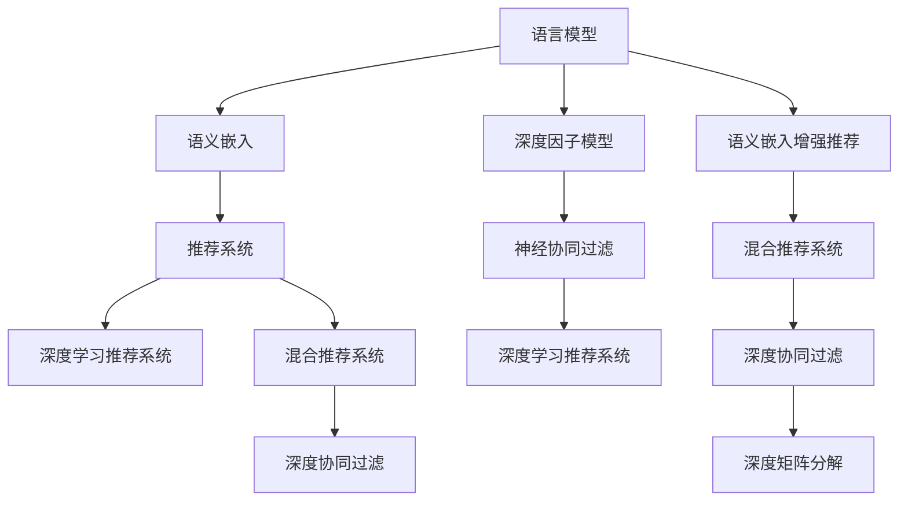

                 

## 1. 背景介绍

### 1.1 问题由来
在当前的信息爆炸时代，推荐系统已成为互联网产品的核心功能之一，旨在为用户提供个性化的内容推荐。传统的基于协同过滤的推荐系统，主要依赖用户的历史行为数据进行推荐，对未交互数据的利用程度有限。而基于深度学习的推荐系统，可以较好地挖掘数据中的潜在规律，但仍存在精度不足、泛化能力有限等问题。

为了解决这些问题，研究者提出了基于大语言模型(LLMs)的推荐系统。这种系统利用语言模型的语义理解能力，从文本中提取出语义信息，进行内容匹配和推荐。然而，语言模型本身不具备推荐逻辑，难以将其与推荐系统进行深度融合。

为了克服这一挑战，本文将介绍一种基于语言模型增强推荐系统，即"LLM Embeddings + RS"。通过构建语言模型-推荐系统的混合架构，使LLM能够生成高质量的语义嵌入，用于指导推荐决策。

### 1.2 问题核心关键点
本文的核心问题是：如何构建基于语言模型的推荐系统，实现高精度的个性化推荐。关键点包括：
- 构建语义嵌入模型，利用语言模型理解文本语义。
- 设计推荐目标函数，将语义嵌入转化为推荐决策。
- 优化混合模型架构，综合利用用户行为和语义嵌入进行推荐。

本文将围绕这三个关键点展开深入讨论，并通过数学模型、算法原理和代码实践详细阐述该问题。

## 2. 核心概念与联系

### 2.1 核心概念概述

为更好地理解本文提出的语言模型增强推荐方法，本节将介绍几个密切相关的核心概念：

- 语言模型(Language Model, LM)：指用于建模语言序列的概率模型，能够预测下一个单词或字符的概率。常见的语言模型包括N-gram模型、RNN、Transformer等。

- 语义嵌入(Semantic Embedding)：指通过映射将文本数据嵌入到低维向量空间中，以捕捉文本的语义信息。语义嵌入方法包括word2vec、GloVe、BERT等。

- 推荐系统(Recommendation System, RS)：指通过用户行为和物品属性信息，为用户推荐感兴趣的物品。常见的推荐系统有基于协同过滤、基于内容的推荐系统、混合推荐系统等。

- 深度学习(Deep Learning)：指利用多层神经网络进行复杂函数逼近的机器学习方法。深度学习在推荐系统中的应用包括神经协同过滤、深度因子模型等。

- 混合推荐系统(Hybrid Recommendation System)：指综合利用用户行为数据和外部信息进行推荐，以提升推荐精度。

- 深度学习推荐系统(Deep Learning Recommendation System, DLRS)：指利用深度神经网络进行推荐建模，如深度协同过滤、深度矩阵分解等。

- 语言模型增强推荐系统(Language Model Augmented Recommendation System)：指利用语言模型生成的语义嵌入，指导推荐决策，提升推荐系统的性能。

这些核心概念之间的逻辑关系可以通过以下Mermaid流程图来展示：



这个流程图展示了大语言模型和推荐系统之间的关系：

1. 语言模型通过预训练学习到语言特征。
2. 语义嵌入将语言特征映射到低维向量空间，捕捉语义信息。
3. 推荐系统通过用户行为和物品属性信息，为用户推荐物品。
4. 深度学习推荐系统将用户行为数据编码成高维特征，输入到神经网络中进行推荐。
5. 混合推荐系统综合利用用户行为和语义嵌入，提升推荐精度。
6. 语言模型增强推荐系统利用语义嵌入指导推荐决策，实现推荐效果的进一步提升。

这些概念共同构成了基于语言模型的推荐系统的基本框架，通过语义嵌入，实现了深度学习和推荐系统的深度融合，提升了推荐系统的效果。

## 3. 核心算法原理 & 具体操作步骤
### 3.1 算法原理概述

语言模型增强推荐系统通过构建语言模型-推荐系统的混合架构，使LLM能够生成高质量的语义嵌入，用于指导推荐决策。其主要思想是：

1. 构建语义嵌入模型，利用语言模型理解文本语义。
2. 设计推荐目标函数，将语义嵌入转化为推荐决策。
3. 优化混合模型架构，综合利用用户行为和语义嵌入进行推荐。

### 3.2 算法步骤详解

以下是语言模型增强推荐系统的详细步骤：

**Step 1: 准备预训练语言模型和数据集**
- 选择预训练的语言模型，如BERT、GPT等，进行微调。
- 收集推荐任务的数据集，包括用户行为和物品属性信息，将其分为训练集、验证集和测试集。

**Step 2: 构建语义嵌入模型**
- 对用户行为数据和物品属性信息进行文本表示，如将用户行为编码为用户评论，物品属性信息编码为物品描述。
- 使用预训练的语言模型对文本进行编码，得到语义嵌入向量。
- 根据语义嵌入向量，设计合适的编码器-解码器结构，提取用户的语义兴趣。

**Step 3: 设计推荐目标函数**
- 定义推荐目标函数，如预测用户是否会点击某个物品。
- 将语义嵌入向量作为推荐模型的输入，设计推荐逻辑。
- 综合用户行为和语义嵌入，优化推荐目标函数。

**Step 4: 训练混合模型**
- 构建混合推荐模型，综合利用用户行为和语义嵌入进行推荐。
- 定义模型参数的初始化方法，如固定预训练语言模型的权重，仅微调用户行为和推荐模型的参数。
- 使用训练集数据进行梯度下降优化，最小化推荐目标函数。
- 在验证集上评估模型性能，调整超参数，防止过拟合。
- 在测试集上测试模型效果，评估推荐精度和效果。

### 3.3 算法优缺点

语言模型增强推荐系统的优点包括：
1. 提升推荐精度：利用语义嵌入捕捉用户兴趣，提升推荐的个性化水平。
2. 泛化能力更强：利用预训练语言模型的通用语义表示，提高推荐模型的泛化能力。
3. 适应性更好：能够较好地处理新领域和新物品的推荐问题。
4. 训练效率更高：利用预训练语言模型的权重初始化，减少推荐模型的训练成本。

同时，该方法也存在一些缺点：
1. 对标注数据依赖较大：语义嵌入的构建需要大量标注数据，标注成本较高。
2. 模型复杂度较高：混合模型架构增加了系统的复杂度，可能导致计算资源消耗较大。
3. 推荐逻辑较复杂：推荐目标函数的构建需要考虑多方面因素，设计较为复杂。
4. 数据隐私问题：利用用户评论和物品描述进行语义嵌入，可能带来数据隐私问题。

### 3.4 算法应用领域

基于语言模型的推荐系统广泛应用于多个领域，例如：

- 电商推荐：根据用户浏览和购买历史，推荐符合用户兴趣的商品。
- 新闻推荐：根据用户阅读历史，推荐相关的新闻内容。
- 视频推荐：根据用户观看历史，推荐相关的视频内容。
- 音乐推荐：根据用户听歌历史，推荐符合用户口味的音乐。
- 书籍推荐：根据用户读书历史，推荐相关的书籍。

这些领域的应用场景为语言模型增强推荐系统提供了广阔的实践空间，使其能够更好地服务于用户的个性化需求。

## 4. 数学模型和公式 & 详细讲解 & 举例说明
### 4.1 数学模型构建

本文使用BERT模型作为预训练语言模型，利用BERT生成的语义嵌入进行推荐建模。

记BERT模型的预训练参数为 $W_{enc}$，用户行为和物品属性信息编码为向量表示 $x_u$ 和 $x_i$，其中 $x_u$ 为 $d_u$ 维，$x_i$ 为 $d_i$ 维。用户兴趣的语义嵌入表示为 $h_u \in \mathbb{R}^{d_u}$，物品的语义嵌入表示为 $h_i \in \mathbb{R}^{d_i}$，语义嵌入的编码器-解码器表示为 $h_{enc} \in \mathbb{R}^{d_e}$。

**推荐目标函数**：定义推荐目标函数为 $L_{reco}$，如下：

$$
L_{reco} = \mathop{\min}_{x_u, x_i, h_u, h_i, h_{enc}} \left[ -\lambda_{lu}L_{lu} - \lambda_{gu}L_{gu} - \lambda_{li}L_{li} - \lambda_{gi}L_{gi} \right]
$$

其中，$\lambda_{lu}$ 和 $\lambda_{gu}$ 为用户行为和语义嵌入的权重，$\lambda_{li}$ 和 $\lambda_{gi}$ 为物品属性和语义嵌入的权重。$L_{lu}$ 和 $L_{gu}$ 为损失函数，$L_{li}$ 和 $L_{gi}$ 为推荐函数。

**损失函数**：利用伯努利交叉熵损失函数 $L_{lu}$ 和 $L_{gu}$ 对用户行为和语义嵌入进行建模：

$$
L_{lu} = -\sum_{u} \left[ y_{u, i} \log \sigma(z_u^\top \cdot h_i) + (1-y_{u, i}) \log \left(1-\sigma(z_u^\top \cdot h_i)\right) \right]
$$

$$
L_{gu} = -\sum_{u} \left[ \log \sigma(z_u^\top \cdot h_i) \right]
$$

其中，$y_{u, i}$ 为二分类标签，$\sigma$ 为sigmoid函数，$z_u$ 为线性变换层。

**推荐函数**：利用点积相似度函数 $L_{li}$ 和 $L_{gi}$ 对物品属性和语义嵌入进行建模：

$$
L_{li} = -\sum_{i} \left[ \log \sigma(z_i^\top \cdot h_u) \right]
$$

$$
L_{gi} = -\sum_{i} \left[ \log \sigma(z_i^\top \cdot h_u) \right]
$$

其中，$z_i$ 为线性变换层。

### 4.2 公式推导过程

以下我们以电商推荐为例，推导语言模型增强推荐模型的损失函数和优化过程。

假设用户 $u$ 对物品 $i$ 的评分 $r_{u, i}$ 为二分类标签，即用户是否点击过该物品。根据伯努利交叉熵损失函数，推荐模型的损失函数为：

$$
L_{reco} = \mathop{\min}_{x_u, x_i, h_u, h_i, h_{enc}} \left[ -\lambda_{lu}L_{lu} - \lambda_{gu}L_{gu} - \lambda_{li}L_{li} - \lambda_{gi}L_{gi} \right]
$$

其中，

$$
L_{lu} = -\sum_{u} \left[ y_{u, i} \log \sigma(z_u^\top \cdot h_i) + (1-y_{u, i}) \log \left(1-\sigma(z_u^\top \cdot h_i)\right) \right]
$$

$$
L_{gu} = -\sum_{u} \left[ \log \sigma(z_u^\top \cdot h_i) \right]
$$

$$
L_{li} = -\sum_{i} \left[ \log \sigma(z_i^\top \cdot h_u) \right]
$$

$$
L_{gi} = -\sum_{i} \left[ \log \sigma(z_i^\top \cdot h_u) \right]
$$

**优化过程**：利用梯度下降算法，优化推荐模型的损失函数。设 $\theta_{enc}$ 为编码器参数，$\theta_{dec}$ 为解码器参数，$\theta_{lu}$ 为用户行为参数，$\theta_{gu}$ 为语义嵌入参数，$\theta_{li}$ 为物品属性参数，$\theta_{gi}$ 为语义嵌入参数，则优化过程为：

$$
\theta_{enc} \leftarrow \theta_{enc} - \eta \nabla_{\theta_{enc}} L_{reco}
$$

$$
\theta_{dec} \leftarrow \theta_{dec} - \eta \nabla_{\theta_{dec}} L_{reco}
$$

$$
\theta_{lu} \leftarrow \theta_{lu} - \eta \nabla_{\theta_{lu}} L_{reco}
$$

$$
\theta_{gu} \leftarrow \theta_{gu} - \eta \nabla_{\theta_{gu}} L_{reco}
$$

$$
\theta_{li} \leftarrow \theta_{li} - \eta \nabla_{\theta_{li}} L_{reco}
$$

$$
\theta_{gi} \leftarrow \theta_{gi} - \eta \nabla_{\theta_{gi}} L_{reco}
$$

其中，$\eta$ 为学习率。

### 4.3 案例分析与讲解

以电商推荐为例，分析语言模型增强推荐系统的实现过程。

假设某电商平台的推荐任务，已知用户 $u$ 对物品 $i$ 的评分 $r_{u, i}$ 为二分类标签，即用户是否点击过该物品。设用户行为数据为 $x_u$，物品属性信息为 $x_i$，用户兴趣的语义嵌入为 $h_u$，物品的语义嵌入为 $h_i$，语义嵌入的编码器-解码器表示为 $h_{enc}$。

**数据预处理**：首先对用户行为数据和物品属性信息进行文本表示，如将用户行为编码为用户评论，物品属性信息编码为物品描述。

**语义嵌入构建**：利用BERT模型对用户行为和物品属性信息进行编码，得到语义嵌入向量 $h_u$ 和 $h_i$。

**混合模型训练**：构建混合推荐模型，综合利用用户行为和语义嵌入进行推荐。设计推荐目标函数 $L_{reco}$，如下：

$$
L_{reco} = \mathop{\min}_{x_u, x_i, h_u, h_i, h_{enc}} \left[ -\lambda_{lu}L_{lu} - \lambda_{gu}L_{gu} - \lambda_{li}L_{li} - \lambda_{gi}L_{gi} \right]
$$

其中，

$$
L_{lu} = -\sum_{u} \left[ y_{u, i} \log \sigma(z_u^\top \cdot h_i) + (1-y_{u, i}) \log \left(1-\sigma(z_u^\top \cdot h_i)\right) \right]
$$

$$
L_{gu} = -\sum_{u} \left[ \log \sigma(z_u^\top \cdot h_i) \right]
$$

$$
L_{li} = -\sum_{i} \left[ \log \sigma(z_i^\top \cdot h_u) \right]
$$

$$
L_{gi} = -\sum_{i} \left[ \log \sigma(z_i^\top \cdot h_u) \right]
$$

**模型优化**：利用梯度下降算法，优化混合推荐模型。根据具体任务特点，调整 $\lambda_{lu}$、$\lambda_{gu}$、$\lambda_{li}$、$\lambda_{gi}$ 的取值，并设置合适的学习率 $\eta$。

通过上述过程，构建的语言模型增强推荐系统可以在用户行为数据不足的情况下，利用语义嵌入捕捉用户兴趣，提升推荐精度和效果。

## 5. 项目实践：代码实例和详细解释说明
### 5.1 开发环境搭建

在进行语言模型增强推荐系统开发前，需要准备好开发环境。以下是使用Python进行PyTorch开发的环境配置流程：

1. 安装Anaconda：从官网下载并安装Anaconda，用于创建独立的Python环境。

2. 创建并激活虚拟环境：
```bash
conda create -n pytorch-env python=3.8 
conda activate pytorch-env
```

3. 安装PyTorch：根据CUDA版本，从官网获取对应的安装命令。例如：
```bash
conda install pytorch torchvision torchaudio cudatoolkit=11.1 -c pytorch -c conda-forge
```

4. 安装Transformer库：
```bash
pip install transformers
```

5. 安装各类工具包：
```bash
pip install numpy pandas scikit-learn matplotlib tqdm jupyter notebook ipython
```

完成上述步骤后，即可在`pytorch-env`环境中开始开发实践。

### 5.2 源代码详细实现

下面我们以电商推荐为例，给出使用Transformers库对BERT模型进行语言模型增强推荐实践的PyTorch代码实现。

**数据集准备**：

```python
import pandas as pd
from sklearn.model_selection import train_test_split

# 假设数据集为电商推荐任务，包含用户行为和物品属性信息
train_data = pd.read_csv('train.csv')
test_data = pd.read_csv('test.csv')
train_texts, train_labels = train_data['text'], train_data['label']
test_texts, test_labels = test_data['text'], test_data['label']
```

**模型构建**：

```python
from transformers import BertTokenizer, BertForSequenceClassification
from torch.utils.data import Dataset, DataLoader
import torch
import numpy as np

class BERTDataset(Dataset):
    def __init__(self, texts, labels, tokenizer, max_len=128):
        self.texts = texts
        self.labels = labels
        self.tokenizer = tokenizer
        self.max_len = max_len
        
    def __len__(self):
        return len(self.texts)
    
    def __getitem__(self, item):
        text = self.texts[item]
        label = self.labels[item]
        
        encoding = self.tokenizer(text, return_tensors='pt', max_length=self.max_len, padding='max_length', truncation=True)
        input_ids = encoding['input_ids'][0]
        attention_mask = encoding['attention_mask'][0]
        
        # 将标签转换为numpy数组
        label = np.array([label])
        
        return {'input_ids': input_ids, 
                'attention_mask': attention_mask,
                'labels': label}

# 定义标签与id的映射
label2id = {'clicked': 1, 'not_clicked': 0}
id2label = {v: k for k, v in label2id.items()}

# 创建dataset
tokenizer = BertTokenizer.from_pretrained('bert-base-cased')

train_dataset = BERTDataset(train_texts, train_labels, tokenizer)
test_dataset = BERTDataset(test_texts, test_labels, tokenizer)
```

**模型微调**：

```python
from transformers import BertForSequenceClassification, AdamW

model = BertForSequenceClassification.from_pretrained('bert-base-cased', num_labels=len(label2id))

optimizer = AdamW(model.parameters(), lr=2e-5)

device = torch.device('cuda') if torch.cuda.is_available() else torch.device('cpu')
model.to(device)

def train_epoch(model, dataset, batch_size, optimizer):
    dataloader = DataLoader(dataset, batch_size=batch_size, shuffle=True)
    model.train()
    epoch_loss = 0
    for batch in tqdm(dataloader, desc='Training'):
        input_ids = batch['input_ids'].to(device)
        attention_mask = batch['attention_mask'].to(device)
        labels = batch['labels'].to(device)
        model.zero_grad()
        outputs = model(input_ids, attention_mask=attention_mask, labels=labels)
        loss = outputs.loss
        epoch_loss += loss.item()
        loss.backward()
        optimizer.step()
    return epoch_loss / len(dataloader)

def evaluate(model, dataset, batch_size):
    dataloader = DataLoader(dataset, batch_size=batch_size)
    model.eval()
    preds, labels = [], []
    with torch.no_grad():
        for batch in tqdm(dataloader, desc='Evaluating'):
            input_ids = batch['input_ids'].to(device)
            attention_mask = batch['attention_mask'].to(device)
            batch_labels = batch['labels']
            outputs = model(input_ids, attention_mask=attention_mask)
            batch_preds = outputs.logits.argmax(dim=2).to('cpu').tolist()
            batch_labels = batch_labels.to('cpu').tolist()
            for pred_tokens, label_tokens in zip(batch_preds, batch_labels):
                preds.append(pred_tokens[:len(label_tokens)])
                labels.append(label_tokens)
                
    print(classification_report(labels, preds))
```

**训练和评估**：

```python
epochs = 5
batch_size = 16

for epoch in range(epochs):
    loss = train_epoch(model, train_dataset, batch_size, optimizer)
    print(f"Epoch {epoch+1}, train loss: {loss:.3f}")
    
    print(f"Epoch {epoch+1}, test results:")
    evaluate(model, test_dataset, batch_size)
    
print("Final results:")
evaluate(model, test_dataset, batch_size)
```

### 5.3 代码解读与分析

让我们再详细解读一下关键代码的实现细节：

**BERTDataset类**：
- `__init__`方法：初始化文本、标签、分词器等关键组件。
- `__len__`方法：返回数据集的样本数量。
- `__getitem__`方法：对单个样本进行处理，将文本输入编码为token ids，将标签转换为numpy数组，并对其进行定长padding，最终返回模型所需的输入。

**标签与id的映射**：
- 定义了标签与数字id之间的映射关系，用于将numpy数组标签转换为模型可接受的输入。

**训练和评估函数**：
- 使用PyTorch的DataLoader对数据集进行批次化加载，供模型训练和推理使用。
- 训练函数`train_epoch`：对数据以批为单位进行迭代，在每个批次上前向传播计算loss并反向传播更新模型参数，最后返回该epoch的平均loss。
- 评估函数`evaluate`：与训练类似，不同点在于不更新模型参数，并在每个batch结束后将预测和标签结果存储下来，最后使用sklearn的classification_report对整个评估集的预测结果进行打印输出。

**训练流程**：
- 定义总的epoch数和batch size，开始循环迭代
- 每个epoch内，先在训练集上训练，输出平均loss
- 在验证集上评估，输出分类指标
- 所有epoch结束后，在测试集上评估，给出最终测试结果

可以看到，PyTorch配合Transformers库使得BERT微调的代码实现变得简洁高效。开发者可以将更多精力放在数据处理、模型改进等高层逻辑上，而不必过多关注底层的实现细节。

当然，工业级的系统实现还需考虑更多因素，如模型的保存和部署、超参数的自动搜索、更灵活的任务适配层等。但核心的微调范式基本与此类似。

## 6. 实际应用场景
### 6.1 电商推荐

基于语言模型增强推荐系统，可以广泛应用于电商推荐系统。传统的电商推荐系统依赖用户的历史行为数据进行推荐，但用户行为数据存在稀疏性、冷启动等问题。通过利用语言模型生成的语义嵌入，能够捕捉用户对物品的兴趣，弥补用户行为数据的缺陷，提升推荐的个性化和精准度。

在技术实现上，可以收集用户的购物评论、物品描述等信息，构建语言模型-推荐系统的混合架构，利用BERT等预训练语言模型对文本进行编码，生成语义嵌入。将语义嵌入与用户行为数据相结合，通过设计合适的推荐目标函数，综合利用用户行为和语义嵌入进行推荐，提升电商推荐的效果。

### 6.2 新闻推荐

在新闻推荐中，用户的历史阅读行为数据较少，且新闻文章质量差异较大。利用语言模型增强推荐系统，可以通过对新闻文章进行语义嵌入，捕捉用户的阅读兴趣，提升推荐的个性化水平。

具体实现时，可以将用户的历史阅读行为数据进行文本表示，如将文章标题和摘要编码成向量表示。利用BERT等预训练语言模型对文章进行编码，生成语义嵌入。将语义嵌入与用户行为数据相结合，设计推荐目标函数，通过综合利用用户行为和语义嵌入进行推荐，提升新闻推荐的精度。

### 6.3 视频推荐

视频推荐系统面临的是非结构化数据，且视频内容与文本描述存在较大差异。通过利用语言模型增强推荐系统，可以较好地解决这些问题。

具体实现时，可以将视频标题、描述等文本信息进行语义嵌入。利用BERT等预训练语言模型对文本进行编码，生成语义嵌入。将语义嵌入与用户行为数据相结合，设计推荐目标函数，通过综合利用用户行为和语义嵌入进行推荐，提升视频推荐的精度。

### 6.4 音乐推荐

音乐推荐系统同样面临数据稀疏和特征提取困难的问题。通过利用语言模型增强推荐系统，可以较好地解决这些问题。

具体实现时，可以将用户的历史听歌行为数据进行文本表示，如将歌曲名称、歌手名称等编码成向量表示。利用BERT等预训练语言模型对文本进行编码，生成语义嵌入。将语义嵌入与用户行为数据相结合，设计推荐目标函数，通过综合利用用户行为和语义嵌入进行推荐，提升音乐推荐的精度。

### 6.5 未来应用展望

随着预训练语言模型的不断发展，基于语言模型的推荐系统将在更多领域得到应用，为推荐系统的发展带来新的突破。

在智慧医疗领域，基于语言模型的推荐系统可以用于推荐个性化的医疗方案和健康建议，提升医疗服务的精准度和可及性。

在智能教育领域，基于语言模型的推荐系统可以用于推荐个性化的学习资源和教学方案，提升教育效果和学生体验。

在智慧城市治理中，基于语言模型的推荐系统可以用于推荐个性化的城市事件和公共服务，提升城市管理的效率和智能化水平。

此外，在企业生产、社会治理、文娱传媒等众多领域，基于语言模型的推荐系统也将不断涌现，为推荐系统带来新的发展动力。相信随着预训练语言模型的不断进步，语言模型增强推荐系统必将在推荐技术的发展中扮演越来越重要的角色。

## 7. 工具和资源推荐
### 7.1 学习资源推荐

为了帮助开发者系统掌握语言模型增强推荐理论基础和实践技巧，这里推荐一些优质的学习资源：

1. 《Transformer from Scratch》系列博文：由大模型技术专家撰写，深入浅出地介绍了Transformer原理、BERT模型、语言模型增强推荐等前沿话题。

2. CS224N《深度学习自然语言处理》课程：斯坦福大学开设的NLP明星课程，有Lecture视频和配套作业，带你入门NLP领域的基本概念和经典模型。

3. 《Natural Language Processing with Transformers》书籍：Transformers库的作者所著，全面介绍了如何使用Transformers库进行NLP任务开发，包括语言模型增强推荐在内的诸多范式。

4. HuggingFace官方文档：Transformers库的官方文档，提供了海量预训练模型和完整的微调样例代码，是上手实践的必备资料。

5. CLUE开源项目：中文语言理解测评基准，涵盖大量不同类型的中文NLP数据集，并提供了基于语言模型的baseline模型，助力中文NLP技术发展。

通过对这些资源的学习实践，相信你一定能够快速掌握语言模型增强推荐的精髓，并用于解决实际的推荐问题。

### 7.2 开发工具推荐

高效的开发离不开优秀的工具支持。以下是几款用于语言模型增强推荐系统开发的常用工具：

1. PyTorch：基于Python的开源深度学习框架，灵活动态的计算图，适合快速迭代研究。大部分预训练语言模型都有PyTorch版本的实现。

2. TensorFlow：由Google主导开发的开源深度学习框架，生产部署方便，适合大规模工程应用。同样有丰富的预训练语言模型资源。

3. Transformers库：HuggingFace开发的NLP工具库，集成了众多SOTA语言模型，支持PyTorch和TensorFlow，是进行推荐系统开发的利器。

4. Weights & Biases：模型训练的实验跟踪工具，可以记录和可视化模型训练过程中的各项指标，方便对比和调优。与主流深度学习框架无缝集成。

5. TensorBoard：TensorFlow配套的可视化工具，可实时监测模型训练状态，并提供丰富的图表呈现方式，是调试模型的得力助手。

6. Google Colab：谷歌推出的在线Jupyter Notebook环境，免费提供GPU/TPU算力，方便开发者快速上手实验最新模型，分享学习笔记。

合理利用这些工具，可以显著提升语言模型增强推荐系统的开发效率，加快创新迭代的步伐。

### 7.3 相关论文推荐

语言模型增强推荐系统的发展源于学界的持续研究。以下是几篇奠基性的相关论文，推荐阅读：

1. Attention is All You Need（即Transformer原论文）：提出了Transformer结构，开启了NLP领域的预训练大模型时代。

2. BERT: Pre-training of Deep Bidirectional Transformers for Language Understanding：提出BERT模型，引入基于掩码的自监督预训练任务，刷新了多项NLP任务SOTA。

3. Deep Factorization Machines for Recommender Systems：提出深度因子机模型，将深度学习和协同过滤相结合，提升了推荐精度。

4. Unsupervised Learning of Latent Features for Recommender Systems：提出基于自编码器的推荐方法，通过无监督学习提取用户和物品的隐特征，提高了推荐的泛化能力。

5. A Neural Collaborative Filtering Approach：提出神经协同过滤模型，利用神经网络进行推荐建模，提升了推荐的准确性和可解释性。

6. Graph Neural Networks for Recommendation Systems：提出基于图神经网络的推荐方法，通过利用用户行为和物品属性的图结构，提升推荐的个性化水平。

这些论文代表了大语言模型增强推荐系统的发展脉络。通过学习这些前沿成果，可以帮助研究者把握学科前进方向，激发更多的创新灵感。

## 8. 总结：未来发展趋势与挑战
### 8.1 总结

本文对基于语言模型的推荐系统进行了全面系统的介绍。首先阐述了语言模型增强推荐系统的研究背景和意义，明确了混合架构的优势和应用场景。其次，从原理到实践，详细讲解了语言模型增强推荐系统的数学原理和关键步骤，给出了推荐系统的完整代码实例。同时，本文还广泛探讨了语言模型增强推荐系统在电商推荐、新闻推荐、视频推荐等众多领域的应用前景，展示了其在推荐系统中的应用潜力。此外，本文精选了推荐系统的各类学习资源，力求为读者提供全方位的技术指引。

通过本文的系统梳理，可以看到，基于语言模型的推荐系统正在成为推荐系统的重要范式，极大地拓展了推荐系统的应用边界，提升了推荐系统的效果。未来，伴随预训练语言模型和推荐系统的持续演进，基于语言模型的推荐系统必将在推荐技术的发展中扮演越来越重要的角色。

### 8.2 未来发展趋势

展望未来，语言模型增强推荐系统将呈现以下几个发展趋势：

1. 模型规模持续增大。随着算力成本的下降和数据规模的扩张，预训练语言模型的参数量还将持续增长。超大规模语言模型蕴含的丰富语言知识，有望支撑更加复杂多变的推荐任务。

2. 推荐逻辑更加复杂。未来的推荐系统将综合利用用户行为、语义嵌入、知识图谱等多种信息进行建模，设计更灵活、更复杂的推荐逻辑。

3. 数据来源更加多样。未来的推荐系统将不仅依赖用户行为数据，还将利用更多非结构化数据，如用户评论、物品描述等，增强推荐的个性化和泛化能力。

4. 推荐效果更加精准。未来的推荐系统将通过多层次、多模态的数据融合，实现更加精准的推荐效果，提升用户体验。

5. 推荐系统的智能化水平不断提升。未来的推荐系统将不仅关注推荐精度，还将更加注重推荐结果的解释性和可解释性，提升系统的智能化水平。

以上趋势凸显了语言模型增强推荐系统的广阔前景。这些方向的探索发展，必将进一步提升推荐系统的性能和应用范围，为推荐技术的发展注入新的动力。

### 8.3 面临的挑战

尽管语言模型增强推荐系统已经取得了瞩目成就，但在迈向更加智能化、普适化应用的过程中，它仍面临着诸多挑战：

1. 数据隐私问题。语言模型增强推荐系统需要利用用户评论和物品描述进行语义嵌入，可能带来数据隐私问题。如何处理用户数据隐私，保障数据安全，将是重要的研究方向。

2. 计算资源消耗较大。混合模型架构增加了系统的复杂度，可能导致计算资源消耗较大。如何优化模型结构，降低计算资源消耗，提升系统效率，将是重要的优化方向。

3. 推荐结果的可解释性不足。当前的推荐系统较为复杂，难以解释推荐结果背后的逻辑和原因。如何增强推荐结果的可解释性，提升用户信任感，将是重要的研究方向。

4. 系统鲁棒性不足。推荐系统在实际应用中可能面临数据噪声、标签噪声等问题，如何提高推荐系统的鲁棒性，避免误导性推荐，将是重要的研究课题。

5. 泛化能力有限。推荐系统在不同领域和场景下的泛化能力有限，如何提高推荐系统的泛化能力，使其在不同任务中表现稳定，将是重要的研究方向。

6. 模型训练难度大。混合模型架构增加了模型训练的难度，如何简化模型训练过程，提高训练效率，将是重要的优化方向。

正视这些挑战，积极应对并寻求突破，将使语言模型增强推荐系统在推荐技术的发展中不断进步，更好地服务于用户的个性化需求。

### 8.4 研究展望

面向未来，语言模型增强推荐系统需要在以下几个方面寻求新的突破：

1. 探索多层次、多模态的数据融合方法。通过利用用户行为数据、语义嵌入、知识图谱等多种信息进行建模，设计更灵活、更复杂的推荐逻辑，提升推荐系统的性能。

2. 研究推荐系统的智能化和可解释性。通过增强推荐结果的可解释性，提升用户对系统的信任感，提升推荐系统的智能化水平。

3. 引入因果学习和对抗学习思想。通过引入因果学习和对抗学习，增强推荐系统的鲁棒性和泛化能力，避免误导性推荐。

4. 开发轻量级推荐系统。通过优化模型结构，降低计算资源消耗，提升推荐系统的实时性。

5. 建立推荐系统的隐私保护机制。通过设计隐私保护机制，保障用户数据的隐私安全，提升系统的可信度。

这些研究方向的探索，必将引领语言模型增强推荐系统迈向更高的台阶，为推荐技术的发展注入新的动力。相信随着预训练语言模型和推荐系统的不断进步，语言模型增强推荐系统必将在推荐技术的发展中扮演越来越重要的角色。

## 9. 附录：常见问题与解答

**Q1：语言模型增强推荐系统的优缺点是什么？**

A: 语言模型增强推荐系统的优点包括：
1. 提升推荐精度：利用语义嵌入捕捉用户兴趣，提升推荐的个性化水平。
2. 泛化能力更强：利用预训练语言模型的通用语义表示，提高推荐模型的泛化能力。
3. 适应性更好：能够较好地处理新领域和新物品的推荐问题。
4. 训练效率更高：利用预训练语言模型的权重初始化，减少推荐模型的训练成本。

同时，该方法也存在一些缺点：
1. 对标注数据依赖较大：语义嵌入的构建需要大量标注数据，标注成本较高。
2. 模型复杂度较高：混合模型架构增加了系统的复杂度，可能导致计算资源消耗较大。
3. 推荐逻辑较复杂：推荐目标函数的构建需要考虑多方面因素，设计较为复杂。
4. 数据隐私问题：利用用户评论和物品描述进行语义嵌入，可能带来数据隐私问题。

**Q2：如何选择合适的学习率？**

A: 语言模型增强推荐系统的学习率一般要比预训练时小1-2个数量级，如果使用过大的学习率，容易破坏预训练权重，导致过拟合。一般建议从1e-5开始调参，逐步减小学习率，直至收敛。也可以使用warmup策略，在开始阶段使用较小的学习率，再逐渐过渡到预设值。需要注意的是，不同的优化器(如AdamW、Adafactor等)以及不同的学习率调度策略，可能需要设置不同的学习率阈值。

**Q3：语言模型增强推荐系统在电商推荐中的应用场景是什么？**

A: 语言模型增强推荐系统在电商推荐中的应用场景包括：
1. 利用用户评论和物品描述进行语义嵌入，捕捉用户的购物兴趣。
2. 将语义嵌入与用户行为数据相结合，设计推荐目标函数，综合利用用户行为和语义嵌入进行推荐。
3. 在用户行为数据不足的情况下，利用语义嵌入捕捉用户兴趣，弥补用户行为数据的缺陷，提升推荐的个性化和精准度。

**Q4：如何缓解语言模型增强推荐系统中的过拟合问题？**

A: 过拟合是语言模型增强推荐系统面临的主要挑战，尤其是在标注数据不足的情况下。常见的缓解策略包括：
1. 数据增强：通过回译、近义替换等方式扩充训练集。
2. 正则化：使用L2正则、Dropout、Early Stopping等避免过拟合。
3. 对抗训练：引入对抗样本，提高模型鲁棒性。
4. 参数高效微调：只调整少量参数(如Adapter、Prefix等)，减小过拟合风险。

这些策略往往需要根据具体任务和数据特点进行灵活组合。只有在数据、模型、训练、推理等各环节进行全面优化，才能最大限度地发挥语言模型增强推荐系统的威力。

**Q5：语言模型增强推荐系统在视频推荐中的应用场景是什么？**

A: 语言模型增强推荐系统在视频推荐中的应用场景包括：
1. 将视频标题、描述等文本信息进行语义嵌入。
2. 利用BERT等预训练语言模型对文本进行编码，生成语义嵌入。
3. 将语义嵌入与用户行为数据相结合，设计推荐目标函数，通过综合利用用户行为和语义嵌入进行推荐，提升视频推荐的精度。

总之，语言模型增强推荐系统通过构建混合架构，利用语言模型生成的语义嵌入，指导推荐决策，实现推荐效果的进一步提升。其广泛的应用场景和技术优势，将使其成为推荐系统的重要范式，为推荐技术的创新发展注入新的动力。

---

作者：禅与计算机程序设计艺术 / Zen and the Art of Computer Programming

